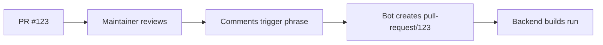

# CI/CD Workflows

Quick reference for Dynamo's CI/CD pipelines.

---

## When Does CI Run?

| Event | Workflows That Run |
|-------|-------------------|
| **PR opened/updated** | Direct checks (pre-commit, copyright, DCO, dynamo build) |
| **Maintainer triggers copy-pr-bot** | Backend builds + tests (via `pull-request/N` branch) |
| **Merge to main** | Full test suite + Rust checks (always) |
| **Nightly (12 AM PST)** | Full test suite + extended nightly tests |

---

## Required PR Checks

| Check | When It Runs | What It Does |
|-------|--------------|--------------|
| `pre-commit` | Every PR | Python formatting (black, isort), YAML validation |
| `copyright-checks` | Every PR | Validates SPDX headers |
| `DCO` | Every PR | Checks Developer Certificate of Origin signature |
| `dynamo-status-check` | Every PR | Builds core container, runs Rust + pytest |
| `backend-status-check` | After copy-pr-bot | Builds framework containers (vLLM, SGLang, TRT-LLM) + tests |

**For external PRs**: Only the first 4 run automatically. A maintainer must trigger `backend-status-check` via copy-pr-bot.

---

## How copy-pr-bot Works

Backend builds need access to secrets (AWS, Azure, GPUs) so they don't run directly on PRs.

**Trigger phrase**: Check copy-pr-bot documentation for the current trigger phrase.

---

## Three CI Modes

### PR Mode (`pr.yaml`)

**Purpose**: Fast feedback on what changed  
**Trigger**: Push to `pull-request/N` branches or `main`  
**Strategy**: Conditional - only builds changed frameworks  

| What | Details |
|------|---------|
| **Builds** | 2-14 container images (depends on changes) |
| **CUDA** | vLLM/SGLang: 12.9 & 13.0 TRT-LLM: 13.0 only |
| **Tests** | Framework-specific, amd64 only |
| **Time** | 30-90 min (depending on changes) |

### Post-Merge Mode (`ci-test-suite.yml`)

**Purpose**: Full validation after merge  
**Trigger**: Push to `main` or `release/*`  
**Strategy**: Always builds everything  

| What | Details |
|------|---------|
| **Builds** | Always 10 container images |
| **CUDA** | Same as PR mode |
| **Tests** | All frameworks, unit + integration + e2e |
| **Rust** | Always runs (not conditional) |
| **Slack** | Notifies on completion |
| **Time** | 3-4 hours |

### Nightly Mode (`ci-test-suite.yml`)

**Purpose**: Comprehensive nightly validation  
**Trigger**: Daily at 12:00 AM PST  
**Strategy**: Same as post-merge + extended tests  

| What | Details |
|------|---------|
| **Builds** | Always 10 container images |
| **Tests** | Includes long-running nightly-only tests |
| **Slack** | Notifies on completion |
| **Time** | 3-5 hours |

---

## Build Matrix

When all frameworks are built (post-merge/nightly):

| Framework | CUDA Versions | Architectures | Total |
|-----------|---------------|---------------|-------|
| vLLM | 12.9, 13.0 | amd64, arm64 | 4 images |
| SGLang | 12.9, 13.0 | amd64, arm64 | 4 images |
| TRT-LLM | 12.9 only | amd64, arm64 | 2 images |

**Total**: 10 container images

---

## Conditional Checks

Some checks only run when relevant files change:

| Check | Runs When | Files Watched |
|-------|-----------|---------------|
| **Rust checks** | `*.rs`, `Cargo.*` changed (PRs) Always (main) | All `.rs` files, `Cargo.toml`, `Cargo.lock` |
| **Backend builds** | Core/framework code changed | `components/`, `lib/`, `tests/`, `container/`, `*.py`, `*.rs` |
| **Frontend build** | Frontend code changed | `components/src/dynamo/frontend/`, `lib/llm/` |
| **Operator build** | Operator code changed | `deploy/operator/`, `deploy/helm/` |

---

## Test Types

| Type | What It Tests | Where It Runs |
|------|---------------|---------------|
| **Unit** | Individual components | amd64 GPU |
| **Integration** | Component interactions | amd64 GPU |
| **E2E** | End-to-end scenarios | amd64 GPU |
| **Deployment** | Kubernetes deployments | AKS cluster (main branch only) |

**Note**: ARM64 tests run in collect-only mode (no GPU available).

---

## Image Tags

Images pushed to ECR and ACR:

| Pipeline | Tag Pattern | Example |
|----------|-------------|---------|
| **PR** | `{sha}-{framework}-{arch}` | `ai-dynamo/dynamo:abc123-vllm-amd64` |
| **Post-merge** | `main-{framework}-{arch}` | `ai-dynamo/dynamo:main-vllm-amd64` |
| **Nightly** | `nightly-{framework}-{arch}` | `ai-dynamo/dynamo:nightly-vllm-amd64` |

For CUDA 13 images, add `-cuda13` before architecture: `nightly-vllm-cuda13-amd64`

---

## Troubleshooting

For CI issues and fixes, see [TROUBLESHOOTING.md](./TROUBLESHOOTING.md).

