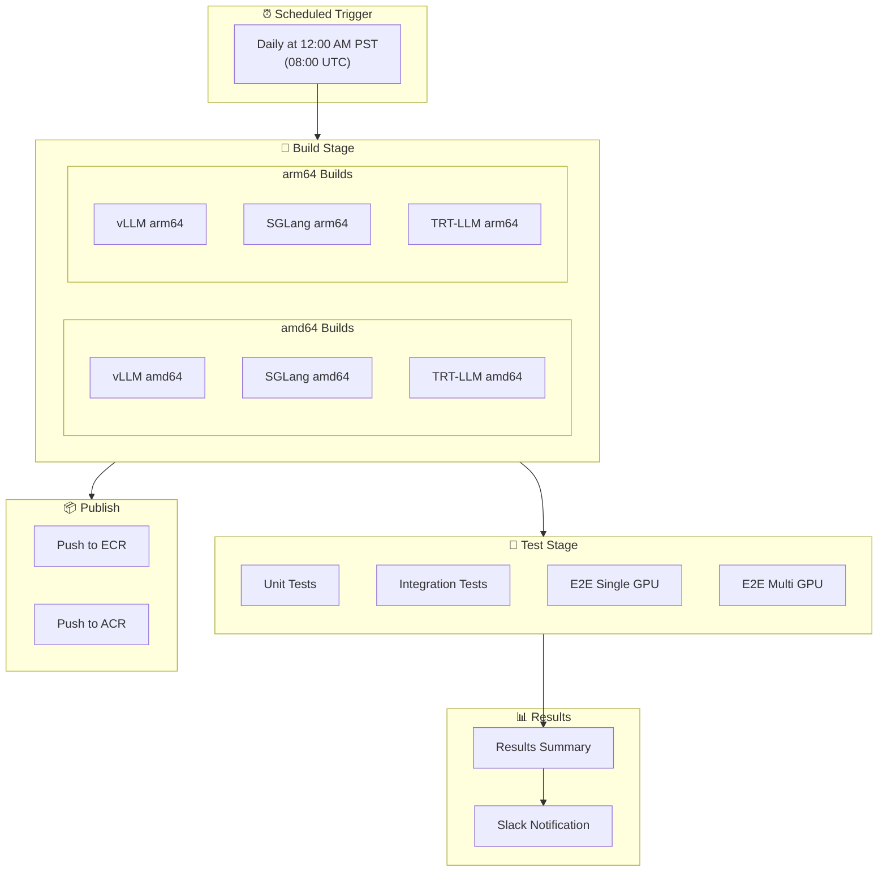
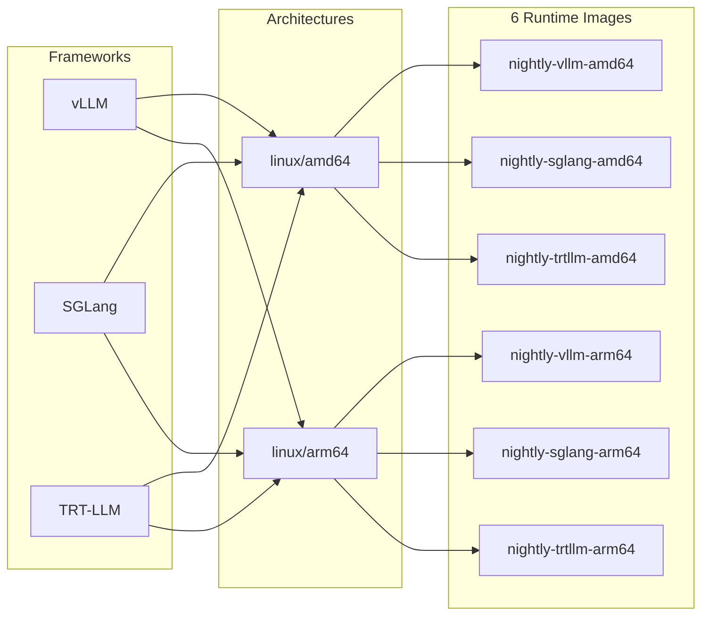
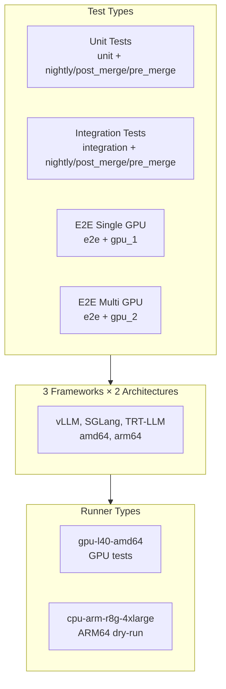
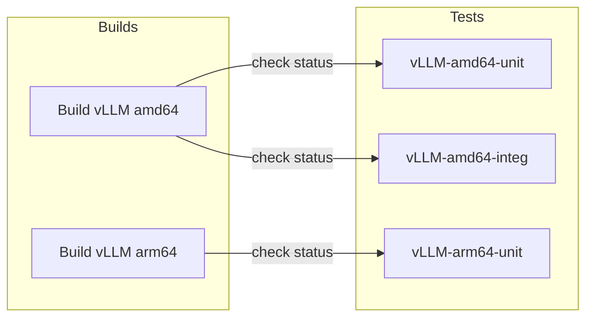
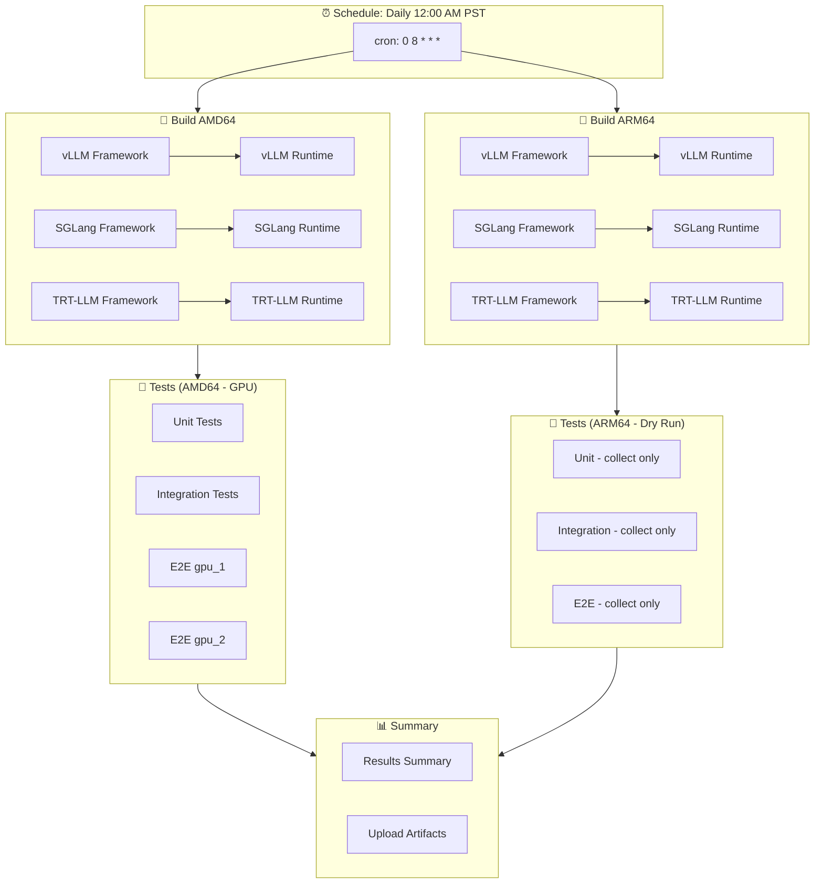

# Nightly CI Workflow

This document explains the nightly CI pipeline that runs scheduled builds and comprehensive tests across all frameworks and architectures.

## Overview

The nightly CI runs every day at **12:00 AM PST (08:00 UTC)** and performs:
- Multi-architecture container builds (amd64 + arm64)
- Comprehensive test suites across all frameworks
- Container publishing to registries
- Results summary and notifications

---

## Nightly Pipeline Flow



---

## Build Stage

### Container Images Built

For each framework (vLLM, SGLang, TRT-LLM), two images are built:

| Image Type | Purpose | Tag Pattern |
|------------|---------|-------------|
| **Framework** | Build dependencies, used as cache | `main-{framework}-framework-{arch}` |
| **Runtime** | Deployable image with all components | `nightly-{framework}-{arch}` |

### Build Matrix



### Build Process

Each build job:
1. **Pulls cached images** from ECR for layer reuse
2. **Builds framework image** (dependencies, framework installation)
3. **Pushes framework image** to ECR (for next build's cache)
4. **Builds runtime image** (full deployable container)
5. **Pushes runtime image** to ECR and ACR

### ARM64 Build Overrides

ARM64 builds use specific image tags for compatibility:

| Framework | Base Image Tag | CUDA Version | Torch Backend |
|-----------|----------------|--------------|---------------|
| vLLM | `25.06-cuda12.9-devel-ubuntu24.04` | 129 | cu129 |
| TRT-LLM | `25.06-py3` | 129 | cu129 |
| SGLang | (default) | (default) | (default) |

---

## Test Stage

Tests run **after builds complete** and pull the freshly built nightly images.

### Test Matrix



### Test Execution Details

| Test Type | Timeout | pytest Markers | GPU Required |
|-----------|---------|----------------|--------------|
| Unit | 45 min | `unit and (nightly or post_merge or pre_merge)` | Yes (amd64) |
| Integration | 90 min | `integration and (nightly or post_merge or pre_merge)` | Yes (amd64) |
| E2E Single GPU | 120 min | `{framework} and e2e and gpu_1` | Yes |
| E2E Multi GPU | 150 min | `(nightly or post_merge or pre_merge) and e2e and gpu_2` | Yes |

### ARM64 Test Behavior

ARM64 tests run in **dry-run mode** (collect-only) since GPU runners are amd64-only:
- Tests are collected to verify they can be discovered
- No actual test execution occurs
- Useful for catching import errors and test configuration issues

---

## Test Dependencies

Tests wait for their corresponding build to succeed:



Each test job:
1. Queries GitHub API for build job status
2. **Fails immediately** if build failed (no wasted GPU time)
3. Pulls the nightly image from ECR
4. Runs tests using the `pytest` composite action

---

## Results and Notifications

### Results Summary

After all tests complete, a summary job:
1. Gathers metadata for all jobs via GitHub API
2. Generates a markdown table with:
   - Job name and status
   - Runner used
   - Duration in minutes
   - Link to logs and artifacts

Example output:
```
| Stage | Status | Runner | Duration (min) | Artifacts |
|-------|--------|--------|----------------|-----------|
| Build vllm (amd64) | success | cpu-amd-m5-4xlarge | 45 | [Log & Artifacts](...) |
| vllm-amd64-unit | success | gpu-l40-amd64 | 12 | [Log & Artifacts](...) |
| vllm-amd64-integ | failure | gpu-l40-amd64 | 28 | [Log & Artifacts](...) |
```

### Artifacts

Each test run uploads:
- **JUnit XML reports** - Machine-readable test results
- **Build metrics** - Container build timing and cache statistics
- **Test logs** - Detailed pytest output

Artifacts are retained for **7 days**.

---

## Image Tags and Registries

### Tag Naming Convention

| Tag Pattern | Example | Purpose |
|-------------|---------|---------|
| `nightly-{framework}-{arch}` | `nightly-vllm-amd64` | Latest nightly build |
| `nightly-{framework}-{arch}-run-{run_id}` | `nightly-vllm-amd64-run-12345` | Specific run (debugging) |
| `main-{framework}-framework-{arch}` | `main-vllm-framework-amd64` | Framework layer cache |

### Registry Destinations

| Registry | Images Pushed | Purpose |
|----------|---------------|---------|
| AWS ECR | Framework + Runtime | Primary storage, caching |
| Azure ACR | Runtime only | Secondary distribution |

---

## Timing and Resources

### Schedule

- **Cron**: `0 8 * * *` (08:00 UTC daily)
- **Equivalent**: 12:00 AM PST / 1:00 AM PDT

### Typical Durations

| Stage | Typical Duration |
|-------|------------------|
| amd64 Builds | 60-90 minutes |
| arm64 Builds | 90-120 minutes |
| Unit Tests | 10-20 minutes |
| Integration Tests | 30-60 minutes |
| E2E Tests | 60-90 minutes |
| **Total Pipeline** | **3-4 hours** |

### Runner Resources

| Runner Group | Specs | Used For |
|--------------|-------|----------|
| `cpu-amd-m5-4xlarge` | 16 vCPU, 64GB RAM | amd64 builds |
| `cpu-arm-r8g-4xlarge` | 16 vCPU, 64GB RAM | arm64 builds, dry-run tests |
| `gpu-l40-amd64` | L40 GPU, 48GB VRAM | GPU tests |

---

## Workflow Diagram (Complete)



---

## Related Documentation

- [PR Workflow](./PR_WORKFLOW.md) - Pull request CI
- [Troubleshooting](./TROUBLESHOOTING.md) - Common issues
- [Test Documentation](../tests/README.md) - pytest markers

