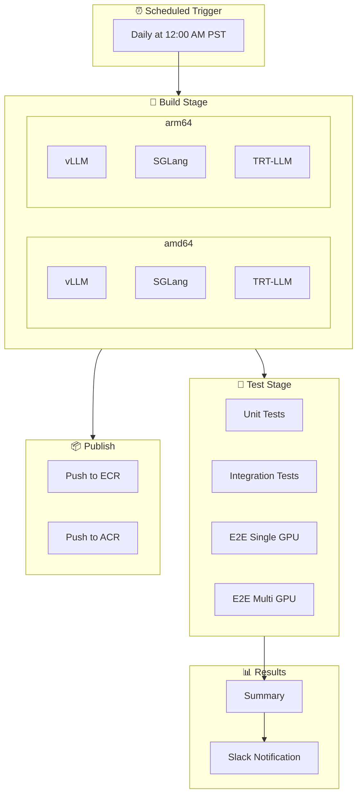
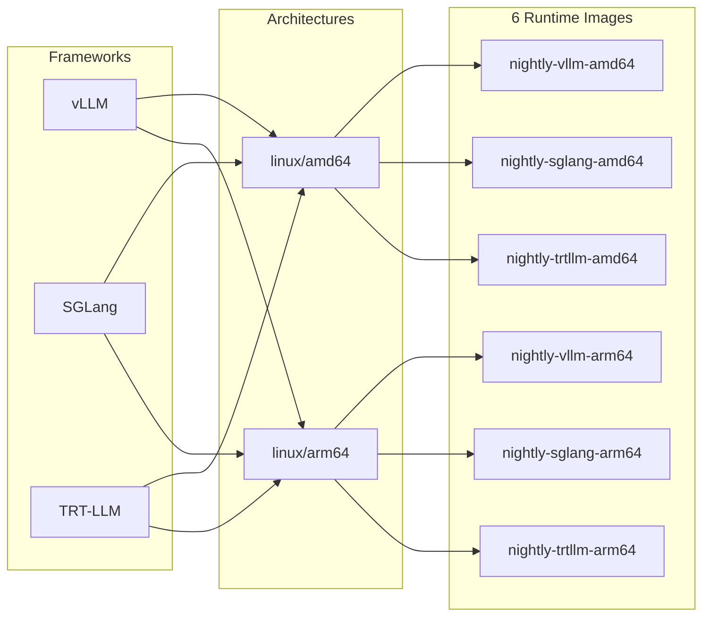
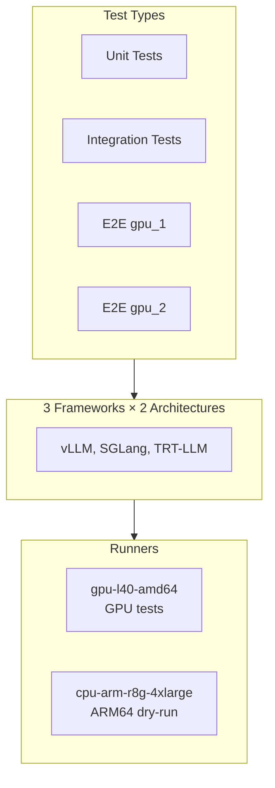
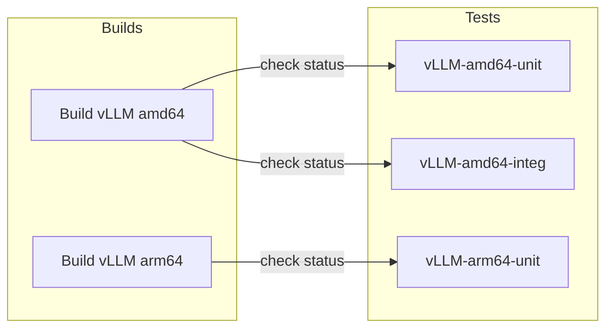
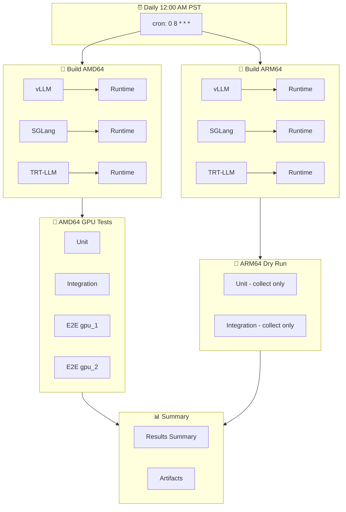

# Nightly CI Workflow

**Schedule**: Daily at 12:00 AM PST (08:00 UTC)

---

## Pipeline Overview

---

## Build Matrix

---

## Test Matrix

### Test Details

| Test Type | Timeout | pytest Markers |
|-----------|---------|----------------|
| Unit | 45 min | `unit and (nightly or post_merge or pre_merge)` |
| Integration | 90 min | `integration and (nightly or post_merge or pre_merge)` |
| E2E Single GPU | 120 min | `{framework} and e2e and gpu_1` |
| E2E Multi GPU | 150 min | `e2e and gpu_2` |

> ARM64 tests run in dry-run mode (collect-only) - no GPU runners available.

---

## Test Dependencies

Tests fail immediately if their build failed (no wasted GPU time).

---

## Image Tags

| Tag Pattern | Example | Purpose |
|-------------|---------|---------|
| `nightly-{framework}-{arch}` | `nightly-vllm-amd64` | Latest nightly |
| `nightly-{framework}-{arch}-run-{id}` | `nightly-vllm-amd64-run-12345` | Specific run |
| `main-{framework}-framework-{arch}` | `main-vllm-framework-amd64` | Layer cache |

---

## Timing

| Stage | Duration |
|-------|----------|
| amd64 Builds | 60-90 min |
| arm64 Builds | 90-120 min |
| Unit Tests | 10-20 min |
| Integration Tests | 30-60 min |
| E2E Tests | 60-90 min |
| **Total** | **3-4 hours** |

---

## Complete Flow

---

## Related

- [README](./README.md) - Workflow details
- [PR Workflow](./PR_WORKFLOW.md)
- [Troubleshooting](./TROUBLESHOOTING.md)
