# Nightly CI Workflow

**Schedule**: Daily at 12:00 AM PST (08:00 UTC)  
**Workflow**: `nightly-ci.yml` → `ci-test-suite.yml`  
**Runners**: Production self-hosted runners (`prod-builder-*`, `prod-default-v1`)

The nightly pipeline builds all frameworks for both architectures and runs comprehensive test suites. Unlike PR builds, nightly builds all frameworks regardless of what changed.

## Reusable Workflow Architecture

The nightly CI uses the `ci-test-suite.yml` reusable workflow with these parameters:
- `pipeline_type`: `nightly`
- `include_nightly_marks`: `true`
- `image_prefix`: `nightly`
- `enable_slack_notification`: `true`

This same workflow is also used by `post-merge-ci.yml` with different parameters.

---

## Build Stage

Each framework builds for multiple CUDA versions and architectures:

### CUDA Version Support
- **vLLM**: CUDA 12.9 and CUDA 13.0
- **SGLang**: CUDA 12.9 and CUDA 13.0
- **TRT-LLM**: CUDA 13.0 only

Each build produces two images:
- **Framework image**: Build dependencies, used as cache for subsequent builds
- **Runtime image**: Deployable container with all components

---

## Test Stage

Tests wait for their corresponding build to complete. If a build fails, tests fail immediately (no wasted GPU time).

```mermaid
flowchart TD
    subgraph Tests["Test Types"]
        U[Unit Tests]
        I[Integration Tests]
        E1[E2E gpu_1]
        E2[E2E gpu_2]
    end

    subgraph Frameworks["3 Frameworks × 2 CUDA × 2 Arch"]
        F[vLLM, SGLang, TRT-LLM]
    end

    subgraph Runners
        R1[prod-builder-amd-gpu-v1<br/>AMD64 GPU tests]
        R2[prod-builder-arm-v1<br/>ARM64 CPU-only]
    end

    Tests --> Frameworks --> Runners
```

### Test Details

| Test Type | Timeout | pytest Markers |
|-----------|---------|----------------|
| Unit | 45 min | `unit and (nightly or post_merge or pre_merge)` |
| Integration | 90 min | `integration and (nightly or post_merge or pre_merge)` |
| E2E Single GPU | 120 min | `{framework} and e2e and gpu_1` |
| E2E Multi GPU | 150 min | `e2e and gpu_2` |

> **Note**: ARM64 tests run in dry-run mode (collect-only) since no GPU runners are available for ARM64.

---

## Test Dependencies

---

## Image Tags

Images are pushed to AWS ECR and Azure ACR with the following tag patterns:

| Tag Pattern | Example | Purpose |
|-------------|---------|---------|
| `nightly-{framework}-cuda{ver}-{arch}` | `nightly-vllm-cuda13-amd64` | Latest nightly by CUDA version |
| `nightly-{framework}-{arch}` | `nightly-vllm-amd64` | Latest nightly (primary CUDA) |
| `nightly-{framework}-cuda{ver}-{arch}-run-{id}` | `nightly-vllm-cuda13-amd64-run-12345` | Specific run by CUDA version |
| `main-{framework}-framework-{arch}` | `main-vllm-framework-amd64` | Layer cache |

**Note**: CUDA version in tags is the major version only (e.g., `cuda12` for CUDA 12.9, `cuda13` for CUDA 13.0).

---

## Timing

| Stage | Duration |
|-------|----------|
| amd64 Builds | 60-90 min |
| arm64 Builds | 90-120 min |
| Unit Tests | 10-20 min |
| Integration Tests | 30-60 min |
| E2E Tests | 60-90 min |
| **Total** | **3-4 hours** |

---

## Deployment Tests

After all builds and tests complete successfully, deployment tests run on Kubernetes (AKS):

| Framework | Profiles Tested |
|-----------|-----------------|
| vLLM | agg, agg_router, disagg, disagg_router |
| SGLang | agg, agg_router, disagg, disagg_router |
| TRT-LLM | agg, agg_router, disagg, disagg_router |

Each test:
1. Deploys Dynamo operator
2. Creates DynamoGraphDeployment
3. Waits for pods to be ready
4. Sends test inference request
5. Validates response
6. Cleans up resources

---

## Complete Flow

```mermaid
flowchart TB
    subgraph Schedule["⏰ Daily 12:00 AM PST"]
        Cron["cron: 0 8 * * *<br/>via ci-test-suite.yml"]
    end

    subgraph BuildAMD["🔨 Build AMD64 (CUDA 12.9 & 13.0)"]
        BA1[vLLM] --> BA2[Runtime]
        BA3[SGLang] --> BA4[Runtime]
        BA5[TRT-LLM] --> BA6[Runtime]
    end

    subgraph BuildARM["🔨 Build ARM64 (CUDA 12.9 & 13.0)"]
        BB1[vLLM] --> BB2[Runtime]
        BB3[SGLang] --> BB4[Runtime]
        BB5[TRT-LLM] --> BB6[Runtime]
    end

    subgraph TestAMD["🧪 AMD64 GPU Tests"]
        TA1[Unit]
        TA2[Integration]
        TA3[E2E gpu_1]
        TA4[E2E gpu_2]
    end

    subgraph TestARM["🧪 ARM64 CPU-only"]
        TB1[Unit - collect only]
        TB2[Integration - collect only]
    end

    subgraph Deploy["🚀 Deployment Tests"]
        D1[Deploy Operator]
        D2[Test All Profiles]
        D3[Cleanup]
    end

    subgraph Summary["📊 Summary"]
        S1[Slack Notification]
        S2[Artifacts]
    end

    Cron --> BuildAMD & BuildARM
    BuildAMD --> TestAMD
    BuildARM --> TestARM
    TestAMD & TestARM --> Deploy
    Deploy --> Summary
```

---

## Related

- [README](./README.md) - Workflow details and configuration
- [PR Workflow](./PR_WORKFLOW.md) - Pull request CI
- [Troubleshooting](./TROUBLESHOOTING.md) - Common CI issues
