# Nightly CI Workflow

**Schedule**: Daily at 12:00 AM PST (08:00 UTC)  
**Entry Point**: `nightly-ci.yml` → calls → `ci-test-suite.yml`  
**Runners**: Production self-hosted runners with GPU support

The nightly pipeline builds all frameworks for both architectures and runs the complete test suite. Unlike PR builds, nightly builds all frameworks regardless of what changed and includes extended nightly tests.

## Reusable Workflow Architecture

Both nightly and post-merge CI use the same `ci-test-suite.yml` reusable workflow with different parameters:

| Parameter | Nightly | Post-Merge |
|-----------|---------|------------|
| `pipeline_type` | `nightly` | `post_merge` |
| `include_nightly_marks` | `true` | `false` |
| `image_prefix` | `nightly` | `main` |
| `enable_slack_notification` | `true` | `true` |

**Why this matters**: The `include_nightly_marks` parameter controls which pytest marks are run. Nightly includes long-running tests that would be too slow for every PR.

---

## Build Stage

The `ci-test-suite.yml` workflow has **4 build jobs** that run in parallel:

### Build Jobs

| Job | Frameworks | Architecture | CUDA Version | Runner |
|-----|------------|--------------|--------------|--------|
| `build-amd64` | vLLM, SGLang, TRT-LLM | amd64 | 12.9 (default) | `prod-builder-amd-v1` |
| `build-arm64` | vLLM, SGLang, TRT-LLM | arm64 | 12.9 (default) | `prod-builder-arm-v1` |
| `build-cuda13-amd64` | vLLM, SGLang | amd64 | 13.0 | `prod-builder-amd-v1` |
| `build-cuda13-arm64` | vLLM, SGLang | arm64 | 13.0 | `prod-builder-arm-v1` |

### CUDA Version Support
- **vLLM**: Builds for both CUDA 12.9 and 13.0 (4 images total)
- **SGLang**: Builds for both CUDA 12.9 and 13.0 (4 images total)
- **TRT-LLM**: Builds only for CUDA 12.9 (2 images total)

**Total builds per run**: 10 container images

---

## Test Stage

The `ci-test-suite.yml` workflow has **5 test job types** that run after builds complete:

### Test Jobs

| Job | Frameworks | Architectures | Timeout | Runner | GPU Required |
|-----|------------|---------------|---------|--------|--------------|
| `unit-tests` | vLLM, SGLang, TRT-LLM | amd64, arm64 | 45 min | GPU (amd64) / CPU (arm64) | amd64 only |
| `integration-tests` | vLLM, SGLang, TRT-LLM | amd64, arm64 | 90 min | GPU (amd64) / CPU (arm64) | amd64 only |
| `e2e-single-gpu-tests` | vLLM, SGLang, TRT-LLM | amd64, arm64 | 120 min | GPU (amd64) / CPU (arm64) | amd64 only |
| `e2e-multi-gpu-tests` | vLLM, SGLang, TRT-LLM | amd64 only | 150 min | GPU | Yes |
| `fault-tolerance-tests` | vLLM, TRT-LLM | amd64 only | 120 min | GPU | Yes |

**Total test jobs per nightly run**: ~45 test jobs (3 frameworks × 2-3 architectures × ~5 test types)

### Test Dependencies

Tests check if the corresponding build succeeded before running. If a build fails, dependent tests are skipped (no wasted GPU time).

### ARM64 Test Behavior

ARM64 tests run in **collect-only mode** (dry-run) since ARM64 runners don't have GPUs:
- Unit tests: Collect only
- Integration tests: Collect only  
- E2E tests: Collect only
- Multi-GPU tests: Not run on ARM64
- Fault tolerance: Not run on ARM64

---

## Test Dependencies

Each test job checks if its corresponding build succeeded before running:

**How it works**:
1. Test job starts and queries GitHub API for build status
2. If build succeeded → Run tests with that framework's image
3. If build failed/skipped → Skip tests to avoid wasting resources
4. If build still running → Test fails with error

---

## Image Tags

Images are pushed to AWS ECR (`{aws-account}.dkr.ecr.{region}.amazonaws.com`) and Azure ACR with these tags:

### CUDA 12.9 (Default) Images

| Tag | Example | Framework |
|-----|---------|-----------|
| `nightly-{framework}-{arch}` | `ai-dynamo/dynamo:nightly-vllm-amd64` | vLLM, SGLang, TRT-LLM |
| `nightly-{framework}-{arch}-run-{id}` | `ai-dynamo/dynamo:nightly-vllm-amd64-run-12345` | vLLM, SGLang, TRT-LLM |

### CUDA 13.0 Images

| Tag | Example | Framework |
|-----|---------|-----------|
| `nightly-{framework}-cuda13-{arch}` | `ai-dynamo/dynamo:nightly-vllm-cuda13-amd64` | vLLM, SGLang only |
| `nightly-{framework}-cuda13-{arch}-run-{id}` | `ai-dynamo/dynamo:nightly-vllm-cuda13-amd64-run-98765` | vLLM, SGLang only |

**Image prefix**: Controlled by `image_prefix` parameter (`nightly` for nightly, `main` for post-merge)

---

## Timing

Build and test jobs run in parallel where possible, with tests waiting for their dependencies:

| Stage | Duration | Parallelism |
|-------|----------|-------------|
| Build Jobs (4 jobs) | 60-120 min | All 4 run in parallel |
| Unit Tests (~9 jobs) | Up to 45 min | Run in parallel after builds |
| Integration Tests (~9 jobs) | Up to 90 min | Run in parallel after builds |
| E2E Single GPU (~9 jobs) | Up to 120 min | Run in parallel after builds |
| E2E Multi GPU (~3 jobs) | Up to 150 min | Run in parallel after builds |
| Fault Tolerance (~2 jobs) | Up to 120 min | Run in parallel after builds |
| **Total Pipeline** | **~3-4 hours** | Depends on longest path |

**Longest paths**:
- Build (120 min) → E2E Multi GPU (150 min) = **~4.5 hours**
- Build (120 min) → Fault Tolerance (120 min) = **~4 hours**

---

## Complete Flow

```mermaid
flowchart TB
    subgraph Trigger["⏰ Daily 12:00 AM PST"]
        A[nightly-ci.yml<br/>cron: 0 8 * * *]
    end

    subgraph Workflow["📋 ci-test-suite.yml"]
        direction TB
        
        subgraph Builds["🔨 4 Build Jobs (Parallel)"]
            B1[build-amd64<br/>CUDA 12.9]
            B2[build-arm64<br/>CUDA 12.9]
            B3[build-cuda13-amd64]
            B4[build-cuda13-arm64]
        end

        subgraph Tests["🧪 Test Jobs (Parallel, after builds)"]
            T1[unit-tests<br/>~9 jobs]
            T2[integration-tests<br/>~9 jobs]
            T3[e2e-single-gpu<br/>~9 jobs]
            T4[e2e-multi-gpu<br/>~3 jobs]
            T5[fault-tolerance<br/>~2 jobs]
        end

        subgraph Summary["📊 Summary & Notify"]
            S1[results-summary]
            S2[notify-slack]
        end
    end

    A --> Builds
    Builds --> Tests
    Tests --> Summary
```

### Pipeline Characteristics

- **Total jobs**: ~60 jobs per nightly run
- **Parallelism**: High - builds and tests run concurrently where possible
- **Test selection**: Includes `nightly` pytest marks (long-running tests)
- **Notifications**: Slack alerts on completion (success or failure)
- **Artifacts**: Test results, logs, and failure summaries
- **Registry**: Images pushed to AWS ECR and Azure ACR

---

## Nightly vs Post-Merge

Both workflows use `ci-test-suite.yml`, but with different configurations:

| Aspect | Nightly | Post-Merge |
|--------|---------|------------|
| **Trigger** | Cron (daily) | Push to `main`/`release/*` |
| **Entry Point** | `nightly-ci.yml` | `post-merge-ci.yml` |
| **Image Prefix** | `nightly` | `main` |
| **Pytest Marks** | Includes `nightly` marks | Excludes `nightly` marks |
| **Test Coverage** | Full (including long tests) | Standard (faster tests) |
| **Notification** | Always via Slack | Always via Slack |
| **Manual Trigger** | Yes (`workflow_dispatch`) | No |

---

## Related

- [README](./README.md) - Workflow details and configuration
- [PR Workflow](./PR_WORKFLOW.md) - Pull request CI
- [Troubleshooting](./TROUBLESHOOTING.md) - Common CI issues
