# Nightly CI Workflow

**Schedule**: Daily at 12:00 AM PST (08:00 UTC)
**Workflow**: `nightly-ci.yml`

The nightly pipeline builds all frameworks for both architectures and runs comprehensive test suites. Unlike PR builds, nightly builds all frameworks regardless of what changed.

---

## Build Stage

Each framework builds two images:
- **Framework image**: Build dependencies, used as cache for subsequent builds
- **Runtime image**: Deployable container with all components

---

## Test Stage

Tests wait for their corresponding build to complete. If a build fails, tests fail immediately (no wasted GPU time).

```mermaid
flowchart TD
    subgraph Tests["Test Types"]
        U[Unit Tests]
        I[Integration Tests]
        E1[E2E gpu_1]
        E2[E2E gpu_2]
    end

    subgraph Frameworks["3 Frameworks × 2 Architectures"]
        F[vLLM, SGLang, TRT-LLM]
    end

    subgraph Runners
        R1[gpu-l40-amd64<br/>GPU tests]
        R2[cpu-arm-r8g-4xlarge<br/>ARM64 dry-run]
    end

    Tests --> Frameworks --> Runners
```

### Test Details

| Test Type | Timeout | pytest Markers |
|-----------|---------|----------------|
| Unit | 45 min | `unit and (nightly or post_merge or pre_merge)` |
| Integration | 90 min | `integration and (nightly or post_merge or pre_merge)` |
| E2E Single GPU | 120 min | `{framework} and e2e and gpu_1` |
| E2E Multi GPU | 150 min | `e2e and gpu_2` |

> **Note**: ARM64 tests run in dry-run mode (collect-only) since no GPU runners are available for ARM64.

---

## Test Dependencies

---

## Image Tags

Images are pushed to AWS ECR and Azure ACR with the following tag patterns:

| Tag Pattern | Example | Purpose |
|-------------|---------|---------|
| `nightly-{framework}-{arch}` | `nightly-vllm-amd64` | Latest nightly |
| `nightly-{framework}-{arch}-run-{id}` | `nightly-vllm-amd64-run-12345` | Specific run |
| `main-{framework}-framework-{arch}` | `main-vllm-framework-amd64` | Layer cache |

---

## Timing

| Stage | Duration |
|-------|----------|
| amd64 Builds | 60-90 min |
| arm64 Builds | 90-120 min |
| Unit Tests | 10-20 min |
| Integration Tests | 30-60 min |
| E2E Tests | 60-90 min |
| **Total** | **3-4 hours** |

---

## Complete Flow

---

## Related

- [README](./README.md) - Workflow details and configuration
- [PR Workflow](./PR_WORKFLOW.md) - Pull request CI
- [Troubleshooting](./TROUBLESHOOTING.md) - Common CI issues
