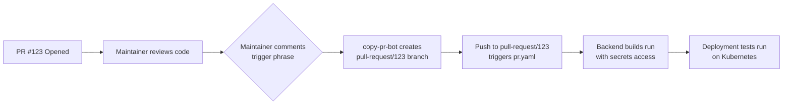
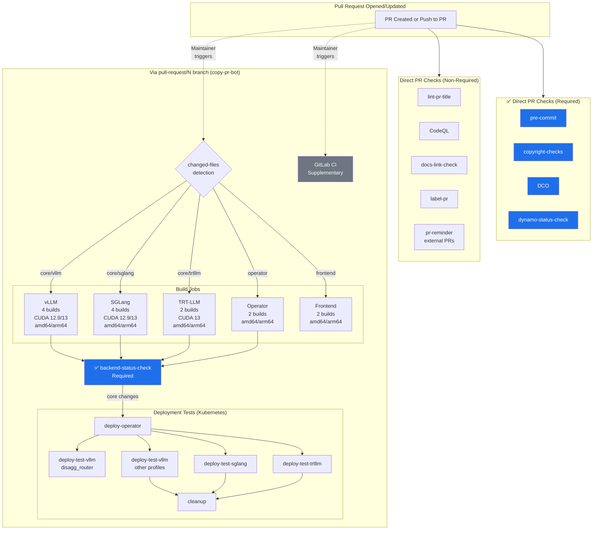
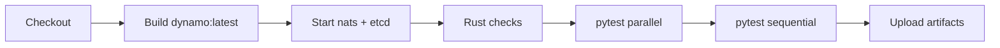
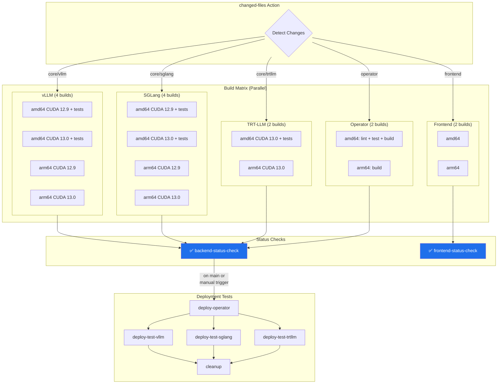
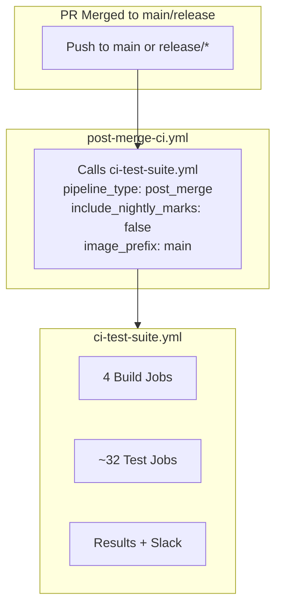

# PR Workflow

> **TL;DR**: PRs have 5 required checks. Direct checks run immediately. Backend builds require a maintainer to trigger copy-pr-bot which creates a `pull-request/N` branch.

## Required Checks

| Check | Trigger | Workflow | Description |
|-------|---------|----------|-------------|
| `pre-commit` | Direct | `pre-merge.yml` | Code formatting (black, isort, YAML) |
| `copyright-checks` | Direct | `copyright-checks.yml` | SPDX header validation |
| `DCO` | Direct | DCO App | Developer Certificate of Origin |
| `dynamo-status-check` | Direct | `container-validation-dynamo.yml` | Core container + Rust + pytest |
| `backend-status-check` | Via copy-pr-bot | `pr.yaml` | Framework builds (up to 14 images) + tests |

**Key point**: First 4 checks run immediately. `backend-status-check` requires maintainer to trigger copy-pr-bot.

---

## How copy-pr-bot Works

Backend builds and deployment tests don't run on direct PR events for security reasons. They require a maintainer to trigger **copy-pr-bot**.

**Why this security model?**
- External contributors can't access secrets (AWS, Azure, etc.)
- Prevents malicious code from running with privileged access
- Maintainer review required before running expensive GPU builds

**What copy-pr-bot does:**
1. Creates/updates `pull-request/{PR_NUMBER}` branch with PR's latest code
2. Push event triggers `pr.yaml` workflow
3. Workflow has full access to secrets and runners
4. On subsequent PR updates, bot automatically updates the branch

This applies to **both internal and external PRs**.

---

## PR Flow

### Flow Summary

**Stage 1: Immediate (Direct PR Checks)**
- Triggered automatically when PR is opened or updated
- 4 required checks + 5 non-required checks run in parallel
- Fast feedback (usually completes in 5-15 minutes)

**Stage 2: Copy-PR-Bot Trigger (Backend Builds)**
- Maintainer comments to trigger copy-pr-bot
- Bot creates/updates `pull-request/N` branch
- Push to that branch triggers `pr.yaml` workflow

**Stage 3: Backend Builds & Tests**
- `changed-files` action detects what changed
- Builds only affected frameworks (conditional)
- Up to 14 container images built in parallel
- amd64 builds run tests, arm64 builds skip tests
- All builds must pass for `backend-status-check` to pass

**Stage 4: Deployment Tests (Conditional)**
- Only runs on:
  - Push to `main` branch, OR
  - Manual workflow dispatch trigger
- Tests Kubernetes deployments end-to-end
- Uses freshly built images from Stage 3

---

## Core Dynamo Build (`container-validation-dynamo.yml`)

Runs on **all PRs** directly. Builds the core Dynamo container and runs Rust checks + pytest.

---

## Backend Builds (`pr.yaml`)

Only runs when code is pushed to `pull-request/N` branches or `main`/`release/*`. Uses the `changed-files` action to determine which frameworks to build.

### Build Matrix

Each framework builds multiple combinations:

| Framework | CUDA Versions | Architectures | Total Builds | Tests Run On |
|-----------|---------------|---------------|--------------|--------------|
| **vLLM** | 12.9, 13.0 | amd64, arm64 | **4** | amd64 GPU only |
| **SGLang** | 12.9, 13.0 | amd64, arm64 | **4** | amd64 GPU only |
| **TRT-LLM** | 13.0 only | amd64, arm64 | **2** | amd64 GPU only |
| **Operator** | N/A | amd64, arm64 | **2** | Linting/tests |
| **Frontend** | N/A | amd64, arm64 | **2** | No tests |

**Maximum total builds**: 14 container images (when all components change)

### Deployment Tests

Deployment tests run **only on main branch or manual trigger** (not on every `pull-request/N` branch):

| Framework | Profiles Tested | Timeout | Runner |
|-----------|-----------------|---------|--------|
| **vLLM** | disagg_router (always) agg, agg_router, disagg (main/manual) | 30 min each | `prod-default-v1` |
| **SGLang** | agg, agg_router (main/manual) | 30 min each | `prod-default-v1` |
| **TRT-LLM** | agg, agg_router, disagg, disagg_router (main/manual) | 30 min each | `prod-default-v1` |

Each deployment test:
1. Deploys Dynamo operator to ephemeral Kubernetes namespace
2. Creates DynamoGraphDeployment with test profile
3. Waits for all pods to be ready (timeout: 30 min)
4. Port-forwards to frontend pod
5. Sends test inference request to validate end-to-end flow
6. Validates response format and content
7. Cleans up deployment
8. Cleans up namespace (happens in final cleanup job)

---

## Path Filters (changed-files action)

The `changed-files` custom action determines which jobs run:

| Filter | Used By | Paths |
|--------|---------|-------|
| `core` | All backend builds | `components/**`, `lib/**`, `tests/**`, `container/**`, `*.py`, `*.rs` |
| `vllm` | vLLM builds & GitLab CI | `container/Dockerfile.vllm`, `components/src/dynamo/vllm/**`, `container/deps/requirements.vllm.txt` |
| `sglang` | SGLang builds & GitLab CI | `container/Dockerfile.sglang`, `components/src/dynamo/sglang/**` |
| `trtllm` | TRT-LLM builds & GitLab CI | `container/Dockerfile.trtllm`, `components/src/dynamo/trtllm/**`, `container/deps/trtllm/**` |
| `operator` | Operator builds | `deploy/operator/**`, `deploy/helm/**` |
| `deploy` | Deployment tests | `examples/backends/**/deploy/**` |
| `frontend` | Frontend builds | `components/src/dynamo/frontend/**`, `lib/llm/src/**` |

**Logic**: Backend jobs run if `core == true` OR framework-specific changes detected.

---

## Post-Merge

After merge to `main` or `release/*`, the `post-merge-ci.yml` workflow triggers automatically and calls `ci-test-suite.yml`.

### Post-Merge vs PR: Key Differences

| Aspect | PR (`pr.yaml`) | Post-Merge (`ci-test-suite.yml`) |
|--------|----------------|----------------------------------|
| **Workflow Architecture** | Direct jobs with matrix | Reusable workflow (shared with nightly) |
| **Trigger** | Push to `pull-request/N` branch | Push to `main`/`release/*` |
| **Build Logic** | Conditional (changed files only) | Always builds all frameworks |
| **CUDA Versions** | 12.9 and 13.0 (vLLM, SGLang) 13.0 (TRT-LLM) | Same: 12.9 + 13.0 for vLLM/SGLang 12.9 for TRT-LLM |
| **Architectures** | amd64, arm64 | amd64, arm64 |
| **Total Builds** | 2-10 (depends on changes) | Always 10 builds |
| **Test Types** | Pre-merge marks only | Post-merge marks (no nightly) |
| **Test Jobs** | Run per framework | ~32 test jobs total |
| **Deployment Tests** | Yes (in `pr.yaml`) | No (not in `ci-test-suite.yml`) |
| **Slack Notifications** | No | Yes |
| **Image Tags** | `{sha}-{framework}-{arch}` | `main-{framework}-{arch}` |

### Why Two Different Workflows?

**PR Workflow (`pr.yaml`)**:
- Optimized for **speed**: Only builds/tests what changed
- Includes **deployment tests** to validate K8s integration
- Runs on `pull-request/N` branches (triggered by copy-pr-bot)

**Post-Merge/Nightly (`ci-test-suite.yml`)**:
- Optimized for **coverage**: Always builds everything
- Reusable workflow shared by nightly and post-merge
- More comprehensive but slower (3-4 hours)

---

## Related

- [README](./README.md) - Workflow details and configuration
- [Nightly Workflow](./NIGHTLY_WORKFLOW.md) - Scheduled builds
- [Troubleshooting](./TROUBLESHOOTING.md) - Common CI issues
