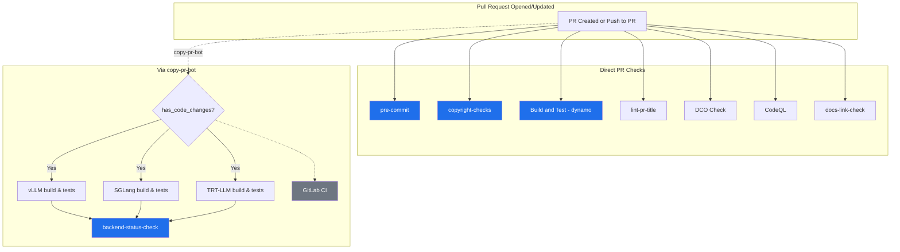
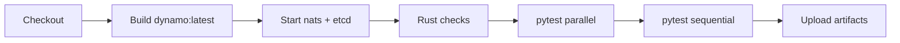
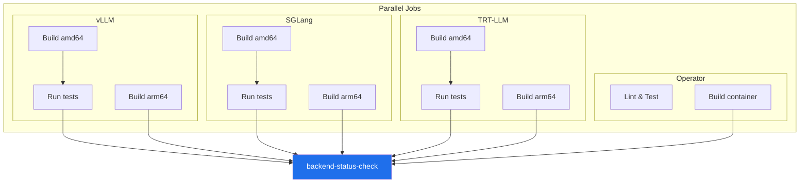
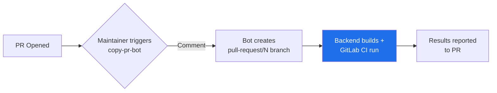
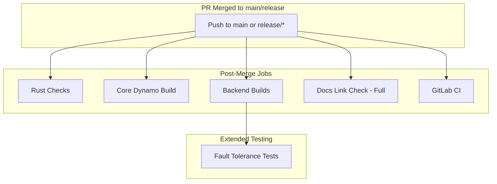

# PR Workflow

## Required Checks

| Check | Trigger |
|-------|---------|
| `pre-commit` | Direct |
| `copyright-checks` | Direct |
| `Build and Test - dynamo` | Direct |
| `backend-status-check` | copy-pr-bot |

---

## PR Flow

---

## Core Dynamo Build

---

## Backend Builds

> ⚠️ Only runs via copy-pr-bot (`pull-request/N` branches)

---

## copy-pr-bot Flow

---

## Post-Merge

### Post-Merge vs PR

| Aspect | PR | Post-Merge |
|--------|-----|------------|
| Rust checks | On `*.rs` changes | Always |
| Docs link check | Offline mode | Full external |
| Fault tolerance | ❌ | ✅ |
| GitLab CI | Via copy-pr-bot | Always |

---

## Related

- [README](./README.md) - Workflow details
- [Nightly Workflow](./NIGHTLY_WORKFLOW.md)
- [Troubleshooting](./TROUBLESHOOTING.md)
