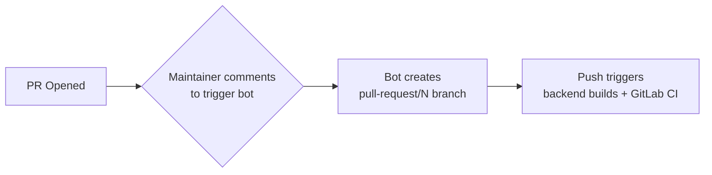
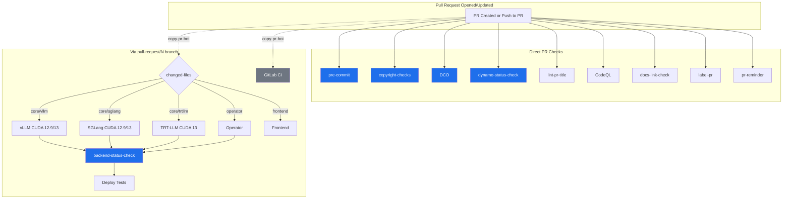
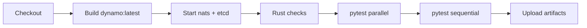
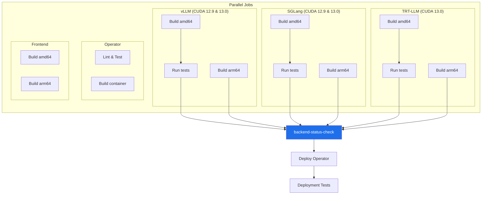
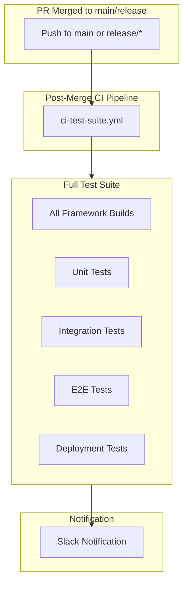

# PR Workflow

## Required Checks

| Check | Trigger |
|-------|---------|
| `pre-commit` | Direct |
| `copyright-checks` | Direct |
| `DCO` | Direct |
| `dynamo-status-check` | Direct |
| `backend-status-check` | Via `pull-request/N` branch |

---

## How copy-pr-bot Works

Some checks (backend builds, GitLab CI) don't run on direct PR events. They require a maintainer to trigger **copy-pr-bot**, which creates a `pull-request/N` branch. The **push to that branch** triggers the workflows.

This applies to both internal and external PRs.

---

## PR Flow

---

## Core Dynamo Build (`container-validation-dynamo.yml`)

Runs on **all PRs** directly. Builds the core Dynamo container and runs Rust checks + pytest.

---

## Backend Builds (`pr.yaml`)

Only runs when code is pushed to `pull-request/N` branches or `main`/`release/*`. Uses the `changed-files` action to determine which frameworks to build.

### Multi-CUDA Support

Both vLLM and SGLang now build for **CUDA 12.9** and **CUDA 13.0**. TRT-LLM builds for CUDA 13.0 only.

### Deployment Tests

After backend builds complete, operator deployment tests run on Kubernetes:

- **Deploy Operator**: Installs Dynamo operator on AKS cluster
- **Deploy Tests**: Tests vLLM, SGLang, TRT-LLM deployments with profiles:
  - Aggregated (agg)
  - Aggregated with router (agg_router)  
  - Disaggregated (disagg)
  - Disaggregated with KV router (disagg_router)
- **Cleanup**: Removes deployments and namespace

---

## Path Filters (changed-files action)

The `changed-files` custom action determines which jobs run:

| Filter | Used By | Paths |
|--------|---------|-------|
| `core` | All backend builds | `components/**`, `lib/**`, `tests/**`, `container/**`, `*.py`, `*.rs` |
| `vllm` | vLLM builds & GitLab CI | `container/Dockerfile.vllm`, `components/src/dynamo/vllm/**`, `container/deps/requirements.vllm.txt` |
| `sglang` | SGLang builds & GitLab CI | `container/Dockerfile.sglang`, `components/src/dynamo/sglang/**` |
| `trtllm` | TRT-LLM builds & GitLab CI | `container/Dockerfile.trtllm`, `components/src/dynamo/trtllm/**`, `container/deps/trtllm/**` |
| `operator` | Operator builds | `deploy/operator/**`, `deploy/helm/**` |
| `deploy` | Deployment tests | `examples/backends/**/deploy/**` |
| `frontend` | Frontend builds | `components/src/dynamo/frontend/**`, `lib/llm/src/**` |

**Logic**: Backend jobs run if `core == true` OR framework-specific changes detected.

---

## Post-Merge

After merge to `main` or `release/*`, the `post-merge-ci.yml` workflow triggers automatically.

### Post-Merge vs PR

| Aspect | PR (pull-request/N) | Post-Merge |
|--------|---------------------|------------|
| Workflow | `pr.yaml` | `post-merge-ci.yml` → `ci-test-suite.yml` |
| Trigger | Push to `pull-request/N` branch | Push to `main`/`release/*` |
| Backend builds | Only changed frameworks | All frameworks (vLLM, SGLang, TRT-LLM) |
| CUDA versions | Both 12.9 and 13.0 | Both 12.9 and 13.0 |
| Test scope | Pre-merge marks only | Post-merge + nightly marks |
| Deployment tests | On main or manual trigger | Always |
| Rust checks | On `*.rs` changes only | Always |
| Docs link check | Offline mode | Full external links |
| Slack notifications | No | Yes |

---

## Related

- [README](./README.md) - Workflow details and configuration
- [Nightly Workflow](./NIGHTLY_WORKFLOW.md) - Scheduled builds
- [Troubleshooting](./TROUBLESHOOTING.md) - Common CI issues
