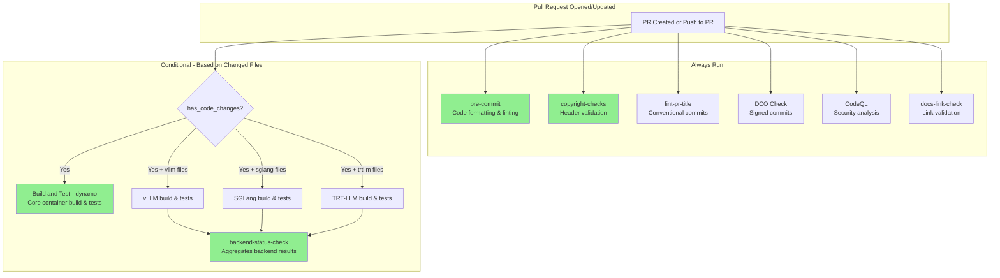
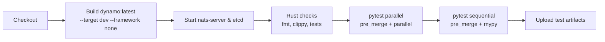
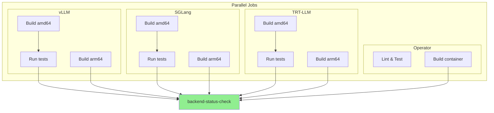
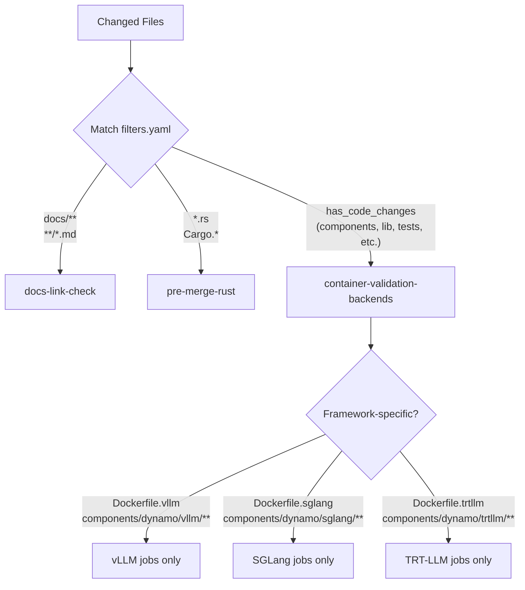
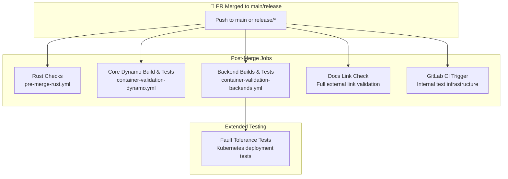

# Pull Request CI Workflow

This document explains how CI runs on pull requests, what checks are required, and how different workflows are triggered based on the files you change.

## Required Checks

The following checks **must pass** before a PR can be merged:

| Check | Workflow | Description |
|-------|----------|-------------|
| `pre-commit` | `pre-merge.yml` | Code formatting and linting via pre-commit hooks |
| `copyright-checks` | `copyright-checks.yml` | Validates copyright headers on source files |
| `Build and Test - dynamo` | `container-validation-dynamo.yml` | Builds core Dynamo container and runs tests |
| `backend-status-check` | `container-validation-backends.yml` | Builds backend containers (vLLM, SGLang, TRT-LLM) and runs tests |

---

## PR Workflow Overview



---

## Workflow Details

### 1. Pre-Commit Checks (`pre-merge.yml`)

**Trigger**: All pull requests  
**Required**: ✅ Yes

Runs pre-commit hooks to validate code formatting and linting:
- Python formatting (black, isort)
- YAML/JSON validation
- Trailing whitespace removal
- End-of-file fixers
- And other configured hooks

### 2. Copyright Checks (`copyright-checks.yml`)

**Trigger**: All pull requests  
**Required**: ✅ Yes

Validates that all source files have proper NVIDIA copyright headers:
```
# SPDX-FileCopyrightText: Copyright (c) 2024-2025 NVIDIA CORPORATION & AFFILIATES. All rights reserved.
# SPDX-License-Identifier: Apache-2.0
```

### 3. PR Title Linting (`lint-pr-title.yaml`)

**Trigger**: PR opened, edited, synchronized, reopened  
**Required**: ❌ No (but recommended)

Validates PR titles follow [Conventional Commits](https://www.conventionalcommits.org/) format:
```
<type>: <description>

Types: feat, fix, docs, test, ci, refactor, perf, chore, revert, style, build
```

Valid examples:
- `feat: add new router component`
- `fix: resolve memory leak in KV cache`
- `docs: update installation guide`

Also automatically adds labels based on the PR type.

### 4. DCO Check

**Trigger**: All pull requests  
**Required**: ✅ Yes (enforced by GitHub)

All commits must be signed off with the Developer Certificate of Origin:
```bash
git commit -s -m "Your commit message"
```

If DCO fails, a bot will comment with instructions. See [DCO.md](../DCO.md) for details.

### 5. Rust Pre-Merge Checks (`pre-merge-rust.yml`)

**Trigger**: Changes to `*.rs`, `Cargo.toml`, `Cargo.lock`  
**Required**: ❌ No

Runs Rust-specific validation:
- `cargo fmt --check` - Code formatting
- `cargo clippy` - Linting
- `cargo test` - Unit and doc tests
- `cargo deny` - License and dependency checks

Runs on multiple workspace directories:
- Root workspace
- `lib/bindings/python`
- `lib/runtime/examples`
- `launch/dynamo-run`

### 6. Core Dynamo Build (`container-validation-dynamo.yml`)

**Trigger**: All PRs (push to main, release branches, or PRs)  
**Required**: ✅ Yes (`Build and Test - dynamo`)



### 7. Backend Container Builds (`container-validation-backends.yml`)

**Trigger**: `has_code_changes` filter matches  
**Required**: ✅ Yes (`backend-status-check`)

Builds and tests framework-specific containers:



Each framework build:
1. Builds the container image for the target architecture
2. Runs sanity checks on the image
3. Pushes to container registry
4. Runs pytest with `pre_merge and <framework>` markers (amd64 only)

### 8. Documentation Link Check (`docs-link-check.yml`)

**Trigger**: All PRs and pushes to main  
**Required**: ❌ No

Two-part validation:
1. **Lychee**: External link checking (offline mode for PRs, full mode for main)
2. **Broken Links Script**: Internal markdown link validation

### 9. CodeQL Analysis (`codeql.yml`)

**Trigger**: All pull requests  
**Required**: ❌ No

Runs GitHub's CodeQL security analysis on Python code.

---

## File Filters and Conditional Execution

The `filters.yaml` file determines which workflows run based on changed files:



### `has_code_changes` Filter

This filter matches when any of these paths change:
- `.github/workflows/**`, `.github/filters.yaml`, `.github/actions/**`
- `benchmarks/**`
- `components/**`
- `container/**`
- `deploy/**`
- `examples/**`
- `launch/**`
- `lib/**`
- `recipes/**`
- `tests/**`
- `*.toml`, `*.lock`, `*.py`, `*.rs`

---

## Understanding PR Check Results

### All Checks Passed ✅

Your PR is ready for review. All required checks have passed.

### Some Checks Failed ❌

1. **Check which required checks failed** (see table above)
2. **Click on the failed check** to see detailed logs
3. **Common fixes**:
   - `pre-commit`: Run `pre-commit run --all-files` locally
   - `copyright-checks`: Add copyright headers to new files
   - `DCO`: Amend commits with `-s` flag (see [Troubleshooting](./TROUBLESHOOTING.md))
   - Build failures: Check Docker build logs for errors

### Checks Not Running 🟡

See [Troubleshooting - CI Not Triggered](./TROUBLESHOOTING.md#ci-not-triggered-on-my-pr) for common causes.

---

## External Contributions

For PRs from forks (external contributors):

1. A welcome comment is posted with CI information
2. The `external-contribution` label is added automatically
3. **CI requires approval** from an NVIDIA maintainer via `copy-pr-bot`
4. Once approved, CI runs with full access to build infrastructure

See [Troubleshooting](./TROUBLESHOOTING.md#external-contribution-ci-not-running) for details.

---

## Post-Merge CI

After your PR is merged to `main` or a `release/*` branch, additional CI pipelines run automatically.

### What Runs After Merge



### Post-Merge vs PR Checks

| Aspect | PR Checks | Post-Merge |
|--------|-----------|------------|
| **Rust checks** | Only on Rust file changes | Always runs on main |
| **Docs link check** | Offline mode (internal links only) | Full mode (external links too) |
| **Fault tolerance tests** | Not run | Runs Kubernetes deployment tests |
| **GitLab CI** | Triggered for internal PRs | Always triggered on main |
| **Image publishing** | Pushed to staging registry | Pushed to production registries |

### Fault Tolerance Tests

After backend containers are built, fault tolerance tests run on Kubernetes:

- **Frameworks tested**: vLLM, SGLang, TRT-LLM
- **Test scenarios**: Disaggregated prefill/decode with worker pod failures
- **Infrastructure**: Azure AKS cluster with GPU nodes
- **Duration**: ~30-60 minutes per framework

These tests validate that Dynamo deployments can recover from worker failures.

### GitLab CI Integration

The `trigger_ci.yml` workflow mirrors the repository to GitLab and triggers internal CI pipelines. This provides:

- Additional testing on NVIDIA internal infrastructure
- Extended test suites not available on GitHub runners
- Hardware-specific validation

> **Note**: GitLab CI results are informational and do not block releases.

### Why Post-Merge CI Matters

Even though your PR passed all checks, post-merge CI catches:

1. **Integration issues** - Conflicts with other recently merged PRs
2. **Extended test failures** - Tests that only run post-merge
3. **Infrastructure validation** - Kubernetes deployment correctness
4. **External link rot** - Broken external URLs in documentation

If post-merge CI fails, the team is notified and will address the issue. You may be contacted if your PR is identified as the cause.

---

## Related Documentation

- [Troubleshooting Guide](./TROUBLESHOOTING.md)
- [Nightly CI Workflow](./NIGHTLY_WORKFLOW.md)
- [Test Documentation](../tests/README.md) - pytest markers and test configuration

