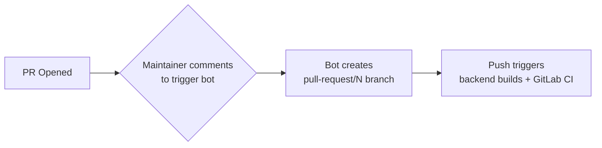
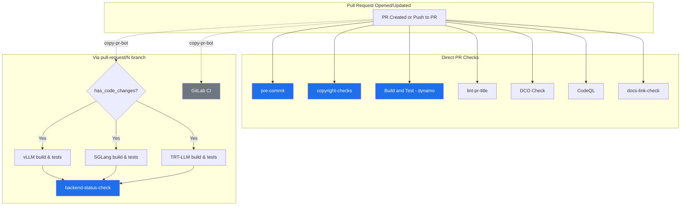
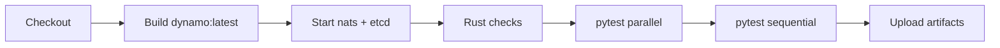
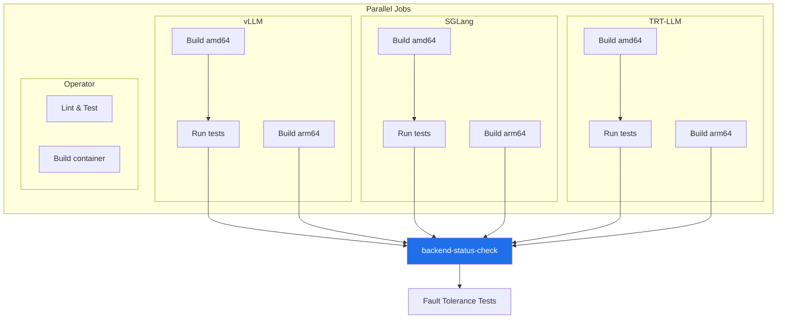
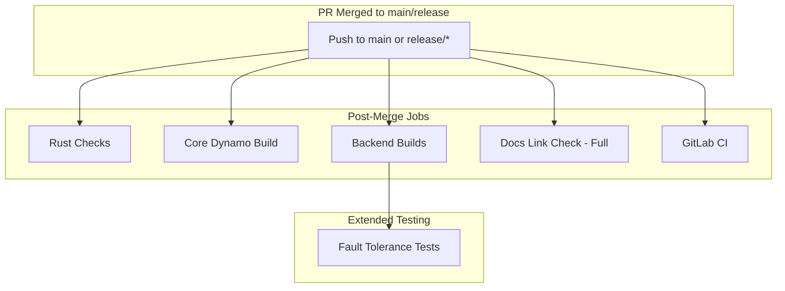

# PR Workflow

## Required Checks

| Check | Trigger |
|-------|---------|
| `pre-commit` | Direct |
| `copyright-checks` | Direct |
| `Build and Test - dynamo` | Direct |
| `backend-status-check` | Via `pull-request/N` branch |

---

## How copy-pr-bot Works

Some checks (backend builds, GitLab CI) don't run on direct PR events. They require a maintainer to trigger **copy-pr-bot**, which creates a `pull-request/N` branch. The **push to that branch** triggers the workflows.

This applies to both internal and external PRs.

---

## PR Flow

---

## Core Dynamo Build (`container-validation-dynamo.yml`)

Runs on **all PRs** directly. Builds the core Dynamo container and runs Rust checks + pytest.

---

## Backend Builds (`container-validation-backends.yml`)

Only runs when code is pushed to `pull-request/N` branches or `main`/`release/*`. Uses `filters.yaml` to check if `has_code_changes` is true.

---

## Path Filters (`filters.yaml`)

| Filter | Used By | Paths |
|--------|---------|-------|
| `has_code_changes` | Backend builds | `components/**`, `lib/**`, `tests/**`, `container/**`, `*.py`, `*.rs`, etc. |
| `vllm` | GitLab CI | `Dockerfile.vllm`, `components/dynamo/vllm/**` |
| `sglang` | GitLab CI | `Dockerfile.sglang`, `components/dynamo/sglang/**` |
| `trtllm` | GitLab CI | `Dockerfile.trtllm`, `components/dynamo/trtllm/**` |

GitLab CI always runs (skips only `.md`/`.rst` changes) but uses framework filters to tell GitLab *which* frameworks to test.

---

## Post-Merge

After merge to `main` or `release/*`, workflows trigger on push (no copy-pr-bot needed).

### Post-Merge vs PR

| Aspect | PR | Post-Merge |
|--------|-----|------------|
| Rust checks | On `*.rs` changes only | Always |
| Docs link check | Offline mode | Full external links |
| Fault tolerance | Via `pull-request/N` branch | ✅ Always |
| GitLab CI | Via `pull-request/N` branch | Always |

---

## Related

- [README](./README.md) - Workflow details and configuration
- [Nightly Workflow](./NIGHTLY_WORKFLOW.md) - Scheduled builds
- [Troubleshooting](./TROUBLESHOOTING.md) - Common CI issues
