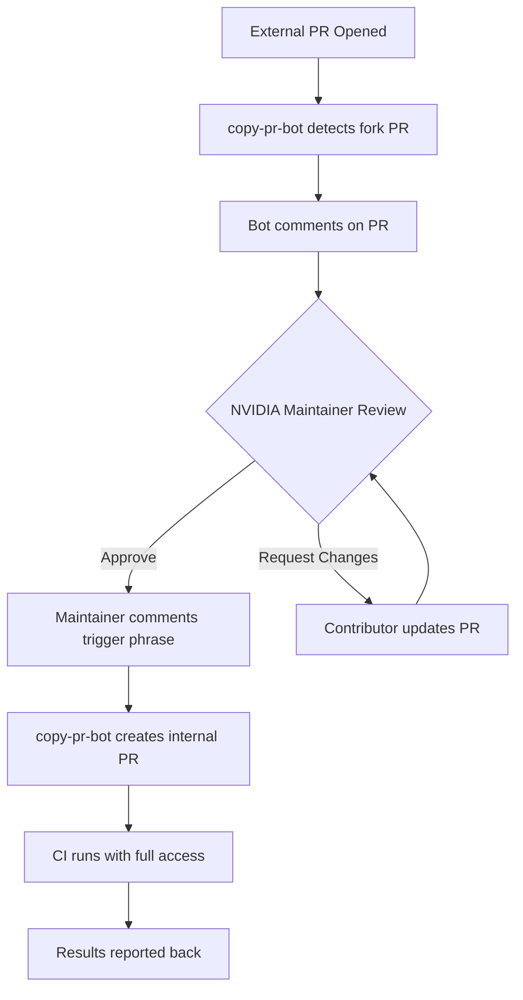

# CI Troubleshooting Guide

This guide covers common CI issues and how to resolve them.

## Table of Contents

- [CI Not Triggered on My PR](#ci-not-triggered-on-my-pr)
  - [Internal NVIDIA PRs: GPG Signing Required](#internal-nvidia-prs-gpg-signing-required)
  - [External Contributions: CI Not Running](#external-contributions-ci-not-running)
- [Required Checks Failing](#required-checks-failing)
  - [DCO Check Failed](#dco-check-failed)
  - [Pre-commit Check Failed](#pre-commit-check-failed)
  - [Copyright Check Failed](#copyright-check-failed)
- [Other Issues](#other-issues)

---

## CI Not Triggered on My PR

If you see checks stuck at "Waiting for status to be reported" or no CI runs at all:

```
⏳ backend-status-check    Expected — Waiting for status to be reported
⏳ Build and Test - dynamo  Expected — Waiting for status to be reported
⏳ copyright-checks        Expected — Waiting for status to be reported
⏳ pre-commit              Expected — Waiting for status to be reported
```

### Internal NVIDIA PRs: GPG Signing Required

**Symptom**: CI checks show "Waiting for status" and never start for PRs from NVIDIA employees.

**Cause**: Commits are not GPG signed. NVIDIA internal policy requires GPG-signed commits for CI to trigger.

**Solution**: Sign your commits with GPG.

#### Setting Up GPG Signing

1. **Generate a GPG key** (if you don't have one):
   ```bash
   gpg --full-generate-key
   # Choose RSA and RSA, 4096 bits, and your NVIDIA email
   ```

2. **Get your GPG key ID**:
   ```bash
   gpg --list-secret-keys --keyid-format=long
   # Look for: sec   rsa4096/XXXXXXXXXXXXXXXX
   #                        ^^^^^^^^^^^^^^^^ This is your key ID
   ```

3. **Configure Git to use your GPG key**:
   ```bash
   git config --global user.signingkey XXXXXXXXXXXXXXXX
   git config --global commit.gpgsign true
   ```

4. **Add your GPG key to GitHub**:
   ```bash
   gpg --armor --export XXXXXXXXXXXXXXXX
   # Copy the output and add it to GitHub → Settings → SSH and GPG keys → New GPG key
   ```

#### Fixing Unsigned Commits

If you've already pushed unsigned commits:

**Option 1: Amend the last commit**
```bash
git commit --amend -S --no-edit
git push --force-with-lease
```

**Option 2: Rebase and sign all commits**
```bash
git rebase -i HEAD~N --exec "git commit --amend -S --no-edit"
# Replace N with the number of commits to sign
git push --force-with-lease
```

**Option 3: Squash and re-sign**
```bash
git reset --soft HEAD~N  # N = number of commits
git commit -S -m "Your commit message"
git push --force-with-lease
```

#### Verifying Commits are Signed

```bash
git log --show-signature -1
# Should show: gpg: Signature made ... gpg: Good signature from ...
```

On GitHub, signed commits show a "Verified" badge.

---

### External Contributions: CI Not Running

**Symptom**: You opened a PR from a fork, CI checks show "Waiting for status", and you see a comment about external contributions.

**Cause**: For security reasons, PRs from forks cannot automatically access CI secrets. A maintainer must approve the CI run.

**How It Works**:



**What to Do**:

1. ✅ **Wait for a maintainer** - An NVIDIA team member will review your PR
2. ✅ **Respond to feedback** - Address any review comments
3. ✅ **Maintainer triggers CI** - Once approved, they'll comment to trigger CI
4. ❌ **Don't worry** - This is normal for external contributions

**For Maintainers**: Comment with the appropriate trigger phrase to have `copy-pr-bot` create an internal PR branch that can run CI with secrets access.

---

## Required Checks Failing

### DCO Check Failed

**Symptom**: DCO check shows ❌ and a bot comments about missing sign-off.

**Cause**: One or more commits are missing the `Signed-off-by` line.

**Solution**: Add sign-off to your commits.


See [DCO.md](../DCO.md) for detailed instructions.

---

### Pre-commit Check Failed

**Symptom**: `pre-commit` check fails with formatting or linting errors.

**Solution**: Run pre-commit locally and push the fixes.

```bash
# Install pre-commit (one time)
pip install pre-commit
pre-commit install

# Run on all files
pre-commit run --all-files

# Commit the fixes
git add -A
git commit -s -m "fix: apply pre-commit formatting"
git push
```

**Common Issues**:
- **Black formatting**: Python code style
- **isort**: Import ordering
- **Trailing whitespace**: Extra spaces at end of lines
- **End of file**: Missing newline at end of file
- **YAML/JSON**: Syntax validation

---

### Copyright Check Failed

**Symptom**: `copyright-checks` fails with missing header errors.

**Solution**: Add the required copyright header to new files.

```
# SPDX-FileCopyrightText: Copyright (c) 2024-2025 NVIDIA CORPORATION & AFFILIATES. All rights reserved.
# SPDX-License-Identifier: Apache-2.0
```

---

## Other Issues

### PR Title Validation Failed

**Symptom**: `lint-pr-title` check fails.

**Cause**: PR title doesn't follow conventional commits format.

**Solution**: Edit PR title to match format:
```
<type>: <description>

Valid types: feat, fix, docs, test, ci, refactor, perf, chore, revert, style, build
```

**Examples**:
- ✅ `feat: add new router endpoint`
- ✅ `fix: resolve memory leak in worker`
- ❌ `Added new feature` (missing type)
- ❌ `FEAT: something` (type should be lowercase)

---

### Stale PR/Issue Closed

**Symptom**: Your PR or issue was automatically closed.

**Cause**: The `stale_cleaner` workflow closes items after 30 days of inactivity + 5 day warning.

**Solution**:
- **To prevent**: Add the `backlog` label to exempt from stale cleanup
- **To reopen**: Comment on the issue/PR to reopen it

---

### Checks Running on Wrong Files

**Symptom**: Backend builds running when you only changed documentation.

**Cause**: The `filters.yaml` patterns may match your changes unexpectedly.

**Check which filters match**:
1. Review [filters.yaml](./filters.yaml)
2. Verify your changed files against the patterns
3. `has_code_changes` is broad and includes many paths

---


## Related Documentation

- [PR Workflow](./PR_WORKFLOW.md) - Understanding PR checks
- [Nightly Workflow](./NIGHTLY_WORKFLOW.md) - Nightly CI pipeline
- [DCO Guide](../DCO.md) - Developer Certificate of Origin

