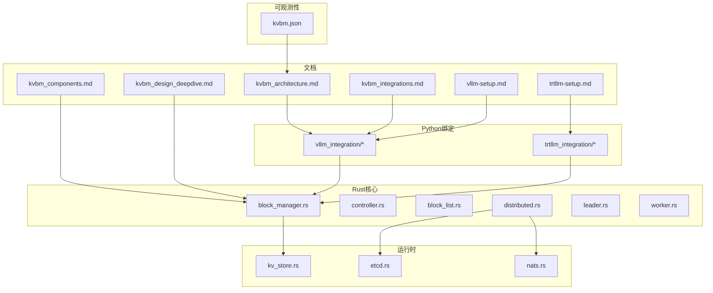
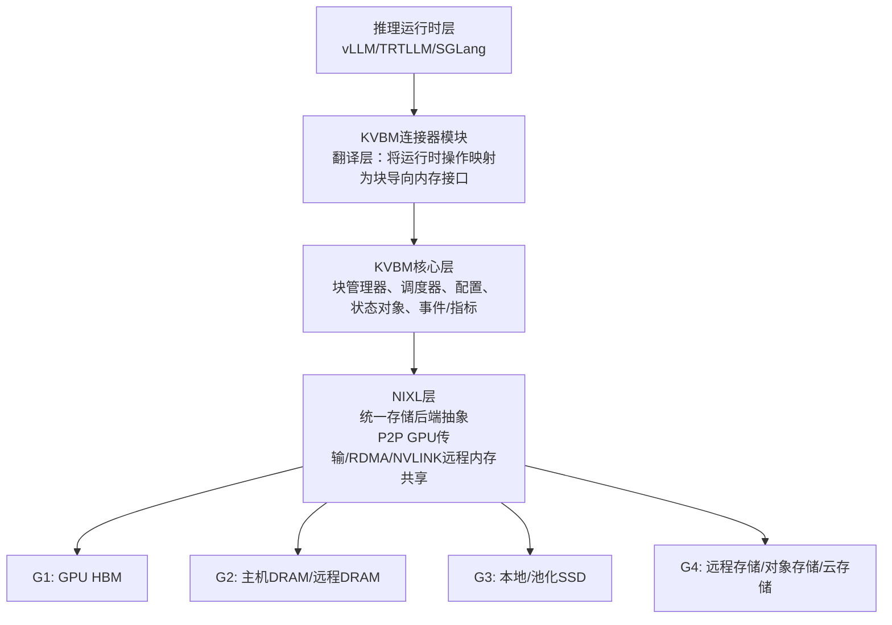
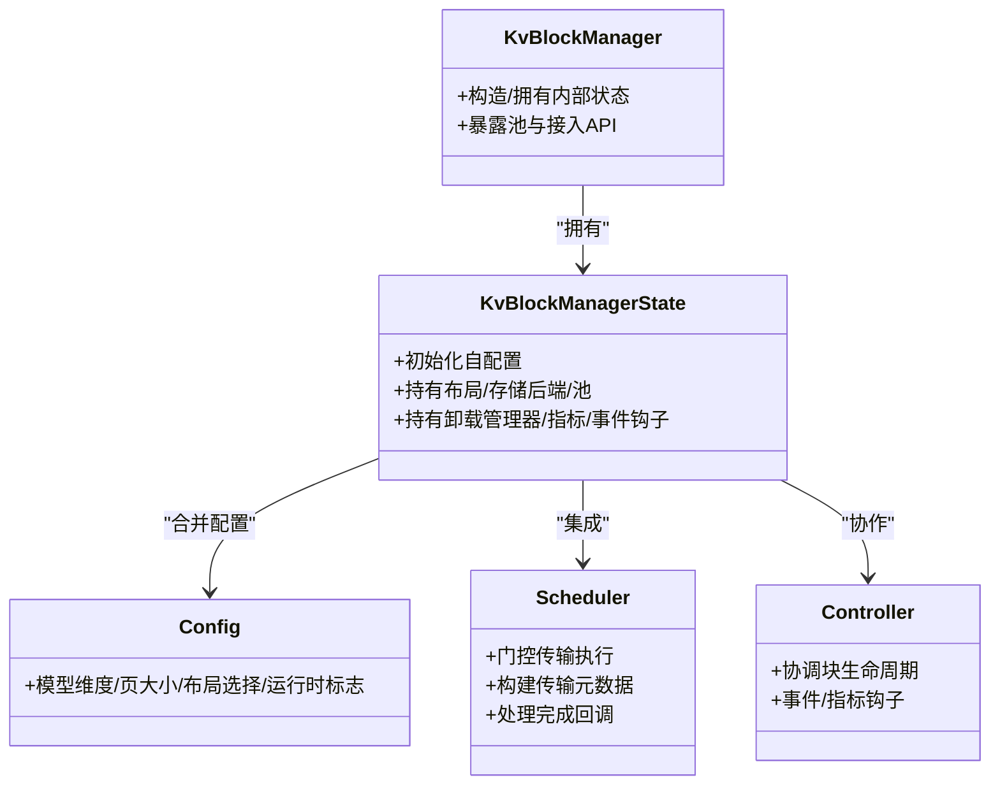
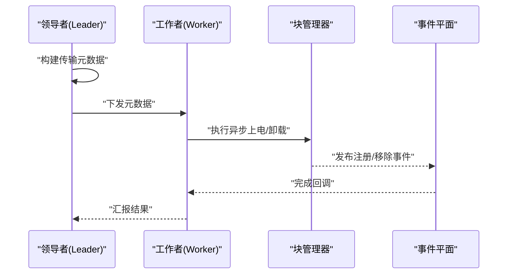
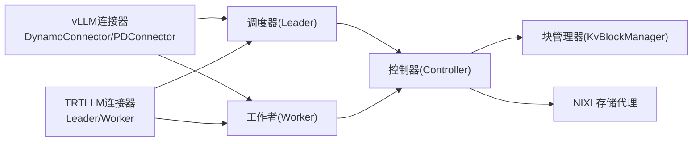
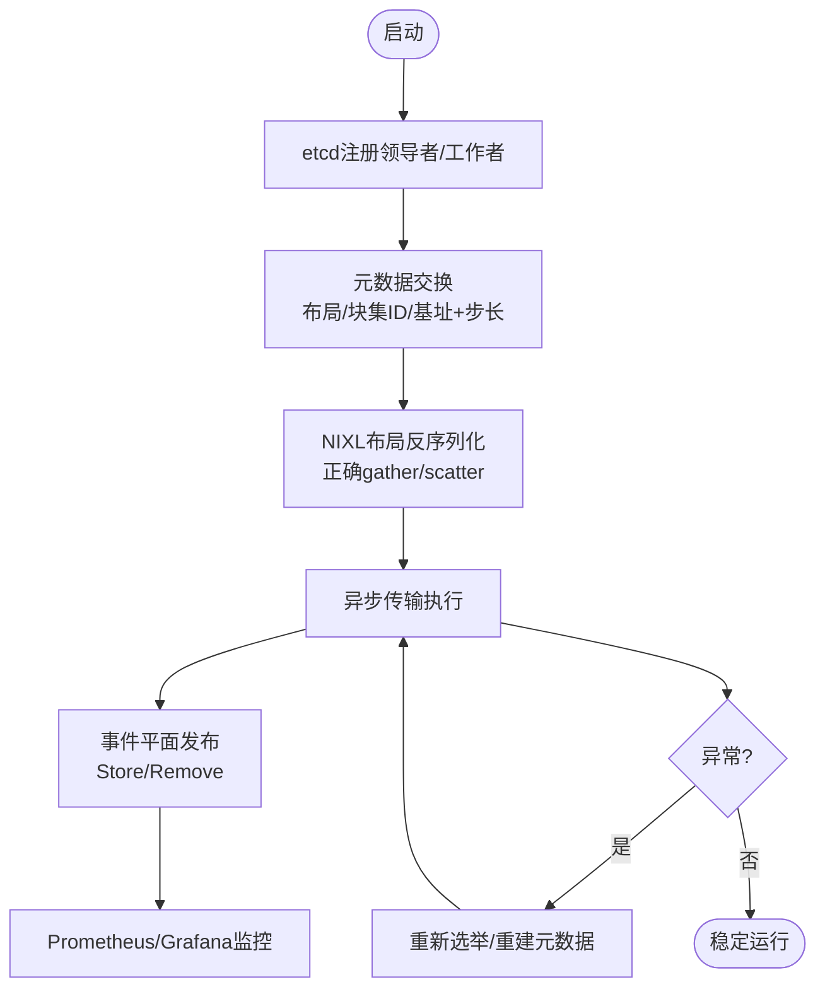
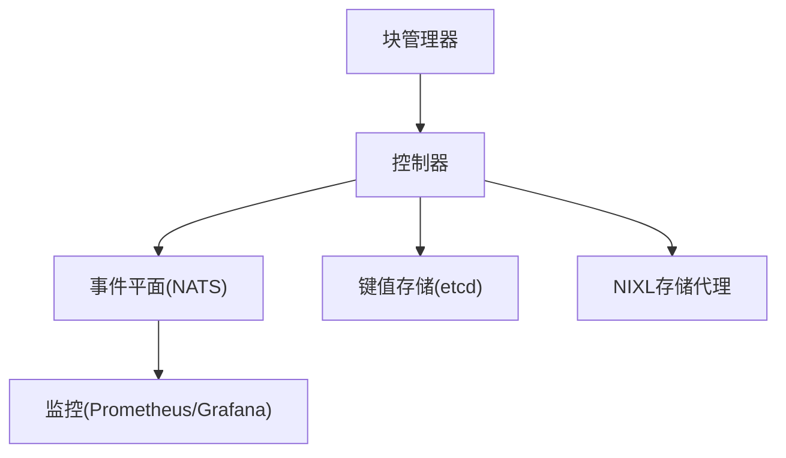

# KV缓存块管理(KVBM)

<cite>
**本文引用的文件**
- [kvbm_architecture.md](file://docs/kvbm/kvbm_architecture.md)
- [kvbm_components.md](file://docs/kvbm/kvbm_components.md)
- [kvbm_design_deepdive.md](file://docs/kvbm/kvbm_design_deepdive.md)
- [kvbm_integrations.md](file://docs/kvbm/kvbm_integrations.md)
- [kvbm_motivation.md](file://docs/kvbm/kvbm_motivation.md)
- [kvbm_reading.md](file://docs/kvbm/kvbm_reading.md)
- [vllm-setup.md](file://docs/kvbm/vllm-setup.md)
- [trtllm-setup.md](file://docs/kvbm/trtllm-setup.md)
- [kvbm_connector_leader.py](file://lib/bindings/kvbm/python/kvbm/vllm_integration/connector/kvbm_connector_leader.py)
- [kvbm_connector_worker.py](file://lib/bindings/kvbm/python/kvbm/vllm_integration/connector/kvbm_connector_worker.py)
- [dynamo_connector.py](file://lib/bindings/kvbm/python/kvbm/vllm_integration/connector/dynamo_connector.py)
- [pd_connector.py](file://lib/bindings/kvbm/python/kvbm/vllm_integration/connector/pd_connector.py)
- [connector_leader.py](file://lib/bindings/kvbm/python/kvbm/vllm_integration/connector_leader.py)
- [connector_worker.py](file://lib/bindings/kvbm/python/kvbm/vllm_integration/connector_worker.py)
- [kv_cache_manager.py](file://lib/bindings/kvbm/python/kvbm/vllm_integration/kv_cache_manager.py)
- [kv_cache_utils.py](file://lib/bindings/kvbm/python/kvbm/vllm_integration/kv_cache_utils.py)
- [rust.py](file://lib/bindings/kvbm/python/kvbm/vllm_integration/rust.py)
- [kvbm_connector_leader.py](file://lib/bindings/kvbm/python/kvbm/trtllm_integration/connector/kvbm_connector_leader.py)
- [kvbm_connector_worker.py](file://lib/bindings/kvbm/python/kvbm/trtllm_integration/connector/kvbm_connector_worker.py)
- [rust.py](file://lib/bindings/kvbm/python/kvbm/trtllm_integration/rust.py)
- [block_manager.rs](file://lib/bindings/kvbm/src/block_manager.rs)
- [controller.rs](file://lib/bindings/kvbm/src/block_manager/controller.rs)
- [block_list.rs](file://lib/bindings/kvbm/src/block_manager/block_list.rs)
- [distributed.rs](file://lib/bindings/kvbm/src/block_manager/distributed.rs)
- [leader.rs](file://lib/bindings/kvbm/src/block_manager/distributed/leader.rs)
- [worker.rs](file://lib/bindings/kvbm/src/block_manager/distributed/worker.rs)
- [kv_store.rs](file://lib/runtime/src/storage/kv.rs)
- [etcd.rs](file://lib/runtime/src/transports/etcd.rs)
- [nats.rs](file://lib/runtime/src/transports/nats.rs)
- [kvbm.json](file://deploy/observability/grafana_dashboards/kvbm.json)
- [kvbm_offload.png](file://docs/images/kvbm-offload.png)
- [kvbm-onboard-host2device.png](file://docs/images/kvbm-onboard-host2device.png)
- [kvbm-onboard-disk2device.png](file://docs/images/kvbm-onboard-disk2device.png)
- [kvbm-integrations.png](file://docs/images/kvbm-integrations.png)
- [kvbm-architecture.png](file://docs/images/kvbm-architecture.png)
- [kvbm-components.png](file://docs/images/kvbm-components.png)
- [kvbm-data-flows.png](file://docs/images/kvbm-data-flows.png)
- [kvbm-internal-arch.png](file://docs/images/kvbm-internal-arch.png)
</cite>

## 目录
1. [简介](#简介)
2. [项目结构](#项目结构)
3. [核心组件](#核心组件)
4. [架构总览](#架构总览)
5. [详细组件分析](#详细组件分析)
6. [依赖分析](#依赖分析)
7. [性能考虑](#性能考虑)
8. [故障排查指南](#故障排查指南)
9. [结论](#结论)
10. [附录](#附录)

## 简介
本文件面向KV缓存块管理（KVBM）系统，提供从架构理念到实现细节、从与推理引擎（vLLM、TensorRT-LLM）集成到分布式协调机制的全景式技术文档。KVBM通过将运行时逻辑与内存管理解耦，结合块级内存接口与NIXL统一存储后端抽象，实现跨设备（GPU/HBM）、主机（CPU/DRAM）、本地/远程存储（SSD/NFS/S3）的块级缓存共享与复用，支撑多节点、长上下文、高并发的生成式AI服务。

## 项目结构
KVBM相关知识与实现主要分布在以下区域：
- 文档层：docs/kvbm 下的架构、组件、设计深潜、集成与部署说明
- Python绑定与连接器：lib/bindings/kvbm/python 下的 vLLM/TRTLLM 集成模块
- Rust核心与控制器：lib/bindings/kvbm/src 下的块管理器、控制器、分布式协调
- 运行时基础设施：lib/runtime 下的事件平面、键值存储、etcd/nats传输
- 可观测性：deploy/observability/grafana_dashboards 中的KVBM仪表盘

**图表来源**
- [kvbm_architecture.md](file://docs/kvbm/kvbm_architecture.md#L19-L40)
- [kvbm_components.md](file://docs/kvbm/kvbm_components.md#L19-L71)
- [kvbm_design_deepdive.md](file://docs/kvbm/kvbm_design_deepdive.md#L19-L262)
- [kvbm_integrations.md](file://docs/kvbm/kvbm_integrations.md#L19-L45)
- [vllm-setup.md](file://docs/kvbm/vllm-setup.md#L18-L195)
- [trtllm-setup.md](file://docs/kvbm/trtllm-setup.md#L18-L223)

**章节来源**
- [kvbm_architecture.md](file://docs/kvbm/kvbm_architecture.md#L19-L40)
- [kvbm_components.md](file://docs/kvbm/kvbm_components.md#L19-L71)
- [kvbm_design_deepdive.md](file://docs/kvbm/kvbm_design_deepdive.md#L19-L262)
- [kvbm_integrations.md](file://docs/kvbm/kvbm_integrations.md#L19-L45)

## 核心组件
- 块管理器（KvBlockManager）
  - 作为跨内存层级（设备/GPU、主机/CPU、远程）的协调者，管理各后端块池并暴露一致的块生命周期API；跟踪块在设备内存、主机内存（跨节点）、本地/池化SSD以及远程存储中的位置。
  - 关键职责：池初始化、布局配置合并、远程感知注入、事件/指标钩子、块注册表与导入导出元数据管理。
- 调度器（Scheduler）
  - 在与框架连接器（如vLLM V1）集成时，基于模型进度（迭代/层完成）门控传输执行；负责构建异步传输元数据并处理完成回调。
- 配置（Config）
  - 描述模型维度、页大小、布局选择与运行时标志，用于构建池与布局。
- 状态对象（KvBlockManagerState）
  - 中心对象，整合布局、存储后端与池；持有卸载管理器、指标与事件钩子。
- 布局与块（Layouts & Blocks）
  - LayoutConfig/类型将张量形状映射为KV缓存布局（按层分离或完全连续），包含块计数与几何信息；块与元数据（优先级等）支持按序列哈希匹配。
- 传输管理器（TransferManager）
  - 异步传输编排器，具备每路径队列（设备→主机、主机→磁盘、主机→设备、磁盘→设备）。
- 存储与池（Device/Host/Disk Pool）
  - 设备池（G1）：GPU驻留块池，分配可变GPU块、注册完成块（不可变）、按序列哈希查找、作为上电/下电目标。
  - 主机池（G2）：CPU固定内存块池，接收设备卸载、可上电至设备、向磁盘卸载；使用固定页内存以提升CUDA与NIXL I/O效率。
  - 磁盘池（G3）：本地NVMe SSD块池，接收主机卸载、直接上电至设备；NIXL描述符暴露文件偏移/区域以实现零拷贝I/O与可选GDS。
- 数据流（Device/Host/Disk）
  - 设备→主机（卸载）：显式请求触发，工作线程分配主机块并执行CUDA D2H/自定义内核复制，主机池注册新不可变块。
  - 主机→磁盘（卸载）：本地/远程文件系统写入，NIXL写入（POSIX/GDS），主机块注册为不可变块。
  - 主机→设备（上电）：将主机块带入GPU内存，CUDA H2D/自定义内核复制，设备池注册新不可变块。
  - 磁盘→设备（上电）：直接将磁盘块带入GPU内存，NIXL读取（可能经GDS），设备池注册新不可变块。

**章节来源**
- [kvbm_components.md](file://docs/kvbm/kvbm_components.md#L26-L71)
- [kvbm_design_deepdive.md](file://docs/kvbm/kvbm_design_deepdive.md#L26-L174)

## 架构总览
KVBM采用三层逻辑架构：推理运行时层（vLLM/TRTLLM/SGLang）、KVBM层（核心逻辑与适配）、NIXL层（统一数据与存储事务）。NIXL提供对块内存（GPU HBM/主机DRAM/远程DRAM/本地SSD）、本地/远程文件系统、对象存储与云存储的抽象，支持P2P GPU传输、RDMA/NVLINK远程内存共享、动态块注册与元数据交换，并提供可优化的插件接口。

**图表来源**
- [kvbm_architecture.md](file://docs/kvbm/kvbm_architecture.md#L21-L40)

**章节来源**
- [kvbm_architecture.md](file://docs/kvbm/kvbm_architecture.md#L21-L40)

## 详细组件分析

### 组件A：块管理器（KvBlockManager）与控制器（Controller）
- 角色定位
  - 协调跨内存层级（设备/主机/远程）的块池，暴露一致的块生命周期API；追踪块在G1-G4中的位置；持有块集合注册表与远程元数据导入/导出能力。
- 内部关系
  - 由KvBlockManagerConfig初始化KvBlockManagerState，后者持有布局、存储后端、池、卸载管理器、指标与事件钩子；NixlOptions注入远程感知。
- 生命周期与事件
  - 使用RAII管理块生命周期；注册与删除分别触发发布/移除事件；事件通过Dynamo事件平面传播，任何订阅组件均可监听变更。

**图表来源**
- [kvbm_components.md](file://docs/kvbm/kvbm_components.md#L26-L33)
- [kvbm_design_deepdive.md](file://docs/kvbm/kvbm_design_deepdive.md#L26-L38)

**章节来源**
- [kvbm_components.md](file://docs/kvbm/kvbm_components.md#L26-L33)
- [kvbm_design_deepdive.md](file://docs/kvbm/kvbm_design_deepdive.md#L26-L38)

### 组件B：块列表（Block List）与槽位管理（Slot Management）
- 块列表（Block List）
  - 用于组织与检索块集合，支持按序列哈希快速匹配与去重；在卸载/上电流程中承担元数据与视图管理。
- 槽位管理（Slot Management）
  - 在连接器侧，通过槽位管理协调请求与块资源分配；典型场景包括预填充（prefill）与解码（decode）阶段的块分配与回收。
- 分布式协调
  - 通过领导者（Leader）与工作者（Worker）模式实现跨节点的块注册、布局同步与传输编排；领导者负责构建传输元数据，工作者在前向结束时执行异步上电/卸载。

**图表来源**
- [kvbm_integrations.md](file://docs/kvbm/kvbm_integrations.md#L21-L22)
- [leader.rs](file://lib/bindings/kvbm/src/block_manager/distributed/leader.rs)
- [worker.rs](file://lib/bindings/kvbm/src/block_manager/distributed/worker.rs)

**章节来源**
- [kvbm_integrations.md](file://docs/kvbm/kvbm_integrations.md#L21-L22)
- [distributed.rs](file://lib/bindings/kvbm/src/block_manager/distributed.rs)

### 组件C：连接器（Connector）与控制器（Controller）
- vLLM连接器
  - 提供DynamoConnector与PDConnector两类入口，分别面向聚合与拆分（disaggregated）场景；通过调度器与工作者类实现块管理与传输控制。
- TRTLLM连接器
  - 提供DynamoKVBMConnectorLeader与DynamoKVBMConnectorWorker，配合LLM API配置启用KVBM；支持预填充工作者与完整服务链路。
- Python绑定与Rust桥接
  - Python侧通过rust.py桥接到Rust实现，确保高性能与类型安全；kv_cache_manager与kv_cache_utils提供缓存管理与工具函数。

**图表来源**
- [dynamo_connector.py](file://lib/bindings/kvbm/python/kvbm/vllm_integration/connector/dynamo_connector.py)
- [pd_connector.py](file://lib/bindings/kvbm/python/kvbm/vllm_integration/connector/pd_connector.py)
- [kvbm_connector_leader.py](file://lib/bindings/kvbm/python/kvbm/vllm_integration/connector/kvbm_connector_leader.py)
- [kvbm_connector_worker.py](file://lib/bindings/kvbm/python/kvbm/vllm_integration/connector/kvbm_connector_worker.py)
- [connector_leader.py](file://lib/bindings/kvbm/python/kvbm/vllm_integration/connector_leader.py)
- [connector_worker.py](file://lib/bindings/kvbm/python/kvbm/vllm_integration/connector_worker.py)
- [kv_cache_manager.py](file://lib/bindings/kvbm/python/kvbm/vllm_integration/kv_cache_manager.py)
- [kv_cache_utils.py](file://lib/bindings/kvbm/python/kvbm/vllm_integration/kv_cache_utils.py)
- [rust.py](file://lib/bindings/kvbm/python/kvbm/vllm_integration/rust.py)

**章节来源**
- [kvbm_integrations.md](file://docs/kvbm/kvbm_integrations.md#L21-L45)
- [vllm-setup.md](file://docs/kvbm/vllm-setup.md#L32-L106)
- [trtllm-setup.md](file://docs/kvbm/trtllm-setup.md#L70-L122)

### 组件D：分布式协调与领导者选举
- 服务发现与注册
  - 使用etcd进行KVBM领导者与工作者的注册与发现，保障跨节点一致性与可见性。
- 事件平面与指标
  - 基于NATS的事件平面发布块生命周期事件（Store/Remove），支持批量发布与动态节流；Prometheus/Grafana提供可观测性。
- 故障恢复
  - 通过事件平面与存储后端的去重与注册表，自动清理失效引用；在领导者/工作者异常时，重新选举与重建元数据交换。

**图表来源**
- [kvbm_design_deepdive.md](file://docs/kvbm/kvbm_design_deepdive.md#L105-L174)
- [kv_store.rs](file://lib/runtime/src/storage/kv.rs)
- [etcd.rs](file://lib/runtime/src/transports/etcd.rs)
- [nats.rs](file://lib/runtime/src/transports/nats.rs)

**章节来源**
- [kvbm_design_deepdive.md](file://docs/kvbm/kvbm_design_deepdive.md#L105-L174)
- [kv_store.rs](file://lib/runtime/src/storage/kv.rs)
- [etcd.rs](file://lib/runtime/src/transports/etcd.rs)
- [nats.rs](file://lib/runtime/src/transports/nats.rs)

## 依赖分析
- 组件耦合与内聚
  - 块管理器与控制器高度内聚，围绕块生命周期与布局管理；连接器作为外部适配层，降低与推理引擎的耦合。
- 外部依赖
  - 运行时依赖etcd（服务发现）、NATS（事件平面）、Prometheus/Grafana（可观测性）。
  - 存储后端通过NIXL抽象统一，支持多种介质与网络协议。
- 循环依赖
  - 通过事件平面与注册表避免循环依赖；块注册与删除通过RAII与事件解耦。

**图表来源**
- [kvbm_design_deepdive.md](file://docs/kvbm/kvbm_design_deepdive.md#L180-L192)
- [kv_store.rs](file://lib/runtime/src/storage/kv.rs)
- [nats.rs](file://lib/runtime/src/transports/nats.rs)
- [etcd.rs](file://lib/runtime/src/transports/etcd.rs)

**章节来源**
- [kvbm_design_deepdive.md](file://docs/kvbm/kvbm_design_deepdive.md#L180-L192)

## 性能考虑
- 层级缓存策略
  - CPU缓存（GPU→CPU）与磁盘缓存（CPU→磁盘/磁盘→GPU）的组合可显著降低首Token时间与吞吐波动；磁盘卸载过滤（频率阈值）可延长SSD寿命。
- 传输路径优化
  - 利用CUDA D2H/H2D与NIXL写入/读取，结合GDS（当可用）减少主机内存压力；批量化事件发布降低开销。
- 参数调优
  - 通过环境变量设置CPU与磁盘缓存容量或块数量；调整领导者-工作者初始化超时；在磁盘不支持fallocate时启用zerofill回退。
- 指标监控
  - 关注命中率与上/卸载块数量，评估收益与调优方向。

**章节来源**
- [vllm-setup.md](file://docs/kvbm/vllm-setup.md#L60-L84)
- [trtllm-setup.md](file://docs/kvbm/trtllm-setup.md#L45-L69)
- [kvbm_design_deepdive.md](file://docs/kvbm/kvbm_design_deepdive.md#L145-L174)

## 故障排查指南
- 性能无增益或下降
  - 检查前缀缓存命中是否足够；通过Grafana仪表盘观察上/卸载块数量，确认是否因命中不足导致。
- 初始化超时
  - 扩大领导者-工作者初始化超时时间，避免大内存/磁盘分配导致的超时。
- 磁盘启动失败
  - 当fallocate不可用时，启用磁盘zerofill回退以绕过该限制。
- 指标查看
  - 启用DYN_KVBM_METRICS并访问Grafana KVBM仪表盘，关注匹配令牌数与各级上/卸载块计数。

**章节来源**
- [vllm-setup.md](file://docs/kvbm/vllm-setup.md#L140-L162)
- [trtllm-setup.md](file://docs/kvbm/trtllm-setup.md#L156-L177)

## 结论
KVBM通过清晰的分层架构与NIXL抽象，实现了推理运行时与内存管理的解耦，支持多层级缓存与跨节点块共享。其连接器适配策略使不同推理引擎（vLLM、TRTLLM）能够以最小侵入获得高效的KV缓存复用与卸载能力；分布式协调通过事件平面与服务发现保障了可扩展性与弹性。结合完善的指标与调优参数，KVBM为大规模生成式AI服务提供了稳健、可扩展且高性能的缓存基础设施。

## 附录

### 推荐阅读
- vLLM前缀缓存与SGLang HiCache相关资料，有助于理解KV缓存复用的设计背景与实践。

**章节来源**
- [kvbm_reading.md](file://docs/kvbm/kvbm_reading.md#L21-L23)

### 图表索引
- 架构概览与组件关系
  - [kvbm-architecture.png](file://docs/images/kvbm-architecture.png)
  - [kvbm-components.png](file://docs/images/kvbm-components.png)
  - [kvbm-data-flows.png](file://docs/images/kvbm-data-flows.png)
  - [kvbm-internal-arch.png](file://docs/images/kvbm-internal-arch.png)
- 集成与流程示意
  - [kvbm-integrations.png](file://docs/images/kvbm-integrations.png)
  - [kvbm-onboard-host2device.png](file://docs/images/kvbm-onboard-host2device.png)
  - [kvbm-onboard-disk2device.png](file://docs/images/kvbm-onboard-disk2device.png)
  - [kvbm-offload.png](file://docs/images/kvbm-offload.png)