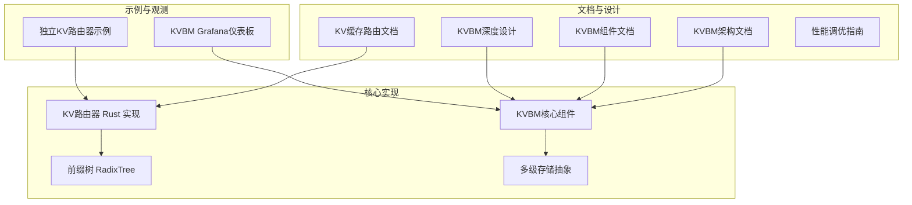
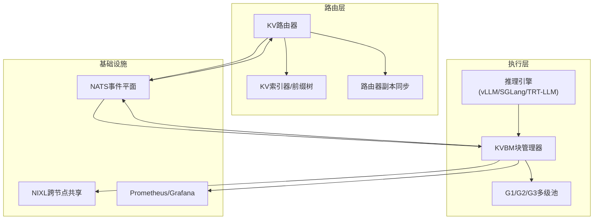
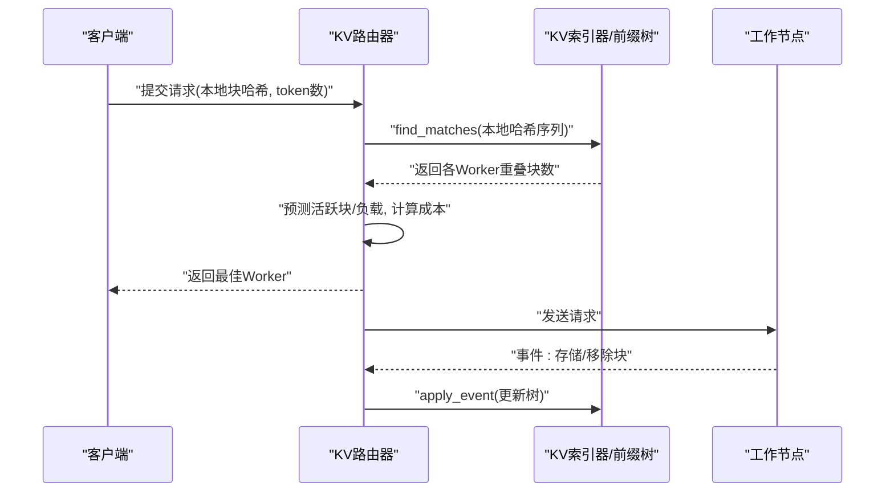
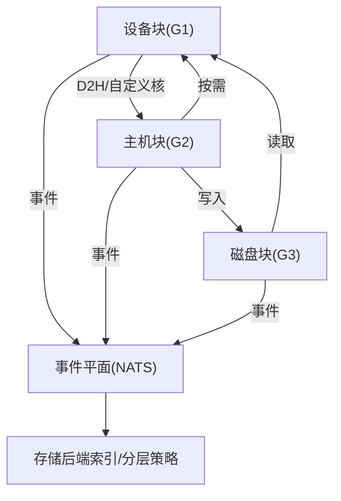
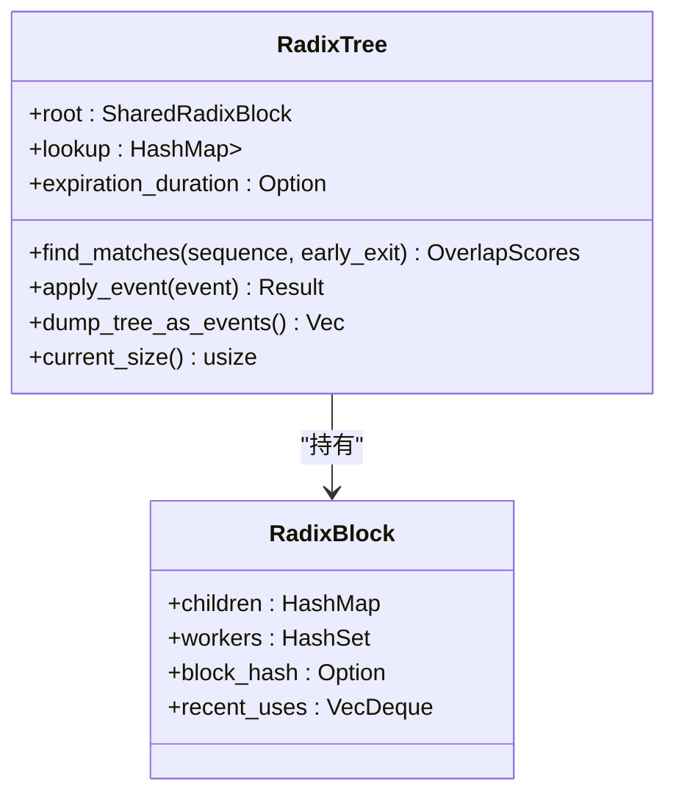
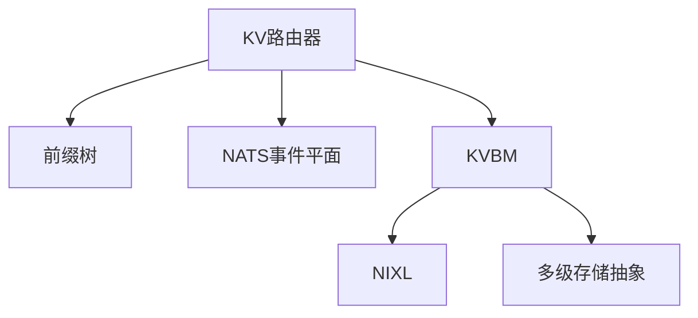

# KV缓存管理

<cite>
**本文引用的文件**
- [kv_cache_routing.md](file://docs/router/kv_cache_routing.md)
- [radix_tree.rs](file://lib/kv-router/src/radix_tree.rs)
- [kv_router.rs](file://lib/llm/src/kv_router.rs)
- [kvbm_architecture.md](file://docs/kvbm/kvbm_architecture.md)
- [kvbm_components.md](file://docs/kvbm/kvbm_components.md)
- [kvbm_design_deepdive.md](file://docs/kvbm/kvbm_design_deepdive.md)
- [storage.rs](file://lib/llm/src/block_manager/storage.rs)
- [router.py](file://examples/deployments/router_standalone/router.py)
- [kvbm.json](file://deploy/observability/grafana_dashboards/kvbm.json)
- [tuning.md](file://docs/performance/tuning.md)
</cite>

## 目录
1. [简介](#简介)
2. [项目结构](#项目结构)
3. [核心组件](#核心组件)
4. [架构总览](#架构总览)
5. [详细组件分析](#详细组件分析)
6. [依赖关系分析](#依赖关系分析)
7. [性能考量](#性能考量)
8. [故障排查指南](#故障排查指南)
9. [结论](#结论)
10. [附录](#附录)

## 简介
本文件系统性阐述Dynamo在Transformer推理中的KV缓存工作机制与路由优化，重点覆盖以下方面：
- KV缓存工作原理与块（Block）粒度管理
- KV路由器（KV Router）的前缀匹配策略与负载均衡算法
- 多级内存层次结构（GPU/HBM、CPU/Pinned、本地SSD/NAS/对象存储）的协同与迁移
- KVBM（KV缓存块管理）系统的设计、数据流与事件平面集成
- 缓存一致性、内存回收策略与性能调优实践
- 实际配置示例与监控指标说明

## 项目结构
围绕KV缓存管理，相关模块主要分布在如下位置：
- 文档层：docs/router、docs/kvbm、docs/performance
- 核心实现：lib/kv-router（KV路由器）、lib/llm/src/block_manager（KVBM）
- 示例与观测：examples/deployments/router_standalone、deploy/observability/grafana_dashboards
- 配置与调优：docs/performance/tuning.md

**图表来源**
- [kv_cache_routing.md](file://docs/router/kv_cache_routing.md#L1-L733)
- [kvbm_architecture.md](file://docs/kvbm/kvbm_architecture.md#L1-L40)
- [kvbm_components.md](file://docs/kvbm/kvbm_components.md#L1-L71)
- [kvbm_design_deepdive.md](file://docs/kvbm/kvbm_design_deepdive.md#L1-L262)
- [storage.rs](file://lib/llm/src/block_manager/storage.rs#L1-L567)
- [router.py](file://examples/deployments/router_standalone/router.py#L1-L335)

**章节来源**
- [kv_cache_routing.md](file://docs/router/kv_cache_routing.md#L1-L733)
- [kvbm_architecture.md](file://docs/kvbm/kvbm_architecture.md#L1-L40)
- [kvbm_components.md](file://docs/kvbm/kvbm_components.md#L1-L71)
- [kvbm_design_deepdive.md](file://docs/kvbm/kvbm_design_deepdive.md#L1-L262)
- [storage.rs](file://lib/llm/src/block_manager/storage.rs#L1-L567)
- [router.py](file://examples/deployments/router_standalone/router.py#L1-L335)

## 核心组件
- KV路由器（KV Router）：基于前缀树（RadixTree）进行块级匹配，结合活跃请求预测与负载信息，选择最优工作节点。
- 前缀树（RadixTree）：维护每个工作节点上已缓存的块序列，支持高效查找、插入与删除。
- KVBM（KV块管理器）：统一管理设备（GPU）、主机（CPU Pinned）、磁盘（SSD/NAS/Object）等多级存储，提供块生命周期、传输与事件平面集成。
- 多级存储抽象：定义系统内存、设备内存、页锁定主机内存、磁盘、远程内存（NIXL）等类型及访问接口。

**章节来源**
- [kv_cache_routing.md](file://docs/router/kv_cache_routing.md#L392-L426)
- [radix_tree.rs](file://lib/kv-router/src/radix_tree.rs#L73-L85)
- [kvbm_components.md](file://docs/kvbm/kvbm_components.md#L26-L71)
- [storage.rs](file://lib/llm/src/block_manager/storage.rs#L94-L113)

## 架构总览
Dynamo的KV缓存管理由“路由层 + 路径索引层 + KVBM执行层”构成，配合NATS事件平面与NIXL跨节点共享，形成全局一致的块可见性与多级内存协同。

**图表来源**
- [kv_cache_routing.md](file://docs/router/kv_cache_routing.md#L161-L320)
- [kvbm_architecture.md](file://docs/kvbm/kvbm_architecture.md#L23-L40)
- [kvbm_design_deepdive.md](file://docs/kvbm/kvbm_design_deepdive.md#L180-L262)

## 详细组件分析

### KV路由器与前缀匹配
- 工作原理
  - 引擎在块分配/释放时发布KV事件（存储/移除），路由器订阅并更新全局前缀树。
  - 请求到达时，路由器对输入token序列进行分块哈希，通过前缀树查询各工作节点的重叠块数，作为缓存命中预估。
  - 结合活跃请求预测与当前负载（等待队列、缓存使用率），计算成本函数并选择最优工作节点。
- 关键参数
  - overlap_score_weight：缓存重叠得分权重，平衡TTFT与ITL。
  - router_temperature：softmax采样温度，控制选择随机性。
  - router_max_tree_size/router_prune_target_ratio：树大小上限与裁剪比例，防止无限增长。
  - router_ttl：无事件模式下的本地预测过期时间。
- 负载均衡
  - 支持活跃解码块跟踪与阈值动态调整，避免将请求路由到过载节点。
  - 可启用路由器副本间状态同步，保持活跃块视图一致。

**图表来源**
- [kv_cache_routing.md](file://docs/router/kv_cache_routing.md#L427-L470)
- [radix_tree.rs](file://lib/kv-router/src/radix_tree.rs#L144-L214)

**章节来源**
- [kv_cache_routing.md](file://docs/router/kv_cache_routing.md#L18-L65)
- [kv_cache_routing.md](file://docs/router/kv_cache_routing.md#L427-L501)
- [radix_tree.rs](file://lib/kv-router/src/radix_tree.rs#L144-L214)

### KVBM（块管理器）与多级内存
- 层次结构
  - G1：GPU设备内存（显存）块池，热点驻留，支持设备内/设备间传输。
  - G2：CPU页锁定内存（Pinned）块池，高效主机侧I/O与NIXL交互。
  - G3：本地SSD/NAS/对象存储块池，冷数据与长序列驻留。
- 数据流
  - 设备→主机：显存到主机复制，注册为只读块。
  - 主机→磁盘：写入本地/网络文件系统或对象存储，注册为只读块。
  - 主机→设备：按需回迁，提升命中率。
  - 磁盘→设备：直接回迁，减少中间步骤。
- 事件平面
  - 发布Store/Remove事件，供外部存储后端构建内部索引，实现智能分层与迁移。

**图表来源**
- [kvbm_components.md](file://docs/kvbm/kvbm_components.md#L46-L71)
- [kvbm_design_deepdive.md](file://docs/kvbm/kvbm_design_deepdive.md#L206-L262)

**章节来源**
- [kvbm_components.md](file://docs/kvbm/kvbm_components.md#L26-L71)
- [kvbm_design_deepdive.md](file://docs/kvbm/kvbm_design_deepdive.md#L176-L262)
- [storage.rs](file://lib/llm/src/block_manager/storage.rs#L94-L113)

### 前缀树（RadixTree）实现要点
- 结构与操作
  - 根节点为空，子节点以“本地块哈希”为键；每个节点记录拥有该块的“工作节点集合”。
  - 支持find_matches（前缀匹配）、apply_event（存储/移除）、dump_tree_as_events（重建快照）。
- 性能与安全
  - 使用Rc<RefCell<>>管理共享所有权，避免递归drop栈溢出，采用迭代式Drop。
  - 可选频率窗口（expiration_duration）用于近似访问频率，辅助评分。

**图表来源**
- [radix_tree.rs](file://lib/kv-router/src/radix_tree.rs#L73-L85)
- [radix_tree.rs](file://lib/kv-router/src/radix_tree.rs#L29-L71)

**章节来源**
- [radix_tree.rs](file://lib/kv-router/src/radix_tree.rs#L126-L143)
- [radix_tree.rs](file://lib/kv-router/src/radix_tree.rs#L216-L359)

### KV路由器配置与运行时参数
- 启用KV感知路由
  - 前端启动参数：--router-mode kv
  - 对比基线：--router-mode random|round-robin
- 关键参数
  - overlap_score_weight：缓存重叠得分权重
  - router_temperature：选择随机性
  - --no-kv-events：禁用KV事件追踪（退化为本地预测+TTL裁剪）
  - --router-replica-sync：启用路由器副本同步
  - --router-reset-states：重置路由器状态（谨慎使用）
  - --router-snapshot-threshold：JetStream快照阈值
  - --router-ttl/max-tree-size/prune-target-ratio：无事件模式下的本地缓存管理
  - --active-decode-blocks-threshold / --active-prefill-tokens-threshold：动态忙阈值
- 动态阈值
  - 提供HTTP端点动态设置模型级忙阈值，无需重启前端。

**章节来源**
- [kv_cache_routing.md](file://docs/router/kv_cache_routing.md#L9-L65)
- [kv_cache_routing.md](file://docs/router/kv_cache_routing.md#L702-L733)

### 独立KV路由器示例（Python）
- 功能概览
  - 通过ZMQ订阅KV事件与负载指标，维护本地RadixTree，提供REST接口查询最佳Worker。
  - 包含后台任务周期拉取事件与指标，简单成本函数（重叠×权重 − 使用率 − 等待）选择Worker。
- 适用场景
  - 快速验证路由策略、离线评估或与外部网关集成。

**章节来源**
- [router.py](file://examples/deployments/router_standalone/router.py#L57-L218)
- [router.py](file://examples/deployments/router_standalone/router.py#L142-L191)

## 依赖关系分析
- 组件耦合
  - KV路由器依赖KV索引器/前缀树进行全局块可见性管理；与NATS事件平面解耦，支持JetStream或NATS Core两种模式。
  - KVBM与NIXL紧密耦合，负责跨节点内存注册、布局序列化/反序列化与事件发布。
  - 多级存储抽象统一了不同介质的访问接口，便于在不同后端间切换。
- 外部依赖
  - NATS（事件平面）、NIXL（跨节点RDMA/共享内存）、Prometheus/Grafana（可观测性）。

**图表来源**
- [kv_cache_routing.md](file://docs/router/kv_cache_routing.md#L167-L271)
- [kvbm_design_deepdive.md](file://docs/kvbm/kvbm_design_deepdive.md#L105-L174)
- [storage.rs](file://lib/llm/src/block_manager/storage.rs#L94-L113)

**章节来源**
- [kv_cache_routing.md](file://docs/router/kv_cache_routing.md#L167-L271)
- [kvbm_design_deepdive.md](file://docs/kvbm/kvbm_design_deepdive.md#L105-L174)
- [storage.rs](file://lib/llm/src/block_manager/storage.rs#L94-L113)

## 性能考量
- 块大小权衡
  - 过小导致碎片化与频繁小块传输，影响P->D迁移效率；过大降低前缀缓存命中率。
  - 建议从128开始尝试，结合AIPerf与SLA驱动的性能测试确定最优值。
- 并行化与资源分配
  - 推荐TP内节点、PP跨节点的映射；根据模型规模与VRAM容量选择GPU数量，避免OOM与KV缓存不足。
- 解码与预填充分离（解构化服务）
  - 预填充引擎追求最小批次饱和以降低TTFT；解码引擎追求更大批与更优ITL。
  - 当前Dynamo在解码阶段立即分配块，建议尽量减少预填充引擎数量以最大化解码KV缓存可用性。
- 调度与阈值
  - 合理设置活跃解码块/预填充令牌阈值，避免将请求路由至过载节点。
  - 在高负载下，增加总KV缓存（更大TP/更高并发）可提升吞吐与降低排队。

**章节来源**
- [tuning.md](file://docs/performance/tuning.md#L31-L74)
- [tuning.md](file://docs/performance/tuning.md#L112-L149)

## 故障排查指南
- 路由器状态不一致
  - 检查是否启用router-replica-sync；确认NATS连接与事件通道正常。
  - 如需重置状态，谨慎使用--router-reset-states，并确保新旧实例一致性。
- 无KV事件模式
  - 确认后端禁用KV事件发布（如vLLM的kv-events-config关闭）。
  - 调整router-ttl、router-max-tree-size、router-prune-target-ratio以控制本地缓存膨胀。
- 观测与定位
  - 通过Grafana仪表板查看Host/Disk缓存命中率、匹配token数、跨层级迁移速率等指标。
  - 关注对象存储读写失败计数，定位后端异常。

**章节来源**
- [kv_cache_routing.md](file://docs/router/kv_cache_routing.md#L367-L391)
- [kvbm.json](file://deploy/observability/grafana_dashboards/kvbm.json#L1-L800)

## 结论
Dynamo通过KV路由器的前缀匹配与活跃块预测、结合KVBM的多级内存协同与事件平面，实现了高命中率、低延迟与可扩展的KV缓存管理。合理配置块大小、并行化映射与路由阈值，可在不同负载条件下取得良好TTFT与ITL平衡。借助NIXL与NATS，系统具备跨节点共享与状态持久化能力，适合大规模分布式部署。

## 附录

### 监控指标说明（KVBM）
- 缓存命中率
  - kvbm_host_cache_hit_rate：主机缓存命中率（滑动窗口）
  - kvbm_disk_cache_hit_rate：磁盘缓存命中率（滑动窗口）
  - kvbm_object_cache_hit_rate：对象存储命中率（滑动窗口）
- 匹配与迁移
  - kvbm_matched_tokens：匹配到的token数
  - kvbm_offload_blocks_d2h/h2d/d2d：设备→主机/主机→磁盘/设备直连磁盘的块迁移
  - kvbm_onboard_blocks_h2d：主机→设备回迁
- 失败计数
  - kvbm_object_read_failures / kvbm_object_write_failures：对象存储读写失败次数

**章节来源**
- [kvbm.json](file://deploy/observability/grafana_dashboards/kvbm.json#L1-L800)