# KV缓存路由器核心

<cite>
**本文档引用的文件**
- [lib/kv-router/src/lib.rs](file://lib/kv-router/src/lib.rs)
- [lib/kv-router/src/radix_tree.rs](file://lib/kv-router/src/radix_tree.rs)
- [lib/kv-router/src/indexer.rs](file://lib/kv-router/src/indexer.rs)
- [lib/kv-router/src/protocols.rs](file://lib/kv-router/src/protocols.rs)
- [lib/kv-router/src/approx.rs](file://lib/kv-router/src/approx.rs)
- [lib/kv-router/src/flat_hashmap.rs](file://lib/kv-router/src/flat_hashmap.rs)
- [lib/kv-router/benches/radix_tree_microbench.rs](file://lib/kv-router/benches/radix_tree_microbench.rs)
- [examples/deployments/router_standalone/router.py](file://examples/deployments/router_standalone/router.py)
- [examples/deployments/router_standalone/worker.py](file://examples/deployments/router_standalone/worker.py)
- [examples/deployments/router_standalone_trtllm/router.py](file://examples/deployments/router_standalone_trtllm/router.py)
</cite>

## 目录
1. [简介](#简介)
2. [项目结构](#项目结构)
3. [核心组件](#核心组件)
4. [架构概览](#架构概览)
5. [详细组件分析](#详细组件分析)
6. [依赖关系分析](#依赖关系分析)
7. [性能考虑](#性能考虑)
8. [故障排除指南](#故障排除指南)
9. [结论](#结论)
10. [附录](#附录)

## 简介

KV缓存路由器是Dynamo平台的核心组件，专门用于大型语言模型推理中的KV缓存路由管理。该系统基于Radix树数据结构，实现了高效的前缀匹配算法，支持大规模缓存场景下的快速查找和路由决策。

本项目提供了完整的KV缓存路由解决方案，包括：
- 基于Radix树的高效前缀匹配
- 多维度重叠分数评估
- 工作节点选择逻辑
- 近似匹配算法（Approx）
- 完整的事件处理和状态同步机制

## 项目结构

KV缓存路由器位于`lib/kv-router`目录下，采用模块化设计：

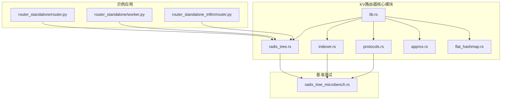

**图表来源**
- [lib/kv-router/src/lib.rs](file://lib/kv-router/src/lib.rs#L1-L22)
- [lib/kv-router/benches/radix_tree_microbench.rs](file://lib/kv-router/benches/radix_tree_microbench.rs#L1-L50)

**章节来源**
- [lib/kv-router/src/lib.rs](file://lib/kv-router/src/lib.rs#L1-L22)

## 核心组件

### Radix树数据结构

Radix树是KV缓存路由器的核心数据结构，提供了高效的前缀匹配能力：

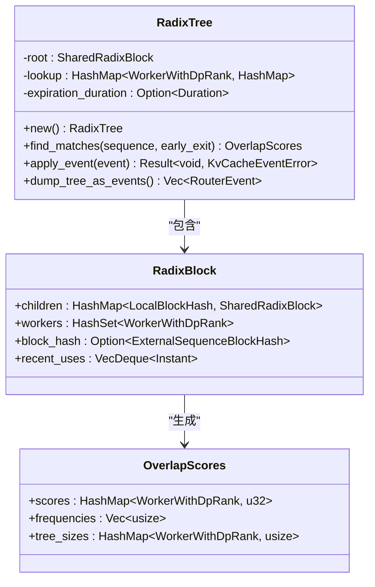

**图表来源**
- [lib/kv-router/src/radix_tree.rs](file://lib/kv-router/src/radix_tree.rs#L73-L85)
- [lib/kv-router/src/radix_tree.rs](file://lib/kv-router/src/radix_tree.rs#L29-L41)
- [lib/kv-router/src/protocols.rs](file://lib/kv-router/src/protocols.rs#L498-L553)

### 索引器（Indexer）

索引器负责管理Radix树的状态，提供异步事件处理和匹配查询：

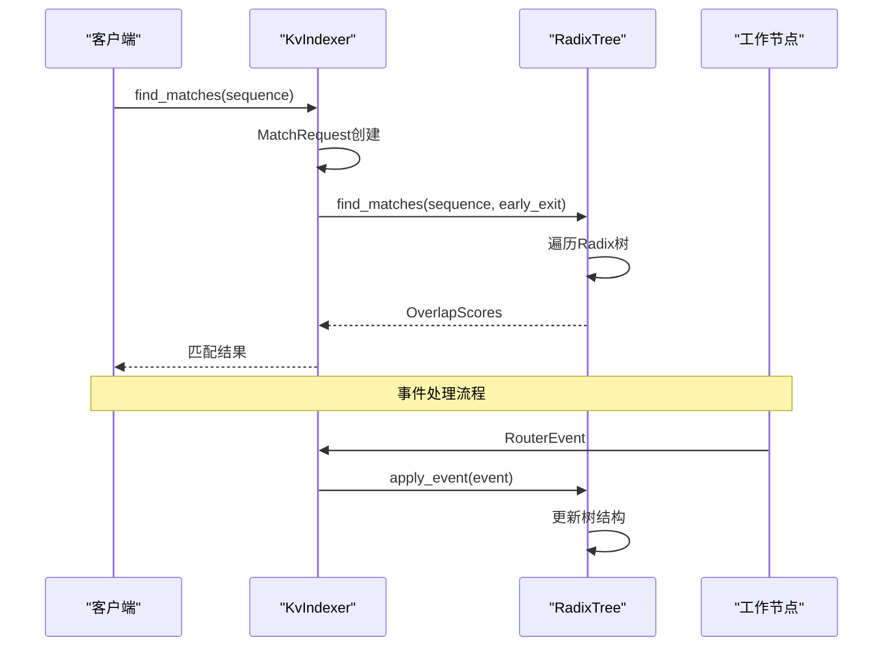

**图表来源**
- [lib/kv-router/src/indexer.rs](file://lib/kv-router/src/indexer.rs#L430-L451)
- [lib/kv-router/src/radix_tree.rs](file://lib/kv-router/src/radix_tree.rs#L144-L214)

### 协议定义（Protocols）

协议模块定义了所有通信格式和数据结构：

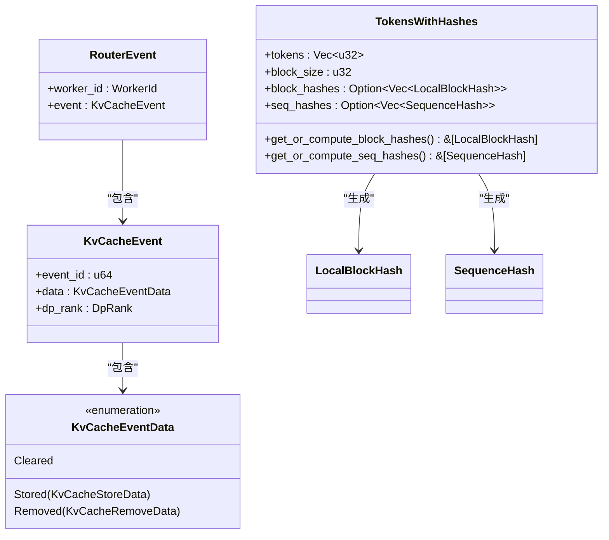

**图表来源**
- [lib/kv-router/src/protocols.rs](file://lib/kv-router/src/protocols.rs#L474-L496)
- [lib/kv-router/src/protocols.rs](file://lib/kv-router/src/protocols.rs#L262-L281)
- [lib/kv-router/src/protocols.rs](file://lib/kv-router/src/protocols.rs#L559-L650)

**章节来源**
- [lib/kv-router/src/radix_tree.rs](file://lib/kv-router/src/radix_tree.rs#L1-L800)
- [lib/kv-router/src/indexer.rs](file://lib/kv-router/src/indexer.rs#L1-L800)
- [lib/kv-router/src/protocols.rs](file://lib/kv-router/src/protocols.rs#L1-L791)

## 架构概览

KV缓存路由器采用分布式架构，支持多工作节点的KV缓存共享：

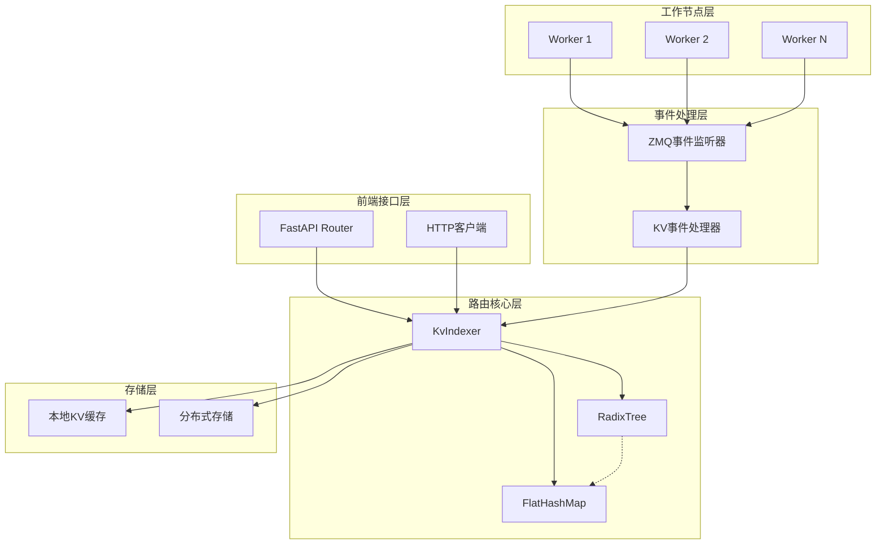

**图表来源**
- [examples/deployments/router_standalone/router.py](file://examples/deployments/router_standalone/router.py#L57-L90)
- [examples/deployments/router_standalone_trtllm/router.py](file://examples/deployments/router_standalone_trtllm/router.py#L87-L122)

## 详细组件分析

### Radix树前缀匹配算法

Radix树实现了高效的前缀匹配算法，支持以下特性：

#### 核心匹配逻辑

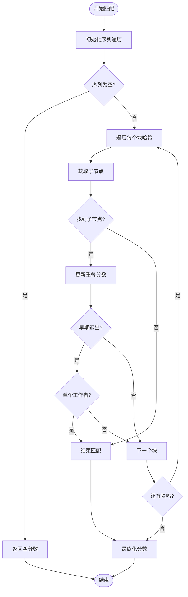

**图表来源**
- [lib/kv-router/src/radix_tree.rs](file://lib/kv-router/src/radix_tree.rs#L144-L214)

#### 性能优化策略

1. **早期退出优化**：当找到单个工作节点时立即停止匹配
2. **频率追踪**：通过时间缓冲区跟踪块访问频率
3. **内存管理**：自定义Drop实现避免递归栈溢出

**章节来源**
- [lib/kv-router/src/radix_tree.rs](file://lib/kv-router/src/radix_tree.rs#L144-L214)
- [lib/kv-router/src/radix_tree.rs](file://lib/kv-router/src/radix_tree.rs#L93-L124)

### 索引器工作原理

索引器提供了统一的接口来管理Radix树和FlatHashMap两种索引类型：

#### 事件处理流程

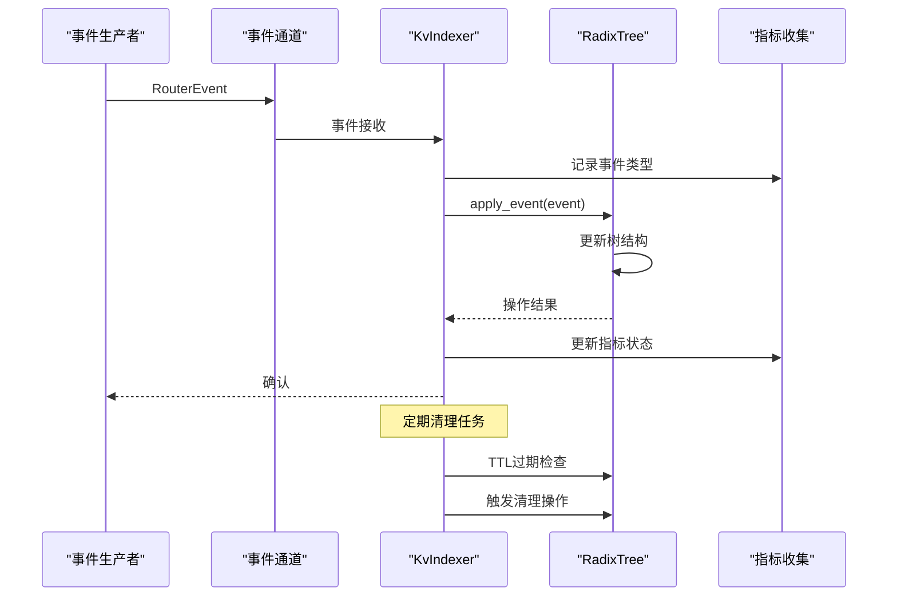

**图表来源**
- [lib/kv-router/src/indexer.rs](file://lib/kv-router/src/indexer.rs#L497-L671)

#### 缓存块哈希计算

索引器使用XXH3算法进行哈希计算，确保一致性和性能：

**章节来源**
- [lib/kv-router/src/indexer.rs](file://lib/kv-router/src/indexer.rs#L430-L737)
- [lib/kv-router/src/protocols.rs](file://lib/kv-router/src/protocols.rs#L11-L56)

### 近似匹配（Approx）算法

近似匹配算法提供了基于TTL的缓存管理和大小限制功能：

#### TTL过期管理

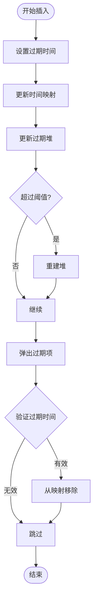

**图表来源**
- [lib/kv-router/src/approx.rs](file://lib/kv-router/src/approx.rs#L107-L162)

#### 内存管理策略

1. **固定阈值重建**：当堆中过期条目过多时重建
2. **目标大小比**：支持按比例修剪缓存
3. **序列位置优先级**：在相同过期时间下按序列位置排序

**章节来源**
- [lib/kv-router/src/approx.rs](file://lib/kv-router/src/approx.rs#L1-L800)

### 路由协议设计

路由协议定义了完整的事件处理和状态同步机制：

#### 事件处理机制

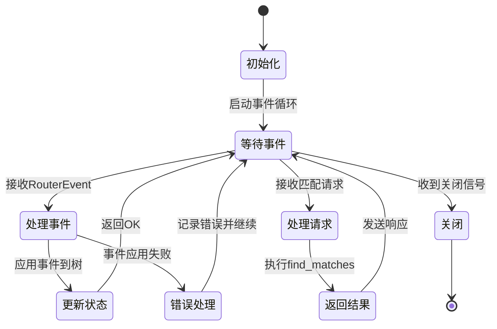

**图表来源**
- [lib/kv-router/src/indexer.rs](file://lib/kv-router/src/indexer.rs#L505-L671)

#### 错误传播机制

协议模块提供了完整的错误处理和传播机制：

**章节来源**
- [lib/kv-router/src/protocols.rs](file://lib/kv-router/src/protocols.rs#L460-L471)

## 依赖关系分析

KV缓存路由器的依赖关系清晰且模块化：

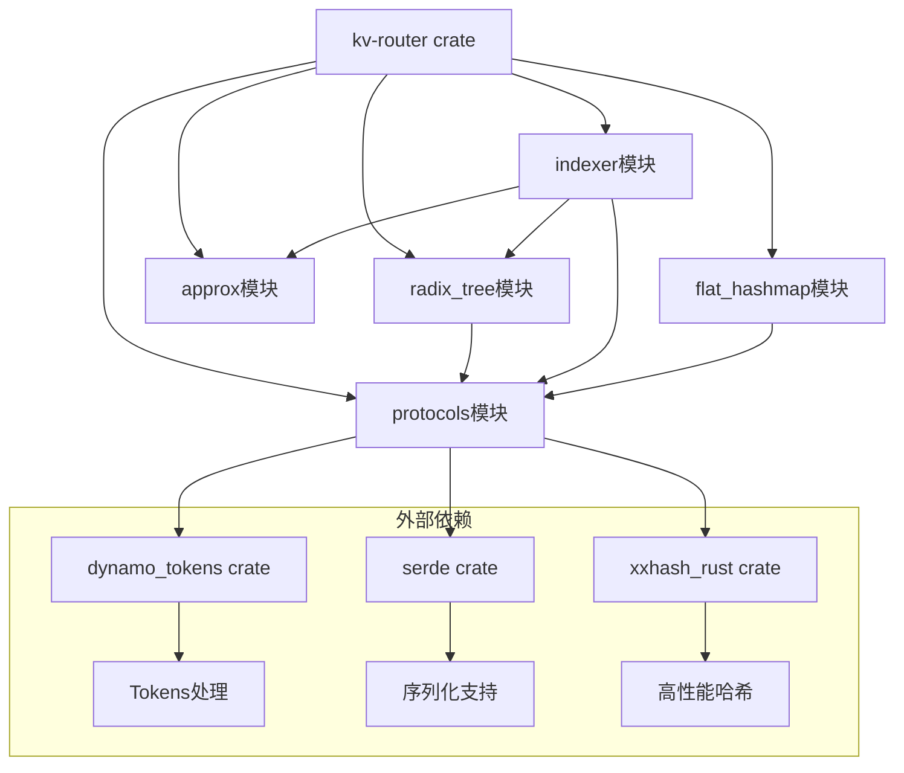

**图表来源**
- [lib/kv-router/src/lib.rs](file://lib/kv-router/src/lib.rs#L1-L22)

**章节来源**
- [lib/kv-router/src/lib.rs](file://lib/kv-router/src/lib.rs#L1-L22)

## 性能考虑

### 基准测试框架

项目提供了全面的基准测试框架，支持多种性能指标测量：

#### 微基准测试功能

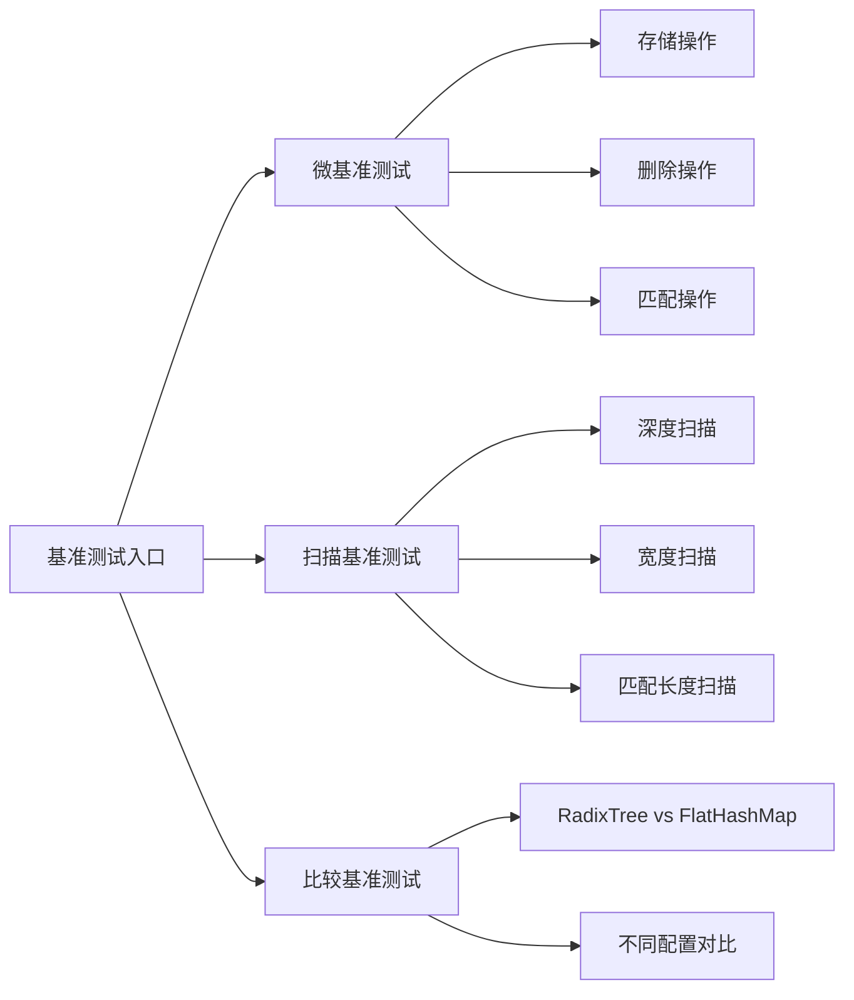

**图表来源**
- [lib/kv-router/benches/radix_tree_microbench.rs](file://lib/kv-router/benches/radix_tree_microbench.rs#L120-L207)

#### 性能优化建议

1. **批处理优化**：使用事件通道批量处理提高吞吐量
2. **内存池**：复用对象减少GC压力
3. **异步I/O**：利用Tokio运行时提高并发性能
4. **缓存预热**：预先加载常用模式提升命中率

**章节来源**
- [lib/kv-router/benches/radix_tree_microbench.rs](file://lib/kv-router/benches/radix_tree_microbench.rs#L1-L800)

## 故障排除指南

### 常见问题诊断

#### 内存泄漏排查

1. **检查引用计数**：确认Rc::try_unwrap调用正确
2. **验证Drop实现**：确保自定义Drop不会导致递归
3. **监控内存使用**：使用指标监控树大小变化

#### 并发问题调试

1. **通道阻塞检测**：检查事件通道是否满载
2. **死锁预防**：避免在事件处理中进行长时间阻塞操作
3. **资源清理**：确保所有资源在关闭时正确释放

**章节来源**
- [lib/kv-router/src/radix_tree.rs](file://lib/kv-router/src/radix_tree.rs#L93-L124)
- [lib/kv-router/src/indexer.rs](file://lib/kv-router/src/indexer.rs#L483-L675)

## 结论

KV缓存路由器提供了完整的分布式KV缓存路由解决方案，具有以下优势：

1. **高效的数据结构**：Radix树提供O(k)前缀匹配性能
2. **灵活的索引策略**：支持RadixTree和FlatHashMap两种实现
3. **完善的事件处理**：基于Tokio的异步事件处理机制
4. **可扩展的架构**：支持TTL和大小限制的缓存管理
5. **全面的监控**：内置指标收集和性能监控

该系统适用于大规模LLM推理场景，能够有效提升缓存利用率和系统整体性能。

## 附录

### 使用示例

#### 基础使用模式

```python
# 示例：使用KV路由器进行工作节点选择
import requests
import json

# 发送请求到路由器API
response = requests.post('http://localhost:7000/find_best_worker', 
                       json={'local_hashes': [1, 2, 3], 'num_tokens': 128})
result = response.json()
print(f"最佳工作节点: {result['worker_id']}")
```

#### 配置参数说明

- `block_size`: KV块大小（默认64）
- `num_workers`: 工作节点数量（默认4）
- `base_kv_events_port`: KV事件端口基础值（默认5557）
- `base_metrics_port`: 指标端口基础值（默认5657）

**章节来源**
- [examples/deployments/router_standalone/router.py](file://examples/deployments/router_standalone/router.py#L285-L335)
- [examples/deployments/router_standalone_trtllm/router.py](file://examples/deployments/router_standalone_trtllm/router.py#L359-L389)