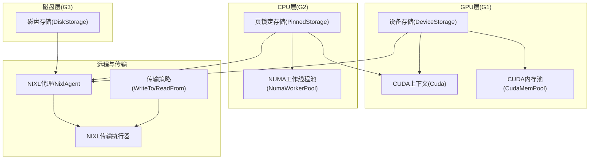
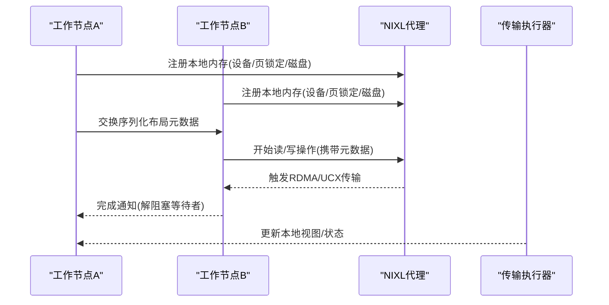
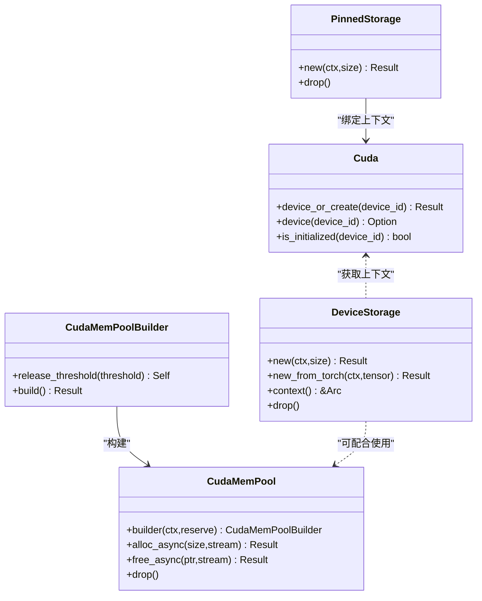
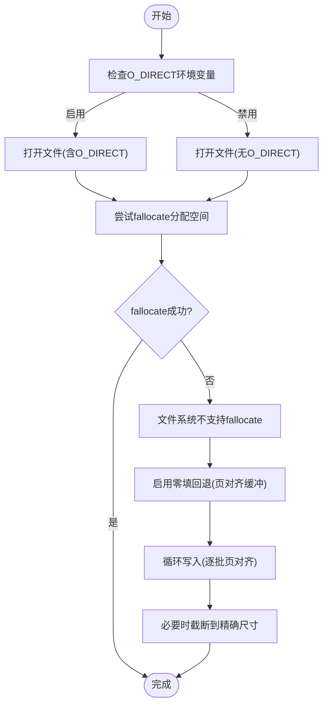
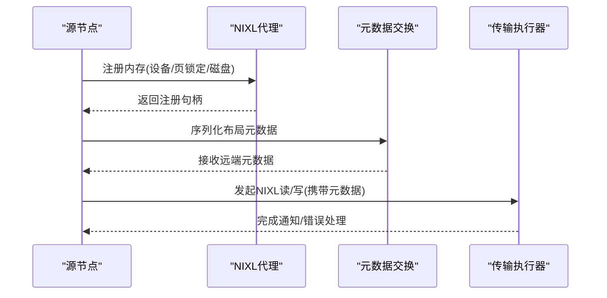
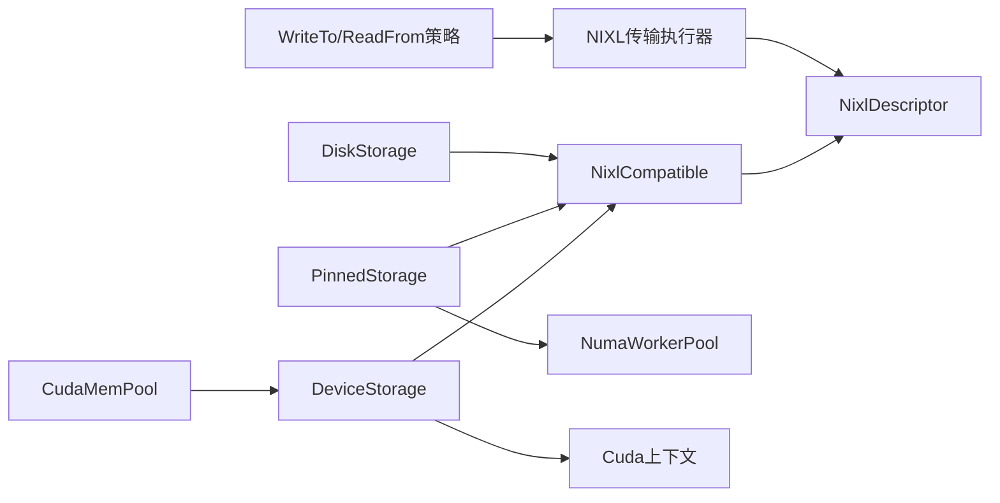

# 多级内存层次结构

<cite>
**本文引用的文件**
- [cuda.rs（LLM块管理器）](file://lib/llm/src/block_manager/storage/cuda.rs)
- [cuda.rs（内存池）](file://lib/memory/src/pool/cuda.rs)
- [disk.rs（LLM块管理器）](file://lib/llm/src/block_manager/storage/disk.rs)
- [disk.rs（内存模块）](file://lib/memory/src/disk.rs)
- [registered.rs（v2 内存）](file://lib/llm/src/block_manager/v2/memory/registered.rs)
- [device.rs（v2 内存）](file://lib/llm/src/block_manager/v2/memory/device.rs)
- [nixl.rs（内存模块）](file://lib/memory/src/nixl.rs)
- [strategy.rs（块传输策略）](file://lib/llm/src/block_manager/block/transfer/strategy.rs)
- [nixl.rs（v2 传输执行器）](file://lib/llm/src/block_manager/v2/physical/transfer/executor/nixl.rs)
- [cache_stats.rs（绑定KVBM）](file://lib/bindings/kvbm/src/block_manager/cache_stats.rs)
- [config.rs（块管理器配置）](file://lib/llm/src/block_manager/config.rs)
- [worker_pool.rs（NUMA分配器）](file://lib/llm/src/block_manager/numa_allocator/worker_pool.rs)
- [numa_allocator.rs（NUMA工具）](file://lib/llm/src/block_manager/numa_allocator.rs)
- [bench_local_transfer_v2.rs](file://lib/llm/bin/bench_local_transfer_v2.rs)
- [kvbm_architecture.md](file://docs/kvbm/kvbm_architecture.md)
- [kvbm-design-deepdive.md](file://docs/kvbm/kvbm_design_deepdive.md)
- [README.md（NIXL连接API）](file://fern/pages/api/nixl-connect/README.md)
</cite>

## 目录
1. [引言](#引言)
2. [项目结构](#项目结构)
3. [核心组件](#核心组件)
4. [架构总览](#架构总览)
5. [组件详解](#组件详解)
6. [依赖关系分析](#依赖关系分析)
7. [性能考量](#性能考量)
8. [故障排查指南](#故障排查指南)
9. [结论](#结论)
10. [附录](#附录)

## 引言
本文件系统性阐述Dynamo多级内存层次结构：GPU显存、CPU主机内存与持久化磁盘之间的协同与数据传输策略；深入解析CUDA存储后端（显存分配、内存池与GPU Direct RDMA优化）；详述磁盘存储实现（文件分配、对齐约束、零填回退与I/O优化）；说明NIXL在网络接口加速（GPU Direct RDMA）中的角色、注册流程与元数据交换；并给出内存回收、缓存预取与性能监控指标、不同硬件配置的最佳实践与故障排查建议。

## 项目结构
Dynamo的多级内存由以下关键模块构成：
- CUDA存储与上下文管理：LLM块管理器中的CUDA存储类型与上下文单例，以及独立的CUDA内存池模块
- 磁盘存储：基于内存映射文件的磁盘后备，支持O_DIRECT与零填回退
- NIXL集成：统一的远程内存注册与元数据交换，支撑跨节点RDMA与P2P传输
- 缓存统计与预取：滑动窗口统计命中率，辅助预取决策
- NUMA感知：为NUMA拓扑优化的Pinned内存分配路径

图示来源
- [cuda.rs（LLM块管理器）](file://lib/llm/src/block_manager/storage/cuda.rs#L117-L187)
- [cuda.rs（内存池）](file://lib/memory/src/pool/cuda.rs#L143-L159)
- [disk.rs（LLM块管理器）](file://lib/llm/src/block_manager/storage/disk.rs#L19-L37)
- [registered.rs（v2 内存）](file://lib/llm/src/block_manager/v2/memory/registered.rs#L11-L17)
- [nixl.rs（内存模块）](file://lib/memory/src/nixl.rs#L19-L26)
- [strategy.rs（块传输策略）](file://lib/llm/src/block_manager/block/transfer/strategy.rs#L9-L49)

章节来源
- [cuda.rs（LLM块管理器）](file://lib/llm/src/block_manager/storage/cuda.rs#L1-L680)
- [cuda.rs（内存池）](file://lib/memory/src/pool/cuda.rs#L1-L352)
- [disk.rs（LLM块管理器）](file://lib/llm/src/block_manager/storage/disk.rs#L1-L673)
- [disk.rs（内存模块）](file://lib/memory/src/disk.rs#L1-L394)
- [registered.rs（v2 内存）](file://lib/llm/src/block_manager/v2/memory/registered.rs#L1-L196)
- [nixl.rs（内存模块）](file://lib/memory/src/nixl.rs#L1-L54)
- [strategy.rs（块传输策略）](file://lib/llm/src/block_manager/block/transfer/strategy.rs#L1-L49)

## 核心组件
- 设备存储（DeviceStorage）：封装CUDA设备内存分配、上下文绑定与释放，支持从PyTorch张量接管内存所有权
- 页锁定存储（PinnedStorage）：封装写组合或常规页锁定内存分配，支持NUMA感知的优先首触策略
- 磁盘存储（DiskStorage）：临时文件+fallocate或零填回退，支持O_DIRECT与页对齐要求
- CUDA内存池（CudaMemPool）：设备内存池封装，提供异步子分配与释放阈值控制
- NIXL注册与传输：统一的内存注册接口、描述符与跨节点RDMA/UCX传输执行器
- 缓存统计（CacheStatsTracker）：滑动窗口统计主机与磁盘缓存命中率，周期性日志输出

章节来源
- [cuda.rs（LLM块管理器）](file://lib/llm/src/block_manager/storage/cuda.rs#L190-L475)
- [cuda.rs（内存池）](file://lib/memory/src/pool/cuda.rs#L143-L283)
- [disk.rs（LLM块管理器）](file://lib/llm/src/block_manager/storage/disk.rs#L199-L364)
- [disk.rs（内存模块）](file://lib/memory/src/disk.rs#L19-L178)
- [registered.rs（v2 内存）](file://lib/llm/src/block_manager/v2/memory/registered.rs#L11-L196)
- [cache_stats.rs（绑定KVBM）](file://lib/bindings/kvbm/src/block_manager/cache_stats.rs#L33-L237)

## 架构总览
Dynamo通过分层缓存（G1/G2/G3）与NIXL统一后端，实现跨节点的高性能数据传输与内存共享。典型路径：
- 预热与热点数据驻留于G1（设备显存）
- 次热数据驻留于G2（页锁定CPU内存）
- 冷数据落盘于G3（磁盘文件），支持O_DIRECT与零填回退
- 跨节点时，通过NIXL注册本地内存，交换布局元数据，进行RDMA/UCX传输

图示来源
- [kvbm-design-deepdive.md](file://docs/kvbm/kvbm_design_deepdive.md#L91-L159)
- [README.md（NIXL连接API）](file://fern/pages/api/nixl-connect/README.md#L52-L65)
- [nixl.rs（v2 传输执行器）](file://lib/llm/src/block_manager/v2/physical/transfer/executor/nixl.rs#L219-L255)

## 组件详解

### CUDA存储后端与内存池
- 设备存储（DeviceStorage）
  - 支持从CUDA上下文绑定后调用cudaMalloc同步分配
  - 支持从PyTorch张量接管内存，避免重复拷贝
  - 提供NIXL参数（VRAM类型、设备ID）
- 页锁定存储（PinnedStorage）
  - 优先尝试写组合（WC）内存以优化PCIe DMA；若不支持则回退到常规页锁定
  - 可选NUMA感知分配：通过NUMA工作线程池按GPU设备自动定位NUMA节点，采用首触策略确保页面放置正确
- CUDA内存池（CudaMemPool）
  - 基于CUDA内存池API，提供异步子分配与释放
  - 通过释放阈值控制将未使用内存返回系统，降低碎片
  - 对主机侧调用进行互斥串行化，保证cuMemAllocFromPoolAsync的线程安全

图示来源
- [cuda.rs（LLM块管理器）](file://lib/llm/src/block_manager/storage/cuda.rs#L117-L187)
- [cuda.rs（LLM块管理器）](file://lib/llm/src/block_manager/storage/cuda.rs#L355-L457)
- [cuda.rs（LLM块管理器）](file://lib/llm/src/block_manager/storage/cuda.rs#L190-L253)
- [cuda.rs（内存池）](file://lib/memory/src/pool/cuda.rs#L143-L283)
- [cuda.rs（内存池）](file://lib/memory/src/pool/cuda.rs#L27-L66)

章节来源
- [cuda.rs（LLM块管理器）](file://lib/llm/src/block_manager/storage/cuda.rs#L70-L680)
- [cuda.rs（内存池）](file://lib/memory/src/pool/cuda.rs#L1-L352)
- [worker_pool.rs（NUMA分配器）](file://lib/llm/src/block_manager/numa_allocator/worker_pool.rs#L1-L377)
- [numa_allocator.rs（NUMA工具）](file://lib/llm/src/block_manager/numa_allocator.rs#L1-L49)

### 磁盘存储与I/O优化
- 文件分配策略
  - 优先使用fallocate进行实际空间分配；若不支持（如某些分布式文件系统），可启用零填回退，逐批写入页对齐缓冲区
  - 支持禁用O_DIRECT（通过环境变量），便于调试或兼容性场景
- O_DIRECT与对齐
  - 在支持O_DIRECT的文件系统上强制开启，要求缓冲地址与写入大小按页对齐
  - 零填回退路径中使用aligned_vec确保页对齐，避免EINVAL错误
- 生命周期与清理
  - 磁盘文件在注册NIXL后再解除链接，确保GDS/RDMA可用
  - Drop阶段负责清理与unlink

图示来源
- [disk.rs（LLM块管理器）](file://lib/llm/src/block_manager/storage/disk.rs#L62-L197)
- [disk.rs（LLM块管理器）](file://lib/llm/src/block_manager/storage/disk.rs#L239-L298)
- [disk.rs（内存模块）](file://lib/memory/src/disk.rs#L122-L140)

章节来源
- [disk.rs（LLM块管理器）](file://lib/llm/src/block_manager/storage/disk.rs#L1-L673)
- [disk.rs（内存模块）](file://lib/memory/src/disk.rs#L1-L394)

### NIXL：跨节点数据传输与注册
- 注册接口与描述符
  - 所有可注册存储实现NixlCompatible，提供指针、大小、内存类型与设备ID
  - NixlDescriptor封装内存区域与元数据，作为跨节点传输的载体
- 远程内存集成
  - 通过NIXL代理注册本地内存，交换序列化布局元数据，重建远端布局视图
  - 支持设备内存(VRAM)、页锁定内存(DRAM)与文件型内存(File)等多类型
- 传输执行
  - 依据写入/读取策略选择NIXL读/写操作，执行器校验源/目标一致性与布局兼容性

图示来源
- [registered.rs（v2 内存）](file://lib/llm/src/block_manager/v2/memory/registered.rs#L11-L196)
- [nixl.rs（内存模块）](file://lib/memory/src/nixl.rs#L19-L54)
- [strategy.rs（块传输策略）](file://lib/llm/src/block_manager/block/transfer/strategy.rs#L9-L49)
- [nixl.rs（v2 传输执行器）](file://lib/llm/src/block_manager/v2/physical/transfer/executor/nixl.rs#L219-L255)
- [kvbm-design-deepdive.md](file://docs/kvbm/kvbm_design_deepdive.md#L91-L159)

章节来源
- [registered.rs（v2 内存）](file://lib/llm/src/block_manager/v2/memory/registered.rs#L1-L196)
- [nixl.rs（内存模块）](file://lib/memory/src/nixl.rs#L1-L54)
- [strategy.rs（块传输策略）](file://lib/llm/src/block_manager/block/transfer/strategy.rs#L1-L49)
- [nixl.rs（v2 传输执行器）](file://lib/llm/src/block_manager/v2/physical/transfer/executor/nixl.rs#L219-L255)
- [kvbm_architecture.md](file://docs/kvbm/kvbm_architecture.md#L30-L40)

### 缓存预取与回收策略
- 回收策略
  - CUDA内存池：通过释放阈值将闲置内存归还系统，减少碎片
  - 磁盘存储：注册后解除链接，进程退出时由OS回收
  - NIXL注册：包装器确保注册句柄先于底层存储释放，避免悬挂访问
- 缓存预取与命中率
  - 滑动窗口统计主机与磁盘缓存命中率，周期性日志输出
  - 可通过环境变量调整窗口大小与日志间隔

章节来源
- [cuda.rs（内存池）](file://lib/memory/src/pool/cuda.rs#L143-L283)
- [disk.rs（内存模块）](file://lib/memory/src/disk.rs#L151-L169)
- [registered.rs（v2 内存）](file://lib/llm/src/block_manager/v2/memory/registered.rs#L62-L152)
- [cache_stats.rs（绑定KVBM）](file://lib/bindings/kvbm/src/block_manager/cache_stats.rs#L33-L237)

### 数据传输策略与跨节点路径
- 写入策略
  - 从磁盘写入：优先NIXL写入（磁盘->远端）
  - 从系统内存/页锁定/设备内存写入：优先NIXL读取（远端->本地）
- 读取策略
  - 从系统内存/页锁定/设备内存读取：优先NIXL写入（本地->远端）
- 传输执行器
  - 校验布局外维一致、源必须本地、捕获NIXL元数据并发起读/写操作

章节来源
- [strategy.rs（块传输策略）](file://lib/llm/src/block_manager/block/transfer/strategy.rs#L9-L49)
- [nixl.rs（v2 传输执行器）](file://lib/llm/src/block_manager/v2/physical/transfer/executor/nixl.rs#L219-L255)

## 依赖关系分析
- 存储类型与NIXL兼容
  - 设备存储、页锁定存储、磁盘存储均实现NixlCompatible，提供注册参数
- 传输策略与执行器耦合
  - WriteTo/ReadFrom策略决定NIXL读/写方向；执行器负责具体传输与元数据校验
- NUMA与CUDA上下文
  - PinnedStorage可借助NUMA工作线程池进行首触分配；CUDA上下文单例确保线程绑定与资源复用

图示来源
- [cuda.rs（LLM块管理器）](file://lib/llm/src/block_manager/storage/cuda.rs#L190-L475)
- [registered.rs（v2 内存）](file://lib/llm/src/block_manager/v2/memory/registered.rs#L11-L196)
- [nixl.rs（内存模块）](file://lib/memory/src/nixl.rs#L19-L54)
- [strategy.rs（块传输策略）](file://lib/llm/src/block_manager/block/transfer/strategy.rs#L9-L49)
- [worker_pool.rs（NUMA分配器）](file://lib/llm/src/block_manager/numa_allocator/worker_pool.rs#L334-L347)

章节来源
- [cuda.rs（LLM块管理器）](file://lib/llm/src/block_manager/storage/cuda.rs#L1-L680)
- [registered.rs（v2 内存）](file://lib/llm/src/block_manager/v2/memory/registered.rs#L1-L196)
- [strategy.rs（块传输策略）](file://lib/llm/src/block_manager/block/transfer/strategy.rs#L1-L49)
- [worker_pool.rs（NUMA分配器）](file://lib/llm/src/block_manager/numa_allocator/worker_pool.rs#L1-L377)

## 性能考量
- 显存分配与池化
  - 使用CUDA内存池降低频繁分配/释放开销；合理设置释放阈值平衡内存占用与回收延迟
  - 设备存储直接cudaMalloc，适合大块一次性分配；小而频繁的分配建议池化
- 主机内存与NUMA
  - 启用NUMA感知分配，使页锁定内存靠近对应GPU所在NUMA节点，减少跨NUMA访问
  - 优先写组合内存（WC）以优化PCIe DMA，若平台不支持则回退到常规页锁定
- 磁盘I/O与O_DIRECT
  - 在支持O_DIRECT的文件系统上启用，确保页对齐，避免内核页缓存开销
  - 不支持fallocate时启用零填回退，注意对齐与截断逻辑
- 传输路径
  - 尽可能走NIXL读/写直通，避免额外拷贝；确保源/目标一致性与布局兼容
  - 通过缓存命中率统计指导预取策略，减少跨节点传输次数

[本节为通用性能讨论，无需特定文件引用]

## 故障排查指南
- CUDA相关
  - 上下文绑定失败：确认当前线程已绑定CUDA上下文；检查设备ID与上下文是否匹配
  - 设备内存分配失败：检查显存剩余与对齐；考虑使用内存池或降低分配粒度
- NUMA相关
  - 分配失败或性能异常：检查DYN_KVBM_ENABLE_NUMA是否正确设置；确认NUMA拓扑与GPU映射
- 磁盘I/O相关
  - fallocate不支持：启用零填回退；检查页对齐与缓冲大小；必要时禁用O_DIRECT进行对比测试
  - O_DIRECT EINVAL：检查缓冲地址与写入大小是否按页对齐；确认文件系统支持
- NIXL相关
  - 注册失败：确认内存类型与设备ID；确保文件已注册后再解除链接（磁盘）
  - 传输失败：核对布局元数据交换是否完整；检查源/目标一致性与操作配对
- 缓存统计
  - 命中率低：增大滑动窗口与日志间隔，观察热点变化；结合预取策略调整

章节来源
- [cuda.rs（LLM块管理器）](file://lib/llm/src/block_manager/storage/cuda.rs#L91-L106)
- [cuda.rs（内存池）](file://lib/memory/src/pool/cuda.rs#L170-L235)
- [disk.rs（LLM块管理器）](file://lib/llm/src/block_manager/storage/disk.rs#L62-L197)
- [disk.rs（内存模块）](file://lib/memory/src/disk.rs#L151-L169)
- [registered.rs（v2 内存）](file://lib/llm/src/block_manager/v2/memory/registered.rs#L62-L152)
- [cache_stats.rs（绑定KVBM）](file://lib/bindings/kvbm/src/block_manager/cache_stats.rs#L123-L203)

## 结论
Dynamo通过分层缓存与NIXL统一后端，实现了从GPU显存到磁盘的高效数据流与跨节点RDMA传输。CUDA内存池、NUMA感知页锁定分配与O_DIRECT对齐策略共同提升了整体性能。结合缓存命中率统计与预取机制，可在不同硬件配置下获得稳定且可扩展的推理吞吐。

[本节为总结性内容，无需特定文件引用]

## 附录

### 环境变量与配置要点
- 磁盘缓存
  - DYN_KVBM_DISK_CACHE_DIR：磁盘缓存目录
  - DYN_KVBM_DISK_ZEROFILL_FALLBACK：fallocate不支持时启用零填回退
  - DYN_KVBM_DISK_DISABLE_O_DIRECT：禁用O_DIRECT（调试用途）
- NUMA
  - DYN_KVBM_ENABLE_NUMA：启用NUMA感知分配
- 缓存统计
  - DYN_KVBM_CACHE_STATS_MAX_REQUESTS：滑动窗口大小
  - DYN_KVBM_CACHE_STATS_LOG_INTERVAL_SECS：日志间隔（秒）

章节来源
- [disk.rs（LLM块管理器）](file://lib/llm/src/block_manager/storage/disk.rs#L18-L22)
- [numa_allocator.rs（NUMA工具）](file://lib/llm/src/block_manager/numa_allocator.rs#L11-L19)
- [cache_stats.rs（绑定KVBM）](file://lib/bindings/kvbm/src/block_manager/cache_stats.rs#L67-L85)

### 基准与验证
- 本地传输基准：通过NIXL代理与布局配置进行带宽/延迟测量，验证不同策略与后端性能
- 示例路径参考：bench_local_transfer_v2.rs

章节来源
- [bench_local_transfer_v2.rs](file://lib/llm/bin/bench_local_transfer_v2.rs#L106-L147)