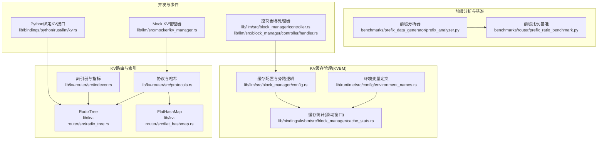
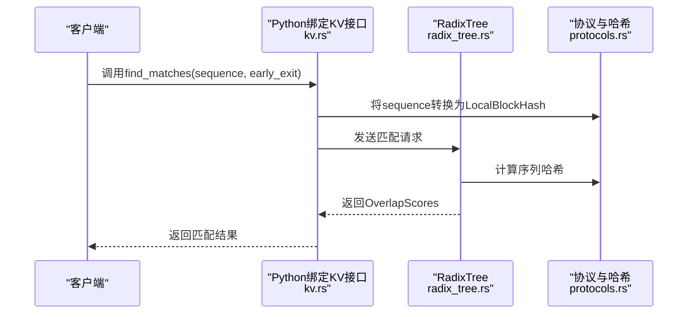
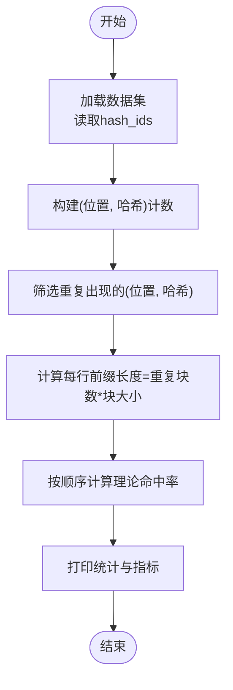
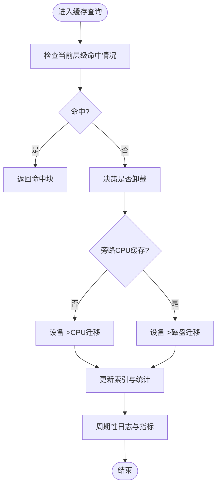
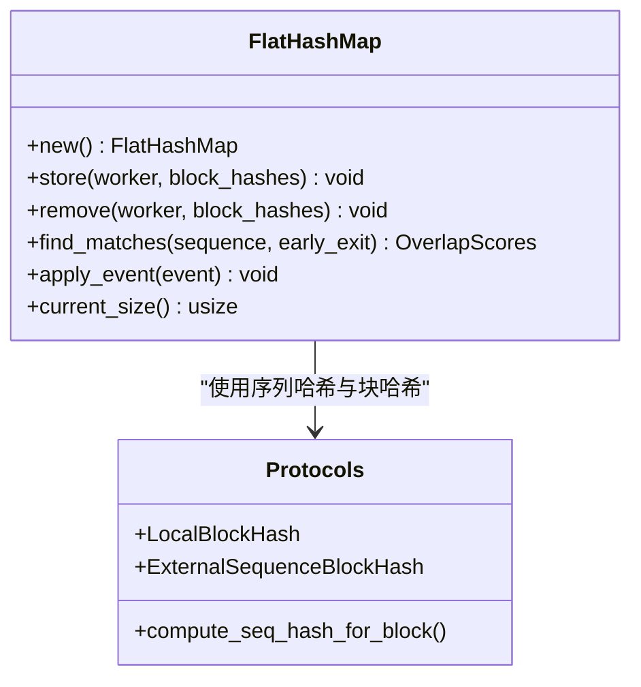
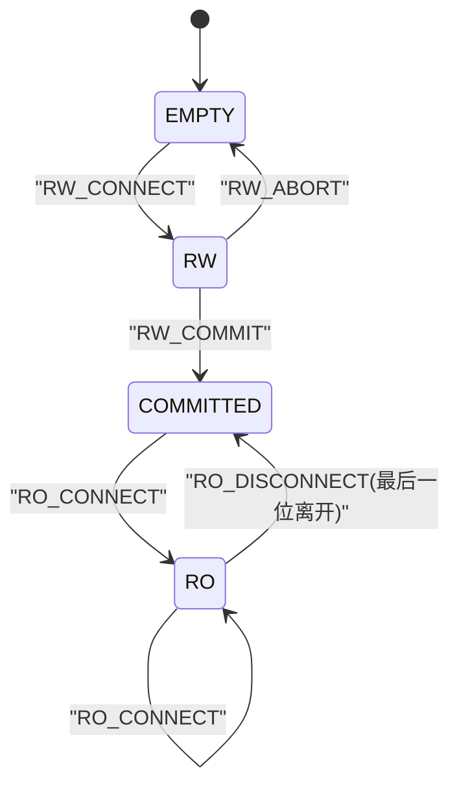
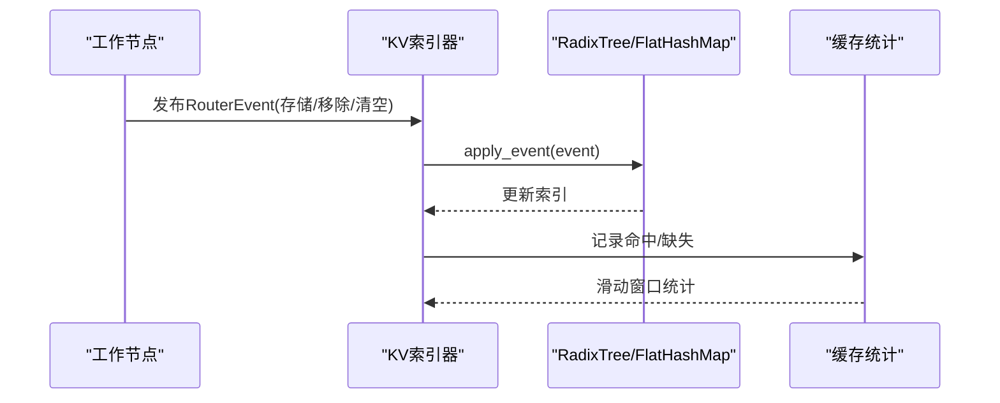
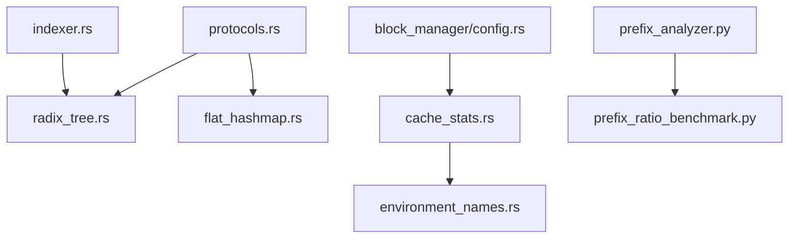

# 缓存优化策略

<cite>
**本文引用的文件**
- [lib/kv-router/src/flat_hashmap.rs](file://lib/kv-router/src/flat_hashmap.rs)
- [lib/kv-router/src/radix_tree.rs](file://lib/kv-router/src/radix_tree.rs)
- [lib/kv-router/src/protocols.rs](file://lib/kv-router/src/protocols.rs)
- [lib/kv-router/src/indexer.rs](file://lib/kv-router/src/indexer.rs)
- [benchmarks/prefix_data_generator/prefix_analyzer.py](file://benchmarks/prefix_data_generator/prefix_analyzer.py)
- [benchmarks/router/prefix_ratio_benchmark.py](file://benchmarks/router/prefix_ratio_benchmark.py)
- [lib/bindings/kvbm/src/block_manager/cache_stats.rs](file://lib/bindings/kvbm/src/block_manager/cache_stats.rs)
- [lib/llm/src/block_manager/config.rs](file://lib/llm/src/block_manager/config.rs)
- [lib/runtime/src/config/environment_names.rs](file://lib/runtime/src/config/environment_names.rs)
- [lib/llm/src/mocker/kv_manager.rs](file://lib/llm/src/mocker/kv_manager.rs)
- [lib/bindings/python/rust/llm/kv.rs](file://lib/bindings/python/rust/llm/kv.rs)
- [lib/llm/src/block_manager/controller.rs](file://lib/llm/src/block_manager/controller.rs)
- [lib/llm/src/block_manager/controller/handler.rs](file://lib/llm/src/block_manager/controller/handler.rs)
</cite>

## 目录
1. [引言](#引言)
2. [项目结构](#项目结构)
3. [核心组件](#核心组件)
4. [架构总览](#架构总览)
5. [详细组件分析](#详细组件分析)
6. [依赖关系分析](#依赖关系分析)
7. [性能考量](#性能考量)
8. [故障排查指南](#故障排查指南)
9. [结论](#结论)
10. [附录](#附录)

## 引言
本文件面向KV缓存优化策略的技术文档，围绕以下主题展开：前缀缓存优化算法（重复前缀识别、缓存共享策略、命中率提升）、缓存卸载（Offload）机制（内存压力检测、块迁移策略、性能影响评估）、扁平哈希映射（Flat HashMap）在缓存查找中的性能优势与使用场景、资源状态管理（Resource State）对缓存策略的影响与优化方法、缓存一致性保证、并发访问控制与内存碎片化处理，并提供缓存性能监控指标、调优参数配置以及实际部署中的优化案例研究。

## 项目结构
本仓库围绕KV路由与缓存管理形成多层能力：
- KV路由与索引：RadixTree与FlatHashMap两种索引结构，支持重叠匹配与事件应用。
- 前缀数据与命中率分析：前缀数据生成器与分析器，用于识别重复前缀与理论命中率估算。
- KV缓存管理（KVBM）：多级缓存（设备/G2/CPU/G3）与滑动窗口统计、环境变量配置、指标导出。
- 性能基准：前缀比例基准脚本，结合aiperf进行端到端时延评估。
- 并发与事件：协议与事件模型、Python绑定、控制器与处理器。

**图表来源**
- [lib/kv-router/src/radix_tree.rs](file://lib/kv-router/src/radix_tree.rs#L1-L200)
- [lib/kv-router/src/flat_hashmap.rs](file://lib/kv-router/src/flat_hashmap.rs#L1-L300)
- [lib/kv-router/src/protocols.rs](file://lib/kv-router/src/protocols.rs#L1-L200)
- [lib/kv-router/src/indexer.rs](file://lib/kv-router/src/indexer.rs#L1-L295)
- [benchmarks/prefix_data_generator/prefix_analyzer.py](file://benchmarks/prefix_data_generator/prefix_analyzer.py#L1-L184)
- [benchmarks/router/prefix_ratio_benchmark.py](file://benchmarks/router/prefix_ratio_benchmark.py#L1-L506)
- [lib/bindings/kvbm/src/block_manager/cache_stats.rs](file://lib/bindings/kvbm/src/block_manager/cache_stats.rs#L1-L319)
- [lib/llm/src/block_manager/config.rs](file://lib/llm/src/block_manager/config.rs#L270-L305)
- [lib/runtime/src/config/environment_names.rs](file://lib/runtime/src/config/environment_names.rs#L173-L205)
- [lib/bindings/python/rust/llm/kv.rs](file://lib/bindings/python/rust/llm/kv.rs#L447-L494)
- [lib/llm/src/mocker/kv_manager.rs](file://lib/llm/src/mocker/kv_manager.rs#L78-L121)
- [lib/llm/src/block_manager/controller.rs](file://lib/llm/src/block_manager/controller.rs#L39-L173)
- [lib/llm/src/block_manager/controller/handler.rs](file://lib/llm/src/block_manager/controller/handler.rs#L1-L36)

**章节来源**
- [lib/kv-router/src/lib.rs](file://lib/kv-router/src/lib.rs#L1-L22)

## 核心组件
- 扁平哈希映射（Flat HashMap）：以双向HashMap实现，提供与RadixTree一致的查找语义，但避免树遍历开销，适合热点局部性与高并发场景。
- 前缀分析器：基于位置-哈希对计数，识别重复前缀，计算理论命中率，为缓存共享策略提供数据基础。
- KV缓存管理（KVBM）：多级缓存（设备/G2/CPU/G3），滑动窗口统计命中率，环境变量驱动的配置与旁路策略。
- 协议与哈希：统一的本地块哈希、序列哈希计算与事件模型，支撑跨组件一致性与可移植性。
- 控制器与处理器：集中式控制消息（状态查询、池复位、重置请求），配合异步通道处理事件与匹配请求。

**章节来源**
- [lib/kv-router/src/flat_hashmap.rs](file://lib/kv-router/src/flat_hashmap.rs#L21-L300)
- [benchmarks/prefix_data_generator/prefix_analyzer.py](file://benchmarks/prefix_data_generator/prefix_analyzer.py#L10-L184)
- [lib/bindings/kvbm/src/block_manager/cache_stats.rs](file://lib/bindings/kvbm/src/block_manager/cache_stats.rs#L35-L237)
- [lib/kv-router/src/protocols.rs](file://lib/kv-router/src/protocols.rs#L1-L200)
- [lib/llm/src/block_manager/controller.rs](file://lib/llm/src/block_manager/controller.rs#L39-L173)
- [lib/llm/src/block_manager/controller/handler.rs](file://lib/llm/src/block_manager/controller/handler.rs#L1-L36)

## 架构总览
KV缓存优化由“索引层（路由）—缓存管理层（KVBM）—数据层（前缀分析/基准）”构成。索引层通过RadixTree或FlatHashMap进行重叠匹配；缓存管理层负责多级缓存的容量与迁移策略；数据层通过前缀分析与基准脚本评估命中率与端到端性能。

**图表来源**
- [lib/bindings/python/rust/llm/kv.rs](file://lib/bindings/python/rust/llm/kv.rs#L450-L486)
- [lib/kv-router/src/radix_tree.rs](file://lib/kv-router/src/radix_tree.rs#L144-L200)
- [lib/kv-router/src/protocols.rs](file://lib/kv-router/src/protocols.rs#L58-L81)

## 详细组件分析

### 前缀缓存优化算法
- 重复前缀识别：基于位置-哈希对计数，筛选重复出现的块，作为共享缓存的基础单元。
- 缓存共享策略：将重复前缀对应的块标记为共享，降低冗余存储与传输成本。
- 命中率提升技术：通过“首次未见索引”计算理论命中率，指导缓存预热与淘汰策略。

**图表来源**
- [benchmarks/prefix_data_generator/prefix_analyzer.py](file://benchmarks/prefix_data_generator/prefix_analyzer.py#L42-L149)

**章节来源**
- [benchmarks/prefix_data_generator/prefix_analyzer.py](file://benchmarks/prefix_data_generator/prefix_analyzer.py#L10-L184)

### 缓存卸载（Offload）机制
- 内存压力检测：通过滑动窗口统计主机与磁盘缓存命中率，结合环境变量阈值判断是否触发卸载。
- 块迁移策略：根据旁路逻辑决定是否绕过CPU缓存直接从设备迁移到磁盘，减少中间层延迟。
- 性能影响评估：利用前缀比例基准脚本与aiperf，对比不同前缀比例下的TTFT与ITL指标。

**图表来源**
- [lib/bindings/kvbm/src/block_manager/cache_stats.rs](file://lib/bindings/kvbm/src/block_manager/cache_stats.rs#L88-L203)
- [lib/llm/src/block_manager/config.rs](file://lib/llm/src/block_manager/config.rs#L270-L305)
- [benchmarks/router/prefix_ratio_benchmark.py](file://benchmarks/router/prefix_ratio_benchmark.py#L120-L302)

**章节来源**
- [lib/bindings/kvbm/src/block_manager/cache_stats.rs](file://lib/bindings/kvbm/src/block_manager/cache_stats.rs#L35-L237)
- [lib/llm/src/block_manager/config.rs](file://lib/llm/src/block_manager/config.rs#L270-L305)
- [benchmarks/router/prefix_ratio_benchmark.py](file://benchmarks/router/prefix_ratio_benchmark.py#L1-L506)

### 扁平哈希映射（Flat HashMap）在缓存查找中的性能优势
- 结构设计：双向HashMap分别维护“块->工作者”和“工作者->块”，查找与更新均为O(1)平均复杂度。
- 算法流程：对序列哈希逐层求交，记录丢弃工作者的深度作为得分，支持早期退出。
- 适用场景：高并发、热点局部性强、需要避免指针跳转与树遍历开销的场景。

**图表来源**
- [lib/kv-router/src/flat_hashmap.rs](file://lib/kv-router/src/flat_hashmap.rs#L33-L182)
- [lib/kv-router/src/protocols.rs](file://lib/kv-router/src/protocols.rs#L58-L81)

**章节来源**
- [lib/kv-router/src/flat_hashmap.rs](file://lib/kv-router/src/flat_hashmap.rs#L21-L300)
- [lib/kv-router/src/protocols.rs](file://lib/kv-router/src/protocols.rs#L1-L200)

### 资源状态管理（Resource State）对缓存策略的影响
- 状态机：KVBM服务端状态机定义了EMPTY、COMMITTED、RW、RO等状态及合法转换，确保写者独占、读者共享的一致性。
- 控制消息：控制器支持查询各缓存层级状态、重置池、重置指定序列块等操作，便于动态调整缓存策略。
- 处理器：根据缓存层级选择对应池控制器执行复位，保障资源回收与隔离。

**图表来源**
- [lib/gpu_memory_service/server/locking.py](file://lib/gpu_memory_service/server/locking.py#L118-L164)

**章节来源**
- [lib/llm/src/block_manager/controller.rs](file://lib/llm/src/block_manager/controller.rs#L39-L173)
- [lib/llm/src/block_manager/controller/handler.rs](file://lib/llm/src/block_manager/controller/handler.rs#L1-L36)

### 缓存一致性保证、并发访问控制与内存碎片化处理
- 一致性：通过RouterEvent与apply_event机制，确保索引状态与事件流一致；OverlapScores记录每个工作者的匹配深度与树大小，便于回放与校验。
- 并发：KV索引器使用Tokio单线程运行时处理事件与匹配请求，避免锁竞争；Python绑定在发送请求时释放GIL等待响应，提高吞吐。
- 内存碎片化：KVBM统计滑动窗口命中率，辅助判断是否需要清理或重组；控制器可重置特定层级池，缓解碎片化。

**图表来源**
- [lib/kv-router/src/radix_tree.rs](file://lib/kv-router/src/radix_tree.rs#L216-L231)
- [lib/kv-router/src/flat_hashmap.rs](file://lib/kv-router/src/flat_hashmap.rs#L184-L200)
- [lib/bindings/kvbm/src/block_manager/cache_stats.rs](file://lib/bindings/kvbm/src/block_manager/cache_stats.rs#L88-L203)

**章节来源**
- [lib/kv-router/src/radix_tree.rs](file://lib/kv-router/src/radix_tree.rs#L216-L231)
- [lib/kv-router/src/flat_hashmap.rs](file://lib/kv-router/src/flat_hashmap.rs#L184-L200)
- [lib/bindings/python/rust/llm/kv.rs](file://lib/bindings/python/rust/llm/kv.rs#L450-L486)

## 依赖关系分析
- 协议与哈希：为索引层提供统一的块哈希与序列哈希计算，确保RadixTree与FlatHashMap行为一致。
- 索引器：封装事件处理与匹配请求，暴露指标计数器，便于观测与告警。
- KVBM：提供缓存统计与环境变量配置，支撑多级缓存策略与旁路逻辑。
- 基准与分析：前缀分析器与前缀比例基准脚本，为策略制定与效果评估提供数据与工具。

**图表来源**
- [lib/kv-router/src/protocols.rs](file://lib/kv-router/src/protocols.rs#L1-L200)
- [lib/kv-router/src/radix_tree.rs](file://lib/kv-router/src/radix_tree.rs#L1-L200)
- [lib/kv-router/src/flat_hashmap.rs](file://lib/kv-router/src/flat_hashmap.rs#L1-L300)
- [lib/kv-router/src/indexer.rs](file://lib/kv-router/src/indexer.rs#L1-L295)
- [lib/bindings/kvbm/src/block_manager/cache_stats.rs](file://lib/bindings/kvbm/src/block_manager/cache_stats.rs#L1-L319)
- [lib/runtime/src/config/environment_names.rs](file://lib/runtime/src/config/environment_names.rs#L173-L205)
- [lib/llm/src/block_manager/config.rs](file://lib/llm/src/block_manager/config.rs#L270-L305)
- [benchmarks/prefix_data_generator/prefix_analyzer.py](file://benchmarks/prefix_data_generator/prefix_analyzer.py#L1-L184)
- [benchmarks/router/prefix_ratio_benchmark.py](file://benchmarks/router/prefix_ratio_benchmark.py#L1-L506)

**章节来源**
- [lib/kv-router/src/lib.rs](file://lib/kv-router/src/lib.rs#L1-L22)

## 性能考量
- 查找复杂度：FlatHashMap为O(depth)次哈希查找+集合操作；RadixTree为树路径遍历，深度受限于序列长度。
- 命中率：通过前缀分析器估算理论命中率，结合KVBM滑动窗口统计实际命中率，指导缓存预热与淘汰。
- 卸载策略：根据旁路逻辑与环境变量决定是否绕过CPU缓存，减少延迟；结合基准脚本评估TTFT/ITL变化。
- 并发与I/O：KV索引器单线程处理事件，Python绑定释放GIL等待响应；KVBM统计最小化锁争用。

[本节为通用性能讨论，不直接分析具体文件]

## 故障排查指南
- 索引状态异常：通过控制器查询各缓存层级状态，确认池容量与空闲块数量；必要时重置指定层级池。
- 命中率骤降：检查KVBM滑动窗口统计日志，确认主机/磁盘命中率变化趋势；核对环境变量配置与旁路逻辑。
- 匹配结果异常：验证RouterEvent事件流是否完整，OverlapScores是否包含预期工作者与树大小；检查序列哈希计算一致性。
- 并发问题：确认KV索引器任务是否正常运行，Python绑定请求是否超时；检查Tokio运行时与通道状态。

**章节来源**
- [lib/llm/src/block_manager/controller.rs](file://lib/llm/src/block_manager/controller.rs#L131-L173)
- [lib/bindings/kvbm/src/block_manager/cache_stats.rs](file://lib/bindings/kvbm/src/block_manager/cache_stats.rs#L123-L203)
- [lib/kv-router/src/radix_tree.rs](file://lib/kv-router/src/radix_tree.rs#L216-L231)

## 结论
本方案通过前缀分析与理论命中率估算指导缓存共享策略，结合KVBM多级缓存与滑动窗口统计实现动态卸载与旁路逻辑，利用Flat HashMap与RadixTree在不同场景下取得性能平衡。通过协议与事件模型保证一致性，借助控制器与处理器实现资源状态管理与并发控制，最终以基准脚本与指标体系完成端到端性能评估与优化闭环。

[本节为总结性内容，不直接分析具体文件]

## 附录
- 缓存性能监控指标
  - 主机/磁盘缓存命中率（滑动窗口）
  - 请求量与命中块数
  - 日志间隔与唯一标识
- 调优参数配置
  - DYN_KVBM_CACHE_STATS_MAX_REQUESTS：滑动窗口大小
  - DYN_KVBM_CACHE_STATS_LOG_INTERVAL_SECS：日志间隔
  - DYN_KVBM_CPU_CACHE_* / DYN_KVBM_DISK_CACHE_*：缓存容量与覆盖参数
  - DYN_KVBM_DISABLE_DISK_OFFLOAD_FILTER：禁用磁盘卸载过滤
  - ENABLE_KVBM_RECORD：启用调试记录
- 实际部署优化案例
  - 高重复前缀场景：优先共享重复前缀块，提升Flat HashMap命中率
  - 内存压力大场景：启用旁路逻辑，直接从设备迁移到磁盘，降低CPU占用
  - 基准评估：使用前缀比例基准脚本与aiperf，对比不同策略下的TTFT/ITL

**章节来源**
- [lib/bindings/kvbm/src/block_manager/cache_stats.rs](file://lib/bindings/kvbm/src/block_manager/cache_stats.rs#L54-L86)
- [lib/runtime/src/config/environment_names.rs](file://lib/runtime/src/config/environment_names.rs#L173-L205)
- [lib/llm/src/block_manager/config.rs](file://lib/llm/src/block_manager/config.rs#L270-L305)
- [benchmarks/router/prefix_ratio_benchmark.py](file://benchmarks/router/prefix_ratio_benchmark.py#L304-L506)