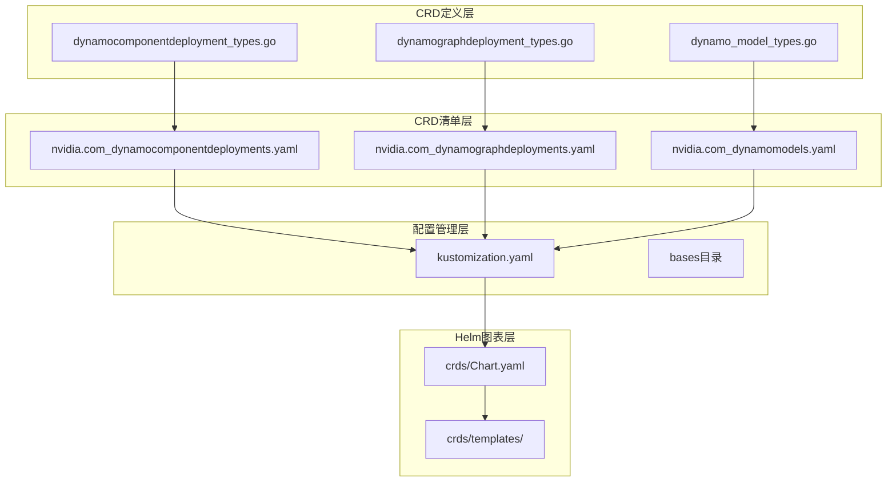
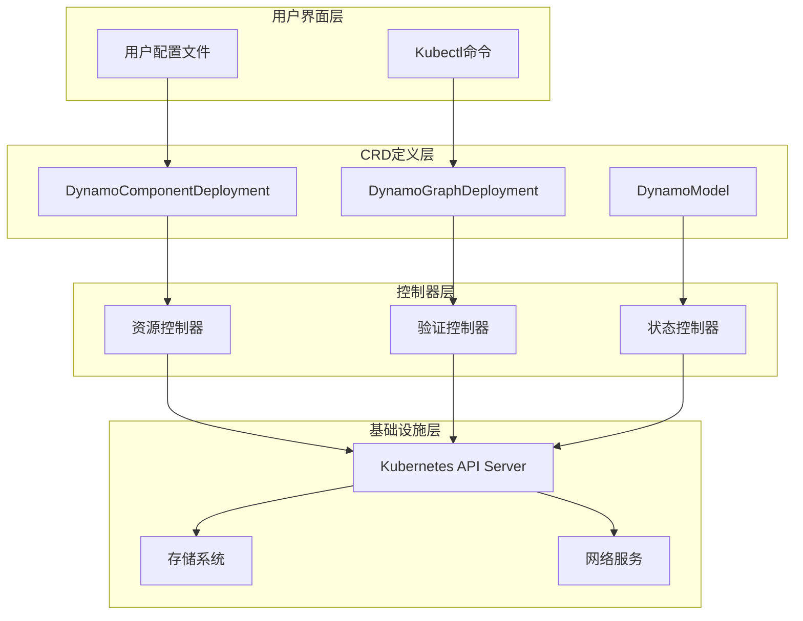
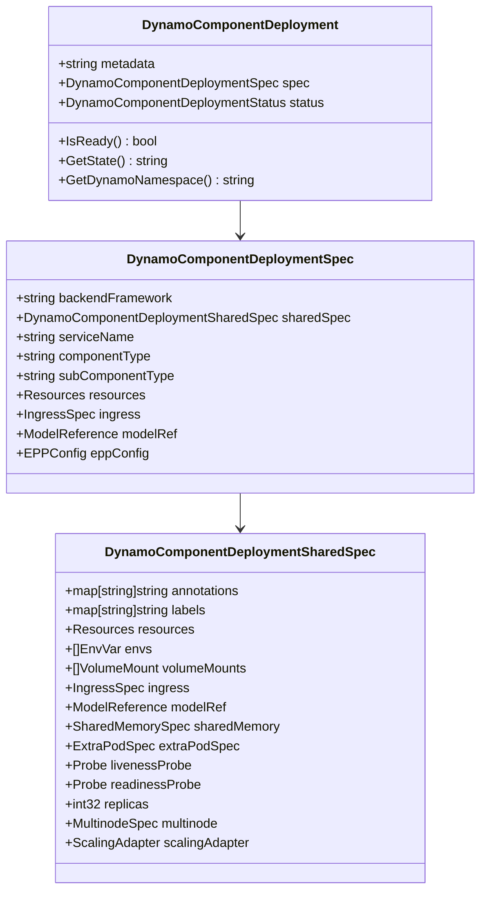
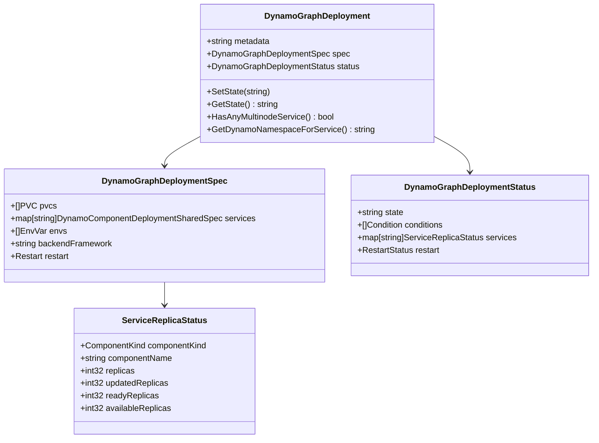
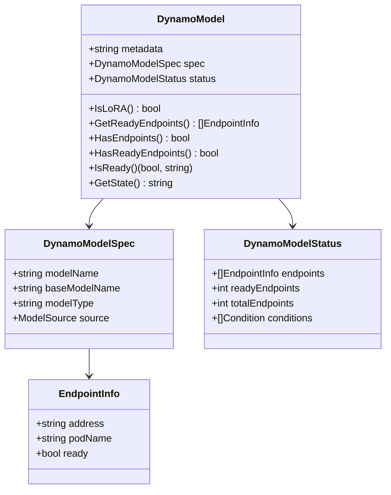
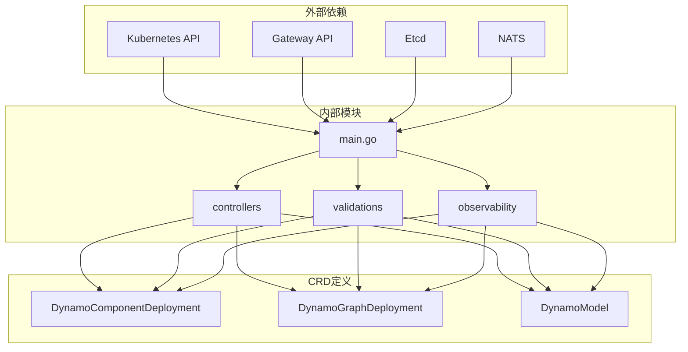

# CRD图表

<cite>
**本文档引用的文件**
- [dynamodb_component_deployment_types.go](file://deploy/operator/api/v1alpha1/dynamocomponentdeployment_types.go)
- [dynamodb_graph_deployment_types.go](file://deploy/operator/api/v1alpha1/dynamographdeployment_types.go)
- [dynamodb_model_types.go](file://deploy/operator/api/v1alpha1/dynamo_model_types.go)
- [kustomization.yaml](file://deploy/operator/config/crd/kustomization.yaml)
- [bases目录结构](file://deploy/operator/config/crd/bases)
- [dynamodb_component_deployments_yaml](file://deploy/operator/config/crd/bases/nvidia.com_dynamocomponentdeployments.yaml)
- [dynamodb_graph_deployments_yaml](file://deploy/operator/config/crd/bases/nvidia.com_dynamographdeployments.yaml)
- [dynamodb_models_yaml](file://deploy/operator/config/crd/bases/nvidia.com_dynamomodels.yaml)
- [helm_chart_readme.md](file://deploy/helm/charts/crds/README.md)
- [helm_chart_chart_yaml](file://deploy/helm/charts/crds/Chart.yaml)
- [helm_readme.md](file://deploy/helm/README.md)
- [operator_main.go](file://deploy/operator/cmd/main.go)
</cite>

## 目录
1. [简介](#简介)
2. [项目结构](#项目结构)
3. [核心组件](#核心组件)
4. [架构概览](#架构概览)
5. [详细组件分析](#详细组件分析)
6. [依赖关系分析](#依赖关系分析)
7. [性能考虑](#性能考虑)
8. [故障排除指南](#故障排除指南)
9. [结论](#结论)
10. [附录](#附录)

## 简介

Dynamo CRD图表是NVIDIA Dynamo Kubernetes平台的核心基础设施，它通过自定义资源定义(CRD)提供了声明式的模型推理服务编排能力。该图表包含了三个主要的CRD资源：DynamoComponentDeployment、DynamoGraphDeployment和DynamoModel，它们共同构成了Dynamo平台的资源编排基础。

这些CRD资源允许用户以声明式的方式定义和管理复杂的AI推理服务部署，包括多后端支持(SGLang、VLLM、TRT-LLM)、自动扩缩容、负载均衡、以及高级的模型管理功能。通过这些CRD，Dynamo平台实现了对分布式推理服务的统一管理和自动化运维。

## 项目结构

Dynamo CRD图表的项目结构遵循标准的Kubernetes控制器模式，主要分为以下几个关键部分：



**图表来源**
- [dynamodb_component_deployment_types.go](file://deploy/operator/api/v1alpha1/dynamocomponentdeployment_types.go#L1-L375)
- [dynamodb_graph_deployment_types.go](file://deploy/operator/api/v1alpha1/dynamographdeployment_types.go#L1-L274)
- [dynamodb_model_types.go](file://deploy/operator/api/v1alpha1/dynamo_model_types.go#L1-L173)
- [kustomization.yaml](file://deploy/operator/config/crd/kustomization.yaml#L1-L40)

**章节来源**
- [dynamodb_component_deployment_types.go](file://deploy/operator/api/v1alpha1/dynamocomponentdeployment_types.go#L1-L375)
- [dynamodb_graph_deployment_types.go](file://deploy/operator/api/v1alpha1/dynamographdeployment_types.go#L1-L274)
- [dynamodb_model_types.go](file://deploy/operator/api/v1alpha1/dynamo_model_types.go#L1-L173)
- [kustomization.yaml](file://deploy/operator/config/crd/kustomization.yaml#L1-L40)

## 核心组件

Dynamo CRD图表包含三个核心的自定义资源定义，每个都针对特定的编排场景：

### DynamoComponentDeployment
DynamoComponentDeployment是单个推理组件的声明式定义，用于描述如何部署和管理特定的推理服务组件。它支持多种后端框架，并提供了丰富的配置选项来满足不同的部署需求。

### DynamoGraphDeployment
DynamoGraphDeployment代表一个完整的推理服务图，可以包含多个相互关联的组件。它提供了服务间的协调、依赖管理和生命周期管理功能。

### DynamoModel
DynamoModel专门用于管理模型资源，包括模型的元数据、端点状态和可用性监控。它支持不同类型的模型(基础模型、LoRA适配器等)和多种存储源。

**章节来源**
- [dynamodb_component_deployment_types.go](file://deploy/operator/api/v1alpha1/dynamocomponentdeployment_types.go#L39-L229)
- [dynamodb_graph_deployment_types.go](file://deploy/operator/api/v1alpha1/dynamographdeployment_types.go#L47-L189)
- [dynamodb_model_types.go](file://deploy/operator/api/v1alpha1/dynamo_model_types.go#L29-L110)

## 架构概览

Dynamo CRD图表采用分层架构设计，从底层的CRD定义到上层的应用编排，形成了完整的推理服务管理生态系统：



**图表来源**
- [operator_main.go](file://deploy/operator/cmd/main.go#L560-L621)

该架构确保了系统的可扩展性和可靠性，同时提供了灵活的配置选项来适应不同的部署场景。

## 详细组件分析

### DynamoComponentDeployment 详细分析

DynamoComponentDeployment是Dynamo平台中最基础的资源类型，它定义了单个推理组件的完整配置：



**图表来源**
- [dynamodb_component_deployment_types.go](file://deploy/operator/api/v1alpha1/dynamocomponentdeployment_types.go#L40-L133)

#### 关键特性
- **多后端支持**: 支持SGLang、VLLM、TRT-LLM三种推理后端
- **灵活的资源配置**: 可配置CPU、内存、GPU等计算资源
- **网络暴露**: 支持标准Ingress和Istio VirtualService
- **模型集成**: 可直接引用DynamoModel资源
- **EPP支持**: 内置Endpoint Picker Plugin配置

**章节来源**
- [dynamodb_component_deployment_types.go](file://deploy/operator/api/v1alpha1/dynamocomponentdeployment_types.go#L40-L343)

### DynamoGraphDeployment 详细分析

DynamoGraphDeployment提供了更高层次的服务编排能力，用于管理复杂的推理服务图：



**图表来源**
- [dynamodb_graph_deployment_types.go](file://deploy/operator/api/v1alpha1/dynamographdeployment_types.go#L47-L172)

#### 核心功能
- **多服务编排**: 支持在一个资源中定义多个相关服务
- **重启策略**: 提供顺序和并行两种重启策略
- **状态监控**: 实时跟踪各服务的副本状态
- **命名空间管理**: 自动计算和管理Dynamo命名空间

**章节来源**
- [dynamodb_graph_deployment_types.go](file://deploy/operator/api/v1alpha1/dynamographdeployment_types.go#L47-L274)

### DynamoModel 详细分析

DynamoModel专注于模型资源的生命周期管理：



**图表来源**
- [dynamodb_model_types.go](file://deploy/operator/api/v1alpha1/dynamo_model_types.go#L29-L91)

#### 模型管理特性
- **多类型支持**: 支持基础模型、LoRA适配器、适配器等多种模型类型
- **端点监控**: 实时跟踪模型服务端点的健康状态
- **源位置管理**: 支持S3和HuggingFace等多种模型源
- **就绪状态检查**: 自动检测模型服务的可用性

**章节来源**
- [dynamodb_model_types.go](file://deploy/operator/api/v1alpha1/dynamo_model_types.go#L29-L173)

## 依赖关系分析

Dynamo CRD图表的依赖关系体现了清晰的分层架构：



**图表来源**
- [operator_main.go](file://deploy/operator/cmd/main.go#L22-L125)

**章节来源**
- [operator_main.go](file://deploy/operator/cmd/main.go#L22-L125)

## 性能考虑

在部署和使用Dynamo CRD图表时，需要考虑以下性能因素：

### 资源优化
- **内存管理**: 合理配置共享内存设置，避免过度分配
- **GPU利用率**: 通过多节点配置提高GPU资源利用率
- **网络带宽**: 优化Ingress配置，减少网络延迟

### 扩展策略
- **水平扩展**: 利用多节点配置实现水平扩展
- **垂直扩展**: 通过资源限制和请求进行垂直扩展
- **智能调度**: 结合KEDA等自动扩缩容工具

### 监控指标
- **端点健康**: 定期检查模型端点的就绪状态
- **资源使用**: 监控CPU、内存、GPU的使用情况
- **响应时间**: 跟踪推理服务的响应性能

## 故障排除指南

### 常见问题诊断

#### CRD安装问题
1. **验证CRD状态**
   ```bash
   kubectl get crd | grep dynamo
   ```

2. **检查CRD定义**
   ```bash
   kubectl get crd dynamocomponentdeployments.nvidia.com -o yaml
   ```

#### 资源创建失败
1. **查看资源事件**
   ```bash
   kubectl describe dynamocomponentdeployment <name> -n <namespace>
   ```

2. **检查控制器日志**
   ```bash
   kubectl logs -n dynamo-system -l app.kubernetes.io/name=dynamo-operator
   ```

#### 配置验证
1. **使用kubectl验证**
   ```bash
   kubectl apply --dry-run=client -f <your-resource-file.yaml>
   ```

2. **检查资源状态**
   ```bash
   kubectl get dynamocomponentdeployment -o wide
   ```

### 验证方法

#### 基础验证
1. **CRD完整性检查**
   - 确认所有三个CRD都已正确安装
   - 验证CRD的版本和存储状态

2. **资源可用性测试**
   - 创建最小化的DynamoComponentDeployment
   - 验证资源被正确创建和管理

3. **功能验证**
   - 测试不同后端框架的支持
   - 验证模型集成功能
   - 检查网络暴露配置

**章节来源**
- [operator_main.go](file://deploy/operator/cmd/main.go#L680-L694)

## 结论

Dynamo CRD图表为Kubernetes环境下的AI推理服务提供了强大而灵活的编排能力。通过三个核心CRD资源的协同工作，它实现了从单个组件到复杂服务图的全栈管理。

该图表的主要优势包括：
- **声明式配置**: 通过YAML文件实现基础设施即代码
- **多后端支持**: 统一管理不同的推理后端
- **自动化运维**: 减少手动操作，提高运维效率
- **可观测性**: 内置的监控和告警机制

随着AI推理需求的增长，Dynamo CRD图表将继续演进，为用户提供更强大的功能和更好的性能体验。

## 附录

### 安装命令参考

#### 使用Helm安装CRD
```bash
# 添加Helm仓库
helm repo add dynamo https://nvidia.github.io/dynamo

# 更新仓库
helm repo update

# 安装CRD图表
helm install dynamo-crds dynamo/dynamo-crds
```

#### 手动安装CRD
```bash
# 应用CRD定义
kubectl apply -f https://raw.githubusercontent.com/NVIDIA/dynamo/main/deploy/operator/config/crd/bases/

# 或者使用本地文件
kubectl apply -f deploy/operator/config/crd/bases/
```

### 升级策略

#### 版本兼容性
- **向后兼容**: 新版本通常保持与旧版本的兼容性
- **迁移路径**: 提供明确的升级指导和迁移脚本
- **回滚机制**: 支持快速回滚到稳定版本

#### 最佳实践
- **测试环境先行**: 在生产环境之前先在测试环境验证
- **分阶段升级**: 采用渐进式升级策略，逐步替换资源
- **备份策略**: 升级前备份重要的配置和数据

### 配置示例

#### 基础组件部署
```yaml
apiVersion: nvidia.com/v1alpha1
kind: DynamoComponentDeployment
metadata:
  name: example-component
spec:
  backendFramework: vllm
  serviceName: example-service
  componentType: worker
  replicas: 2
  resources:
    requests:
      cpu: "1"
      memory: 2Gi
    limits:
      cpu: "2"
      memory: 4Gi
```

#### 复杂服务图
```yaml
apiVersion: nvidia.com/v1alpha1
kind: DynamoGraphDeployment
metadata:
  name: example-graph
spec:
  backendFramework: vllm
  services:
    frontend:
      componentType: frontend
      replicas: 1
    prefill:
      componentType: prefill
      replicas: 2
    decode:
      componentType: decode
      replicas: 4
  restart:
    id: "1"
    strategy:
      type: Sequential
```