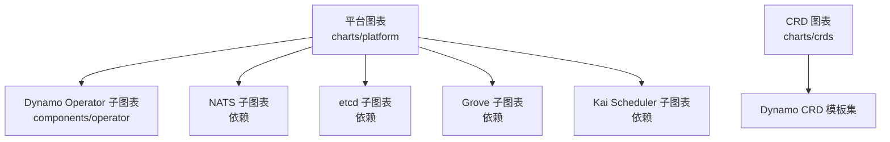
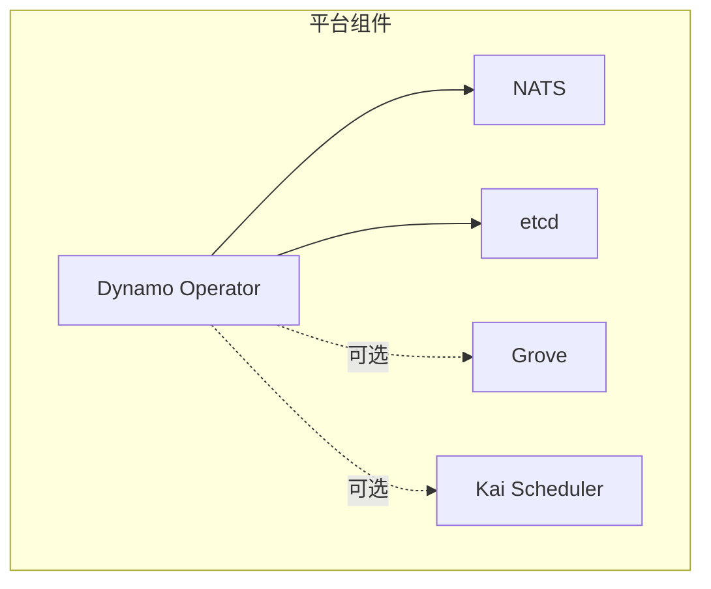
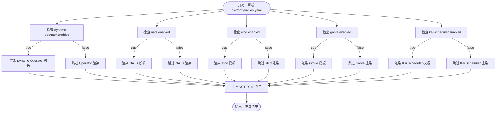
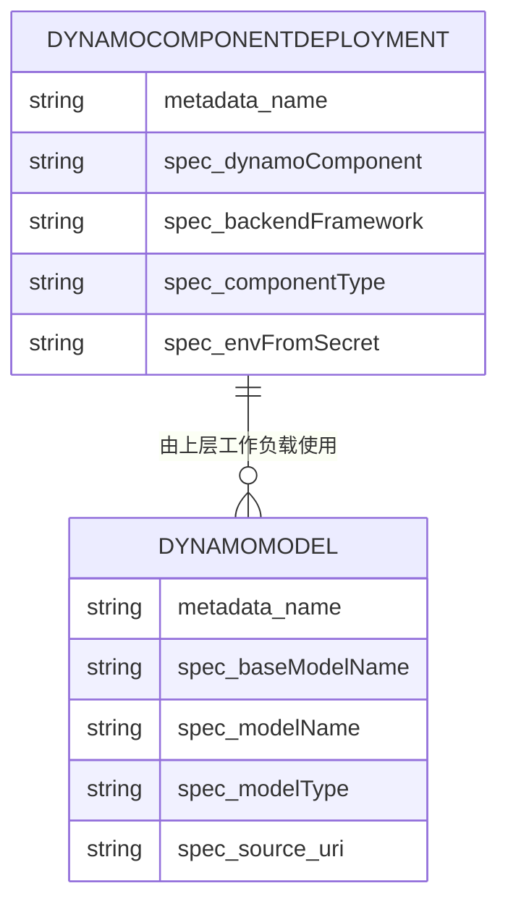
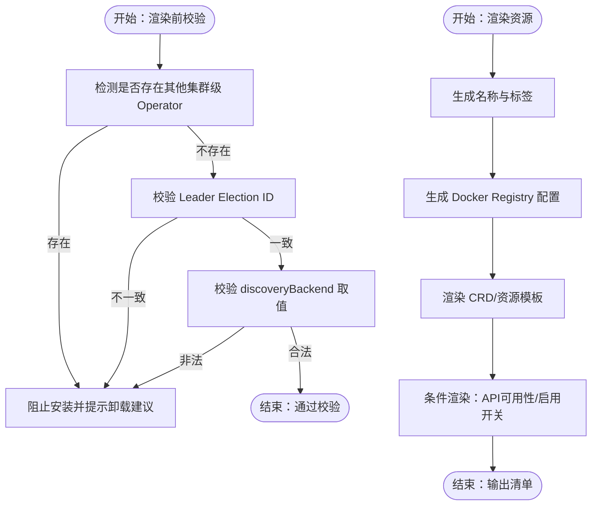
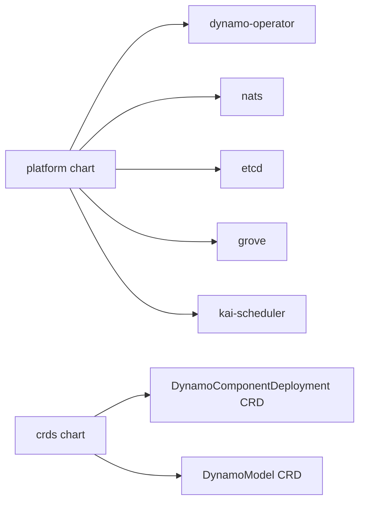

# Helm图表

<cite>
**本文引用的文件**
- [deploy\helm\README.md](file://deploy\helm\README.md)
- [deploy\helm\charts\platform\Chart.yaml](file://deploy\helm\charts\platform\Chart.yaml)
- [deploy\helm\charts\platform\values.yaml](file://deploy\helm\charts\platform\values.yaml)
- [deploy\helm\charts\platform\README.md](file://deploy\helm\charts\platform\README.md)
- [deploy\helm\charts\platform\README.md.gotmpl](file://deploy\helm\charts\platform\README.md.gotmpl)
- [deploy\helm\charts\platform\templates\NOTES.txt](file://deploy\helm\charts\platform\templates\NOTES.txt)
- [deploy\helm\charts\platform\templates\kai.yaml](file://deploy\helm\charts\platform\templates\kai.yaml)
- [deploy\helm\charts\platform\components\operator\Chart.yaml](file://deploy\helm\charts\platform\components\operator\Chart.yaml)
- [deploy\helm\charts\platform\components\operator\values.yaml](file://deploy\helm\charts\platform\components\operator\values.yaml)
- [deploy\helm\charts\platform\components\operator\templates\_helpers.tpl](file://deploy\helm\charts\platform\components\operator\templates\_helpers.tpl)
- [deploy\helm\charts\platform\components\operator\templates\_validation.tpl](file://deploy\helm\charts\platform\components\operator\templates\_validation.tpl)
- [deploy\helm\charts\crds\Chart.yaml](file://deploy\helm\charts\crds\Chart.yaml)
- [deploy\helm\charts\crds\README.md](file://deploy\helm\charts\crds\README.md)
- [deploy\helm\charts\crds\templates\nvidia.com_dynamocomponentdeployments.yaml](file://deploy\helm\charts\crds\templates\nvidia.com_dynamocomponentdeployments.yaml)
- [deploy\helm\charts\crds\templates\nvidia.com_dynamomodels.yaml](file://deploy\helm\charts\crds\templates\nvidia.com_dynamomodels.yaml)
</cite>

## 目录
1. [简介](#简介)
2. [项目结构](#项目结构)
3. [核心组件](#核心组件)
4. [架构总览](#架构总览)
5. [详细组件分析](#详细组件分析)
6. [依赖关系分析](#依赖关系分析)
7. [性能考虑](#性能考虑)
8. [故障排查指南](#故障排查指南)
9. [结论](#结论)
10. [附录](#附录)

## 简介
本文件为Dynamo的Helm图表部署文档，聚焦于平台图表（platform chart）与CRD图表（crds chart）的结构、配置项、模板渲染机制与条件部署逻辑，并提供不同部署场景（开发、测试、生产）的配置建议、部署命令与验证步骤。平台图表负责部署Dynamo Operator、NATS、etcd、可选的Grove与Kai Scheduler等基础设施；CRD图表负责安装Dynamo平台所需的自定义资源定义（CRD），供上层工作负载使用。

## 项目结构
Helm图表位于deploy/helm目录下，包含两个子图表：
- platform：平台图表，包含Dynamo Operator子图表以及若干依赖（NATS、etcd、Grove、Kai Scheduler）。
- crds：CRD图表，安装Dynamo平台所需CRD。

**图示来源**
- [deploy\helm\README.md](file://deploy\helm\README.md#L20-L23)
- [deploy\helm\charts\platform\Chart.yaml](file://deploy\helm\charts\platform\Chart.yaml#L24-L46)

**章节来源**
- [deploy\helm\README.md](file://deploy\helm\README.md#L18-L23)
- [deploy\helm\charts\platform\Chart.yaml](file://deploy\helm\charts\platform\Chart.yaml#L15-L46)

## 核心组件
- 平台图表（platform chart）
  - 依赖管理：通过dependencies声明Dynamo Operator、NATS、etcd、Grove、Kai Scheduler等子图表及其版本与仓库来源。
  - 配置入口：values.yaml集中定义各子图表的启用开关、镜像、资源、网络、Webhook、证书等参数。
  - 模板与钩子：NOTES.txt用于安装后提示信息；kai.yaml在满足条件时创建调度队列资源。
- CRD图表（crds chart）
  - 作用：安装Dynamo平台的CRD，如DynamoComponentDeployment、DynamoModel等，供Operator与上层工作负载使用。
  - 结构：每个CRD以独立模板文件呈现，采用apiextensions.k8s.io/v1格式。

**章节来源**
- [deploy\helm\charts\platform\Chart.yaml](file://deploy\helm\charts\platform\Chart.yaml#L24-L46)
- [deploy\helm\charts\platform\values.yaml](file://deploy\helm\charts\platform\values.yaml#L1-L732)
- [deploy\helm\charts\platform\templates\NOTES.txt](file://deploy\helm\charts\platform\templates\NOTES.txt#L1-L39)
- [deploy\helm\charts\platform\templates\kai.yaml](file://deploy\helm\charts\platform\templates\kai.yaml#L16-L75)
- [deploy\helm\charts\crds\Chart.yaml](file://deploy\helm\charts\crds\Chart.yaml#L15-L20)

## 架构总览
平台图表在Kubernetes集群中部署以下基础设施：
- Dynamo Operator：管理Dynamo相关资源的控制器，支持Webhook校验、证书管理、Leader Election等。
- NATS：高吞吐消息系统，支持JetStream持久化、TLS、监控端口等。
- etcd：分布式键值存储，用于Operator状态管理，支持持久卷、探针与PDB。
- Grove：多节点推理编排（可选）。
- Kai Scheduler：智能资源调度（可选）。

**图示来源**
- [deploy\helm\charts\platform\Chart.yaml](file://deploy\helm\charts\platform\Chart.yaml#L24-L46)
- [deploy\helm\charts\platform\values.yaml](file://deploy\helm\charts\platform\values.yaml#L20-L28)

**章节来源**
- [deploy\helm\charts\platform\README.md](file://deploy\helm\charts\platform\README.md#L24-L33)

## 详细组件分析

### 平台图表（platform chart）
- 依赖关系
  - dynamo-operator：集群级或命名空间级Operator，支持Webhook、证书、Leader Election等。
  - nats：NATS Helm子图表，支持JetStream、TLS、监控、PVC等。
  - etcd：Bitnami etcd Helm子图表，支持持久化、探针、PDB、副本数等。
  - grove：Grove子图表（OCI仓库），用于多节点推理编排。
  - kai-scheduler：Kai Scheduler子图表（OCI仓库），用于智能调度。
- 关键配置要点
  - 启用开关：dynamo-operator.enabled、nats.enabled、etcd.enabled、grove.enabled、kai-scheduler.enabled。
  - Operator镜像与资源：controllerManager.manager.image.*、resources、replicas。
  - Operator安全与证书：webhook.*、certManager.*、leaderElection.*。
  - NATS配置：JetStream启用、PVC大小、TLS、监控端口等。
  - etcd配置：持久化、副本数、探针、PDB、认证关闭（内部通信）。
  - 入口与路由：ingress.*、istio.*、ingressHostSuffix、virtualServiceSupportsHTTPS。
  - MPI Run与调试：mpiRun.*、internalImages.debugger。
  - Docker Registry：dockerRegistry.*，支持现有Secret或直接凭据。
- 条件部署逻辑
  - 通过condition字段控制子图表启用（如dynamo-operator.enabled）。
  - kai.yaml仅在集群具备scheduling.run.ai/v2 API时创建队列资源。
- 模板渲染与钩子
  - NOTES.txt根据子图表状态输出访问提示。
  - _helpers.tpl提供名称、标签、dockerconfig生成等通用模板。
  - _validation.tpl执行安装前冲突检测与配置一致性校验。

**图示来源**
- [deploy\helm\charts\platform\Chart.yaml](file://deploy\helm\charts\platform\Chart.yaml#L24-L46)
- [deploy\helm\charts\platform\templates\kai.yaml](file://deploy\helm\charts\platform\templates\kai.yaml#L16-L75)
- [deploy\helm\charts\platform\templates\NOTES.txt](file://deploy\helm\charts\platform\templates\NOTES.txt#L16-L39)

**章节来源**
- [deploy\helm\charts\platform\Chart.yaml](file://deploy\helm\charts\platform\Chart.yaml#L24-L46)
- [deploy\helm\charts\platform\values.yaml](file://deploy\helm\charts\platform\values.yaml#L19-L28)
- [deploy\helm\charts\platform\values.yaml](file://deploy\helm\charts\platform\values.yaml#L234-L288)
- [deploy\helm\charts\platform\values.yaml](file://deploy\helm\charts\platform\values.yaml#L289-L490)
- [deploy\helm\charts\platform\values.yaml](file://deploy\helm\charts\platform\values.yaml#L87-L114)
- [deploy\helm\charts\platform\templates\kai.yaml](file://deploy\helm\charts\platform\templates\kai.yaml#L16-L75)
- [deploy\helm\charts\platform\templates\NOTES.txt](file://deploy\helm\charts\platform\templates\NOTES.txt#L16-L39)
- [deploy\helm\charts\platform\components\operator\templates\_helpers.tpl](file://deploy\helm\charts\platform\components\operator\templates\_helpers.tpl#L87-L118)
- [deploy\helm\charts\platform\components\operator\templates\_validation.tpl](file://deploy\helm\charts\platform\components\operator\templates\_validation.tpl#L25-L92)

### CRD图表（crds chart）
- 安装流程
  - 单独安装crds图表，确保CRD先于上层资源创建。
  - CRD模板文件以nvidia.com域名为组，包含DynamoComponentDeployment、DynamoModel等。
- 依赖关系
  - 无子图表依赖，直接安装CRD资源。
- 关键CRD说明
  - DynamoComponentDeployment：描述Dynamo组件部署规范，含后端框架、环境变量注入、注解等。
  - DynamoModel：描述模型资源，含基础模型名、模型类型、源URI、端点状态等。

**图示来源**
- [deploy\helm\charts\crds\templates\nvidia.com_dynamocomponentdeployments.yaml](file://deploy\helm\charts\crds\templates\nvidia.com_dynamocomponentdeployments.yaml#L74-L83)
- [deploy\helm\charts\crds\templates\nvidia.com_dynamocomponentdeployments.yaml](file://deploy\helm\charts\crds\templates\nvidia.com_dynamocomponentdeployments.yaml#L686-L688)
- [deploy\helm\charts\crds\templates\nvidia.com_dynamomodels.yaml](file://deploy\helm\charts\crds\templates\nvidia.com_dynamomodels.yaml#L78-L112)

**章节来源**
- [deploy\helm\charts\crds\Chart.yaml](file://deploy\helm\charts\crds\Chart.yaml#L15-L20)
- [deploy\helm\charts\crds\README.md](file://deploy\helm\charts\crds\README.md#L18-L20)
- [deploy\helm\charts\crds\templates\nvidia.com_dynamocomponentdeployments.yaml](file://deploy\helm\charts\crds\templates\nvidia.com_dynamocomponentdeployments.yaml#L1-L800)
- [deploy\helm\charts\crds\templates\nvidia.com_dynamomodels.yaml](file://deploy\helm\charts\crds\templates\nvidia.com_dynamomodels.yaml#L1-L209)

### 模板渲染机制与条件部署
- 命名与标签
  - _helpers.tpl提供name、fullname、labels、selectorLabels、serviceAccountName等模板，统一命名与标签策略。
- Docker Registry配置
  - _helpers.tpl生成.dockerconfigjson，支持现有Secret或直接凭据；并提供校验模板，确保Secret存在且包含目标服务器的认证。
- 安装前验证
  - _validation.tpl防止重复部署集群级Operator、检测Leader Election ID一致性、校验discoveryBackend取值。
- 条件渲染
  - Chart.yaml中通过condition字段控制子图表启用；kai.yaml中通过Capabilities.APIVersions.Has进行API可用性判断。

**图示来源**
- [deploy\helm\charts\platform\components\operator\templates\_validation.tpl](file://deploy\helm\charts\platform\components\operator\templates\_validation.tpl#L25-L114)
- [deploy\helm\charts\platform\components\operator\templates\_helpers.tpl](file://deploy\helm\charts\platform\components\operator\templates\_helpers.tpl#L87-L118)
- [deploy\helm\charts\platform\Chart.yaml](file://deploy\helm\charts\platform\Chart.yaml#L24-L46)
- [deploy\helm\charts\platform\templates\kai.yaml](file://deploy\helm\charts\platform\templates\kai.yaml#L16-L75)

**章节来源**
- [deploy\helm\charts\platform\components\operator\templates\_helpers.tpl](file://deploy\helm\charts\platform\components\operator\templates\_helpers.tpl#L15-L153)
- [deploy\helm\charts\platform\components\operator\templates\_validation.tpl](file://deploy\helm\charts\platform\components\operator\templates\_validation.tpl#L16-L115)
- [deploy\helm\charts\platform\Chart.yaml](file://deploy\helm\charts\platform\Chart.yaml#L24-L46)
- [deploy\helm\charts\platform\templates\kai.yaml](file://deploy\helm\charts\platform\templates\kai.yaml#L16-L75)

## 依赖关系分析
- 组件耦合
  - Dynamo Operator与NATS/etcd存在运行时依赖；Operator通过Webhook与证书管理保障资源合法性。
  - Grove/Kai Scheduler为可选组件，按需启用。
- 外部依赖
  - NATS Helm仓库、Bitnami etcd仓库、Grove与Kai Scheduler OCI仓库。
- 潜在循环依赖
  - CRD图表无子图表依赖，避免循环；平台图表通过condition控制渲染，降低循环风险。

**图示来源**
- [deploy\helm\charts\platform\Chart.yaml](file://deploy\helm\charts\platform\Chart.yaml#L24-L46)
- [deploy\helm\charts\crds\templates\nvidia.com_dynamocomponentdeployments.yaml](file://deploy\helm\charts\crds\templates\nvidia.com_dynamocomponentdeployments.yaml#L1-L800)
- [deploy\helm\charts\crds\templates\nvidia.com_dynamomodels.yaml](file://deploy\helm\charts\crds\templates\nvidia.com_dynamomodels.yaml#L1-L209)

**章节来源**
- [deploy\helm\charts\platform\Chart.yaml](file://deploy\helm\charts\platform\Chart.yaml#L24-L46)
- [deploy\helm\charts\crds\Chart.yaml](file://deploy\helm\charts\crds\Chart.yaml#L15-L20)

## 性能考虑
- 资源与副本
  - Operator资源请求/限制与副本数可通过values.yaml调整，建议在生产环境适当提高CPU/内存限制。
- 存储与持久化
  - etcd默认启用持久化与PVC，建议在生产环境配置合适的StorageClass与容量。
  - NATS JetStream默认启用文件存储与PVC，建议根据流量与数据量评估PVC大小。
- 网络与入口
  - ingress与istio集成可按需开启，生产环境建议配置TLS与合适的超时时间。
- 探针与PDB
  - etcd与NATS的探针与PDB可根据部署规模选择性启用，HA场景建议开启PDB。

[本节为通用指导，无需“章节来源”]

## 故障排查指南
- Operator冲突
  - 若安装失败提示存在集群级Operator，请卸载旧实例或改为命名空间级部署。
- Leader Election问题
  - 集群级模式下所有Operator应使用相同Leader Election ID，否则可能导致脑裂。
- Webhook与证书
  - Webhook失败策略可设为Fail以保证严格校验；证书可通过Helm自动注入或cert-manager管理。
- NATS/JetStream
  - 如出现JetStream存储不足，检查PVC大小与StorageClass；确认TLS与监控端口配置正确。
- etcd
  - 单节点部署默认关闭探针与PDB，生产建议启用持久化与PDB并增加副本数。

**章节来源**
- [deploy\helm\charts\platform\components\operator\templates\_validation.tpl](file://deploy\helm\charts\platform\components\operator\templates\_validation.tpl#L68-L91)
- [deploy\helm\charts\platform\values.yaml](file://deploy\helm\charts\platform\values.yaml#L152-L211)
- [deploy\helm\charts\platform\values.yaml](file://deploy\helm\charts\platform\values.yaml#L289-L490)
- [deploy\helm\charts\platform\values.yaml](file://deploy\helm\charts\platform\values.yaml#L234-L288)

## 结论
平台图表提供了Dynamo在Kubernetes上的完整基础设施部署方案，结合CRD图表可实现从Operator到工作负载的全链路管理。通过values.yaml集中配置、模板渲染与安装前验证，能够有效降低部署复杂度并提升安全性与稳定性。建议在生产环境启用持久化、PDB、严格的Leader Election与Webhook校验，并根据实际规模调整资源与网络策略。

[本节为总结，无需“章节来源”]

## 附录

### 不同部署场景的配置示例与最佳实践
- 开发环境
  - 关闭不必要的可选组件（grove.enabled=false、kai-scheduler.enabled=false）。
  - NATS与etcd使用默认配置，禁用探针与PDB以简化启动。
  - Operator镜像tag留空以使用Chart默认版本。
- 测试环境
  - 启用etcd持久化与PDB，副本数≥1；NATS JetStream启用PVC并合理设置大小。
  - 开启Webhook与证书管理（cert-manager或Helm自动注入）。
- 生产环境
  - etcd副本数≥3，启用持久化、PDB与探针；Operator使用集群级部署并统一Leader Election ID。
  - NATS启用TLS与监控端口，JetStream文件存储PVC容量充足。
  - 启用Ingress/Istio路由，配置TLS与超时；Docker Registry使用现有Secret。

**章节来源**
- [deploy\helm\charts\platform\values.yaml](file://deploy\helm\charts\platform\values.yaml#L234-L288)
- [deploy\helm\charts\platform\values.yaml](file://deploy\helm\charts\platform\values.yaml#L289-L490)
- [deploy\helm\charts\platform\values.yaml](file://deploy\helm\charts\platform\values.yaml#L87-L114)
- [deploy\helm\charts\platform\values.yaml](file://deploy\helm\charts\platform\values.yaml#L152-L211)

### 关键values.yaml参数说明（摘要）
- Dynamo Operator
  - enabled、natsAddr、etcdAddr、namespaceRestriction、controllerManager.*、webhook.*、imagePullSecrets、dynamo.*、metrics.prometheusEndpoint、mpiRun.*。
- NATS
  - enabled、tlsCA、config.jetstream.*、config.nats.*、container.image.*、service.ports.*、podDisruptionBudget.enabled、natsBox.*。
- etcd
  - enabled、image.repository/tag、persistence.enabled/size/storageClass、replicaCount、auth.rbac.create、pdb.create、tolerations/affinity。
- Grove/Kai Scheduler
  - enabled、global.tolerations/affinity。
- 入口与路由
  - dynamo.ingress.*、dynamo.istio.*、ingressHostSuffix、virtualServiceSupportsHTTPS。
- Docker Registry
  - dynamo.dockerRegistry.*，支持existingSecretName与直接凭据。

**章节来源**
- [deploy\helm\charts\platform\values.yaml](file://deploy\helm\charts\platform\values.yaml#L19-L28)
- [deploy\helm\charts\platform\values.yaml](file://deploy\helm\charts\platform\values.yaml#L234-L288)
- [deploy\helm\charts\platform\values.yaml](file://deploy\helm\charts\platform\values.yaml#L289-L490)
- [deploy\helm\charts\platform\values.yaml](file://deploy\helm\charts\platform\values.yaml#L87-L114)
- [deploy\helm\charts\platform\values.yaml](file://deploy\helm\charts\platform\values.yaml#L152-L211)

### 部署命令与验证步骤
- 部署顺序
  1) 安装CRD图表：helm install dynamo-crds ./deploy/helm/charts/crds
  2) 安装平台图表：helm install dynamo-platform ./deploy/helm/charts/platform -f custom-values.yaml
- 验证步骤
  - 检查CRD是否就绪：kubectl get crd | grep dynamo
  - 检查Operator Pod状态：kubectl get pods -l app.kubernetes.io/name=dynamo-operator
  - 检查NATS/etcd状态：kubectl get pods -l app.kubernetes.io/name=nats 或 etcd
  - 查看安装提示：helm get notes dynamo-platform
  - 如启用Ingress/Istio，检查Service与Ingress/Route资源状态

**章节来源**
- [deploy\helm\charts\crds\README.md](file://deploy\helm\charts\crds\README.md#L18-L20)
- [deploy\helm\charts\platform\templates\NOTES.txt](file://deploy\helm\charts\platform\templates\NOTES.txt#L16-L39)