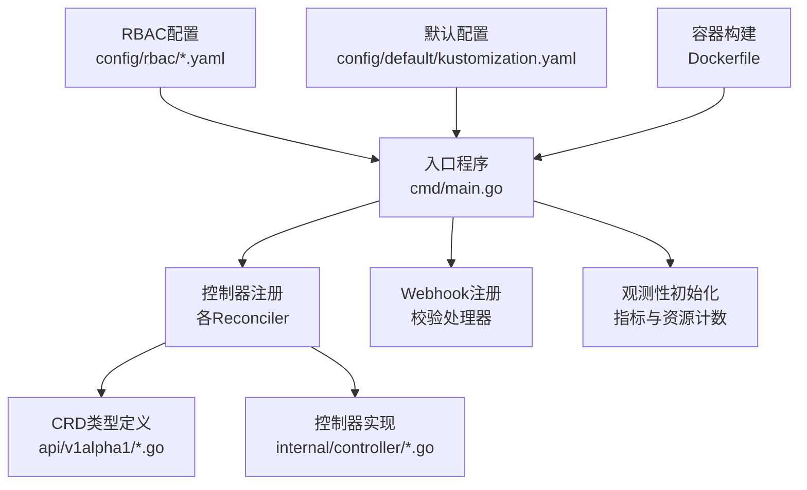
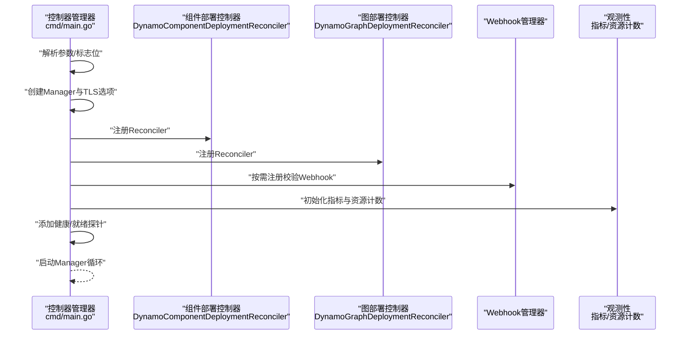
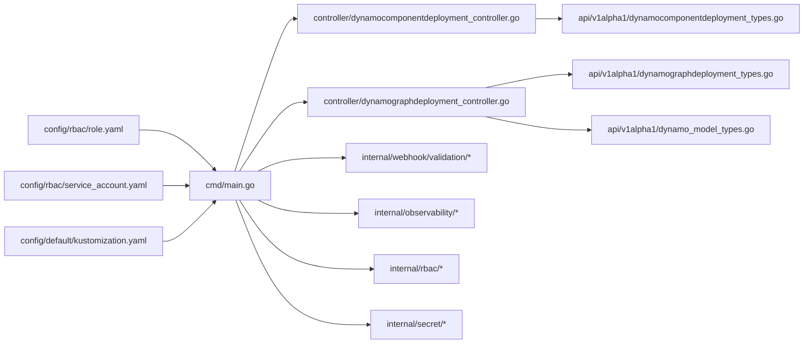

# Operator组件

<cite>
**本文引用的文件**
- [main.go](file://deploy/operator/cmd/main.go)
- [README.md](file://deploy/operator/README.md)
- [dynamocomponentdeployment_types.go](file://deploy/operator/api/v1alpha1/dynamocomponentdeployment_types.go)
- [dynamographdeployment_types.go](file://deploy/operator/api/v1alpha1/dynamographdeployment_types.go)
- [dynamo_model_types.go](file://deploy/operator/api/v1alpha1/dynamo_model_types.go)
- [dynamocomponentdeployment_controller.go](file://deploy/operator/internal/controller/dynamocomponentdeployment_controller.go)
- [dynamographdeployment_controller.go](file://deploy/operator/internal/controller/dynamographdeployment_controller.go)
- [role.yaml](file://deploy/operator/config/rbac/role.yaml)
- [service_account.yaml](file://deploy/operator/config/rbac/service_account.yaml)
- [kustomization.yaml](file://deploy/operator/config/default/kustomization.yaml)
- [Dockerfile](file://deploy/operator/Dockerfile)
</cite>

## 目录
1. [简介](#简介)
2. [项目结构](#项目结构)
3. [核心组件](#核心组件)
4. [架构总览](#架构总览)
5. [详细组件分析](#详细组件分析)
6. [依赖关系分析](#依赖关系分析)
7. [性能考虑](#性能考虑)
8. [故障排查指南](#故障排查指南)
9. [结论](#结论)
10. [附录](#附录)

## 简介
本文件面向Dynamo Kubernetes Operator组件，提供从架构到部署的完整说明。该Operator基于Kubebuilder构建，通过自定义资源定义（CRD）管理Dynamo在Kubernetes中的端到端推理流水线，包括组件级部署、图级编排、模型注册与发现等能力。本文重点覆盖以下方面：
- 控制器管理器与启动流程
- Webhook配置与校验策略
- RBAC权限与服务账号
- 监控指标与健康检查
- 各子控制器职责与配置要点
- CRD与资源管理策略
- 部署配置示例与最佳实践
- 健康检查与故障恢复策略

## 项目结构
Operator相关代码主要位于deploy/operator目录，包含入口程序、API类型定义、控制器实现、RBAC与默认配置、以及容器化构建脚本。

图表来源
- [main.go](file://deploy/operator/cmd/main.go#L128-L694)
- [dynamocomponentdeployment_types.go](file://deploy/operator/api/v1alpha1/dynamocomponentdeployment_types.go#L39-L229)
- [dynamographdeployment_types.go](file://deploy/operator/api/v1alpha1/dynamographdeployment_types.go#L47-L214)
- [dynamo_model_types.go](file://deploy/operator/api/v1alpha1/dynamo_model_types.go#L29-L123)
- [role.yaml](file://deploy/operator/config/rbac/role.yaml#L17-L247)
- [kustomization.yaml](file://deploy/operator/config/default/kustomization.yaml#L16-L58)

章节来源
- [README.md](file://deploy/operator/README.md#L1-L37)
- [main.go](file://deploy/operator/cmd/main.go#L128-L694)

## 核心组件
- 控制器管理器（Manager）
  - 负责创建并运行多个Reconciler，注册健康检查与ready检查端点，配置指标服务器与Webhook服务器。
  - 支持命名空间受限模式与集群范围模式，并通过Lease机制协调多实例。
- 子控制器
  - 组件部署控制器：管理单个组件（如prefill、decode等）的生命周期与状态。
  - 图部署控制器：管理DGD图内多个服务的编排、重启策略与状态聚合。
  - 模型控制器：管理模型注册、端点发现与就绪状态。
  - 图部署请求控制器：处理DGDR，生成优化后的DGD配置。
  - 缩放适配器控制器：对接HPA/KEDA或Planner，统一缩放接口。
- Webhook
  - 提供校验逻辑，支持“启用/禁用”两种模式；在启用时由Webhook负责校验，控制器作为防御性校验。
- 观测性
  - 初始化指标、资源计数器与健康/就绪探针。
- RBAC与服务账号
  - 提供最小权限集的ClusterRole与ServiceAccount，确保跨命名空间与第三方组件（Istio、Grove、Volcano等）的访问。

章节来源
- [main.go](file://deploy/operator/cmd/main.go#L128-L694)
- [dynamocomponentdeployment_controller.go](file://deploy/operator/internal/controller/dynamocomponentdeployment_controller.go#L73-L101)
- [dynamographdeployment_controller.go](file://deploy/operator/internal/controller/dynamographdeployment_controller.go#L80-L100)
- [role.yaml](file://deploy/operator/config/rbac/role.yaml#L17-L247)
- [service_account.yaml](file://deploy/operator/config/rbac/service_account.yaml#L16-L28)

## 架构总览
下图展示Operator启动、控制器注册、Webhook与观测性的整体交互：

图表来源
- [main.go](file://deploy/operator/cmd/main.go#L128-L694)

## 详细组件分析

### 控制器管理器与启动流程
- 参数与标志位
  - 指标绑定地址、健康探针地址、是否启用Leader Election、是否使用安全指标、是否启用HTTP/2、是否启用Webhook等。
  - 命名空间过滤、集群角色名称、Etcd/NATS地址、Ingress/Istio网关、MPI SSH密钥所在命名空间与名称、发现后端（kubernetes/etcd）等。
- Manager配置
  - Scheme注册、Metrics服务器、Webhook服务器、健康/就绪探针、Leader Election等。
  - 可选命名空间缓存配置，用于限制监听范围。
- 观测性与Lease
  - 初始化指标、启动资源计数器后台任务。
  - 在命名空间受限模式下创建LeaseManager，在集群范围模式下创建LeaseWatcher，防止脑裂并进行命名空间排除。
- 第三方组件检测
  - 自动探测Grove、LWS/Volcano、Kai-scheduler可用性，动态调整特性开关。
- Informer与Docker Secret索引
  - 创建Secret Informer，监听Docker配置类Secret变化，定时刷新索引以支持私有镜像拉取。
- Reconciler注册
  - 注册组件部署、图部署、图部署请求、模型、缩放适配器等控制器。
- Webhook注册
  - 根据标志位决定是否启用Webhook；在集群范围模式下注入LeaseAware排除逻辑。

章节来源
- [main.go](file://deploy/operator/cmd/main.go#L128-L694)

### Webhook配置与校验策略
- 启用/禁用模式
  - 当启用Webhook时，由Webhook执行校验，控制器跳过重复校验。
  - 当禁用Webhook时，控制器保留防御式校验逻辑，避免非法配置进入集群。
- 排除命名空间协调
  - 在集群范围模式下，Webhook通过LeaseAwareValidator与控制器共享ExcludedNamespaces，实现跨实例协调。
- 注册流程
  - 分别注册DynamoComponentDeployment、DynamoGraphDeployment、DynamoModel、DynamoGraphDeploymentRequest的校验处理器。

章节来源
- [main.go](file://deploy/operator/cmd/main.go#L623-L677)

### RBAC权限与服务账号
- ServiceAccount
  - 默认命名空间system下的controller-manager服务账号。
- ClusterRole
  - 覆盖核心资源（Pod、Service、ConfigMap、Ingress、HPA等）、CRD（Dynamo相关）、第三方组件（Istio、Grove、Volcano、LeaderWorkerSet等）。
  - 包含finalizer与status更新权限，确保控制器可完成清理与状态回写。
- 默认配置
  - kustomization中默认启用认证代理补丁，保护指标端点；Webhook与cert-manager可根据需要启用。

章节来源
- [service_account.yaml](file://deploy/operator/config/rbac/service_account.yaml#L16-L28)
- [role.yaml](file://deploy/operator/config/rbac/role.yaml#L17-L247)
- [kustomization.yaml](file://deploy/operator/config/default/kustomization.yaml#L16-L58)

### 监控与健康检查
- 指标端点
  - 可配置绑定地址与是否安全服务；可选择开启HTTP/2或禁用以规避相关漏洞。
- 健康/就绪探针
  - 默认暴露健康检查与就绪检查端口，便于kubelet探针调用。
- 观测性指标
  - 初始化指标、启动资源计数器后台任务，统计受控资源数量与状态分布。

章节来源
- [main.go](file://deploy/operator/cmd/main.go#L312-L335)
- [main.go](file://deploy/operator/cmd/main.go#L350-L431)

### 子控制器职责与配置要点

#### 组件部署控制器（DynamoComponentDeployment）
- 职责
  - 将组件级CRD转换为Kubernetes资源（Deployment、Service、Ingress/VirtualService、HPA等），维护可用性条件与Pod选择器。
  - 支持多节点部署、共享内存、额外Pod元数据与Spec覆盖、探针配置、环境变量与Secret注入、PVC挂载等。
- 关键点
  - 在未启用Webhook时执行防御式校验。
  - 处理Finalizer，确保删除时清理关联资源。
  - 支持Dynamo命名空间计算与全局命名空间策略。
- 权限
  - 对应CRD、Deployment、Pod、Service、ConfigMap、Ingress、HPA、Leases、Events、Istio VirtualService、Volcano PodGroup、LeaderWorkerSet等资源的读写权限。

章节来源
- [dynamocomponentdeployment_controller.go](file://deploy/operator/internal/controller/dynamocomponentdeployment_controller.go#L73-L101)
- [dynamocomponentdeployment_types.go](file://deploy/operator/api/v1alpha1/dynamocomponentdeployment_types.go#L39-L229)

#### 图部署控制器（DynamoGraphDeployment）
- 职责
  - 将DGD转换为底层资源集合，聚合各服务的副本状态与可用性，支持重启策略（顺序/并行）与顺序控制。
  - 与ScaleClient协作，支持通过Scale子资源进行外部缩放（HPA/KEDA/Planner）。
  - 支持跨命名空间RBAC保障与MPI SSH密钥复制（跨命名空间场景）。
- 关键点
  - 在未启用Webhook时执行防御式校验。
  - Finalizer处理与状态回写，包含Restart状态机。
- 权限
  - 对应CRD、Grover PodCliqueSet、Scale子资源、InferencePool、Queue等资源的读写权限。

章节来源
- [dynamographdeployment_controller.go](file://deploy/operator/internal/controller/dynamographdeployment_controller.go#L80-L100)
- [dynamographdeployment_types.go](file://deploy/operator/api/v1alpha1/dynamographdeployment_types.go#L47-L214)

#### 模型控制器（DynamoModel）
- 职责
  - 管理模型注册、端点发现与就绪状态；对LoRA模型支持POST /loras后端接口探测。
- 关键点
  - 通过headless Service标签匹配发现后端Pod端点，统计就绪端点数量。
- 权限
  - 对应CRD与相关事件、Lease等资源的读写权限。

章节来源
- [dynamo_model_types.go](file://deploy/operator/api/v1alpha1/dynamo_model_types.go#L29-L123)

#### 图部署请求控制器（DynamoGraphDeploymentRequest）
- 职责
  - 处理高层SLA驱动的部署请求，自动进行性能剖析并生成优化后的DGD规范。
- 关键点
  - 在集群范围模式下与Lease机制协同，避免跨实例冲突。
- 权限
  - 对应CRD与finalizer/status权限。

章节来源
- [main.go](file://deploy/operator/cmd/main.go#L603-L611)

#### 缩放适配器控制器（DynamoGraphDeploymentScalingAdapter）
- 职责
  - 统一缩放接口，允许HPA/KEDA/Planner通过Scale子资源对外部扩缩容。
- 权限
  - 对应CRD与Scale子资源的读写权限。

章节来源
- [main.go](file://deploy/operator/cmd/main.go#L593-L601)

### CRD与资源管理策略

#### DynamoComponentDeployment（组件部署）
- 字段要点
  - 后端框架（sglang/vllm/trtllm）、资源请求与限制、环境变量与Secret注入、Ingress/VirtualService配置、多节点部署、共享内存、额外Pod元数据与Spec覆盖、探针、PVC挂载、EPP配置等。
- 状态
  - 条件（Available、Valid等）、Pod选择器、服务副本状态等。
- 命名空间策略
  - 支持全局Dynamo命名空间或基于K8s命名空间与DGD名称的组合命名空间。

章节来源
- [dynamocomponentdeployment_types.go](file://deploy/operator/api/v1alpha1/dynamocomponentdeployment_types.go#L39-L229)

#### DynamoGraphDeployment（图部署）
- 字段要点
  - PVC列表、服务映射（共享Spec）、环境变量、后端框架、重启策略（顺序/并行与顺序列表）。
- 状态
  - 生命周期状态（Pending/Restarting/Completed/Failed）、条件、各服务副本状态、重启状态机。
- 命名空间策略
  - 通过ComputeDynamoNamespace计算服务所属Dynamo命名空间。

章节来源
- [dynamographdeployment_types.go](file://deploy/operator/api/v1alpha1/dynamographdeployment_types.go#L47-L214)

#### DynamoModel（模型）
- 字段要点
  - 完整模型标识、基础模型名、模型类型（base/lora/adapter）、源位置（S3/HuggingFace）。
- 状态
  - 端点列表、就绪端点数、总端点数、条件。
- 就绪判定
  - 对LoRA模型要求POST /loras成功且返回2xx；对基础模型默认不探测。

章节来源
- [dynamo_model_types.go](file://deploy/operator/api/v1alpha1/dynamo_model_types.go#L29-L123)

## 依赖关系分析
- 入口程序依赖
  - 控制器包、内部常量与工具、观测性、RBAC、Secret复制与索引、Webhook校验器等。
- 控制器依赖
  - CRD类型、第三方客户端（Istio、Grove、Volcano、LeaderWorkerSet）、ScaleClient、Etcd存储、Docker Secret索引器、MPI SSH密钥复制器等。
- RBAC与配置
  - ClusterRole覆盖CRD、核心资源与第三方组件；kustomization默认启用指标认证代理补丁。

图表来源
- [main.go](file://deploy/operator/cmd/main.go#L560-L677)
- [dynamocomponentdeployment_controller.go](file://deploy/operator/internal/controller/dynamocomponentdeployment_controller.go#L73-L80)
- [dynamographdeployment_controller.go](file://deploy/operator/internal/controller/dynamographdeployment_controller.go#L81-L89)
- [role.yaml](file://deploy/operator/config/rbac/role.yaml#L17-L247)
- [service_account.yaml](file://deploy/operator/config/rbac/service_account.yaml#L16-L28)
- [kustomization.yaml](file://deploy/operator/config/default/kustomization.yaml#L16-L58)

章节来源
- [main.go](file://deploy/operator/cmd/main.go#L560-L677)

## 性能考虑
- 指标与探针
  - 合理配置指标端口与安全服务，避免不必要的加密开销；在非必要场景禁用HTTP/2以降低风险。
- Informer与缓存
  - Secret Informer与Docker Secret索引器定期刷新，减少私有镜像拉取失败概率；命名空间受限模式下仅监听目标命名空间，降低事件风暴。
- 观测性
  - 启动资源计数器后台任务，持续监控受控资源规模与状态，辅助容量规划与告警。
- 缩放与重启
  - 使用缩放适配器与Scale子资源，结合HPA/KEDA/Planner实现弹性伸缩；DGD重启策略支持顺序/并行，降低滚动更新对在线服务的影响。

[本节为通用指导，无需列出具体文件来源]

## 故障排查指南
- 健康/就绪检查
  - 通过健康探针端口确认Manager存活；通过就绪探针端口确认控制器已准备好处理资源。
- 日志与事件
  - 控制器在Reconcile失败时记录错误事件与状态条件，优先查看对应资源的事件与状态注释。
- Webhook校验失败
  - 若未启用Webhook，控制器会执行防御式校验；若启用Webhook，确认证书与CA注入正确，且控制器日志无校验异常。
- 命名空间受限模式
  - 确认命名空间标记Lease正常续期；若出现脑裂风险，LeaseManager会触发致命错误退出，需检查Etcd连通性与权限。
- 私有镜像拉取
  - 确认Docker配置类Secret存在且被索引器识别；检查Secret Informer事件与索引器刷新日志。
- 第三方组件不可用
  - 检查Grove、LWS/Volcano、Kai-scheduler检测日志；若不可用，相关特性将被禁用，需安装并正确配置对应组件。

章节来源
- [main.go](file://deploy/operator/cmd/main.go#L680-L687)
- [dynamocomponentdeployment_controller.go](file://deploy/operator/internal/controller/dynamocomponentdeployment_controller.go#L154-L198)
- [dynamographdeployment_controller.go](file://deploy/operator/internal/controller/dynamographdeployment_controller.go#L172-L192)

## 结论
Dynamo Operator通过清晰的CRD抽象与多控制器协作，实现了从组件到图级的全栈推理编排。其启动流程、Webhook校验、RBAC权限、观测性与第三方组件集成均经过精心设计，既保证了安全性与可观测性，又提供了灵活的扩展能力。部署时建议结合实际环境启用Webhook、证书与认证代理补丁，并根据业务需求配置缩放策略与重启策略。

[本节为总结性内容，无需列出具体文件来源]

## 附录

### 部署配置示例（要点说明）
- 镜像版本
  - 使用容器镜像构建脚本产出的二进制，运行时镜像基于distroless，用户ID为65532。
- 资源限制
  - 建议在Deployment中设置CPU/内存请求与限制，结合HPA/KEDA实现弹性伸缩。
- 安全配置
  - 启用指标端点认证代理补丁；在启用Webhook时配置证书与CA注入。
- 网络设置
  - 通过Ingress/VirtualService配置域名、TLS与控制器类；支持Istio网关与主机前缀/后缀。
- 发现后端
  - 可选择kubernetes或etcd作为发现后端；配置Etcd地址与NATS地址以支持分布式协调。
- 命名空间范围
  - 可配置受限命名空间模式，或集群范围模式并配合Lease机制进行跨实例协调。

章节来源
- [Dockerfile](file://deploy/operator/Dockerfile#L53-L59)
- [kustomization.yaml](file://deploy/operator/config/default/kustomization.yaml#L44-L58)
- [main.go](file://deploy/operator/cmd/main.go#L158-L217)
- [dynamocomponentdeployment_types.go](file://deploy/operator/api/v1alpha1/dynamocomponentdeployment_types.go#L149-L170)