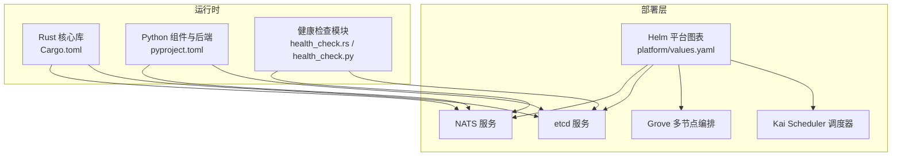
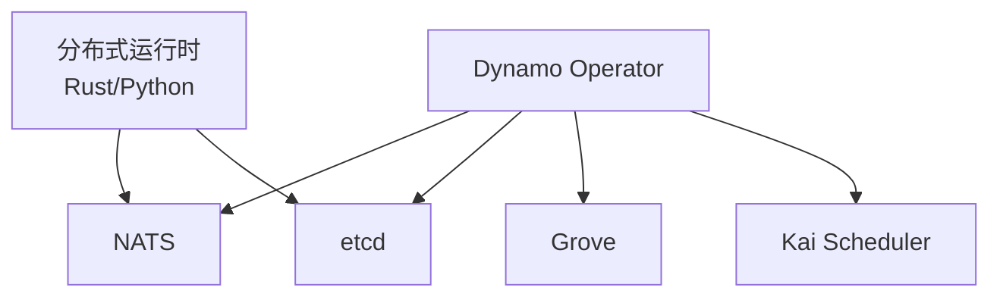
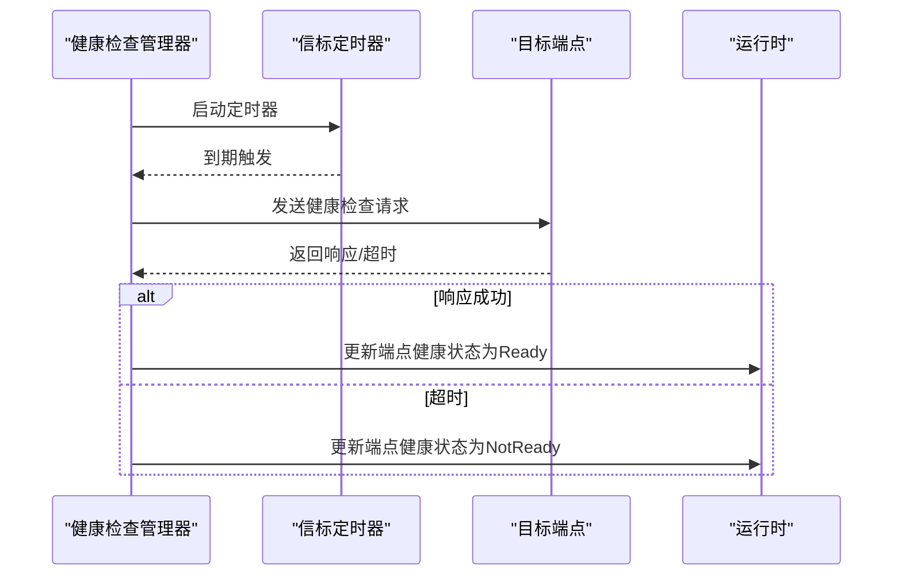
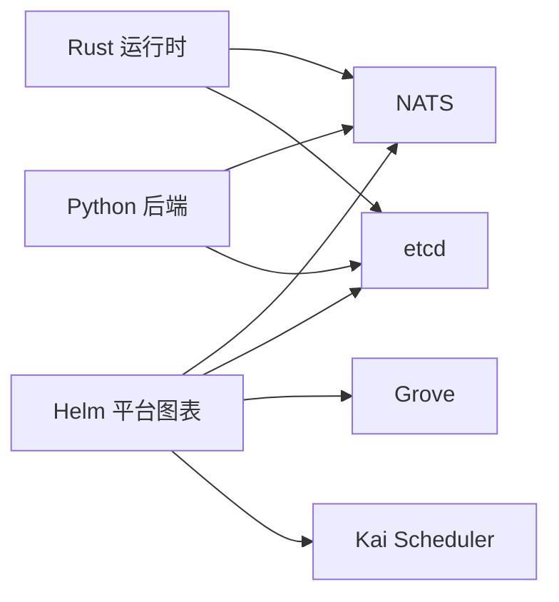

# 依赖管理

<cite>
**本文引用的文件**
- [deploy/docker-compose.yml](file://deploy/docker-compose.yml)
- [deploy/nats-server.conf](file://deploy/nats-server.conf)
- [deploy/helm/README.md](file://deploy/helm/README.md)
- [deploy/helm/charts/platform/values.yaml](file://deploy/helm/charts/platform/values.yaml)
- [deploy/helm/charts/platform/README.md](file://deploy/helm/charts/platform/README.md)
- [Cargo.toml](file://Cargo.toml)
- [pyproject.toml](file://pyproject.toml)
- [lib/rust/src/distributed.rs](file://lib/rust/src/distributed.rs)
- [lib/rust/src/health_check.rs](file://lib/rust/src/health_check.rs)
- [lib/rust/src/system_status_server.rs](file://lib/rust/src/system_status_server.rs)
- [lib/bindings/python/src/dynamo/health_check.py](file://lib/bindings/python/src/dynamo/health_check.py)
- [components/src/dynamo/vllm/health_check.py](file://components/src/dynamo/vllm/health_check.py)
- [components/src/dynamo/trtllm/health_check.py](file://components/src/dynamo/trtllm/health_check.py)
- [components/src/dynamo/sglang/health_check.py](file://components/src/dynamo/sglang/health_check.py)
- [deploy/operator/internal/dynamo/grove.go](file://deploy/operator/internal/dynamo/grove.go)
- [deploy/operator/internal/dynamo/grove_test.go](file://deploy/operator/internal/dynamo/grove_test.go)
- [deploy/operator/internal/consts/consts.go](file://deploy/operator/internal/consts/consts.go)
- [deploy/sanity_check.py](file://deploy/sanity_check.py)
</cite>

## 目录
1. [简介](#简介)
2. [项目结构](#项目结构)
3. [核心组件](#核心组件)
4. [架构总览](#架构总览)
5. [详细组件分析](#详细组件分析)
6. [依赖关系分析](#依赖关系分析)
7. [性能考量](#性能考量)
8. [故障排查指南](#故障排查指南)
9. [结论](#结论)
10. [附录](#附录)

## 简介
本文件系统化梳理Dynamo平台的依赖管理与版本策略，覆盖平台图表（Helm Chart）中的依赖关系与版本管理，重点说明dynamo-operator、NATS、etcd、kai-scheduler与Grove等外部依赖的配置方式、启用条件与可选安装策略；同时给出安装顺序、升级策略、健康检查与故障恢复机制，并提供不同版本组合的兼容性矩阵与升级指南。

## 项目结构
Dynamo在部署层面通过Helm Chart统一编排平台组件，基础设施依赖（NATS、etcd）可由Chart内置或外部提供；运行时依赖（后端框架如vLLM、TRT-LLM、SGLang）通过Python可选依赖组进行按需安装；Rust侧通过Cargo管理内部crate与外部依赖。

图示来源
- [deploy/helm/charts/platform/values.yaml](file://deploy/helm/charts/platform/values.yaml#L234-L288)
- [Cargo.toml](file://Cargo.toml#L45-L129)
- [pyproject.toml](file://pyproject.toml#L50-L67)

章节来源
- [deploy/helm/README.md](file://deploy/helm/README.md#L18-L23)
- [deploy/helm/charts/platform/values.yaml](file://deploy/helm/charts/platform/values.yaml#L1-L732)
- [Cargo.toml](file://Cargo.toml#L1-L142)
- [pyproject.toml](file://pyproject.toml#L1-L303)

## 核心组件
- 平台图表（platform）：统一安装Dynamo Operator、NATS、etcd、Grove、Kai Scheduler等组件，支持按需启用/禁用。
- 运行时依赖：
  - Rust侧：NATS客户端、etcd客户端、Tokio、Prometheus等。
  - Python侧：vLLM、TRT-LLM、SGLang等可选后端框架。
- 健康检查：Rust健康检查管理器与Python健康检查负载基类，配合各后端实现默认负载。

章节来源
- [deploy/helm/charts/platform/README.md](file://deploy/helm/charts/platform/README.md#L95-L166)
- [Cargo.toml](file://Cargo.toml#L45-L129)
- [pyproject.toml](file://pyproject.toml#L50-L67)
- [lib/rust/src/health_check.rs](file://lib/rust/src/health_check.rs#L143-L486)
- [lib/bindings/python/src/dynamo/health_check.py](file://lib/bindings/python/src/dynamo/health_check.py#L63-L86)

## 架构总览
平台采用“Helm编排 + 内置/外部依赖”的混合模式。Operator负责资源编排与调度，NATS提供事件与RPC通道，etcd存储状态与发现，Grove/Kai Scheduler扩展多节点与智能调度能力。运行时通过健康检查保障依赖可用性与端点健康。

图示来源
- [deploy/helm/charts/platform/values.yaml](file://deploy/helm/charts/platform/values.yaml#L20-L35)
- [deploy/operator/internal/consts/consts.go](file://deploy/operator/internal/consts/consts.go#L122-L149)

## 详细组件分析

### Helm平台图表与依赖启用
- 可选组件开关
  - dynamo-operator.enabled：是否启用Operator。
  - grove.enabled：是否启用Grove多节点编排。
  - kai-scheduler.enabled：是否启用Kai Scheduler。
  - etcd.enabled：是否启用内置etcd；若禁用则使用外部etcd。
  - nats.enabled：是否启用内置NATS；若禁用则使用外部NATS。
- 关键配置项
  - dynamo-operator.natsAddr / etcdAddr：外部依赖地址优先于内置。
  - discoveryBackend：选择kubernetes或etcd作为发现后端。
  - webhook与证书管理：cert-manager集成、失败策略、超时等。
- 安装顺序建议
  - 先部署CRD（crds chart），再部署platform chart。
  - 若使用外部etcd/NATS，先确保其可达与认证配置正确。
  - 启用Grove/Kai Scheduler前，确认Operator具备相应RBAC与准入控制。

章节来源
- [deploy/helm/README.md](file://deploy/helm/README.md#L18-L23)
- [deploy/helm/charts/platform/README.md](file://deploy/helm/charts/platform/README.md#L95-L166)
- [deploy/helm/charts/platform/values.yaml](file://deploy/helm/charts/platform/values.yaml#L19-L232)

### NATS与etcd配置与版本
- NATS
  - 内置镜像与JetStream配置，支持文件存储PVC与监控端口。
  - 配置文件设置最大消息载荷与trace日志。
- etcd
  - 默认单副本，禁用认证以简化内部通信；生产环境建议启用HA与持久化。
  - 支持预升级作业与PodDisruptionBudget配置。

章节来源
- [deploy/docker-compose.yml](file://deploy/docker-compose.yml#L11-L36)
- [deploy/nats-server.conf](file://deploy/nats-server.conf#L1-L14)
- [deploy/helm/charts/platform/values.yaml](file://deploy/helm/charts/platform/values.yaml#L233-L288)

### 运行时依赖与后端框架
- Rust依赖
  - async-nats、etcd-client、tokio、prometheus等，用于消息与状态管理。
- Python可选依赖
  - vLLM、TRT-LLM、SGLang等，按后端需求选择安装。
- 分布式配置
  - 运行时根据请求平面模式与环境变量决定是否启用NATS/etcd后端。

章节来源
- [Cargo.toml](file://Cargo.toml#L45-L129)
- [pyproject.toml](file://pyproject.toml#L50-L67)
- [lib/rust/src/distributed.rs](file://lib/rust/src/distributed.rs#L535-L558)

### 健康检查与故障恢复
- Rust健康检查管理器
  - 周期性发送健康检查请求，支持超时与状态更新。
  - 可通过环境变量启用/配置检查间隔与超时。
- Python健康检查负载基类
  - 提供默认负载模板与环境覆盖能力；各后端实现具体负载。
- 故障恢复
  - 依赖不可达时标记端点为NotReady，支持重试与告警。
  - 建议结合Prometheus/Grafana观测端点健康状态。

图示来源
- [lib/rust/src/health_check.rs](file://lib/rust/src/health_check.rs#L143-L380)
- [lib/rust/src/system_status_server.rs](file://lib/rust/src/system_status_server.rs#L1079-L1109)
- [lib/bindings/python/src/dynamo/health_check.py](file://lib/bindings/python/src/dynamo/health_check.py#L63-L86)

章节来源
- [lib/rust/src/health_check.rs](file://lib/rust/src/health_check.rs#L143-L486)
- [lib/rust/src/system_status_server.rs](file://lib/rust/src/system_status_server.rs#L1079-L1109)
- [lib/bindings/python/src/dynamo/health_check.py](file://lib/bindings/python/src/dynamo/health_check.py#L63-L86)
- [components/src/dynamo/vllm/health_check.py](file://components/src/dynamo/vllm/health_check.py#L82-L121)
- [components/src/dynamo/trtllm/health_check.py](file://components/src/dynamo/trtllm/health_check.py#L51-L92)
- [components/src/dynamo/sglang/health_check.py](file://components/src/dynamo/sglang/health_check.py#L50-L121)

### 条件依赖与功能开关
- Grove与Kai Scheduler联动
  - 仅当两者均启用且未手动指定调度器时，自动注入Kai Scheduler。
  - 注入队列标签与调度器名称，便于资源调度与隔离。
- 外部依赖优先
  - 通过natsAddr/etcdAddr显式配置外部实例，优先于内置部署。
- 发现后端切换
  - discoveryBackend支持kubernetes或etcd两种模式，影响KV存储后端选择。

章节来源
- [deploy/operator/internal/dynamo/grove.go](file://deploy/operator/internal/dynamo/grove.go#L303-L330)
- [deploy/operator/internal/dynamo/grove_test.go](file://deploy/operator/internal/dynamo/grove_test.go#L112-L201)
- [deploy/operator/internal/consts/consts.go](file://deploy/operator/internal/consts/consts.go#L122-L149)
- [lib/rust/src/distributed.rs](file://lib/rust/src/distributed.rs#L535-L558)
- [deploy/helm/charts/platform/values.yaml](file://deploy/helm/charts/platform/values.yaml#L49-L50)

## 依赖关系分析

图示来源
- [deploy/helm/charts/platform/values.yaml](file://deploy/helm/charts/platform/values.yaml#L233-L288)
- [Cargo.toml](file://Cargo.toml#L45-L129)
- [pyproject.toml](file://pyproject.toml#L50-L67)

章节来源
- [deploy/helm/charts/platform/values.yaml](file://deploy/helm/charts/platform/values.yaml#L233-L288)
- [Cargo.toml](file://Cargo.toml#L45-L129)
- [pyproject.toml](file://pyproject.toml#L50-L67)

## 性能考量
- NATS
  - JetStream文件存储PVC建议独立挂载，避免IO争用。
  - 监控端口开启有助于性能观测，但生产中建议限制暴露范围。
- etcd
  - 单副本适合开发测试；生产建议3+副本与持久化，启用PodDisruptionBudget。
  - 关闭探针简化启动流程，生产可按需开启。
- 运行时
  - 健康检查间隔与超时应结合后端吞吐与延迟调优，避免过度探测。
  - 后端框架（vLLM/TRT-LLM/SGLang）的安装与版本需与CUDA/Triton栈匹配。

[本节为通用指导，不直接分析具体文件]

## 故障排查指南
- 依赖缺失与替代
  - 若未配置natsAddr/etcdAddr，优先检查内置NATS/etcd是否正常启动与端口可达。
  - 外部依赖不可用时，Operator与运行时会标记端点NotReady，需检查网络、认证与证书。
- 健康检查异常
  - 使用Rust健康检查管理器与Python健康检查负载基类，结合环境变量调整canary等待时间与请求超时。
  - 各后端实现的健康检查负载（vLLM/TRT-LLM/SGLang）可覆盖默认负载，确保与后端接口一致。
- 预部署验证
  - 使用sanity_check.py进行系统与依赖预检，快速定位容器共享内存、权限、CUDA/NVIDIA工具链等问题。

章节来源
- [lib/rust/src/health_check.rs](file://lib/rust/src/health_check.rs#L143-L380)
- [lib/bindings/python/src/dynamo/health_check.py](file://lib/bindings/python/src/dynamo/health_check.py#L63-L86)
- [components/src/dynamo/vllm/health_check.py](file://components/src/dynamo/vllm/health_check.py#L82-L121)
- [components/src/dynamo/trtllm/health_check.py](file://components/src/dynamo/trtllm/health_check.py#L51-L92)
- [components/src/dynamo/sglang/health_check.py](file://components/src/dynamo/sglang/health_check.py#L50-L121)
- [deploy/sanity_check.py](file://deploy/sanity_check.py#L1-L800)

## 结论
Dynamo通过Helm平台图表实现了对NATS、etcd、Grove与Kai Scheduler的统一编排与按需启用；运行时在Rust与Python层面分别管理核心依赖与后端框架。通过明确的安装顺序、健康检查与故障恢复机制，以及清晰的功能开关与外部依赖优先策略，平台可在不同环境中稳定运行并平滑升级。

[本节为总结性内容，不直接分析具体文件]

## 附录

### 版本与兼容性矩阵（示例）
- NATS
  - 内置镜像版本：nats:2.11.4（docker-compose）、nats:2.10.21-alpine（Helm容器镜像）。
  - JetStream文件存储PVC大小：10Gi（Helm默认）。
- etcd
  - 内置镜像版本：bitnamilegacy/etcd:3.6.1（docker-compose）、bitnamilegacy/etcd:3.5.18-debian-12-r5（Helm镜像）。
  - 单副本默认，生产建议3+副本与持久化。
- 后端框架（Python可选依赖）
  - vLLM: 0.14.1（含flashinfer/runai特性）
  - TRT-LLM: 1.3.0rc1
  - SGLang: 0.5.8（含nixl[cu12]）

章节来源
- [deploy/docker-compose.yml](file://deploy/docker-compose.yml#L12-L28)
- [deploy/helm/charts/platform/values.yaml](file://deploy/helm/charts/platform/values.yaml#L239-L242)
- [pyproject.toml](file://pyproject.toml#L50-L67)

### 升级指南（建议流程）
- Helm升级
  - 先备份CRD与自定义资源，再升级platform chart；如启用外部etcd/NATS，先验证其可用性与版本兼容。
  - 对于etcd升级，参考Helm值配置中的preUpgradeJob与PDB设置。
- 运行时升级
  - Rust依赖通过Cargo锁定版本；Python后端框架按需升级，注意CUDA与Triton栈兼容。
  - 升级前后运行健康检查，确保端点Ready。

章节来源
- [deploy/helm/charts/platform/values.yaml](file://deploy/helm/charts/platform/values.yaml#L253-L282)
- [Cargo.toml](file://Cargo.toml#L45-L129)
- [pyproject.toml](file://pyproject.toml#L50-L67)