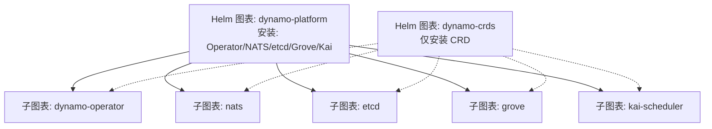
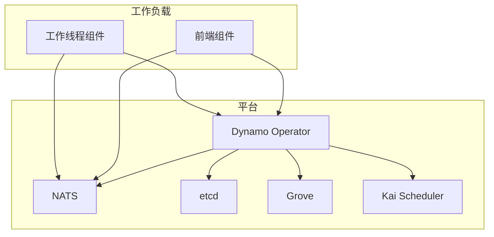
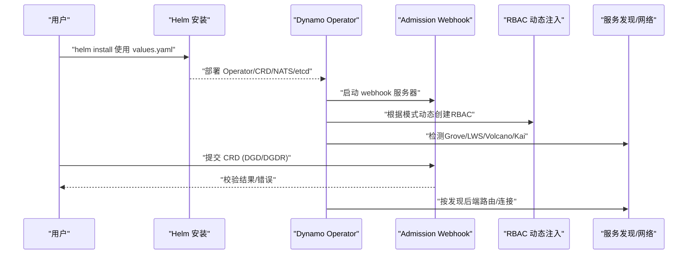
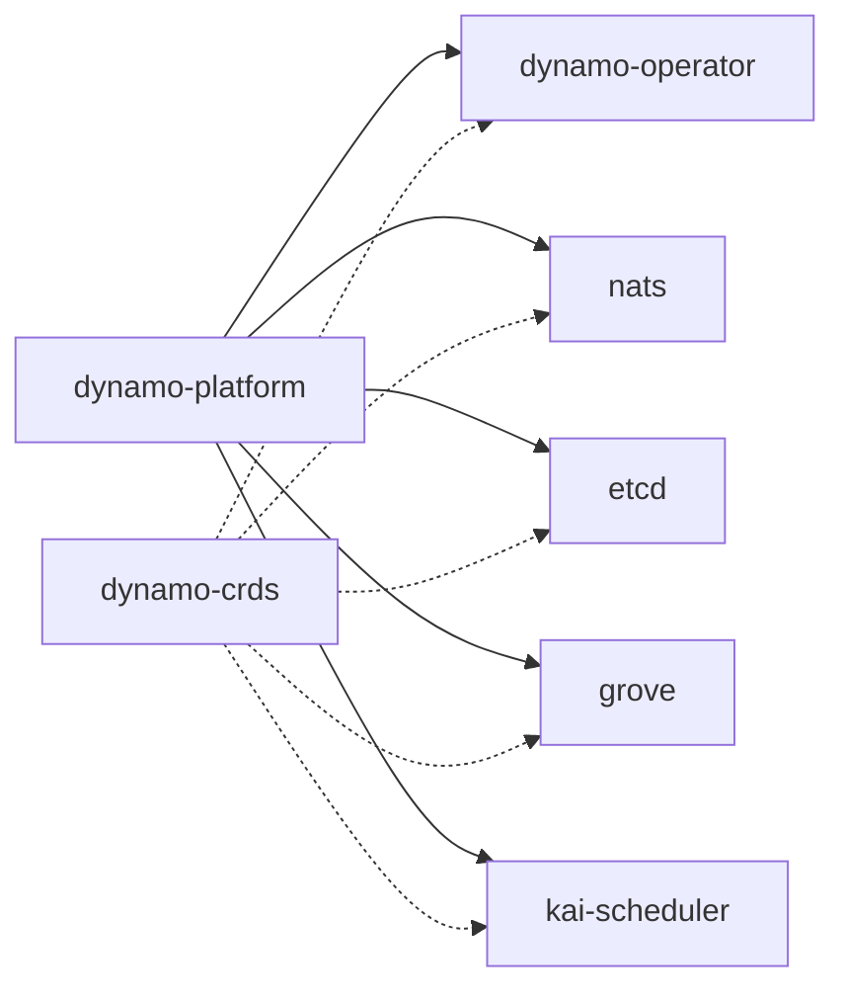

# 平台图表

<cite>
**本文引用的文件**
- [deploy/helm/README.md](file://deploy/helm/README.md)
- [deploy/helm/charts/platform/Chart.yaml](file://deploy/helm/charts/platform/Chart.yaml)
- [deploy/helm/charts/platform/values.yaml](file://deploy/helm/charts/platform/values.yaml)
- [deploy/helm/charts/platform/components/operator/Chart.yaml](file://deploy/helm/charts/platform/components/operator/Chart.yaml)
- [deploy/helm/charts/platform/components/operator/values.yaml](file://deploy/helm/charts/platform/components/operator/values.yaml)
- [deploy/operator/README.md](file://deploy/operator/README.md)
- [deploy/operator/cmd/main.go](file://deploy/operator/cmd/main.go)
- [deploy/operator/config/crd/bases/nvidia.com_dynamographdeployments.yaml](file://deploy/operator/config/crd/bases/nvidia.com_dynamographdeployments.yaml)
- [deploy/operator/config/crd/bases/nvidia.com_dynamocomponentdeployments.yaml](file://deploy/operator/config/crd/bases/nvidia.com_dynamocomponentdeployments.yaml)
- [deploy/operator/config/crd/bases/nvidia.com_dynamographdeploymentrequests.yaml](file://deploy/operator/config/crd/bases/nvidia.com_dynamographdeploymentrequests.yaml)
- [deploy/operator/config/rbac/manager.yaml](file://deploy/operator/config/rbac/manager.yaml)
- [deploy/operator/config/rbac/auth_proxy_role.yaml](file://deploy/operator/config/rbac/auth_proxy_role.yaml)
- [deploy/operator/config/rbac/auth_proxy_role_binding.yaml](file://deploy/operator/config/rbac/auth_proxy_role_binding.yaml)
- [deploy/operator/config/rbac/leader_election_role.yaml](file://deploy/operator/config/rbac/leader_election_role.yaml)
- [deploy/operator/config/rbac/leader_election_role_binding.yaml](file://deploy/operator/config/rbac/leader_election_role_binding.yaml)
- [deploy/operator/config/prometheus/monitor.yaml](file://deploy/operator/config/prometheus/monitor.yaml)
- [docs/kubernetes/installation_guide.md](file://docs/kubernetes/installation_guide.md)
- [docs/kubernetes/README.md](file://docs/kubernetes/README.md)
</cite>

## 目录
1. [简介](#简介)
2. [项目结构](#项目结构)
3. [核心组件](#核心组件)
4. [架构总览](#架构总览)
5. [详细组件分析](#详细组件分析)
6. [依赖关系分析](#依赖关系分析)
7. [性能考量](#性能考量)
8. [故障排查指南](#故障排查指南)
9. [结论](#结论)
10. [附录](#附录)

## 简介
本文件面向Dynamo平台在Kubernetes上的图表化部署，聚焦“platform”与“crds”两个Helm图表，系统性阐述operator组件的部署配置、服务发现机制与网络策略；详解values.yaml中的关键参数（资源限制、副本数、镜像版本、网络设置等）；拆解operator子模块（webhook、RBAC、服务监控等）；给出开发/测试/生产三类部署场景的最佳实践；解释模板渲染与条件部署逻辑，并提供完整部署命令与验证步骤。

## 项目结构
Dynamo平台的Kubernetes部署由两部分构成：
- 平台图表（platform）：安装Dynamo Operator、NATS、etcd、可选的Grove与Kai Scheduler等。
- CRD图表（crds）：仅安装Dynamo相关的CRDs，便于在共享集群中复用现有Operator。

图示来源
- [deploy/helm/charts/platform/Chart.yaml](file://deploy/helm/charts/platform/Chart.yaml#L24-L46)
- [deploy/helm/README.md](file://deploy/helm/README.md#L20-L23)

章节来源
- [deploy/helm/README.md](file://deploy/helm/README.md#L20-L23)
- [deploy/helm/charts/platform/Chart.yaml](file://deploy/helm/charts/platform/Chart.yaml#L24-L46)

## 核心组件
- Dynamo Operator：基于Kubebuilder构建，管理DynamoGraphDeployment、DynamoComponentDeployment、DynamoGraphDeploymentRequest等CRD生命周期，支持webhook校验、RBAC动态注入、多后端适配。
- NATS：消息中间件，用于operator与各组件通信，支持JetStream持久化与监控端口。
- etcd：键值存储，保存operator状态与元数据，支持持久卷与HA配置。
- Grove/Kai Scheduler：可选的多节点编排与智能调度组件，按需启用。
- CRDs：Dynamo自定义资源定义，由crds图表或platform图表安装。

章节来源
- [deploy/operator/README.md](file://deploy/operator/README.md#L6-L18)
- [deploy/helm/charts/platform/values.yaml](file://deploy/helm/charts/platform/values.yaml#L19-L28)
- [deploy/helm/charts/platform/values.yaml](file://deploy/helm/charts/platform/values.yaml#L233-L288)
- [deploy/helm/charts/platform/values.yaml](file://deploy/helm/charts/platform/values.yaml#L213-L226)
- [deploy/helm/charts/platform/values.yaml](file://deploy/helm/charts/platform/values.yaml#L222-L232)

## 架构总览
下图展示平台图表的组件交互与依赖关系，以及operator如何通过webhook、RBAC与服务发现进行协调。

图示来源
- [deploy/helm/charts/platform/Chart.yaml](file://deploy/helm/charts/platform/Chart.yaml#L24-L46)
- [deploy/helm/charts/platform/values.yaml](file://deploy/helm/charts/platform/values.yaml#L290-L490)
- [deploy/helm/charts/platform/values.yaml](file://deploy/helm/charts/platform/values.yaml#L233-L288)
- [deploy/helm/charts/platform/values.yaml](file://deploy/helm/charts/platform/values.yaml#L213-L226)

## 详细组件分析

### Operator组件与子模块
- 命令行参数与运行模式
  - 支持leader选举、健康探针、指标端口、HTTP/2开关、webhook开关、命名空间限制、发现后端选择等。
  - 在集群级模式与命名空间受限模式之间切换，并通过lease机制避免冲突。
- Webhook
  - 提供对DynamoGraphDeployment、DynamoComponentDeployment、DynamoModel、DynamoGraphDeploymentRequest的验证。
  - 可通过cert-manager或Helm钩子自动管理证书；失败策略可配置为Fail或Ignore。
- RBAC
  - 集群级模式下动态为跨命名空间创建ServiceAccount与RoleBinding，绑定预置的ClusterRole。
  - 支持计划器、DGDR Profiling、EPP等角色名称参数化。
- 服务发现与网络
  - 发现后端可选kubernetes或etcd；支持Istio VirtualService与Ingress控制器集成。
  - Prometheus端点注入到受管服务，便于Prometheus抓取。
- 资源与镜像
  - operator镜像仓库与标签可配置；默认使用本地镜像拉取策略。
  - 资源请求/限制可调，默认副本数为1。

图示来源
- [deploy/operator/cmd/main.go](file://deploy/operator/cmd/main.go#L157-L217)
- [deploy/operator/cmd/main.go](file://deploy/operator/cmd/main.go#L302-L310)
- [deploy/operator/cmd/main.go](file://deploy/operator/cmd/main.go#L623-L677)
- [deploy/helm/charts/platform/components/operator/values.yaml](file://deploy/helm/charts/platform/components/operator/values.yaml#L149-L226)

章节来源
- [deploy/operator/cmd/main.go](file://deploy/operator/cmd/main.go#L128-L217)
- [deploy/operator/cmd/main.go](file://deploy/operator/cmd/main.go#L302-L310)
- [deploy/operator/cmd/main.go](file://deploy/operator/cmd/main.go#L623-L677)
- [deploy/helm/charts/platform/components/operator/values.yaml](file://deploy/helm/charts/platform/components/operator/values.yaml#L149-L226)

### values.yaml 关键参数解析
- Dynamo Operator
  - 启用开关、NATS/etcd地址、命名空间限制、发现后端、leader选举、镜像仓库/标签/拉取策略、资源请求/限制、webhook开关与证书策略、Istio/Ingress集成等。
- 平台通用
  - Grove终止延迟、内部工具镜像、受限安全上下文、Docker私有仓库凭据、Ingress/Istio、Prometheus端点、MPI Run SSH密钥等。
- NATS
  - 是否启用、JetStream开启与文件存储、PVC大小、TLS/监控/Profiling端口、容器镜像与端口映射、Service暴露、Pod预算、ConfigMap/Headless Service等。
- etcd
  - 是否启用、镜像仓库/标签、持久化存储、副本数、认证关闭（内部）、探针关闭、PodDisruptionBudget、亲和/容忍等。
- Grove/Kai Scheduler
  - 是否启用、全局亲和/容忍、组件特定配置等。

章节来源
- [deploy/helm/charts/platform/values.yaml](file://deploy/helm/charts/platform/values.yaml#L19-L28)
- [deploy/helm/charts/platform/values.yaml](file://deploy/helm/charts/platform/values.yaml#L52-L86)
- [deploy/helm/charts/platform/values.yaml](file://deploy/helm/charts/platform/values.yaml#L87-L150)
- [deploy/helm/charts/platform/values.yaml](file://deploy/helm/charts/platform/values.yaml#L151-L226)
- [deploy/helm/charts/platform/values.yaml](file://deploy/helm/charts/platform/values.yaml#L290-L490)
- [deploy/helm/charts/platform/values.yaml](file://deploy/helm/charts/platform/values.yaml#L233-L288)
- [deploy/helm/charts/platform/values.yaml](file://deploy/helm/charts/platform/values.yaml#L213-L226)
- [deploy/helm/charts/platform/values.yaml](file://deploy/helm/charts/platform/values.yaml#L222-L232)

### 模板渲染与条件部署
- platform图表通过dependencies字段按条件引入子图表（如nats.enabled、etcd.enabled、grove.enabled、kai-scheduler.enabled），values.yaml中对应字段控制是否渲染。
- operator子图表的Chart.yaml定义了应用版本与依赖，values.yaml提供默认参数与覆盖项。
- 条件渲染示例：当nats.enabled为true时，才会渲染nats子图表；当grove.enabled为true时，才会渲染grove子图表。

章节来源
- [deploy/helm/charts/platform/Chart.yaml](file://deploy/helm/charts/platform/Chart.yaml#L24-L46)
- [deploy/helm/charts/platform/components/operator/Chart.yaml](file://deploy/helm/charts/platform/components/operator/Chart.yaml#L27-L35)
- [deploy/helm/charts/platform/components/operator/values.yaml](file://deploy/helm/charts/platform/components/operator/values.yaml#L23-L48)

### 部署场景与最佳实践
- 开发环境（本地/单机）
  - 使用minikube或kind，启用本地存储与简化配置；禁用JetStream持久化、关闭PodDisruptionBudget；减少副本数与资源限制。
  - 建议：关闭etcd持久化、关闭Grove/Kai；仅启用operator与NATS；使用默认Ingress或不启用。
- 测试环境（多租户/共享集群）
  - 若集群已有集群级operator，建议启用命名空间限制（namespaceRestriction.enabled=true），避免与现有operator冲突。
  - 建议：启用webhook校验（failurePolicy=Fail）；开启Prometheus端点；启用Istio或Ingress视业务需要。
- 生产环境
  - 启用集群级operator（默认），或按需启用命名空间限制；启用webhook（failurePolicy=Fail）；开启etcd持久化与HA（replicaCount≥3）；启用Grove/Kai以支持多节点；开启JetStream持久化与监控导出器；配置证书管理（cert-manager）。
  - 建议：为operator配置充足的CPU/内存与亲和/容忍；为NATS/etcd设置合适的存储类与容量；为Grove/Kai配置独立节点或专用拓扑分布。

章节来源
- [docs/kubernetes/installation_guide.md](file://docs/kubernetes/installation_guide.md#L133-L206)
- [docs/kubernetes/installation_guide.md](file://docs/kubernetes/installation_guide.md#L168-L186)
- [deploy/helm/charts/platform/values.yaml](file://deploy/helm/charts/platform/values.yaml#L151-L226)
- [deploy/helm/charts/platform/values.yaml](file://deploy/helm/charts/platform/values.yaml#L233-L288)
- [deploy/helm/charts/platform/values.yaml](file://deploy/helm/charts/platform/values.yaml#L290-L490)

### 部署命令与验证步骤
- 安装CRDs（若集群未安装）
  - 使用NGC发布的crds图表或本地crds图表安装。
- 安装平台
  - 使用NGC发布的platform图表或本地platform图表安装，按需设置values。
- 验证
  - 检查CRD是否存在；检查operator、etcd、nats等Pod状态；尝试部署示例DGD/DGDR并验证服务连通性。

章节来源
- [docs/kubernetes/installation_guide.md](file://docs/kubernetes/installation_guide.md#L133-L206)
- [docs/kubernetes/installation_guide.md](file://docs/kubernetes/installation_guide.md#L265-L274)

## 依赖关系分析
- 平台图表依赖多个子图表，且通过condition字段实现条件渲染。
- operator子图表自身为应用类型，定义了版本与应用版本号，values.yaml提供默认参数。
- CRDs图表为应用类型，无依赖。

图示来源
- [deploy/helm/charts/platform/Chart.yaml](file://deploy/helm/charts/platform/Chart.yaml#L24-L46)
- [deploy/helm/charts/platform/components/operator/Chart.yaml](file://deploy/helm/charts/platform/components/operator/Chart.yaml#L27-L35)
- [deploy/helm/README.md](file://deploy/helm/README.md#L20-L23)

章节来源
- [deploy/helm/charts/platform/Chart.yaml](file://deploy/helm/charts/platform/Chart.yaml#L24-L46)
- [deploy/helm/charts/platform/components/operator/Chart.yaml](file://deploy/helm/charts/platform/components/operator/Chart.yaml#L27-L35)

## 性能考量
- NATS
  - JetStream文件存储适合持久化场景，但会增加磁盘IO；内存存储更快但不持久。根据业务需求选择。
  - 监控端口与Prometheus导出器可用于观测NATS吞吐与延迟。
- etcd
  - 单节点适合开发/测试；生产建议3+副本并启用持久化与PodDisruptionBudget。
  - 关闭探针与RBAC可降低启动复杂度，但生产建议开启以提升稳定性。
- Operator
  - 资源请求/限制应结合集群规模与并发负载调整；启用HTTP/2可能带来安全风险，建议默认关闭。
  - webhook超时与失败策略影响请求处理可靠性，生产建议Fail策略并缩短超时时间。

章节来源
- [deploy/helm/charts/platform/values.yaml](file://deploy/helm/charts/platform/values.yaml#L308-L350)
- [deploy/helm/charts/platform/values.yaml](file://deploy/helm/charts/platform/values.yaml#L385-L403)
- [deploy/helm/charts/platform/values.yaml](file://deploy/helm/charts/platform/values.yaml#L268-L282)
- [deploy/operator/cmd/main.go](file://deploy/operator/cmd/main.go#L286-L300)
- [deploy/helm/charts/platform/values.yaml](file://deploy/helm/charts/platform/values.yaml#L181-L185)

## 故障排查指南
- “无法安装集群级Dynamo Operator”
  - 原因：共享集群中已存在命名空间受限operator。
  - 解决：在安装命令中添加命名空间限制参数。
- CRD已存在
  - 原因：在已有CRD的集群上重复安装。
  - 解决：跳过CRD安装步骤，直接安装platform。
- Pod无法启动
  - 排查：查看Pod事件与日志；确认镜像拉取、资源配额、网络策略与证书。
- etcd镜像“不受支持”
  - 原因：Bitnami仓库迁移导致镜像不可识别。
  - 解决：使用旧版仓库镜像并允许非标准容器。

章节来源
- [docs/kubernetes/installation_guide.md](file://docs/kubernetes/installation_guide.md#L299-L324)
- [docs/kubernetes/installation_guide.md](file://docs/kubernetes/installation_guide.md#L339-L350)

## 结论
通过platform与crds图表，Dynamo实现了对Operator、消息中间件、状态存储与可选编排组件的统一管理。借助values.yaml的丰富参数与条件渲染，可在不同环境中灵活部署。生产环境建议启用webhook、etcd持久化与HA、Grove/Kai调度、证书管理与监控导出，确保高可用与可观测性。

## 附录

### CRD清单与RBAC参考
- CRD清单位于operator配置目录，包含DynamoGraphDeployment、DynamoComponentDeployment、DynamoGraphDeploymentRequest等。
- RBAC配置包含manager、auth_proxy、leader_election等角色与绑定，以及Prometheus监控配置。

章节来源
- [deploy/operator/config/crd/bases/nvidia.com_dynamographdeployments.yaml](file://deploy/operator/config/crd/bases/nvidia.com_dynamographdeployments.yaml)
- [deploy/operator/config/crd/bases/nvidia.com_dynamocomponentdeployments.yaml](file://deploy/operator/config/crd/bases/nvidia.com_dynamocomponentdeployments.yaml)
- [deploy/operator/config/crd/bases/nvidia.com_dynamographdeploymentrequests.yaml](file://deploy/operator/config/crd/bases/nvidia.com_dynamographdeploymentrequests.yaml)
- [deploy/operator/config/rbac/manager.yaml](file://deploy/operator/config/rbac/manager.yaml)
- [deploy/operator/config/rbac/auth_proxy_role.yaml](file://deploy/operator/config/rbac/auth_proxy_role.yaml)
- [deploy/operator/config/rbac/auth_proxy_role_binding.yaml](file://deploy/operator/config/rbac/auth_proxy_role_binding.yaml)
- [deploy/operator/config/rbac/leader_election_role.yaml](file://deploy/operator/config/rbac/leader_election_role.yaml)
- [deploy/operator/config/rbac/leader_election_role_binding.yaml](file://deploy/operator/config/rbac/leader_election_role_binding.yaml)
- [deploy/operator/config/prometheus/monitor.yaml](file://deploy/operator/config/prometheus/monitor.yaml)