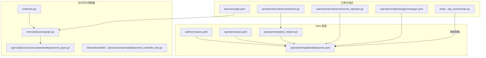
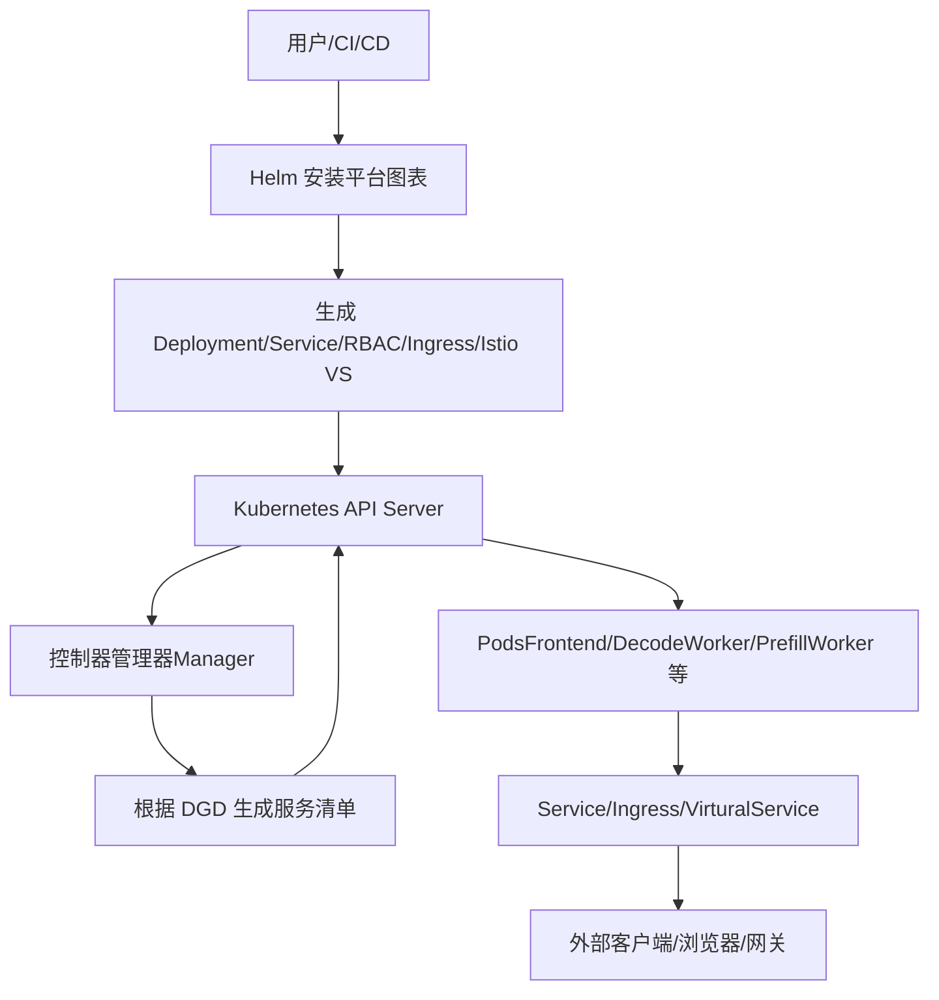
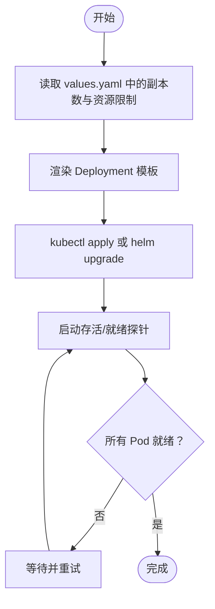
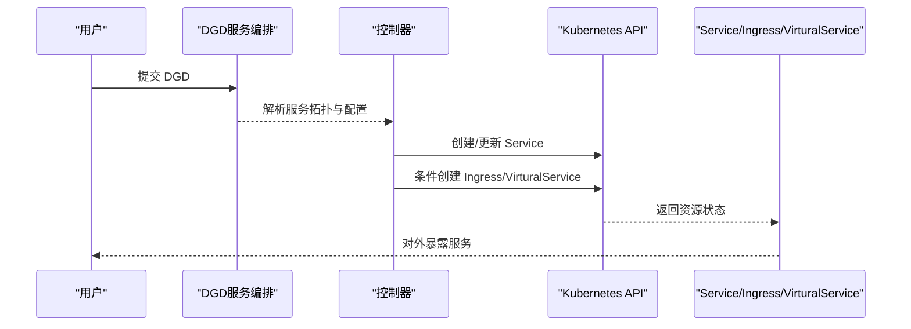
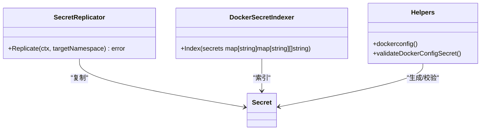
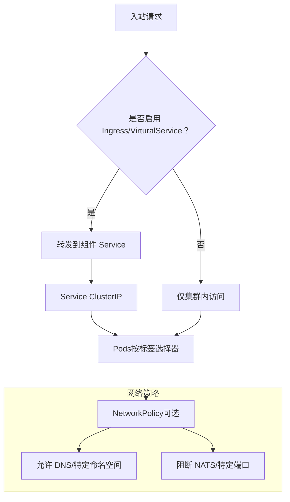
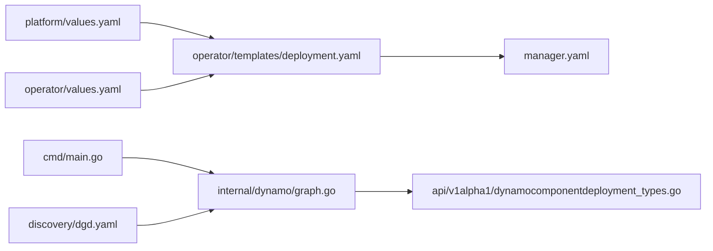

# 服务配置

<cite>
**本文引用的文件**
- [values.yaml（平台）](file://deploy/helm/charts/platform/values.yaml)
- [values.yaml（操作器组件）](file://deploy/helm/charts/platform/components/operator/values.yaml)
- [Deployment 模板（操作器组件）](file://deploy/helm/charts/platform/components/operator/templates/deployment.yaml)
- [_helpers 模板（操作器组件）](file://deploy/helm/charts/platform/components/operator/templates/_helpers.tpl)
- [dgd.yaml（服务编排示例）](file://deploy/discovery/dgd.yaml)
- [main.go（操作器入口）](file://deploy/operator/cmd/main.go)
- [graph.go（服务配置模型）](file://deploy/operator/internal/dynamo/graph.go)
- [dynamocomponentdeployment_types.go（Ingress 规格）](file://deploy/operator/api/v1alpha1/dynamocomponentdeployment_types.go)
- [deployment.yaml（控制器测试）](file://deploy/operator/internal/controller/dynamocomponentdeployment_controller_test.go)
- [secret_replicator.go（Secret 复制）](file://deploy/operator/internal/secret/secret_replicator.go)
- [docker.go（Docker 秘钥索引）](file://deploy/operator/internal/secrets/docker.go)
- [manager.yaml（控制器管理器）](file://deploy/operator/config/manager/manager.yaml)
- [dgd.yaml（发现配置）](file://deploy/discovery/dgd.yaml)
- [main.py（故障注入 API：网络策略）](file://tests/fault_tolerance/hardware/fault_injection_service/api_service/main.py)
</cite>

## 目录
1. [简介](#简介)
2. [项目结构](#项目结构)
3. [核心组件](#核心组件)
4. [架构总览](#架构总览)
5. [详细组件分析](#详细组件分析)
6. [依赖关系分析](#依赖关系分析)
7. [性能考量](#性能考量)
8. [故障排查指南](#故障排查指南)
9. [结论](#结论)
10. [附录](#附录)

## 简介
本文件面向Dynamo平台在Kubernetes上的服务配置与运维，系统性阐述平台图表中的Kubernetes资源配置与运行机制，覆盖Deployment、Service、ConfigMap、Secret等；解释服务发现、负载均衡与网络访问控制；给出资源限制、副本数、滚动更新策略与健康检查的最佳实践；并提供开发/测试/生产三类环境的差异化配置建议、服务间依赖与通信协议说明、完整部署命令与验证步骤。

## 项目结构
围绕服务配置的关键目录与文件：
- Helm 平台图表：定义平台组件（操作器、NATS、etcd、Istio集成等）的安装与参数化
- 操作器组件模板：生成控制器管理器的Deployment、Service、RBAC、指标端点等
- 发现与编排样例：通过DGD展示服务拓扑与资源声明
- 运行时与控制器代码：服务发现后端选择、Ingress/VirturalService生成、健康探针与资源限制

**图示来源**
- [values.yaml（平台）](file://deploy/helm/charts/platform/values.yaml#L1-L732)
- [values.yaml（操作器组件）](file://deploy/helm/charts/platform/components/operator/values.yaml#L1-L226)
- [Deployment 模板（操作器组件）](file://deploy/helm/charts/platform/components/operator/templates/deployment.yaml#L1-L199)
- [_helpers 模板（操作器组件）](file://deploy/helm/charts/platform/components/operator/templates/_helpers.tpl#L1-L153)
- [main.go（操作器入口）](file://deploy/operator/cmd/main.go#L128-L163)
- [graph.go（服务配置模型）](file://deploy/operator/internal/dynamo/graph.go#L1-L705)
- [dynamocomponentdeployment_types.go（Ingress 规格）](file://deploy/operator/api/v1alpha1/dynamocomponentdeployment_types.go#L149-L170)
- [dgd.yaml（服务编排示例）](file://deploy/discovery/dgd.yaml#L1-L59)
- [manager.yaml（控制器管理器）](file://deploy/operator/config/manager/manager.yaml#L88-L106)
- [main.py（故障注入 API：网络策略）](file://tests/fault_tolerance/hardware/fault_injection_service/api_service/main.py#L240-L774)

**章节来源**
- [values.yaml（平台）](file://deploy/helm/charts/platform/values.yaml#L1-L732)
- [values.yaml（操作器组件）](file://deploy/helm/charts/platform/components/operator/values.yaml#L1-L226)
- [Deployment 模板（操作器组件）](file://deploy/helm/charts/platform/components/operator/templates/deployment.yaml#L1-L199)
- [_helpers 模板（操作器组件）](file://deploy/helm/charts/platform/components/operator/templates/_helpers.tpl#L1-L153)
- [main.go（操作器入口）](file://deploy/operator/cmd/main.go#L128-L163)
- [graph.go（服务配置模型）](file://deploy/operator/internal/dynamo/graph.go#L1-L705)
- [dynamocomponentdeployment_types.go（Ingress 规格）](file://deploy/operator/api/v1alpha1/dynamocomponentdeployment_types.go#L149-L170)
- [dgd.yaml（服务编排示例）](file://deploy/discovery/dgd.yaml#L1-L59)
- [manager.yaml（控制器管理器）](file://deploy/operator/config/manager/manager.yaml#L88-L106)
- [main.py（故障注入 API：网络策略）](file://tests/fault_tolerance/hardware/fault_injection_service/api_service/main.py#L240-L774)

## 核心组件
- Helm 平台图表：集中定义平台组件（操作器、NATS、etcd、Istio网关、Ingress等）的启用/禁用、镜像、存储、探针、资源限制等参数
- 操作器组件模板：基于values.yaml渲染Deployment、ServiceAccount、RBAC、指标Service、Webhook证书等
- 运行时与控制器：根据DGD解析服务拓扑，生成Service、VirtualService或Ingress，注入探针与资源限制，并支持服务发现后端切换

关键要点
- 资源限制与副本数：通过values.yaml统一收敛，避免在各组件中分散配置
- 健康检查：liveness/readiness探针路径与周期在模板中固定，便于统一治理
- 探针与指标：管理器容器暴露健康与指标端口，kube-rbac-proxy对外提供安全访问
- 镜像拉取：支持使用现有Secret或直接凭据，生成dockerconfigjson并注入到Pod

**章节来源**
- [values.yaml（平台）](file://deploy/helm/charts/platform/values.yaml#L19-L226)
- [values.yaml（操作器组件）](file://deploy/helm/charts/platform/components/operator/values.yaml#L72-L94)
- [Deployment 模板（操作器组件）](file://deploy/helm/charts/platform/components/operator/templates/deployment.yaml#L60-L199)
- [_helpers 模板（操作器组件）](file://deploy/helm/charts/platform/components/operator/templates/_helpers.tpl#L84-L153)

## 架构总览
Dynamo平台在Kubernetes上的服务配置由Helm图表驱动，控制器负责将DGD描述的服务拓扑转化为K8s资源（Deployment/Service/Ingress/VirturalService），并结合服务发现后端（Kubernetes API或Etcd）实现跨组件通信与路由。

**图示来源**
- [values.yaml（平台）](file://deploy/helm/charts/platform/values.yaml#L19-L226)
- [Deployment 模板（操作器组件）](file://deploy/helm/charts/platform/components/operator/templates/deployment.yaml#L22-L199)
- [dgd.yaml（服务编排示例）](file://deploy/discovery/dgd.yaml#L15-L59)
- [graph.go（服务配置模型）](file://deploy/operator/internal/dynamo/graph.go#L668-L705)

**章节来源**
- [values.yaml（平台）](file://deploy/helm/charts/platform/values.yaml#L19-L226)
- [Deployment 模板（操作器组件）](file://deploy/helm/charts/platform/components/operator/templates/deployment.yaml#L22-L199)
- [dgd.yaml（服务编排示例）](file://deploy/discovery/dgd.yaml#L15-L59)
- [graph.go（服务配置模型）](file://deploy/operator/internal/dynamo/graph.go#L668-L705)

## 详细组件分析

### Deployment 配置与滚动更新策略
- 副本数与就绪/存活探针：通过values.yaml统一设定，模板中固定探针路径与周期，确保一致性
- 滚动更新策略：模板中采用Recreate策略，适用于需要完全替换的控制器管理器
- 资源限制：在values.yaml中集中定义limits/requests，模板中注入到容器资源字段
- 健康检查：管理器容器提供/healthz与/readyz端点，kube-rbac-proxy对外提供安全端口

**图示来源**
- [values.yaml（操作器组件）](file://deploy/helm/charts/platform/components/operator/values.yaml#L34-L94)
- [Deployment 模板（操作器组件）](file://deploy/helm/charts/platform/components/operator/templates/deployment.yaml#L32-L199)

**章节来源**
- [values.yaml（操作器组件）](file://deploy/helm/charts/platform/components/operator/values.yaml#L34-L94)
- [Deployment 模板（操作器组件）](file://deploy/helm/charts/platform/components/operator/templates/deployment.yaml#L32-L199)
- [deployment.yaml（控制器测试）](file://deploy/operator/internal/controller/dynamocomponentdeployment_controller_test.go#L1270-L1400)

### Service 与服务发现
- 服务发现后端：支持“kubernetes”与“etcd”，可通过注解或全局配置切换
- 服务命名与端口：组件名称即Service名称，端口由运行时常量指定
- Ingress/VirturalService：当启用Ingress或VirtualService时，控制器生成对应资源，绑定到组件Service

**图示来源**
- [dgd.yaml（服务编排示例）](file://deploy/discovery/dgd.yaml#L15-L59)
- [graph.go（服务配置模型）](file://deploy/operator/internal/dynamo/graph.go#L668-L705)
- [dynamocomponentdeployment_types.go（Ingress 规格）](file://deploy/operator/api/v1alpha1/dynamocomponentdeployment_types.go#L149-L170)

**章节来源**
- [dgd.yaml（服务编排示例）](file://deploy/discovery/dgd.yaml#L15-L59)
- [graph.go（服务配置模型）](file://deploy/operator/internal/dynamo/graph.go#L175-L184)
- [dynamocomponentdeployment_types.go（Ingress 规格）](file://deploy/operator/api/v1alpha1/dynamocomponentdeployment_types.go#L149-L170)

### ConfigMap 与 Secret 管理
- ConfigMap：用于存放非敏感配置，如日志级别、模型路径等
- Secret：用于存放敏感信息，如镜像仓库凭据、TLS证书等
- Secret复制：控制器可将源命名空间的Secret复制到目标命名空间，便于跨命名空间共享
- Docker Registry凭据：支持使用现有Secret或直接凭据，自动生成dockerconfigjson并注入

**图示来源**
- [secret_replicator.go（Secret 复制）](file://deploy/operator/internal/secret/secret_replicator.go#L47-L93)
- [docker.go（Docker 秘钥索引）](file://deploy/operator/internal/secrets/docker.go#L14-L26)
- [_helpers 模板（操作器组件）](file://deploy/helm/charts/platform/components/operator/templates/_helpers.tpl#L84-L153)

**章节来源**
- [secret_replicator.go（Secret 复制）](file://deploy/operator/internal/secret/secret_replicator.go#L47-L93)
- [docker.go（Docker 秘钥索引）](file://deploy/operator/internal/secrets/docker.go#L14-L26)
- [_helpers 模板（操作器组件）](file://deploy/helm/charts/platform/components/operator/templates/_helpers.tpl#L84-L153)

### 负载均衡与网络访问控制
- 负载均衡：Service默认ClusterIP，配合Ingress或VirtualService实现外部访问
- 网络策略：可通过NetworkPolicy限制入站/出站流量，支持阻断特定端口、允许DNS、允许特定命名空间等
- 端口与协议：Ingress/VirturalService路由至组件Service端口，控制器按需生成

**图示来源**
- [dynamocomponentdeployment_types.go（Ingress 规格）](file://deploy/operator/api/v1alpha1/dynamocomponentdeployment_types.go#L149-L170)
- [main.py（故障注入 API：网络策略）](file://tests/fault_tolerance/hardware/fault_injection_service/api_service/main.py#L685-L774)

**章节来源**
- [dynamocomponentdeployment_types.go（Ingress 规格）](file://deploy/operator/api/v1alpha1/dynamocomponentdeployment_types.go#L149-L170)
- [main.py（故障注入 API：网络策略）](file://tests/fault_tolerance/hardware/fault_injection_service/api_service/main.py#L685-L774)

### 健康检查与可观测性
- 健康检查：管理器容器提供/healthz与/readyz端点，kube-rbac-proxy对外提供安全端口
- 指标端点：默认本地只监听127.0.0.1，通过kube-rbac-proxy暴露安全端口
- 探针参数：初始延迟、周期、超时等在模板中固定，便于统一治理

**章节来源**
- [Deployment 模板（操作器组件）](file://deploy/helm/charts/platform/components/operator/templates/deployment.yaml#L159-L178)
- [manager.yaml（控制器管理器）](file://deploy/operator/config/manager/manager.yaml#L88-L106)

## 依赖关系分析
- Helm 图表依赖：平台values.yaml决定各子组件启用/禁用与参数，操作器values.yaml细化控制器管理器的镜像、资源、探针等
- 控制器依赖：main.go解析命令行参数，graph.go根据DGD生成服务资源，dynamocomponentdeployment_types.go定义Ingress规格
- 运行时依赖：分布式运行时根据发现后端初始化KubeDiscoveryClient或KVStoreDiscovery

**图示来源**
- [values.yaml（平台）](file://deploy/helm/charts/platform/values.yaml#L19-L226)
- [values.yaml（操作器组件）](file://deploy/helm/charts/platform/components/operator/values.yaml#L72-L94)
- [Deployment 模板（操作器组件）](file://deploy/helm/charts/platform/components/operator/templates/deployment.yaml#L22-L199)
- [manager.yaml（控制器管理器）](file://deploy/operator/config/manager/manager.yaml#L88-L106)
- [main.go（操作器入口）](file://deploy/operator/cmd/main.go#L128-L163)
- [graph.go（服务配置模型）](file://deploy/operator/internal/dynamo/graph.go#L668-L705)
- [dynamocomponentdeployment_types.go（Ingress 规格）](file://deploy/operator/api/v1alpha1/dynamocomponentdeployment_types.go#L149-L170)
- [dgd.yaml（服务编排示例）](file://deploy/discovery/dgd.yaml#L15-L59)

**章节来源**
- [values.yaml（平台）](file://deploy/helm/charts/platform/values.yaml#L19-L226)
- [values.yaml（操作器组件）](file://deploy/helm/charts/platform/components/operator/values.yaml#L72-L94)
- [Deployment 模板（操作器组件）](file://deploy/helm/charts/platform/components/operator/templates/deployment.yaml#L22-L199)
- [manager.yaml（控制器管理器）](file://deploy/operator/config/manager/manager.yaml#L88-L106)
- [main.go（操作器入口）](file://deploy/operator/cmd/main.go#L128-L163)
- [graph.go（服务配置模型）](file://deploy/operator/internal/dynamo/graph.go#L668-L705)
- [dynamocomponentdeployment_types.go（Ingress 规格）](file://deploy/operator/api/v1alpha1/dynamocomponentdeployment_types.go#L149-L170)
- [dgd.yaml（服务编排示例）](file://deploy/discovery/dgd.yaml#L15-L59)

## 性能考量
- 资源配额：在values.yaml中为控制器管理器设置合理的CPU/内存requests/limits，避免资源争抢
- 副本数：控制器管理器采用单副本（或受领导选举约束），避免多实例竞争
- 探针频率：合理设置initialDelaySeconds与periodSeconds，避免频繁探针导致额外开销
- 存储与持久化：NATS JetStream与etcd的持久化配置影响启动时间与可靠性，按环境权衡
- 网络策略：在测试环境中适度放宽，在生产中收紧，减少不必要的出站流量

[本节为通用指导，无需具体文件引用]

## 故障排查指南
- 健康检查失败
  - 检查/healthz与/readyz端口是否可达，确认kube-rbac-proxy与管理器容器均正常
  - 查看探针参数与日志，定位延迟或超时问题
- 部署未按预期更新
  - 确认副本数与模板策略是否一致，控制器会将手动修改回滚到期望状态
- Secret/凭据问题
  - 使用_dockerconfig_模板生成dockerconfigjson，校验Secret类型与内容
  - 如需跨命名空间共享，使用SecretReplicator进行复制
- 网络访问异常
  - 检查NetworkPolicy是否阻断了必要的出站流量（如DNS）
  - 确认Ingress/VirturalService已正确生成并指向目标Service

**章节来源**
- [Deployment 模板（操作器组件）](file://deploy/helm/charts/platform/components/operator/templates/deployment.yaml#L159-L178)
- [deployment.yaml（控制器测试）](file://deploy/operator/internal/controller/dynamocomponentdeployment_controller_test.go#L1270-L1400)
- [_helpers 模板（操作器组件）](file://deploy/helm/charts/platform/components/operator/templates/_helpers.tpl#L84-L153)
- [secret_replicator.go（Secret 复制）](file://deploy/operator/internal/secret/secret_replicator.go#L47-L93)
- [main.py（故障注入 API：网络策略）](file://tests/fault_tolerance/hardware/fault_injection_service/api_service/main.py#L685-L774)

## 结论
Dynamo平台的服务配置以Helm图表为核心，结合控制器对DGD的解析能力，实现了从服务拓扑到Kubernetes资源的自动化生成。通过统一的values.yaml参数化、标准化的探针与资源限制、以及灵活的服务发现与网络策略，平台能够在开发、测试与生产环境中保持一致的交付质量与运维体验。

[本节为总结，无需具体文件引用]

## 附录

### 不同环境下的服务配置示例与最佳实践
- 开发环境
  - 启用本地调试与简化探针，关闭严格网络策略
  - 使用较低资源requests/limits，快速迭代
- 测试环境
  - 启用基础网络策略，保留必要出站（DNS）
  - 设置适度探针周期，平衡稳定性与开销
- 生产环境
  - 启用严格的网络策略与最小权限RBAC
  - 明确资源上限与PodDisruptionBudget，启用Istio VirtualService与Ingress
  - 使用cert-manager或外部证书Secret，开启Webhook校验

**章节来源**
- [values.yaml（平台）](file://deploy/helm/charts/platform/values.yaml#L115-L226)
- [values.yaml（操作器组件）](file://deploy/helm/charts/platform/components/operator/values.yaml#L149-L226)
- [Deployment 模板（操作器组件）](file://deploy/helm/charts/platform/components/operator/templates/deployment.yaml#L145-L199)

### 服务间依赖与通信协议
- 依赖关系：DGD中通过dependencies声明组件依赖，控制器据此生成对应资源
- 通信协议：默认通过Kubernetes Service与Ingress/VirturalService进行HTTP通信；NATS用于内部消息传递（可选JetStream持久化）

**章节来源**
- [graph.go（服务配置模型）](file://deploy/operator/internal/dynamo/graph.go#L212-L216)
- [dgd.yaml（服务编排示例）](file://deploy/discovery/dgd.yaml#L15-L59)

### 部署命令与验证步骤
- 部署命令
  - 使用Helm安装平台图表，指定values.yaml或自定义覆盖
  - 应用DGD以生成服务资源
- 验证步骤
  - 检查Deployment/Service状态与副本数
  - 访问/healthz与/readyz端点，确认探针成功
  - 若启用Ingress/VirturalService，验证外部可达性
  - 检查NetworkPolicy是否符合预期

**章节来源**
- [values.yaml（平台）](file://deploy/helm/charts/platform/values.yaml#L19-L226)
- [dgd.yaml（服务编排示例）](file://deploy/discovery/dgd.yaml#L15-L59)
- [Deployment 模板（操作器组件）](file://deploy/helm/charts/platform/components/operator/templates/deployment.yaml#L159-L178)