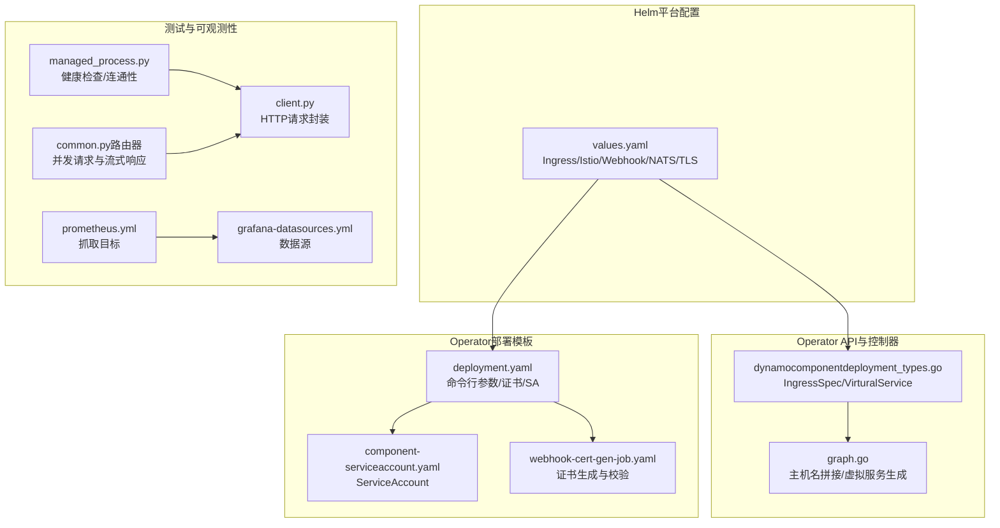
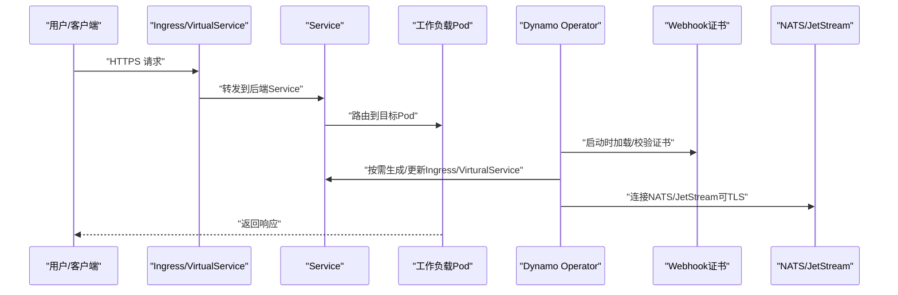
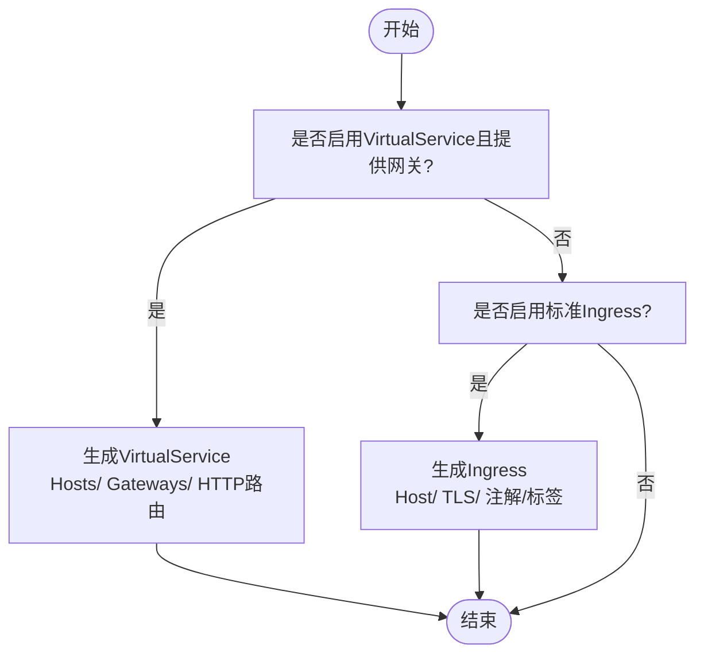
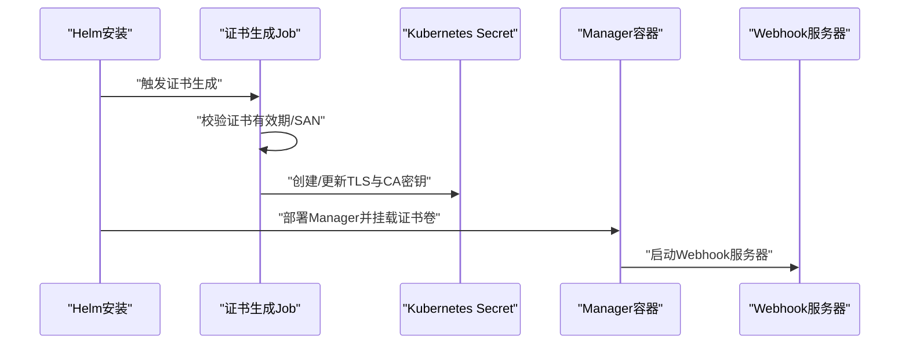
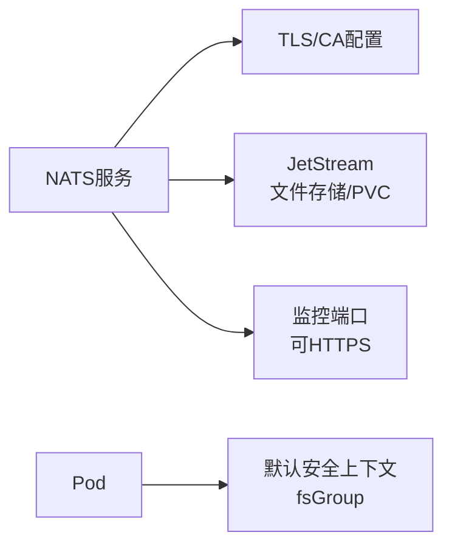
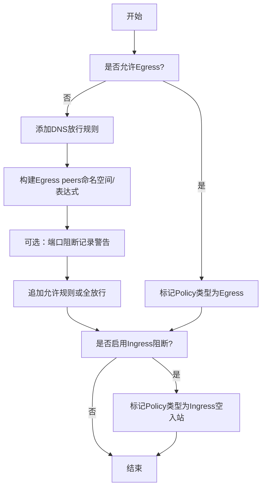
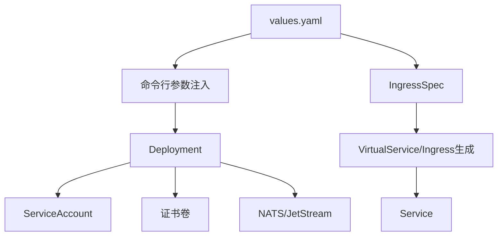
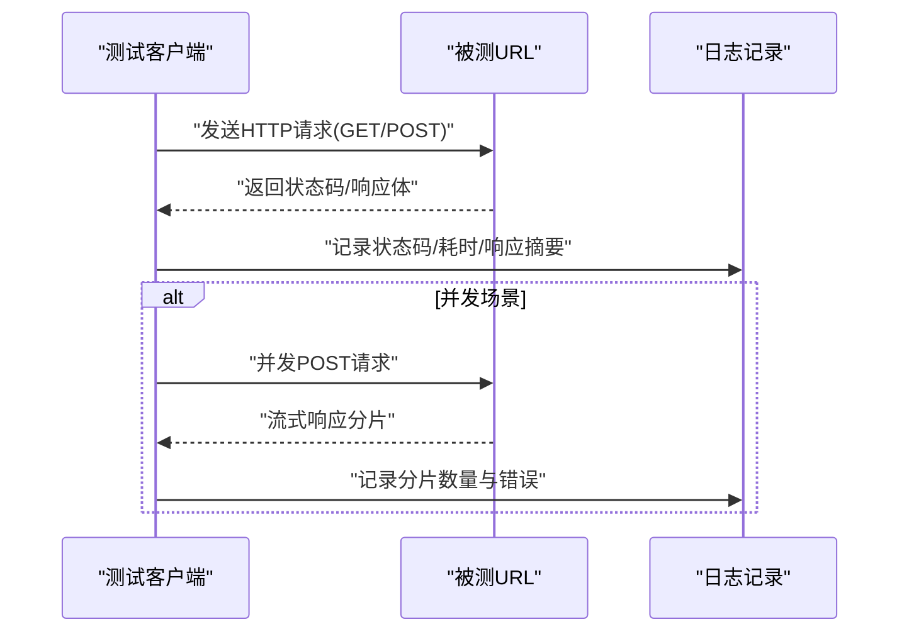

# 网络策略

<cite>
**本文引用的文件**
- [values.yaml](file://deploy/helm/charts/platform/values.yaml)
- [dynamocomponentdeployment_types.go](file://deploy/operator/api/v1alpha1/dynamocomponentdeployment_types.go)
- [graph.go](file://deploy/operator/internal/dynamo/graph.go)
- [deployment.yaml](file://deploy/helm/charts/platform/components/operator/templates/deployment.yaml)
- [component-serviceaccount.yaml](file://deploy/helm/charts/platform/components/operator/templates/component-serviceaccount.yaml)
- [webhook-cert-gen-job.yaml](file://deploy/helm/charts/platform/components/operator/templates/webhook-cert-gen-job.yaml)
- [main.go](file://deploy/operator/cmd/main.go)
- [main.py（故障注入）](file://tests/fault_tolerance/hardware/fault_injection_service/api_service/main.py)
- [managed_process.py](file://tests/utils/managed_process.py)
- [client.py](file://tests/utils/client.py)
- [common.py（路由器）](file://tests/router/common.py)
- [prometheus.yml](file://deploy/observability/prometheus.yml)
- [grafana-datasources.yml](file://deploy/observability/grafana-datasources.yml)
</cite>

## 目录
1. [简介](#简介)
2. [项目结构](#项目结构)
3. [核心组件](#核心组件)
4. [架构总览](#架构总览)
5. [详细组件分析](#详细组件分析)
6. [依赖关系分析](#依赖关系分析)
7. [性能考量](#性能考量)
8. [故障排查指南](#故障排查指南)
9. [结论](#结论)
10. [附录：多环境网络策略示例](#附录多环境网络策略示例)

## 简介
本文件系统化梳理Dynamo平台在Kubernetes上的网络策略与安全配置，覆盖以下主题：
- 平台图表中的网络安全配置：NetworkPolicy、Ingress与ServiceAccount的定义与作用
- 网络访问控制规则、流量路由策略与安全隔离机制
- 服务间通信的安全策略：TLS配置、认证授权与流量加密
- 不同网络环境下的配置示例：内网部署、云平台部署与混合云部署
- 网络监控与故障排查方法：连通性测试与性能优化建议

## 项目结构
围绕网络策略的关键位置如下：
- Helm平台配置：集中定义Ingress、Istio、Webhook TLS、NATS/TLS等网络与安全参数
- Operator API与控制器：定义IngressSpec/VirturalService生成逻辑与主机名拼接规则
- Operator部署模板：命令行参数注入、证书挂载、ServiceAccount绑定
- 测试工具：连通性探测、请求发送与重试、日志记录
- 可观测性：Prometheus抓取目标与Grafana数据源

**图示来源**
- [values.yaml](file://deploy/helm/charts/platform/values.yaml#L115-L136)
- [dynamocomponentdeployment_types.go](file://deploy/operator/api/v1alpha1/dynamocomponentdeployment_types.go#L149-L170)
- [graph.go](file://deploy/operator/internal/dynamo/graph.go#L656-L705)
- [deployment.yaml](file://deploy/helm/charts/platform/components/operator/templates/deployment.yaml#L104-L117)
- [component-serviceaccount.yaml](file://deploy/helm/charts/platform/components/operator/templates/component-serviceaccount.yaml#L16-L31)
- [webhook-cert-gen-job.yaml](file://deploy/helm/charts/platform/components/operator/templates/webhook-cert-gen-job.yaml#L160-L296)
- [managed_process.py](file://tests/utils/managed_process.py#L414-L438)
- [client.py](file://tests/utils/client.py#L78-L117)
- [common.py（路由器）](file://tests/router/common.py#L433-L467)
- [prometheus.yml](file://deploy/observability/prometheus.yml#L20-L50)
- [grafana-datasources.yml](file://deploy/observability/grafana-datasources.yml#L18-L24)

**章节来源**
- [values.yaml](file://deploy/helm/charts/platform/values.yaml#L115-L136)
- [dynamocomponentdeployment_types.go](file://deploy/operator/api/v1alpha1/dynamocomponentdeployment_types.go#L149-L170)
- [graph.go](file://deploy/operator/internal/dynamo/graph.go#L656-L705)
- [deployment.yaml](file://deploy/helm/charts/platform/components/operator/templates/deployment.yaml#L104-L117)
- [component-serviceaccount.yaml](file://deploy/helm/charts/platform/components/operator/templates/component-serviceaccount.yaml#L16-L31)
- [webhook-cert-gen-job.yaml](file://deploy/helm/charts/platform/components/operator/templates/webhook-cert-gen-job.yaml#L160-L296)
- [managed_process.py](file://tests/utils/managed_process.py#L414-L438)
- [client.py](file://tests/utils/client.py#L78-L117)
- [common.py（路由器）](file://tests/router/common.py#L433-L467)
- [prometheus.yml](file://deploy/observability/prometheus.yml#L20-L50)
- [grafana-datasources.yml](file://deploy/observability/grafana-datasources.yml#L18-L24)

## 核心组件
- Ingress与VirtualService
  - IngressSpec定义是否启用外部入口、主机名、注解/标签、TLS密钥与控制器类名
  - 当启用Istio时，通过VirtualService进行路由，支持网关绑定与HTTPS能力开关
- NATS与JetStream
  - 支持TLS与CA配置；可启用JetStream文件存储与PVC；监控端口可HTTPS
- Webhook TLS
  - 自动证书生成与校验流程，支持SAN校验与CA注入
- ServiceAccount
  - 为组件与Operator管理器提供最小权限的运行身份
- NetworkPolicy（测试用）
  - 在测试场景中动态构建Egress/Ingress规则，实现DNS放行、命名空间白名单与端口阻断提示

**章节来源**
- [dynamocomponentdeployment_types.go](file://deploy/operator/api/v1alpha1/dynamocomponentdeployment_types.go#L149-L170)
- [graph.go](file://deploy/operator/internal/dynamo/graph.go#L656-L705)
- [values.yaml](file://deploy/helm/charts/platform/values.yaml#L124-L136)
- [values.yaml](file://deploy/helm/charts/platform/values.yaml#L289-L490)
- [webhook-cert-gen-job.yaml](file://deploy/helm/charts/platform/components/operator/templates/webhook-cert-gen-job.yaml#L160-L296)
- [component-serviceaccount.yaml](file://deploy/helm/charts/platform/components/operator/templates/component-serviceaccount.yaml#L16-L31)
- [main.py（故障注入）](file://tests/fault_tolerance/hardware/fault_injection_service/api_service/main.py#L685-L744)

## 架构总览
下图展示Dynamo平台网络策略在集群内的交互路径：Ingress/VirtualService作为入口，Service暴露后端服务，Operator根据配置生成资源并注入TLS与证书，NATS/JetStream提供内部消息通道，Webhook负责准入控制与证书生命周期。

**图示来源**
- [deployment.yaml](file://deploy/helm/charts/platform/components/operator/templates/deployment.yaml#L104-L117)
- [webhook-cert-gen-job.yaml](file://deploy/helm/charts/platform/components/operator/templates/webhook-cert-gen-job.yaml#L160-L296)
- [values.yaml](file://deploy/helm/charts/platform/values.yaml#L124-L136)
- [values.yaml](file://deploy/helm/charts/platform/values.yaml#L289-L490)

## 详细组件分析

### 组件A：入口与路由（Ingress/VirtualService）
- 配置要点
  - 启用/禁用入口、主机名前缀/后缀、注解/标签、TLS密钥名称、控制器类名
  - 当启用Istio时，VirtualService绑定指定网关，支持HTTPS能力开关
- 主机名拼接
  - 基于Host、HostPrefix、HostSuffix与默认后缀组合生成最终域名
- 生成逻辑
  - 当启用VirtualService且提供网关时，生成对应路由规则，匹配前缀“/”，指向组件Service端口

**图示来源**
- [dynamocomponentdeployment_types.go](file://deploy/operator/api/v1alpha1/dynamocomponentdeployment_types.go#L149-L170)
- [graph.go](file://deploy/operator/internal/dynamo/graph.go#L656-L705)

**章节来源**
- [dynamocomponentdeployment_types.go](file://deploy/operator/api/v1alpha1/dynamocomponentdeployment_types.go#L149-L170)
- [graph.go](file://deploy/operator/internal/dynamo/graph.go#L656-L705)

### 组件B：Operator部署与TLS（Webhook）
- 命令行参数
  - 通过values.yaml注入Ingress控制器类名、TLS密钥名、主机后缀、Istio网关与HTTPS支持等参数
- 证书生成与校验
  - 检查现有证书有效期与SAN，必要时重新生成；支持CA注入与只读证书卷挂载
- 安全上下文
  - 禁止提权、丢弃所有能力、非root运行，增强容器安全基线

**图示来源**
- [deployment.yaml](file://deploy/helm/charts/platform/components/operator/templates/deployment.yaml#L104-L117)
- [webhook-cert-gen-job.yaml](file://deploy/helm/charts/platform/components/operator/templates/webhook-cert-gen-job.yaml#L160-L296)

**章节来源**
- [deployment.yaml](file://deploy/helm/charts/platform/components/operator/templates/deployment.yaml#L104-L117)
- [webhook-cert-gen-job.yaml](file://deploy/helm/charts/platform/components/operator/templates/webhook-cert-gen-job.yaml#L160-L296)

### 组件C：内部通信与安全上下文（NATS/JetStream）
- TLS与CA
  - 支持开启TLS与统一CA配置，用于mTLS与监控HTTPS
- JetStream
  - 文件存储与PVC，内存存储可选；可配置合并/补丁以扩展功能
- 运行安全
  - 默认安全上下文设置fsGroup，避免卷权限问题；不强制UID/GID以兼容镜像

**图示来源**
- [values.yaml](file://deploy/helm/charts/platform/values.yaml#L289-L490)
- [graph.go](file://deploy/operator/internal/dynamo/graph.go#L865-L882)

**章节来源**
- [values.yaml](file://deploy/helm/charts/platform/values.yaml#L289-L490)
- [graph.go](file://deploy/operator/internal/dynamo/graph.go#L865-L882)

### 组件D：网络访问控制（NetworkPolicy，测试用）
- 规则构建
  - 支持Egress/DNS放行、命名空间白名单、端口阻断提示（当前不直接支持端口反向过滤）
  - 支持Ingress全阻断（空列表即拒绝全部入站）
- 典型用途
  - 在故障注入测试中，按需创建/删除NetworkPolicy以隔离或放行特定流量

**图示来源**
- [main.py（故障注入）](file://tests/fault_tolerance/hardware/fault_injection_service/api_service/main.py#L685-L744)

**章节来源**
- [main.py（故障注入）](file://tests/fault_tolerance/hardware/fault_injection_service/api_service/main.py#L685-L744)

## 依赖关系分析
- 配置驱动
  - values.yaml中的入口、Istio、Webhook TLS与NATS参数驱动Operator行为
- 控制器生成
  - IngressSpec决定生成标准Ingress或VirtualService；主机名由拼接函数生成
- 资源绑定
  - Deployment挂载证书卷，使用ServiceAccount最小权限运行
- 内部通信
  - Operator通过NATS/JetStream与后端组件交互，支持TLS与监控

**图示来源**
- [values.yaml](file://deploy/helm/charts/platform/values.yaml#L115-L136)
- [deployment.yaml](file://deploy/helm/charts/platform/components/operator/templates/deployment.yaml#L104-L117)
- [dynamocomponentdeployment_types.go](file://deploy/operator/api/v1alpha1/dynamocomponentdeployment_types.go#L149-L170)
- [graph.go](file://deploy/operator/internal/dynamo/graph.go#L656-L705)

**章节来源**
- [values.yaml](file://deploy/helm/charts/platform/values.yaml#L115-L136)
- [deployment.yaml](file://deploy/helm/charts/platform/components/operator/templates/deployment.yaml#L104-L117)
- [dynamocomponentdeployment_types.go](file://deploy/operator/api/v1alpha1/dynamocomponentdeployment_types.go#L149-L170)
- [graph.go](file://deploy/operator/internal/dynamo/graph.go#L656-L705)

## 性能考量
- 抓取间隔与延迟
  - Prometheus抓取间隔可按组件需求调整，如NATS/DCGM/后端组件分别设置不同采样频率
- 服务发现与路由
  - VirtualService与Ingress控制器类名影响入口性能与特性支持（如HTTPS）
- 容器安全基线
  - 非root运行、丢弃能力、只读根文件系统降低运行时风险，同时避免不必要的性能损耗

**章节来源**
- [prometheus.yml](file://deploy/observability/prometheus.yml#L16-L50)
- [deployment.yaml](file://deploy/helm/charts/platform/components/operator/templates/deployment.yaml#L188-L191)

## 故障排查指南
- 连通性测试
  - 使用HTTP客户端封装发送GET/POST请求，记录状态码与耗时，便于定位入口/服务异常
  - 对并发场景使用异步请求与流式响应处理，确保吞吐与稳定性
- 健康检查
  - 通过定时轮询接口，成功时输出格式化响应，失败时记录错误与超时
- 日志与指标
  - Grafana数据源指向Prometheus，结合Dynamo仪表板观察关键指标
- 证书与准入
  - 若Webhook失败，检查证书有效期/SAN与CA注入情况；确认failurePolicy与超时设置

**图示来源**
- [client.py](file://tests/utils/client.py#L78-L117)
- [managed_process.py](file://tests/utils/managed_process.py#L414-L438)
- [common.py（路由器）](file://tests/router/common.py#L433-L467)

**章节来源**
- [client.py](file://tests/utils/client.py#L78-L117)
- [managed_process.py](file://tests/utils/managed_process.py#L414-L438)
- [common.py（路由器）](file://tests/router/common.py#L433-L467)
- [grafana-datasources.yml](file://deploy/observability/grafana-datasources.yml#L18-L24)

## 结论
Dynamo平台通过Helm配置与Operator控制器实现了对入口路由、内部通信与安全凭证的统一治理。Ingress/VirtualService提供灵活的外部访问与服务网格集成，Webhook证书自动化保障了准入控制的可靠性，NATS/JetStream在安全上下文中提供高可用的消息通道。配合测试工具与可观测性方案，可在多环境下快速验证与优化网络策略。

## 附录：多环境网络策略示例
- 内网部署
  - 禁用公网Ingress，使用标准Ingress并设置专用控制器类名；TLS密钥由内部CA签发；NATS关闭外部端口暴露，仅保留监控端口
- 云平台部署
  - 启用Istio VirtualService并绑定云厂商网关；开启Webhook TLS并使用cert-manager自动续期；JetStream启用PVC持久化
- 混合云部署
  - 通过NetworkPolicy限制跨云出口（DNS放行、命名空间白名单），对敏感端口进行阻断提示；在Operator参数中启用Istio网关与HTTPS支持

**章节来源**
- [values.yaml](file://deploy/helm/charts/platform/values.yaml#L115-L136)
- [values.yaml](file://deploy/helm/charts/platform/values.yaml#L124-L136)
- [values.yaml](file://deploy/helm/charts/platform/values.yaml#L289-L490)
- [main.py（故障注入）](file://tests/fault_tolerance/hardware/fault_injection_service/api_service/main.py#L685-L744)
- [deployment.yaml](file://deploy/helm/charts/platform/components/operator/templates/deployment.yaml#L104-L117)