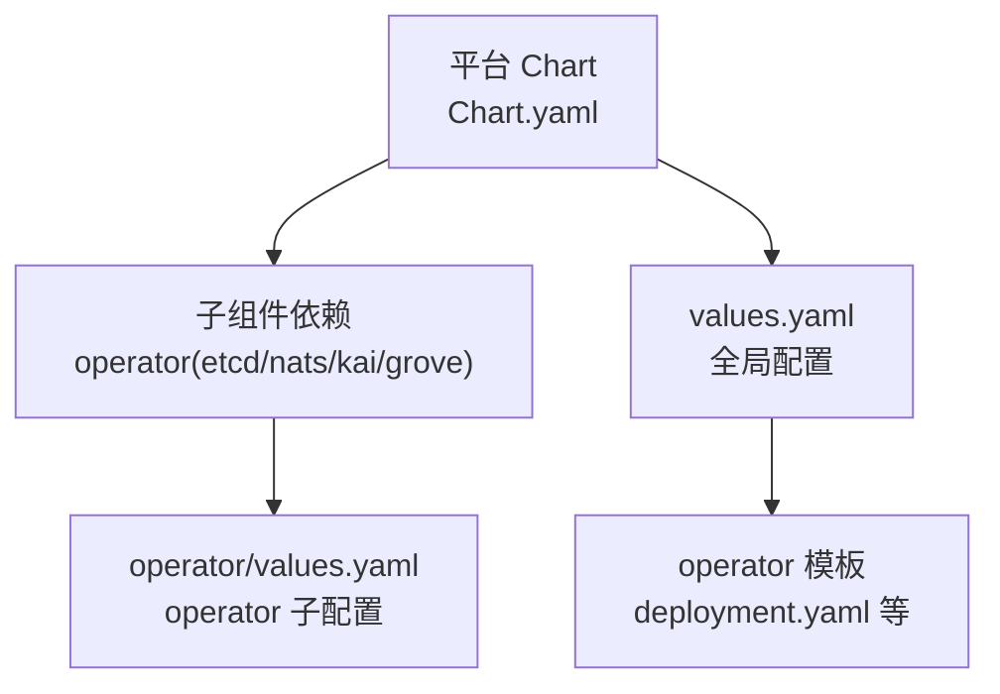
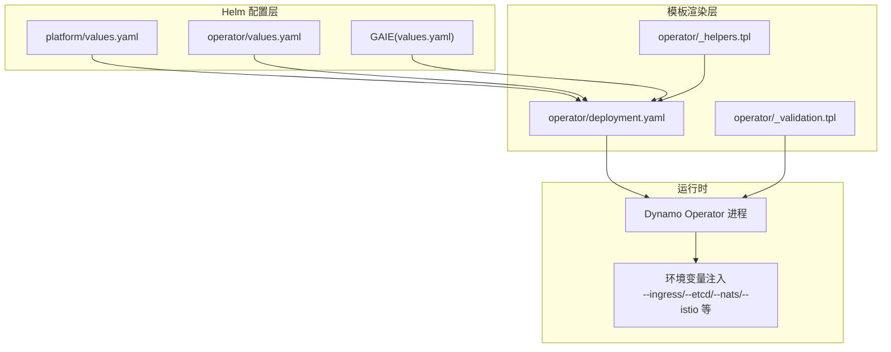
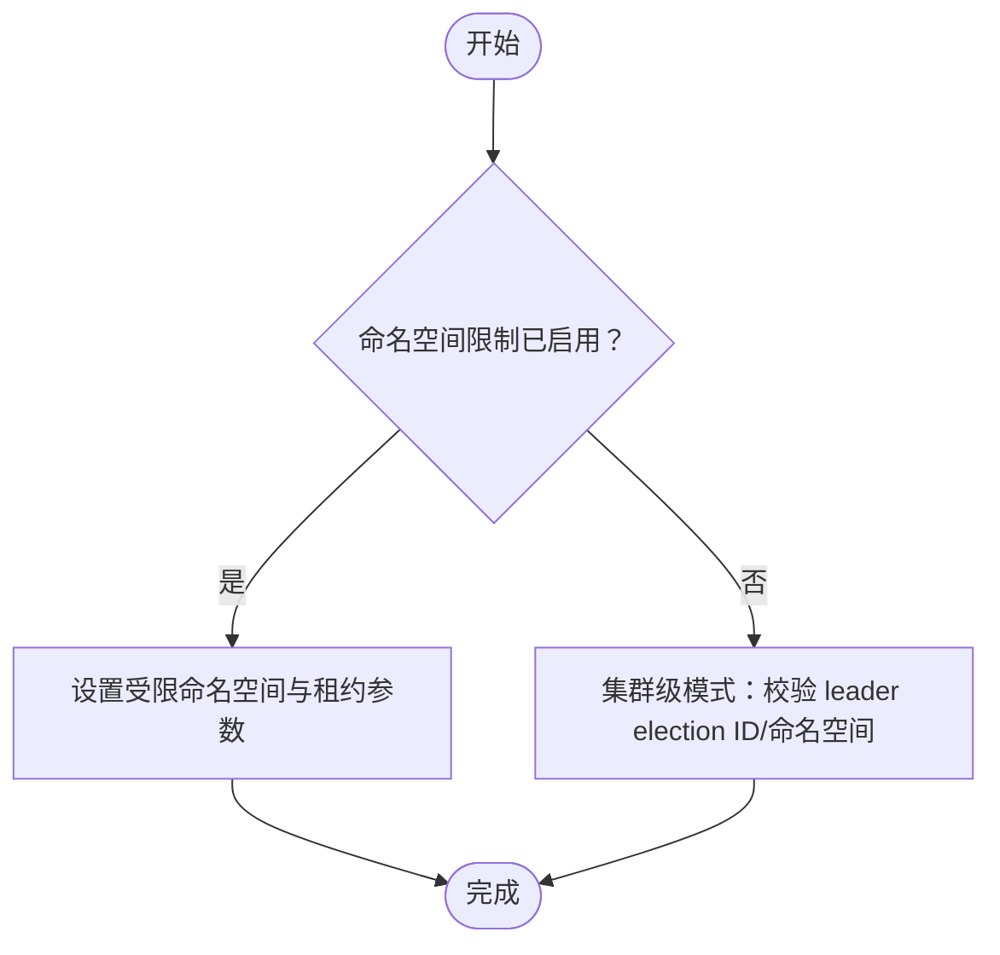
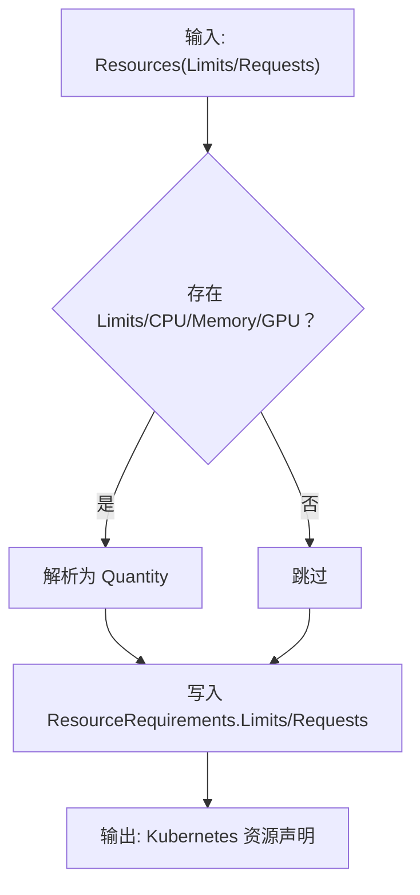
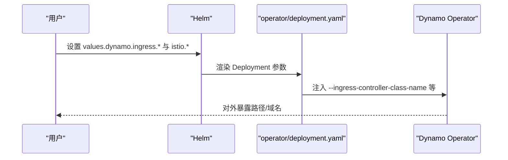
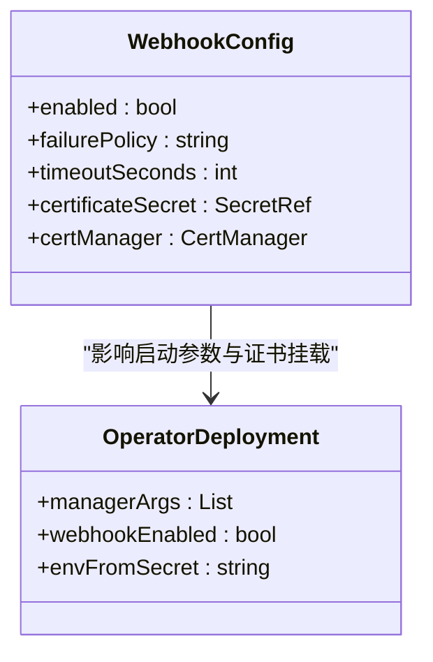
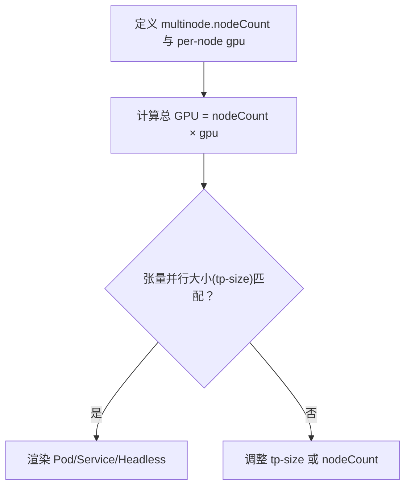
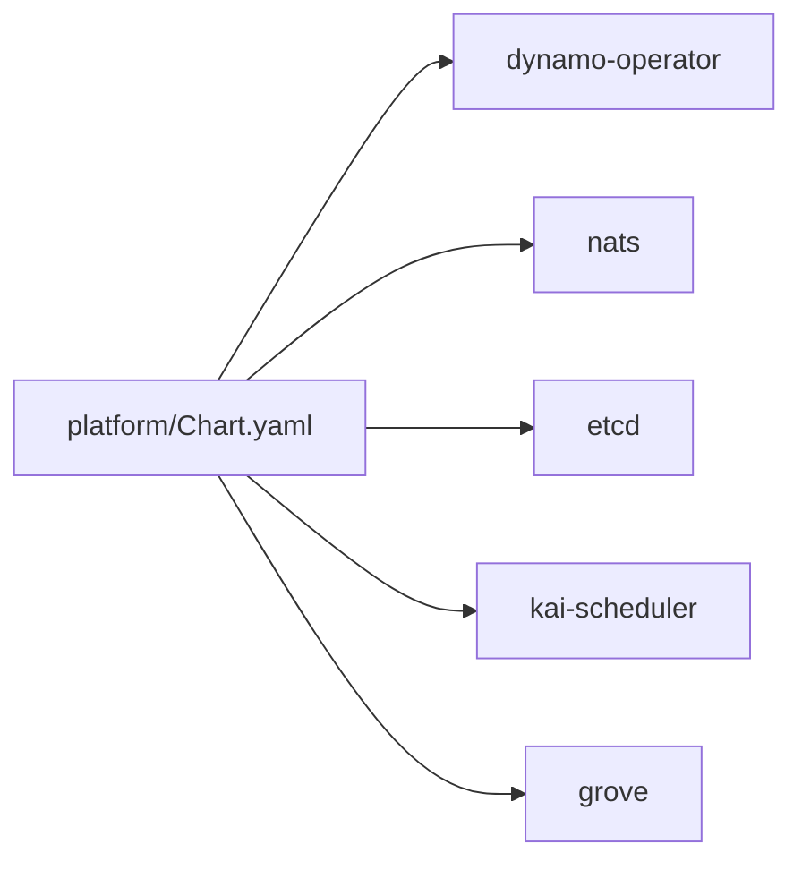
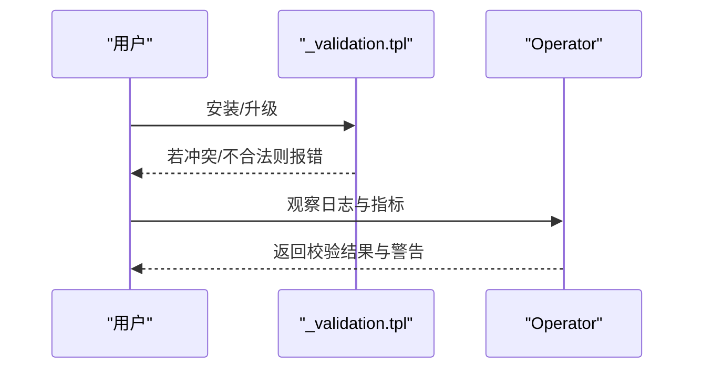

# 配置管理

<cite>
**本文引用的文件**   
- [deploy/README.md](file://deploy/README.md)
- [charts/platform/Chart.yaml](file://deploy/helm/charts/platform/Chart.yaml)
- [charts/platform/values.yaml](file://deploy/helm/charts/platform/values.yaml)
- [components/operator/values.yaml](file://deploy/helm/charts/platform/components/operator/values.yaml)
- [components/operator/templates/deployment.yaml](file://deploy/helm/charts/platform/components/operator/templates/deployment.yaml)
- [components/operator/templates/_validation.tpl](file://deploy/helm/charts/platform/components/operator/templates/_validation.tpl)
- [components/operator/templates/_helpers.tpl](file://deploy/helm/charts/platform/components/operator/templates/_helpers.tpl)
- [inference-gateway/standalone/helm/dynamo-gaie/values.yaml](file://deploy/inference-gateway/standalone/helm/dynamo-gaie/values.yaml)
- [operator/api/v1alpha1/common.go](file://deploy/operator/api/v1alpha1/common.go)
- [operator/internal/controller_common/resource.go](file://deploy/operator/internal/controller_common/resource.go)
- [operator/internal/webhook/validation/shared_test.go](file://deploy/operator/internal/webhook/validation/shared_test.go)
- [kubernetes/deployment/multinode-deployment.md](file://docs/kubernetes/deployment/multinode-deployment.md)
</cite>

## 目录
1. [简介](#简介)
2. [项目结构](#项目结构)
3. [核心组件](#核心组件)
4. [架构总览](#架构总览)
5. [详细组件分析](#详细组件分析)
6. [依赖关系分析](#依赖关系分析)
7. [性能考虑](#性能考虑)
8. [故障排查指南](#故障排查指南)
9. [结论](#结论)
10. [附录](#附录)

## 简介
本文件面向使用 Helm 图表部署 Dynamo 平台的用户与工程师，系统化梳理 values.yaml 的结构与配置项，解释全局参数、组件特定配置与环境变量注入方式；并结合控制器实现，给出资源配置（CPU、内存、GPU）、网络暴露（Service、Ingress、Istio VirtualService）、安全策略（Webhook、证书、RBAC）的最佳实践与优化建议。同时提供单节点、多节点与高可用部署场景的配置模板思路，并说明配置继承与覆盖机制、配置验证与调试方法。

## 项目结构
Dynamo Helm 图表由两个主要 Chart 组成：
- 平台 Chart：安装完整的 Dynamo 平台，包含 Operator、NATS、etcd、Grove、Kai Scheduler 等子组件。
- CRDs Chart：仅安装平台所需的 CRD 资源。

平台 Chart 的 values.yaml 提供全局开关与各子组件的默认配置；子 Chart（如 operator）各自维护独立的 values.yaml 以控制其模板渲染。

**图示来源**
- [charts/platform/Chart.yaml](file://deploy/helm/charts/platform/Chart.yaml#L24-L46)
- [charts/platform/values.yaml](file://deploy/helm/charts/platform/values.yaml#L1-L732)
- [components/operator/values.yaml](file://deploy/helm/charts/platform/components/operator/values.yaml#L1-L226)

**章节来源**
- [deploy/README.md](file://deploy/README.md#L18-L23)
- [charts/platform/Chart.yaml](file://deploy/helm/charts/platform/Chart.yaml#L15-L46)

## 核心组件
- Dynamo Operator：负责资源编排、发现后端选择、Webhook 校验、指标导出等。
- NATS：消息中间件，支持 JetStream、TLS、监控与 Profiling 端口。
- etcd：键值存储，用于 Operator 状态持久化，支持持久卷与 PDB。
- Grove/Kai Scheduler：分布式推理编排与智能调度（可选启用）。
- Ingress/Istio：外部访问入口与路由策略（可选）。
- Prometheus/Metrics：指标端点与 ServiceMonitor（可选）。

这些组件的启用、镜像、资源、探针、存储、网络等均通过 values.yaml 进行集中配置。

**章节来源**
- [charts/platform/values.yaml](file://deploy/helm/charts/platform/values.yaml#L19-L288)
- [components/operator/values.yaml](file://deploy/helm/charts/platform/components/operator/values.yaml#L19-L226)

## 架构总览
下图展示平台 Chart 如何通过 values.yaml 将配置传递到各子组件模板，以及控制器如何解析这些配置并注入到运行时环境变量中。

**图示来源**
- [charts/platform/values.yaml](file://deploy/helm/charts/platform/values.yaml#L1-L732)
- [components/operator/values.yaml](file://deploy/helm/charts/platform/components/operator/values.yaml#L1-L226)
- [inference-gateway/standalone/helm/dynamo-gaie/values.yaml](file://deploy/inference-gateway/standalone/helm/dynamo-gaie/values.yaml#L1-L84)
- [components/operator/templates/deployment.yaml](file://deploy/helm/charts/platform/components/operator/templates/deployment.yaml#L78-L148)
- [components/operator/templates/_validation.tpl](file://deploy/helm/charts/platform/components/operator/templates/_validation.tpl#L25-L92)

## 详细组件分析

### 全局参数与命名空间限制
- 命名空间限制：支持“集群级”或“命名空间受限”两种模式。当启用命名空间限制时，Operator 仅在指定命名空间内工作，并通过租约机制避免与集群级 Operator 冲突。
- 领导者选举：集群级模式需统一的 leader election ID 与命名空间，否则可能导致“脑裂”。
- 发现后端：支持 kubernetes 或 etcd，必须二选一。

**图示来源**
- [components/operator/templates/_validation.tpl](file://deploy/helm/charts/platform/components/operator/templates/_validation.tpl#L25-L92)
- [components/operator/templates/_validation.tpl](file://deploy/helm/charts/platform/components/operator/templates/_validation.tpl#L109-L115)

**章节来源**
- [components/operator/templates/_validation.tpl](file://deploy/helm/charts/platform/components/operator/templates/_validation.tpl#L16-L115)
- [components/operator/templates/deployment.yaml](file://deploy/helm/charts/platform/components/operator/templates/deployment.yaml#L84-L144)

### 资源配置（CPU/内存/GPU/自定义）
- 资源模型：支持 Requests/Limits，字段包含 CPU、内存、GPU 数量与类型、自定义资源。
- GPU 类型：默认使用 nvidia.com/gpu，也可指定自定义 GPU 资源名称。
- 控制器解析：将字符串形式的资源值解析为 Kubernetes ResourceList，确保格式正确。

**图示来源**
- [operator/api/v1alpha1/common.go](file://deploy/operator/api/v1alpha1/common.go#L77-L101)
- [operator/internal/controller_common/resource.go](file://deploy/operator/internal/controller_common/resource.go#L489-L538)

**章节来源**
- [operator/api/v1alpha1/common.go](file://deploy/operator/api/v1alpha1/common.go#L72-L101)
- [operator/internal/controller_common/resource.go](file://deploy/operator/internal/controller_common/resource.go#L489-L538)

### 网络配置（Service/Ingress/Istio）
- Ingress：可按需启用，支持指定类名与 TLS 密钥名称。
- Istio：可启用 VirtualService 支持 HTTPS 路由。
- 外部访问：Operator 启动参数会根据 values 注入 Ingress 控制器类名、TLS 密钥名、主机后缀、HTTPS 支持等。

**图示来源**
- [charts/platform/values.yaml](file://deploy/helm/charts/platform/values.yaml#L115-L136)
- [components/operator/templates/deployment.yaml](file://deploy/helm/charts/platform/components/operator/templates/deployment.yaml#L104-L126)

**章节来源**
- [charts/platform/values.yaml](file://deploy/helm/charts/platform/values.yaml#L115-L136)
- [components/operator/templates/deployment.yaml](file://deploy/helm/charts/platform/components/operator/templates/deployment.yaml#L104-L126)

### 安全与证书（Webhook/TLS/RBAC）
- Webhook：可启用准入控制与校验失败策略；支持自动证书生成或外部证书管理（含 cert-manager）。
- TLS：NATS 可配置 TLS 与监控 HTTPS；Operator 支持 webhook 证书挂载。
- RBAC：kube-rbac-proxy 与 Manager 的安全上下文限制权限。

**图示来源**
- [charts/platform/values.yaml](file://deploy/helm/charts/platform/values.yaml#L151-L212)
- [components/operator/templates/deployment.yaml](file://deploy/helm/charts/platform/components/operator/templates/deployment.yaml#L146-L198)

**章节来源**
- [charts/platform/values.yaml](file://deploy/helm/charts/platform/values.yaml#L151-L212)
- [components/operator/templates/deployment.yaml](file://deploy/helm/charts/platform/components/operator/templates/deployment.yaml#L60-L199)

### 多节点与高可用部署
- 多节点：通过 DynamoGraphDeployment 的 multinode.nodeCount 与每节点 GPU 数，计算总 GPU 数，确保张量并行大小对齐。
- 高可用：etcd 建议 3+ 副本并启用 PDB；NATS JetStream 可用 PVC 存储；Operator 可启用 leader election 与 kube-rbac-proxy。

**图示来源**
- [docs/kubernetes/deployment/multinode-deployment.md](file://docs/kubernetes/deployment/multinode-deployment.md#L117-L178)

**章节来源**
- [docs/kubernetes/deployment/multinode-deployment.md](file://docs/kubernetes/deployment/multinode-deployment.md#L117-L178)
- [charts/platform/values.yaml](file://deploy/helm/charts/platform/values.yaml#L258-L282)

### 镜像与私有仓库
- 镜像仓库：支持镜像拉取密钥、Docker Registry 配置、是否使用 Kubernetes Secret。
- Operator 默认镜像仓库与版本可通过 values 覆盖。

**章节来源**
- [charts/platform/values.yaml](file://deploy/helm/charts/platform/values.yaml#L100-L114)
- [components/operator/values.yaml](file://deploy/helm/charts/platform/components/operator/values.yaml#L83-L94)

### 指标与可观测性
- Prometheus 端点：可通过 values.dynamo.metrics.prometheusEndpoint 注入到受管服务。
- Metrics Service：可启用 ClusterIP 暴露 HTTPS 端口。
- Operator 指标：Manager 使用本地 8080 端口，kube-rbac-proxy 暴露 8443。

**章节来源**
- [charts/platform/values.yaml](file://deploy/helm/charts/platform/values.yaml#L137-L141)
- [components/operator/values.yaml](file://deploy/helm/charts/platform/components/operator/values.yaml#L131-L139)
- [components/operator/templates/deployment.yaml](file://deploy/helm/charts/platform/components/operator/templates/deployment.yaml#L60-L78)

### Inference Gateway（GAIE）集成
- GAIE Chart 提供与 Dynamo 的集成配置，包括目标 DGD 名称、模型标识、HTTPRoute、EPP 图像与参数覆盖、KV 块大小、ETCD 发现开关等。
- 通过 platformReleaseName 与 platformNamespace 关联平台 Release。

**章节来源**
- [inference-gateway/standalone/helm/dynamo-gaie/values.yaml](file://deploy/inference-gateway/standalone/helm/dynamo-gaie/values.yaml#L1-L84)

## 依赖关系分析
平台 Chart 通过 dependencies 字段声明子组件及其启用条件，values 中的 enabled 字段决定是否渲染对应子资源。

**图示来源**
- [charts/platform/Chart.yaml](file://deploy/helm/charts/platform/Chart.yaml#L24-L46)

**章节来源**
- [charts/platform/Chart.yaml](file://deploy/helm/charts/platform/Chart.yaml#L24-L46)

## 性能考虑
- 资源配额：为 Operator 与关键组件设置合理的 requests/limits，避免抢占与 OOM。
- 存储：etcd 与 NATS JetStream PVC 建议使用高性能存储类，容量按数据量与峰值写入评估。
- 网络：Ingress/Istio 层面开启连接/请求超时与重试策略，减少上游抖动。
- GPU 分配：多节点部署严格对齐 tp-size 与总 GPU 数，避免资源浪费或调度失败。
- 探针：健康/就绪探针间隔与超时应平衡收敛速度与误杀风险。

## 故障排查指南
- 配置冲突校验：集群级与命名空间受限 Operator 不能同时部署同一集群；若自定义 leader election ID，需保持一致。
- 发现后端校验：discoveryBackend 必须为 kubernetes 或 etcd。
- Webhook 失败策略：生产建议 Fail，避免不可信请求进入。
- 日志与告警：检查 Operator Pod 日志、Metrics Service 端口、Ingress/Route 状态。
- 验证测试：Webhook 校验包含关键字“invalid/namespace/validation/failed”的错误信息可作为验证依据。

**图示来源**
- [components/operator/templates/_validation.tpl](file://deploy/helm/charts/platform/components/operator/templates/_validation.tpl#L25-L115)
- [operator/internal/webhook/validation/shared_test.go](file://deploy/operator/internal/webhook/validation/shared_test.go#L285-L328)

**章节来源**
- [components/operator/templates/_validation.tpl](file://deploy/helm/charts/platform/components/operator/templates/_validation.tpl#L25-L115)
- [operator/internal/webhook/validation/shared_test.go](file://deploy/operator/internal/webhook/validation/shared_test.go#L285-L328)

## 结论
通过将平台配置集中在 values.yaml，并结合模板渲染与控制器参数注入，Dynamo Helm 图表实现了对资源、网络、安全与可观测性的统一管理。遵循本文的配置继承与覆盖规则、验证流程与最佳实践，可在单节点、多节点与高可用场景下稳定部署并高效运维。

## 附录

### 配置模板（场景化建议）
- 单节点开发/测试
  - 关闭 etcd 集群与 PDB，禁用 Grove/Kai。
  - NATS JetStream 使用内存存储或小容量 PVC。
  - Ingress 关闭，使用 port-forward 访问。
- 多节点推理
  - 明确 multinode.nodeCount 与 per-node gpu，确保 tp-size 对齐。
  - 为每个服务单独设置 Resources.Requests/Limits，GPU 类型按设备厂商定制。
- 高可用生产
  - etcd 副本 ≥3，启用 PDB；NATS JetStream PVC；Operator 启用 leader election。
  - 开启 Webhook Fail 策略与 TLS；Istio/VirtualService 支持 HTTPS。

### 配置继承与覆盖机制
- values.yaml 的字段优先级：子 Chart 的 values.yaml 会覆盖父 Chart 的默认值；用户自定义 values.yaml 可进一步覆盖子 Chart 默认值。
- 模板中的条件渲染：通过 values 中的 enabled 字段与 condition 判断，决定是否生成对应资源。
- 环境变量注入：operator/deployment.yaml 将 values 中的关键参数转换为命令行参数注入到 Manager 进程。

**章节来源**
- [charts/platform/Chart.yaml](file://deploy/helm/charts/platform/Chart.yaml#L24-L46)
- [components/operator/templates/deployment.yaml](file://deploy/helm/charts/platform/components/operator/templates/deployment.yaml#L78-L148)