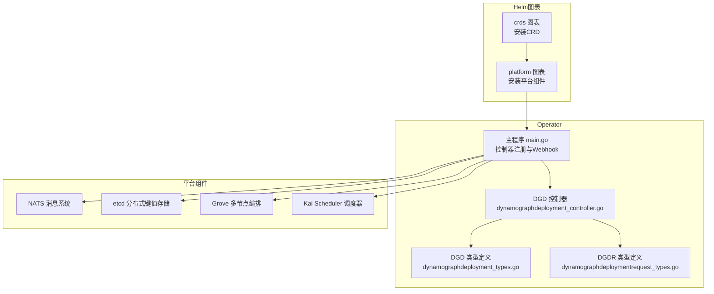
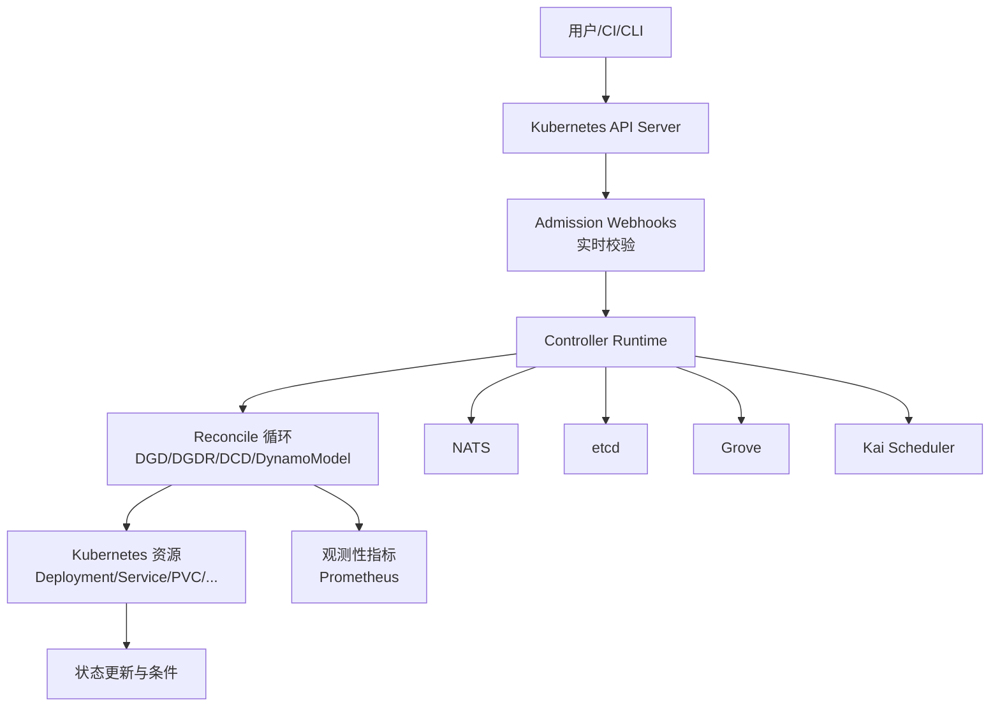
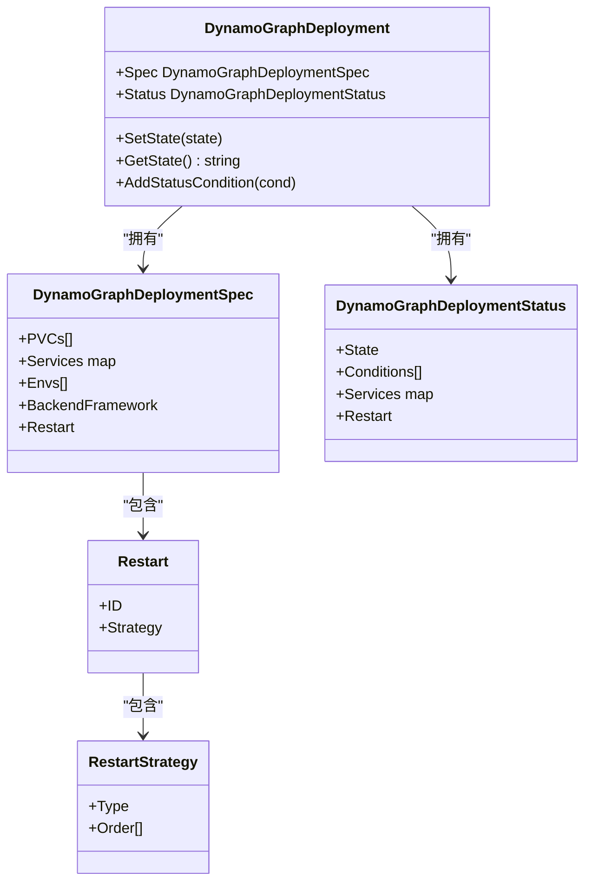
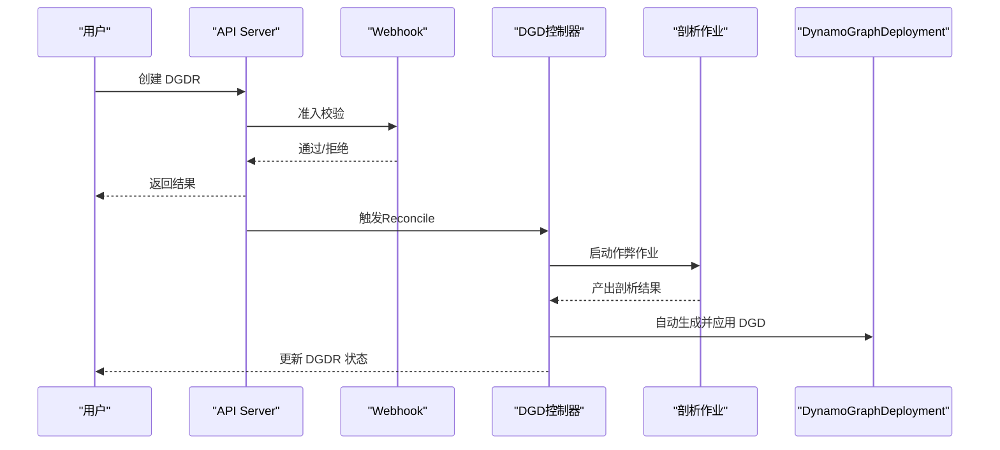
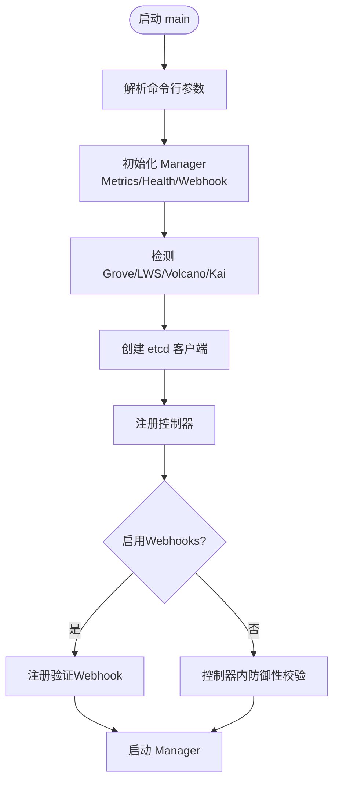
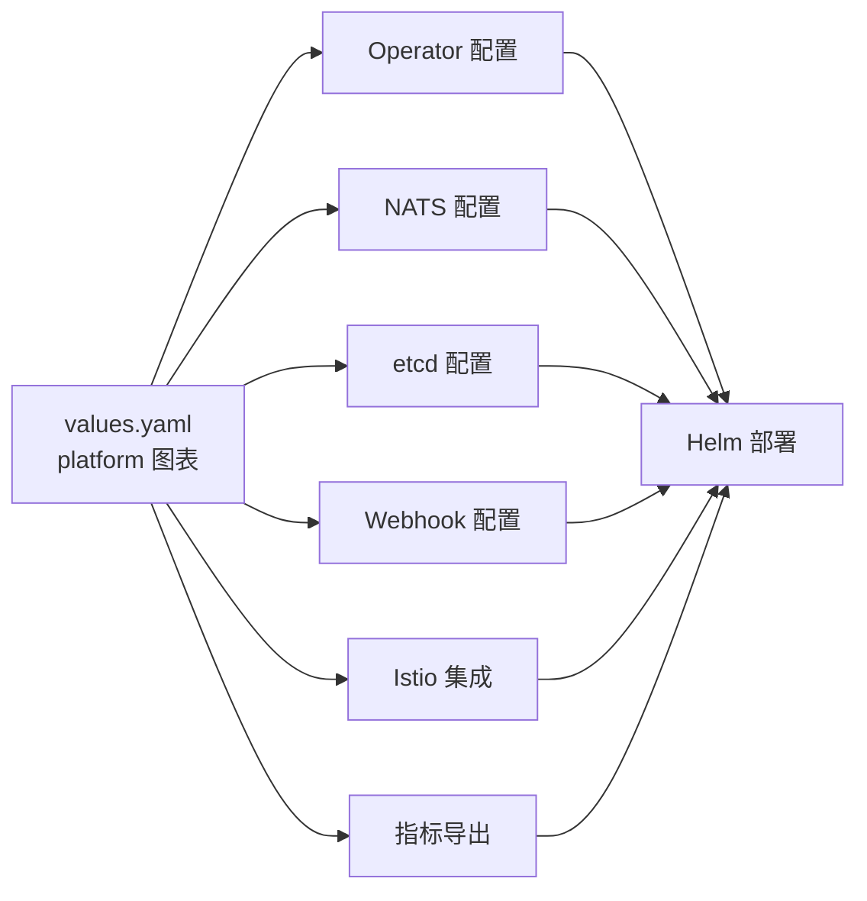
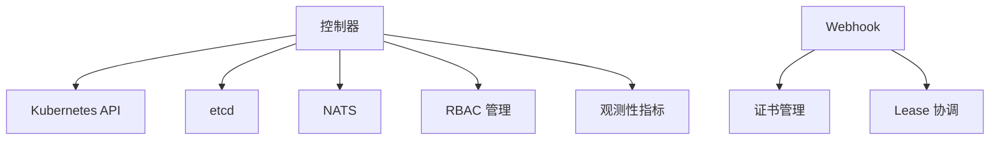

# Kubernetes集成

<cite>
**本文引用的文件**
- [deploy/operator/README.md](file://deploy/operator/README.md)
- [deploy/helm/README.md](file://deploy/helm/README.md)
- [deploy/operator/api/v1alpha1/dynamographdeployment_types.go](file://deploy/operator/api/v1alpha1/dynamographdeployment_types.go)
- [deploy/operator/api/v1alpha1/dynamographdeploymentrequest_types.go](file://deploy/operator/api/v1alpha1/dynamographdeploymentrequest_types.go)
- [deploy/operator/cmd/main.go](file://deploy/operator/cmd/main.go)
- [deploy/operator/internal/controller/dynamographdeployment_controller.go](file://deploy/operator/internal/controller/dynamographdeployment_controller.go)
- [deploy/helm/charts/platform/values.yaml](file://deploy/helm/charts/platform/values.yaml)
- [docs/kubernetes/dynamo_operator.md](file://docs/kubernetes/dynamo_operator.md)
- [docs/kubernetes/installation_guide.md](file://docs/kubernetes/installation_guide.md)
- [docs/kubernetes/autoscaling.md](file://docs/kubernetes/autoscaling.md)
- [docs/kubernetes/service_discovery.md](file://docs/kubernetes/service_discovery.md)
- [docs/kubernetes/webhooks.md](file://docs/kubernetes/webhooks.md)
- [docs/kubernetes/observability/operator-metrics.md](file://docs/kubernetes/observability/operator-metrics.md)
- [docs/kubernetes/observability/logging.md](file://docs/kubernetes/observability/logging.md)
- [docs/observability/prometheus-grafana.md](file://docs/observability/prometheus-grafana.md)
- [deploy/observability/grafana-datasources.yml](file://deploy/observability/grafana-datasources.yml)
- [deploy/observability/prometheus.yml](file://deploy/observability/prometheus.yml)
- [examples/deployments/EKS/Deploy_Dynamo_Kubernetes_Platform.md](file://examples/deployments/EKS/Deploy_Dynamo_Kubernetes_Platform.md)
- [examples/deployments/AKS/AKS-deployment.md](file://examples/deployments/AKS/AKS-deployment.md)
- [examples/deployments/GKE/README.md](file://examples/deployments/GKE/README.md)
</cite>

## 目录
1. [简介](#简介)
2. [项目结构](#项目结构)
3. [核心组件](#核心组件)
4. [架构总览](#架构总览)
5. [详细组件分析](#详细组件分析)
6. [依赖关系分析](#依赖关系分析)
7. [性能考虑](#性能考虑)
8. [故障排查指南](#故障排查指南)
9. [结论](#结论)
10. [附录](#附录)

## 简介
本文件面向在Kubernetes上使用Dynamo进行大规模推理服务与模型管理的工程团队，系统性阐述Dynamo Kubernetes集成方案：包括Dynamo操作器（Operator）的设计与实现（CRD定义、控制器逻辑、Webhook验证）、Helm图表结构与配置项、平台部署与命名空间隔离、自动扩缩容与滚动更新、故障恢复策略、多云部署示例（AWS EKS、Google GKE、Microsoft AKS）、以及监控与日志最佳实践（Prometheus集成与Grafana仪表板）。内容兼顾技术深度与可操作性，帮助读者从零完成生产级部署与运维。

## 项目结构
Dynamo的Kubernetes集成由三部分组成：
- 操作器（Operator）：基于Kubebuilder构建，负责Dynamo自定义资源的全生命周期管理。
- Helm图表：提供平台化安装（包含Operator、NATS、etcd、Grove、Kai Scheduler等）与CRD安装。
- 文档与示例：覆盖安装指南、部署模式、观测性、多云部署与运维实践。

**图示来源**
- [deploy/helm/README.md](file://deploy/helm/README.md#L18-L23)
- [deploy/operator/cmd/main.go](file://deploy/operator/cmd/main.go#L560-L621)
- [deploy/operator/api/v1alpha1/dynamographdeployment_types.go](file://deploy/operator/api/v1alpha1/dynamographdeployment_types.go#L47-L69)
- [deploy/operator/api/v1alpha1/dynamographdeploymentrequest_types.go](file://deploy/operator/api/v1alpha1/dynamographdeploymentrequest_types.go#L124-L176)

**章节来源**
- [deploy/helm/README.md](file://deploy/helm/README.md#L18-L23)
- [deploy/operator/README.md](file://deploy/operator/README.md#L1-L37)

## 核心组件
- 自定义资源定义（CRD）
  - DynamoGraphDeployment（DGD）：完整推理图的声明式部署，支持重启策略、环境变量、PVC挂载、服务状态汇总等。
  - DynamoGraphDeploymentRequest（DGDR）：面向SLA的简化部署入口，支持自动配置生成、剖析（profiling）与一键应用。
- 控制器
  - DGD控制器：根据DGD规范创建并维护底层Kubernetes资源（Deployment、Service等），更新状态与条件。
  - 其他控制器：DynamoComponentDeployment、DynamoModel等（详见控制器注册与类型定义）。
- Webhook验证
  - 基于准入控制的实时校验，支持证书管理与多操作器协调。
- Helm图表
  - platform：安装Operator及配套组件；crds：仅安装CRD。
  - 提供丰富的values.yaml配置项，覆盖命名空间限制、证书、etcd/NATS接入、Istio集成、指标导出等。

**章节来源**
- [deploy/operator/api/v1alpha1/dynamographdeployment_types.go](file://deploy/operator/api/v1alpha1/dynamographdeployment_types.go#L47-L69)
- [deploy/operator/api/v1alpha1/dynamographdeploymentrequest_types.go](file://deploy/operator/api/v1alpha1/dynamographdeploymentrequest_types.go#L124-L176)
- [deploy/operator/cmd/main.go](file://deploy/operator/cmd/main.go#L560-L621)
- [deploy/helm/charts/platform/values.yaml](file://deploy/helm/charts/platform/values.yaml#L19-L211)

## 架构总览
Dynamo Operator通过控制器循环与Webhook共同保障资源一致性与安全性。平台组件（NATS、etcd、Grove、Kai）为推理图提供消息、状态存储、多节点编排与智能调度能力。Helm图表统一打包这些组件并提供灵活的配置。

**图示来源**
- [deploy/operator/cmd/main.go](file://deploy/operator/cmd/main.go#L302-L344)
- [deploy/operator/cmd/main.go](file://deploy/operator/cmd/main.go#L560-L621)
- [docs/kubernetes/dynamo_operator.md](file://docs/kubernetes/dynamo_operator.md#L119-L133)

## 详细组件分析

### DynamoGraphDeployment（DGD）设计与实现
- 角色定位
  - 高层推理图部署抽象，封装服务集合、环境变量、重启策略、PVC挂载等。
- 关键字段
  - PVCs：持久卷声明列表，供组件引用。
  - Services：服务映射，共享规格可复用。
  - Envs：全局环境变量。
  - BackendFramework：后端框架选择（sglang/vllm/trtllm）。
  - Restart：重启策略（顺序/并行、重启ID触发）。
- 状态与条件
  - State、Conditions、Services（每服务副本状态）、RestartStatus。
- 生命周期
  - 通过控制器创建/更新底层资源，维护Ready条件与状态机。

**图示来源**
- [deploy/operator/api/v1alpha1/dynamographdeployment_types.go](file://deploy/operator/api/v1alpha1/dynamographdeployment_types.go#L47-L172)
- [deploy/operator/api/v1alpha1/dynamographdeployment_types.go](file://deploy/operator/api/v1alpha1/dynamographdeployment_types.go#L174-L274)

**章节来源**
- [deploy/operator/api/v1alpha1/dynamographdeployment_types.go](file://deploy/operator/api/v1alpha1/dynamographdeployment_types.go#L47-L172)
- [deploy/operator/api/v1alpha1/dynamographdeployment_types.go](file://deploy/operator/api/v1alpha1/dynamographdeployment_types.go#L174-L274)

### DynamoGraphDeploymentRequest（DGDR）设计与实现
- 角色定位
  - 面向SLA的简化入口，自动执行剖析（profiling）并生成DGD规范。
- 关键字段
  - Model、Backend、UseMocker、EnableGpuDiscovery。
  - ProfilingConfig：剖析配置（镜像、资源、容忍度、输出PVC等）。
  - AutoApply、DeploymentOverrides：自动应用与元数据覆盖。
- 生命周期状态
  - 初始→待剖析→剖析中→就绪/部署中→就绪/删除。
- 条件与结果
  - Conditions、ProfilingResults、GeneratedDeployment、Deployment状态镜像。

**图示来源**
- [deploy/operator/api/v1alpha1/dynamographdeploymentrequest_types.go](file://deploy/operator/api/v1alpha1/dynamographdeploymentrequest_types.go#L124-L237)
- [deploy/operator/cmd/main.go](file://deploy/operator/cmd/main.go#L603-L611)

**章节来源**
- [deploy/operator/api/v1alpha1/dynamographdeploymentrequest_types.go](file://deploy/operator/api/v1alpha1/dynamographdeploymentrequest_types.go#L124-L237)
- [docs/kubernetes/dynamo_operator.md](file://docs/kubernetes/dynamo_operator.md#L119-L133)

### 控制器逻辑与Webhook验证
- 控制器注册
  - 注册DynamoComponentDeployment、DynamoGraphDeployment、DynamoGraphDeploymentScalingAdapter、DynamoGraphDeploymentRequest、DynamoModel等控制器。
- Webhook配置
  - 支持启用/禁用，证书管理（自动/外部/证书管理器），失败策略与超时。
- 命名空间隔离
  - 支持集群级与命名空间受限模式，通过租约（Lease）协调多操作器场景。

**图示来源**
- [deploy/operator/cmd/main.go](file://deploy/operator/cmd/main.go#L129-L218)
- [deploy/operator/cmd/main.go](file://deploy/operator/cmd/main.go#L432-L452)
- [deploy/operator/cmd/main.go](file://deploy/operator/cmd/main.go#L623-L677)

**章节来源**
- [deploy/operator/cmd/main.go](file://deploy/operator/cmd/main.go#L560-L621)
- [deploy/helm/charts/platform/values.yaml](file://deploy/helm/charts/platform/values.yaml#L151-L212)

### Helm图表结构与配置
- platform 图表
  - 安装Dynamo Operator与平台组件（NATS、etcd、可选Grove/Kai）。
  - 关键配置：命名空间限制、证书、etcd/NATS地址、Istio集成、指标导出、MPI Run密钥等。
- crds 图表
  - 仅安装CRD，便于独立管理或在共享集群中按需安装。

**图示来源**
- [deploy/helm/charts/platform/values.yaml](file://deploy/helm/charts/platform/values.yaml#L19-L212)

**章节来源**
- [deploy/helm/README.md](file://deploy/helm/README.md#L18-L23)
- [deploy/helm/charts/platform/values.yaml](file://deploy/helm/charts/platform/values.yaml#L19-L212)

## 依赖关系分析
- 组件耦合
  - 控制器依赖Kubernetes客户端、etcd存储、Docker镜像拉取凭证索引、跨命名空间RBAC管理。
  - Webhook依赖证书基础设施与Lease协调（多操作器场景）。
- 外部依赖
  - NATS用于内部通信；etcd用于状态存储；Grove/Kai用于多节点编排与调度；Istio用于服务网格路由。
- 可能的循环依赖
  - 控制器与Webhook之间无直接循环；通过API Server与Manager解耦。

**图示来源**
- [deploy/operator/cmd/main.go](file://deploy/operator/cmd/main.go#L454-L551)
- [deploy/operator/cmd/main.go](file://deploy/operator/cmd/main.go#L632-L677)

**章节来源**
- [deploy/operator/cmd/main.go](file://deploy/operator/cmd/main.go#L454-L551)
- [deploy/operator/cmd/main.go](file://deploy/operator/cmd/main.go#L632-L677)

## 性能考虑
- 自动扩缩容
  - 通过DGD中的重启策略与服务副本状态实现有序扩缩容；结合多节点编排（Grove/LWS）实现跨节点扩展。
- 滚动更新
  - 控制器根据资源版本与更新策略进行滚动更新；DGD支持顺序/并行重启以降低中断风险。
- 故障恢复
  - 通过健康检查、Ready条件与状态机实现快速失败与重试；Webhook在API层面阻止无效配置进入集群。
- 观测性
  - Prometheus指标导出与Grafana仪表板，支持控制器性能、Webhook活动与资源库存等维度监控。

**章节来源**
- [docs/kubernetes/autoscaling.md](file://docs/kubernetes/autoscaling.md)
- [docs/kubernetes/observability/operator-metrics.md](file://docs/kubernetes/observability/operator-metrics.md)
- [docs/observability/prometheus-grafana.md](file://docs/observability/prometheus-grafana.md)

## 故障排查指南
- 常见问题
  - 集群级安装冲突：共享集群中若存在命名空间受限操作器，需启用命名空间限制安装。
  - CRD已存在：在共享集群中跳过CRD安装步骤。
  - etcd镜像不被识别：按提示添加安全兼容参数。
  - Pod无法启动：查看Pod事件与日志。
- 排查步骤
  - 使用安装指南中的验证命令确认CRD与Pod状态。
  - 检查Webhook证书与失败策略设置。
  - 查看控制器与Webhook指标，定位异常峰值。

**章节来源**
- [docs/kubernetes/installation_guide.md](file://docs/kubernetes/installation_guide.md#L297-L386)

## 结论
Dynamo的Kubernetes集成以Operator为核心，配合Helm图表与完善的观测性体系，提供了从部署到运维的一体化解决方案。通过严格的CRD设计、控制器与Webhook协同、以及多云部署示例，能够满足生产环境对可靠性、可观测性与可扩展性的要求。建议在生产中启用Webhook与指标导出，并结合多节点编排组件实现弹性扩展与高可用。

## 附录

### 部署指南（多云）
- AWS EKS
  - 参考示例文档进行平台部署与示例工作负载部署。
- Google GKE
  - 提供vLLM与SGLang的disagg.yaml示例，便于快速验证。
- Microsoft AKS
  - 提供AKS部署文档，指导集群准备与平台安装。

**章节来源**
- [examples/deployments/EKS/Deploy_Dynamo_Kubernetes_Platform.md](file://examples/deployments/EKS/Deploy_Dynamo_Kubernetes_Platform.md)
- [examples/deployments/GKE/README.md](file://examples/deployments/GKE/README.md)
- [examples/deployments/AKS/AKS-deployment.md](file://examples/deployments/AKS/AKS-deployment.md)

### 监控与日志最佳实践
- Prometheus集成
  - 通过ServiceMonitor自动抓取Operator指标；可配置Prometheus端点注入到受管服务。
- Grafana仪表板
  - 提供预置仪表板，覆盖控制器性能、Webhook活动与资源库存。
- 日志记录
  - 结合平台日志组件与Kubernetes日志采集，建立统一的日志聚合与检索体系。

**章节来源**
- [docs/observability/prometheus-grafana.md](file://docs/observability/prometheus-grafana.md)
- [deploy/observability/prometheus.yml](file://deploy/observability/prometheus.yml)
- [deploy/observability/grafana-datasources.yml](file://deploy/observability/grafana-datasources.yml)

### 网络策略与服务发现
- 网络策略
  - 通过Ingress/Istio VirtualService实现外部访问与HTTPS支持；可配置主机后缀与TLS密钥。
- 服务发现
  - 通过Kubernetes Service与Istio服务网格实现服务间发现与流量治理。

**章节来源**
- [deploy/helm/charts/platform/values.yaml](file://deploy/helm/charts/platform/values.yaml#L115-L136)
- [docs/kubernetes/service_discovery.md](file://docs/kubernetes/service_discovery.md)