# AKS部署指南

<cite>
**本文档引用的文件**
- [AKS部署文档](file://examples/deployments/AKS/AKS-deployment.md)
- [平台Helm值配置](file://deploy/helm/charts/platform/values.yaml)
- [平台Helm图表定义](file://deploy/helm/charts/platform/Chart.yaml)
- [CRD Helm图表定义](file://deploy/helm/charts/crds/Chart.yaml)
- [安装指南](file://docs/kubernetes/installation_guide.md)
- [Kubernetes部署总览](file://docs/kubernetes/README.md)
- [预部署检查脚本](file://deploy/pre-deployment/pre-deployment-check.sh)
- [GPU库存工具](file://deploy/utils/gpu_inventory.py)
- [基准测试资源设置脚本](file://deploy/utils/setup_benchmarking_resources.sh)
- [服务发现配置](file://deploy/discovery/dgd.yaml)
- [Prometheus监控配置](file://deploy/observability/prometheus.yml)
- [Grafana数据源配置](file://deploy/observability/grafana-datasources.yml)
</cite>

## 目录
1. [简介](#简介)
2. [项目结构](#项目结构)
3. [核心组件](#核心组件)
4. [架构概览](#架构概览)
5. [详细组件分析](#详细组件分析)
6. [依赖关系分析](#依赖关系分析)
7. [性能考虑](#性能考虑)
8. [故障排除指南](#故障排除指南)
9. [结论](#结论)
10. [附录](#附录)

## 简介

本指南为在Azure Kubernetes Service (AKS)上部署Dynamo平台提供完整的技术文档。Dynamo是一个用于大规模语言模型推理的分布式平台，支持多种后端框架（vLLM、SGLang、TensorRT-LLM）和多种部署模式。

本指南涵盖从AKS集群创建到生产环境部署的完整流程，包括Azure特定的网络配置、存储解决方案、安全策略、RBAC权限设置、网络安全组配置以及负载均衡器使用。同时提供Azure Monitor集成、日志聚合和告警配置，以及多可用区部署、自动扩缩容配置和成本优化策略。

## 项目结构

基于仓库中的AKS部署相关文件，主要涉及以下关键目录和文件：

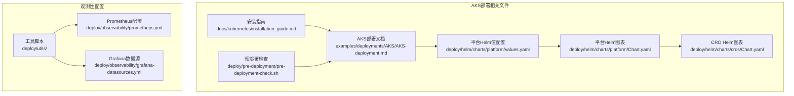

**图表来源**
- [AKS部署文档](file://examples/deployments/AKS/AKS-deployment.md#L1-L79)
- [平台Helm值配置](file://deploy/helm/charts/platform/values.yaml#L1-L732)
- [平台Helm图表定义](file://deploy/helm/charts/platform/Chart.yaml#L1-L46)

**章节来源**
- [AKS部署文档](file://examples/deployments/AKS/AKS-deployment.md#L1-L79)
- [平台Helm值配置](file://deploy/helm/charts/platform/values.yaml#L1-L732)
- [平台Helm图表定义](file://deploy/helm/charts/platform/Chart.yaml#L1-L46)

## 核心组件

### NVIDIA GPU Operator

Dynamo在AKS环境中通过NVIDIA GPU Operator实现GPU资源管理，该组件负责：

- 自动部署和生命周期管理所有NVIDIA软件组件
- GPU驱动程序管理
- 容器工具包自动化
- 设备插件管理
- 监控工具集成

### Dynamo Kubernetes Operator

平台的核心控制器，负责：

- 自定义资源管理（DynamoGraphDeployment等）
- 工作负载编排和调度
- 状态管理和故障恢复
- 与etcd和NATS的协调

### etcd分布式存储

提供高可用的状态存储：

- 分布式键值存储
- 集群状态持久化
- 一致性保证
- 支持单节点和HA模式

### NATS消息系统

用于组件间通信：

- 消息传递和事件分发
- JetStream持久化消息
- 负载均衡和故障转移
- 监控和调试支持

**章节来源**
- [AKS部署文档](file://examples/deployments/AKS/AKS-deployment.md#L22-L55)
- [平台Helm值配置](file://deploy/helm/charts/platform/values.yaml#L234-L287)
- [平台Helm值配置](file://deploy/helm/charts/platform/values.yaml#L289-L490)

## 架构概览

Dynamo在AKS上的整体架构如下：

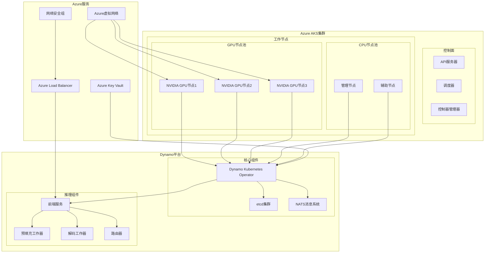

**图表来源**
- [平台Helm图表定义](file://deploy/helm/charts/platform/Chart.yaml#L24-L46)
- [平台Helm值配置](file://deploy/helm/charts/platform/values.yaml#L213-L287)

## 详细组件分析

### AKS集群创建和配置

#### GPU节点池配置

在AKS中创建支持GPU的节点池需要特别注意以下配置：

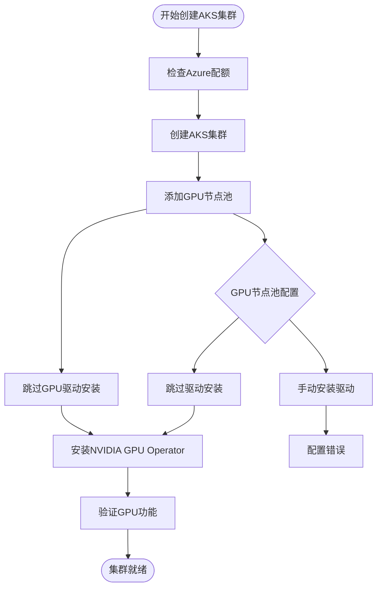

**图表来源**
- [AKS部署文档](file://examples/deployments/AKS/AKS-deployment.md#L14-L21)

#### Azure特定网络配置

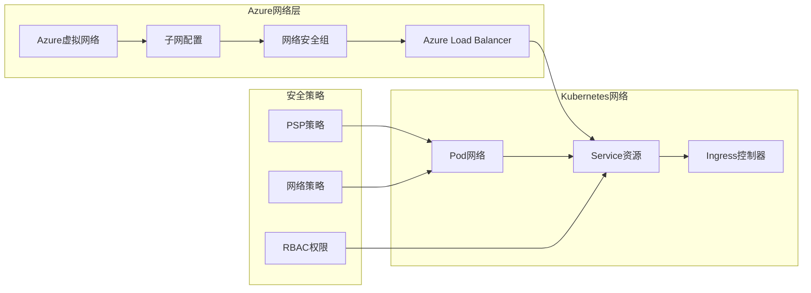

**图表来源**
- [平台Helm值配置](file://deploy/helm/charts/platform/values.yaml#L115-L136)

### 存储解决方案

#### Azure Files和Azure Disks集成

Dynamo支持多种存储方案：

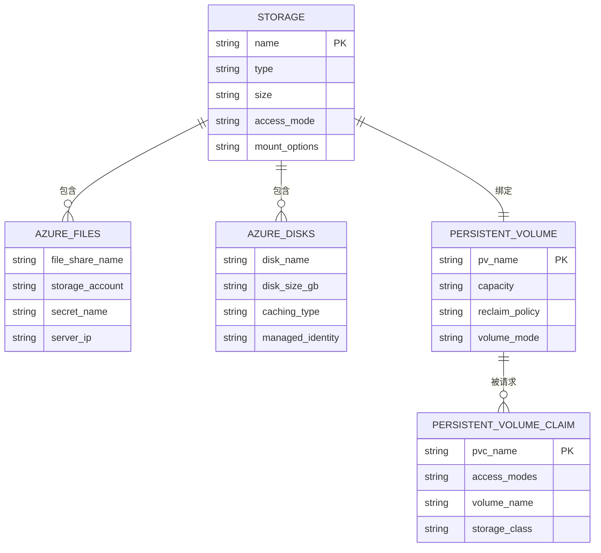

**图表来源**
- [预部署检查脚本](file://deploy/pre-deployment/pre-deployment-check.sh#L61-L120)

#### 存储类配置

平台支持多种存储类配置，包括Azure特定的存储类：

- **默认存储类**: 用于动态卷供应
- **高性能存储类**: 使用Premium SSD
- **成本优化存储类**: 使用Standard SSD或HDD

### 安全策略

#### Azure RBAC权限设置

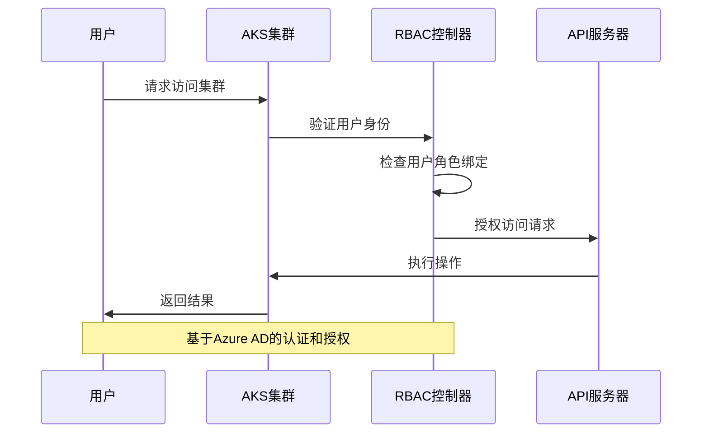

**图表来源**
- [平台Helm值配置](file://deploy/helm/charts/platform/values.yaml#L151-L212)

#### 网络安全组配置

Azure网络安全组用于控制入站和出站流量：

- **前端服务**: 允许HTTP/HTTPS流量
- **管理端口**: 限制到特定IP范围
- **etcd通信**: 仅允许集群内部通信
- **NATS通信**: 控制消息传递流量

### Helm图表配置

#### 平台部署配置

平台Helm图表提供了丰富的配置选项：

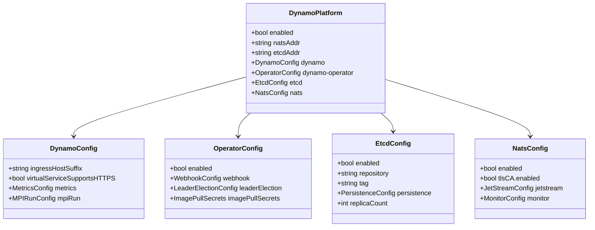

**图表来源**
- [平台Helm值配置](file://deploy/helm/charts/platform/values.yaml#L19-L114)
- [平台Helm值配置](file://deploy/helm/charts/platform/values.yaml#L213-L287)
- [平台Helm值配置](file://deploy/helm/charts/platform/values.yaml#L289-L490)

**章节来源**
- [平台Helm值配置](file://deploy/helm/charts/platform/values.yaml#L1-L732)
- [平台Helm图表定义](file://deploy/helm/charts/platform/Chart.yaml#L24-L46)

### 观测性集成

#### Azure Monitor集成

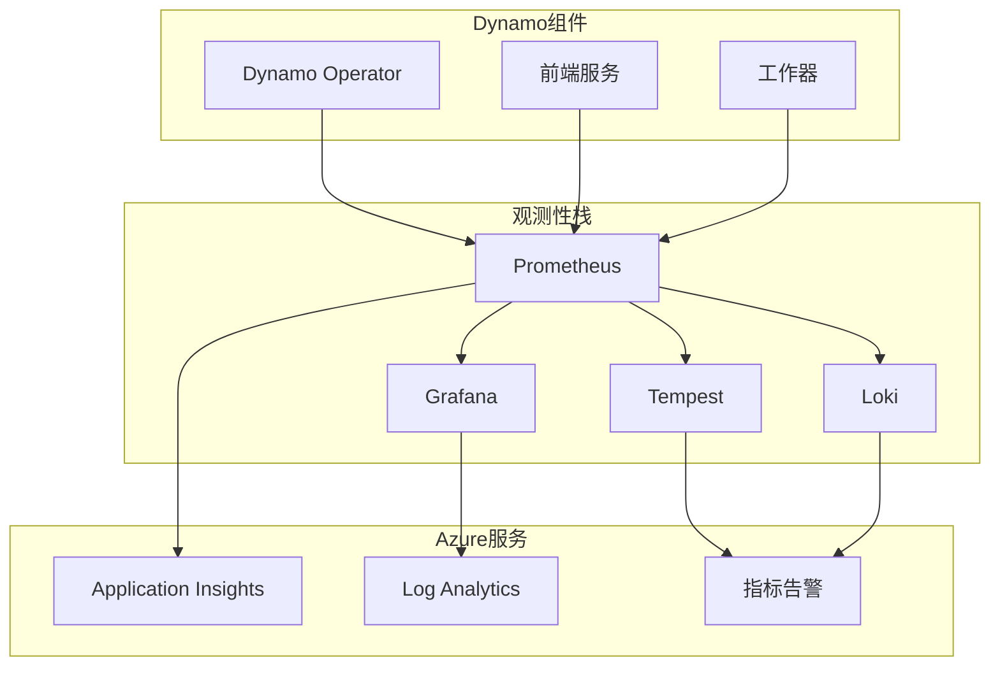

**图表来源**
- [Prometheus监控配置](file://deploy/observability/prometheus.yml#L20-L57)
- [Grafana数据源配置](file://deploy/observability/grafana-datasources.yml#L18-L24)

#### 日志聚合和告警配置

平台提供完整的日志和监控配置：

- **日志收集**: 使用Loki进行结构化日志收集
- **指标监控**: 使用Prometheus收集系统和应用指标
- **追踪系统**: 使用Tempo进行分布式追踪
- **可视化**: 使用Grafana创建仪表板
- **告警规则**: 基于阈值和业务指标的告警

**章节来源**
- [Prometheus监控配置](file://deploy/observability/prometheus.yml#L1-L63)
- [Grafana数据源配置](file://deploy/observability/grafana-datasources.yml#L1-L24)

## 依赖关系分析

### Helm图表依赖

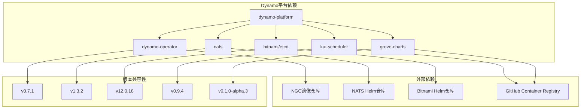

**图表来源**
- [平台Helm图表定义](file://deploy/helm/charts/platform/Chart.yaml#L24-L46)

### 组件间通信

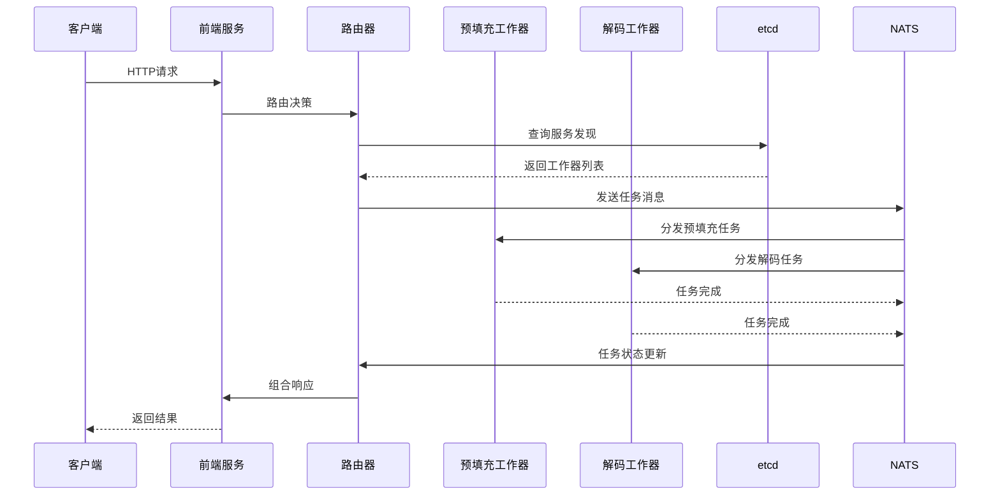

**图表来源**
- [服务发现配置](file://deploy/discovery/dgd.yaml#L10-L11)

**章节来源**
- [平台Helm图表定义](file://deploy/helm/charts/platform/Chart.yaml#L24-L46)
- [服务发现配置](file://deploy/discovery/dgd.yaml#L1-L59)

## 性能考虑

### 多可用区部署

Dynamo支持跨可用区部署以提高可用性和容错能力：

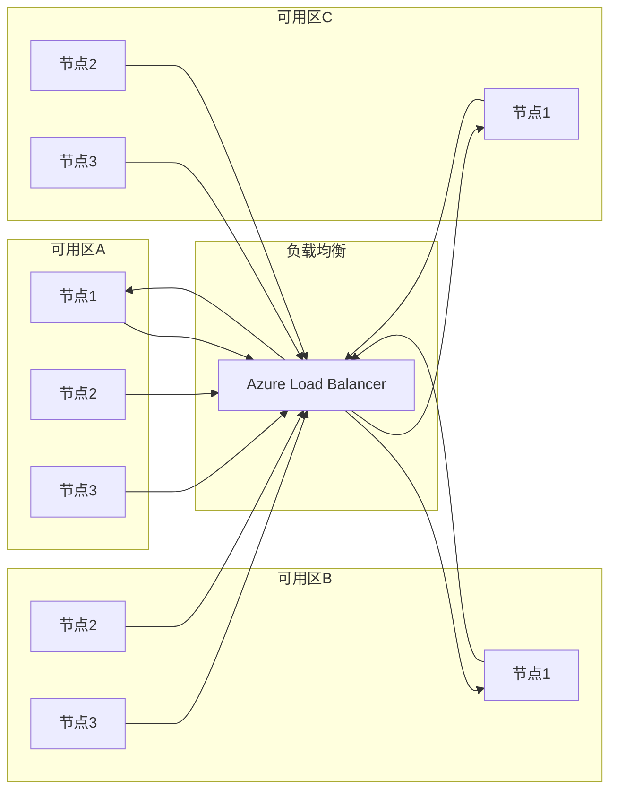

### 自动扩缩容配置

平台支持多种扩缩容策略：

- **HPA (Horizontal Pod Autoscaler)**: 基于CPU和内存使用率
- **VPA (Vertical Pod Autoscaler)**: 动态调整资源请求
- **自定义扩缩容**: 基于业务指标和SLA目标

### 成本优化策略

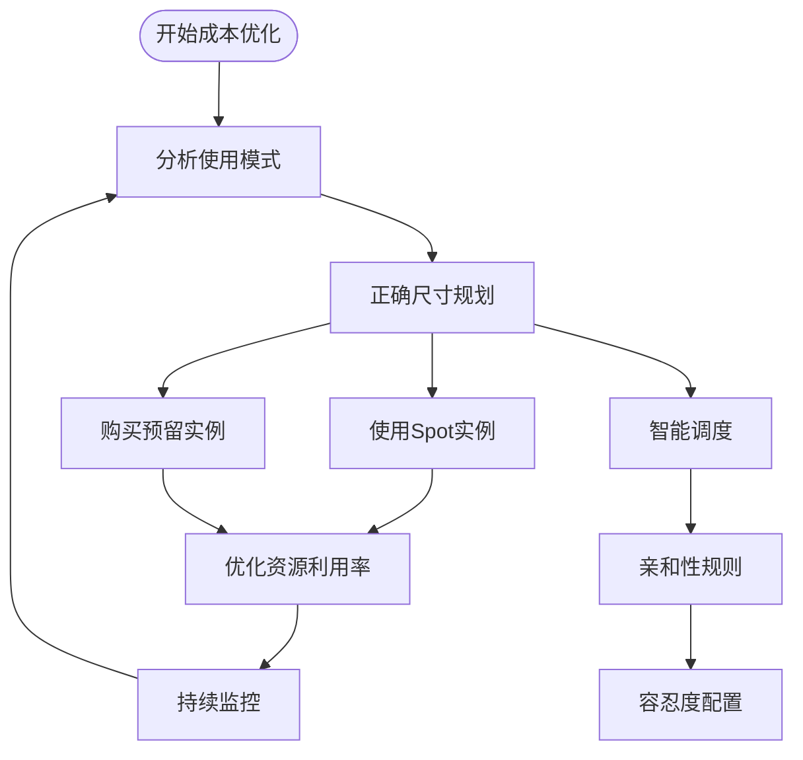

## 故障排除指南

### 常见问题诊断

#### GPU相关问题

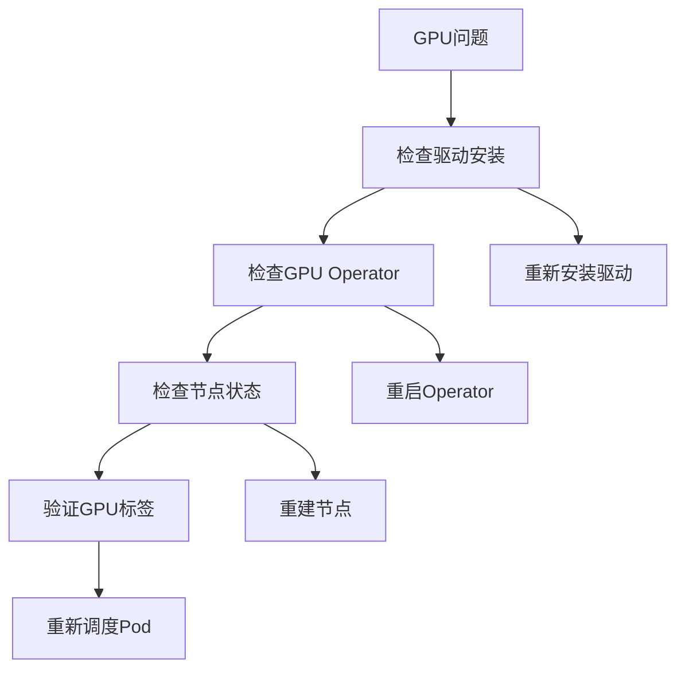

#### 网络连接问题

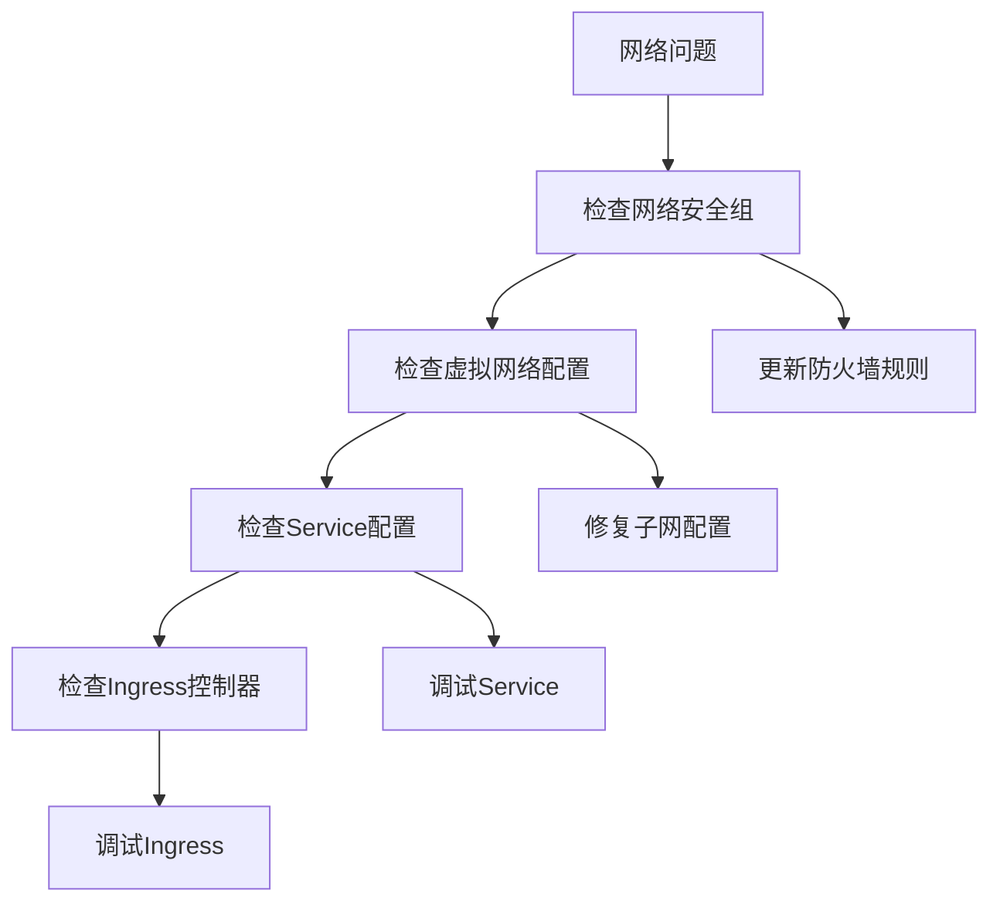

#### 存储问题

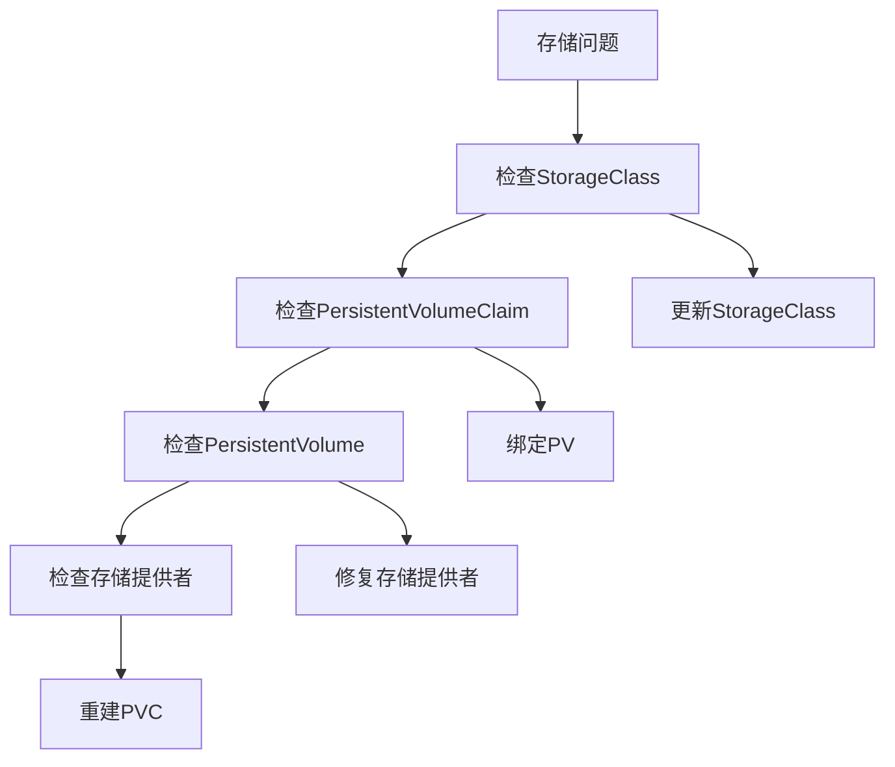

### 预部署检查

平台提供了全面的预部署检查脚本，确保集群满足Dynamo部署要求：

**章节来源**
- [预部署检查脚本](file://deploy/pre-deployment/pre-deployment-check.sh#L1-L284)

## 结论

本指南提供了在Azure Kubernetes Service上部署Dynamo平台的完整技术文档。通过合理配置Azure资源、网络和安全策略，结合平台提供的观测性工具，可以构建一个高可用、可扩展且成本优化的推理服务平台。

关键要点包括：
- 利用NVIDIA GPU Operator简化GPU资源管理
- 通过Helm图表实现标准化部署
- 配置Azure特定的网络和存储解决方案
- 实施全面的观测性和告警机制
- 采用多可用区部署提高可用性
- 应用成本优化策略降低运营成本

## 附录

### 快速部署命令

```bash
# 设置环境变量
export NAMESPACE=dynamo-system
export RELEASE_VERSION=0.x.x

# 创建命名空间
kubectl create namespace ${NAMESPACE}

# 安装CRDs
helm install dynamo-crds dynamo-crds-${RELEASE_VERSION}.tgz --namespace default

# 安装平台
helm install dynamo-platform dynamo-platform-${RELEASE_VERSION}.tgz \
  --namespace ${NAMESPACE} \
  --create-namespace
```

### 监控和调试

```bash
# 检查Pod状态
kubectl get pods -n ${NAMESPACE}

# 查看日志
kubectl logs -n ${NAMESPACE} <pod-name>

# 调试命令
kubectl describe pod -n ${NAMESPACE} <pod-name>
```