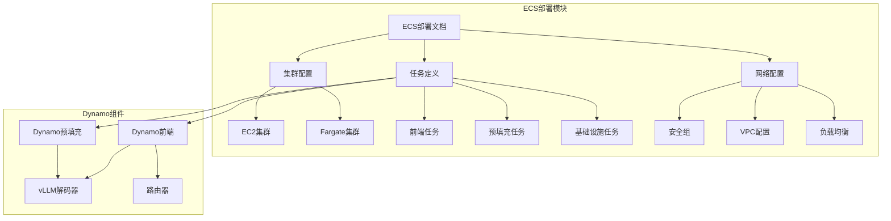
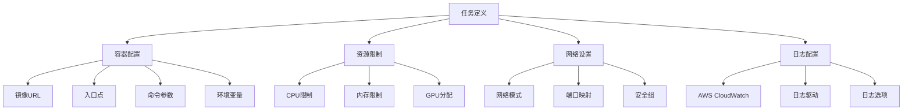
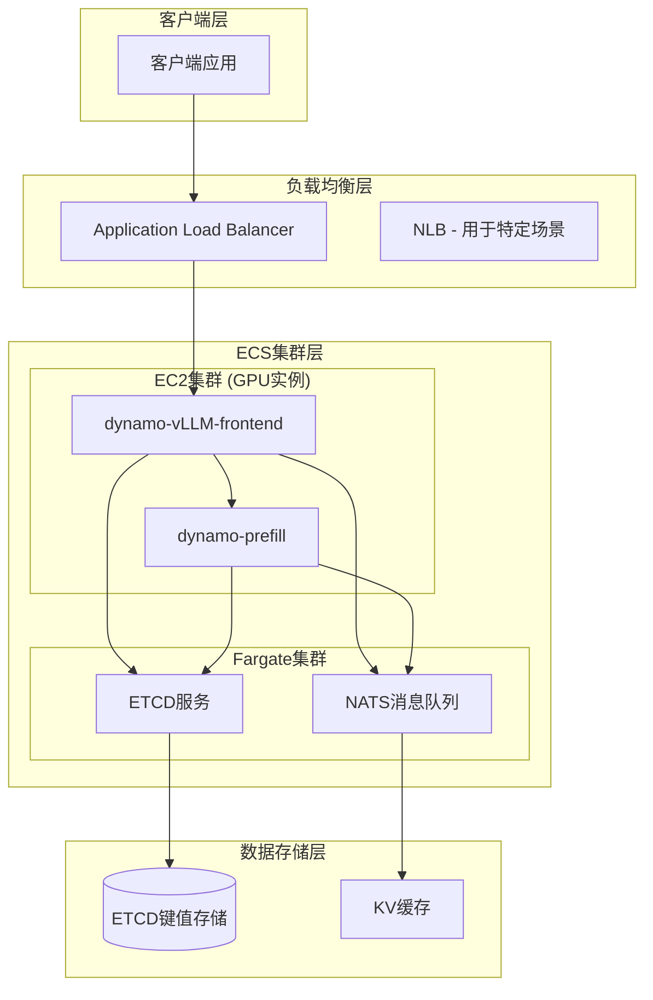
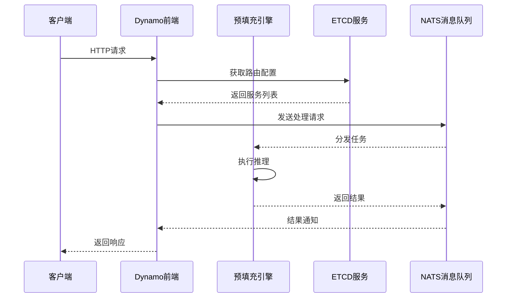
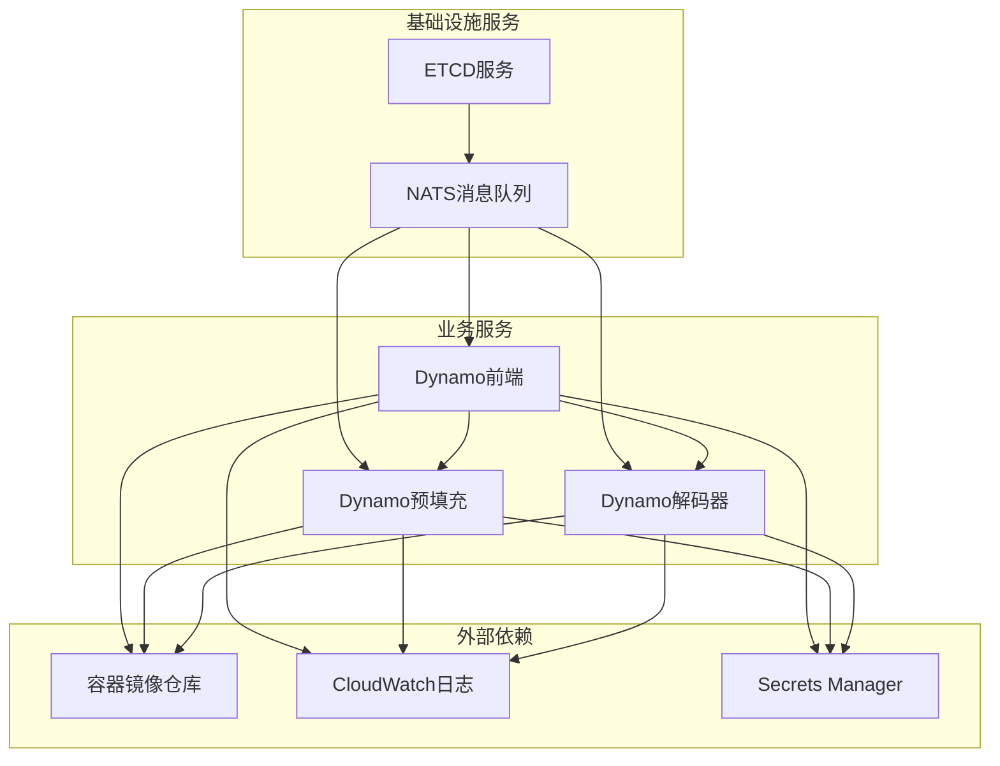
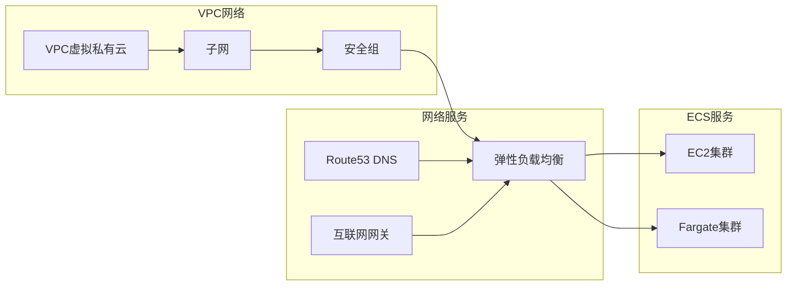
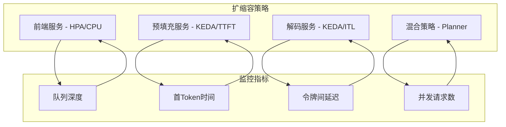
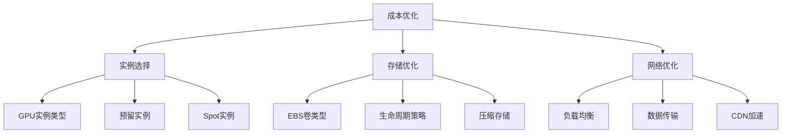
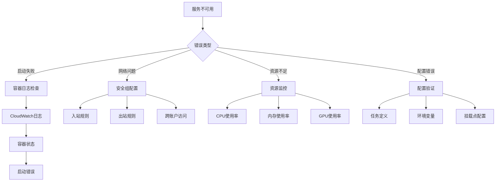
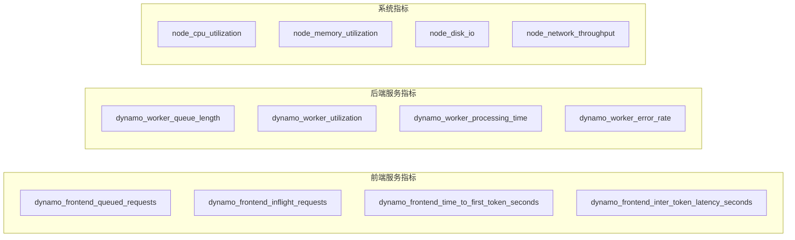

# ECS部署指南

<cite>
**本文档引用的文件**
- [README.md](file://examples/deployments/ECS/README.md)
- [task_definition_frontend.json](file://examples/deployments/ECS/task_definition_frontend.json)
- [task_definition_etcd_nats.json](file://examples/deployments/ECS/task_definition_etcd_nats.json)
- [task_definition_prefillworker.json](file://examples/deployments/ECS/task_definition_prefillworker.json)
- [dgd.yaml](file://deploy/discovery/dgd.yaml)
- [tuning.md](file://docs/performance/tuning.md)
- [autoscaling.md](file://docs/kubernetes/autoscaling.md)
- [metrics.rs](file://lib/runtime/src/metrics.rs)
</cite>

## 目录
1. [简介](#简介)
2. [项目结构](#项目结构)
3. [核心组件](#核心组件)
4. [架构概览](#架构概览)
5. [详细组件分析](#详细组件分析)
6. [依赖关系分析](#依赖关系分析)
7. [性能考虑](#性能考虑)
8. [故障排查指南](#故障排查指南)
9. [结论](#结论)
10. [附录](#附录)

## 简介

本指南基于Dynamo项目的ECS部署经验，提供完整的AWS ECS (Elastic Container Service) 部署方案。该指南涵盖了ECS集群创建、任务定义配置、服务发现、负载均衡设置，以及与Fargate和EC2的不同部署模式。

Dynamo项目展示了如何在AWS ECS上部署vLLM推理服务，包括ETCD/NATS基础设施服务和Dynamo vLLM工作负载。该部署方案支持单节点和分布式多节点部署，适用于生产环境的高性能推理需求。

## 项目结构

基于仓库中的ECS部署相关文件，项目采用模块化组织方式：

**图表来源**
- [README.md](file://examples/deployments/ECS/README.md#L1-L129)
- [task_definition_frontend.json](file://examples/deployments/ECS/task_definition_frontend.json#L1-L79)

**章节来源**
- [README.md](file://examples/deployments/ECS/README.md#L1-L129)

## 核心组件

### ECS集群类型对比

| 组件 | EC2集群 | Fargate集群 |
|------|---------|-------------|
| **计算模式** | 容器直接运行在EC2实例上 | 无服务器容器编排 |
| **GPU支持** | 原生GPU实例支持 | 通过EC2实例类型支持 |
| **启动时间** | 几分钟到十几分钟 | 秒级启动 |
| **成本模型** | 按实例小时付费 | 按秒付费 |
| **适用场景** | 长期稳定工作负载 | 短时突发工作负载 |

### 任务定义配置

每个任务定义包含以下关键配置：

**图表来源**
- [task_definition_frontend.json](file://examples/deployments/ECS/task_definition_frontend.json#L1-L79)
- [task_definition_etcd_nats.json](file://examples/deployments/ECS/task_definition_etcd_nats.json#L1-L112)

**章节来源**
- [task_definition_frontend.json](file://examples/deployments/ECS/task_definition_frontend.json#L1-L79)
- [task_definition_etcd_nats.json](file://examples/deployments/ECS/task_definition_etcd_nats.json#L1-L112)
- [task_definition_prefillworker.json](file://examples/deployments/ECS/task_definition_prefillworker.json#L1-L71)

## 架构概览

Dynamo在ECS上的整体架构设计体现了微服务分离和高可用性原则：

**图表来源**
- [README.md](file://examples/deployments/ECS/README.md#L1-L129)

### 服务发现机制

Dynamo采用多层服务发现策略：

**图表来源**
- [dgd.yaml](file://deploy/discovery/dgd.yaml#L1-L59)

## 详细组件分析

### ETCD任务定义分析

ETCD作为关键的数据存储服务，需要高可用性和持久化能力：

| 配置项 | 值 | 说明 |
|--------|----|------|
| **任务家族** | Dynamo-tasks | 任务分组标识 |
| **容器数量** | 1个 | ETCD主容器 |
| **网络模式** | awsvpc | 使用AWS VPC网络 |
| **CPU分配** | 1024 | 1 vCPU |
| **内存分配** | 3072 | 3GB内存 |
| **启动类型** | FARGATE | 无服务器计算 |
| **端口映射** | 2379, 2380 | ETCD通信端口 |

### NATS任务定义分析

NATS作为消息中间件，支持高并发的消息传递：

| 配置项 | 值 | 说明 |
|--------|----|------|
| **任务家族** | Dynamo-tasks | 任务分组标识 |
| **容器数量** | 1个 | NATS主容器 |
| **网络模式** | awsvpc | 使用AWS VPC网络 |
| **CPU分配** | 1024 | 1 vCPU |
| **内存分配** | 3072 | 3GB内存 |
| **启动类型** | FARGATE | 无服务器计算 |
| **端口映射** | 4222, 6222, 8222 | NATS通信端口 |
| **命令参数** | -js, --trace | 启用JetStream和调试 |

### Dynamo前端任务分析

前端服务负责接收客户端请求和协调后端处理：

| 配置项 | 值 | 说明 |
|--------|----|------|
| **任务家族** | Dynamo-frontend | 任务分组标识 |
| **容器数量** | 1个 | 主要业务容器 |
| **网络模式** | host | 直接使用宿主机网络 |
| **CPU分配** | 2048 | 2 vCPU |
| **内存分配** | 40960 | 40GB内存 |
| **GPU分配** | 1个 | NVIDIA GPU |
| **启动类型** | EC2 | EC2实例计算 |
| **端口映射** | 8000 | HTTP服务端口 |
| **环境变量** | ETCD_ENDPOINTS, NATS_SERVER | 服务发现配置 |

### Dynamo预填充任务分析

预填充任务专门处理上下文编码阶段：

| 配置项 | 值 | 说明 |
|--------|----|------|
| **任务家族** | Dynamo-backend | 任务分组标识 |
| **容器数量** | 1个 | 预填充专用容器 |
| **网络模式** | bridge | 桥接网络模式 |
| **CPU分配** | 2048 | 2 vCPU |
| **内存分配** | 40960 | 40GB内存 |
| **GPU分配** | 1个 | NVIDIA GPU |
| **启动类型** | EC2 | EC2实例计算 |
| **端口映射** | 无 | 仅内部通信 |
| **特殊用途** | 预填充专用 | 优化上下文处理 |

**章节来源**
- [task_definition_etcd_nats.json](file://examples/deployments/ECS/task_definition_etcd_nats.json#L1-L112)
- [task_definition_frontend.json](file://examples/deployments/ECS/task_definition_frontend.json#L1-L79)
- [task_definition_prefillworker.json](file://examples/deployments/ECS/task_definition_prefillworker.json#L1-L71)

## 依赖关系分析

### 任务间依赖关系

**图表来源**
- [README.md](file://examples/deployments/ECS/README.md#L26-L38)

### 网络依赖分析

ECS部署中的网络依赖关系确保了服务间的可靠通信：

**图表来源**
- [README.md](file://examples/deployments/ECS/README.md#L8-L21)

**章节来源**
- [README.md](file://examples/deployments/ECS/README.md#L1-L129)

## 性能考虑

### 自动扩缩容策略

基于Dynamo项目的性能调优经验，建议采用混合扩缩容策略：

**图表来源**
- [autoscaling.md](file://docs/kubernetes/autoscaling.md#L1-L732)

### 性能调优要点

根据Dynamo项目的性能调优指南，关键优化参数包括：

| 参数类别 | 优化目标 | 推荐配置 | 影响范围 |
|----------|----------|----------|----------|
| **并行化映射** | GPU利用率最大化 | TP8或TP8PP2 | 整体吞吐量 |
| **批大小** | 内存使用平衡 | 预填充: 小批 解码: 大批 | KV缓存效率 |
| **最大令牌数** | 延迟控制 | 预填充: 大值 解码: 中等值 | ITL性能 |
| **块大小** | 缓存命中率 | 128 | 前缀缓存效率 |

### 成本优化策略

**章节来源**
- [tuning.md](file://docs/performance/tuning.md#L1-L149)
- [autoscaling.md](file://docs/kubernetes/autoscaling.md#L1-L732)

## 故障排查指南

### 常见问题诊断

### 日志收集和分析

Dynamo项目提供了完善的日志收集机制：

| 日志类型 | 收集位置 | 分析工具 | 关键指标 |
|----------|----------|----------|----------|
| **容器日志** | CloudWatch Logs | AWS控制台 | 启动时间、错误码 |
| **应用日志** | 容器标准输出 | Fluentd/Fluent Bit | 请求处理时间 |
| **系统日志** | 实例系统日志 | CloudWatch Logs | 内核错误、OOM事件 |
| **网络日志** | VPC流日志 | Athena查询 | 流量统计、连接异常 |

### 性能监控指标

基于Dynamo项目的监控实现，建议关注以下关键指标：

**图表来源**
- [metrics.rs](file://lib/runtime/src/metrics.rs#L1378-L1510)

**章节来源**
- [metrics.rs](file://lib/runtime/src/metrics.rs#L1378-L1510)

## 结论

基于Dynamo项目的ECS部署实践，本文提供了完整的AWS ECS部署指南。该方案通过合理的任务分离、网络配置和扩缩容策略，实现了高性能的LLM推理服务部署。

关键成功因素包括：
- **正确的集群选择**：根据工作负载特性选择EC2或Fargate
- **合理的资源配置**：平衡性能和成本
- **完善的监控体系**：实时跟踪服务状态
- **灵活的扩缩容策略**：自动适应流量变化
- **高可用架构设计**：确保服务连续性

通过遵循本指南的最佳实践，可以在AWS ECS上构建稳定、高效、可扩展的LLM推理平台。

## 附录

### 部署步骤摘要

1. **集群准备**
   - 创建EC2 GPU集群用于vLLM工作负载
   - 创建Fargate集群用于ETCD/NATS基础设施

2. **IAM角色配置**
   - 创建ecsTaskExecutionRole
   - 配置CloudWatch和Secrets Manager权限

3. **任务定义部署**
   - 部署ETCD/NATS基础设施任务
   - 部署Dynamo前端和预填充任务

4. **网络配置**
   - 配置VPC和子网
   - 设置安全组规则
   - 配置负载均衡器

5. **监控和告警**
   - 设置CloudWatch告警
   - 配置日志聚合
   - 部署Prometheus监控

### 参考配置文件

- **ETCD任务定义**: [task_definition_etcd_nats.json](file://examples/deployments/ECS/task_definition_etcd_nats.json)
- **前端任务定义**: [task_definition_frontend.json](file://examples/deployments/ECS/task_definition_frontend.json)
- **预填充任务定义**: [task_definition_prefillworker.json](file://examples/deployments/ECS/task_definition_prefillworker.json)
- **Dynamo服务发现**: [dgd.yaml](file://deploy/discovery/dgd.yaml)