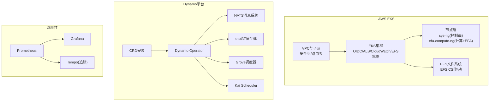
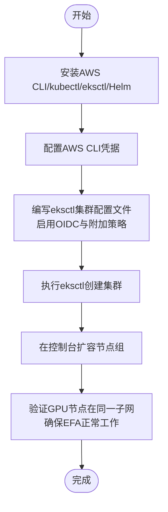
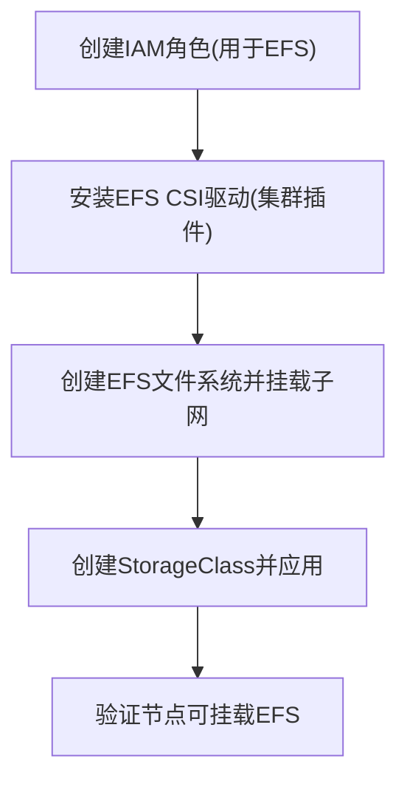
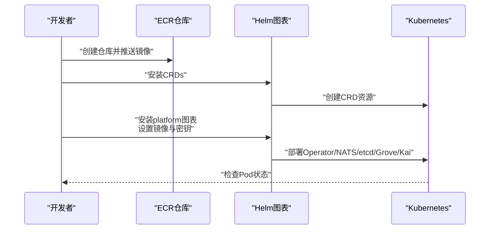
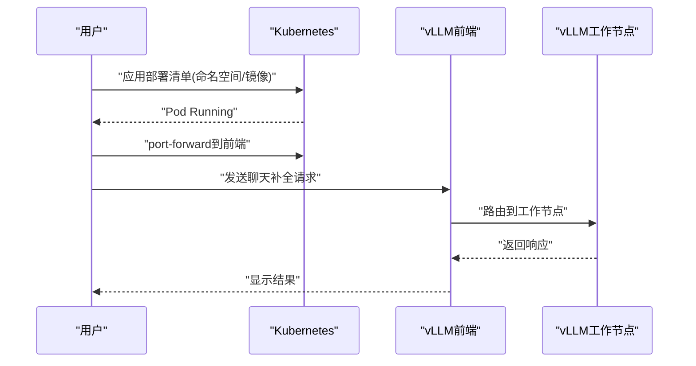
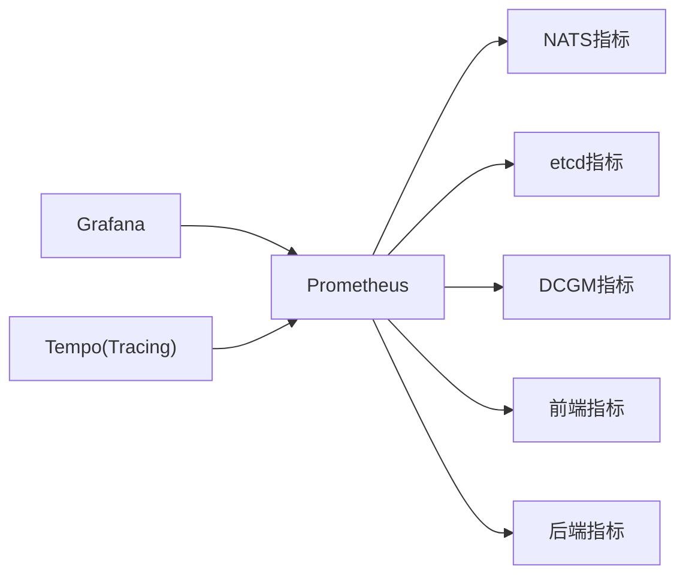
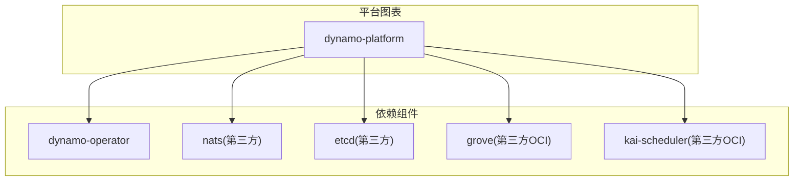

# EKS部署指南

<cite>
**本文档引用的文件**
- [Create_EKS_EFS.md](file://examples/deployments/EKS/Create_EKS_EFS.md)
- [Deploy_Dynamo_Kubernetes_Platform.md](file://examples/deployments/EKS/Deploy_Dynamo_Kubernetes_Platform.md)
- [Deploy_VLLM_example.md](file://examples/deployments/EKS/Deploy_VLLM_example.md)
- [Chart.yaml](file://deploy/helm/charts/platform/Chart.yaml)
- [Chart.yaml](file://deploy/helm/charts/crds/Chart.yaml)
- [helm/README.md](file://deploy/helm/README.md)
- [prometheus.yml](file://deploy/observability/prometheus.yml)
- [metrics-developer-guide.md](file://docs/observability/metrics-developer-guide.md)
- [prometheus-grafana.md](file://docs/observability/prometheus-grafana.md)
- [README.md](file://docs/kubernetes/README.md)
- [README.md](file://docs/kubernetes/installation_guide.md)
- [README.md](file://docs/kubernetes/autoscaling.md)
- [README.md](file://docs/kubernetes/service_discovery.md)
- [README.md](file://docs/kubernetes/model_caching_with_fluid.md)
- [README.md](file://docs/kubernetes/webhooks.md)
- [README.md](file://docs/kubernetes/dynamo_operator.md)
- [README.md](file://docs/kubernetes/fluxcd.md)
- [README.md](file://docs/performance/tuning.md)
- [README.md](file://docs/performance/aiconfigurator.md)
- [README.md](file://docs/fault_tolerance/graceful_shutdown.md)
- [README.md](file://docs/fault_tolerance/request_cancellation.md)
- [README.md](file://docs/fault_tolerance/request_migration.md)
- [README.md](file://docs/fault_tolerance/request_rejection.md)
- [README.md](file://docs/fault_tolerance/testing.md)
- [README.md](file://docs/development/backend-guide.md)
- [README.md](file://docs/development/runtime-guide.md)
- [README.md](file://docs/design_docs/architecture.md)
- [README.md](file://docs/design_docs/disagg_serving.md)
- [README.md](file://docs/design_docs/distributed_runtime.md)
- [README.md](file://docs/design_docs/dynamo_flow.md)
- [README.md](file://docs/design_docs/event_plane.md)
- [README.md](file://docs/design_docs/request_plane.md)
- [README.md](file://docs/backends/vllm/prometheus.md)
- [README.md](file://docs/backends/trtllm/prometheus.md)
- [README.md](file://docs/backends/sglang/prometheus.md)
- [README.md](file://docs/agents/tool-calling.md)
- [README.md](file://docs/benchmarks/benchmarking.md)
- [README.md](file://docs/benchmarks/kv-router-ab-testing.md)
- [README.md](file://docs/benchmarks/sla_driven_profiling.md)
- [README.md](file://docs/planner/load_planner.md)
- [README.md](file://docs/planner/sla_planner.md)
- [README.md](file://docs/planner/sla_planner_quickstart.md)
- [README.md](file://docs/router/kv_cache_routing.md)
- [README.md](file://docs/router/kv_events.md)
- [README.md](file://docs/kvbm/kvbm_architecture.md)
- [README.md](file://docs/kvbm/kvbm_components.md)
- [README.md](file://docs/kvbm/kvbm_design_deepdive.md)
- [README.md](file://docs/kvbm/kvbm_integrations.md)
- [README.md](file://docs/kvbm/kvbm_motivation.md)
- [README.md](file://docs/kvbm/kvbm_reading.md)
- [README.md](file://docs/kvbm/trtllm-setup.md)
- [README.md](file://docs/kvbm/vllm-setup.md)
- [README.md](file://docs/multimodal/index.md)
- [README.md](file://docs/multimodal/sglang.md)
- [README.md](file://docs/multimodal/trtllm.md)
- [README.md](file://docs/multimodal/vllm.md)
- [README.md](file://docs/reference/cli.md)
- [README.md](file://docs/reference/feature-matrix.md)
- [README.md](file://docs/reference/glossary.md)
- [README.md](file://docs/reference/release-artifacts.md)
- [README.md](file://docs/reference/support-matrix.md)
- [README.md](file://docs/frontends/kserve.md)
- [README.md](file://docs/api/nixl_connect/README.md)
- [README.md](file://docs/api/nixl_connect/connector.md)
- [README.md](file://docs/api/nixl_connect/descriptor.md)
- [README.md](file://docs/api/nixl_connect/device.md)
- [README.md](file://docs/api/nixl_connect/device_kind.md)
- [README.md](file://docs/api/nixl_connect/operation_status.md)
- [README.md](file://docs/api/nixl_connect/rdma_metadata.md)
- [README.md](file://docs/api/nixl_connect/read_operation.md)
- [README.md](file://docs/api/nixl_connect/readable_operation.md)
- [README.md](file://docs/api/nixl_connect/writable_operation.md)
- [README.md](file://docs/api/nixl_connect/write_operation.md)
- [README.md](file://docs/observability/health-checks.md)
- [README.md](file://docs/observability/logging.md)
- [README.md](file://docs/observability/metrics.md)
- [README.md](file://docs/observability/tracing.md)
- [README.md](file://docs/observability/operator-metrics.md)
- [README.md](file://docs/kvbm/kvbm_architecture.md)
- [README.md](file://docs/kvbm/kvbm_components.md)
- [README.md](file://docs/kvbm/kvbm_design_deepdive.md)
- [README.md](file://docs/kvbm/kvbm_integrations.md)
- [README.md](file://docs/kvbm/kvbm_motivation.md)
- [README.md](file://docs/kvbm/kvbm_reading.md)
- [README.md](file://docs/kvbm/trtllm-setup.md)
- [README.md](file://docs/kvbm/vllm-setup.md)
- [README.md](file://docs/multimodal/index.md)
- [README.md](file://docs/multimodal/sglang.md)
- [README.md](file://docs/multimodal/trtllm.md)
- [README.md](file://docs/multimodal/vllm.md)
- [README.md](file://docs/reference/cli.md)
- [README.md](file://docs/reference/feature-matrix.md)
- [README.md](file://docs/reference/glossary.md)
- [README.md](file://docs/reference/release-artifacts.md)
- [README.md](file://docs/reference/support-matrix.md)
- [README.md](file://docs/frontends/kserve.md)
- [README.md](file://docs/api/nixl_connect/README.md)
- [README.md](file://docs/api/nixl_connect/connector.md)
- [README.md](file://docs/api/nixl_connect/descriptor.md)
- [README.md](file://docs/api/nixl_connect/device.md)
- [README.md](file://docs/api/nixl_connect/device_kind.md)
- [README.md](file://docs/api/nixl_connect/operation_status.md)
- [README.md](file://docs/api/nixl_connect/rdma_metadata.md)
- [README.md](file://docs/api/nixl_connect/read_operation.md)
- [README.md](file://docs/api/nixl_connect/readable_operation.md)
- [README.md](file://docs/api/nixl_connect/writable_operation.md)
- [README.md](file://docs/api/nixl_connect/write_operation.md)
- [README.md](file://docs/observability/health-checks.md)
- [README.md](file://docs/observability/logging.md)
- [README.md](file://docs/observability/metrics.md)
- [README.md](file://docs/observability/tracing.md)
- [README.md](file://docs/observability/operator-metrics.md)
</cite>

## 目录
1. [简介](#简介)
2. [项目结构](#项目结构)
3. [核心组件](#核心组件)
4. [架构总览](#架构总览)
5. [详细组件分析](#详细组件分析)
6. [依赖关系分析](#依赖关系分析)
7. [性能考虑](#性能考虑)
8. [故障排除指南](#故障排除指南)
9. [结论](#结论)
10. [附录](#附录)

## 简介
本指南面向在Amazon Elastic Kubernetes Service (EKS)上部署NVIDIA Dynamo平台的工程团队，提供从集群创建、网络与存储配置、IAM与安全策略、到平台安装、观测性（监控、追踪、指标）以及性能优化的完整实践路径。文档内容严格基于仓库中的现有示例与文档，确保可操作性与可验证性。

## 项目结构
围绕EKS部署，仓库中与之直接相关的关键目录与文件包括：
- examples/deployments/EKS：EKS集群与EFS存储的部署步骤与示例
- deploy/helm：平台与CRD的Helm图表
- deploy/observability：Prometheus、Grafana、Tempo等可观测性配置
- docs：平台功能、Kubernetes集成、性能与可观测性等官方文档

```mermaid
graph TB
subgraph "EKS部署示例"
A["Create_EKS_EFS.md"]
B["Deploy_Dynamo_Kubernetes_Platform.md"]
C["Deploy_VLLM_example.md"]
end
subgraph "Helm图表"
D["charts/crds/Chart.yaml"]
E["charts/platform/Chart.yaml"]
F["helm/README.md"]
end
subgraph "可观测性"
G["prometheus.yml"]
H["prometheus-grafana.md"]
I["metrics-developer-guide.md"]
end
subgraph "Kubernetes与平台文档"
J["kubernetes/README.md"]
K["kubernetes/installation_guide.md"]
L["kubernetes/autoscaling.md"]
M["kubernetes/service_discovery.md"]
N["kubernetes/dynamo_operator.md"]
end
A --> B
B --> C
D --> E
E --> F
G --> H
I --> H
J --> K
K --> L
L --> M
M --> N
```

**图示来源**
- [Create_EKS_EFS.md](file://examples/deployments/EKS/Create_EKS_EFS.md#L1-L153)
- [Deploy_Dynamo_Kubernetes_Platform.md](file://examples/deployments/EKS/Deploy_Dynamo_Kubernetes_Platform.md#L1-L96)
- [Deploy_VLLM_example.md](file://examples/deployments/EKS/Deploy_VLLM_example.md#L1-L48)
- [Chart.yaml](file://deploy/helm/charts/crds/Chart.yaml#L1-L20)
- [Chart.yaml](file://deploy/helm/charts/platform/Chart.yaml#L1-L46)
- [helm/README.md](file://deploy/helm/README.md#L1-L23)
- [prometheus.yml](file://deploy/observability/prometheus.yml#L1-L63)
- [prometheus-grafana.md](file://docs/observability/prometheus-grafana.md#L94-L113)
- [metrics-developer-guide.md](file://docs/observability/metrics-developer-guide.md#L1-L200)
- [README.md](file://docs/kubernetes/README.md#L1-L200)
- [README.md](file://docs/kubernetes/installation_guide.md#L1-L200)
- [README.md](file://docs/kubernetes/autoscaling.md#L1-L200)
- [README.md](file://docs/kubernetes/service_discovery.md#L1-L200)
- [README.md](file://docs/kubernetes/dynamo_operator.md#L1-L200)

**章节来源**
- [Create_EKS_EFS.md](file://examples/deployments/EKS/Create_EKS_EFS.md#L1-L153)
- [Deploy_Dynamo_Kubernetes_Platform.md](file://examples/deployments/EKS/Deploy_Dynamo_Kubernetes_Platform.md#L1-L96)
- [Deploy_VLLM_example.md](file://examples/deployments/EKS/Deploy_VLLM_example.md#L1-L48)
- [Chart.yaml](file://deploy/helm/charts/crds/Chart.yaml#L1-L20)
- [Chart.yaml](file://deploy/helm/charts/platform/Chart.yaml#L1-L46)
- [helm/README.md](file://deploy/helm/README.md#L1-L23)
- [prometheus.yml](file://deploy/observability/prometheus.yml#L1-L63)
- [prometheus-grafana.md](file://docs/observability/prometheus-grafana.md#L94-L113)
- [metrics-developer-guide.md](file://docs/observability/metrics-developer-guide.md#L1-L200)
- [README.md](file://docs/kubernetes/README.md#L1-L200)

## 核心组件
- EKS集群与节点组：通过eksctl配置文件定义控制面与计算节点组，启用OIDC、ALB控制器、CloudWatch、EFS等附加策略，并支持EFA加速网络。
- EFS持久化存储：通过EFS CSI驱动与StorageClass实现共享卷，供多节点上的Pod挂载。
- Dynamo平台：通过Helm图表安装CRD与平台组件，包含Operator、NATS、etcd、Grove、Kai Scheduler等。
- 观测性：Prometheus抓取NATS、etcd、DCGM、前端与后端组件指标；结合Grafana仪表盘进行可视化。

**章节来源**
- [Create_EKS_EFS.md](file://examples/deployments/EKS/Create_EKS_EFS.md#L52-L108)
- [Create_EKS_EFS.md](file://examples/deployments/EKS/Create_EKS_EFS.md#L110-L153)
- [Deploy_Dynamo_Kubernetes_Platform.md](file://examples/deployments/EKS/Deploy_Dynamo_Kubernetes_Platform.md#L31-L96)
- [Chart.yaml](file://deploy/helm/charts/platform/Chart.yaml#L24-L46)
- [prometheus.yml](file://deploy/observability/prometheus.yml#L20-L57)

## 架构总览
下图展示了EKS集群、存储、平台组件与观测系统的整体关系：

**图示来源**
- [Create_EKS_EFS.md](file://examples/deployments/EKS/Create_EKS_EFS.md#L52-L108)
- [Chart.yaml](file://deploy/helm/charts/platform/Chart.yaml#L24-L46)
- [prometheus.yml](file://deploy/observability/prometheus.yml#L20-L57)

## 详细组件分析

### EKS集群创建与配置
- 安装CLI：AWS CLI、kubectl、eksctl、Helm。
- 配置AWS CLI并创建集群配置文件，启用OIDC与必要附加策略，定义控制面与计算节点组，开启EFA与私有网络。
- 使用eksctl创建集群；后续可在控制台扩容节点，确保GPU节点位于同一子网以满足EFA要求。

**图示来源**
- [Create_EKS_EFS.md](file://examples/deployments/EKS/Create_EKS_EFS.md#L3-L40)
- [Create_EKS_EFS.md](file://examples/deployments/EKS/Create_EKS_EFS.md#L46-L108)

**章节来源**
- [Create_EKS_EFS.md](file://examples/deployments/EKS/Create_EKS_EFS.md#L3-L40)
- [Create_EKS_EFS.md](file://examples/deployments/EKS/Create_EKS_EFS.md#L46-L108)

### EFS持久化存储配置
- 创建IAM角色用于EFS CSI驱动。
- 通过EKS控制台安装EFS CSI驱动作为集群插件。
- 创建EFS文件系统并正确挂载子网。
- 创建StorageClass并应用，设置文件系统ID与参数。

**图示来源**
- [Create_EKS_EFS.md](file://examples/deployments/EKS/Create_EKS_EFS.md#L115-L153)

**章节来源**
- [Create_EKS_EFS.md](file://examples/deployments/EKS/Create_EKS_EFS.md#L110-L153)

### Dynamo平台安装与Helm图表
- 在ECR创建仓库并构建/推送基础镜像与Operator镜像。
- 创建命名空间与镜像拉取密钥，安装CRDs，再安装platform图表并设置镜像与密钥参数。
- 平台组件包括Dynamo Operator、NATS、etcd、Grove、Kai Scheduler等。

**图示来源**
- [Deploy_Dynamo_Kubernetes_Platform.md](file://examples/deployments/EKS/Deploy_Dynamo_Kubernetes_Platform.md#L31-L96)
- [Chart.yaml](file://deploy/helm/charts/platform/Chart.yaml#L24-L46)
- [Chart.yaml](file://deploy/helm/charts/crds/Chart.yaml#L1-L20)

**章节来源**
- [Deploy_Dynamo_Kubernetes_Platform.md](file://examples/deployments/EKS/Deploy_Dynamo_Kubernetes_Platform.md#L31-L96)
- [Chart.yaml](file://deploy/helm/charts/platform/Chart.yaml#L24-L46)
- [Chart.yaml](file://deploy/helm/charts/crds/Chart.yaml#L1-L20)

### vLLM示例部署与测试
- 部署Dynamo Graph（修改命名空间与镜像），等待Pod就绪。
- 通过port-forward访问前端服务，发送请求进行功能验证。

**图示来源**
- [Deploy_VLLM_example.md](file://examples/deployments/EKS/Deploy_VLLM_example.md#L1-L48)

**章节来源**
- [Deploy_VLLM_example.md](file://examples/deployments/EKS/Deploy_VLLM_example.md#L1-L48)

### 观测性：Prometheus、Grafana与Tracing
- Prometheus配置抓取NATS、etcd、DCGM、前端与后端组件指标。
- Grafana仪表盘与数据源配置，结合Prometheus进行可视化。
- Tempo作为分布式追踪后端，可与Prometheus联动。

**图示来源**
- [prometheus.yml](file://deploy/observability/prometheus.yml#L20-L57)
- [prometheus-grafana.md](file://docs/observability/prometheus-grafana.md#L94-L113)

**章节来源**
- [prometheus.yml](file://deploy/observability/prometheus.yml#L1-L63)
- [prometheus-grafana.md](file://docs/observability/prometheus-grafana.md#L94-L113)

### 指标开发与自定义
- 可参考指标开发指南，了解如何在组件中注册自定义指标，包括计数器、直方图与度量。
- 示例输出展示标准指标格式与标签维度。

**章节来源**
- [metrics-developer-guide.md](file://docs/observability/metrics-developer-guide.md#L1-L200)

### Kubernetes集成与平台能力
- 安装指南、自动伸缩、服务发现、模型缓存与Webhook等能力文档，支撑平台在EKS上的稳定运行。

**章节来源**
- [README.md](file://docs/kubernetes/installation_guide.md#L1-L200)
- [README.md](file://docs/kubernetes/autoscaling.md#L1-L200)
- [README.md](file://docs/kubernetes/service_discovery.md#L1-L200)
- [README.md](file://docs/kubernetes/model_caching_with_fluid.md#L1-L200)
- [README.md](file://docs/kubernetes/webhooks.md#L1-L200)
- [README.md](file://docs/kubernetes/dynamo_operator.md#L1-L200)

## 依赖关系分析
平台Helm图表的依赖关系如下：

**图示来源**
- [Chart.yaml](file://deploy/helm/charts/platform/Chart.yaml#L24-L46)

**章节来源**
- [Chart.yaml](file://deploy/helm/charts/platform/Chart.yaml#L24-L46)

## 性能考虑
- 自动伸缩：根据业务负载与资源使用情况配置水平与垂直自动伸缩策略。
- 调优指南：参考性能调优与AI配置器文档，优化推理延迟与吞吐。
- 故障容错：优雅停机、请求取消、迁移与拒绝策略，保障高可用与稳定性。

**章节来源**
- [README.md](file://docs/kubernetes/autoscaling.md#L1-L200)
- [README.md](file://docs/performance/tuning.md#L1-L200)
- [README.md](file://docs/performance/aiconfigurator.md#L1-L200)
- [README.md](file://docs/fault_tolerance/graceful_shutdown.md#L1-L200)
- [README.md](file://docs/fault_tolerance/request_cancellation.md#L1-L200)
- [README.md](file://docs/fault_tolerance/request_migration.md#L1-L200)
- [README.md](file://docs/fault_tolerance/request_rejection.md#L1-L200)
- [README.md](file://docs/fault_tolerance/testing.md#L1-L200)

## 故障排除指南
- Prometheus目标检查：确认Prometheus目标处于健康状态，若出现数据陈旧或配置问题，可通过清理命名卷后重启恢复。
- 日志与状态：使用日志查看与服务状态检查定位问题。
- 指标与追踪：结合Grafana仪表盘与Tempo追踪，快速定位异常。

**章节来源**
- [prometheus-grafana.md](file://docs/observability/prometheus-grafana.md#L94-L113)

## 结论
本指南基于仓库内现有示例与文档，提供了在EKS上部署Dynamo平台的端到端实践路径，覆盖集群创建、存储配置、平台安装、观测性与性能优化。建议在生产环境中结合自动伸缩、故障容错与成本优化策略，持续迭代与验证。

## 附录
- 后端观测性：各后端（vLLM、TRT-LLM、SGLang）均有独立的Prometheus集成文档，便于按需启用与扩展。
- 多模态与KVBM：多模态与KVBM相关文档可用于复杂场景下的架构设计与性能调优。
- 命令行与参考：CLI与特性矩阵等参考文档便于日常运维与版本管理。

**章节来源**
- [README.md](file://docs/backends/vllm/prometheus.md#L1-L200)
- [README.md](file://docs/backends/trtllm/prometheus.md#L1-L200)
- [README.md](file://docs/backends/sglang/prometheus.md#L1-L200)
- [README.md](file://docs/multimodal/index.md#L1-L200)
- [README.md](file://docs/multimodal/sglang.md#L1-L200)
- [README.md](file://docs/multimodal/trtllm.md#L1-L200)
- [README.md](file://docs/multimodal/vllm.md#L1-L200)
- [README.md](file://docs/kvbm/kvbm_architecture.md#L1-L200)
- [README.md](file://docs/kvbm/kvbm_components.md#L1-L200)
- [README.md](file://docs/kvbm/kvbm_design_deepdive.md#L1-L200)
- [README.md](file://docs/kvbm/kvbm_integrations.md#L1-L200)
- [README.md](file://docs/kvbm/kvbm_motivation.md#L1-L200)
- [README.md](file://docs/kvbm/kvbm_reading.md#L1-L200)
- [README.md](file://docs/kvbm/trtllm-setup.md#L1-L200)
- [README.md](file://docs/kvbm/vllm-setup.md#L1-L200)
- [README.md](file://docs/reference/cli.md#L1-L200)
- [README.md](file://docs/reference/feature-matrix.md#L1-L200)
- [README.md](file://docs/reference/glossary.md#L1-L200)
- [README.md](file://docs/reference/release-artifacts.md#L1-L200)
- [README.md](file://docs/reference/support-matrix.md#L1-L200)
- [README.md](file://docs/frontends/kserve.md#L1-L200)
- [README.md](file://docs/api/nixl_connect/README.md#L1-L200)
- [README.md](file://docs/api/nixl_connect/connector.md#L1-L200)
- [README.md](file://docs/api/nixl_connect/descriptor.md#L1-L200)
- [README.md](file://docs/api/nixl_connect/device.md#L1-L200)
- [README.md](file://docs/api/nixl_connect/device_kind.md#L1-L200)
- [README.md](file://docs/api/nixl_connect/operation_status.md#L1-L200)
- [README.md](file://docs/api/nixl_connect/rdma_metadata.md#L1-L200)
- [README.md](file://docs/api/nixl_connect/read_operation.md#L1-L200)
- [README.md](file://docs/api/nixl_connect/readable_operation.md#L1-L200)
- [README.md](file://docs/api/nixl_connect/writable_operation.md#L1-L200)
- [README.md](file://docs/api/nixl_connect/write_operation.md#L1-L200)
- [README.md](file://docs/observability/health-checks.md#L1-L200)
- [README.md](file://docs/observability/logging.md#L1-L200)
- [README.md](file://docs/observability/metrics.md#L1-L200)
- [README.md](file://docs/observability/tracing.md#L1-L200)
- [README.md](file://docs/observability/operator-metrics.md#L1-L200)