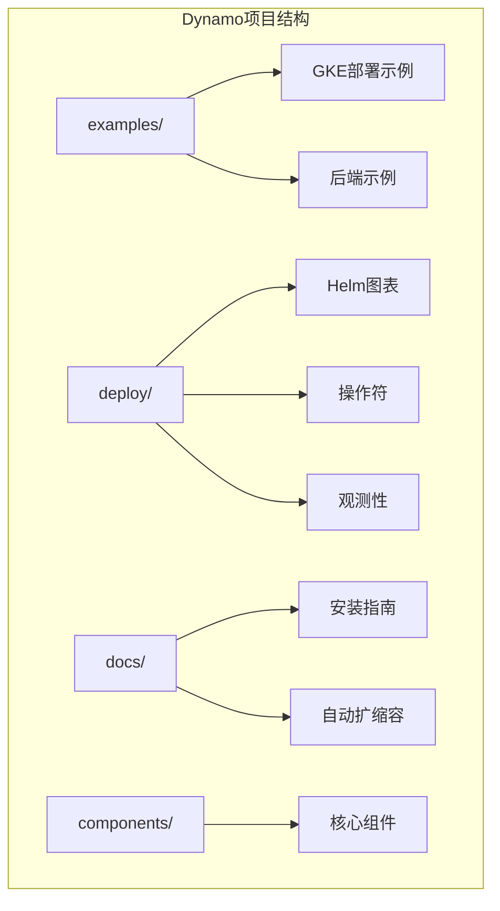
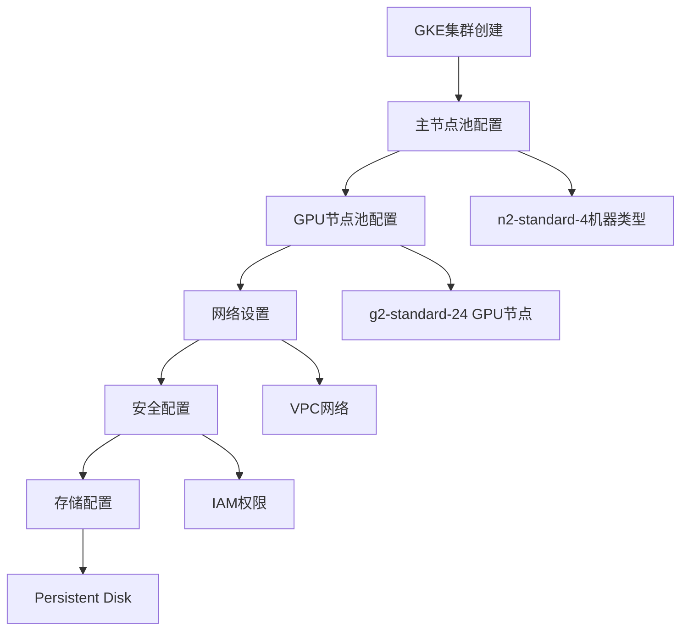
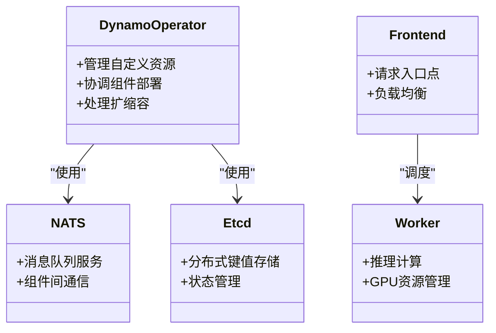
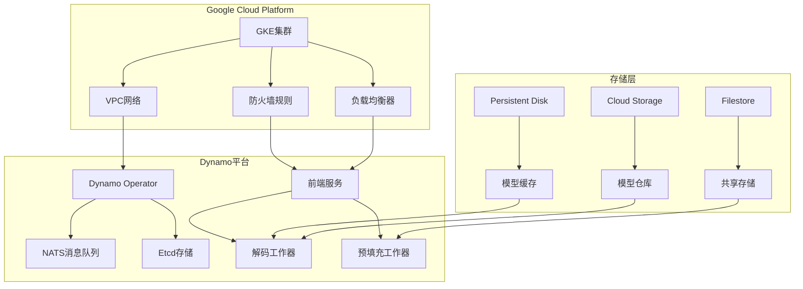
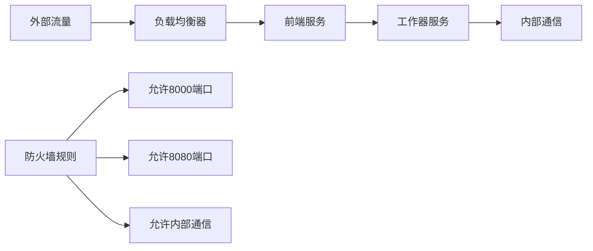
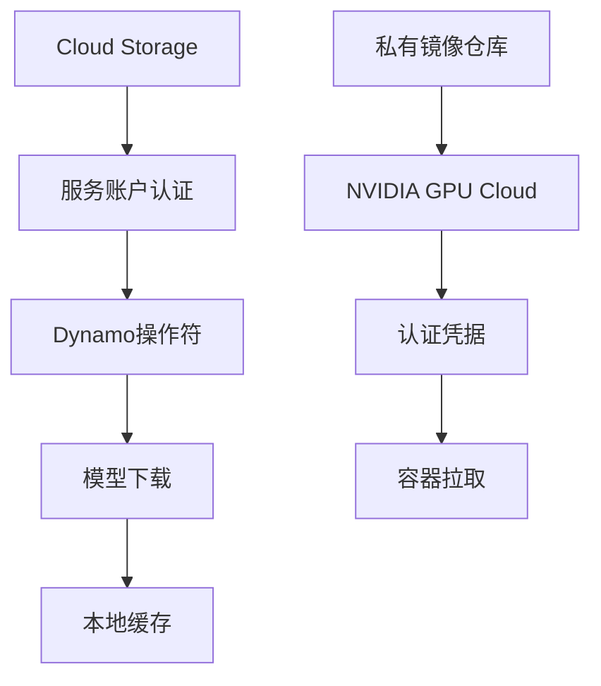
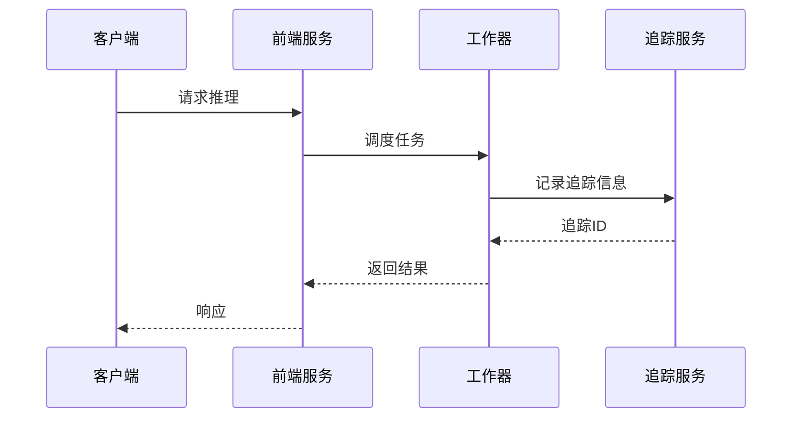
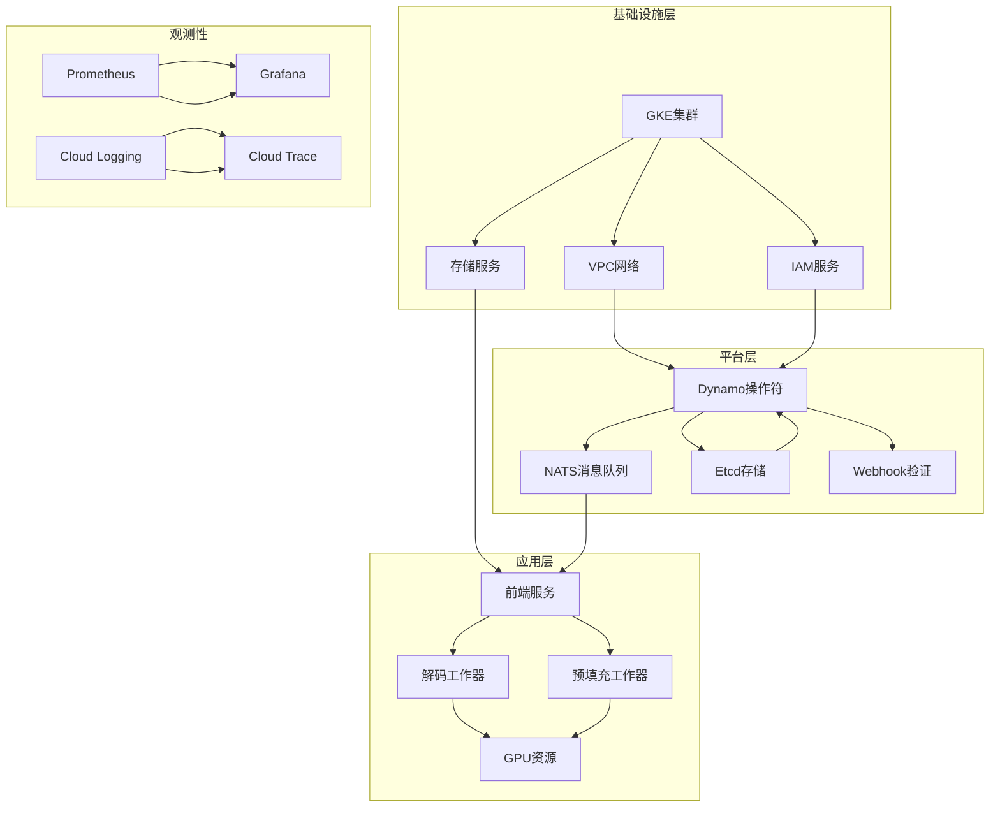
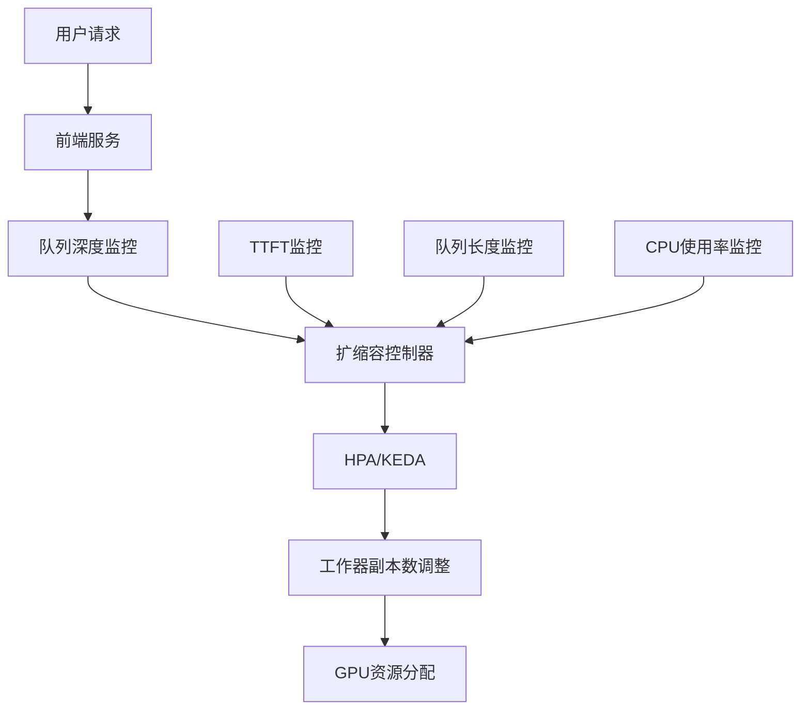
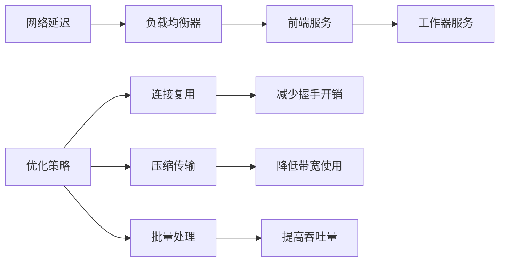

# GKE部署指南

<cite>
**本文档引用的文件**
- [examples/deployments/GKE/README.md](file://examples/deployments/GKE/README.md)
- [docs/kubernetes/installation_guide.md](file://docs/kubernetes/installation_guide.md)
- [deploy/helm/README.md](file://deploy/helm/README.md)
- [deploy/helm/charts/platform/README.md](file://deploy/helm/charts/platform/README.md)
- [deploy/operator/README.md](file://deploy/operator/README.md)
- [docs/kubernetes/autoscaling.md](file://docs/kubernetes/autoscaling.md)
- [deploy/observability/README.md](file://deploy/observability/README.md)
- [tests/fault_tolerance/hardware/fault_injection_service/api_service/main.py](file://tests/fault_tolerance/hardware/fault_injection_service/api_service/main.py)
- [deploy/operator/internal/controller/dynamocomponentdeployment_controller.go](file://deploy/operator/internal/controller/dynamocomponentdeployment_controller.go)
- [deploy/operator/api/v1alpha1/dynamocomponentdeployment_types.go](file://deploy/operator/api/v1alpha1/dynamocomponentdeployment_types.go)
</cite>

## 目录
1. [简介](#简介)
2. [项目结构](#项目结构)
3. [核心组件](#核心组件)
4. [架构概览](#架构概览)
5. [详细组件分析](#详细组件分析)
6. [依赖关系分析](#依赖关系分析)
7. [性能考虑](#性能考虑)
8. [故障排除指南](#故障排除指南)
9. [结论](#结论)
10. [附录](#附录)

## 简介

本指南为在Google Kubernetes Engine (GKE)上部署Dynamo平台提供了全面的技术文档。Dynamo是一个用于大规模语言模型推理的分布式系统，通过解耦前处理和解码阶段实现高效的资源利用。

本指南涵盖了从GKE集群创建到生产环境部署的完整流程，包括：
- GKE集群的创建和配置
- Google Cloud特定的网络配置和安全设置
- GPU节点池的配置和管理
- 持久化存储的集成使用
- Helm图表的部署和配置
- 自动扩缩容策略的实施
- 观测性（监控、日志、追踪）的配置
- 多区域部署和成本管理策略

## 项目结构

Dynamo项目采用模块化设计，主要包含以下关键目录：



**图表来源**
- [examples/deployments/GKE/README.md](file://examples/deployments/GKE/README.md#L1-L189)
- [deploy/helm/README.md](file://deploy/helm/README.md#L1-L23)

**章节来源**
- [examples/deployments/GKE/README.md](file://examples/deployments/GKE/README.md#L1-L189)
- [deploy/helm/README.md](file://deploy/helm/README.md#L1-L23)

## 核心组件

### GKE集群配置

Dynamo在GKE上的部署需要专门的集群配置，特别是GPU节点支持：



**图表来源**
- [examples/deployments/GKE/README.md](file://examples/deployments/GKE/README.md#L8-L46)

### Dynamo平台组件

Dynamo平台由多个核心组件组成：



**图表来源**
- [deploy/helm/charts/platform/README.md](file://deploy/helm/charts/platform/README.md#L26-L33)
- [deploy/operator/README.md](file://deploy/operator/README.md#L1-L37)

**章节来源**
- [examples/deployments/GKE/README.md](file://examples/deployments/GKE/README.md#L8-L46)
- [deploy/helm/charts/platform/README.md](file://deploy/helm/charts/platform/README.md#L26-L33)
- [deploy/operator/README.md](file://deploy/operator/README.md#L1-L37)

## 架构概览

Dynamo在GKE上的整体架构如下：



**图表来源**
- [examples/deployments/GKE/README.md](file://examples/deployments/GKE/README.md#L10-L46)
- [docs/kubernetes/installation_guide.md](file://docs/kubernetes/installation_guide.md#L133-L149)

## 详细组件分析

### GKE集群创建和配置

#### 主节点池配置

GKE集群的创建需要指定适当的机器类型和磁盘大小：

```bash
# 创建GKE集群
gcloud container clusters create ${CLUSTER_NAME} \
    --project=${PROJECT_ID} \
    --location=${ZONE} \
    --subnetwork=default \
    --disk-size=${DISK_SIZE} \
    --machine-type=${CLUSTER_MACHINE_TYPE} \
    --num-nodes=${CPU_NODE}
```

#### GPU节点池配置

对于GPU加速推理，需要创建专门的GPU节点池：

```bash
# 创建GPU节点池
gcloud container node-pools create gpu-pool \
    --accelerator type=${GPU_TYPE},count=${GPU_COUNT},gpu-driver-version=latest \
    --project=${PROJECT_ID} \
    --location=${ZONE} \
    --cluster=${CLUSTER_NAME} \
    --machine-type=${NODE_POOL_MACHINE_TYPE} \
    --disk-size=${DISK_SIZE} \
    --num-nodes=${GPU_NODE} \
    --enable-autoscaling \
    --min-nodes=1 \
    --max-nodes=3
```

**章节来源**
- [examples/deployments/GKE/README.md](file://examples/deployments/GKE/README.md#L10-L46)

### Helm图表部署

#### 平台图表安装

Dynamo平台通过Helm图表进行部署：

```bash
# 安装CRDs
helm fetch https://helm.ngc.nvidia.com/nvidia/ai-dynamo/charts/dynamo-crds-${RELEASE_VERSION}.tgz
helm install dynamo-crds dynamo-crds-${RELEASE_VERSION}.tgz --namespace default

# 安装平台
helm fetch https://helm.ngc.nvidia.com/nvidia/ai-dynamo/charts/dynamo-platform-${RELEASE_VERSION}.tgz
helm install dynamo-platform dynamo-platform-${RELEASE_VERSION}.tgz --namespace ${NAMESPACE} --create-namespace
```

#### 图表配置选项

Helm图表提供了丰富的配置选项：

| 配置项 | 默认值 | 描述 |
|--------|--------|------|
| `dynamo-operator.enabled` | `true` | 是否启用Dynamo操作符 |
| `dynamo-operator.namespaceRestriction.enabled` | `false` | 是否限制操作符命名空间 |
| `etcd.enabled` | `true` | 是否启用etcd |
| `nats.enabled` | `true` | 是否启用NATS |
| `grove.enabled` | `false` | 是否启用Grove多节点协调 |
| `kai-scheduler.enabled` | `false` | 是否启用Kai调度器 |

**章节来源**
- [docs/kubernetes/installation_guide.md](file://docs/kubernetes/installation_guide.md#L133-L149)
- [deploy/helm/charts/platform/README.md](file://deploy/helm/charts/platform/README.md#L95-L167)

### 自动扩缩容配置

#### 基于KEDA的事件驱动扩缩容

Dynamo支持多种扩缩容策略，推荐使用KEDA进行事件驱动扩缩容：

```yaml
apiVersion: keda.sh/v1alpha1
kind: ScaledObject
metadata:
  name: sglang-agg-decode-scaler
spec:
  scaleTargetRef:
    apiVersion: nvidia.com/v1alpha1
    kind: DynamoGraphDeploymentScalingAdapter
    name: sglang-agg-decode
  minReplicaCount: 1
  maxReplicaCount: 10
  pollingInterval: 15
  triggers:
  - type: prometheus
    metadata:
      serverAddress: http://prometheus-kube-prometheus-prometheus.monitoring.svc:9090
      metricName: dynamo_ttft_p95
      query: |
        histogram_quantile(0.95,
          sum(rate(dynamo_frontend_time_to_first_token_seconds_bucket{dynamo_namespace="default-sglang-agg"}[5m]))
          by (le)
        )
      threshold: "0.5"
```

#### 基于HPA的资源基础扩缩容

对于简单的CPU或内存使用率扩缩容：

```yaml
apiVersion: autoscaling/v2
kind: HorizontalPodAutoscaler
metadata:
  name: sglang-agg-frontend-hpa
spec:
  scaleTargetRef:
    apiVersion: nvidia.com/v1alpha1
    kind: DynamoGraphDeploymentScalingAdapter
    name: sglang-agg-frontend
  minReplicas: 1
  maxReplicas: 10
  metrics:
  - type: Resource
    resource:
      name: cpu
      target:
        type: Utilization
        averageUtilization: 70
```

**章节来源**
- [docs/kubernetes/autoscaling.md](file://docs/kubernetes/autoscaling.md#L381-L470)
- [docs/kubernetes/autoscaling.md](file://docs/kubernetes/autoscaling.md#L175-L214)

### 网络配置和安全

#### 防火墙规则配置

Dynamo需要适当的防火墙规则来确保组件间的通信：



#### 网络策略

Dynamo支持基于NetworkPolicy的安全隔离：

```python
# 构建NetworkPolicy规则
policy = client.V1NetworkPolicy(
    spec=client.V1NetworkPolicySpec(
        pod_selector=client.V1LabelSelector(match_labels=target_labels),
        policy_types=["Egress", "Ingress"],
        egress=[
            client.V1NetworkPolicyEgressRule(
                ports=[client.V1NetworkPolicyPort(protocol="UDP", port=53)],
                to=[client.V1NetworkPolicyPeer(
                    namespace_selector=client.V1LabelSelector(
                        match_labels={"kubernetes.io/metadata.name": "kube-system"}
                    )
                )]
            )
        ]
    )
)
```

**章节来源**
- [tests/fault_tolerance/hardware/fault_injection_service/api_service/main.py](file://tests/fault_tolerance/hardware/fault_injection_service/api_service/main.py#L685-L770)

### 存储集成

#### Persistent Disk配置

Dynamo使用Persistent Disk进行模型缓存和临时数据存储：

```yaml
apiVersion: v1
kind: PersistentVolumeClaim
metadata:
  name: model-cache-pvc
spec:
  accessModes:
    - ReadWriteOnce
  resources:
    requests:
      storage: 100Gi
  storageClassName: pd-ssd
```

#### Cloud Storage集成

模型文件可以存储在Cloud Storage中，通过服务账户访问：



**章节来源**
- [examples/deployments/GKE/README.md](file://examples/deployments/GKE/README.md#L66-L70)

### 观测性配置

#### Prometheus和Grafana

Dynamo提供完整的观测性栈配置：

```yaml
# Prometheus配置
prometheus:
  url: http://prometheus-kube-prometheus-prometheus.monitoring.svc
  port: 9090

# Grafana仪表板
grafana-datasources.yml:
  - name: prometheus
    type: prometheus
    uid: prometheus
    access: proxy
    orgId: 1
    url: http://prometheus-kube-prometheus-prometheus.monitoring.svc:9090
```

#### 日志和追踪



**章节来源**
- [deploy/observability/README.md](file://deploy/observability/README.md#L1-L4)

## 依赖关系分析

### 组件依赖图



**图表来源**
- [deploy/helm/charts/platform/README.md](file://deploy/helm/charts/platform/README.md#L26-L33)
- [docs/kubernetes/installation_guide.md](file://docs/kubernetes/installation_guide.md#L133-L149)

### 扩缩容依赖关系



**图表来源**
- [docs/kubernetes/autoscaling.md](file://docs/kubernetes/autoscaling.md#L51-L70)

**章节来源**
- [deploy/helm/charts/platform/README.md](file://deploy/helm/charts/platform/README.md#L83-L167)
- [docs/kubernetes/autoscaling.md](file://docs/kubernetes/autoscaling.md#L1-L732)

## 性能考虑

### GPU资源优化

Dynamo在GKE上的GPU资源优化策略：

1. **GPU节点池配置**：使用合适的GPU类型和数量
2. **资源请求和限制**：为GPU工作器设置精确的资源配额
3. **亲和性和容忍度**：确保GPU工作器调度到正确的节点

### 网络性能优化



### 存储性能优化

1. **Persistent Disk选择**：根据IOPS需求选择合适的磁盘类型
2. **缓存策略**：合理配置模型缓存和临时文件存储
3. **并行访问**：优化多个工作器的存储访问模式

## 故障排除指南

### 常见问题诊断

#### 集群部署问题

```bash
# 检查CRD状态
kubectl get crd | grep dynamo

# 检查操作符状态
kubectl get pods -n dynamo-system

# 查看操作符日志
kubectl logs -n dynamo-system deployment/dynamo-operator
```

#### 扩缩容问题

```bash
# 检查扩缩容适配器
kubectl get dgdsa -n default

# 检查HPA状态
kubectl describe hpa sglang-agg-decode-hpa

# 检查KEDA状态
kubectl describe scaledobject sglang-agg-decode-scaler
```

#### 网络问题

```bash
# 检查NetworkPolicy
kubectl get networkpolicy -A

# 检查服务连通性
kubectl run test-pod --image=busybox --rm -it -- wget frontend-service:8000
```

**章节来源**
- [docs/kubernetes/installation_guide.md](file://docs/kubernetes/installation_guide.md#L297-L357)

### 性能调优建议

1. **监控指标**：关注TTFT、ITL、队列深度等关键指标
2. **资源调整**：根据实际负载调整GPU和CPU资源配置
3. **缓存优化**：合理设置模型缓存大小和过期策略
4. **网络优化**：使用连接池和请求批处理减少网络开销

## 结论

Dynamo在GKE上的部署提供了企业级的LLM推理解决方案。通过合理的集群配置、存储集成和观测性设置，可以构建高性能、可扩展的推理平台。

关键成功因素包括：
- 正确的GKE集群配置和GPU节点池设置
- 适当的Helm图表配置和命名空间管理
- 基于KEDA的智能扩缩容策略
- 完整的观测性栈配置
- 安全的网络和存储访问控制

## 附录

### 快速部署命令

```bash
# 1. 设置环境变量
export PROJECT_ID=your-project-id
export CLUSTER_NAME=dynamo-cluster
export ZONE=us-central1-a
export NAMESPACE=dynamo-system

# 2. 创建GKE集群
gcloud container clusters create ${CLUSTER_NAME} \
    --project=${PROJECT_ID} \
    --location=${ZONE} \
    --num-nodes=2

# 3. 创建GPU节点池
gcloud container node-pools create gpu-pool \
    --accelerator type=nvidia-l4,count=2,gpu-driver-version=latest \
    --project=${PROJECT_ID} \
    --location=${ZONE} \
    --cluster=${CLUSTER_NAME} \
    --machine-type=g2-standard-24 \
    --num-nodes=2

# 4. 安装Dynamo平台
helm install dynamo-platform oci://ghcr.io/nvidia/dynamo/dynamo-platform \
    --namespace ${NAMESPACE} --create-namespace
```

### 监控和告警

```yaml
# Prometheus告警规则示例
groups:
- name: dynamo-alerts
  rules:
  - alert: HighTTFT
    expr: dynamo_frontend_time_to_first_token_seconds{quantile="0.95"} > 1.0
    for: 5m
    labels:
      severity: warning
    annotations:
      summary: "高延迟检测"
      description: "95分位TTFT超过1秒"
```