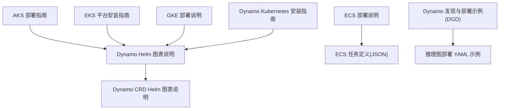
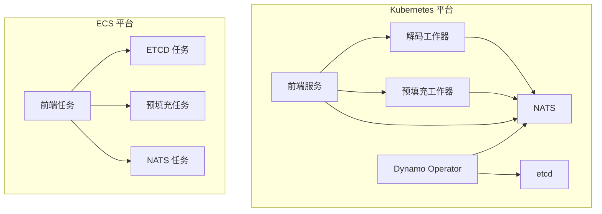
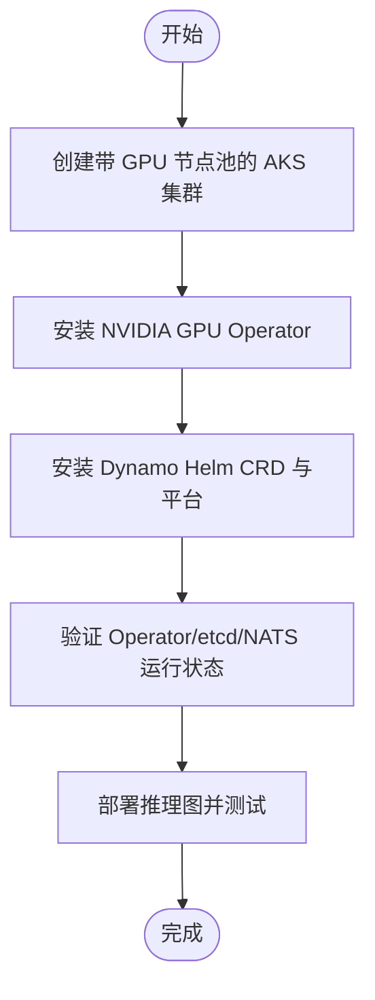
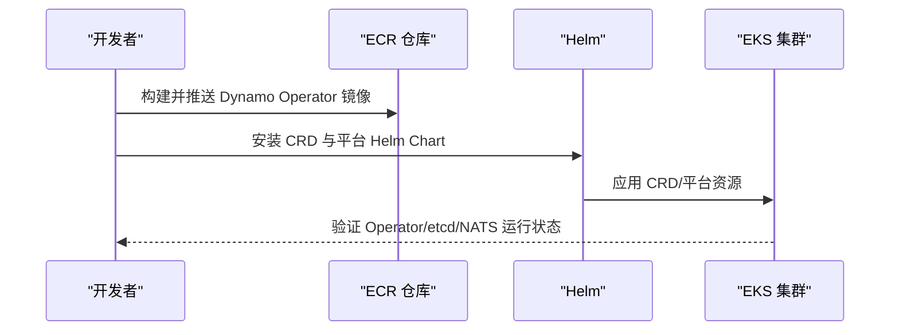
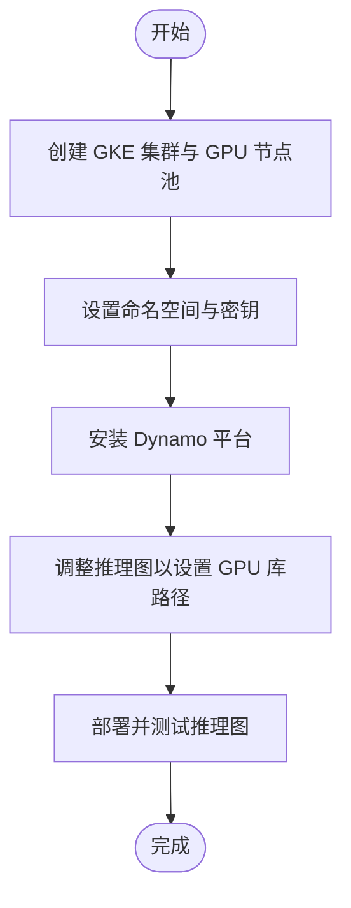
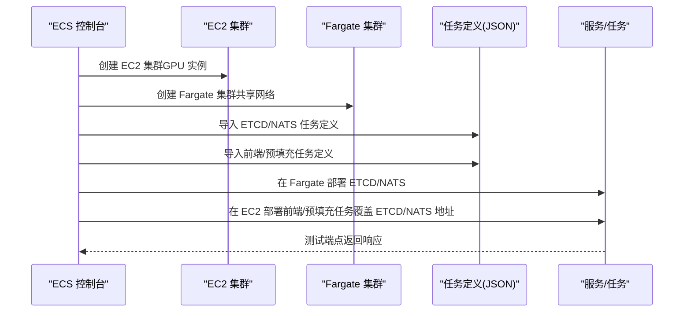
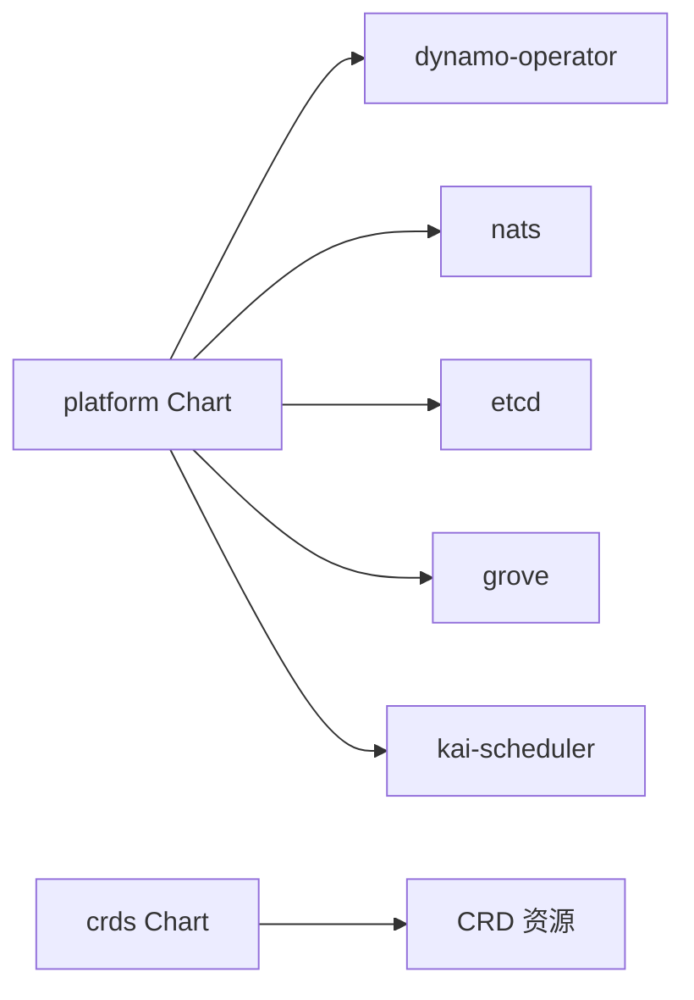

# 云平台集成

<cite>
**本文引用的文件**
- [AKS 部署指南](file://examples/deployments/AKS/AKS-deployment.md)
- [EKS 平台安装指南](file://examples/deployments/EKS/Deploy_Dynamo_Kubernetes_Platform.md)
- [GKE 部署说明](file://examples/deployments/GKE/README.md)
- [ECS 部署说明](file://examples/deployments/ECS/README.md)
- [Dynamo Kubernetes 安装指南](file://docs/kubernetes/installation_guide.md)
- [Dynamo Helm 图表说明](file://deploy/helm/charts/platform/README.md)
- [Dynamo CRD Helm 图表说明](file://deploy/helm/charts/crds/README.md)
- [Dynamo Helm 总览](file://deploy/helm/README.md)
- [Dynamo 发现与部署示例](file://deploy/discovery/dgd.yaml)
- [ECS ETCD/NATS 任务定义](file://examples/deployments/ECS/task_definition_etcd_nats.json)
- [ECS 前端任务定义](file://examples/deployments/ECS/task_definition_frontend.json)
- [ECS 预填充工作器任务定义](file://examples/deployments/ECS/task_definition_prefillworker.json)
</cite>

## 目录
1. [简介](#简介)
2. [项目结构](#项目结构)
3. [核心组件](#核心组件)
4. [架构总览](#架构总览)
5. [详细组件分析](#详细组件分析)
6. [依赖关系分析](#依赖关系分析)
7. [性能考虑](#性能考虑)
8. [故障排查指南](#故障排查指南)
9. [结论](#结论)
10. [附录](#附录)

## 简介
本指南面向在 AKS（Azure Kubernetes Service）、EKS（Amazon EKS）、GKE（Google Kubernetes Engine）与 ECS（Elastic Container Service）上部署 Dynamo 的工程师与运维人员。内容覆盖集群准备、GPU 驱动与运行时、Operator 与基础设施组件（NATS、etcd）安装、推理图（Inference Graph）部署、网络与存储配置、安全策略、自动扩缩容与负载均衡、监控集成、多区域与高可用、以及故障排查与性能调优。

## 项目结构
围绕云平台集成，仓库中与部署密切相关的目录与文件包括：
- examples/deployments：各云平台的部署步骤与示例
- deploy/helm：Dynamo 平台 Helm 图表与 CRD
- docs/kubernetes：Kubernetes 安装与操作指南
- deploy/discovery：推理图部署示例（DynamoGraphDeployment）

**图表来源**
- [Dynamo Helm 总览](file://deploy/helm/README.md#L1-L23)
- [Dynamo Helm 图表说明](file://deploy/helm/charts/platform/README.md#L1-L187)
- [Dynamo CRD Helm 图表说明](file://deploy/helm/charts/crds/README.md#L1-L20)
- [Dynamo Kubernetes 安装指南](file://docs/kubernetes/installation_guide.md#L1-L386)
- [Dynamo 发现与部署示例](file://deploy/discovery/dgd.yaml#L1-L59)
- [ECS 部署说明](file://examples/deployments/ECS/README.md#L1-L129)
- [ECS ETCD/NATS 任务定义](file://examples/deployments/ECS/task_definition_etcd_nats.json#L1-L112)
- [ECS 前端任务定义](file://examples/deployments/ECS/task_definition_frontend.json#L1-L79)
- [ECS 预填充工作器任务定义](file://examples/deployments/ECS/task_definition_prefillworker.json#L1-L71)

**章节来源**
- [Dynamo Helm 总览](file://deploy/helm/README.md#L1-L23)
- [Dynamo Helm 图表说明](file://deploy/helm/charts/platform/README.md#L1-L187)
- [Dynamo CRD Helm 图表说明](file://deploy/helm/charts/crds/README.md#L1-L20)
- [Dynamo Kubernetes 安装指南](file://docs/kubernetes/installation_guide.md#L1-L386)
- [Dynamo 发现与部署示例](file://deploy/discovery/dgd.yaml#L1-L59)
- [ECS 部署说明](file://examples/deployments/ECS/README.md#L1-L129)

## 核心组件
- Dynamo Operator：管理 DynamoGraphDeployment、DynamoComponentDeployment 等资源的控制器，负责编排推理图生命周期。
- NATS：高性能消息系统，用于组件间通信。
- etcd：分布式键值存储，保存 Operator 状态与元数据。
- Grove/Kai Scheduler（可选）：多节点推理编排与智能调度。
- 推理图（DynamoGraphDeployment）：声明式描述前端、预填充/解码工作器等组件及其资源与拓扑。

**章节来源**
- [Dynamo Helm 图表说明](file://deploy/helm/charts/platform/README.md#L24-L33)
- [Dynamo Kubernetes 安装指南](file://docs/kubernetes/installation_guide.md#L133-L207)

## 架构总览
下图展示 Dynamo 在 Kubernetes 上的典型部署形态，以及在 ECS 上以任务形式运行的关键组件。

**图表来源**
- [Dynamo Helm 图表说明](file://deploy/helm/charts/platform/README.md#L24-L33)
- [ECS 部署说明](file://examples/deployments/ECS/README.md#L1-L129)
- [ECS ETCD/NATS 任务定义](file://examples/deployments/ECS/task_definition_etcd_nats.json#L1-L112)
- [ECS 前端任务定义](file://examples/deployments/ECS/task_definition_frontend.json#L1-L79)
- [ECS 预填充工作器任务定义](file://examples/deployments/ECS/task_definition_prefillworker.json#L1-L71)

## 详细组件分析

### AKS（Azure Kubernetes Service）
- 集群与 GPU 节点池：使用 GPU 加速节点池，并跳过节点级驱动安装，由 NVIDIA GPU Operator 统一管理。
- NVIDIA GPU Operator：自动化安装驱动、容器工具链、设备插件与监控。
- 安装 Dynamo Operator 与基础设施：参考平台安装指南，验证 Operator、etcd、NATS Pod 正常运行。
- 模型部署与测试：按“部署模型/工作流”指引进行。

**图表来源**
- [AKS 部署指南](file://examples/deployments/AKS/AKS-deployment.md#L14-L56)
- [Dynamo Kubernetes 安装指南](file://docs/kubernetes/installation_guide.md#L133-L207)

**章节来源**
- [AKS 部署指南](file://examples/deployments/AKS/AKS-deployment.md#L1-L79)
- [Dynamo Kubernetes 安装指南](file://docs/kubernetes/installation_guide.md#L1-L386)

### EKS（Amazon EKS）
- 从源码构建与推送镜像：创建 ECR 仓库，构建并推送 Dynamo Operator 与运行时镜像。
- 准备镜像拉取密钥与 HuggingFace Token 密钥。
- 安装 CRD 与平台：通过 Helm 安装 CRD 与平台，设置 Operator 镜像与拉取密钥。
- 验证：检查 Operator、etcd、NATS Pod 状态。

**图表来源**
- [EKS 平台安装指南](file://examples/deployments/EKS/Deploy_Dynamo_Kubernetes_Platform.md#L3-L96)
- [Dynamo Helm 图表说明](file://deploy/helm/charts/platform/README.md#L95-L167)

**章节来源**
- [EKS 平台安装指南](file://examples/deployments/EKS/Deploy_Dynamo_Kubernetes_Platform.md#L1-L96)
- [Dynamo Helm 图表说明](file://deploy/helm/charts/platform/README.md#L1-L187)

### GKE（Google Kubernetes Engine）
- 集群与 GPU 节点池：创建带 GPU 加速器的节点池，启用自动伸缩。
- 设置命名空间与 HuggingFace Token 密钥。
- 安装 Dynamo 平台：参考安装指南，验证 Operator、etcd、NATS。
- 推理图部署：调整 LD_LIBRARY_PATH/PATH 以适配 GKE GPU 驱动路径；部署后进行连通性测试。

**图表来源**
- [GKE 部署说明](file://examples/deployments/GKE/README.md#L8-L112)
- [Dynamo Kubernetes 安装指南](file://docs/kubernetes/installation_guide.md#L133-L207)

**章节来源**
- [GKE 部署说明](file://examples/deployments/GKE/README.md#L1-L189)
- [Dynamo Kubernetes 安装指南](file://docs/kubernetes/installation_guide.md#L1-L386)

### ECS（Elastic Container Service）
- EC2 集群：用于 vLLM 工作负载，选择带 GPU 的 ECS 优化 AMI，配置安全组与公网 IP。
- Fargate 集群：用于 ETCD/NATS 等服务，确保与 EC2 集群共享 VPC/子网与安全组。
- 任务定义：分别定义 ETCD/NATS、前端（含路由器/处理器/路由与解码工作器）、预填充工作器任务；设置 ECS 执行角色与日志输出。
- 部署与测试：先部署 ETCD/NATS，获取私有 IP 后在前端/预填充任务中覆盖环境变量，随后进行端到端测试。

**图表来源**
- [ECS 部署说明](file://examples/deployments/ECS/README.md#L1-L129)
- [ECS ETCD/NATS 任务定义](file://examples/deployments/ECS/task_definition_etcd_nats.json#L1-L112)
- [ECS 前端任务定义](file://examples/deployments/ECS/task_definition_frontend.json#L1-L79)
- [ECS 预填充工作器任务定义](file://examples/deployments/ECS/task_definition_prefillworker.json#L1-L71)

**章节来源**
- [ECS 部署说明](file://examples/deployments/ECS/README.md#L1-L129)
- [ECS ETCD/NATS 任务定义](file://examples/deployments/ECS/task_definition_etcd_nats.json#L1-L112)
- [ECS 前端任务定义](file://examples/deployments/ECS/task_definition_frontend.json#L1-L79)
- [ECS 预填充工作器任务定义](file://examples/deployments/ECS/task_definition_prefillworker.json#L1-L71)

## 依赖关系分析
- Helm 图表依赖：平台 Chart 依赖 etcd、NATS、Grove、Kai Scheduler 等子 Chart；CRD Chart 仅安装 CRD。
- Operator 部署模式：支持单集群范围 Operator 或命名空间受限 Operator；安装前会进行冲突检测与安全校验。
- 外部组件：NATS/etcd 可使用内置 Chart 或外部实例；可通过 values 覆盖地址。

**图表来源**
- [Dynamo Helm 图表说明](file://deploy/helm/charts/platform/README.md#L87-L94)
- [Dynamo CRD Helm 图表说明](file://deploy/helm/charts/crds/README.md#L18-L20)

**章节来源**
- [Dynamo Helm 图表说明](file://deploy/helm/charts/platform/README.md#L1-L187)
- [Dynamo CRD Helm 图表说明](file://deploy/helm/charts/crds/README.md#L1-L20)

## 性能考虑
- 自动扩缩容与负载均衡
  - Kubernetes：结合 HPA/VPA、Ingress/LoadBalancer、多节点池与亲和/反亲和策略实现弹性伸缩与流量分发。
  - ECS：利用任务计数与 CPU/内存配额控制资源分配，结合网络模式（awsvpc/host）优化延迟与吞吐。
- 监控与可观测性
  - Prometheus/Grafana：在安装指南中提供启用方式与仪表板配置参考。
  - 日志：ECS 使用 awslogs 输出；Kubernetes 可通过 ConfigMap/日志采集组件统一收集。
- 存储与缓存
  - Kubernetes：持久卷（PVC）与模型缓存（如 Fluid）提升加载性能；注意跨可用区与 IOPS 规划。
  - ECS：根卷大小与宿主机磁盘 I/O；避免频繁重启导致缓存失效。
- 网络
  - Kubernetes：NodePort/LoadBalancer/Ingress；GPU 网络（如 NVLink）需在同一节点或正确拓扑。
  - ECS：awsvpc 模式降低网络开销，host 模式便于直连 GPU 设备。
- 安全
  - Kubernetes：RBAC、准入 Webhook、TLS 证书管理（自管或 cert-manager）、受限安全上下文。
  - ECS：最小权限 IAM 角色、Secrets Manager 访问控制、安全组放通限制。

**章节来源**
- [Dynamo Kubernetes 安装指南](file://docs/kubernetes/installation_guide.md#L188-L206)
- [Dynamo Helm 图表说明](file://deploy/helm/charts/platform/README.md#L126-L149)
- [ECS 部署说明](file://examples/deployments/ECS/README.md#L1-L129)

## 故障排查指南
- 集群与 Operator 冲突
  - 症状：提示无法安装集群范围 Operator，因存在命名空间受限 Operator。
  - 处理：在安装命令中添加命名空间限制参数，或在共享集群中仅保留一个 Operator。
- CRD 已存在
  - 症状：重复安装 CRD 报错。
  - 处理：在共享集群跳过 CRD 安装步骤，直接安装平台。
- Pod 启动失败
  - 排查：查看 Pod 描述与日志，确认镜像拉取、GPU 驱动、资源配额与网络连通性。
- etcd 非受信镜像错误
  - 处理：根据安装指南在 Helm 命令中添加允许非标准镜像的参数。
- 清理卸载
  - 处理：先卸载平台，再逐个删除 CRD；或使用 Helm 卸载命令清理。

**章节来源**
- [Dynamo Kubernetes 安装指南](file://docs/kubernetes/installation_guide.md#L297-L380)

## 结论
通过上述指南，可在 AKS、EKS、GKE 与 ECS 四大云平台上完成 Dynamo 的安装与推理图部署。建议优先采用 Kubernetes 方案以获得更强的编排能力与生态兼容性；若对无服务器与任务编排有强需求，可选择 ECS。结合自动扩缩容、负载均衡与监控体系，可实现高可用与高性能的推理服务。

## 附录
- 配置文件与示例清单
  - 推理图部署示例：[Dynamo 发现与部署示例](file://deploy/discovery/dgd.yaml#L1-L59)
  - ECS 任务定义：
    - [ETCD/NATS 任务定义](file://examples/deployments/ECS/task_definition_etcd_nats.json#L1-L112)
    - [前端任务定义](file://examples/deployments/ECS/task_definition_frontend.json#L1-L79)
    - [预填充工作器任务定义](file://examples/deployments/ECS/task_definition_prefillworker.json#L1-L71)
- Helm 图表与安装
  - [Dynamo Helm 总览](file://deploy/helm/README.md#L1-L23)
  - [Dynamo Helm 图表说明](file://deploy/helm/charts/platform/README.md#L1-L187)
  - [Dynamo CRD Helm 图表说明](file://deploy/helm/charts/crds/README.md#L1-L20)
  - [Dynamo Kubernetes 安装指南](file://docs/kubernetes/installation_guide.md#L1-L386)
- 云平台部署指南
  - [AKS 部署指南](file://examples/deployments/AKS/AKS-deployment.md#L1-L79)
  - [EKS 平台安装指南](file://examples/deployments/EKS/Deploy_Dynamo_Kubernetes_Platform.md#L1-L96)
  - [GKE 部署说明](file://examples/deployments/GKE/README.md#L1-L189)
  - [ECS 部署说明](file://examples/deployments/ECS/README.md#L1-L129)