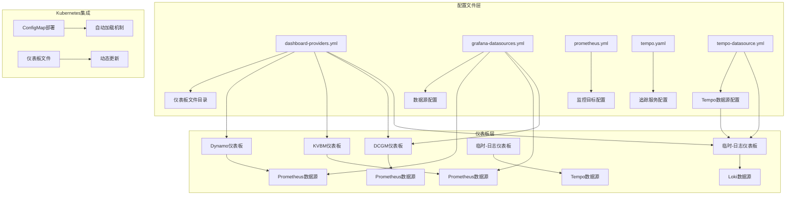
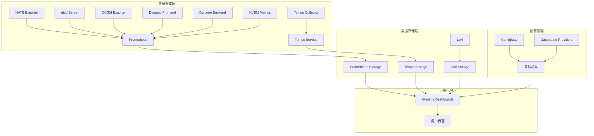
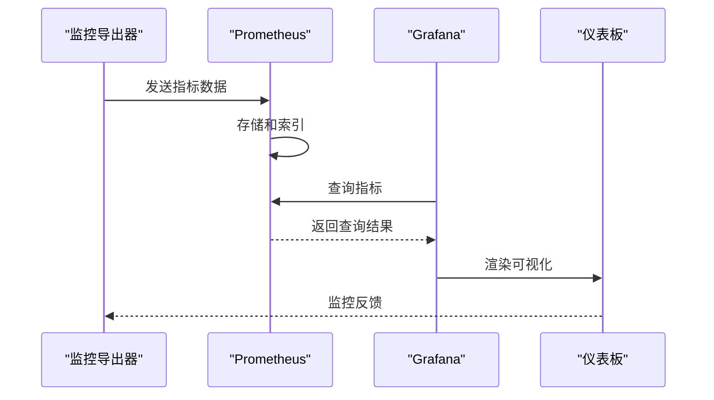
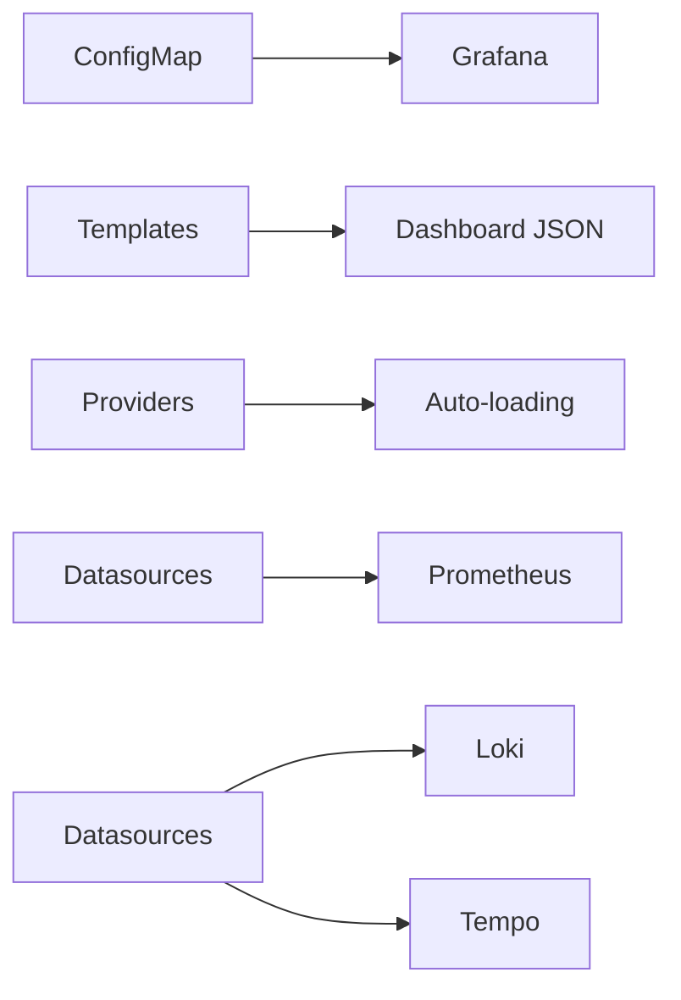

# Grafana仪表板配置

<cite>
**本文档引用的文件**
- [dynamo.json](file://deploy/observability/grafana_dashboards/dynamo.json)
- [dynamo-operator.json](file://deploy/observability/grafana_dashboards/dynamo-operator.json)
- [kvbm.json](file://deploy/observability/grafana_dashboards/kvbm.json)
- [dcgm-metrics.json](file://deploy/observability/grafana_dashboards/dcgm-metrics.json)
- [temp-loki.json](file://deploy/observability/grafana_dashboards/temp-loki.json)
- [dashboard-providers.yml](file://deploy/observability/grafana_dashboards/dashboard-providers.yml)
- [grafana-datasources.yml](file://deploy/observability/grafana-datasources.yml)
- [prometheus.yml](file://deploy/observability/prometheus.yml)
- [tempo.yaml](file://deploy/observability/tempo.yaml)
- [tempo-datasource.yml](file://deploy/observability/tempo-datasource.yml)
- [grafana-dynamo-dashboard-configmap.yaml](file://deploy/observability/k8s/grafana-dynamo-dashboard-configmap.yaml)
- [grafana-operator-dashboard-configmap.yaml](file://deploy/observability/k8s/grafana-operator-dashboard-configmap.yaml)
- [grafana-planner-dashboard-configmap.yaml](file://deploy/observability/k8s/grafana-planner-dashboard-configmap.yaml)
- [README.md](file://deploy/observability/README.md)
</cite>

## 目录
1. [简介](#简介)
2. [项目结构](#项目结构)
3. [核心组件](#核心组件)
4. [架构概览](#架构概览)
5. [详细组件分析](#详细组件分析)
6. [依赖关系分析](#依赖关系分析)
7. [性能考虑](#性能考虑)
8. [故障排除指南](#故障排除指南)
9. [结论](#结论)
10. [附录](#附录)

## 简介

本文件为Dynamo项目的Grafana仪表板系统提供全面的配置文档。Dynamo是一个高性能的大语言模型推理平台，其可观测性系统集成了Prometheus监控、Tempo分布式追踪和Loki日志聚合，通过多个专用仪表板提供端到端的系统监控能力。

该系统包含四个主要仪表板：
- **Dynamo操作器仪表板**：监控Dynamo Operator的运行状态和资源管理
- **KVBM仪表板**：专门监控键值缓存管理器(KVBM)的缓存命中率和数据传输
- **DCGM指标仪表板**：展示GPU硬件级别的详细指标
- **临时-日志仪表板**：提供基于Tempo的分布式追踪和Loki的日志查询功能

## 项目结构

Dynamo的Grafana仪表板配置采用模块化设计，分为以下层次：

**图表来源**
- [dashboard-providers.yml](file://deploy/observability/grafana_dashboards/dashboard-providers.yml#L18-L29)
- [grafana-datasources.yml](file://deploy/observability/grafana-datasources.yml#L18-L24)
- [prometheus.yml](file://deploy/observability/prometheus.yml#L20-L63)

**章节来源**
- [dashboard-providers.yml](file://deploy/observability/grafana_dashboards/dashboard-providers.yml#L16-L29)
- [grafana-datasources.yml](file://deploy/observability/grafana-datasources.yml#L16-L24)
- [prometheus.yml](file://deploy/observability/prometheus.yml#L16-L63)

## 核心组件

### 数据源配置

Dynamo使用统一的数据源配置来管理所有监控数据源：

#### Prometheus数据源配置
- **名称**: prometheus
- **类型**: prometheus
- **访问模式**: proxy
- **URL**: http://prometheus:9090
- **默认数据源**: 是

#### Tempo数据源配置
- **名称**: Tempo
- **类型**: tempo
- **访问模式**: proxy
- **URL**: http://tempo:3200
- **UID**: tempo
- **功能特性**: 
  - HTTP方法: GET
  - 服务映射: 启用
  - 搜索功能: 可见
  - 节点图: 启用
  - 时间偏移: 支持

**章节来源**
- [grafana-datasources.yml](file://deploy/observability/grafana-datasources.yml#L18-L24)
- [tempo-datasource.yml](file://deploy/observability/tempo-datasource.yml#L6-L28)

### 监控目标配置

Prometheus配置文件定义了多个监控目标：

#### NATS监控
- **作业名称**: nats-prometheus-exporter
- **抓取间隔**: 2秒
- **目标**: nats-prometheus-exporter:7777

#### etcd监控
- **作业名称**: etcd-server
- **抓取间隔**: 2秒
- **目标**: etcd-server:2379

#### DCGM监控
- **作业名称**: dcgm-exporter
- **抓取间隔**: 5秒
- **目标**: dcgm-exporter:9401

#### Dynamo前端监控
- **作业名称**: dynamo-frontend
- **抓取间隔**: 10秒
- **目标**: host.docker.internal:8000

#### Dynamo后端监控
- **作业名称**: dynamo-backend
- **抓取间隔**: 6秒
- **目标**: host.docker.internal:8081

#### KVBM监控
- **作业名称**: kvbm-metrics
- **抓取间隔**: 2秒
- **目标**: host.docker.internal:6880

**章节来源**
- [prometheus.yml](file://deploy/observability/prometheus.yml#L20-L63)

### 仪表板提供者配置

仪表板提供者配置确保Grafana能够自动发现和加载仪表板文件：

- **提供者名称**: default
- **组织ID**: 1
- **文件夹**: 空字符串
- **类型**: file
- **删除权限**: 禁用
- **更新间隔**: 10秒
- **UI更新**: 允许
- **路径**: /etc/grafana/provisioning/dashboards
- **文件夹结构**: 启用

**章节来源**
- [dashboard-providers.yml](file://deploy/observability/grafana_dashboards/dashboard-providers.yml#L18-L29)

## 架构概览

Dynamo的可观测性架构采用分层设计，实现了监控、追踪和日志的统一管理：

**图表来源**
- [prometheus.yml](file://deploy/observability/prometheus.yml#L20-L63)
- [tempo.yaml](file://deploy/observability/tempo.yaml#L4-L37)
- [dashboard-providers.yml](file://deploy/observability/grafana_dashboards/dashboard-providers.yml#L18-L29)

## 详细组件分析

### Dynamo操作器仪表板

Dynamo操作器仪表板专注于监控Dynamo Operator的运行状态，包含三个主要区域：

#### 重新协调指标
- **重新协调速率**: 显示每秒重新协调次数，按资源类型和结果分类
- **重新协调持续时间(P95)**: 展示95百分位的协调时间
- **重新协调错误**: 按资源类型和错误类型统计错误率

#### Webhook指标
- **Webhook请求速率**: 按资源类型、操作和结果分类
- **Webhook验证持续时间(P95)**: 展示95百分位的验证时间
- **Webhook拒绝**: 按资源类型、操作和原因分类

#### 资源库存指标
- **资源库存状态**: 按资源类型、命名空间和状态分类
- **当前资源计数**: 实时显示各状态下的资源数量

**章节来源**
- [dynamo-operator.json](file://deploy/observability/grafana_dashboards/dynamo-operator.json#L24-L800)

### KVBM仪表板

KVBM(KV缓存管理器)仪表板专门监控键值缓存系统的性能：

#### 缓存命中率
- **主机缓存命中率**: 显示主机内存缓存的命中效率
- **磁盘缓存命中率**: 显示磁盘缓存的命中效率

#### 数据传输指标
- **匹配令牌**: 显示成功匹配的令牌数量
- **卸载块**: 按方向分类的块传输统计
  - 设备到主机: 设备内存与主机内存之间的数据传输
  - 主机到磁盘: 主机内存与磁盘之间的数据传输
  - 设备到磁盘(绕过主机): 直接设备到磁盘的数据传输

#### 上载块
- **主机到设备**: 主机内存与设备内存之间的数据传输
- **设备到磁盘**: 设备内存与磁盘之间的数据传输

**章节来源**
- [kvbm.json](file://deploy/observability/grafana_dashboards/kvbm.json#L24-L800)

### DCGM指标仪表板

DCGM(DCGM Exporter)仪表板提供GPU硬件级别的详细监控：

#### GPU利用率
- **GPU利用率**: 显示每个GPU的利用率百分比
- **GPU温度**: 显示GPU核心温度和显存温度
- **GPU功耗**: 显示GPU实时功耗

#### 内存使用情况
- **GPU显存使用**: 显示已用和可用显存大小
- **GPU显存温度**: 显示显存温度

#### 性能指标
- **GPU时钟频率**: 显示SM时钟和内存时钟频率
- **GPU引擎活动**: 显示图形引擎和张量核心的活动状态
- **PCIe带宽**: 显示PCIe总线的接收和发送带宽

#### 统计指标
- **平均GPU利用率**: 显示所有GPU的平均利用率
- **利用率分布**: 提供利用率的分布统计

**章节来源**
- [dcgm-metrics.json](file://deploy/observability/grafana_dashboards/dcgm-metrics.json#L24-L800)

### 临时-日志仪表板

临时-日志仪表板整合了Tempo分布式追踪和Loki日志查询功能：

#### 日志查询面板
- **数据源**: Loki
- **配置选项**:
  - 去重策略: 无
  - 滚动加载: 禁用
  - 日志详情: 启用
  - 消息美化: 禁用
  - 标签显示: 禁用
  - 时间显示: 禁用
  - 排序方式: 降序

#### 查询参数
- **命名空间过滤**: 支持多选过滤
- **DynamoGraph部署过滤**: 支持多选过滤
- **组件类型过滤**: 支持多选过滤
- **搜索文本**: 支持文本搜索
- **追踪ID**: 支持追踪ID过滤

#### 时间范围
- **默认范围**: 最近6小时
- **浏览器时区**: 自动检测

**章节来源**
- [temp-loki.json](file://deploy/observability/grafana_dashboards/temp-loki.json#L22-L215)

## 依赖关系分析

### 数据流依赖

**图表来源**
- [prometheus.yml](file://deploy/observability/prometheus.yml#L20-L63)
- [grafana-datasources.yml](file://deploy/observability/grafana-datasources.yml#L18-L24)

### 配置依赖

仪表板配置之间存在以下依赖关系：

1. **模板变量依赖**: 多个仪表板使用相同的模板变量
2. **数据源依赖**: 所有仪表板都依赖Prometheus数据源
3. **配置映射依赖**: ConfigMap中的仪表板文件映射到Grafana

**图表来源**
- [grafana-dynamo-dashboard-configmap.yaml](file://deploy/observability/k8s/grafana-dynamo-dashboard-configmap.yaml#L1-L1009)
- [dashboard-providers.yml](file://deploy/observability/grafana_dashboards/dashboard-providers.yml#L18-L29)

**章节来源**
- [grafana-dynamo-dashboard-configmap.yaml](file://deploy/observability/k8s/grafana-dynamo-dashboard-configmap.yaml#L1-L1009)
- [grafana-operator-dashboard-configmap.yaml](file://deploy/observability/k8s/grafana-operator-dashboard-configmap.yaml#L1-L1040)
- [grafana-planner-dashboard-configmap.yaml](file://deploy/observability/k8s/grafana-planner-dashboard-configmap.yaml#L1-L1526)

## 性能考虑

### 监控目标配置优化

1. **抓取间隔调优**
   - 高频指标(如NATS、etcd)使用2秒间隔
   - 中频指标(如DCGM)使用5秒间隔
   - 低频指标(如Dynamo前端)使用10秒间隔

2. **数据保留策略**
   - Prometheus默认保留15天数据
   - Tempo追踪数据保留1小时
   - Loki日志数据保留10分钟

3. **查询优化**
   - 使用模板变量减少查询复杂度
   - 合理设置查询范围避免过度计算
   - 利用PromQL函数进行数据聚合

### 仪表板性能优化

1. **面板布局优化**
   - 合理设置面板尺寸避免重叠
   - 使用合适的图表类型提高渲染效率
   - 减少不必要的动画效果

2. **数据源连接优化**
   - 复用数据源连接减少开销
   - 合理设置查询超时时间
   - 使用标签过滤减少数据传输

3. **缓存策略**
   - 利用Grafana内置缓存机制
   - 合理设置仪表板刷新间隔
   - 避免频繁的全量查询

## 故障排除指南

### 常见配置问题

#### 仪表板无法加载
1. **检查ConfigMap配置**
   - 确认ConfigMap中的JSON格式正确
   - 验证文件名与ConfigMap键名匹配
   - 检查命名空间是否正确

2. **验证提供者配置**
   - 确认dashboard-providers.yml路径正确
   - 检查更新间隔设置
   - 验证文件夹结构选项

#### 数据源连接失败
1. **Prometheus连接问题**
   - 检查Prometheus服务可达性
   - 验证URL配置正确性
   - 确认网络策略允许访问

2. **Tempo连接问题**
   - 检查Tempo服务状态
   - 验证端口配置(3200)
   - 确认追踪服务正常运行

3. **Loki连接问题**
   - 检查Loki服务状态
   - 验证查询权限
   - 确认日志索引正常

#### 模板变量问题
1. **变量未显示**
   - 检查变量定义语法
   - 验证查询语句正确性
   - 确认数据源连接正常

2. **变量过滤无效**
   - 检查正则表达式语法
   - 验证标签值存在性
   - 确认查询范围设置

**章节来源**
- [dashboard-providers.yml](file://deploy/observability/grafana_dashboards/dashboard-providers.yml#L18-L29)
- [grafana-datasources.yml](file://deploy/observability/grafana-datasources.yml#L18-L24)

### 性能问题诊断

#### 监控延迟问题
1. **检查抓取间隔**
   - 验证Prometheus抓取配置
   - 检查导出器响应时间
   - 确认网络延迟在可接受范围内

2. **查询性能优化**
   - 分析慢查询语句
   - 检查标签选择器复杂度
   - 优化时间范围设置

#### 内存使用过高
1. **检查数据保留策略**
   - 调整数据保留时间
   - 优化查询范围
   - 清理历史数据

2. **仪表板优化**
   - 减少同时显示的面板数量
   - 降低图表复杂度
   - 关闭不必要的动画效果

### 调试工具和技巧

1. **Prometheus查询调试**
   - 使用Prometheus Web UI测试查询
   - 检查指标标签完整性
   - 验证时间序列数据质量

2. **Grafana调试**
   - 启用查询日志
   - 检查面板渲染错误
   - 验证数据源连接状态

3. **日志分析**
   - 使用Loki查询语言
   - 检查日志级别过滤
   - 分析错误模式

## 结论

Dynamo的Grafana仪表板系统提供了完整的可观测性解决方案，通过精心设计的仪表板架构和配置管理，实现了对整个系统的全面监控。系统的主要优势包括：

1. **模块化设计**: 每个仪表板专注于特定的监控领域
2. **自动化配置**: 通过ConfigMap实现仪表板的自动部署和更新
3. **统一数据源**: 集中管理所有监控数据源
4. **灵活查询**: 支持复杂的模板变量和过滤条件
5. **性能优化**: 合理的抓取间隔和查询策略

该系统为Dynamo平台的运维和开发团队提供了强大的监控和诊断能力，有助于及时发现和解决系统问题，确保平台的稳定运行。

## 附录

### 配置最佳实践

1. **仪表板命名规范**
   - 使用描述性文件名
   - 保持JSON格式整洁
   - 添加必要的注释说明

2. **模板变量设计**
   - 定义清晰的变量名称
   - 设置合理的默认值
   - 提供适当的过滤选项

3. **数据源管理**
   - 统一数据源命名
   - 定期检查连接状态
   - 优化查询性能

4. **监控目标维护**
   - 定期更新监控目标
   - 调整抓取间隔
   - 优化指标选择

### 扩展指南

1. **添加新的监控指标**
   - 在Prometheus中配置新的抓取目标
   - 创建相应的仪表板面板
   - 更新模板变量定义

2. **自定义仪表板**
   - 基于现有仪表板模板创建新仪表板
   - 定义特定的查询逻辑
   - 配置合适的可视化效果

3. **集成新的数据源**
   - 配置数据源连接信息
   - 更新仪表板查询语句
   - 测试数据源可用性