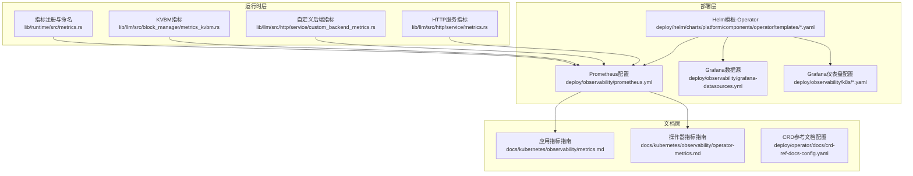
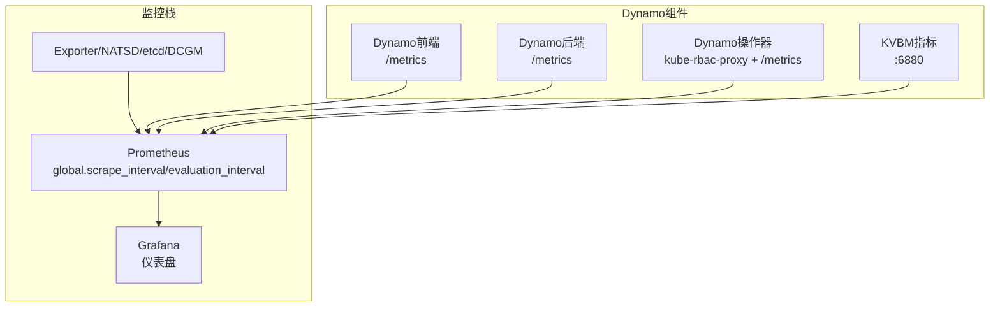
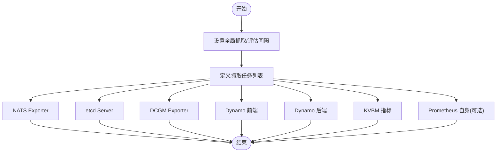
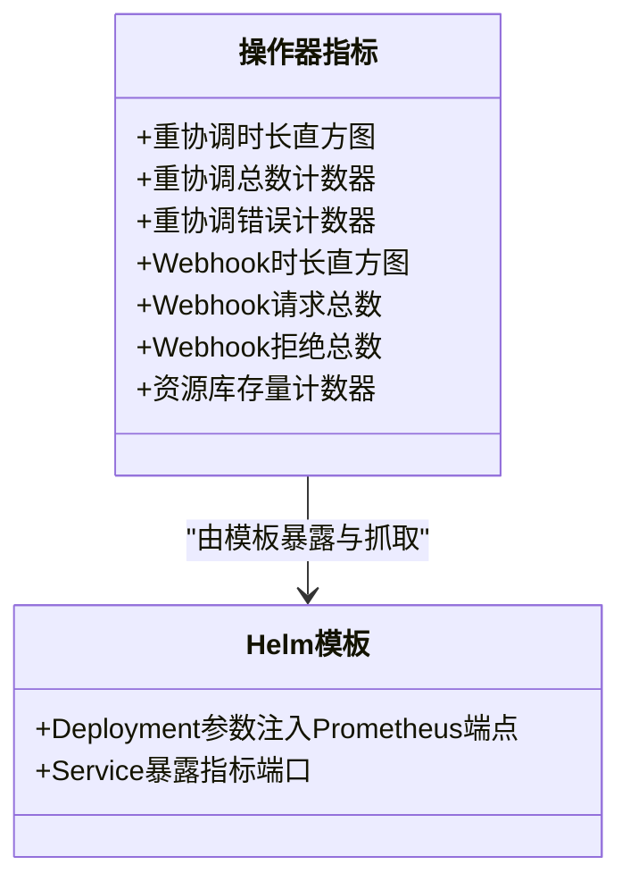
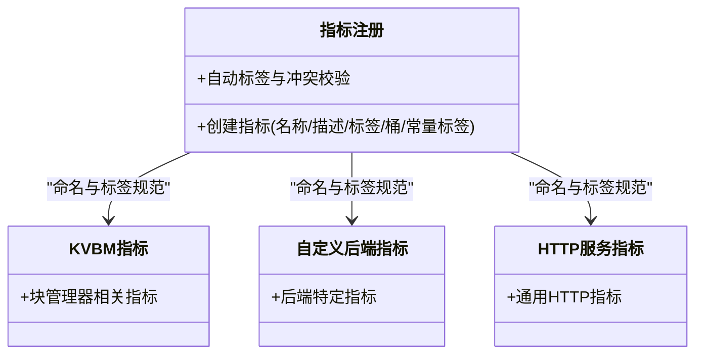
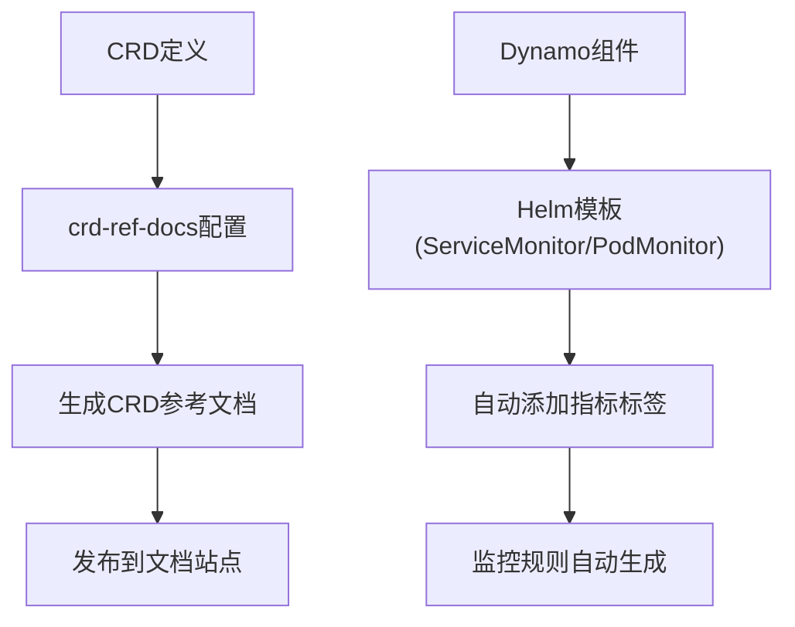
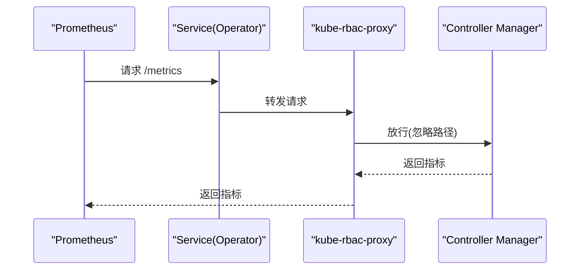
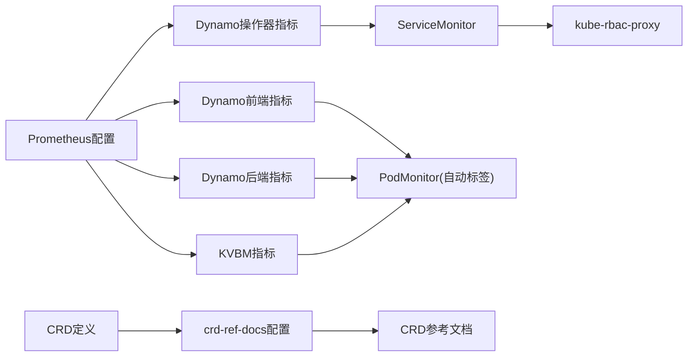

# Prometheus监控配置

<cite>
**本文档引用的文件**
- [prometheus.yml](file://deploy/observability/prometheus.yml)
- [metrics-service.yaml](file://deploy/helm/charts/platform/components/operator/templates/metrics-service.yaml)
- [deployment.yaml](file://deploy/helm/charts/platform/components/operator/templates/deployment.yaml)
- [epp.yaml](file://deploy/helm/charts/platform/components/operator/templates/epp.yaml)
- [crd-ref-docs-config.yaml](file://deploy/operator/docs/crd-ref-docs-config.yaml)
- [metrics.go](file://deploy/operator/internal/observability/metrics.go)
- [metrics.md](file://docs/kubernetes/observability/metrics.md)
- [operator-metrics.md](file://docs/kubernetes/observability/operator-metrics.md)
- [metrics.rs](file://lib/runtime/src/metrics.rs)
- [metrics_kvbm.rs](file://lib/llm/src/block_manager/metrics_kvbm.rs)
- [custom_backend_metrics.rs](file://lib/llm/src/http/service/custom_backend_metrics.rs)
- [metrics.rs](file://lib/llm/src/http/service/metrics.rs)
</cite>

## 目录
1. [简介](#简介)
2. [项目结构](#项目结构)
3. [核心组件](#核心组件)
4. [架构总览](#架构总览)
5. [详细组件分析](#详细组件分析)
6. [依赖关系分析](#依赖关系分析)
7. [性能考虑](#性能考虑)
8. [故障排除指南](#故障排除指南)
9. [结论](#结论)
10. [附录](#附录)

## 简介
本文件面向Dynamo项目的Prometheus监控体系，提供从配置到部署、从指标采集到告警规则的完整说明。内容覆盖：
- Prometheus配置文件结构与参数详解（抓取目标、评估间隔、静态目标）
- Dynamo特定指标收集配置（前端/后端/操作器/工作负载/性能指标）
- CRD参考文档生成配置与监控规则自动生成机制
- 服务发现与安全认证部署指南
- 指标查询示例与告警规则最佳实践

## 项目结构
与Prometheus监控相关的关键目录与文件：
- 部署层：Prometheus配置、Grafana数据源与仪表盘、Operator Helm模板
- 文档层：Kubernetes观测性指南、操作器指标文档
- 运行时层：指标注册与命名规范、KVBM与后端指标实现

图表来源
- [prometheus.yml](file://deploy/observability/prometheus.yml#L16-L63)
- [metrics.md](file://docs/kubernetes/observability/metrics.md#L1-L181)
- [operator-metrics.md](file://docs/kubernetes/observability/operator-metrics.md#L1-L267)
- [crd-ref-docs-config.yaml](file://deploy/operator/docs/crd-ref-docs-config.yaml#L1-L58)

章节来源
- [prometheus.yml](file://deploy/observability/prometheus.yml#L16-L63)
- [metrics.md](file://docs/kubernetes/observability/metrics.md#L1-L181)
- [operator-metrics.md](file://docs/kubernetes/observability/operator-metrics.md#L1-L267)
- [crd-ref-docs-config.yaml](file://deploy/operator/docs/crd-ref-docs-config.yaml#L1-L58)

## 核心组件
- Prometheus配置文件：定义全局抓取间隔、评估间隔以及各类静态抓取任务（NATS、etcd、DCGM、Dynamo前端/后端/KVBM等）。
- Operator Helm模板：通过Deployment注入参数控制Prometheus端点，通过Service暴露指标端口；通过RBAC与ServiceMonitor实现安全抓取。
- 文档指南：提供Kubernetes环境下的PodMonitor/ServiceMonitor使用方法、Grafana仪表盘部署与查询示例。
- 运行时指标：统一的指标注册与命名规范，以及各子模块（KVBM、HTTP服务、自定义后端）的具体指标实现。

章节来源
- [prometheus.yml](file://deploy/observability/prometheus.yml#L16-L63)
- [metrics-service.yaml](file://deploy/helm/charts/platform/components/operator/templates/metrics-service.yaml#L15-L34)
- [deployment.yaml](file://deploy/helm/charts/platform/components/operator/templates/deployment.yaml#L124-L126)
- [metrics.md](file://docs/kubernetes/observability/metrics.md#L107-L174)
- [operator-metrics.md](file://docs/kubernetes/observability/operator-metrics.md#L20-L91)
- [metrics.rs](file://lib/runtime/src/metrics.rs#L201-L356)

## 架构总览
下图展示Prometheus在Dynamo中的抓取架构：静态目标（本地演示）与动态目标（Kubernetes服务发现）并存，Operator通过ServiceMonitor自动暴露指标，Grafana可视化。

图表来源
- [prometheus.yml](file://deploy/observability/prometheus.yml#L16-L63)
- [metrics-service.yaml](file://deploy/helm/charts/platform/components/operator/templates/metrics-service.yaml#L28-L33)
- [deployment.yaml](file://deploy/helm/charts/platform/components/operator/templates/deployment.yaml#L159-L177)

## 详细组件分析

### Prometheus配置文件分析
- 全局参数
  - 抓取间隔：用于统一控制抓取频率，避免过密导致资源压力。
  - 评估间隔：用于记录规则与告警表达式的计算周期。
- 抓取任务
  - NATS Prometheus Exporter：用于消息系统可观测性。
  - etcd Server：用于存储后端状态与一致性监控。
  - DCGM Exporter：用于GPU硬件指标采集。
  - Dynamo Frontend：本地演示用静态目标，便于快速验证。
  - Dynamo Backend：本地演示用静态目标，便于验证后端指标。
  - KVBM Metrics：本地演示用静态目标，便于验证KVBM链路指标。
  - Prometheus自身：可选，便于自监控。

图表来源
- [prometheus.yml](file://deploy/observability/prometheus.yml#L16-L63)

章节来源
- [prometheus.yml](file://deploy/observability/prometheus.yml#L16-L63)

### Dynamo操作器指标配置
- 指标命名空间：统一使用操作器命名空间前缀，便于区分与聚合。
- 指标类型与标签：
  - 重协调时长直方图、重协调总数计数器、重协调错误计数器（按错误类型分类）
  - Webhook时长直方图、Webhook请求总数、Webhook拒绝总数（按原因分类）
  - 资源库存量计数器（按资源类型、命名空间、状态）
- Helm集成：
  - Deployment通过参数注入Prometheus端点，确保Operator能正确上报指标。
  - Service暴露指标端口，配合ServiceMonitor进行抓取。

图表来源
- [metrics.go](file://deploy/operator/internal/observability/metrics.go#L28-L113)
- [deployment.yaml](file://deploy/helm/charts/platform/components/operator/templates/deployment.yaml#L124-L126)
- [metrics-service.yaml](file://deploy/helm/charts/platform/components/operator/templates/metrics-service.yaml#L28-L33)

章节来源
- [metrics.go](file://deploy/operator/internal/observability/metrics.go#L28-L113)
- [deployment.yaml](file://deploy/helm/charts/platform/components/operator/templates/deployment.yaml#L124-L126)
- [metrics-service.yaml](file://deploy/helm/charts/platform/components/operator/templates/metrics-service.yaml#L28-L33)

### Dynamo工作负载与性能指标
- 指标注册与命名规范：提供统一的指标创建函数，支持自动标签、常量标签、直方图桶自定义等。
- KVBM指标：针对块管理器的KVBM链路指标实现，便于定位缓存命中率、延迟等关键性能。
- 自定义后端指标：为不同后端引擎（如vLLM、TensorRT-LLM等）提供差异化指标实现。
- HTTP服务指标：统一的HTTP服务指标，便于前端/后端统一观测。

图表来源
- [metrics.rs](file://lib/runtime/src/metrics.rs#L201-L356)
- [metrics_kvbm.rs](file://lib/llm/src/block_manager/metrics_kvbm.rs)
- [custom_backend_metrics.rs](file://lib/llm/src/http/service/custom_backend_metrics.rs)
- [metrics.rs](file://lib/llm/src/http/service/metrics.rs)

章节来源
- [metrics.rs](file://lib/runtime/src/metrics.rs#L201-L356)
- [metrics_kvbm.rs](file://lib/llm/src/block_manager/metrics_kvbm.rs)
- [custom_backend_metrics.rs](file://lib/llm/src/http/service/custom_backend_metrics.rs)
- [metrics.rs](file://lib/llm/src/http/service/metrics.rs)

### CRD参考文档生成与监控规则自动生成
- CRD参考文档配置：通过crd-ref-docs工具生成CRD参考文档，忽略非用户配置字段，按Kind分组，输出Markdown格式，便于维护与发布。
- 监控规则自动生成：结合Helm模板中的ServiceMonitor/PodMonitor，自动为Dynamo组件添加指标标签，实现监控规则的自动化落地。

图表来源
- [crd-ref-docs-config.yaml](file://deploy/operator/docs/crd-ref-docs-config.yaml#L19-L57)
- [metrics.md](file://docs/kubernetes/observability/metrics.md#L109-L126)

章节来源
- [crd-ref-docs-config.yaml](file://deploy/operator/docs/crd-ref-docs-config.yaml#L19-L57)
- [metrics.md](file://docs/kubernetes/observability/metrics.md#L109-L126)

### 服务发现与安全认证
- 服务发现：Operator通过RBAC与ServiceMonitor实现对控制器管理资源的指标暴露，无需手动配置PodMonitor标签。
- 安全认证：kube-rbac-proxy作为Sidecar，通过忽略路径配置允许Prometheus访问指标端点，同时限制其他路径的访问。

图表来源
- [metrics-service.yaml](file://deploy/helm/charts/platform/components/operator/templates/metrics-service.yaml#L28-L33)
- [deployment.yaml](file://deploy/helm/charts/platform/components/operator/templates/deployment.yaml#L60-L77)

章节来源
- [metrics-service.yaml](file://deploy/helm/charts/platform/components/operator/templates/metrics-service.yaml#L28-L33)
- [deployment.yaml](file://deploy/helm/charts/platform/components/operator/templates/deployment.yaml#L60-L77)
- [epp.yaml](file://deploy/helm/charts/platform/components/operator/templates/epp.yaml#L38-L57)

## 依赖关系分析
- Prometheus配置依赖于各组件的/metrics端点可达性与标签一致性。
- Operator指标依赖于ServiceMonitor与kube-rbac-proxy的正确配置。
- 应用指标依赖于PodMonitor自动注入的标签，确保Prometheus能够正确抓取。
- CRD参考文档生成依赖于crd-ref-docs配置，保证文档质量与一致性。

图表来源
- [prometheus.yml](file://deploy/observability/prometheus.yml#L16-L63)
- [metrics-service.yaml](file://deploy/helm/charts/platform/components/operator/templates/metrics-service.yaml#L28-L33)
- [deployment.yaml](file://deploy/helm/charts/platform/components/operator/templates/deployment.yaml#L60-L77)
- [metrics.md](file://docs/kubernetes/observability/metrics.md#L109-L126)
- [crd-ref-docs-config.yaml](file://deploy/operator/docs/crd-ref-docs-config.yaml#L19-L57)

章节来源
- [prometheus.yml](file://deploy/observability/prometheus.yml#L16-L63)
- [metrics-service.yaml](file://deploy/helm/charts/platform/components/operator/templates/metrics-service.yaml#L28-L33)
- [deployment.yaml](file://deploy/helm/charts/platform/components/operator/templates/deployment.yaml#L60-L77)
- [metrics.md](file://docs/kubernetes/observability/metrics.md#L109-L126)
- [crd-ref-docs-config.yaml](file://deploy/operator/docs/crd-ref-docs-config.yaml#L19-L57)

## 性能考虑
- 抓取间隔与评估间隔应根据集群规模与指标基数合理设置，避免Prometheus与被监控组件的CPU/内存压力过大。
- 对于高基数指标（如按命名空间/组件细分），建议在Prometheus中使用指标过滤与记录规则，降低查询开销。
- 使用直方图与摘要时，合理设置桶分布，平衡精度与内存占用。
- 在Kubernetes环境中，优先使用ServiceMonitor/PodMonitor自动发现，减少手工维护成本与错误风险。

## 故障排除指南
- 指标未出现在Prometheus
  - 检查ServiceMonitor是否存在且被Prometheus发现
  - 确认Prometheus选择器配置（如nil使用Helm值）
- Grafana仪表盘未出现
  - 检查ConfigMap是否创建并带有正确的标签
  - 确认Grafana侧车配置能识别该标签
  - 必要时重启Grafana以刷新面板
- 操作器指标不可见
  - 确认Deployment参数已注入Prometheus端点
  - 检查Service端口与选择器匹配
  - 确保kube-rbac-proxy忽略路径配置正确

章节来源
- [operator-metrics.md](file://docs/kubernetes/observability/operator-metrics.md#L218-L261)

## 结论
通过上述配置与实践，Dynamo能够在本地演示与Kubernetes生产环境中稳定地采集前端/后端/操作器/工作负载/性能等多维度指标，并借助Grafana进行可视化。结合CRD参考文档生成与监控规则自动生成机制，可进一步提升可观测性的可维护性与一致性。

## 附录

### 指标查询示例（基于官方文档）
- 应用指标查询示例（Kubernetes环境）
  - 前端请求总量、首Token耗时直方图等
- 操作器指标查询示例（Kubernetes环境）
  - 重协调P95时长、重协调错误率、Webhook拒绝率、资源库存量等

章节来源
- [metrics.md](file://docs/kubernetes/observability/metrics.md#L147-L174)
- [operator-metrics.md](file://docs/kubernetes/observability/operator-metrics.md#L92-L148)