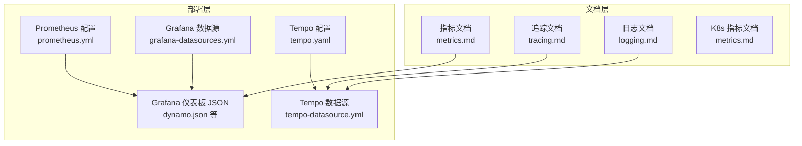
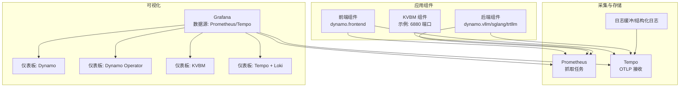
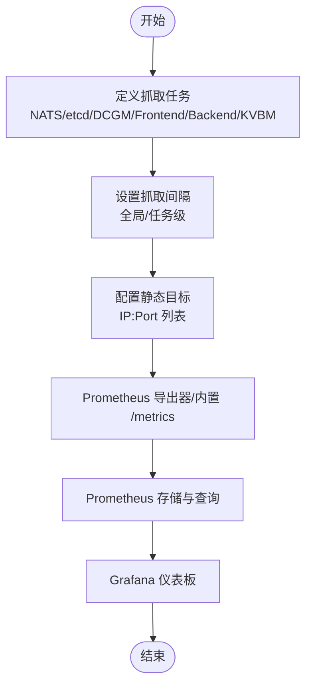
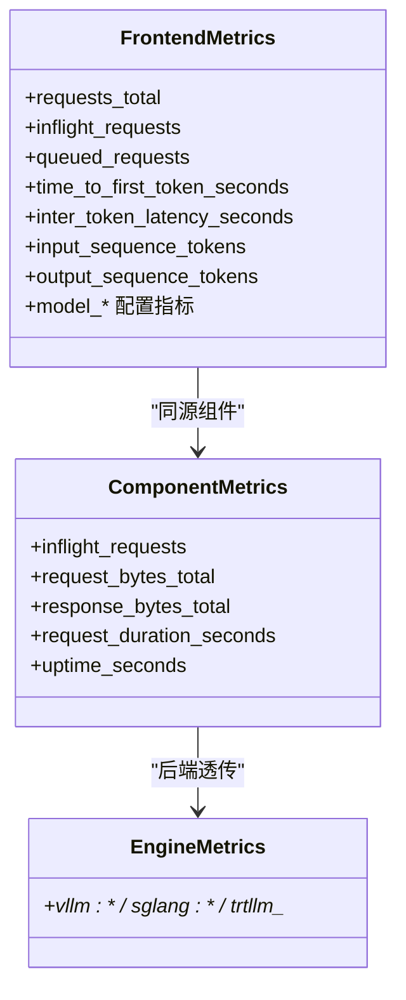
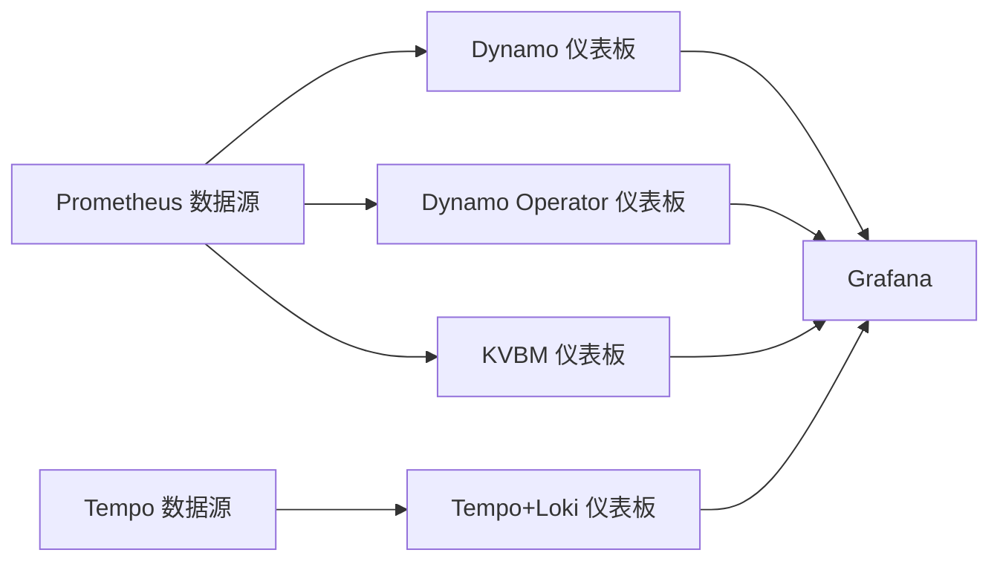
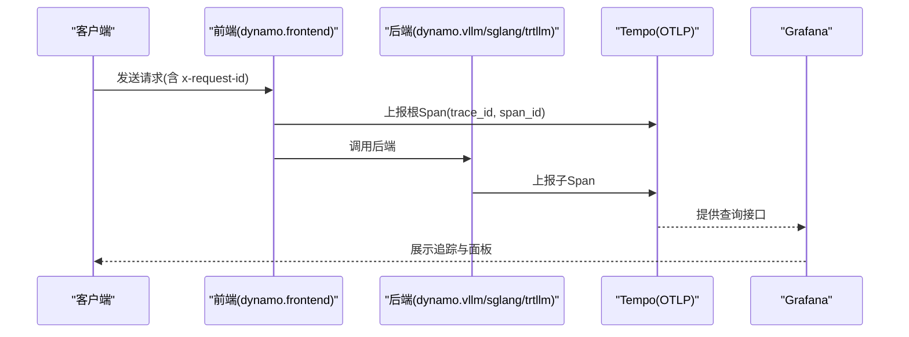
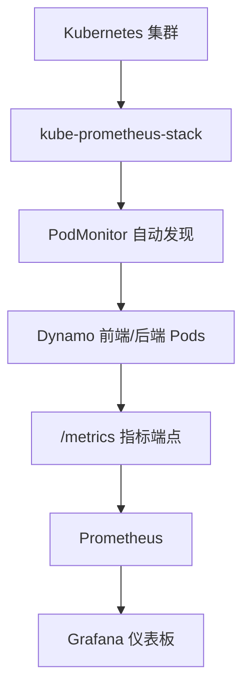
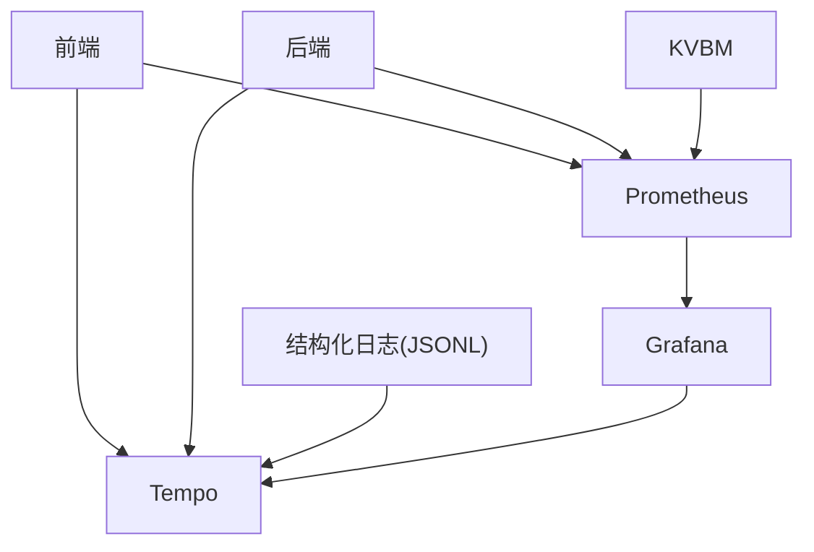

# 可观测性配置

<cite>
**本文引用的文件**
- [README.md](file://deploy/observability/README.md)
- [prometheus.yml](file://deploy/observability/prometheus.yml)
- [grafana-datasources.yml](file://deploy/observability/grafana-datasources.yml)
- [tempo.yaml](file://deploy/observability/tempo.yaml)
- [tempo-datasource.yml](file://deploy/observability/tempo-datasource.yml)
- [metrics.md](file://docs/observability/metrics.md)
- [tracing.md](file://docs/observability/tracing.md)
- [logging.md](file://docs/observability/logging.md)
- [metrics.md](file://docs/kubernetes/observability/metrics.md)
- [dynamo.json](file://deploy/observability/grafana_dashboards/dynamo.json)
- [dynamo-operator.json](file://deploy/observability/grafana_dashboards/dynamo-operator.json)
- [kvbm.json](file://deploy/observability/grafana_dashboards/kvbm.json)
- [temp-loki.json](file://deploy/observability/grafana_dashboards/temp-loki.json)
- [README.md](file://deploy/observability/k8s/logging/README.md)
</cite>

## 目录
1. [简介](#简介)
2. [项目结构](#项目结构)
3. [核心组件](#核心组件)
4. [架构总览](#架构总览)
5. [详细组件分析](#详细组件分析)
6. [依赖关系分析](#依赖关系分析)
7. [性能考量](#性能考量)
8. [故障排查指南](#故障排查指南)
9. [结论](#结论)
10. [附录](#附录)

## 简介
本技术文档面向Dynamo可观测性配置，系统性阐述Prometheus监控、Grafana可视化、日志与结构化日志、分布式追踪（Tempo）的配置与使用，并提供Kubernetes与单机环境下的部署要点、持久化与备份建议、故障排查与性能优化最佳实践。内容基于仓库中deploy/observability与docs/observability目录中的实际配置与说明文件整理而成。

## 项目结构
可观测性相关配置主要分布在以下位置：
- 部署层（Prometheus、Grafana数据源、Tempo）：deploy/observability
- 文档层（指标、追踪、日志）：docs/observability 与 docs/kubernetes/observability
- 仪表板（Grafana）：deploy/observability/grafana_dashboards

图表来源
- [prometheus.yml](file://deploy/observability/prometheus.yml#L1-L63)
- [grafana-datasources.yml](file://deploy/observability/grafana-datasources.yml#L1-L24)
- [tempo.yaml](file://deploy/observability/tempo.yaml#L1-L37)
- [tempo-datasource.yml](file://deploy/observability/tempo-datasource.yml#L1-L28)
- [metrics.md](file://docs/observability/metrics.md#L1-L224)
- [tracing.md](file://docs/observability/tracing.md#L1-L215)
- [logging.md](file://docs/observability/logging.md#L1-L263)
- [metrics.md](file://docs/kubernetes/observability/metrics.md#L1-L181)

章节来源
- [README.md](file://deploy/observability/README.md#L1-L4)

## 核心组件
- Prometheus：负责指标采集与存储，配置了NATS、etcd、DCGM、前端、后端、KVBM等多类目标的抓取任务。
- Grafana：通过数据源连接Prometheus与Tempo，配合仪表板JSON实现可视化。
- Tempo：接收OTLP追踪数据，提供分布式追踪查询与火焰图展示。
- 日志与结构化日志：支持文本与JSONL两种格式，可输出trace_id/span_id并可选导出到Tempo。

章节来源
- [prometheus.yml](file://deploy/observability/prometheus.yml#L16-L63)
- [grafana-datasources.yml](file://deploy/observability/grafana-datasources.yml#L18-L24)
- [tempo.yaml](file://deploy/observability/tempo.yaml#L1-L37)
- [tempo-datasource.yml](file://deploy/observability/tempo-datasource.yml#L6-L28)
- [metrics.md](file://docs/observability/metrics.md#L16-L224)
- [tracing.md](file://docs/observability/tracing.md#L18-L215)
- [logging.md](file://docs/observability/logging.md#L15-L263)

## 架构总览
下图展示了Dynamo在单机与Kubernetes环境下的可观测性架构与数据流：

图表来源
- [prometheus.yml](file://deploy/observability/prometheus.yml#L20-L62)
- [grafana-datasources.yml](file://deploy/observability/grafana-datasources.yml#L18-L24)
- [tempo.yaml](file://deploy/observability/tempo.yaml#L7-L15)
- [tempo-datasource.yml](file://deploy/observability/tempo-datasource.yml#L6-L28)
- [dynamo.json](file://deploy/observability/grafana_dashboards/dynamo.json#L1-L120)
- [dynamo-operator.json](file://deploy/observability/grafana_dashboards/dynamo-operator.json#L1-L140)
- [kvbm.json](file://deploy/observability/grafana_dashboards/kvbm.json#L1-L140)
- [temp-loki.json](file://deploy/observability/grafana_dashboards/temp-loki.json#L1-L120)

## 详细组件分析

### Prometheus 指标采集配置
- 抓取间隔与全局策略：全局抓取间隔与评估间隔已设定；部分job设置了更短的抓取周期以提升实时性。
- 抓取目标：
  - NATS Prometheus Exporter
  - etcd 服务器
  - DCGM Exporter（GPU指标）
  - Dynamo 前端（默认8000端口）
  - Dynamo 后端（默认8081端口，可通过环境变量调整）
  - KVBM 指标端点（示例6880端口）
- 自身Prometheus抓取：示例注释展示了如何抓取自身指标（按需启用）。

图表来源
- [prometheus.yml](file://deploy/observability/prometheus.yml#L16-L63)

章节来源
- [prometheus.yml](file://deploy/observability/prometheus.yml#L16-L63)

### Dynamo 指标体系与标签
- 指标前缀与命名：所有Dynamo指标统一使用dynamo_*前缀，并带有dynamo_namespace、dynamo_component、dynamo_endpoint等标签，便于分组与聚合。
- 指标类别：
  - 前端指标（dynamo_frontend_*）：请求总量、排队数、首Token时间、交互延迟、序列长度、模型配置信息等。
  - 组件指标（dynamo_component_*）：并发请求数、请求/响应字节、处理时延、运行时长等。
  - 专用组件指标（如dynamo_preprocessor_*）。
  - 引擎指标（透传）：各后端引擎（vLLM/SGLang/TensorRT-LLM）暴露自有指标。
- 访问方式：后端组件默认在8081端口、前端在8000端口，均可通过HTTP /metrics获取Prometheus格式文本。

图表来源
- [metrics.md](file://docs/observability/metrics.md#L101-L175)

章节来源
- [metrics.md](file://docs/observability/metrics.md#L61-L175)

### Grafana 仪表板与可视化
- 数据源：Prometheus作为默认数据源，Tempo作为追踪数据源。
- 仪表板类型：
  - Dynamo：前端请求速率、首Token/交互延迟、请求时延、输入/输出序列长度、GPU利用率、节点CPU/内存、容器资源使用等。
  - Dynamo Operator：控制器重均衡速率、时延（P95）、错误率、Webhook请求与拒绝、资源库存状态。
  - KVBM：缓存命中率、块离线/上载/旁路传输速率等。
  - Tempo + Loki：结合追踪与日志的综合视图。
- 面板查询示例：前端请求速率、平均首Token时间、组件字节速率、GPU利用率等。

图表来源
- [grafana-datasources.yml](file://deploy/observability/grafana-datasources.yml#L18-L24)
- [tempo-datasource.yml](file://deploy/observability/tempo-datasource.yml#L6-L28)
- [dynamo.json](file://deploy/observability/grafana_dashboards/dynamo.json#L105-L116)
- [dynamo-operator.json](file://deploy/observability/grafana_dashboards/dynamo-operator.json#L113-L127)
- [kvbm.json](file://deploy/observability/grafana_dashboards/kvbm.json#L120-L132)
- [temp-loki.json](file://deploy/observability/grafana_dashboards/temp-loki.json#L1-L120)

章节来源
- [grafana-datasources.yml](file://deploy/observability/grafana-datasources.yml#L18-L24)
- [tempo-datasource.yml](file://deploy/observability/tempo-datasource.yml#L6-L28)
- [dynamo.json](file://deploy/observability/grafana_dashboards/dynamo.json#L1-L120)
- [dynamo-operator.json](file://deploy/observability/grafana_dashboards/dynamo-operator.json#L1-L140)
- [kvbm.json](file://deploy/observability/grafana_dashboards/kvbm.json#L1-L140)
- [temp-loki.json](file://deploy/observability/grafana_dashboards/temp-loki.json#L1-L120)

### 分布式追踪（Tempo）与日志
- 追踪导出：通过OTLP（gRPC/HTTP）发送至Tempo；需开启JSONL日志与OTEL导出开关，并设置服务名。
- 日志格式：支持文本与JSONL；启用JSONL后，日志包含trace_id/span_id字段，便于与追踪关联。
- 请求ID：可通过x-request-id头自定义请求ID，便于跨系统关联。
- 仪表板：在Grafana Explore中选择Tempo数据源进行搜索与火焰图查看。

图表来源
- [tracing.md](file://docs/observability/tracing.md#L34-L151)
- [logging.md](file://docs/observability/logging.md#L97-L138)

章节来源
- [tracing.md](file://docs/observability/tracing.md#L18-L151)
- [logging.md](file://docs/observability/logging.md#L15-L138)

### Kubernetes 环境下的指标采集与可视化
- 使用kube-prometheus-stack安装Prometheus、Grafana与Prometheus Operator。
- 通过PodMonitor自动发现Dynamo组件的/metrics端点，自动添加指标启用与组件类型标签。
- 仪表板通过ConfigMap注入Grafana，包含前端请求、时延、GPU、节点与容器资源等面板。
- 可选：Node Exporter与DCGM Exporter用于CPU/内存与GPU指标。

图表来源
- [metrics.md](file://docs/kubernetes/observability/metrics.md#L9-L53)
- [metrics.md](file://docs/kubernetes/observability/metrics.md#L107-L174)

章节来源
- [metrics.md](file://docs/kubernetes/observability/metrics.md#L1-L181)

## 依赖关系分析
- 组件耦合：
  - Prometheus依赖各组件的/metrics端点；Grafana依赖Prometheus与Tempo数据源。
  - Tempo依赖OTLP导出；日志结构化能力与OTEL导出可选。
- 外部依赖：
  - Prometheus Operator（Kubernetes）
  - Node Exporter、DCGM Exporter（节点/GPU指标）
  - Tempo（追踪后端）

图表来源
- [prometheus.yml](file://deploy/observability/prometheus.yml#L20-L62)
- [grafana-datasources.yml](file://deploy/observability/grafana-datasources.yml#L18-L24)
- [tempo.yaml](file://deploy/observability/tempo.yaml#L7-L15)
- [logging.md](file://docs/observability/logging.md#L97-L118)

章节来源
- [prometheus.yml](file://deploy/observability/prometheus.yml#L16-L63)
- [grafana-datasources.yml](file://deploy/observability/grafana-datasources.yml#L18-L24)
- [tempo.yaml](file://deploy/observability/tempo.yaml#L1-L37)
- [logging.md](file://docs/observability/logging.md#L97-L118)

## 性能考量
- 抓取频率与资源平衡：短抓取间隔可提升实时性但增加Prometheus与目标端压力；建议根据业务峰值与面板刷新需求调优。
- 指标基数控制：合理使用标签（如model、endpoint），避免高基数导致存储与查询开销激增。
- 缓存与压缩：Prometheus与Grafana均具备压缩与查询优化能力，建议结合面板聚合与降采样策略。
- 追踪采样：在高流量场景下适度降低追踪采样率，确保追踪可用性与成本可控。
- 日志级别：生产环境建议使用INFO或WARN，必要时临时提升至DEBUG定位问题。

## 故障排查指南
- 指标不可见
  - 检查Prometheus抓取任务是否正确配置静态目标与端口。
  - 确认组件/metrics端口可达且返回dynamo_*指标。
  - 在Kubernetes环境中确认PodMonitor标签匹配与命名空间选择器。
- Grafana无法连接数据源
  - 校验grafana-datasources.yml中的URL与端口。
  - 确认Grafana服务网络连通性与凭据。
- 追踪缺失
  - 检查OTEL_EXPORT_ENABLED、OTEL_EXPORTER_OTLP_TRACES_ENDPOINT与服务名配置。
  - 确认Tempo端口开放与OTLP接收配置。
- 日志无trace_id/span_id
  - 确认DYN_LOGGING_JSONL=true，必要时开启DYN_LOGGING_SPAN_EVENTS。
  - 检查OTEL_EXPORT_ENABLED以决定是否同时导出到Tempo。

章节来源
- [prometheus.yml](file://deploy/observability/prometheus.yml#L20-L62)
- [grafana-datasources.yml](file://deploy/observability/grafana-datasources.yml#L18-L24)
- [tempo.yaml](file://deploy/observability/tempo.yaml#L7-L15)
- [tracing.md](file://docs/observability/tracing.md#L34-L151)
- [logging.md](file://docs/observability/logging.md#L97-L138)

## 结论
Dynamo的可观测性方案以Prometheus为核心，结合Grafana仪表板实现多维度可视化；通过Tempo与结构化日志实现端到端的分布式追踪与调试。仓库提供了从单机到Kubernetes的完整配置与文档，建议在生产环境中结合业务流量特征与合规要求，对抓取频率、标签基数、追踪采样与日志级别进行精细化调优，并建立完善的备份与恢复策略。

## 附录
- 单机快速启动：参考“可观测性 Getting Started”快速指引，启动Prometheus、Grafana、Tempo与导出器。
- Kubernetes部署：参考kube-prometheus-stack安装与PodMonitor配置，自动发现Dynamo组件指标。
- 仪表板导入：通过ConfigMap将仪表板JSON注入Grafana，或直接使用Grafana侧边栏导入功能。

章节来源
- [metrics.md](file://docs/observability/metrics.md#L27-L59)
- [metrics.md](file://docs/kubernetes/observability/metrics.md#L16-L53)
- [README.md](file://deploy/observability/k8s/logging/README.md#L1-L4)