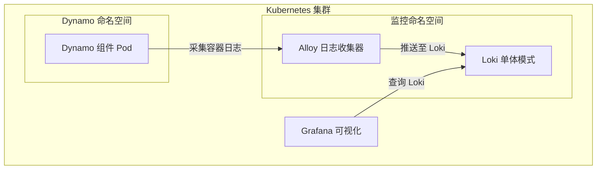
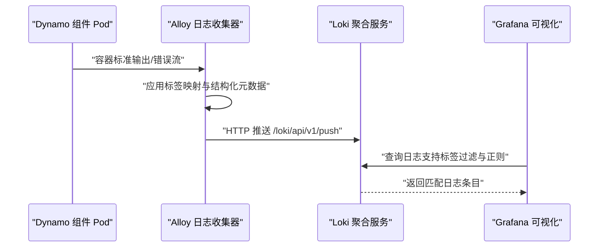
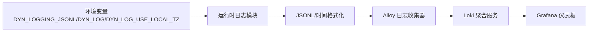

# 日志系统配置

<cite>
**本文引用的文件**
- [alloy-values.yaml](file://deploy/observability/k8s/logging/values/alloy-values.yaml)
- [loki-values.yaml](file://deploy/observability/k8s/logging/values/loki-values.yaml)
- [loki-datasource.yaml](file://deploy/observability/k8s/logging/grafana/loki-datasource.yaml)
- [logging-dashboard.yaml](file://deploy/observability/k8s/logging/grafana/logging-dashboard.yaml)
- [logging.md（Kubernetes 观测性）](file://docs/kubernetes/observability/logging.md)
- [logging.md（Fern 页面）](file://fern/pages/kubernetes/observability/logging.md)
- [logging.md（通用观测性）](file://docs/observability/logging.md)
- [logging.rs](file://lib/runtime/src/logging.rs)
- [config.rs](file://lib/runtime/src/config.rs)
- [agg_logging.yaml](file://examples/backends/sglang/deploy/agg_logging.yaml)
</cite>

## 目录
1. [简介](#简介)
2. [项目结构](#项目结构)
3. [核心组件](#核心组件)
4. [架构总览](#架构总览)
5. [组件详细分析](#组件详细分析)
6. [依赖关系分析](#依赖关系分析)
7. [性能考量](#性能考量)
8. [故障排查指南](#故障排查指南)
9. [结论](#结论)
10. [附录](#附录)

## 简介
本文件面向Dynamo在Kubernetes环境中的日志系统配置与使用，重点覆盖以下方面：
- Loki日志聚合系统的部署与配置（含存储后端与查询优化）
- Grafana Alloy日志收集器的配置（采集规则、标签映射、输出到Loki）
- 结构化日志格式（JSONL）与日志级别配置
- 日志轮转与归档策略建议
- 日志查询语法示例与常见问题排查

说明：仓库中未发现ELK Stack（Elasticsearch/Logstash/Kibana）的直接部署配置；当前默认方案为Grafana Loki + Alloy + Grafana。

## 项目结构
与日志系统相关的关键文件分布如下：
- Helm Values与部署清单：用于安装Loki与Alloy
- Grafana数据源与仪表板：用于可视化与查询
- 运行时日志模块：定义日志格式、级别与时间格式化
- 示例部署：展示如何在DynamoGraphDeployment中启用结构化日志

**图表来源**
- [alloy-values.yaml](file://deploy/observability/k8s/logging/values/alloy-values.yaml#L1-L60)
- [loki-values.yaml](file://deploy/observability/k8s/logging/values/loki-values.yaml#L1-L80)
- [loki-datasource.yaml](file://deploy/observability/k8s/logging/grafana/loki-datasource.yaml#L1-L19)
- [logging-dashboard.yaml](file://deploy/observability/k8s/logging/grafana/logging-dashboard.yaml#L1-L225)

**章节来源**
- [alloy-values.yaml](file://deploy/observability/k8s/logging/values/alloy-values.yaml#L1-L60)
- [loki-values.yaml](file://deploy/observability/k8s/logging/values/loki-values.yaml#L1-L80)
- [loki-datasource.yaml](file://deploy/observability/k8s/logging/grafana/loki-datasource.yaml#L1-L19)
- [logging-dashboard.yaml](file://deploy/observability/k8s/logging/grafana/logging-dashboard.yaml#L1-L225)

## 核心组件
- Loki（单体模式）：作为日志聚合与存储后端，使用本地MinIO作为对象存储，适合开发测试场景。
- Grafana Alloy：作为日志收集器，从Kubernetes API采集Pod日志，支持标签映射与结构化元数据，输出到Loki。
- Grafana：通过Loki数据源与预置仪表板进行日志查询与可视化。

**章节来源**
- [logging.md（Kubernetes 观测性）](file://docs/kubernetes/observability/logging.md#L1-L117)
- [logging.md（Fern 页面）](file://fern/pages/kubernetes/observability/logging.md#L1-L122)

## 架构总览
下图展示了Dynamo日志在Kubernetes中的采集、传输与查询路径。

**图表来源**
- [alloy-values.yaml](file://deploy/observability/k8s/logging/values/alloy-values.yaml#L6-L38)
- [loki-values.yaml](file://deploy/observability/k8s/logging/values/loki-values.yaml#L3-L30)
- [loki-datasource.yaml](file://deploy/observability/k8s/logging/grafana/loki-datasource.yaml#L10-L19)
- [logging-dashboard.yaml](file://deploy/observability/k8s/logging/grafana/logging-dashboard.yaml#L61-L76)

## 组件详细分析

### Loki 配置与部署
- 部署模式：SingleBinary，便于开发与测试
- 存储后端：内置MinIO（可替换为外部S3）
- Schema：tsdb + v13，索引周期24小时
- 限制与优化：允许结构化元数据、启用体积查询、调整并发查询数
- 资源：CPU与内存请求/限制，设置GOMEMLIMIT以控制内存占用
- 缓存：写回缓存大小限制

建议：
- 生产环境建议切换为多组件模式（backend/read/write/querier等），并配置高可用副本与外部对象存储（如S3）
- 根据集群规模与查询负载调整max_concurrent与资源配额

**章节来源**
- [loki-values.yaml](file://deploy/observability/k8s/logging/values/loki-values.yaml#L3-L80)

### Alloy 日志收集器配置
- 目标：将日志推送到Loki网关地址
- 采集方式：kubernetesApi（优先于/var/log/containers/，便于测试）
- 命中命名空间：Dynamo平台所在命名空间
- 标签映射：将Pod标签映射为Loki标签，保留常用字段（如level、namespace、service_*等）
- 结构化元数据：将Pod名称注入为结构化元数据
- 收集器组件：启用alloy-logs，禁用其他组件（metrics/profiles/receiver）

建议：
- 在生产中根据需要开启节点日志或容器目录采集
- 合理选择labelsToKeep，避免过多标签导致索引膨胀

**章节来源**
- [alloy-values.yaml](file://deploy/observability/k8s/logging/values/alloy-values.yaml#L6-L60)

### Grafana 数据源与仪表板
- 数据源：Loki，访问模式proxy，最大行数限制
- 仪表板：DynamoGraph Logs，支持按命名空间、DynamoGraphDeployment、组件类型、Trace ID与关键词过滤

查询要点：
- 使用标签过滤表达式：{namespace=~"$namespace", nvidia_com_dynamo_graph_deployment_name=~"$dynamographdeployment", nvidia_com_dynamo_component_type=~"$component"}
- 支持附加关键词过滤：|= "$search"、|= "$trace_id"

**章节来源**
- [loki-datasource.yaml](file://deploy/observability/k8s/logging/grafana/loki-datasource.yaml#L10-L19)
- [logging-dashboard.yaml](file://deploy/observability/k8s/logging/grafana/logging-dashboard.yaml#L61-L76)

### 结构化日志格式与日志级别
- JSONL格式：通过环境变量启用，适用于Loki结构化处理
- 时间格式：UTC或本地时区（由环境变量控制）
- 日志级别：支持按目标（crate/module）设置级别，语法与RUST_LOG一致
- 额外特性：启用span事件时会放宽特定目标的日志级别以捕获span事件

运行时实现要点：
- 日志格式化器支持JSONL输出与时间格式化
- 支持将字段扁平化为JSON对象，便于Loki解析与查询

**章节来源**
- [logging.rs](file://lib/runtime/src/logging.rs#L1-L28)
- [logging.rs](file://lib/runtime/src/logging.rs#L1057-L1111)
- [logging.rs](file://lib/runtime/src/logging.rs#L1071-L1099)
- [config.rs](file://lib/runtime/src/config.rs#L458-L483)
- [logging.md（通用观测性）](file://docs/observability/logging.md#L12-L22)
- [logging.md（通用观测性）](file://docs/observability/logging.md#L18-L22)

### 示例：在DynamoGraphDeployment中启用结构化日志
- 设置环境变量：DYN_LOGGING_JSONL=1
- 可选：设置DYN_LOG与DYN_LOG_USE_LOCAL_TZ
- 通过extraPodSpec指定镜像与命令参数

**章节来源**
- [agg_logging.yaml](file://examples/backends/sglang/deploy/agg_logging.yaml#L9-L11)
- [agg_logging.yaml](file://examples/backends/sglang/deploy/agg_logging.yaml#L16-L44)

## 依赖关系分析
- 运行时日志模块依赖环境变量与配置文件加载机制，决定日志格式与级别
- Alloy依赖Kubernetes API获取日志，依赖Loki网关URL进行推送
- Grafana依赖Loki数据源与预置仪表板进行查询

**图表来源**
- [logging.rs](file://lib/runtime/src/logging.rs#L1046-L1055)
- [config.rs](file://lib/runtime/src/config.rs#L458-L483)
- [alloy-values.yaml](file://deploy/observability/k8s/logging/values/alloy-values.yaml#L6-L38)
- [loki-datasource.yaml](file://deploy/observability/k8s/logging/grafana/loki-datasource.yaml#L10-L19)

**章节来源**
- [logging.rs](file://lib/runtime/src/logging.rs#L1046-L1055)
- [config.rs](file://lib/runtime/src/config.rs#L458-L483)
- [alloy-values.yaml](file://deploy/observability/k8s/logging/values/alloy-values.yaml#L6-L38)
- [loki-datasource.yaml](file://deploy/observability/k8s/logging/grafana/loki-datasource.yaml#L10-L19)

## 性能考量
- Loki单体模式适合开发测试，生产建议拆分为多组件并使用外部对象存储
- 查询并发：根据内存/CPU资源调整max_concurrent
- 内存控制：通过GOMEMLIMIT限制内存占用
- 标签数量：减少labelsToKeep中的冗余标签，降低索引开销
- 采集方式：kubernetesApi更稳定，但对API服务器压力更大；容器目录采集对节点要求更高

**章节来源**
- [loki-values.yaml](file://deploy/observability/k8s/logging/values/loki-values.yaml#L28-L47)
- [alloy-values.yaml](file://deploy/observability/k8s/logging/values/alloy-values.yaml#L16-L38)

## 故障排查指南
- 无法看到日志
  - 检查Alloy是否正确指向Loki网关URL
  - 确认Dynamo命名空间已加入namespaces列表
  - 验证Pod日志采集是否启用
- 日志无结构化字段
  - 确认DYN_LOGGING_JSONL已启用
  - 检查运行时日志格式化逻辑是否生效
- 查询结果为空
  - 检查标签过滤条件是否正确（命名空间、组件类型、DynamoGraphDeployment）
  - 确认时间范围与关键词过滤
- Loki内存压力
  - 降低max_concurrent或增加资源配额
  - 控制标签数量与日志量级

**章节来源**
- [alloy-values.yaml](file://deploy/observability/k8s/logging/values/alloy-values.yaml#L6-L38)
- [loki-values.yaml](file://deploy/observability/k8s/logging/values/loki-values.yaml#L28-L47)
- [logging-dashboard.yaml](file://deploy/observability/k8s/logging/grafana/logging-dashboard.yaml#L61-L76)

## 结论
Dynamo在Kubernetes上的日志体系采用“Alloy采集 + Loki聚合 + Grafana可视化”的组合，满足开发与测试场景下的快速落地。生产环境中建议：
- 切换Loki为多组件模式并接入外部对象存储
- 合理配置查询并发与资源限制
- 严格控制标签数量与日志量级
- 明确结构化日志格式与级别策略，确保可观测性与性能平衡

## 附录

### 环境变量与配置项速览
- DYN_LOGGING_JSONL：启用JSONL结构化日志（必需配合Loki）
- DYN_LOG：按目标设置日志级别（语法与RUST_LOG一致）
- DYN_LOG_USE_LOCAL_TZ：使用本地时区而非UTC
- DYN_LOGGING_CONFIG_PATH：自定义TOML配置路径
- DYN_LOGGING_SPAN_EVENTS：启用span事件日志（用于短时调试）

**章节来源**
- [logging.md（通用观测性）](file://docs/observability/logging.md#L12-L22)
- [config.rs](file://lib/runtime/src/config.rs#L458-L483)
- [logging.rs](file://lib/runtime/src/logging.rs#L16-L27)

### 日志查询语法示例
- 基础过滤：{namespace=~"$namespace", nvidia_com_dynamo_graph_deployment_name=~"$dynamographdeployment"}
- 关键词过滤：|= "error" 或 |= "timeout"
- Trace关联：|= "$trace_id"
- 时间范围：在Grafana面板中选择时间范围

**章节来源**
- [logging-dashboard.yaml](file://deploy/observability/k8s/logging/grafana/logging-dashboard.yaml#L61-L76)