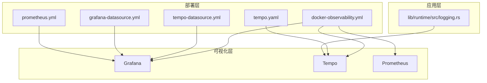
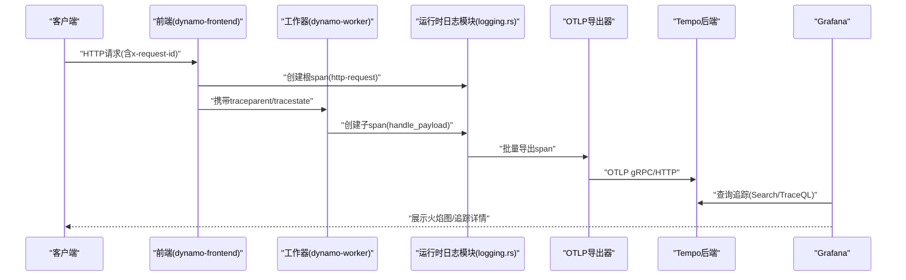
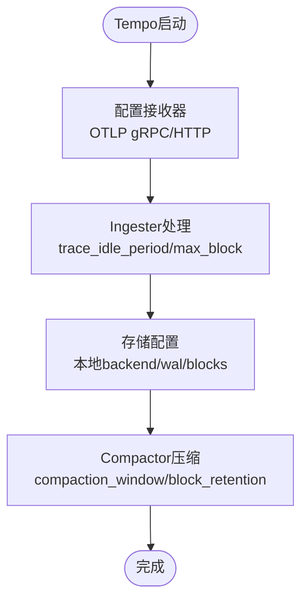
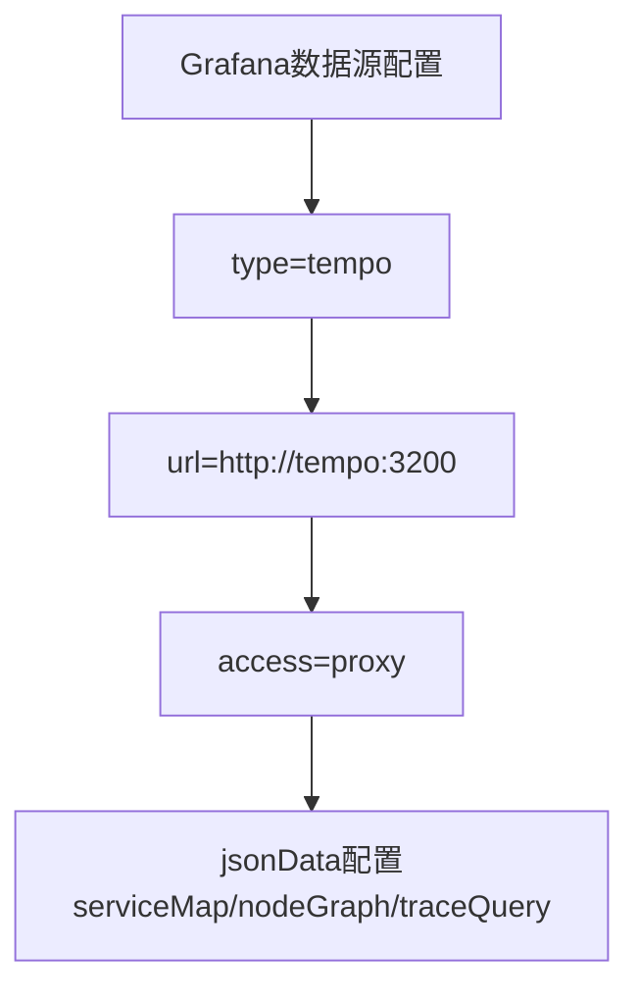
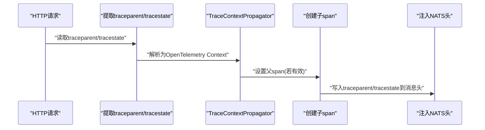
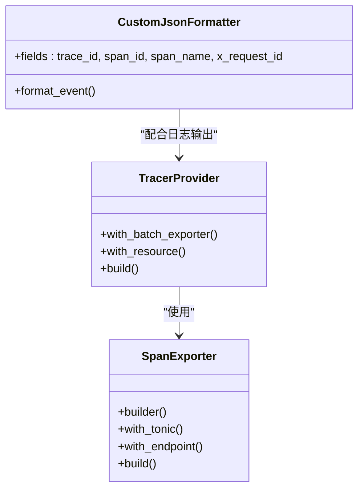
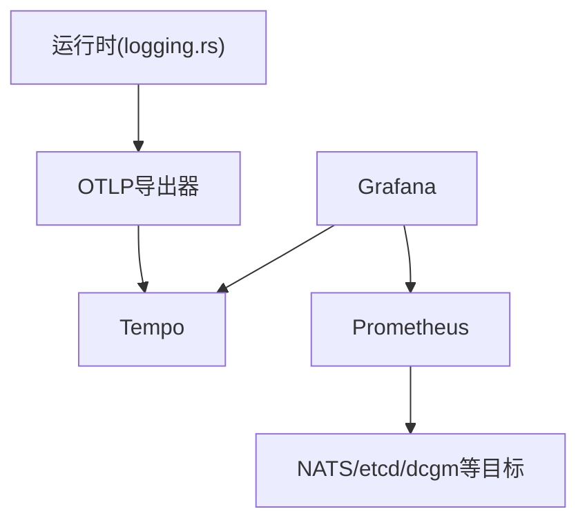

# 追踪系统配置

<cite>
**本文档引用的文件**
- [tracing.md](file://docs/observability/tracing.md)
- [logging.md](file://docs/observability/logging.md)
- [docker-observability.yml](file://deploy/docker-observability.yml)
- [tempo.yaml](file://deploy/observability/tempo.yaml)
- [tempo-datasource.yml](file://deploy/observability/tempo-datasource.yml)
- [grafana-datasource.yml](file://deploy/observability/grafana-datasource.yml)
- [prometheus.yml](file://deploy/observability/prometheus.yml)
- [logging.rs](file://lib/runtime/src/logging.rs)
</cite>

## 目录
1. [简介](#简介)
2. [项目结构](#项目结构)
3. [核心组件](#核心组件)
4. [架构概览](#架构概览)
5. [详细组件分析](#详细组件分析)
6. [依赖关系分析](#依赖关系分析)
7. [性能考虑](#性能考虑)
8. [故障排查指南](#故障排查指南)
9. [结论](#结论)
10. [附录](#附录)

## 简介
本文件为Dynamo分布式追踪系统的全面配置文档，重点覆盖基于Tempo的OpenTelemetry追踪部署、Grafana中Tracing数据源配置、分布式追踪采样与上下文传播机制、OpenTelemetry集成与自定义span标签、以及追踪数据查询分析与性能调优实践。内容来源于仓库中的观测性文档、部署配置与运行时代码实现。

## 项目结构
追踪系统相关的核心文件分布于以下位置：
- 文档：docs/observability/tracing.md（分布式追踪指南）、docs/observability/logging.md（日志与追踪关系）
- 部署：deploy/docker-observability.yml（可观测性栈编排）、deploy/observability/tempo.yaml（Tempo配置）、deploy/observability/tempo-datasource.yml（Grafana Tempo数据源）、deploy/observability/grafana-datasource.yml（Grafana Prometheus数据源）、deploy/observability/prometheus.yml（Prometheus抓取配置）
- 运行时：lib/runtime/src/logging.rs（OpenTelemetry集成、上下文提取与传播）

**图表来源**
- [docker-observability.yml](file://deploy/docker-observability.yml#L101-L136)
- [tempo.yaml](file://deploy/observability/tempo.yaml#L1-L37)
- [tempo-datasource.yml](file://deploy/observability/tempo-datasource.yml#L1-L28)
- [grafana-datasource.yml](file://deploy/observability/grafana-datasource.yml#L1-L24)
- [prometheus.yml](file://deploy/observability/prometheus.yml#L1-L63)
- [logging.rs](file://lib/runtime/src/logging.rs#L907-L970)

**章节来源**
- [docker-observability.yml](file://deploy/docker-observability.yml#L101-L136)
- [tempo.yaml](file://deploy/observability/tempo.yaml#L1-L37)
- [tempo-datasource.yml](file://deploy/observability/tempo-datasource.yml#L1-L28)
- [grafana-datasource.yml](file://deploy/observability/grafana-datasource.yml#L1-L24)
- [prometheus.yml](file://deploy/observability/prometheus.yml#L1-L63)
- [logging.rs](file://lib/runtime/src/logging.rs#L907-L970)

## 核心组件
- Tempo分布式追踪后端：接收OTLP格式的span数据，支持本地存储与分块管理，提供查询与火焰图展示能力。
- Grafana可视化：通过Tempo数据源查询追踪数据；同时提供Prometheus数据源用于指标监控。
- 运行时OpenTelemetry集成：在应用启动时根据环境变量决定是否启用OTLP导出，并使用W3C Trace Context进行跨服务传播。
- 分布式追踪上下文：从HTTP头或消息头提取traceparent/tracestate，生成并传播trace_id/span_id，确保请求在多组件间可关联。

**章节来源**
- [tracing.md](file://docs/observability/tracing.md#L1-L26)
- [logging.rs](file://lib/runtime/src/logging.rs#L1113-L1119)
- [logging.rs](file://lib/runtime/src/logging.rs#L317-L351)

## 架构概览
下图展示了从应用到Tempo再到Grafana的完整追踪链路：

**图表来源**
- [tracing.md](file://docs/observability/tracing.md#L113-L157)
- [logging.rs](file://lib/runtime/src/logging.rs#L920-L970)
- [tempo.yaml](file://deploy/observability/tempo.yaml#L8-L14)

**章节来源**
- [tracing.md](file://docs/observability/tracing.md#L113-L157)
- [logging.rs](file://lib/runtime/src/logging.rs#L920-L970)
- [tempo.yaml](file://deploy/observability/tempo.yaml#L8-L14)

## 详细组件分析

### Tempo追踪系统部署配置
- 接收端点：OTLP gRPC(4317)与HTTP(4318)，便于不同客户端接入。
- 存储后端：本地文件系统，wal路径与blocks路径分离，便于I/O隔离。
- 压缩与保留：按时间窗口(compaction_window)与块大小(max_block_bytes)进行压缩；保留策略包含未压缩块与压缩块的不同过期时间。
- ingester参数：trace_idle_period控制空闲trace清理周期，max_block_bytes与max_block_duration限制内存占用与刷新频率。

**图表来源**
- [tempo.yaml](file://deploy/observability/tempo.yaml#L4-L37)

**章节来源**
- [tempo.yaml](file://deploy/observability/tempo.yaml#L1-L37)

### Grafana中Tracing数据源配置
- 数据源类型：tempo
- 访问方式：proxy
- URL：http://tempo:3200
- 默认选择：非默认数据源
- 高级配置：httpMethod、serviceMap、nodeGraph、traceQuery的时间偏移、spanBar类型等

**图表来源**
- [tempo-datasource.yml](file://deploy/observability/tempo-datasource.yml#L6-L28)

**章节来源**
- [tempo-datasource.yml](file://deploy/observability/tempo-datasource.yml#L1-L28)

### 分布式追踪采样策略与上下文传播
- 上下文提取：从HTTP头提取traceparent/tracestate，使用W3C Trace Context Propagator解析。
- 上下文注入：在NATS消息头中写入traceparent/tracestate，确保跨进程传播。
- 传播验证：对解析出的span_context进行有效性检查，仅在有效时设置父span。

**图表来源**
- [logging.rs](file://lib/runtime/src/logging.rs#L317-L351)
- [logging.rs](file://lib/runtime/src/logging.rs#L1113-L1119)
- [logging.rs](file://lib/runtime/src/logging.rs#L573-L635)

**章节来源**
- [logging.rs](file://lib/runtime/src/logging.rs#L317-L351)
- [logging.rs](file://lib/runtime/src/logging.rs#L1113-L1119)
- [logging.rs](file://lib/runtime/src/logging.rs#L573-L635)

### OpenTelemetry集成与自定义span标签
- 导出开关：通过环境变量控制是否启用OTLP导出与服务名。
- 批量导出：使用SpanExporter.builder().with_tonic()构建gRPC导出器。
- 日志增强：在JSONL日志中自动附加trace_id、span_id、span_name、x_request_id等字段，便于快速关联。

**图表来源**
- [logging.rs](file://lib/runtime/src/logging.rs#L920-L970)
- [logging.rs](file://lib/runtime/src/logging.rs#L1135-L1150)
- [logging.rs](file://lib/runtime/src/logging.rs#L1361-L1392)

**章节来源**
- [logging.rs](file://lib/runtime/src/logging.rs#L920-L970)
- [logging.rs](file://lib/runtime/src/logging.rs#L1135-L1150)
- [logging.rs](file://lib/runtime/src/logging.rs#L1361-L1392)

### 追踪数据查询与分析指南
- Grafana Explore：选择Tempo数据源，使用Search模式按Service Name、Span Name、Tags(x_request_id)检索。
- 慢查询识别：结合Prometheus指标与Tempo火焰图，定位耗时长的span与热点组件。
- 性能瓶颈分析：关注busy/idle时间占比、跨组件延迟、序列化/反序列化开销。

**章节来源**
- [tracing.md](file://docs/observability/tracing.md#L130-L157)

## 依赖关系分析
- 应用依赖：运行时模块依赖OpenTelemetry SDK与tracing-opentelemetry层，负责span创建、过滤与导出。
- 可观测性栈：Grafana依赖Tempo与Prometheus；Tempo依赖OTLP接收器；Prometheus抓取NATS/etcd/dcgm等目标。
- 端口映射：Tempo对外暴露3200(HTTP)、4317(gRPC)、4318(HTTP)端口；Grafana默认3000端口。

**图表来源**
- [docker-observability.yml](file://deploy/docker-observability.yml#L86-L136)
- [prometheus.yml](file://deploy/observability/prometheus.yml#L20-L57)

**章节来源**
- [docker-observability.yml](file://deploy/docker-observability.yml#L86-L136)
- [prometheus.yml](file://deploy/observability/prometheus.yml#L20-L57)

## 性能考虑
- 导出批处理：使用with_batch_exporter减少网络开销，合理设置批量大小与超时。
- 存储与压缩：根据流量规模调整max_block_bytes与compaction_window，平衡I/O与查询性能。
- 日志开销：开启span事件会增加日志量，生产环境建议关闭或限流。
- 端口与网络：避免端口冲突，确保OTLP端口可达；在容器网络中正确配置服务发现。

[本节为通用指导，无需特定文件引用]

## 故障排查指南
- 无法连接Tempo：检查OTLP端点(4317/4318)与容器网络；确认Grafana数据源URL与访问权限。
- 追踪缺失：确认DYN_LOGGING_JSONL与OTEL_EXPORT_ENABLED已启用；核对OTEL_SERVICE_NAME与OTEL_EXPORTER_OTLP_TRACES_ENDPOINT。
- 上下文丢失：检查traceparent/tracestate是否正确注入/提取；验证W3C Trace Context Propagator初始化。
- 查询无结果：在Grafana Explore中使用Search模式；尝试按x_request_id、span_name或service过滤。

**章节来源**
- [tracing.md](file://docs/observability/tracing.md#L18-L26)
- [logging.md](file://docs/observability/logging.md#L105-L118)
- [logging.rs](file://lib/runtime/src/logging.rs#L317-L351)

## 结论
Dynamo的追踪体系以OpenTelemetry为核心，结合Tempo与Grafana实现了端到端的分布式追踪与可视化。通过合理的环境变量配置、上下文传播机制与查询策略，可以高效定位性能瓶颈并优化系统行为。建议在生产环境中结合Prometheus指标与Tempo火焰图进行综合分析，并根据流量规模调优Tempo存储与导出参数。

[本节为总结性内容，无需特定文件引用]

## 附录
- 环境变量清单与示例见分布式追踪指南与日志指南。
- Docker Compose编排文件提供了完整的可观测性栈部署参考。

**章节来源**
- [tracing.md](file://docs/observability/tracing.md#L18-L26)
- [logging.md](file://docs/observability/logging.md#L15-L27)
- [docker-observability.yml](file://deploy/docker-observability.yml#L7-L10)