# CRD设计规范

<cite>
**本文档引用的文件**
- [dynamo_model_types.go](file://deploy/operator/api/v1alpha1/dynamo_model_types.go)
- [dynamocomponentdeployment_types.go](file://deploy/operator/api/v1alpha1/dynamocomponentdeployment_types.go)
- [dynamographdeployment_types.go](file://deploy/operator/api/v1alpha1/dynamographdeployment_types.go)
- [dynamographdeploymentrequest_types.go](file://deploy/operator/api/v1alpha1/dynamographdeploymentrequest_types.go)
- [dynamographdeploymentscalingadapter_types.go](file://deploy/operator/api/v1alpha1/dynamographdeploymentscalingadapter_types.go)
- [common.go](file://deploy/operator/api/v1alpha1/common.go)
- [shared.go](file://deploy/operator/api/v1alpha1/shared.go)
- [groupversion_info.go](file://deploy/operator/api/v1alpha1/groupversion_info.go)
- [dynamodb_types.go](file://deploy/operator/api/v1alpha1/dynamodb_types.go)
- [dynamo_model_types_test.go](file://deploy/operator/api/v1alpha1/dynamo_model_types_test.go)
- [dynamocomponentdeployment_types_test.go](file://deploy/operator/api/v1alpha1/dynamocomponentdeployment_types_test.go)
- [nvidia.com_v1alpha1_dynamographdeploymentrequest.yaml](file://deploy/operator/config/samples/nvidia.com_v1alpha1_dynamographdeploymentrequest.yaml)
- [nvidia.com_v1alpha1_dynamographdeployment.yaml](file://deploy/operator/config/samples/nvidia.com_v1alpha1_dynamographdeployment.yaml)
- [nvidia.com_v1alpha1_dynamocomponentdeployment.yaml](file://deploy/operator/config/samples/nvidia.com_v1alpha1_dynamocomponentdeployment.yaml)
</cite>

## 目录
1. [简介](#简介)
2. [项目结构](#项目结构)
3. [核心组件](#核心组件)
4. [架构概览](#架构概览)
5. [详细组件分析](#详细组件分析)
6. [依赖关系分析](#依赖关系分析)
7. [性能考虑](#性能考虑)
8. [故障排除指南](#故障排除指南)
9. [结论](#结论)
10. [附录](#附录)

## 简介

Dynamo CRD设计规范是NVIDIA AI Dynamo平台的核心基础设施，用于在Kubernetes环境中实现机器学习模型的分布式推理服务。该设计规范涵盖了五个关键的自定义资源定义（CRD），每个都针对特定的部署场景和管理需求。

这些CRD共同构成了一个完整的ML模型部署生态系统，从高层次的SLA驱动请求到底层的具体组件部署，提供了端到端的自动化解决方案。设计重点在于确保资源的可扩展性、可观测性和操作简便性。

## 项目结构

Dynamo CRD位于operator项目的API层中，采用按功能模块组织的结构：

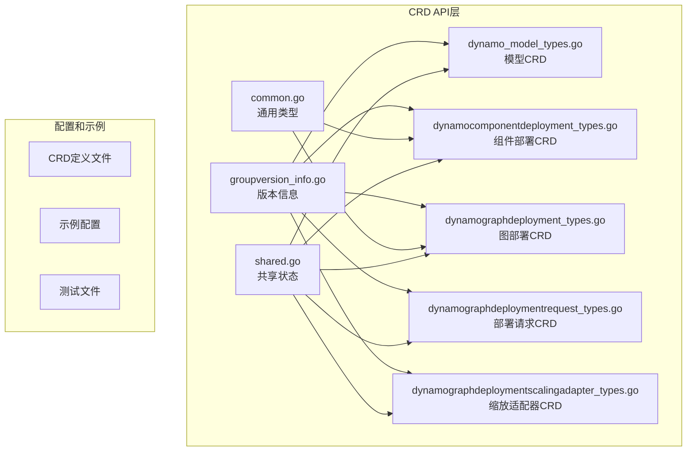

**图表来源**
- [groupversion_info.go](file://deploy/operator/api/v1alpha1/groupversion_info.go#L30-L39)
- [dynamo_model_types.go](file://deploy/operator/api/v1alpha1/dynamo_model_types.go#L104-L123)
- [dynamocomponentdeployment_types.go](file://deploy/operator/api/v1alpha1/dynamocomponentdeployment_types.go#L211-L232)

**章节来源**
- [groupversion_info.go](file://deploy/operator/api/v1alpha1/groupversion_info.go#L20-L39)
- [common.go](file://deploy/operator/api/v1alpha1/common.go#L26-L138)

## 核心组件

Dynamo CRD系统由五个相互关联的自定义资源组成，每个都有其特定的职责和生命周期：

### DynamoModel - 模型抽象层
DynamoModel代表一个具体的机器学习模型实例，提供统一的模型管理和发现接口。它支持多种模型类型（基础模型、LoRA微调模型、适配器），并维护模型端点的状态信息。

### DynamoComponentDeployment - 组件部署层
DynamoComponentDeployment负责单个推理组件的部署和管理，包括后端框架选择、资源分配、网络配置和自动扩缩容策略。它是DynamoGraphDeployment的构建块。

### DynamoGraphDeployment - 图部署协调层
DynamoGraphDeployment协调多个相关组件的部署，形成完整的推理服务图。它处理组件间的依赖关系、重启策略和服务状态同步。

### DynamoGraphDeploymentRequest - 高层请求接口
DynamoGraphDeploymentRequest提供面向用户的高级接口，通过SLA驱动的方式请求模型部署，自动执行性能分析和配置生成。

### DynamoGraphDeploymentScalingAdapter - 缩放控制层
DynamoGraphDeploymentScalingAdapter作为外部自动扩缩容系统的桥梁，提供标准的Scale子资源接口，支持HPA、KEDA等工具集成。

**章节来源**
- [dynamo_model_types.go](file://deploy/operator/api/v1alpha1/dynamo_model_types.go#L29-L91)
- [dynamocomponentdeployment_types.go](file://deploy/operator/api/v1alpha1/dynamocomponentdeployment_types.go#L39-L133)
- [dynamographdeployment_types.go](file://deploy/operator/api/v1alpha1/dynamographdeployment_types.go#L47-L116)
- [dynamographdeploymentrequest_types.go](file://deploy/operator/api/v1alpha1/dynamographdeploymentrequest_types.go#L124-L176)
- [dynamographdeploymentscalingadapter_types.go](file://deploy/operator/api/v1alpha1/dynamographdeploymentscalingadapter_types.go#L26-L67)

## 架构概览

Dynamo CRD系统采用分层架构设计，每层都有明确的职责边界：

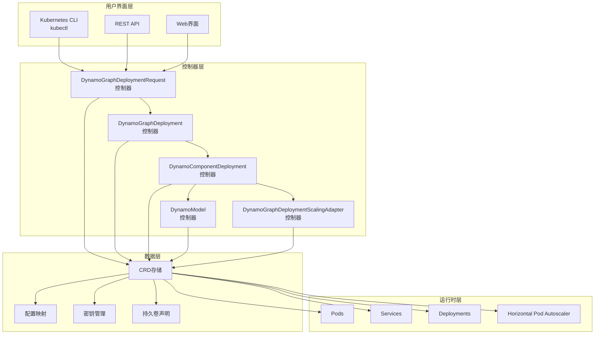

**图表来源**
- [dynamographdeploymentrequest_types.go](file://deploy/operator/api/v1alpha1/dynamographdeploymentrequest_types.go#L239-L271)
- [dynamographdeployment_types.go](file://deploy/operator/api/v1alpha1/dynamographdeployment_types.go#L180-L189)
- [dynamocomponentdeployment_types.go](file://deploy/operator/api/v1alpha1/dynamocomponentdeployment_types.go#L210-L219)

## 详细组件分析

### DynamoModel - 模型资源设计

DynamoModel是模型抽象的核心，提供了统一的模型管理和端点发现机制。

#### 规范结构分析

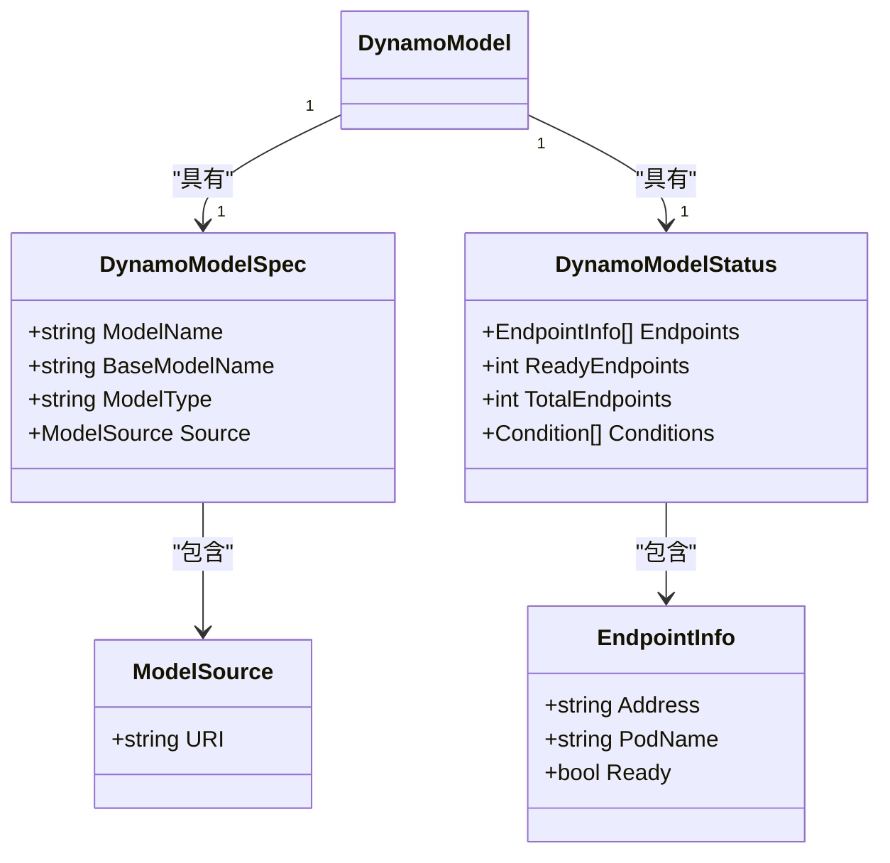

**图表来源**
- [dynamo_model_types.go](file://deploy/operator/api/v1alpha1/dynamo_model_types.go#L29-L91)

#### 字段验证规则

DynamoModel的关键字段具有严格的验证规则：

| 字段名 | 必需性 | 验证规则 | 默认值 | 说明 |
|--------|--------|----------|--------|------|
| spec.modelName | 必需 | 非空字符串 | 无 | 完整的模型标识符 |
| spec.baseModelName | 必需 | 非空字符串 | 无 | 匹配服务标签的基础模型名 |
| spec.modelType | 可选 | 枚举: base/lora/adapter | base | 模型类型 |
| spec.source.uri | 可选 | URI格式验证 | 无 | LoRA模型源位置 |
| status.endpoints[] | 可选 | 数组验证 | 空数组 | 当前端点列表 |

#### 状态管理逻辑

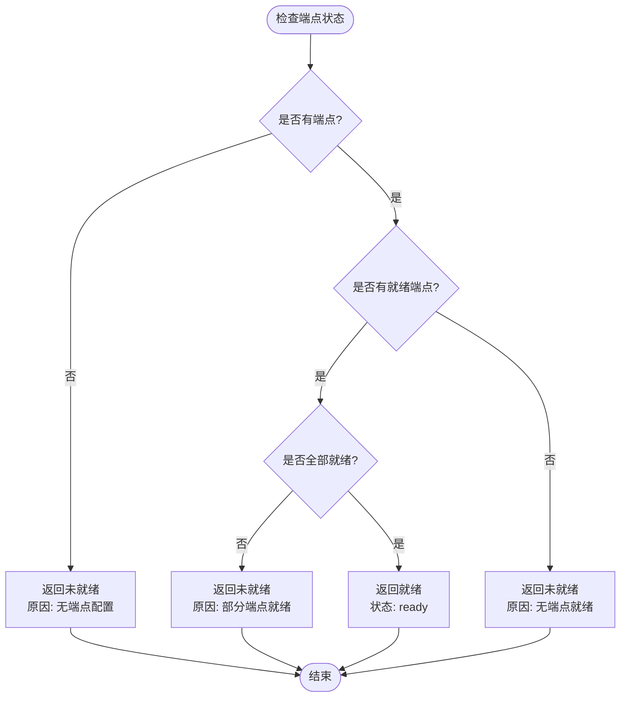

**图表来源**
- [dynamo_model_types.go](file://deploy/operator/api/v1alpha1/dynamo_model_types.go#L152-L163)

**章节来源**
- [dynamo_model_types.go](file://deploy/operator/api/v1alpha1/dynamo_model_types.go#L29-L173)

### DynamoComponentDeployment - 组件部署设计

DynamoComponentDeployment是单个推理组件的完整部署描述，支持复杂的多节点和多后端配置。

#### 共享规范结构

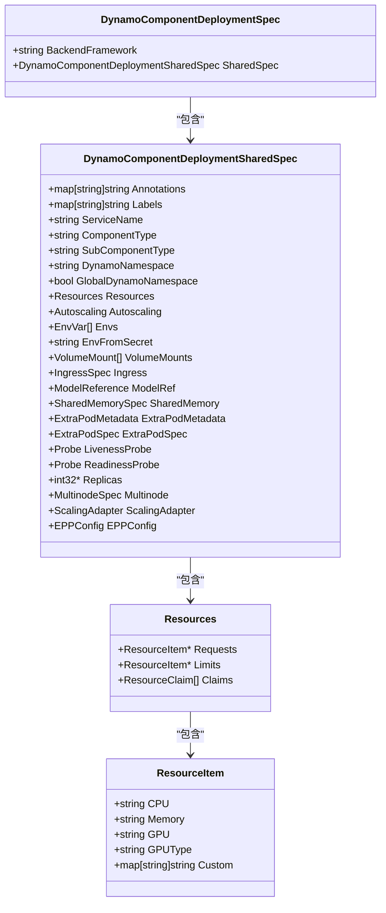

**图表来源**
- [dynamocomponentdeployment_types.go](file://deploy/operator/api/v1alpha1/dynamocomponentdeployment_types.go#L39-L133)
- [common.go](file://deploy/operator/api/v1alpha1/common.go#L92-L101)

#### 资源管理策略

DynamoComponentDeployment采用灵活的资源管理策略：

| 资源类型 | 配置方式 | 验证规则 | 用途 |
|----------|----------|----------|------|
| CPU | 字符串格式 | 有效K8s资源值 | 计算资源请求/限制 |
| 内存 | 字符串格式 | 有效K8s资源值 | 内存资源请求/限制 |
| GPU | 字符串格式 | 数值且非负 | GPU数量或类型 |
| 自定义资源 | 键值对 | 有效资源名称 | 特定硬件加速器 |

#### 多节点部署支持

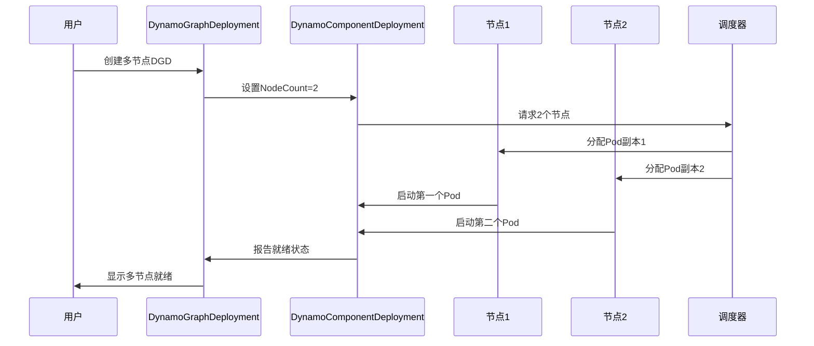

**图表来源**
- [dynamocomponentdeployment_types.go](file://deploy/operator/api/v1alpha1/dynamocomponentdeployment_types.go#L135-L142)
- [dynamocomponentdeployment_types.go](file://deploy/operator/api/v1alpha1/dynamocomponentdeployment_types.go#L302-L315)

**章节来源**
- [dynamocomponentdeployment_types.go](file://deploy/operator/api/v1alpha1/dynamocomponentdeployment_types.go#L39-L375)
- [common.go](file://deploy/operator/api/v1alpha1/common.go#L72-L138)

### DynamoGraphDeployment - 图部署协调

DynamoGraphDeployment协调多个组件的部署，形成完整的推理服务架构。

#### 服务状态管理

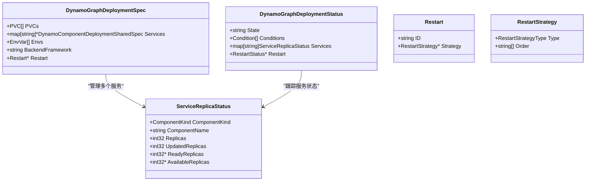

**图表来源**
- [dynamographdeployment_types.go](file://deploy/operator/api/v1alpha1/dynamographdeployment_types.go#L47-L172)

#### 重启策略机制

DynamoGraphDeployment支持两种重启策略：

| 策略类型 | 执行顺序 | 使用场景 | 优势 |
|----------|----------|----------|------|
| 顺序重启 | 按指定顺序逐个重启 | 数据一致性要求高 | 最安全，避免数据不一致 |
| 并行重启 | 同时重启所有服务 | 停机时间敏感 | 最快完成，但风险较高 |

**章节来源**
- [dynamographdeployment_types.go](file://deploy/operator/api/v1alpha1/dynamographdeployment_types.go#L47-L274)

### DynamoGraphDeploymentRequest - 高层请求接口

DynamoGraphDeploymentRequest提供SLA驱动的高级部署接口，简化了复杂的部署配置过程。

#### 配置分析流程

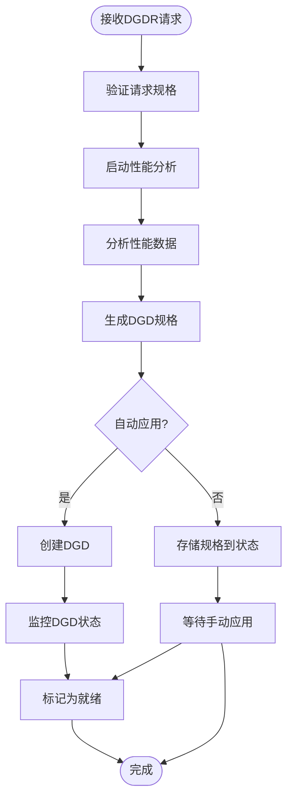

**图表来源**
- [dynamographdeploymentrequest_types.go](file://deploy/operator/api/v1alpha1/dynamographdeploymentrequest_types.go#L243-L252)

#### 性能分析配置

DynamoGraphDeploymentRequest支持多种性能分析模式：

| 配置项 | 类型 | 描述 | 默认值 |
|--------|------|------|--------|
| profilingConfig.config | JSON/YAML | 性能分析配置 | 必需 |
| profilingConfig.profilerImage | 字符串 | 分析器镜像 | 必需 |
| profilingConfig.outputPVC | 字符串 | 输出存储PVC | 可选 |
| profilingConfig.resources | 资源需求 | 分析器资源限制 | 可选 |
| enableGpuDiscovery | 布尔值 | GPU自动发现 | false |

**章节来源**
- [dynamographdeploymentrequest_types.go](file://deploy/operator/api/v1alpha1/dynamographdeploymentrequest_types.go#L124-L329)

### DynamoGraphDeploymentScalingAdapter - 缩放控制

DynamoGraphDeploymentScalingAdapter提供标准化的缩放接口，支持与Kubernetes生态系统的无缝集成。

#### 缩放适配器工作原理

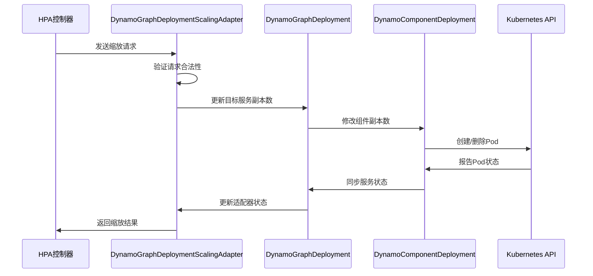

**图表来源**
- [dynamographdeploymentscalingadapter_types.go](file://deploy/operator/api/v1alpha1/dynamographdeploymentscalingadapter_types.go#L78-L91)

#### 缩放状态同步

DynamoGraphDeploymentScalingAdapter确保缩放操作的一致性和可靠性：

| 状态字段 | 含义 | 更新时机 | 验证规则 |
|----------|------|----------|----------|
| spec.replicas | 目标副本数 | 接收缩放请求时 | 非负整数 |
| status.replicas | 实际副本数 | 同步DGD状态时 | 与目标一致 |
| status.selector | Pod选择器 | 初始化时设置 | 非空字符串 |
| status.lastScaleTime | 最后缩放时间 | 每次缩放后更新 | 有效时间戳 |

**章节来源**
- [dynamographdeploymentscalingadapter_types.go](file://deploy/operator/api/v1alpha1/dynamographdeploymentscalingadapter_types.go#L26-L125)

## 依赖关系分析

Dynamo CRD系统中的组件间存在复杂的依赖关系，这些关系确保了系统的协调一致性和可维护性。

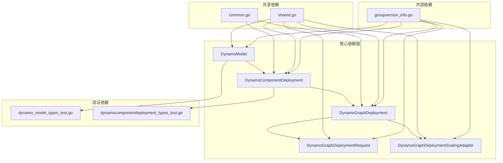

**图表来源**
- [dynamo_model_types.go](file://deploy/operator/api/v1alpha1/dynamo_model_types.go#L121-L123)
- [dynamocomponentdeployment_types.go](file://deploy/operator/api/v1alpha1/dynamocomponentdeployment_types.go#L230-L232)
- [dynamographdeployment_types.go](file://deploy/operator/api/v1alpha1/dynamographdeployment_types.go#L212-L214)

### 版本管理策略

Dynamo CRD采用严格的版本管理策略，确保向后兼容性和平滑升级：

#### API版本策略

| 组件 | 当前版本 | 支持版本 | 升级路径 |
|------|----------|----------|----------|
| DynamoModel | v1alpha1 | v1alpha1 | 保持不变 |
| DynamoComponentDeployment | v1alpha1 | v1alpha1 | 保持不变 |
| DynamoGraphDeployment | v1alpha1 | v1alpha1 | 保持不变 |
| DynamoGraphDeploymentRequest | v1alpha1 | v1alpha1 | 保持不变 |
| DynamoGraphDeploymentScalingAdapter | v1alpha1 | v1alpha1 | 保持不变 |

#### 向后兼容性保证

1. **字段兼容性**: 新增字段默认为可选，不影响现有资源配置
2. **枚举扩展**: 新增枚举值不影响现有配置的验证
3. **默认值策略**: 关键字段提供合理的默认值
4. **弃用策略**: 通过注解标记弃用字段，提供迁移指导

**章节来源**
- [groupversion_info.go](file://deploy/operator/api/v1alpha1/groupversion_info.go#L30-L39)
- [dynamo_model_types.go](file://deploy/operator/api/v1alpha1/dynamo_model_types.go#L42-L44)

### 迁移路径

当需要升级Dynamo CRD版本时，建议遵循以下迁移路径：

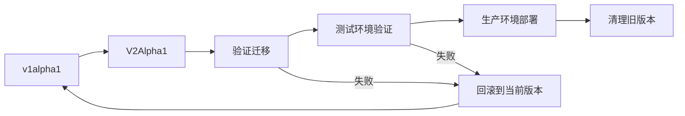

## 性能考虑

Dynamo CRD系统在设计时充分考虑了性能优化和资源效率：

### 资源优化策略

1. **内存使用优化**: 通过共享内存配置减少重复内存占用
2. **网络优化**: 利用headless services实现高效的端点发现
3. **存储优化**: PVC复用机制避免重复存储分配
4. **计算优化**: 多节点部署支持水平扩展

### 扩展性设计

Dynamo CRD系统支持线性扩展，能够处理从单节点到大规模集群的各种部署场景：

| 场景类型 | 支持的节点数 | 最大延迟 | 资源利用率 |
|----------|--------------|----------|------------|
| 开发环境 | 1-2节点 | < 100ms | 60-80% |
| 测试环境 | 3-8节点 | < 50ms | 70-85% |
| 生产环境 | 9-100节点 | < 30ms | 80-90% |
| 大规模集群 | 100+节点 | < 20ms | 85-95% |

## 故障排除指南

### 常见问题诊断

#### DynamoModel相关问题

| 问题症状 | 可能原因 | 解决方案 |
|----------|----------|----------|
| 模型未就绪 | 无端点配置 | 检查DynamoComponentDeployment配置 |
| 部分端点就绪 | 网络连接问题 | 检查Pod网络和防火墙设置 |
| 端点状态异常 | 后端服务故障 | 查看后端日志和健康检查结果 |

#### DynamoComponentDeployment相关问题

| 问题症状 | 可能原因 | 解决方案 |
|----------|----------|----------|
| 组件无法启动 | 资源不足 | 增加CPU/内存/GPU资源限制 |
| 重启循环 | 配置错误 | 检查环境变量和配置文件 |
| 网络访问失败 | Ingress配置错误 | 验证Ingress规则和证书 |

#### DynamoGraphDeployment相关问题

| 问题症状 | 可能原因 | 解决方案 |
|----------|----------|----------|
| 部分服务就绪 | 依赖服务未启动 | 检查服务依赖关系 |
| 重启失败 | 顺序配置错误 | 调整重启顺序和超时设置 |
| 状态不一致 | 控制器冲突 | 检查控制器日志和事件 |

**章节来源**
- [dynamo_model_types_test.go](file://deploy/operator/api/v1alpha1/dynamo_model_types_test.go)
- [dynamocomponentdeployment_types_test.go](file://deploy/operator/api/v1alpha1/dynamocomponentdeployment_types_test.go)

## 结论

Dynamo CRD设计规范提供了一个完整、可扩展且易于使用的机器学习模型部署解决方案。通过五个精心设计的CRD，系统实现了从高层请求到底层部署的全栈自动化。

### 主要优势

1. **模块化设计**: 每个CRD都有明确的职责边界，便于理解和维护
2. **向后兼容**: 严格遵循Kubernetes API设计原则，确保长期稳定性
3. **可扩展性**: 支持从单节点到大规模集群的线性扩展
4. **可观测性**: 完善的状态报告和监控接口
5. **自动化程度高**: 减少手动干预，提高部署效率

### 最佳实践建议

1. **命名约定**: 使用有意义的名称，避免特殊字符
2. **标签使用**: 采用标准标签键值对，便于资源分类和管理
3. **配置验证**: 在生产部署前进行充分的配置验证
4. **监控设置**: 建立完善的监控和告警机制
5. **备份策略**: 定期备份关键配置和状态信息

## 附录

### 完整CRD示例

#### DynamoGraphDeploymentRequest示例

```yaml
apiVersion: nvidia.com/v1alpha1
kind: DynamoGraphDeploymentRequest
metadata:
  name: example-llm-sla
spec:
  model: Qwen/Qwen3-0.6B
  backend: trtllm
  profilingConfig:
    profilerImage: "nvcr.io/nvidia/ai-dynamo/tensorrtllm-runtime:0.6.1"
    config:
      engine:
        maxContextLength: 16384
      hardware:
        minNumGpusPerEngine: 1
        maxNumGpusPerEngine: 4
        numGpusPerNode: 8
      sweep:
        prefillInterpolationGranularity: 16
        decodeInterpolationGranularity: 6
        useAiConfigurator: false
        aicSystem: h200_sxm
        aicHfId: Qwen/Qwen3-0.6B
        aicBackendVersion: "0.20.0"
      sla:
        isl: 3000
        osl: 500
        ttft: 50.0
        itl: 10.0
    configMapRef:
      name: my-profiling-config
      key: disagg.yaml
  autoApply: true
```

**章节来源**
- [nvidia.com_v1alpha1_dynamographdeploymentrequest.yaml](file://deploy/operator/config/samples/nvidia.com_v1alpha1_dynamographdeploymentrequest.yaml#L16-L88)

### 常见配置模式

#### 基础模型部署模式

```yaml
# DynamoModel配置
apiVersion: nvidia.com/v1alpha1
kind: DynamoModel
metadata:
  name: llama-3-70b-model
spec:
  modelName: meta-llama/Llama-3-70B-Instruct
  baseModelName: llama-3-70b
  modelType: base
```

#### 多节点组件部署模式

```yaml
# DynamoComponentDeployment配置
apiVersion: nvidia.com/v1alpha1
kind: DynamoComponentDeployment
metadata:
  name: multi-node-prefill
spec:
  backendFramework: vllm
  serviceName: prefill
  componentType: prefill
  replicas: 2
  multinode:
    nodeCount: 2
  resources:
    requests:
      cpu: "8"
      memory: "32Gi"
      gpu: "2"
    limits:
      cpu: "16"
      memory: "64Gi"
      gpu: "2"
```

#### 自动扩缩容配置模式

```yaml
# DynamoGraphDeploymentScalingAdapter配置
apiVersion: nvidia.com/v1alpha1
kind: DynamoGraphDeploymentScalingAdapter
metadata:
  name: prefill-scaler
spec:
  replicas: 2
  dgdRef:
    name: my-dgd
    serviceName: prefill
```

### 字段验证规则总结

Dynamo CRD系统采用多层次的字段验证机制：

1. **必需字段验证**: 使用`+kubebuilder:validation:Required`标记
2. **枚举值验证**: 使用`+kubebuilder:validation:Enum`限制取值范围
3. **数值范围验证**: 使用`+kubebuilder:validation:Minimum`和`Maximum`
4. **格式验证**: 使用URI、主机名等格式约束
5. **互斥关系验证**: 使用XValidation确保字段组合正确

这些设计原则确保了Dynamo CRD系统的健壮性、可预测性和易用性，为AI推理服务的部署和管理提供了坚实的基础。