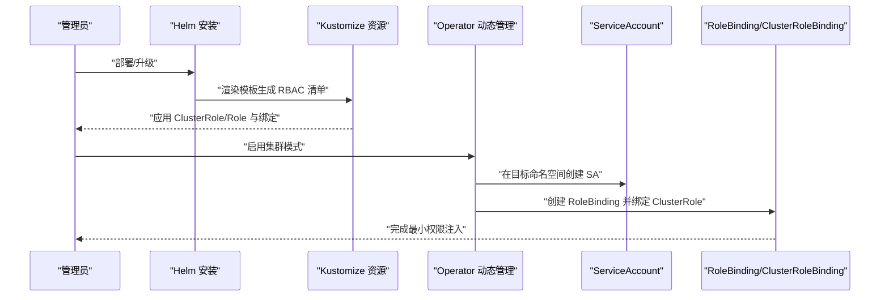
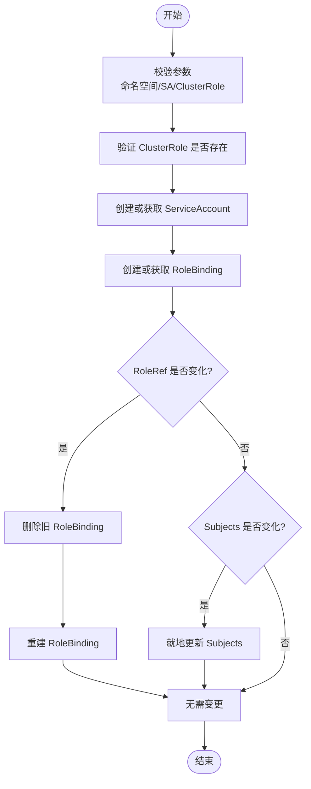
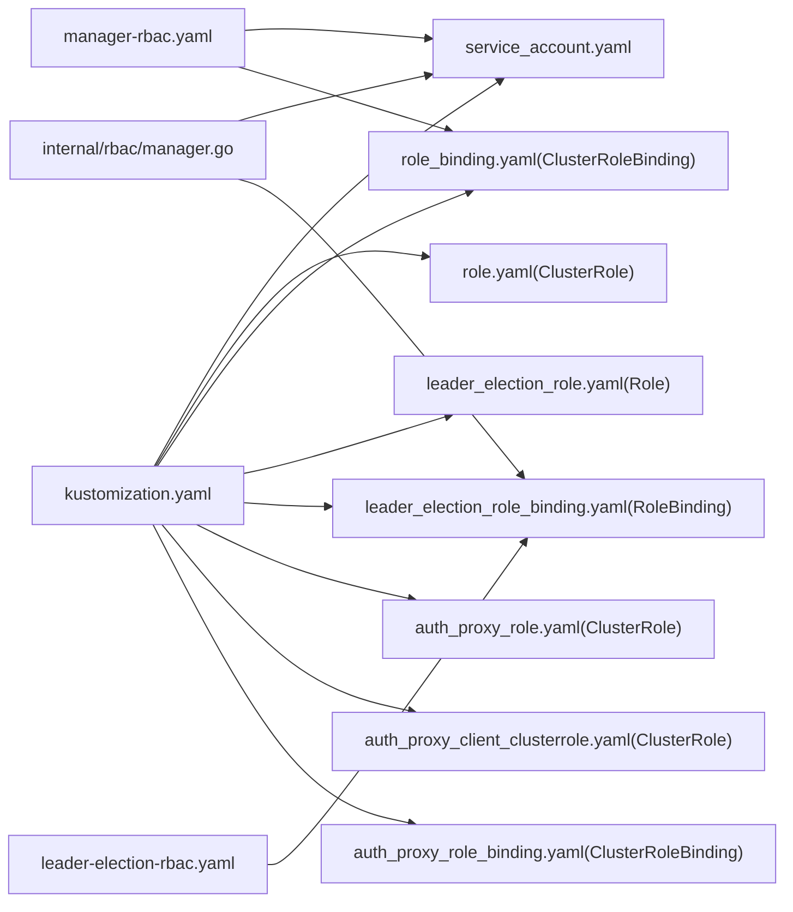

# RBAC权限模型

<cite>
**本文引用的文件**
- [deploy/operator/config/rbac/kustomization.yaml](file://deploy/operator/config/rbac/kustomization.yaml)
- [deploy/operator/config/rbac/service_account.yaml](file://deploy/operator/config/rbac/service_account.yaml)
- [deploy/operator/config/rbac/role.yaml](file://deploy/operator/config/rbac/role.yaml)
- [deploy/operator/config/rbac/role_binding.yaml](file://deploy/operator/config/rbac/role_binding.yaml)
- [deploy/operator/config/rbac/leader_election_role.yaml](file://deploy/operator/config/rbac/leader_election_role.yaml)
- [deploy/operator/config/rbac/leader_election_role_binding.yaml](file://deploy/operator/config/rbac/leader_election_role_binding.yaml)
- [deploy/operator/config/rbac/auth_proxy_role.yaml](file://deploy/operator/config/rbac/auth_proxy_role.yaml)
- [deploy/operator/config/rbac/auth_proxy_client_clusterrole.yaml](file://deploy/operator/config/rbac/auth_proxy_client_clusterrole.yaml)
- [deploy/operator/config/rbac/auth_proxy_role_binding.yaml](file://deploy/operator/config/rbac/auth_proxy_role_binding.yaml)
- [deploy/operator/internal/rbac/manager.go](file://deploy/operator/internal/rbac/manager.go)
- [deploy/helm/charts/platform/components/operator/templates/manager-rbac.yaml](file://deploy/helm/charts/platform/components/operator/templates/manager-rbac.yaml)
- [deploy/helm/charts/platform/components/operator/templates/leader-election-rbac.yaml](file://deploy/helm/charts/platform/components/operator/templates/leader-election-rbac.yaml)
- [recipes/llama-3-70b/vllm/agg/gaie/k8s-manifests/rbac/cluster-role.yaml](file://recipes/llama-3-70b/vllm/agg/gaie/k8s-manifests/rbac/cluster-role.yaml)
- [recipes/llama-3-70b/vllm/agg/gaie/k8s-manifests/rbac/role-binding.yaml](file://recipes/llama-3-70b/vllm/agg/gaie/k8s-manifests/rbac/role-binding.yaml)
- [recipes/llama-3-70b/vllm/agg/gaie/k8s-manifests/rbac/service-account.yaml](file://recipes/llama-3-70b/vllm/agg/gaie/k8s-manifests/rbac/service-account.yaml)
</cite>

## 目录
1. [简介](#简介)
2. [项目结构](#项目结构)
3. [核心组件](#核心组件)
4. [架构总览](#架构总览)
5. [详细组件分析](#详细组件分析)
6. [依赖关系分析](#依赖关系分析)
7. [性能考量](#性能考量)
8. [故障排查指南](#故障排查指南)
9. [结论](#结论)
10. [附录](#附录)

## 简介
本文件系统化梳理 Dynamo 的 Kubernetes RBAC 权限模型，聚焦于控制器在集群中的权限架构设计，涵盖 ClusterRole、Role 与 ServiceAccount 的配置与作用域；详解 LeaderElectionRole、AuthProxyRole 等特殊角色的职责与使用场景；阐明权限继承关系与最小权限原则的应用；说明 ServiceAccount 的配置与密钥管理策略；并提供权限问题的诊断与修复路径、权限审计与合规性检查最佳实践，以及完整的 RBAC 配置示例与权限测试方法。

## 项目结构
Dynamo 的 RBAC 相关资源主要分布在两处：
- Helm Chart 模板：提供默认的集群级或命名空间级 RBAC 清单，支持命名空间限制与队列访问等能力。
- Operator 内部 RBAC 管理器：在“集群模式”下动态为组件目标命名空间创建 ServiceAccount 与 RoleBinding，并绑定已存在的 ClusterRole。

```mermaid
graph TB
subgraph "Helm 模板"
M["manager-rbac.yaml"]
LER["leader-election-rbac.yaml"]
end
subgraph "Kustomize 资源"
K["kustomization.yaml"]
SA["service_account.yaml"]
CR["role.yaml(ClusterRole)"]
CRB["role_binding.yaml(ClusterRoleBinding)"]
LCR["leader_election_role.yaml(Role)"]
LCRB["leader_election_role_binding.yaml(RoleBinding)"]
APR["auth_proxy_role.yaml(ClusterRole)"]
APCR["auth_proxy_client_clusterrole.yaml(ClusterRole)"]
APB["auth_proxy_role_binding.yaml(ClusterRoleBinding)"]
end
subgraph "Operator 动态管理"
OM["internal/rbac/manager.go"]
end
subgraph "示例配方"
RCR["recipes/*/rbac/cluster-role.yaml"]
RRB["recipes/*/rbac/role-binding.yaml"]
RSA["recipes/*/rbac/service-account.yaml"]
end
M --> SA
M --> CRB
LER --> LCRB
K --> SA
K --> CR
K --> CRB
K --> LCR
K --> LCRB
K --> APR
K --> APCR
K --> APB
OM --> |"集群模式动态创建"| SA
OM --> |"动态创建并绑定"| LCRB
RCR --> RRB --> RSA
```

图表来源
- [deploy/helm/charts/platform/components/operator/templates/manager-rbac.yaml](file://deploy/helm/charts/platform/components/operator/templates/manager-rbac.yaml#L15-L554)
- [deploy/helm/charts/platform/components/operator/templates/leader-election-rbac.yaml](file://deploy/helm/charts/platform/components/operator/templates/leader-election-rbac.yaml#L15-L91)
- [deploy/operator/config/rbac/kustomization.yaml](file://deploy/operator/config/rbac/kustomization.yaml#L16-L44)
- [deploy/operator/internal/rbac/manager.go](file://deploy/operator/internal/rbac/manager.go#L54-L207)
- [recipes/llama-3-70b/vllm/agg/gaie/k8s-manifests/rbac/cluster-role.yaml](file://recipes/llama-3-70b/vllm/agg/gaie/k8s-manifests/rbac/cluster-role.yaml)
- [recipes/llama-3-70b/vllm/agg/gaie/k8s-manifests/rbac/role-binding.yaml](file://recipes/llama-3-70b/vllm/agg/gaie/k8s-manifests/rbac/role-binding.yaml)
- [recipes/llama-3-70b/vllm/agg/gaie/k8s-manifests/rbac/service-account.yaml](file://recipes/llama-3-70b/vllm/agg/gaie/k8s-manifests/rbac/service-account.yaml)

章节来源
- [deploy/helm/charts/platform/components/operator/templates/manager-rbac.yaml](file://deploy/helm/charts/platform/components/operator/templates/manager-rbac.yaml#L15-L554)
- [deploy/helm/charts/platform/components/operator/templates/leader-election-rbac.yaml](file://deploy/helm/charts/platform/components/operator/templates/leader-election-rbac.yaml#L15-L91)
- [deploy/operator/config/rbac/kustomization.yaml](file://deploy/operator/config/rbac/kustomization.yaml#L16-L44)
- [deploy/operator/internal/rbac/manager.go](file://deploy/operator/internal/rbac/manager.go#L54-L207)

## 核心组件
- ServiceAccount：作为工作负载的身份主体，被 Role/ClusterRole 绑定以授予具体权限。
- ClusterRole/Role：定义一组规则（API 组、资源、动词），决定可执行的操作范围。
- RoleBinding/ClusterRoleBinding：将主体（ServiceAccount）与角色（Role/ClusterRole）关联，形成“授权”。
- 特殊角色：
  - LeaderElectionRole：用于主控选举所需的 ConfigMap、Lease、Event 操作。
  - AuthProxyRole：为 kube-rbac-proxy 提供 TokenReview 与 SubjectAccessReview 的调用权限。
  - AuthProxyClientClusterRole：允许对 /metrics 非资源端点进行 GET 访问，供 kube-rbac-proxy 代理保护指标端点。

章节来源
- [deploy/operator/config/rbac/service_account.yaml](file://deploy/operator/config/rbac/service_account.yaml#L16-L28)
- [deploy/operator/config/rbac/role.yaml](file://deploy/operator/config/rbac/role.yaml#L17-L247)
- [deploy/operator/config/rbac/role_binding.yaml](file://deploy/operator/config/rbac/role_binding.yaml#L16-L35)
- [deploy/operator/config/rbac/leader_election_role.yaml](file://deploy/operator/config/rbac/leader_election_role.yaml#L17-L60)
- [deploy/operator/config/rbac/leader_election_role_binding.yaml](file://deploy/operator/config/rbac/leader_election_role_binding.yaml#L16-L35)
- [deploy/operator/config/rbac/auth_proxy_role.yaml](file://deploy/operator/config/rbac/auth_proxy_role.yaml#L16-L40)
- [deploy/operator/config/rbac/auth_proxy_client_clusterrole.yaml](file://deploy/operator/config/rbac/auth_proxy_client_clusterrole.yaml#L16-L32)
- [deploy/operator/config/rbac/auth_proxy_role_binding.yaml](file://deploy/operator/config/rbac/auth_proxy_role_binding.yaml#L16-L35)

## 架构总览
Dynamo 的 RBAC 架构分为两类部署形态：
- Helm 默认安装：生成集群级或命名空间级的 Role/ClusterRole 与 RoleBinding/ClusterRoleBinding，支持命名空间限制与队列只读访问。
- 集群模式（Cluster-wide）：由 Operator 动态在目标命名空间创建 ServiceAccount 与 RoleBinding，并绑定已存在的 ClusterRole，实现按需最小权限注入。

图表来源
- [deploy/helm/charts/platform/components/operator/templates/manager-rbac.yaml](file://deploy/helm/charts/platform/components/operator/templates/manager-rbac.yaml#L15-L554)
- [deploy/operator/config/rbac/kustomization.yaml](file://deploy/operator/config/rbac/kustomization.yaml#L16-L44)
- [deploy/operator/internal/rbac/manager.go](file://deploy/operator/internal/rbac/manager.go#L54-L207)

## 详细组件分析

### ServiceAccount 配置与密钥管理
- 默认 ServiceAccount 名称与命名空间：在默认安装中，控制器使用名为 controller-manager 的 ServiceAccount，位于 system 命名空间。
- 密钥管理：Kubernetes 自动为 ServiceAccount 创建对应的 Secret（令牌），用于 API Server 认证。建议通过命名空间级别的安全策略限制 Secret 访问，并结合 Pod 的 automountServiceAccountToken 与 imagePullSecrets 进行最小暴露。
- 动态注入：在集群模式下，Operator 会在目标命名空间动态创建 SA，并绑定到已存在的 ClusterRole，避免跨命名空间硬编码权限。

章节来源
- [deploy/operator/config/rbac/service_account.yaml](file://deploy/operator/config/rbac/service_account.yaml#L16-L28)
- [deploy/operator/internal/rbac/manager.go](file://deploy/operator/internal/rbac/manager.go#L98-L126)

### ClusterRole 与 Role 的权限范围
- 管理员角色（ClusterRole）：覆盖核心资源（ConfigMap、Service、Deployment、StatefulSet、Job、CronJob、HPA、Lease、Event、Ingress、VirtualService、Pod、Secret、ServiceAccount、CRD、自定义资源等）的 CRUDLPUW 操作，以及对 RBAC 资源（ClusterRole/Role、ClusterRoleBinding/RoleBinding）的管理能力，确保 Operator 可以完整编排平台组件。
- 命名空间受限角色（Role）：当启用命名空间限制时，Helm 将生成 Role 与 RoleBinding，仅授予目标命名空间内的资源操作权限，符合最小权限原则。
- 队列访问（ClusterRole）：为调度队列（Queue）提供只读访问，便于组件查询队列状态与容量。

章节来源
- [deploy/operato/config/rbac/role.yaml](file://deploy/operato/config/rbac/role.yaml#L17-L247)
- [deploy/helm/charts/platform/components/operator/templates/manager-rbac.yaml](file://deploy/helm/charts/platform/components/operator/templates/manager-rbac.yaml#L28-L486)
- [deploy/helm/charts/platform/components/operator/templates/manager-rbac.yaml](file://deploy/helm/charts/platform/components/operator/templates/manager-rbac.yaml#L517-L554)

### LeaderElectionRole 与主控选举
- 作用域：Role（命名空间内）或 ClusterRole（根据 Helm 值），用于主控选举所需的 ConfigMap、Lease、Event 操作。
- 使用场景：多副本控制器需要通过 ConfigMap/Lease 实现互斥与领导者选择，Event 用于记录选举事件。
- 最小权限：仅授予必要的资源与动词，避免过度授权。

章节来源
- [deploy/operato/config/rbac/leader_election_role.yaml](file://deploy/operato/config/rbac/leader_election_role.yaml#L17-L60)
- [deploy/operato/config/rbac/leader_election_role_binding.yaml](file://deploy/operato/config/rbac/leader_election_role_binding.yaml#L16-L35)
- [deploy/helm/charts/platform/components/operator/templates/leader-election-rbac.yaml](file://deploy/helm/charts/platform/components/operator/templates/leader-election-rbac.yaml#L31-L62)

### AuthProxyRole 与指标保护
- AuthProxyRole（ClusterRole）：授予对 authentication.k8s.io/tokenreviews 与 authorization.k8s.io/subjectaccessreviews 的 create 权限，供 kube-rbac-proxy 执行身份验证与授权决策。
- AuthProxyClientClusterRole（ClusterRole）：允许对 /metrics 非资源 URL 执行 GET 请求，使 kube-rbac-proxy 能代理认证后的指标访问。
- 绑定：AuthProxyRole 与 AuthProxyClientClusterRole 通过 ClusterRoleBinding 绑定到 ServiceAccount，保护 /metrics 端点。

章节来源
- [deploy/operato/config/rbac/auth_proxy_role.yaml](file://deploy/operato/config/rbac/auth_proxy_role.yaml#L16-L40)
- [deploy/operato/config/rbac/auth_proxy_client_clusterrole.yaml](file://deploy/operato/config/rbac/auth_proxy_client_clusterrole.yaml#L16-L32)
- [deploy/operato/config/rbac/auth_proxy_role_binding.yaml](file://deploy/operato/config/rbac/auth_proxy_role_binding.yaml#L16-L35)

### 权限继承关系与最小权限原则
- 继承关系：RoleBinding/ClusterRoleBinding 将 ServiceAccount 与 Role/ClusterRole 关联，形成“授权链”。在集群模式下，动态 RoleBinding 绑定到已存在的 ClusterRole，避免重复定义。
- 最小权限：通过命名空间限制（Role/RoleBinding）、仅授予必要资源与动词、以及按需动态注入（集群模式）实现最小权限。
- 权限分离：将管理类（ClusterRole）与命名空间内操作（Role）分离，避免越权。

章节来源
- [deploy/operato/config/rbac/kustomization.yaml](file://deploy/operato/config/rbac/kustomization.yaml#L16-L44)
- [deploy/helm/charts/platform/components/operator/templates/manager-rbac.yaml](file://deploy/helm/charts/platform/components/operator/templates/manager-rbac.yaml#L488-L516)
- [deploy/operator/internal/rbac/manager.go](file://deploy/operator/internal/rbac/manager.go#L54-L207)

### Operator 动态 RBAC 管理流程
- 输入参数校验：目标命名空间、ServiceAccount 名称、ClusterRole 名称均不能为空。
- 验证 ClusterRole 存在：在创建 RoleBinding 前必须确保 ClusterRole 已存在。
- 创建/更新 ServiceAccount：若不存在则创建，否则跳过。
- 创建/更新 RoleBinding：若 RoleRef 发生变化则删除并重建（RoleRef 不可变更），否则仅更新 Subjects（可就地更新）。
- 日志与可观测性：记录创建、更新、删除等关键事件，便于审计与排障。

图表来源
- [deploy/operator/internal/rbac/manager.go](file://deploy/operator/internal/rbac/manager.go#L68-L207)

章节来源
- [deploy/operator/internal/rbac/manager.go](file://deploy/operator/internal/rbac/manager.go#L54-L207)

### 示例配方中的 RBAC
配方示例展示了独立组件的 RBAC 配置，包括：
- ClusterRole：定义组件所需的核心资源与动词集合。
- RoleBinding：将 ServiceAccount 绑定到 ClusterRole。
- ServiceAccount：在目标命名空间运行组件的工作身份。

章节来源
- [recipes/llama-3-70b/vllm/agg/gaie/k8s-manifests/rbac/cluster-role.yaml](file://recipes/llama-3-70b/vllm/agg/gaie/k8s-manifests/rbac/cluster-role.yaml)
- [recipes/llama-3-70b/vllm/agg/gaie/k8s-manifests/rbac/role-binding.yaml](file://recipes/llama-3-70b/vllm/agg/gaie/k8s-manifests/rbac/role-binding.yaml)
- [recipes/llama-3-70b/vllm/agg/gaie/k8s-manifests/rbac/service-account.yaml](file://recipes/llama-3-70b/vllm/agg/gaie/k8s-manifests/rbac/service-account.yaml)

## 依赖关系分析
- Helm 模板依赖 Kustomize 资源清单，生成集群级或命名空间级 RBAC。
- Operator 动态管理依赖已存在的 ClusterRole，通过 RoleBinding 注入到目标命名空间。
- AuthProxy 相关资源共同构成指标端点保护链路。

图表来源
- [deploy/operato/config/rbac/kustomization.yaml](file://deploy/operato/config/rbac/kustomization.yaml#L16-L44)
- [deploy/helm/charts/platform/components/operator/templates/manager-rbac.yaml](file://deploy/helm/charts/platform/components/operator/templates/manager-rbac.yaml#L15-L554)
- [deploy/helm/charts/platform/components/operator/templates/leader-election-rbac.yaml](file://deploy/helm/charts/platform/components/operator/templates/leader-election-rbac.yaml#L15-L91)
- [deploy/operator/internal/rbac/manager.go](file://deploy/operator/internal/rbac/manager.go#L54-L207)

章节来源
- [deploy/operato/config/rbac/kustomization.yaml](file://deploy/operato/config/rbac/kustomization.yaml#L16-L44)
- [deploy/helm/charts/platform/components/operator/templates/manager-rbac.yaml](file://deploy/helm/charts/platform/components/operator/templates/manager-rbac.yaml#L15-L554)
- [deploy/helm/charts/platform/components/operator/templates/leader-election-rbac.yaml](file://deploy/helm/charts/platform/components/operator/templates/leader-election-rbac.yaml#L15-L91)
- [deploy/operator/internal/rbac/manager.go](file://deploy/operator/internal/rbac/manager.go#L54-L207)

## 性能考量
- 权限缓存与评估：kube-apiserver 对 RBAC 的评估会缓存最近的 SubjectAccessReview 结果，合理设计规则可减少频繁评估开销。
- 规则粒度：尽量细化资源与动词，避免通配符滥用导致不必要的鉴权压力。
- 动态注入：在集群模式下按需创建 RBAC，避免一次性注入过多资源，降低 API Server 压力。

## 故障排查指南
- 权限不足错误排查
  - 症状：控制器无法创建/更新特定资源（如 Deployment、Service、CRD 等）。
  - 排查步骤：
    - 确认使用的 ServiceAccount 是否正确绑定到对应 ClusterRole/Role。
    - 检查 Role/ClusterRole 的规则是否包含所需资源与动词。
    - 若启用命名空间限制，确认 RoleBinding 的命名空间与目标一致。
    - 在集群模式下，确认目标命名空间的 RoleBinding 已成功创建且 RoleRef 未发生变更。
  - 相关定位文件：
    - [deploy/operato/config/rbac/role_binding.yaml](file://deploy/operato/config/rbac/role_binding.yaml#L16-L35)
    - [deploy/helm/charts/platform/components/operator/templates/manager-rbac.yaml](file://deploy/helm/charts/platform/components/operator/templates/manager-rbac.yaml#L488-L516)
    - [deploy/operator/internal/rbac/manager.go](file://deploy/operator/internal/rbac/manager.go#L166-L204)

- 主控选举失败
  - 症状：多个控制器实例同时认为自身为主，或无法创建/更新 ConfigMap/Lease。
  - 排查步骤：
    - 检查 LeaderElectionRole/Role 的规则是否包含 ConfigMap、Lease、Event 的必要动词。
    - 确认 LeaderElectionRoleBinding 的命名空间与控制器一致。
  - 相关定位文件：
    - [deploy/operato/config/rbac/leader_election_role.yaml](file://deploy/operato/config/rbac/leader_election_role.yaml#L17-L60)
    - [deploy/operato/config/rbac/leader_election_role_binding.yaml](file://deploy/operato/config/rbac/leader_election_role_binding.yaml#L16-L35)
    - [deploy/helm/charts/platform/components/operator/templates/leader-election-rbac.yaml](file://deploy/helm/charts/platform/components/operator/templates/leader-election-rbac.yaml#L31-L62)

- 指标访问失败
  - 症状：访问 /metrics 返回 403 或认证失败。
  - 排查步骤：
    - 确认 AuthProxyRole 与 AuthProxyClientClusterRole 已创建并绑定到 ServiceAccount。
    - 检查 kube-rbac-proxy 的配置与 ServiceMonitor/Service 是否正确指向。
  - 相关定位文件：
    - [deploy/operato/config/rbac/auth_proxy_role.yaml](file://deploy/operato/config/rbac/auth_proxy_role.yaml#L16-L40)
    - [deploy/operato/config/rbac/auth_proxy_client_clusterrole.yaml](file://deploy/operato/config/rbac/auth_proxy_client_clusterrole.yaml#L16-L32)
    - [deploy/operato/config/rbac/auth_proxy_role_binding.yaml](file://deploy/operato/config/rbac/auth_proxy_role_binding.yaml#L16-L35)

- 动态 RBAC 注入异常
  - 症状：集群模式下目标命名空间未创建 SA 或 RoleBinding，或 RoleRef 变更导致绑定失效。
  - 排查步骤：
    - 检查 Operator 日志中关于 ClusterRole 验证、SA 创建、RB 创建/更新的日志。
    - 若 RoleRef 发生变化，确认是否触发了删除并重建流程。
  - 相关定位文件：
    - [deploy/operator/internal/rbac/manager.go](file://deploy/operator/internal/rbac/manager.go#L86-L96)
    - [deploy/operator/internal/rbac/manager.go](file://deploy/operator/internal/rbac/manager.go#L166-L189)

## 结论
Dynamo 的 RBAC 设计遵循最小权限与权限分离原则，通过 Helm 模板提供灵活的集群/命名空间级权限配置，并在集群模式下由 Operator 动态注入，确保组件在目标命名空间内具备最小必要权限。LeaderElectionRole 与 AuthProxyRole 分别保障主控选举与指标端点保护，整体架构清晰、可审计、易维护。

## 附录

### 权限审计与合规性检查最佳实践
- 定期审查 ClusterRole/Role 的规则，移除不再需要的资源与动词。
- 使用 Kubernetes 的审计日志记录 RBAC 相关事件，结合指标监控异常访问。
- 引入准入控制（如 OPA/Gatekeeper）对 RBAC 资源变更进行策略校验。
- 对敏感资源（如 Secrets、ServiceAccounts）实施额外的命名空间隔离与访问控制。

### 完整 RBAC 配置示例与权限测试方法
- 示例清单位置
  - 默认安装：[deploy/operato/config/rbac/kustomization.yaml](file://deploy/operato/config/rbac/kustomization.yaml#L16-L44)
  - Helm 模板（集群/命名空间模式）：[deploy/helm/charts/platform/components/operator/templates/manager-rbac.yaml](file://deploy/helm/charts/platform/components/operator/templates/manager-rbac.yaml#L15-L554)
  - 示例配方：[recipes/llama-3-70b/vllm/agg/gaie/k8s-manifests/rbac/](file://recipes/llama-3-70b/vllm/agg/gaie/k8s-manifests/rbac/)
- 测试方法
  - 使用 kubectl auth can-i 检查指定 ServiceAccount 对某资源的权限。
  - 通过模拟控制器行为（创建/更新/删除）验证 RBAC 是否满足需求。
  - 在集群模式下，验证动态注入流程（创建 SA、RoleBinding、绑定 ClusterRole）是否成功。