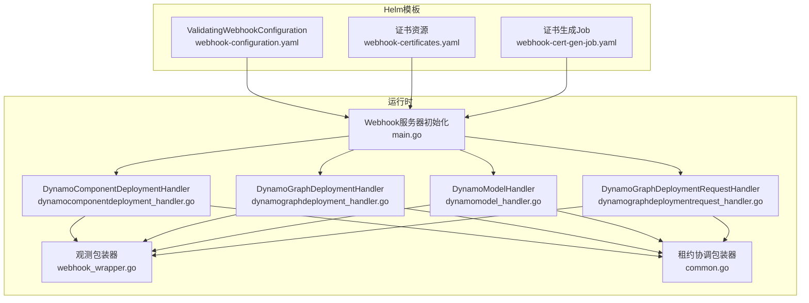
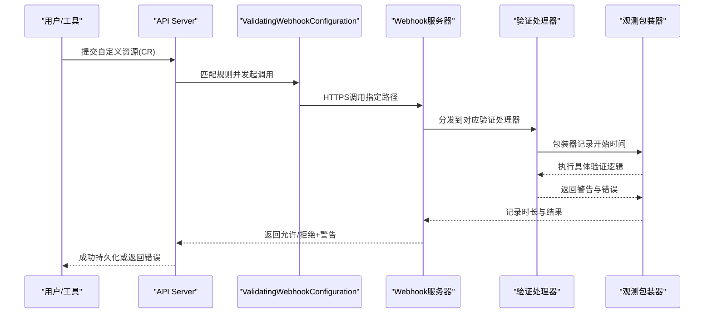
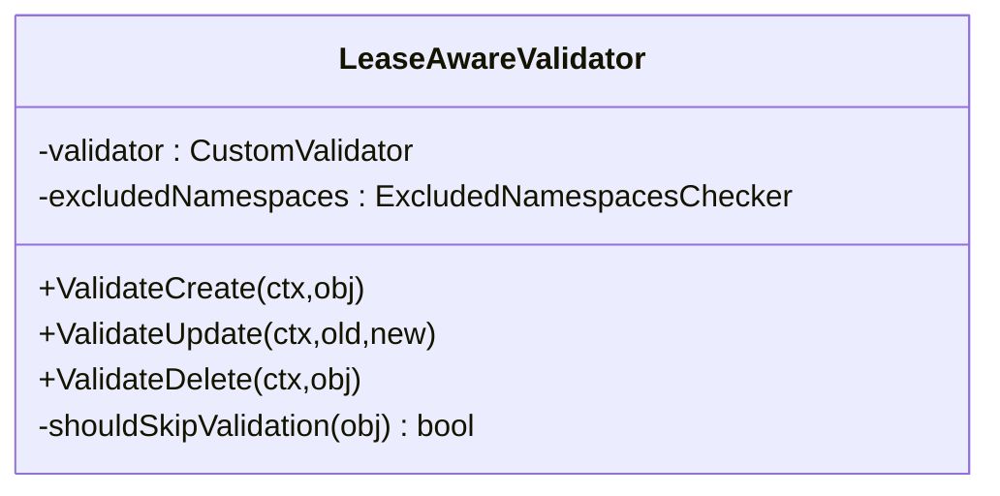
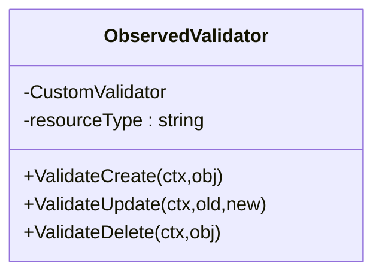
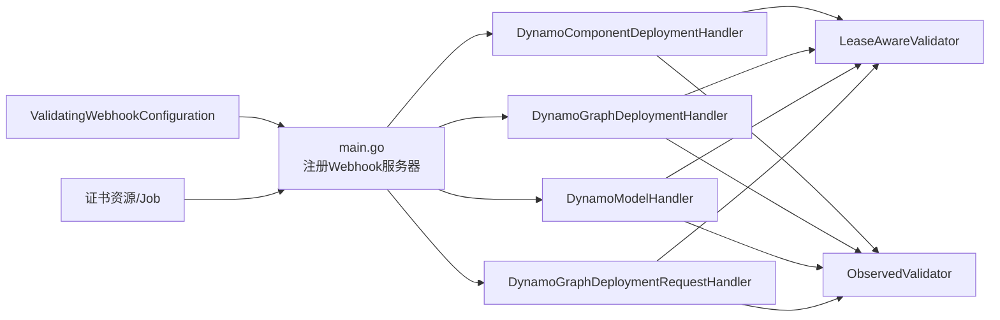

# Webhook机制

<cite>
**本文引用的文件**
- [webhook-configuration.yaml](file://deploy/helm/charts/platform/components/operator/templates/webhook-configuration.yaml)
- [webhook-certificates.yaml](file://deploy/helm/charts/platform/components/operator/templates/webhook-certificates.yaml)
- [webhook-cert-gen-job.yaml](file://deploy/helm/charts/platform/components/operator/templates/webhook-cert-gen-job.yaml)
- [main.go](file://deploy/operator/cmd/main.go)
- [webhook_wrapper.go](file://deploy/operator/internal/observability/webhook_wrapper.go)
- [common.go](file://deploy/operator/internal/webhook/common.go)
- [dynamocomponentdeployment_handler.go](file://deploy/operator/internal/webhook/validation/dynamocomponentdeployment_handler.go)
- [dynamographdeployment_handler.go](file://deploy/operator/internal/webhook/validation/dynamographdeployment_handler.go)
- [dynamographdeploymentrequest_handler.go](file://deploy/operator/internal/webhook/validation/dynamographdeploymentrequest_handler.go)
- [dynamomodel_handler.go](file://deploy/operator/internal/webhook/validation/dynamomodel_handler.go)
- [dynamocomponentdeployment.go](file://deploy/operator/internal/webhook/validation/dynamocomponentdeployment.go)
- [dynamographdeployment.go](file://deploy/operator/internal/webhook/validation/dynamographdeployment.go)
- [dynamographdeploymentrequest.go](file://deploy/operator/internal/webhook/validation/dynamographdeploymentrequest.go)
- [dynamomodel.go](file://deploy/operator/internal/webhook/validation/dynamomodel.go)
- [webhooks.md](file://docs/kubernetes/webhooks.md)
</cite>

## 目录
1. [简介](#简介)
2. [项目结构](#项目结构)
3. [核心组件](#核心组件)
4. [架构总览](#架构总览)
5. [详细组件分析](#详细组件分析)
6. [依赖关系分析](#依赖关系分析)
7. [性能考虑](#性能考虑)
8. [故障排查指南](#故障排查指南)
9. [结论](#结论)
10. [附录：完整配置与使用示例](#附录完整配置与使用示例)

## 简介
本文件系统性阐述Dynamo在Kubernetes中的Webhook机制，重点覆盖以下方面：
- ValidatingWebhookConfiguration的配置与实现原理
- Webhook验证逻辑（资源创建、更新、删除）
- MutatingWebhook的现状与扩展建议（默认未启用）
- 安全机制（证书管理、TLS配置、HTTP/2禁用策略）
- 故障排查（验证失败诊断、日志分析）
- 性能优化与最佳实践
- 完整配置示例与典型使用场景

## 项目结构
Dynamo Operator通过Helm模板生成Webhook相关清单，并在控制器运行时注册验证器。关键位置如下：
- Helm模板：生成ValidatingWebhookConfiguration、证书、Job等
- 运行时：在main中启动Webhook服务器并注册各资源的验证处理器
- 观测：对Webhook调用进行指标采集与告警记录
- 协调：多实例部署下的命名空间排除与租约协调

**图表来源**
- [webhook-configuration.yaml](file://deploy/helm/charts/platform/components/operator/templates/webhook-configuration.yaml#L18-L172)
- [webhook-certificates.yaml](file://deploy/helm/charts/platform/components/operator/templates/webhook-certificates.yaml#L16-L94)
- [webhook-cert-gen-job.yaml](file://deploy/helm/charts/platform/components/operator/templates/webhook-cert-gen-job.yaml#L16-L298)
- [main.go](file://deploy/operator/cmd/main.go#L302-L310)
- [webhook_wrapper.go](file://deploy/operator/internal/observability/webhook_wrapper.go#L28-L90)
- [common.go](file://deploy/operator/internal/webhook/common.go#L55-L122)
- [dynamocomponentdeployment_handler.go](file://deploy/operator/internal/webhook/validation/dynamocomponentdeployment_handler.go#L122-L137)
- [dynamographdeployment_handler.go](file://deploy/operator/internal/webhook/validation/dynamographdeployment_handler.go#L142-L157)
- [dynamomodel_handler.go](file://deploy/operator/internal/webhook/validation/dynamomodel_handler.go#L122-L136)
- [dynamographdeploymentrequest_handler.go](file://deploy/operator/internal/webhook/validation/dynamographdeploymentrequest_handler.go#L127-L141)

**章节来源**
- [webhook-configuration.yaml](file://deploy/helm/charts/platform/components/operator/templates/webhook-configuration.yaml#L18-L172)
- [webhook-certificates.yaml](file://deploy/helm/charts/platform/components/operator/templates/webhook-certificates.yaml#L16-L94)
- [webhook-cert-gen-job.yaml](file://deploy/helm/charts/platform/components/operator/templates/webhook-cert-gen-job.yaml#L16-L298)
- [main.go](file://deploy/operator/cmd/main.go#L302-L310)

## 核心组件
- ValidatingWebhookConfiguration：定义API Server调用的Webhook端点、匹配规则、超时与失败策略、命名空间选择器等。
- Webhook服务器：在控制器进程中以独立端口提供TLS服务，承载所有Webhook类型（当前为验证）。
- 验证处理器：针对不同CRD的创建、更新、删除请求执行业务规则校验。
- 包装器：
  - 租约感知包装器：在集群模式下避免与命名空间受限Operator重复校验。
  - 观测包装器：记录准入决策、耗时与拒绝原因，便于监控与排障。
- 证书基础设施：Helm自动/外部/证书管理器三种模式，确保API Server与Webhook服务之间的TLS信任链。

**章节来源**
- [webhook-configuration.yaml](file://deploy/helm/charts/platform/components/operator/templates/webhook-configuration.yaml#L18-L172)
- [main.go](file://deploy/operator/cmd/main.go#L302-L310)
- [webhook_wrapper.go](file://deploy/operator/internal/observability/webhook_wrapper.go#L28-L90)
- [common.go](file://deploy/operator/internal/webhook/common.go#L55-L122)

## 架构总览
Webhook验证流程分为三阶段：API Server触发、Webhook服务验证、持久化或拒绝返回。

**图表来源**
- [webhooks.md](file://docs/kubernetes/webhooks.md#L49-L71)
- [main.go](file://deploy/operator/cmd/main.go#L302-L310)
- [webhook_wrapper.go](file://deploy/operator/internal/observability/webhook_wrapper.go#L43-L89)

## 详细组件分析

### ValidatingWebhookConfiguration配置要点
- 命名与注解：支持集群/命名空间两种模式；可由cert-manager自动注入CA。
- 匹配规则：按API组、版本、资源与操作类型（CREATE/UPDATE）匹配。
- 失败策略：Fail（推荐）或Ignore。
- 超时与副作用：timeoutSeconds与sideEffects=None。
- 命名空间选择器：可按标签过滤或在命名空间受限模式下自动限定。

**章节来源**
- [webhook-configuration.yaml](file://deploy/helm/charts/platform/components/operator/templates/webhook-configuration.yaml#L18-L172)
- [webhooks.md](file://docs/kubernetes/webhooks.md#L115-L190)

### Webhook服务器与TLS配置
- 服务器绑定：监听所有接口，端口固定为9443。
- 证书目录：挂载证书Secret至容器内指定路径。
- HTTP/2安全策略：默认禁用HTTP/2以规避已知漏洞，仅保留HTTP/1.1。
- 证书来源：Helm自动（Self-signed）、cert-manager、外部Secret。

**章节来源**
- [main.go](file://deploy/operator/cmd/main.go#L284-L310)
- [webhook-certificates.yaml](file://deploy/helm/charts/platform/components/operator/templates/webhook-certificates.yaml#L16-L94)
- [webhook-cert-gen-job.yaml](file://deploy/helm/charts/platform/components/operator/templates/webhook-cert-gen-job.yaml#L16-L298)

### 验证处理器与业务规则

#### DynamoComponentDeployment
- 创建/更新：基于共享规范验证器进行字段校验；更新时检查不可变字段。
- 删除：不执行特殊校验。
- 注册：自动包裹租约感知与观测包装器。

**章节来源**
- [dynamocomponentdeployment_handler.go](file://deploy/operator/internal/webhook/validation/dynamocomponentdeployment_handler.go#L49-L120)
- [dynamocomponentdeployment.go](file://deploy/operator/internal/webhook/validation/dynamocomponentdeployment.go#L41-L64)

#### DynamoGraphDeployment
- 创建：校验至少一个服务、PVC、重启策略等；逐服务使用共享规范验证器。
- 更新：校验不可变字段、拓扑不变（服务名集合不变）、副本变更保护（DGDSA启用时需授权SA）。
- 删除：不执行特殊校验。
- 注册：自动包裹租约感知与观测包装器。

**章节来源**
- [dynamographdeployment_handler.go](file://deploy/operator/internal/webhook/validation/dynamographdeployment_handler.go#L54-L140)
- [dynamographdeployment.go](file://deploy/operator/internal/webhook/validation/dynamographdeployment.go#L59-L113)

#### DynamoModel
- 创建：校验模型名称、基础模型、LoRA源信息与URI格式。
- 更新：校验不可变字段（模型类型、基础模型）。
- 删除：不执行特殊校验。
- 注册：自动包裹租约感知与观测包装器。

**章节来源**
- [dynamomodel_handler.go](file://deploy/operator/internal/webhook/validation/dynamomodel_handler.go#L49-L120)
- [dynamomodel.go](file://deploy/operator/internal/webhook/validation/dynamomodel.go#L41-L91)

#### DynamoGraphDeploymentRequest
- 创建：校验剖析镜像、配置必填、集群范围能力与配置结构。
- 更新：预留不可变检查。
- 删除：不执行特殊校验。
- 注册：自动包裹租约感知与观测包装器。

**章节来源**
- [dynamographdeploymentrequest_handler.go](file://deploy/operator/internal/webhook/validation/dynamographdeploymentrequest_handler.go#L54-L125)
- [dynamographdeploymentrequest.go](file://deploy/operator/internal/webhook/validation/dynamographdeploymentrequest.go#L45-L95)

### 包装器与安全机制

#### 租约感知包装器（LeaseAwareValidator）
- 在集群模式下，若某命名空间被命名空间受限Operator持有租约，则跳过该命名空间的校验，避免重复校验。
- 使用装饰器模式透明增强现有验证器。

**图表来源**
- [common.go](file://deploy/operator/internal/webhook/common.go#L55-L122)

**章节来源**
- [common.go](file://deploy/operator/internal/webhook/common.go#L55-L122)
- [main.go](file://deploy/operator/cmd/main.go#L636-L646)

#### 观测包装器（ObservedValidator）
- 对每次Create/Update/Delete调用记录耗时、是否允许、拒绝原因等指标，便于监控与容量规划。

**图表来源**
- [webhook_wrapper.go](file://deploy/operator/internal/observability/webhook_wrapper.go#L28-L90)

**章节来源**
- [webhook_wrapper.go](file://deploy/operator/internal/observability/webhook_wrapper.go#L28-L90)

#### 安全与证书管理
- 自动证书：Helm预升级钩子生成自签名根CA与服务证书，智能判断是否需要再生。
- cert-manager：创建Issuer/CA/Certificate资源，ca-injector自动注入ValidatingWebhookConfiguration的caBundle。
- 外部证书：手动创建TLS Secret并配置caBundle。
- HTTP/2禁用：默认禁用HTTP/2以降低风险。

**章节来源**
- [webhook-certificates.yaml](file://deploy/helm/charts/platform/components/operator/templates/webhook-certificates.yaml#L16-L94)
- [webhook-cert-gen-job.yaml](file://deploy/helm/charts/platform/components/operator/templates/webhook-cert-gen-job.yaml#L16-L298)
- [webhooks.md](file://docs/kubernetes/webhooks.md#L194-L360)
- [main.go](file://deploy/operator/cmd/main.go#L284-L300)

### MutatingWebhook说明与扩展建议
- 当前实现为验证型Webhook，未启用MutatingWebhook。
- 若未来引入，默认值设置与字段规范化可通过MutatingWebhook完成，但需遵循与验证Webhook相同的证书与安全策略。

**章节来源**
- [webhooks.md](file://docs/kubernetes/webhooks.md#L24-L46)

## 依赖关系分析
- 控制器管理器负责注册Webhook服务器与处理器；处理器通过装饰器组合租约感知与观测功能。
- ValidatingWebhookConfiguration与证书资源由Helm模板生成，运行时由API Server调用。
- 多实例部署通过租约机制协调，避免重复校验。

**图表来源**
- [main.go](file://deploy/operator/cmd/main.go#L648-L677)
- [dynamocomponentdeployment_handler.go](file://deploy/operator/internal/webhook/validation/dynamocomponentdeployment_handler.go#L122-L137)
- [dynamographdeployment_handler.go](file://deploy/operator/internal/webhook/validation/dynamographdeployment_handler.go#L142-L157)
- [dynamomodel_handler.go](file://deploy/operator/internal/webhook/validation/dynamomodel_handler.go#L122-L136)
- [dynamographdeploymentrequest_handler.go](file://deploy/operator/internal/webhook/validation/dynamographdeploymentrequest_handler.go#L127-L141)
- [webhook-configuration.yaml](file://deploy/helm/charts/platform/components/operator/templates/webhook-configuration.yaml#L18-L172)
- [webhook-certificates.yaml](file://deploy/helm/charts/platform/components/operator/templates/webhook-certificates.yaml#L16-L94)

**章节来源**
- [main.go](file://deploy/operator/cmd/main.go#L648-L677)
- [webhook-configuration.yaml](file://deploy/helm/charts/platform/components/operator/templates/webhook-configuration.yaml#L18-L172)

## 性能考虑
- Webhook延迟：通常在10–50ms量级，建议开启观测指标持续监控。
- 超时与失败策略：生产环境建议使用Fail，避免在Webhook不可用时放行无效资源。
- 证书轮换：cert-manager模式下无需停机，自动重载新证书；Helm自动模式按需再生，减少升级开销。
- 并发与伸缩：Webhook服务器与控制器共享同一进程，注意Pod资源限制与健康探针配置。

**章节来源**
- [webhooks.md](file://docs/kubernetes/webhooks.md#L658-L680)

## 故障排查指南
- Webhook未被调用
  - 检查ValidatingWebhookConfiguration是否存在且包含非空caBundle。
  - 确认Service存在且指向正确的Webhook服务。
  - 查看Operator日志中“Webhooks are enabled”等启动信息。
- 连接被拒
  - 确认Operator Pod处于Running状态。
  - 本地port-forward测试9443端口连通性。
  - 检查部署中容器端口映射与Webhook服务器配置一致。
- 证书错误
  - 校验ValidatingWebhookConfiguration中的caBundle是否正确。
  - 检查Secret是否存在、证书是否有效、SAN是否包含Service FQDN。
  - 查看证书注入Job日志。
- Helm钩子失败
  - 列出并查看证书生成/CA注入Job日志。
  - 检查RBAC权限（ServiceAccount、ClusterRole/Binding）。
- 删除卡住
  - Webhook在删除时会跳过校验；如仍阻塞，可临时将failurePolicy设为Ignore或删除配置后重试。
- 日志与指标
  - 关注“validate create/update”等日志条目。
  - 结合ObservedValidator记录的指标定位热点资源与异常耗时。

**章节来源**
- [webhooks.md](file://docs/kubernetes/webhooks.md#L444-L656)

## 结论
Dynamo的Webhook机制以ValidatingWebhook为核心，结合租约协调与观测包装器，在保证一致性的同时提供了可观测性与安全性。通过Helm模板与cert-manager集成，实现了零接触的证书生命周期管理。建议在生产环境中保持Webhook启用、使用Fail策略、采用cert-manager进行自动化运维，并持续监控Webhook指标以保障稳定性。

## 附录：完整配置与使用示例

### ValidatingWebhookConfiguration关键字段说明
- admissionReviewVersions：v1
- clientConfig.service：指向Webhook Service与路径
- failurePolicy：Fail或Ignore
- namespaceSelector：按标签过滤命名空间
- rules：匹配API组、版本、资源与操作
- sideEffects：None
- timeoutSeconds：默认10秒

**章节来源**
- [webhook-configuration.yaml](file://deploy/helm/charts/platform/components/operator/templates/webhook-configuration.yaml#L36-L171)

### 证书管理选项
- 自动证书（默认）：Helm预钩子生成自签名证书与Secret，升级时智能再生。
- cert-manager：创建Issuer/CA/Certificate，ca-injector自动注入caBundle。
- 外部证书：手动创建TLS Secret并配置caBundle。

**章节来源**
- [webhook-certificates.yaml](file://deploy/helm/charts/platform/components/operator/templates/webhook-certificates.yaml#L16-L94)
- [webhook-cert-gen-job.yaml](file://deploy/helm/charts/platform/components/operator/templates/webhook-cert-gen-job.yaml#L16-L298)
- [webhooks.md](file://docs/kubernetes/webhooks.md#L194-L360)

### 多实例与命名空间协调
- 集群模式：Watch所有命名空间的租约，若某命名空间有租约则跳过校验。
- 命名空间受限模式：自动限定仅校验自身命名空间，不检查租约。
- Webhook配置命名区分：集群/命名空间两种模式。

**章节来源**
- [common.go](file://deploy/operator/internal/webhook/common.go#L55-L122)
- [webhooks.md](file://docs/kubernetes/webhooks.md#L362-L442)

### 典型使用场景
- 生产环境：启用Webhook（Fail策略），使用cert-manager证书，开启观测指标。
- 开发环境：可临时禁用Webhook或使用Ignore策略，快速迭代。
- 多租户：集群范围Operator + 命名空间受限Operator协同，通过租约避免冲突。

**章节来源**
- [webhooks.md](file://docs/kubernetes/webhooks.md#L658-L680)