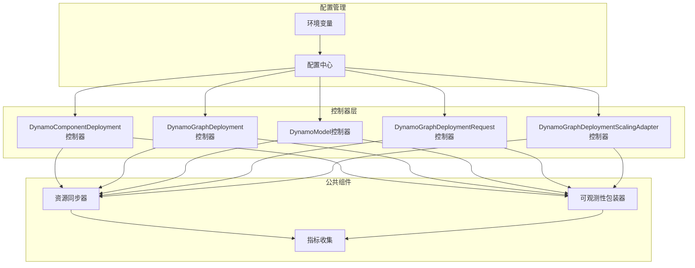
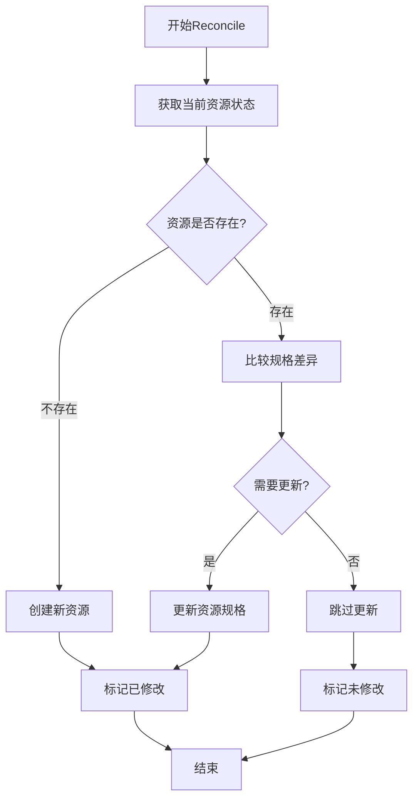
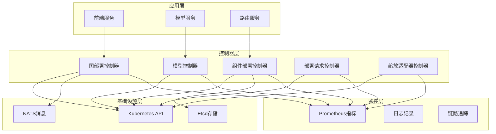
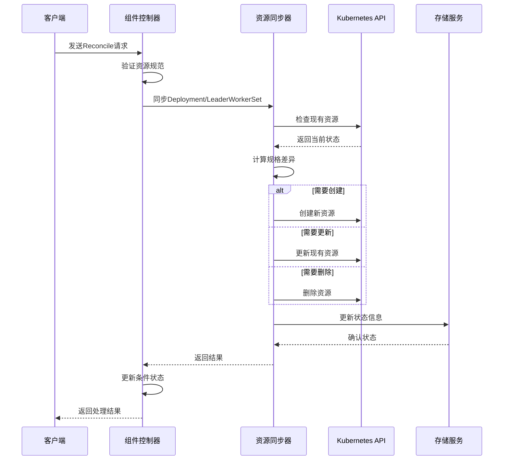
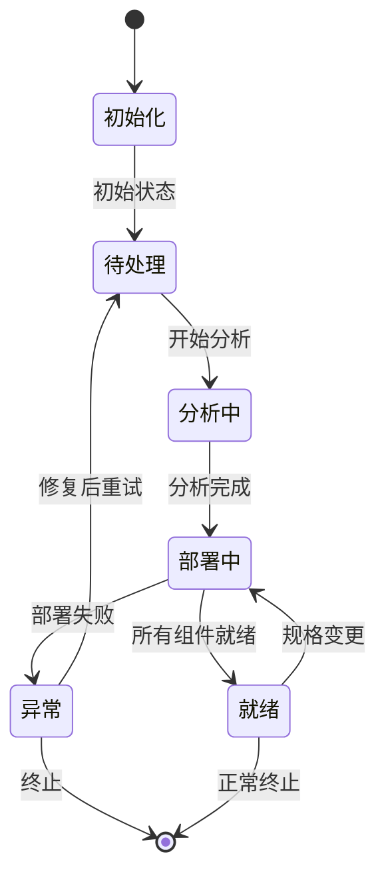
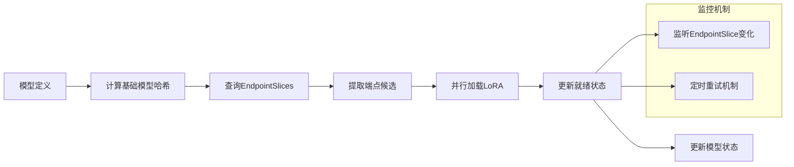
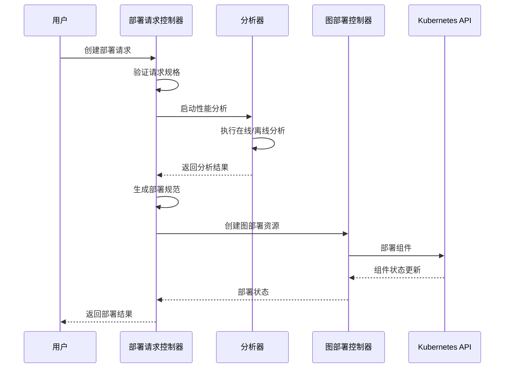
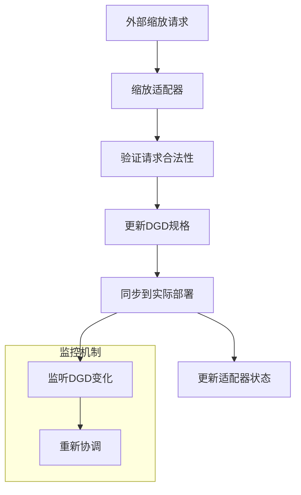
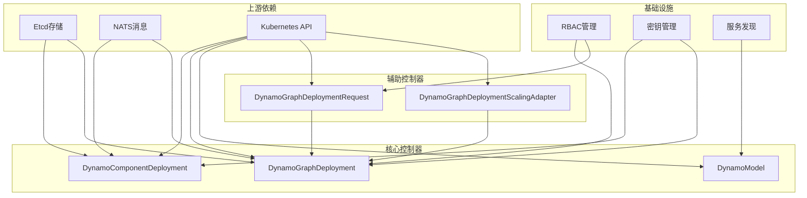
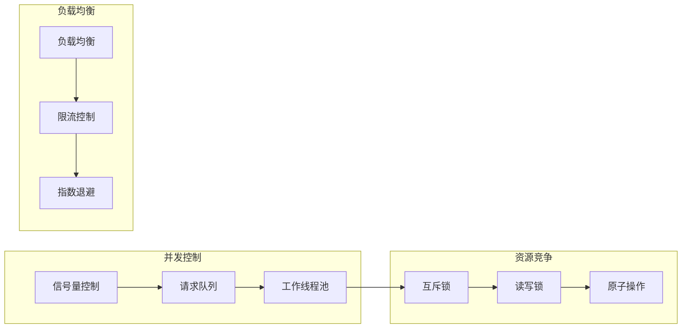

# 控制器实现

<cite>
**本文档引用的文件**
- [main.go](file://deploy/operator/cmd/main.go)
- [dynamocomponentdeployment_controller.go](file://deploy/operator/internal/controller/dynamocomponentdeployment_controller.go)
- [dynamographdeployment_controller.go](file://deploy/operator/internal/controller/dynamographdeployment_controller.go)
- [dynamo_model_controller.go](file://deploy/operator/internal/controller/dynamo_model_controller.go)
- [dynamographdeploymentrequest_controller.go](file://deploy/operator/internal/controller/dynamographdeploymentrequest_controller.go)
- [dynamographdeploymentscalingadapter_controller.go](file://deploy/operator/internal/controller/dynamographdeploymentscalingadapter_controller.go)
- [resource.go](file://deploy/operator/internal/controller_common/resource.go)
- [metrics.go](file://deploy/operator/internal/observability/metrics.go)
- [reconciler_wrapper.go](file://deploy/operator/internal/observability/reconciler_wrapper.go)
- [graph.go](file://deploy/operator/internal/dynamo/graph.go)
</cite>

## 目录
1. [简介](#简介)
2. [项目结构](#项目结构)
3. [核心组件](#核心组件)
4. [架构概览](#架构概览)
5. [详细组件分析](#详细组件分析)
6. [依赖关系分析](#依赖关系分析)
7. [性能考虑](#性能考虑)
8. [故障排查指南](#故障排查指南)
9. [结论](#结论)

## 简介

本文档深入解析Dynamo控制器实现，涵盖所有Reconciler工作流程、资源状态同步机制、事件处理逻辑和错误恢复策略。详细说明控制器之间的协调机制和依赖关系，阐述控制器的生命周期管理（初始化、运行时状态监控和优雅关闭），解释并发处理模型和资源竞争解决机制，并提供调试和故障排查的实用指南以及性能优化建议。

## 项目结构

Dynamo控制器位于`deploy/operator/internal/controller`目录下，采用按功能模块划分的组织方式：



**图表来源**
- [main.go](file://deploy/operator/cmd/main.go#L560-L621)
- [resource.go](file://deploy/operator/internal/controller_common/resource.go#L64-L209)

**章节来源**
- [main.go](file://deploy/operator/cmd/main.go#L129-L694)

## 核心组件

### 控制器架构模式

所有控制器都遵循统一的Reconciler模式，具有以下共同特征：

1. **状态驱动设计**：基于Kubernetes资源状态进行操作
2. **声明式同步**：通过比较期望状态和实际状态来实现同步
3. **事件驱动**：响应资源变更事件触发Reconcile循环
4. **最终一致性**：通过重试机制确保系统达到期望状态

### 资源同步机制

控制器使用通用的资源同步函数`SyncResource`实现标准化的状态同步：



**图表来源**
- [resource.go](file://deploy/operator/internal/controller_common/resource.go#L64-L209)

**章节来源**
- [resource.go](file://deploy/operator/internal/controller_common/resource.go#L64-L209)

## 架构概览

Dynamo控制器整体架构采用分层设计，从上到下分别为：



**图表来源**
- [main.go](file://deploy/operator/cmd/main.go#L350-L465)
- [graph.go](file://deploy/operator/internal/dynamo/graph.go#L832-L863)

## 详细组件分析

### DynamoComponentDeployment控制器

该控制器负责管理单个组件的部署，支持标准Deployment和LeaderWorkerSet两种模式：

#### 核心工作流程



**图表来源**
- [dynamocomponentdeployment_controller.go](file://deploy/operator/internal/controller/dynamocomponentdeployment_controller.go#L113-L292)
- [resource.go](file://deploy/operator/internal/controller_common/resource.go#L64-L209)

#### 多节点支持机制

控制器根据配置自动选择合适的编排模式：

| 模式 | 适用场景 | 特点 |
|------|----------|------|
| 标准Deployment | 单节点部署 | 简单可靠，适合小规模部署 |
| LeaderWorkerSet | 多节点分布式 | 支持复杂的多节点拓扑结构 |

**章节来源**
- [dynamocomponentdeployment_controller.go](file://deploy/operator/internal/controller/dynamocomponentdeployment_controller.go#L232-L459)

### DynamoGraphDeployment控制器

该控制器管理完整的推理图部署，协调多个组件的部署和状态：

#### 状态机设计



**图表来源**
- [dynamographdeployment_controller.go](file://deploy/operator/internal/controller/dynamographdeployment_controller.go#L65-L69)

#### 资源协调机制

控制器通过以下方式协调多个资源：

1. **组件级同步**：每个组件独立管理自己的资源
2. **全局状态聚合**：汇总各组件状态生成整体状态
3. **依赖关系管理**：处理组件间的启动顺序依赖

**章节来源**
- [dynamographdeployment_controller.go](file://deploy/operator/internal/controller/dynamographdeployment_controller.go#L225-L327)

### DynamoModel控制器

该控制器专门处理模型加载和端点发现：

#### 端点发现流程



**图表来源**
- [dynamo_model_controller.go](file://deploy/operator/internal/controller/dynamo_model_controller.go#L385-L416)

#### 并发控制策略

控制器使用受限制的并发模型：

- **并行加载**：多个端点同时加载模型
- **并发上限**：避免过度消耗系统资源
- **错误隔离**：单个端点失败不影响其他端点

**章节来源**
- [dynamo_model_controller.go](file://deploy/operator/internal/controller/dynamo_model_controller.go#L174-L251)

### DynamoGraphDeploymentRequest控制器

该控制器处理自动部署请求，提供从配置到部署的完整流程：

#### 自动化部署流程



**图表来源**
- [dynamographdeploymentrequest_controller.go](file://deploy/operator/internal/controller/dynamographdeploymentrequest_controller.go#L338-L545)

**章节来源**
- [dynamographdeploymentrequest_controller.go](file://deploy/operator/internal/controller/dynamographdeploymentrequest_controller.go#L272-L335)

### DynamoGraphDeploymentScalingAdapter控制器

该控制器提供外部缩放接口，允许外部系统调整服务副本数：

#### 缩放协调机制



**图表来源**
- [dynamographdeploymentscalingadapter_controller.go](file://deploy/operator/internal/controller/dynamographdeploymentscalingadapter_controller.go#L58-L141)

**章节来源**
- [dynamographdeploymentscalingadapter_controller.go](file://deploy/operator/internal/controller/dynamographdeploymentscalingadapter_controller.go#L58-L141)

## 依赖关系分析

### 控制器间依赖关系



**图表来源**
- [main.go](file://deploy/operator/cmd/main.go#L560-L621)

### 组件耦合度分析

| 组件 | 内聚性 | 耦合度 | 主要依赖 |
|------|--------|--------|----------|
| DynamoComponentDeployment | 高 | 中等 | Kubernetes API, Etcd |
| DynamoGraphDeployment | 中等 | 高 | 多个子组件控制器 |
| DynamoModel | 高 | 低 | EndpointSlice API |
| DynamoGraphDeploymentRequest | 中等 | 中等 | 分析器服务 |
| DynamoGraphDeploymentScalingAdapter | 高 | 低 | DGD资源 |

**章节来源**
- [main.go](file://deploy/operator/cmd/main.go#L560-L677)

## 性能考虑

### 指标监控体系

控制器实现了全面的性能监控指标：

| 指标类别 | 指标名称 | 描述 | 使用场景 |
|----------|----------|------|----------|
| 重建性能 | reconcile_duration_seconds | 控制器执行时间分布 | 性能瓶颈识别 |
| 重建频率 | reconcile_total | 控制器调用次数统计 | 负载分析 |
| 错误分类 | reconcile_errors_total | 错误类型分类统计 | 故障诊断 |
| 资源计数 | resources_total | 各类资源数量统计 | 资源使用监控 |
| Webhook性能 | webhook_duration_seconds | Webhook处理时间 | API性能监控 |

### 并发处理模型

控制器采用异步并发处理模式：



**图表来源**
- [metrics.go](file://deploy/operator/internal/observability/metrics.go#L34-L100)

### 性能优化建议

1. **指标监控**
   - 定期检查重建持续时间分布
   - 监控错误率变化趋势
   - 跟踪资源数量增长情况

2. **并发调优**
   - 根据集群规模调整并发度
   - 实施适当的限流策略
   - 优化重试退避算法

3. **内存管理**
   - 及时清理无用对象
   - 监控内存使用峰值
   - 实施垃圾回收优化

**章节来源**
- [metrics.go](file://deploy/operator/internal/observability/metrics.go#L103-L185)

## 故障排查指南

### 常见问题诊断

#### 资源同步失败

**症状**：控制器反复尝试但无法完成资源同步

**诊断步骤**：
1. 检查资源规格哈希是否正确计算
2. 验证控制器权限配置
3. 确认API服务器连接状态
4. 查看事件记录中的具体错误信息

**解决方案**：
- 修复权限配置问题
- 更新资源规格以匹配期望状态
- 检查网络连接和API服务器状态

#### 状态不一致问题

**症状**：控制器报告就绪但实际组件未就绪

**诊断步骤**：
1. 检查组件就绪条件判断逻辑
2. 验证健康检查配置
3. 确认资源依赖关系正确
4. 查看组件日志输出

**解决方案**：
- 修正就绪条件判断
- 重新配置健康检查
- 修复资源依赖关系

#### 并发冲突问题

**症状**：多个控制器实例同时修改同一资源

**诊断步骤**：
1. 检查控制器实例数量配置
2. 验证领导者选举设置
3. 确认资源版本号管理
4. 查看冲突发生的时间点

**解决方案**：
- 配置正确的领导者选举参数
- 实施资源版本号冲突检测
- 优化并发访问控制

### 日志分析方法

#### 关键日志级别

| 日志级别 | 使用场景 | 典型内容 |
|----------|----------|----------|
| DEBUG | 详细调试信息 | 详细的资源状态和处理流程 |
| INFO | 正常操作记录 | 成功的操作和状态变更 |
| WARNING | 警告信息 | 可能的问题但不影响功能 |
| ERROR | 错误信息 | 影响功能的错误和异常 |

#### 日志分析工具

```bash
# 查看特定控制器的日志
kubectl logs -n dynamo-system -l control-plane=controller-manager -c manager | grep "DynamoComponentDeployment"

# 查看错误级别的日志
kubectl logs -n dynamo-system -l control-plane=controller-manager -c manager | grep -i "error"

# 实时查看日志
kubectl logs -n dynamo-system -l control-plane=controller-manager -c manager -f
```

### 状态检查方法

#### 控制器健康检查

```bash
# 检查控制器Pod状态
kubectl get pods -n dynamo-system -l control-plane=controller-manager

# 检查控制器运行状态
kubectl get deployment -n dynamo-system dynamo-operator-controller-manager

# 检查控制器指标
kubectl get svc dynamo-operator-controller-manager-metrics-service -n dynamo-system
```

#### 资源状态检查

```bash
# 检查Dynamo组件部署状态
kubectl get dynamocomponentdeployments -A

# 检查Dynamo图部署状态
kubectl get dynamographdeployments -A

# 检查Dynamo模型状态
kubectl get dynamomodels -A
```

**章节来源**
- [main.go](file://deploy/operator/cmd/main.go#L680-L693)

## 结论

Dynamo控制器实现展现了现代Kubernetes控制器的最佳实践，具有以下特点：

1. **模块化设计**：清晰的职责分离和组件边界
2. **状态驱动**：基于资源状态的声明式管理
3. **可观测性**：完善的监控指标和日志记录
4. **容错能力**：健壮的错误处理和恢复机制
5. **性能优化**：合理的并发控制和资源管理

通过理解这些控制器的工作原理和最佳实践，可以更好地维护和扩展Dynamo平台，确保系统的稳定性和可靠性。