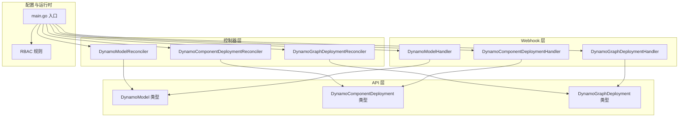
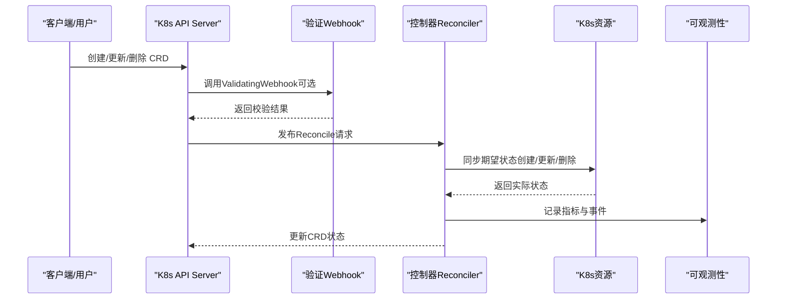
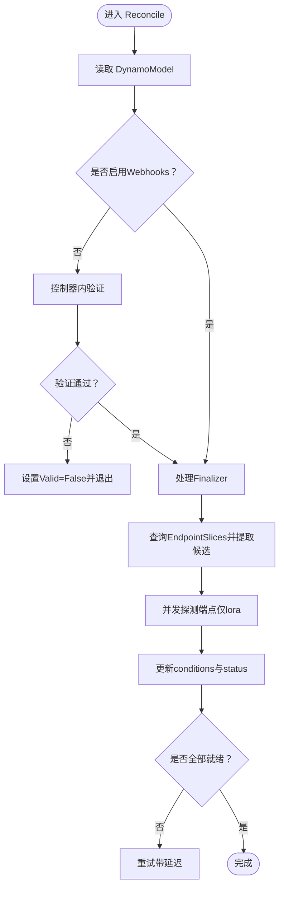
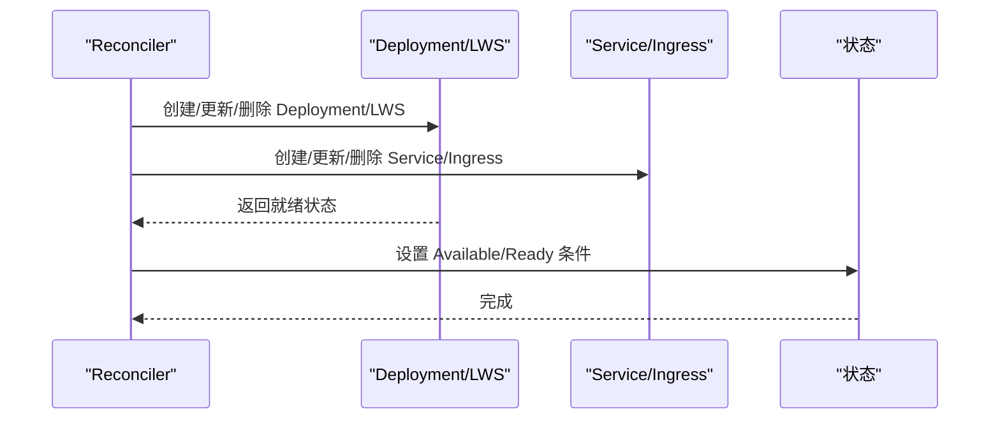
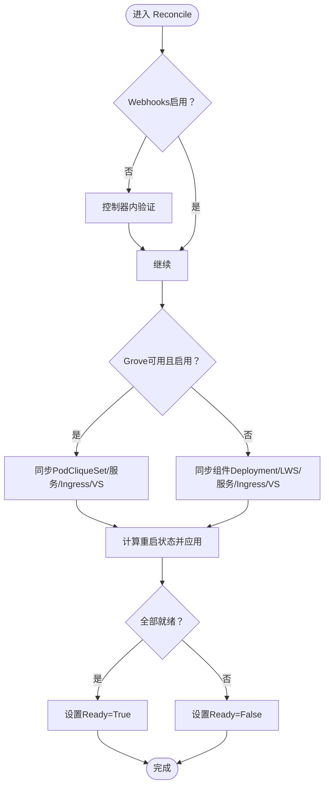
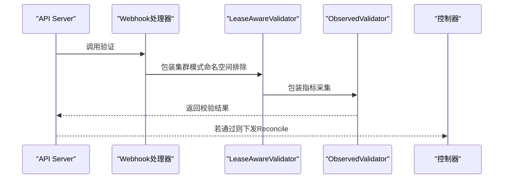
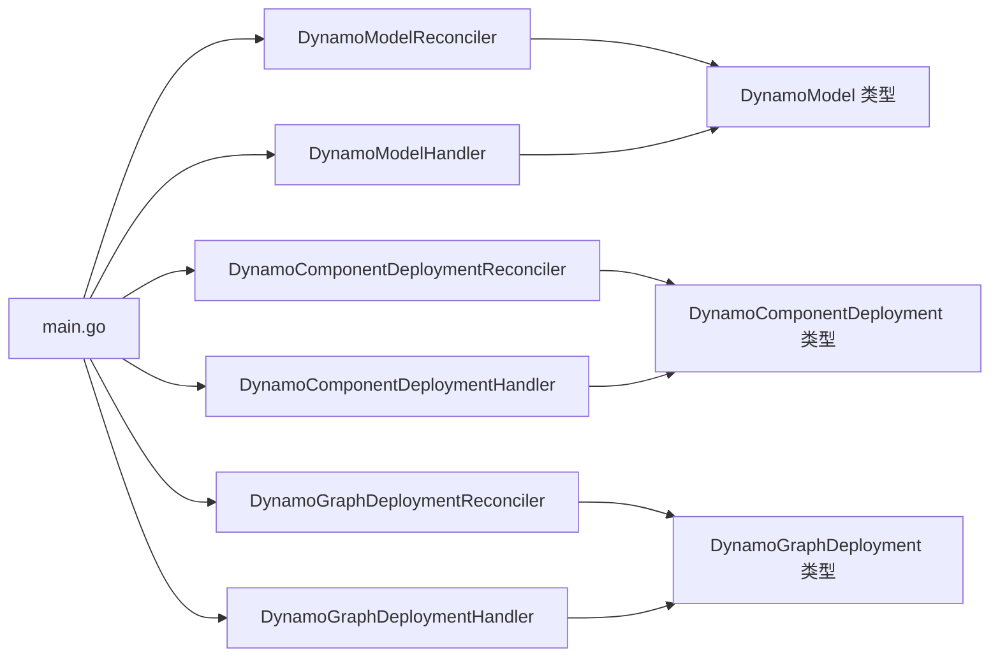

# 操作器架构

<cite>
**本文引用的文件**
- [dynamo_model_types.go](file://deploy/operator/api/v1alpha1/dynamo_model_types.go)
- [dynamocomponentdeployment_types.go](file://deploy/operator/api/v1alpha1/dynamocomponentdeployment_types.go)
- [dynamographdeployment_types.go](file://deploy/operator/api/v1alpha1/dynamographdeployment_types.go)
- [main.go](file://deploy/operator/cmd/main.go)
- [dynamo_model_controller.go](file://deploy/operator/internal/controller/dynamo_model_controller.go)
- [dynamocomponentdeployment_controller.go](file://deploy/operator/internal/controller/dynamocomponentdeployment_controller.go)
- [dynamographdeployment_controller.go](file://deploy/operator/internal/controller/dynamographdeployment_controller.go)
- [dynamomodel_handler.go](file://deploy/operator/internal/webhook/validation/dynamomodel_handler.go)
- [dynamocomponentdeployment_handler.go](file://deploy/operator/internal/webhook/validation/dynamocomponentdeployment_handler.go)
- [dynamographdeployment_handler.go](file://deploy/operator/internal/webhook/validation/dynamographdeployment_handler.go)
- [role.yaml](file://deploy/operator/config/rbac/role.yaml)
- [service_account.yaml](file://deploy/operator/config/rbac/service_account.yaml)
</cite>

## 目录
1. [引言](#引言)
2. [项目结构](#项目结构)
3. [核心组件](#核心组件)
4. [架构总览](#架构总览)
5. [详细组件分析](#详细组件分析)
6. [依赖关系分析](#依赖关系分析)
7. [性能考量](#性能考量)
8. [故障排查指南](#故障排查指南)
9. [结论](#结论)
10. [附录](#附录)

## 引言
本技术文档系统性阐述Dynamo Kubernetes操作器的架构与实现，重点覆盖以下方面：
- CRD设计与字段约束：DynamoModel、DynamoComponentDeployment、DynamoGraphDeployment等核心资源的结构、字段语义与约束规则
- 控制器实现：Reconciler工作流、资源状态同步机制、错误处理策略与重试逻辑
- Webhook验证：ValidatingWebhookConfiguration与MutatingWebhookConfiguration的配置与用途
- RBAC权限模型与安全策略：角色授权范围与最小权限原则
- 部署与配置：权限设置、证书管理、监控配置与运维要点

## 项目结构
Dynamo操作器位于deploy/operator目录，采用分层组织：
- api/v1alpha1：CRD类型定义与生成代码
- internal/controller：各CRD对应的Reconciler实现
- internal/webhook：验证与变更Webhook处理器
- config/rbac：RBAC清单
- cmd/main.go：控制器入口与组件装配

图表来源
- [main.go](file://deploy/operator/cmd/main.go#L560-L677)
- [dynamo_model_controller.go](file://deploy/operator/internal/controller/dynamo_model_controller.go#L69-L309)
- [dynamocomponentdeployment_controller.go](file://deploy/operator/internal/controller/dynamocomponentdeployment_controller.go#L73-L292)
- [dynamographdeployment_controller.go](file://deploy/operator/internal/controller/dynamographdeployment_controller.go#L80-L209)

章节来源
- [main.go](file://deploy/operator/cmd/main.go#L128-L694)

## 核心组件
本节对三个核心CRD进行深入解析，涵盖字段定义、约束规则与典型用法。

### DynamoModel（模型资源）
- 作用：抽象“模型实例”的期望与观测状态，用于跟踪服务端点、就绪状态与条件
- 关键字段
  - spec.modelName：完整模型标识符
  - spec.baseModelName：用于通过headless service发现后端端点的服务标签匹配依据
  - spec.modelType：模型类型（枚举：base/lora/adapter），默认base
  - spec.source：仅在lora类型下有效，指定模型源位置（如S3/HuggingFace）
  - status.endpoints：当前所有端点列表（地址、Pod名、就绪标记）
  - status.readyEndpoints/totalEndpoints：就绪端点计数与总数
  - status.conditions：标准Kubernetes条件集合
- 约束与行为
  - 对于lora模型：就绪条件要求全部端点成功加载LoRA；对于base模型：仅要求发现端点即可
  - 提供IsLoRA、IsReady、GetState等辅助方法
- 事件与索引
  - 通过EndpointSlice标签（基于baseModelName哈希）建立索引，支持O(1)查询
  - 监听EndpointSlice变化以触发Reconcile

章节来源
- [dynamo_model_types.go](file://deploy/operator/api/v1alpha1/dynamo_model_types.go#L29-L173)
- [dynamo_model_controller.go](file://deploy/operator/internal/controller/dynamo_model_controller.go#L49-L337)

### DynamoComponentDeployment（组件部署）
- 作用：描述单个组件（如prefill、decode等）的部署规格与运行参数
- 关键字段
  - spec.backendFramework：后端框架（sglang/vllm/trtllm）
  - spec.DynamoComponentDeploymentSharedSpec：通用共享配置（注解/标签、服务名、组件类型、子类型、命名空间策略、资源、环境变量、卷挂载、探针、副本数、多节点、缩放适配器、EPP配置等）
  - spec.scalingAdapter：启用缩放适配器时由外部自动扩缩器管理副本
  - status.conditions/service：可用性条件与服务副本状态
- 约束与行为
  - 支持单机Deployment或LeaderWorkerSet（多节点场景）
  - 提供IsMultinode、GetNumberOfNodes、ComputeDynamoNamespace等工具函数
  - 通过IsDeploymentReady/IsLeaderWorkerSetReady判断就绪
- 事件与索引
  - 无专用索引，按名称直接读取

章节来源
- [dynamocomponentdeployment_types.go](file://deploy/operator/api/v1alpha1/dynamocomponentdeployment_types.go#L39-L375)
- [dynamocomponentdeployment_controller.go](file://deploy/operator/internal/controller/dynamocomponentdeployment_controller.go#L73-L800)

### DynamoGraphDeployment（图级部署）
- 作用：编排多个组件的拓扑与生命周期，统一管理重启、缩放与状态
- 关键字段
  - spec.pvcs/services/envs/backendFramework/restart：顶层持久化卷、服务集合、环境变量、后端框架、重启策略
  - spec.restart.strategy.type/order：重启顺序（串行/并行）与顺序列表
  - status.state/conditions/services/restart：整体状态、条件、每服务副本状态与重启状态
- 约束与行为
  - 支持Grove/PodCliqueSet或传统组件模式
  - 通过computeRestartStatus计算重启阶段（Pending/Restarting/Completed/Failed）
  - 提供HasAnyMultinodeService/HasEPPService等便捷判断
- 事件与索引
  - 无专用索引，按名称直接读取

章节来源
- [dynamographdeployment_types.go](file://deploy/operator/api/v1alpha1/dynamographdeployment_types.go#L47-L274)
- [dynamographdeployment_controller.go](file://deploy/operator/internal/controller/dynamographdeployment_controller.go#L225-L800)

## 架构总览
控制器-资源-Webhook的整体交互如下：

图表来源
- [main.go](file://deploy/operator/cmd/main.go#L623-L677)
- [dynamo_model_controller.go](file://deploy/operator/internal/controller/dynamo_model_controller.go#L84-L251)
- [dynamocomponentdeployment_controller.go](file://deploy/operator/internal/controller/dynamocomponentdeployment_controller.go#L113-L292)
- [dynamographdeployment_controller.go](file://deploy/operator/internal/controller/dynamographdeployment_controller.go#L110-L209)

## 详细组件分析

### DynamoModelReconciler（模型端点控制器）
- 工作流
  - 获取DynamoModel对象
  - 若未启用Webhooks，则执行控制器内验证（防御式深度校验）
  - 处理finalizer（删除时卸载LoRA）
  - 基于baseModelName哈希查询EndpointSlices，提取候选端点
  - 并发探测端点（仅lora模型需要），统计就绪端点
  - 更新conditions与status（EndpointsReady/ServicesFound等）
  - 根据探测结果决定是否重试
- 错误处理
  - 探测失败记录事件并回退到指数退避重试
  - 状态更新失败返回错误，交由controller-runtime重试
- 性能特性
  - 使用字段索引（EndpointSlice标签）加速查询
  - 并发加载LoRA，降低总体延迟

图表来源
- [dynamo_model_controller.go](file://deploy/operator/internal/controller/dynamo_model_controller.go#L84-L251)

章节来源
- [dynamo_model_controller.go](file://deploy/operator/internal/controller/dynamo_model_controller.go#L69-L417)

### DynamoComponentDeploymentReconciler（组件部署控制器）
- 工作流
  - 获取DynamoComponentDeployment对象
  - 可选控制器内验证（当Webhooks禁用时）
  - 处理finalizer（多节点场景清理etcd键）
  - 选择资源形态：Deployment或LeaderWorkerSet（多节点）
  - 同步Service/Headless Service/Ingress（含Istio VirtualService）
  - 更新可用性条件与服务副本状态
- 就绪判定
  - Deployment：Paused=false、所有状态字段满足期望且存在Available条件
  - LeaderWorkerSet：每个实例LeaderWorkerSet就绪且存在Available条件
- 错误处理
  - 失败时记录事件并设置Available=False
  - 状态更新失败返回错误，交由controller-runtime重试

图表来源
- [dynamocomponentdeployment_controller.go](file://deploy/operator/internal/controller/dynamocomponentdeployment_controller.go#L113-L292)
- [dynamocomponentdeployment_controller.go](file://deploy/operator/internal/controller/dynamocomponentdeployment_controller.go#L302-L800)

章节来源
- [dynamocomponentdeployment_controller.go](file://deploy/operator/internal/controller/dynamocomponentdeployment_controller.go#L73-L800)

### DynamoGraphDeploymentReconciler（图级部署控制器）
- 工作流
  - 获取DynamoGraphDeployment对象
  - 可选控制器内验证（当Webhooks禁用时）
  - 处理finalizer（确保RBAC与资源一致性）
  - 选择路径：Grove或组件模式
  - 同步PVC、ScalingAdapter、Discovery/K8s Discovery资源、EPP资源
  - 根据orchestrator能力（Grove/LWS）选择PodCliqueSet或LeaderWorkerSet
  - 计算重启状态（并行/串行），并据此更新Ingress/VS与服务
- 就绪判定
  - Grove：基于PodCliqueSet及其内部PodClique/PodCliqueScalingGroup就绪
  - 组件模式：基于各组件Deployment/LWS就绪
- 错误处理
  - 多节点但无可用编排器时拒绝继续
  - 状态更新失败返回错误，交由controller-runtime重试

图表来源
- [dynamographdeployment_controller.go](file://deploy/operator/internal/controller/dynamographdeployment_controller.go#L110-L327)
- [dynamographdeployment_controller.go](file://deploy/operator/internal/controller/dynamographdeployment_controller.go#L329-L800)

章节来源
- [dynamographdeployment_controller.go](file://deploy/operator/internal/controller/dynamographdeployment_controller.go#L80-L800)

### Webhook验证机制
- 配置与注册
  - 在main中根据命令行开关enable-webhooks决定是否启用Webhooks
  - 注册DynamoModel/DynamoComponentDeployment/DynamoGraphDeployment的验证处理器
  - 所有处理器均被LeaseAwareValidator包装以支持集群模式下的命名空间排除协调，并被ObservedValidator包装以采集指标
- 验证内容
  - Create：执行状态无关规则校验
  - Update：先执行状态无关规则，再执行状态相关（不可变性）规则
  - Delete：通常不做特殊校验
- 与控制器的关系
  - 当Webhooks启用时，控制器跳过重复验证，以减少冗余
  - 当Webhooks禁用时，控制器执行防御式验证

图表来源
- [main.go](file://deploy/operator/cmd/main.go#L623-L677)
- [dynamomodel_handler.go](file://deploy/operator/internal/webhook/validation/dynamomodel_handler.go#L122-L136)
- [dynamocomponentdeployment_handler.go](file://deploy/operator/internal/webhook/validation/dynamocomponentdeployment_handler.go#L122-L137)
- [dynamographdeployment_handler.go](file://deploy/operator/internal/webhook/validation/dynamographdeployment_handler.go#L142-L157)

章节来源
- [dynamomodel_handler.go](file://deploy/operator/internal/webhook/validation/dynamomodel_handler.go#L40-L146)
- [dynamocomponentdeployment_handler.go](file://deploy/operator/internal/webhook/validation/dynamocomponentdeployment_handler.go#L40-L147)
- [dynamographdeployment_handler.go](file://deploy/operator/internal/webhook/validation/dynamographdeployment_handler.go#L41-L167)
- [main.go](file://deploy/operator/cmd/main.go#L623-L677)

### RBAC权限模型与安全策略
- 角色与权限
  - ClusterRole包含对核心资源（Pod、Service、Deployment、Ingress、VirtualService、LeaderWorkerSet、Grove、Istio、Volcano等）的CRUD权限
  - 对CRD资源具备create/list/watch/get/patch/update/delete以及finalizers/status访问
- 运行账户
  - ServiceAccount名为controller-manager，绑定上述ClusterRole
- 安全策略
  - 最小权限原则：仅授予控制器所需权限
  - Webhook与控制器分离，验证前置，减少控制器负担
  - 集群模式下通过Lease机制协调命名空间范围，避免跨租户冲突

章节来源
- [role.yaml](file://deploy/operator/config/rbac/role.yaml#L17-L247)
- [service_account.yaml](file://deploy/operator/config/rbac/service_account.yaml#L16-L28)

## 依赖关系分析
- 控制器与CRD
  - Reconciler直接依赖对应CRD类型定义与状态字段
  - 通过client-go读写Kubernetes资源
- 控制器与Webhook
  - main中注册Webhook处理器；当Webhooks启用时，控制器跳过验证
- 控制器与可观测性
  - Reconciler与Validator均被ObservedReconciler/ObservedValidator包装以采集指标
- 控制器与编排器
  - DynamoGraphDeploymentReconciler根据Grove/LWS可用性选择不同路径
  - 多节点场景使用LeaderWorkerSet与Volcano PodGroup

图表来源
- [main.go](file://deploy/operator/cmd/main.go#L560-L677)
- [dynamo_model_controller.go](file://deploy/operator/internal/controller/dynamo_model_controller.go#L69-L309)
- [dynamocomponentdeployment_controller.go](file://deploy/operator/internal/controller/dynamocomponentdeployment_controller.go#L73-L292)
- [dynamographdeployment_controller.go](file://deploy/operator/internal/controller/dynamographdeployment_controller.go#L80-L209)

章节来源
- [main.go](file://deploy/operator/cmd/main.go#L128-L694)

## 性能考量
- 查询优化
  - DynamoModel通过EndpointSlice标签哈希建立字段索引，实现O(1)查询
- 并发控制
  - DynamoModel探测端点采用并发策略，缩短等待时间
- 资源形态选择
  - 单节点优先Deployment，多节点使用LeaderWorkerSet与Volcano调度
- 指标与可观测性
  - 所有Reconcile/Validate均被包装以采集指标，便于性能分析与告警

## 故障排查指南
- 常见问题定位
  - DynamoModel：检查EndpointSlices是否存在、标签是否正确、端点探测是否失败
  - DynamoComponentDeployment：检查Deployment/LWS就绪条件、副本状态、Ingress/VS配置
  - DynamoGraphDeployment：确认Grove/LWS可用性、重启状态、服务就绪情况
- 日志与事件
  - 控制器记录ReconcileError事件与详细错误信息
  - Webhook处理器记录验证失败原因
- 状态诊断
  - 查看CRD的conditions与status字段，结合控制器日志定位根因

章节来源
- [dynamo_model_controller.go](file://deploy/operator/internal/controller/dynamo_model_controller.go#L134-L152)
- [dynamocomponentdeployment_controller.go](file://deploy/operator/internal/controller/dynamocomponentdeployment_controller.go#L134-L152)
- [dynamographdeployment_controller.go](file://deploy/operator/internal/controller/dynamographdeployment_controller.go#L122-L159)

## 结论
Dynamo操作器通过清晰的CRD设计、严谨的控制器实现、完善的Webhook验证与严格的RBAC权限模型，实现了对复杂推理服务图的自动化编排与治理。其并发探测、字段索引与可观测性封装提升了稳定性与可维护性，适合在生产环境中大规模部署与演进。

## 附录
- 部署与配置建议
  - 权限设置：使用提供的RBAC清单，确保ServiceAccount绑定ClusterRole
  - 证书管理：Webhook服务器证书挂载路径需与Deployment一致
  - 监控配置：Prometheus端点与Grafana仪表盘已内置，按需启用
  - 命名空间限制：支持命名空间受限与集群范围两种模式，按需启用Lease机制