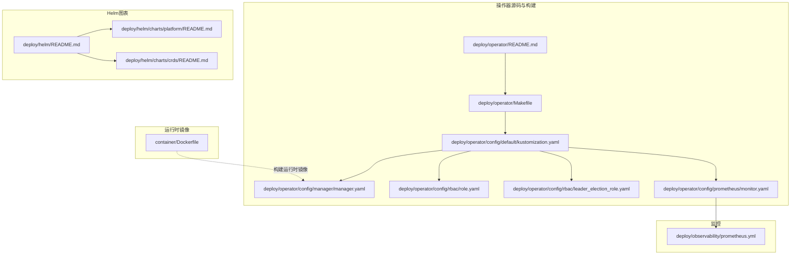
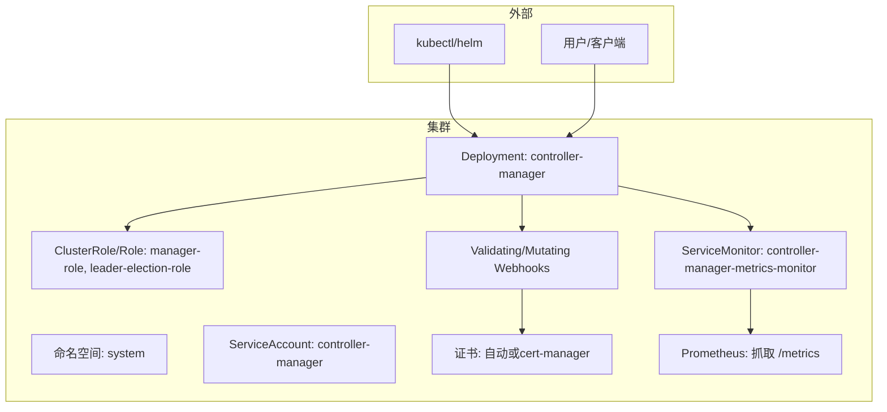
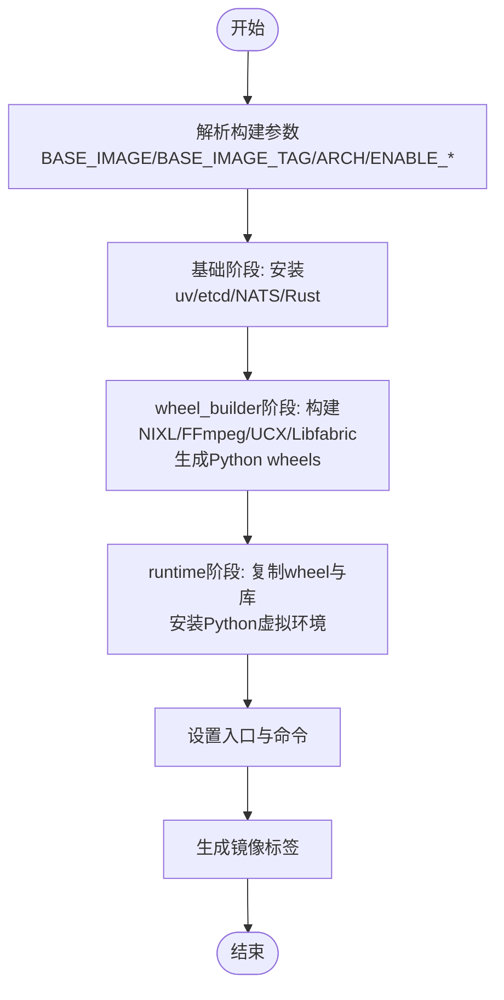
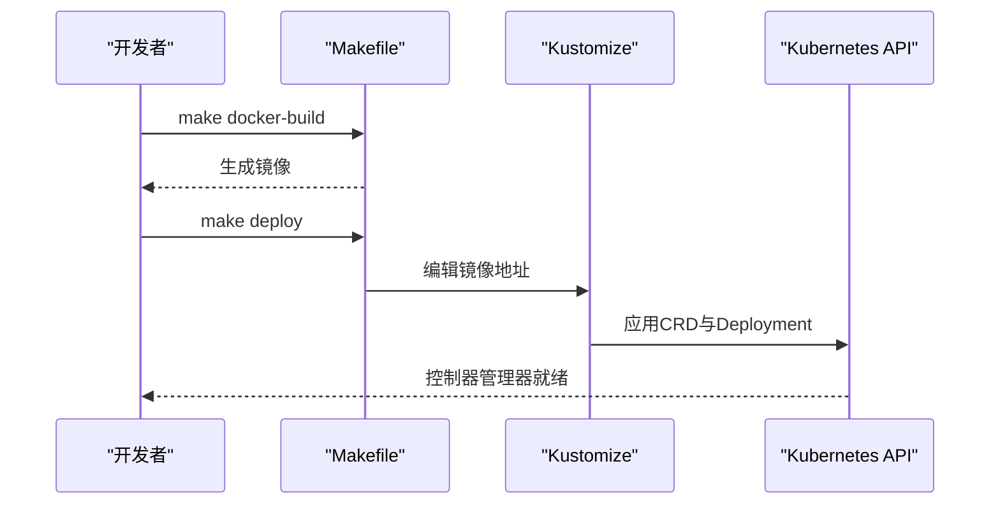
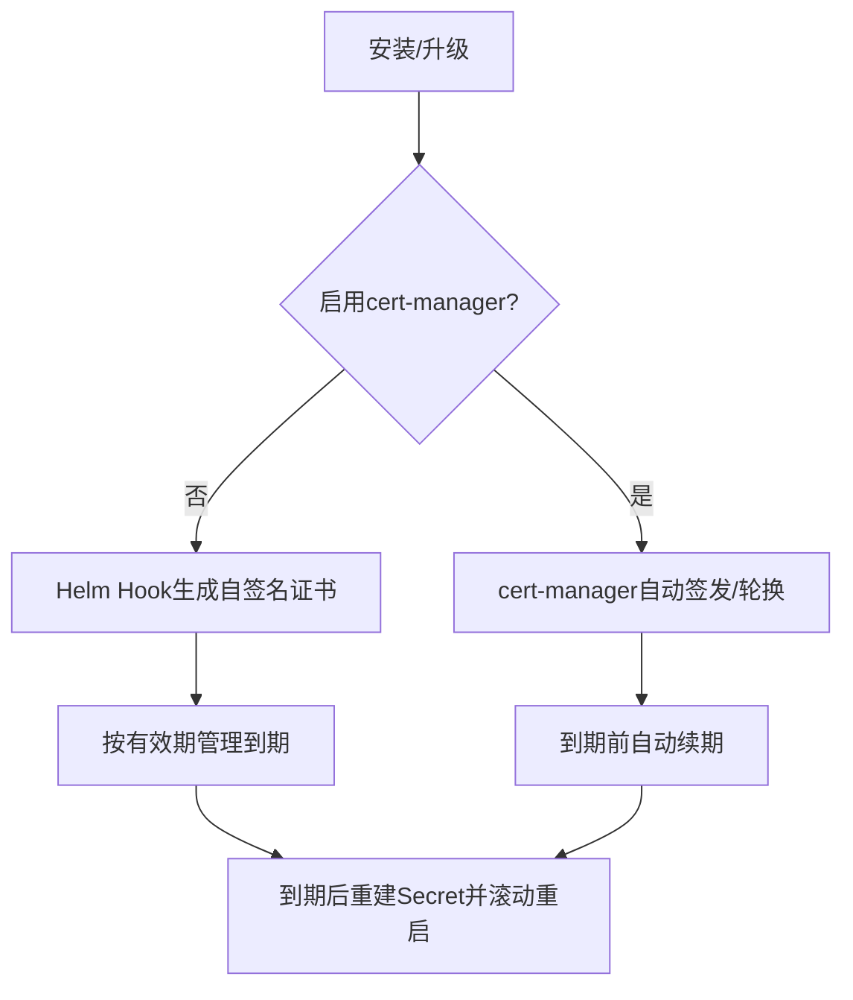
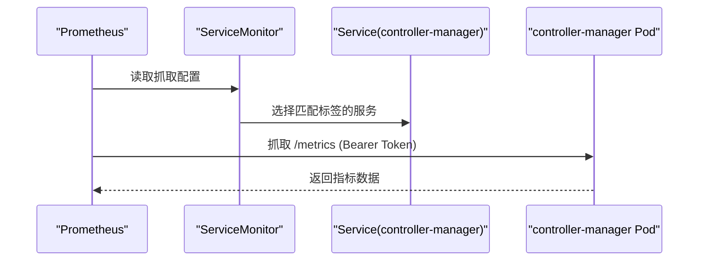
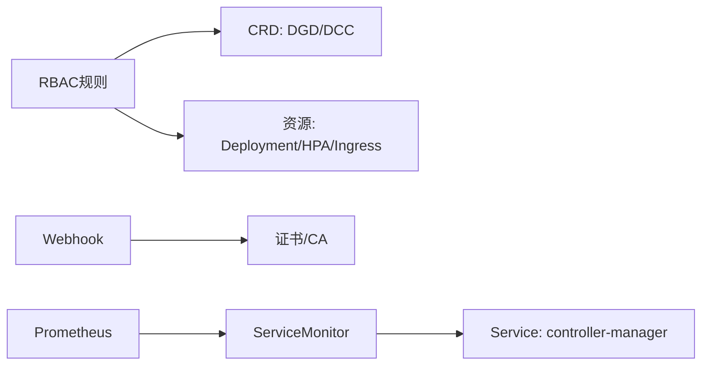

# 操作器部署配置

<cite>
**本文引用的文件**
- [README.md](file://deploy/operator/README.md)
- [Makefile](file://deploy/operator/Makefile)
- [Dockerfile](file://container/Dockerfile)
- [README.md](file://deploy/helm/README.md)
- [README.md](file://deploy/helm/charts/platform/README.md)
- [README.md](file://deploy/helm/charts/crds/README.md)
- [kustomization.yaml](file://deploy/operator/config/default/kustomization.yaml)
- [monitor.yaml](file://deploy/operator/config/prometheus/monitor.yaml)
- [prometheus.yml](file://deploy/observability/prometheus.yml)
- [dynamocomponentdeployment_types.go](file://deploy/operator/api/v1alpha1/dynamocomponentdeployment_types.go)
- [dynamographdeployment_types.go](file://deploy/operator/api/v1alpha1/dynamographdeployment_types.go)
- [manager.yaml](file://deploy/operator/config/manager/manager.yaml)
- [role.yaml](file://deploy/operator/config/rbac/role.yaml)
- [leader_election_role.yaml](file://deploy/operator/config/rbac/leader_election_role.yaml)
</cite>

## 目录
1. [简介](#简介)
2. [项目结构](#项目结构)
3. [核心组件](#核心组件)
4. [架构总览](#架构总览)
5. [详细组件分析](#详细组件分析)
6. [依赖关系分析](#依赖关系分析)
7. [性能考虑](#性能考虑)
8. [故障排查指南](#故障排查指南)
9. [结论](#结论)
10. [附录](#附录)

## 简介
本文件面向Dynamo Kubernetes操作器（Operator）的部署与运维，系统性说明构建与打包流程（含Docker镜像与Makefile任务）、部署配置项（资源限制、副本数、滚动更新策略）、证书管理机制（Webhook证书生成与自动轮换）、监控配置（Prometheus指标暴露与ServiceMonitor设置），并提供升级与回滚流程、故障排查方法以及多环境部署示例与最佳实践。

## 项目结构
围绕操作器的部署相关目录与文件如下：
- 操作器源码与构建：deploy/operator
- Helm图表：deploy/helm
- 运行时容器镜像与构建：container
- 操作器监控与Prometheus集成：deploy/operator/config/prometheus 与 deploy/observability/prometheus.yml
- CRD与RBAC：deploy/operator/config/crd、config/rbac
- 平台整体部署说明：deploy/helm/charts/platform/README.md

**图示来源**
- [README.md](file://deploy/operator/README.md#L1-L37)
- [Makefile](file://deploy/operator/Makefile#L1-L337)
- [kustomization.yaml](file://deploy/operator/config/default/kustomization.yaml#L1-L158)
- [manager.yaml](file://deploy/operator/config/manager/manager.yaml#L1-L107)
- [role.yaml](file://deploy/operator/config/rbac/role.yaml#L1-L247)
- [leader_election_role.yaml](file://deploy/operator/config/rbac/leader_election_role.yaml#L1-L60)
- [monitor.yaml](file://deploy/operator/config/prometheus/monitor.yaml#L1-L41)
- [README.md](file://deploy/helm/README.md#L1-L23)
- [README.md](file://deploy/helm/charts/platform/README.md#L1-L187)
- [README.md](file://deploy/helm/charts/crds/README.md#L1-L20)
- [Dockerfile](file://container/Dockerfile#L1-L655)
- [prometheus.yml](file://deploy/observability/prometheus.yml#L1-L63)

**章节来源**
- [README.md](file://deploy/operator/README.md#L1-L37)
- [README.md](file://deploy/helm/README.md#L1-L23)

## 核心组件
- 操作器二进制与镜像：通过Makefile构建并可推送至容器镜像仓库；支持本地运行与交叉平台构建。
- Helm图表：提供平台级安装（包含Operator、NATS、etcd、Grove、Kai调度器）与仅CRD安装两种模式。
- 配置与清单：Kustomize管理命名空间、名称前缀、认证代理补丁、Webhook与CertManager集成、Prometheus ServiceMonitor等。
- CRD与RBAC：定义DynamoGraphDeployment与DynamoComponentDeployment等资源及操作器所需权限。
- 监控：控制器管理器暴露指标端点，ServiceMonitor抓取；平台级Prometheus配置示例。

**章节来源**
- [Makefile](file://deploy/operator/Makefile#L172-L219)
- [README.md](file://deploy/helm/charts/platform/README.md#L18-L187)
- [kustomization.yaml](file://deploy/operator/config/default/kustomization.yaml#L32-L61)
- [monitor.yaml](file://deploy/operator/config/prometheus/monitor.yaml#L16-L41)
- [dynamographdeployment_types.go](file://deploy/operator/api/v1alpha1/dynamographdeployment_types.go#L47-L100)
- [dynamocomponentdeployment_types.go](file://deploy/operator/api/v1alpha1/dynamocomponentdeployment_types.go#L39-L133)

## 架构总览
下图展示了操作器在Kubernetes中的部署位置、服务暴露、Webhook与证书管理、以及监控集成的关键交互。

**图示来源**
- [manager.yaml](file://deploy/operator/config/manager/manager.yaml#L17-L107)
- [kustomization.yaml](file://deploy/operator/config/default/kustomization.yaml#L32-L61)
- [monitor.yaml](file://deploy/operator/config/prometheus/monitor.yaml#L16-L41)
- [role.yaml](file://deploy/operator/config/rbac/role.yaml#L16-L247)
- [leader_election_role.yaml](file://deploy/operator/config/rbac/leader_election_role.yaml#L16-L60)

## 详细组件分析

### 构建与打包流程（Docker镜像与Makefile）
- Docker镜像构建
  - 基于多阶段构建，包含wheel_builder与runtime阶段，支持x86与ARM64架构参数化。
  - 支持通过构建参数控制Python版本、是否启用KVBM/GPU内存服务、媒体编解码、NIXL子系统、SCCACHE缓存等。
  - 最终运行时镜像以非root用户运行，具备安全上下文与探针配置。
- Makefile任务
  - build：生成CRD/RBAC/Webhook清单与代码，编译二进制。
  - docker-build/docker-push：构建并推送镜像。
  - docker-buildx：跨平台构建并推送（需开启BuildKit与buildx）。
  - deploy/undeploy：使用Kustomize部署/卸载。
  - manifests/generate：生成CRD与代码。
  - helm：导出Helm Chart（基于Kustomize输出）。
  - test/test-e2e/lint：测试与静态检查。
  - kustomize/controller-gen/envtest/golangci-lint：工具下载与安装。

**图示来源**
- [Dockerfile](file://container/Dockerfile#L17-L655)

**章节来源**
- [Dockerfile](file://container/Dockerfile#L17-L655)
- [Makefile](file://deploy/operator/Makefile#L172-L219)

### 部署配置选项（资源限制、副本数、滚动更新策略）
- 资源限制与请求
  - 控制器管理器容器默认CPU/内存上限与请求均为1024m/1Gi，可根据集群规模调整。
- 副本数
  - 默认副本数为1；如需高可用，可在部署层增加副本数并配合Leader选举。
- 滚动更新策略
  - 使用滚动更新（RollingUpdate），可通过Kustomize或直接编辑Deployment进行策略定制。
- Pod安全与探针
  - 启用非root运行、drop全部能力、健康检查与就绪检查端口固定，便于Prometheus抓取与K8s自检。
- 节点亲和与容忍
  - 可通过Kustomize补丁添加节点亲和与容忍，满足多架构与专用节点需求。

**图示来源**
- [Makefile](file://deploy/operator/Makefile#L234-L241)
- [manager.yaml](file://deploy/operator/config/manager/manager.yaml#L30-L107)

**章节来源**
- [manager.yaml](file://deploy/operator/config/manager/manager.yaml#L30-L107)
- [kustomization.yaml](file://deploy/operator/config/default/kustomization.yaml#L44-L58)

### 证书管理机制（Webhook证书生成与自动轮换）
- 自动证书生成
  - Helm安装时可由Hook生成Webhook证书，包含服务端证书、私钥与CA。
  - 证书有效期可配置，默认一年；过期后需要重新生成。
- cert-manager集成
  - 可启用cert-manager自动签发与轮换，支持根CA与叶子证书的生命周期管理。
- 外部证书
  - 支持外部管理证书，需手动创建包含tls.crt、tls.key、ca.crt的Secret，并注入CA Bundle。

**图示来源**
- [README.md](file://deploy/helm/charts/platform/README.md#L136-L151)

**章节来源**
- [README.md](file://deploy/helm/charts/platform/README.md#L136-L151)

### 监控配置（Prometheus指标暴露与ServiceMonitor）
- 指标端点
  - 控制器管理器监听localhost:8080用于Prometheus抓取；若需外部访问，可结合认证代理或Ingress。
- ServiceMonitor
  - 提供ServiceMonitor资源，选择带有control-plane=controller-manager的Service，抓取HTTPS路径并使用Bearer Token。
- 平台级Prometheus
  - 提供示例抓取配置，包括NATS、etcd、DCGM Exporter等组件，便于统一观测。

**图示来源**
- [monitor.yaml](file://deploy/operator/config/prometheus/monitor.yaml#L16-L41)
- [prometheus.yml](file://deploy/observability/prometheus.yml#L16-L63)

**章节来源**
- [monitor.yaml](file://deploy/operator/config/prometheus/monitor.yaml#L16-L41)
- [prometheus.yml](file://deploy/observability/prometheus.yml#L16-L63)

### 升级与回滚流程
- 升级步骤
  - 更新镜像标签：通过Kustomize替换镜像或在Helm values中指定新tag。
  - 应用变更：kubectl apply或helm upgrade。
  - 观察滚动更新：确认新Pod就绪、旧Pod退出。
- 回滚策略
  - 若使用Helm：helm rollback <release> <revision>。
  - 若使用kubectl：kubectl rollout undo deployment/dynamo-controller-manager。
- 安全与兼容
  - 升级前备份CRD与关键配置；确保镜像架构与集群一致；必要时先在预生产验证。

**章节来源**
- [Makefile](file://deploy/operator/Makefile#L234-L241)
- [README.md](file://deploy/helm/charts/platform/README.md#L18-L187)

### 故障排查方法
- Pod状态检查
  - 查看控制器管理器Pod状态与事件，确认就绪/存活探针返回正常。
  - 检查RBAC权限与Leader选举资源（ConfigMap/Lease）。
- 日志分析
  - 通过kubectl logs查看控制器日志；关注Webhook校验失败、CRD应用错误、资源创建失败等。
- 证书问题
  - 若Webhook校验失败，检查证书Secret是否存在且包含必需键；确认CA注入与failurePolicy配置。
- 监控抓取
  - 若Prometheus无法抓取指标，检查ServiceMonitor选择器、Bearer Token权限与TLS配置。

**章节来源**
- [manager.yaml](file://deploy/operator/config/manager/manager.yaml#L86-L97)
- [role.yaml](file://deploy/operator/config/rbac/role.yaml#L16-L247)
- [leader_election_role.yaml](file://deploy/operator/config/rbac/leader_election_role.yaml#L16-L60)
- [monitor.yaml](file://deploy/operator/config/prometheus/monitor.yaml#L31-L38)

### 不同环境下的部署配置示例与最佳实践
- 开发环境
  - 使用Helm CRDs Chart快速安装CRD；本地Kind集群可直接kubectl apply或helm install。
  - 关闭严格failurePolicy，便于开发调试。
- 生产环境
  - 启用cert-manager自动轮换；设置严格的Leader Election ID与命名空间；开启Webhook并配置Failure Policy为Fail。
  - 为控制器管理器配置资源请求/限制与节点亲和，确保高可用与隔离。
- 多租户场景
  - 使用命名空间受限部署，每个租户一个独立Operator实例；通过namespaceRestriction.targetNamespace限定作用域。
- 跨平台与GPU
  - 使用docker-buildx构建多架构镜像；确保运行时镜像与后端框架（vLLM/sgLANG/TRT-LLM）兼容。

**章节来源**
- [README.md](file://deploy/helm/charts/platform/README.md#L41-L82)
- [README.md](file://deploy/helm/charts/platform/README.md#L104-L151)
- [manager.yaml](file://deploy/operator/config/manager/manager.yaml#L42-L62)

## 依赖关系分析
- 组件耦合
  - 操作器通过RBAC对CRD、Deployment、HPA、Ingress、VirtualService等资源进行管理。
  - Webhook依赖证书Secret或cert-manager；ServiceMonitor依赖Service标签选择器。
- 外部依赖
  - Helm依赖controller-gen、kustomize、golangci-lint等工具；Kubebuilder生成CRD与代码。
- 潜在循环依赖
  - 无直接循环；Webhook与证书为外部依赖，不构成控制器内部循环。

**图示来源**
- [role.yaml](file://deploy/operator/config/rbac/role.yaml#L16-L247)
- [monitor.yaml](file://deploy/operator/config/prometheus/monitor.yaml#L16-L41)

**章节来源**
- [role.yaml](file://deploy/operator/config/rbac/role.yaml#L16-L247)
- [monitor.yaml](file://deploy/operator/config/prometheus/monitor.yaml#L16-L41)

## 性能考虑
- 资源规划
  - 控制器管理器默认资源适中，建议根据集群规模与CRD数量调优CPU/内存。
- 探针与健康
  - 合理设置探针延迟与周期，避免频繁重启；将指标端口限制在localhost并配合认证代理。
- 镜像与构建
  - 使用SCCACHE与多阶段构建提升构建效率；跨平台构建需启用BuildKit与buildx。

[本节为通用指导，无需列出具体文件来源]

## 故障排查指南
- 常见问题定位
  - Webhook校验失败：检查证书Secret、CA注入与failurePolicy。
  - CRD未生效：确认CRD已安装且版本匹配。
  - Pod无法就绪：检查探针端口、资源配额与节点亲和。
- 工具与命令
  - kubectl describe、kubectl logs、kubectl get events。
  - helm status、helm history、kubectl rollout status。

**章节来源**
- [manager.yaml](file://deploy/operator/config/manager/manager.yaml#L86-L97)
- [README.md](file://deploy/helm/charts/platform/README.md#L136-L151)

## 结论
本文从构建与打包、部署配置、证书与监控、升级回滚到故障排查，全面覆盖了Dynamo操作器在Kubernetes上的部署与运维要点。结合Helm图表与Kustomize清单，可实现从开发到生产的标准化交付；通过Webhook与cert-manager保障资源校验与证书生命周期管理；通过ServiceMonitor与Prometheus实现可观测性闭环。

[本节为总结性内容，无需列出具体文件来源]

## 附录
- 相关CRD与资源
  - DynamoGraphDeployment与DynamoComponentDeployment定义了服务网格化推理的声明式接口，支持资源、探针、Ingress、多节点等配置。
- Helm图表
  - platform图表提供平台级安装，crds图表仅安装CRD；两者均提供values参考与最佳实践。

**章节来源**
- [dynamographdeployment_types.go](file://deploy/operator/api/v1alpha1/dynamographdeployment_types.go#L47-L100)
- [dynamocomponentdeployment_types.go](file://deploy/operator/api/v1alpha1/dynamocomponentdeployment_types.go#L39-L133)
- [README.md](file://deploy/helm/README.md#L18-L23)
- [README.md](file://deploy/helm/charts/crds/README.md#L18-L20)