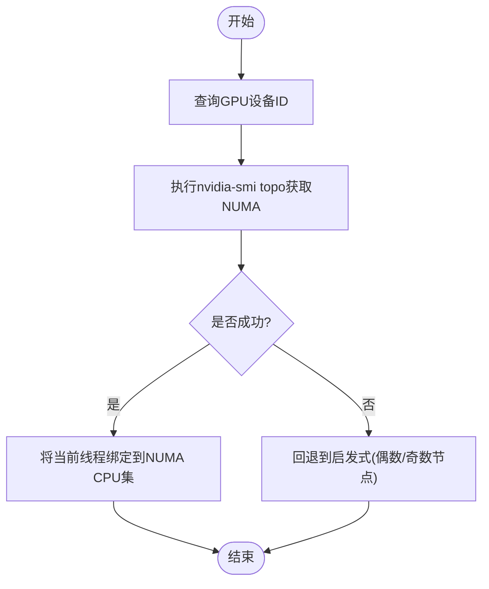

# 网络和存储

<cite>
**本文引用的文件**
- [deploy\nats-server.conf](file://deploy\nats-server.conf)
- [deploy\helm\charts\platform\values.yaml](file://deploy\helm\charts\platform\values.yaml)
- [deploy\helm\charts\platform\Chart.yaml](file://deploy\helm\charts\platform\Chart.yaml)
- [deploy\operator\api\v1alpha1\dynamocomponentdeployment_types.go](file://deploy\operator\api\v1alpha1\dynamodbcomponentdeployment_types.go)
- [deploy\operator\api\v1alpha1\dynamographdeployment_types.go](file://deploy\operator\api\v1alpha1\dynamographdeployment_types.go)
- [deploy\operator\internal\controller\dynamocomponentdeployment_controller.go](file://deploy\operator\internal\controller\dynamodbcomponentdeployment_controller.go)
- [lib\runtime\src\transports\nats.rs](file://lib\runtime\src\transports\nats.rs)
- [lib\llm\src\block_manager\numa_allocator.rs](file://lib\llm\src\block_manager\numa_allocator.rs)
- [tests\fault_tolerance\hardware\fault_injection_service\api_service\main.py](file://tests\fault_tolerance\hardware\fault_injection_service\api_service\main.py)
- [deploy\utils\manifests\pvc.yaml](file://deploy\utils\manifests\pvc.yaml)
- [deploy\utils\manifests\pvc-access-pod.yaml](file://deploy\utils\manifests\pvc-access-pod.yaml)
- [docs\kubernetes\README.md](file://docs\kubernetes\README.md)
- [docs\kubernetes\installation_guide.md](file://docs\kubernetes\installation_guide.md)
- [docs\kubernetes\service_discovery.md](file://docs\kubernetes\service_discovery.md)
- [docs\kubernetes\model_caching_with_fluid.md](file://docs\kubernetes\model_caching_with_fluid.md)
- [docs\kubernetes\fluxcd.md](file://docs\kubernetes\fluxcd.md)
- [docs\kubernetes\webhooks.md](file://docs\kubernetes\webhooks.md)
- [docs\kubernetes\autoscaling.md](file://docs\kubernetes\autoscaling.md)
- [docs\kubernetes\dynamo_operator.md](file://docs\kubernetes\dynamo_operator.md)
- [docs\kubernetes\grove.md](file://docs\kubernetes\grove.md)
- [docs\kubernetes\api_reference.md](file://docs\kubernetes\api_reference.md)
- [docs\kubernetes\deployment\create_deployment.md](file://docs\kubernetes\deployment\create_deployment.md)
- [docs\kubernetes\deployment\minikube.md](file://docs\kubernetes\deployment\minikube.md)
- [docs\kubernetes\deployment\multinode-deployment.md](file://docs\kubernetes\deployment\multinode-deployment.md)
- [docs\kubernetes\observability\logging.md](file://docs\kubernetes\observability\logging.md)
- [docs\kubernetes\observability\metrics.md](file://docs\kubernetes\observability\metrics.md)
- [docs\kubernetes\observability\operator-metrics.md](file://docs\kubernetes\observability\operator-metrics.md)
- [docs\kubernetes\observability\prometheus-grafana.md](file://docs\kubernetes\observability\prometheus-grafana.md)
- [docs\kubernetes\observability\tracing.md](file://docs\kubernetes\observability\tracing.md)
- [docs\kubernetes\deployment\dynamomodel-guide.md](file://docs\kubernetes\deployment\dynamomodel-guide.md)
- [docs\kubernetes\deployment\multinode-deployment.md](file://docs\kubernetes\deployment\multinode-deployment.md)
- [docs\kubernetes\deployment\create_deployment.md](file://docs\kubernetes\deployment\create_deployment.md)
- [docs\kubernetes\deployment\minikube.md](file://docs\kubernetes\deployment\minikube.md)
- [docs\kubernetes\deployment\multinode-deployment.md](file://docs\kubernetes\deployment\multinode-deployment.md)
- [docs\kubernetes\deployment\create_deployment.md](file://docs\kubernetes\deployment\create_deployment.md)
- [docs\kubernetes\deployment\minikube.md](file://docs\kubernetes\deployment\minikube.md)
- [docs\kubernetes\deployment\multinode-deployment.md](file://docs\kubernetes\deployment\multinode-deployment.md)
- [docs\kubernetes\deployment\create_deployment.md](file://docs\kubernetes\deployment\create_deployment.md)
- [docs\kubernetes\deployment\minikube.md](file://docs\kubernetes\deployment\minikube.md)
- [docs\kubernetes\deployment\multinode-deployment.md](file://docs\kubernetes\deployment\multinode-deployment.md)
- [docs\kubernetes\deployment\create_deployment.md](file://docs\kubernetes\deployment\create_deployment.md)
- [docs\kubernetes\deployment\minikube.md](file://docs\kubernetes\deployment\minikube.md)
- [docs\kubernetes\deployment\multinode-deployment.md](file://docs\kubernetes\deployment\multinode-deployment.md)
- [docs\kubernetes\deployment\create_deployment.md](file://docs\kubernetes\deployment\create_deployment.md)
- [docs\kubernetes\deployment\minikube.md](file://docs\kubernetes\deployment\minikube.md)
- [docs\kubernetes\deployment\multinode-deployment.md](file://docs\kubernetes\deployment\multinode-deployment.md)
- [docs\kubernetes\deployment\create_deployment.md](file://docs\kubernetes\deployment\create_deployment.md)
- [docs\kubernetes\deployment\minikube.md](file://docs\kubernetes\deployment\minikube.md)
- [docs\kubernetes\deployment\multinode-deployment.md](file://docs\kubernetes\deployment\multinode-deployment.md)
- [docs\kubernetes\deployment\create_deployment.md](file://docs\kubernetes\deployment\create_deployment......md)
</cite>

## 目录
1. [简介](#简介)
2. [项目结构](#项目结构)
3. [核心组件](#核心组件)
4. [架构总览](#架构总览)
5. [详细组件分析](#详细组件分析)
6. [依赖关系分析](#依赖关系分析)
7. [性能考虑](#性能考虑)
8. [故障排查指南](#故障排查指南)
9. [结论](#结论)
10. [附录](#附录)

## 简介
本文件聚焦Dynamo在Kubernetes上的网络与存储配置，涵盖以下主题：
- Kubernetes网络策略与服务网格（Istio）集成、Ingress与VirtualService配置、网络隔离与分区注入能力
- 存储方案：PersistentVolume、StorageClass、CSI卷类型、对象存储集成思路
- NATS消息系统：部署与配置、JetStream持久化、集群与安全（TLS/认证）
- GPU资源管理与调度：NUMA亲和、设备插件与调度策略
- 网络拓扑与带宽优化、存储性能调优与备份恢复策略

## 项目结构
围绕网络与存储的关键目录与文件：
- Helm平台图表：包含operator、NATS、etcd、Istio网关等子图
- Operator API定义：Ingress/VirtualService、PVC、多节点等
- NATS服务端配置：payload大小、JetStream、监控端口、trace日志
- 运行时传输层：NATS客户端连接、认证优先级
- 故障注入测试：NetworkPolicy与ChaosMesh网络分区
- 存储工具清单：PVC与访问Pod示例
- 文档：安装、部署、可观测性、自动伸缩、Operator使用等

**图表来源**
- [deploy\helm\charts\platform\Chart.yaml](file://deploy\helm\charts\platform\Chart.yaml#L24-L46)
- [deploy\helm\charts\platform\values.yaml](file://deploy\helm\charts\platform\values.yaml#L115-L136)
- [lib\runtime\src\transports\nats.rs](file://lib\runtime\src\transports\nats.rs#L1-L395)
- [lib\llm\src\block_manager\numa_allocator.rs](file://lib\llm\src\block_manager\numa_allocator.rs#L51-L129)
- [tests\fault_tolerance\hardware\fault_injection_service\api_service\main.py](file://tests\fault_tolerance\hardware\fault_injection_service\api_service\main.py#L613-L774)

**章节来源**
- [deploy\helm\charts\platform\Chart.yaml](file://deploy\helm\charts\platform\Chart.yaml#L1-L46)
- [deploy\helm\charts\platform\values.yaml](file://deploy\helm\charts\platform\values.yaml#L115-L136)

## 核心组件
- 平台Helm图表：统一编排operator、NATS、etcd、Istio网关等，支持启用/禁用与参数覆盖
- Operator API：Ingress/VirtualService、PVC、多节点、资源与探针、环境变量与Secret注入
- NATS服务端：JetStream持久化、监控端口、payload上限、trace日志
- 运行时NATS客户端：多种认证方式、连接与JetStream上下文、线程池与错误处理
- GPU与NUMA：设备到NUMA节点映射、线程CPU亲和绑定
- 故障注入：NetworkPolicy与ChaosMesh网络分区
- 存储：PVC/StorageClass/CSI卷、对象存储集成参考

**章节来源**
- [deploy\operator\api\v1alpha1\dynamocomponentdeployment_types.go](file://deploy\operator\api\v1alpha1\dynamodbcomponentdeployment_types.go#L149-L170)
- [deploy\operator\api\v1alpha1\dynamographdeployment_types.go](file://deploy\operator\api\v1alpha1\dynamographdeployment_types.go#L48-L70)
- [deploy\nats-server.conf](file://deploy\nats-server.conf#L1-L14)
- [lib\runtime\src\transports\nats.rs](file://lib\runtime\src\transports\nats.rs#L1-L395)
- [lib\llm\src\block_manager\numa_allocator.rs](file://lib\llm\src\block_manager\numa_allocator.rs#L51-L129)
- [tests\fault_tolerance\hardware\fault_injection_service\api_service\main.py](file://tests\fault_tolerance\hardware\fault_injection_service\api_service\main.py#L613-L774)
- [deploy\utils\manifests\pvc.yaml](file://deploy\utils\manifests\pvc.yaml)
- [deploy\utils\manifests\pvc-access-pod.yaml](file://deploy\utils\manifests\pvc-access-pod.yaml)

## 架构总览
Dynamo平台通过Helm图表统一部署，Operator负责根据CRD生成Kubernetes资源（Deployment/Service/Ingress/PVC），运行时组件通过NATS进行消息通信，存储采用CSI卷或外部对象存储，GPU通过NUMA亲和与设备插件实现高效调度。

**图表来源**
- [deploy\operator\api\v1alpha1\dynamographdeployment_types.go](file://deploy\operator\api\v1alpha1\dynamographdeployment_types.go#L48-L70)
- [deploy\operator\api\v1alpha1\dynamodbcomponentdeployment_types.go](file://deploy\operator\api\v1alpha1\dynamodbcomponentdeployment_types.go#L40-L48)
- [deploy\operator\internal\controller\dynamodbcomponentdeployment_controller.go](file://deploy\operator\internal\controller\dynamodbcomponentdeployment_controller.go#L1403-L1418)

## 详细组件分析

### Kubernetes网络策略与服务网格集成
- Ingress与VirtualService
  - IngressSpec支持启用、主机名、注解/标签、TLS、控制器类名
  - 支持UseVirtualService与VirtualServiceGateway，用于Istio网关路由
- 控制器对Ingress与Service的拥有关系，确保资源一致性
- 文档中提供安装、部署、服务发现、Webhook、自动伸缩、Operator使用等指南

**图表来源**
- [deploy\operator\api\v1alpha1\dynamodbcomponentdeployment_types.go](file://deploy\operator\api\v1alpha1\dynamodbcomponentdeployment_types.go#L149-L170)
- [deploy\operator\internal\controller\dynamodbcomponentdeployment_controller.go](file://deploy\operator\internal\controller\dynamodbcomponentdeployment_controller.go#L1403-L1418)

**章节来源**
- [deploy\operator\api\v1alpha1\dynamodbcomponentdeployment_types.go](file://deploy\operator\api\v1alpha1\dynamodbcomponentdeployment_types.go#L149-L170)
- [deploy\operator\internal\controller\dynamodbcomponentdeployment_controller.go](file://deploy\operator\internal\controller\dynamodbcomponentdeployment_controller.go#L1403-L1418)
- [docs\kubernetes\README.md](file://docs\kubernetes\README.md)
- [docs\kubernetes\installation_guide.md](file://docs\kubernetes\installation_guide.md)
- [docs\kubernetes\service_discovery.md](file://docs\kubernetes\service_discovery.md)
- [docs\kubernetes\webhooks.md](file://docs\kubernetes\webhooks.md)
- [docs\kubernetes\autoscaling.md](file://docs\kubernetes\autoscaling.md)
- [docs\kubernetes\dynamo_operator.md](file://docs\kubernetes\dynamo_operator.md)
- [docs\kubernetes\grove.md](file://docs\kubernetes\grove.md)
- [docs\kubernetes\api_reference.md](file://docs\kubernetes\api_reference.md)

### Ingress与VirtualService配置要点
- 启用Ingress并指定控制器类名（如nginx）
- TLS证书Secret名称
- 使用VirtualService时需指定Gateway名称
- 主机名前缀/后缀、注解与标签可按需扩展

**章节来源**
- [deploy\helm\charts\platform\values.yaml](file://deploy\helm\charts\platform\values.yaml#L115-L136)
- [deploy\operator\api\v1alpha1\dynamodbcomponentdeployment_types.go](file://deploy\operator\api\v1alpha1\dynamodbcomponentdeployment_types.go#L149-L170)

### 网络隔离与分区注入
- NetworkPolicy直接创建，支持按命名空间与目标Pod前缀选择
- 支持ChaosMesh NetworkChaos资源进行网络分区注入
- 可用于故障演练与韧性测试

**图表来源**
- [tests\fault_tolerance\hardware\fault_injection_service\api_service\main.py](file://tests\fault_tolerance\hardware\fault_injection_service\api_service\main.py#L613-L774)

**章节来源**
- [tests\fault_tolerance\hardware\fault_injection_service\api_service\main.py](file://tests\fault_tolerance\hardware\fault_injection_service\api_service\main.py#L613-L774)

### 存储解决方案：PVC、StorageClass与CSI
- DynamoGraphDeployment支持定义PVC列表，组件通过VolumeMounts引用
- PVC验证规则：当Create为true时，Size、StorageClass、VolumeAccessMode为必填
- CSI卷类型与NFS等可通过PersistentVolumeClaim引用
- 示例清单包含PVC与访问Pod

**图表来源**
- [deploy\operator\api\v1alpha1\dynamodbgraphdeployment_types.go](file://deploy\operator\api\v1alpha1\dynamodbgraphdeployment_types.go#L48-L70)
- [deploy\operator\api\v1alpha1\dynamodbcomponentdeployment_types.go](file://deploy\operator\api\v1alpha1\dynamodbcomponentdeployment_types.go#L89-L90)

**章节来源**
- [deploy\operator\api\v1alpha1\dynamodbgraphdeployment_types.go](file://deploy\operator\api\v1alpha1\dynamodbgraphdeployment_types.go#L48-L70)
- [deploy\operator\api\v1alpha1\dynamodbcomponentdeployment_types.go](file://deploy\operator\api\v1alpha1\dynamodbcomponentdeployment_types.go#L89-L90)
- [deploy\operator\api\v1alpha1\dynamodbcomponentdeployment_types_test.go](file://deploy\operator\api\v1alpha1\dynamodbcomponentdeployment_types_test.go#L320-L367)
- [deploy\utils\manifests\pvc.yaml](file://deploy\utils\manifests\pvc.yaml)
- [deploy\utils\manifests\pvc-access-pod.yaml](file://deploy\utils\manifests\pvc-access-pod.yaml)

### 对象存储集成思路
- 模型缓存与Fluid集成：通过Helm values中的model-caching配置与Fluid CRD实现
- 对象存储作为远端模型仓库，结合CSI或本地缓存提升加载性能
- 参考文档提供安装与使用指引

**章节来源**
- [docs\kubernetes\model_caching_with_fluid.md](file://docs\kubernetes\model_caching_with_fluid.md)
- [deploy\helm\charts\platform\values.yaml](file://deploy\helm\charts\platform\values.yaml#L88-L114)

### NATS消息系统：部署与配置
- 服务端配置要点
  - max_payload设置为15MB以适配约10MB解码后的嵌入向量
  - 启用JetStream与监控端口
  - 开启trace日志便于调试
- Helm图表配置
  - 可启用/禁用NATS子图，支持JetStream文件存储与PVC
  - TLS CA、集群、Leafnodes、WebSocket、MQTT、Gateway、监控与profiling端口
  - StatefulSet、Headless Service、Service Account、Prometheus导出器等
- 客户端连接与认证
  - 支持用户名/密码、Token、NKey、凭据文件等多种认证方式
  - 认证优先级与默认行为遵循代码实现
  - 建立JetStream上下文并进行连接

**图表来源**
- [lib\runtime\src\transports\nats.rs](file://lib\runtime\src\transports\nats.rs#L310-L340)
- [deploy\nats-server.conf](file://deploy\nats-server.conf#L1-L14)
- [deploy\helm\charts\platform\values.yaml](file://deploy\helm\charts\platform\values.yaml#L289-L490)

**章节来源**
- [deploy\nats-server.conf](file://deploy\nats-server.conf#L1-L14)
- [deploy\helm\charts\platform\values.yaml](file://deploy\helm\charts\platform\values.yaml#L289-L490)
- [lib\runtime\src\transports\nats.rs](file://lib\runtime\src\transports\nats.rs#L1-L395)

### GPU资源管理与分配
- NUMA节点获取与线程亲和
  - 通过nvidia-smi拓扑查询GPU对应的NUMA节点
  - 将当前线程绑定到该NUMA节点的CPU集合，确保内存首次触达策略
- 多节点与NUMA
  - DynamoGraphDeployment支持多节点配置，节点数影响GPU总数
  - 结合NUMA亲和与设备插件，提升跨节点推理性能

**图表来源**
- [lib\llm\src\block_manager\numa_allocator.rs](file://lib\llm\src\block_manager\numa_allocator.rs#L70-L99)

**章节来源**
- [lib\llm\src\block_manager\numa_allocator.rs](file://lib\llm\src\block_manager\numa_allocator.rs#L51-L129)
- [deploy\operator\api\v1alpha1\dynamodbgraphdeployment_types.go](file://deploy\operator\api\v1alpha1\dynamodbgraphdeployment_types.go#L135-L142)

## 依赖关系分析
- Helm图表依赖：operator、NATS、etcd、Istio网关、Kai调度器、Grove
- Operator控制器关注Deployment、Service、Ingress、PVC等资源
- 运行时依赖NATS客户端库与JetStream
- 存储依赖CSI驱动与StorageClass

**图表来源**
- [deploy\helm\charts\platform\Chart.yaml](file://deploy\helm\charts\platform\Chart.yaml#L24-L46)
- [deploy\operator\internal\controller\dynamodbcomponentdeployment_controller.go](file://deploy\operator\internal\controller\dynamodbcomponentdeployment_controller.go#L1403-L1418)

**章节来源**
- [deploy\helm\charts\platform\Chart.yaml](file://deploy\helm\charts\platform\Chart.yaml#L24-L46)
- [deploy\operator\internal\controller\dynamodbcomponentdeployment_controller.go](file://deploy\operator\internal\controller\dynamodbcomponentdeployment_controller.go#L1403-L1418)

## 性能考虑
- 网络
  - Ingress控制器类名与Istio Gateway选择影响延迟与吞吐
  - NetworkPolicy最小化放行范围，避免不必要的丢包与重试
  - ChaosMesh分区注入用于评估网络韧性与自愈能力
- 存储
  - PVC大小与StorageClass选择直接影响I/O延迟与吞吐
  - CSI卷类型与对象存储结合，利用缓存与预热减少冷启动
  - Fluid模型缓存加速大模型加载
- NATS
  - max_payload合理设置避免消息截断
  - JetStream文件存储PVC容量规划与IO盘类型
  - 监控端口与trace日志辅助定位瓶颈
- GPU
  - NUMA亲和与CPU绑定降低跨NUMA内存访问开销
  - 多节点部署时结合NUMA与设备插件提升利用率

[本节为通用指导，无需特定文件引用]

## 故障排查指南
- NATS连接失败
  - 检查NATS服务器地址与端口、认证配置（用户名/密码、Token、NKey、凭据文件）
  - 查看trace日志与监控端口状态
- Ingress/VirtSvc不生效
  - 确认Ingress控制器类名、TLS Secret、VirtualService Gateway
  - 核对注解与标签是否正确
- PVC无法绑定
  - 检查StorageClass是否存在、容量是否足够、访问模式是否匹配
  - 查看事件与绑定状态
- 网络分区注入
  - NetworkPolicy创建是否成功、命名空间与标签选择是否正确
  - ChaosMesh资源是否被正确应用

**章节来源**
- [lib\runtime\src\transports\nats.rs](file://lib\runtime\src\transports\nats.rs#L1-L395)
- [deploy\nats-server.conf](file://deploy\nats-server.conf#L1-L14)
- [deploy\operator\api\v1alpha1\dynamodbcomponentdeployment_types.go](file://deploy\operator\api\v1alpha1\dynamodbcomponentdeployment_types.go#L149-L170)
- [deploy\operator\api\v1alpha1\dynamodbcomponentdeployment_types_test.go](file://deploy\operator\api\v1alpha1\dynamodbcomponentdeployment_types_test.go#L320-L367)
- [tests\fault_tolerance\hardware\fault_injection_service\api_service\main.py](file://tests\fault_tolerance\hardware\fault_injection_service\api_service\main.py#L613-L774)

## 结论
Dynamo在Kubernetes上的网络与存储配置以Helm平台图表为核心，结合Operator的声明式CRD与运行时传输层，实现了从Ingress/VirtSvc到PVC/CSI再到NATS/JetStream的完整链路。通过NUMA亲和与GPU调度策略、对象存储与模型缓存、以及NetworkPolicy/ChaosMesh的韧性测试，平台能够在复杂生产环境中实现高可用、高性能与可运维性。

[本节为总结，无需特定文件引用]

## 附录
- 参考文档：安装、部署、服务发现、自动伸缩、Operator使用、可观测性、FluxCD等
- 示例清单：PVC与访问Pod

**章节来源**
- [docs\kubernetes\README.md](file://docs\kubernetes\README.md)
- [docs\kubernetes\installation_guide.md](file://docs\kubernetes\installation_guide.md)
- [docs\kubernetes\service_discovery.md](file://docs\kubernetes\service_discovery.md)
- [docs\kubernetes\autoscaling.md](file://docs\kubernetes\autoscaling.md)
- [docs\kubernetes\dynamo_operator.md](file://docs\kubernetes\dynamo_operator.md)
- [docs\kubernetes\observability\logging.md](file://docs\kubernetes\observability\logging.md)
- [docs\kubernetes\observability\metrics.md](file://docs\kubernetes\observability\metrics.md)
- [docs\kubernetes\observability\operator-metrics.md](file://docs\kubernetes\observability\operator-metrics.md)
- [docs\kubernetes\observability\prometheus-grafana.md](file://docs\kubernetes\observability\prometheus-grafana.md)
- [docs\kubernetes\observability\tracing.md](file://docs\kubernetes\observability\tracing.md)
- [docs\kubernetes\fluxcd.md](file://docs\kubernetes\fluxcd.md)
- [docs\kubernetes\deployment\create_deployment.md](file://docs\kubernetes\deployment\create_deployment.md)
- [docs\kubernetes\deployment\minikube.md](file://docs\kubernetes\deployment\minikube.md)
- [docs\kubernetes\deployment\multinode-deployment.md](file://docs\kubernetes\deployment\multinode-deployment.md)
- [docs\kubernetes\deployment\dynamomodel-guide.md](file://docs\kubernetes\deployment\dynamomodel-guide.md)
- [deploy\utils\manifests\pvc.yaml](file://deploy\utils\manifests\pvc.yaml)
- [deploy\utils\manifests\pvc-access-pod.yaml](file://deploy\utils\manifests\pvc-access-pod.yaml)