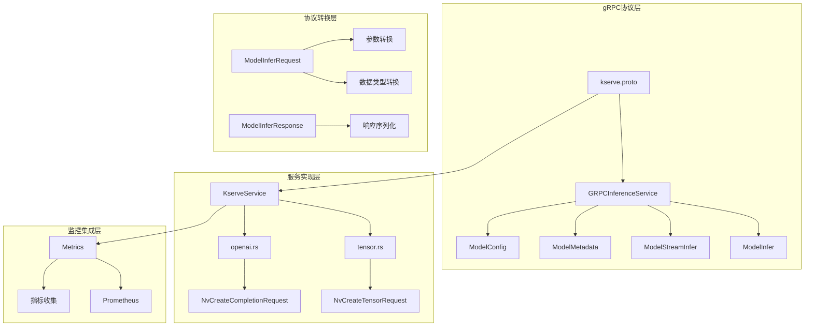
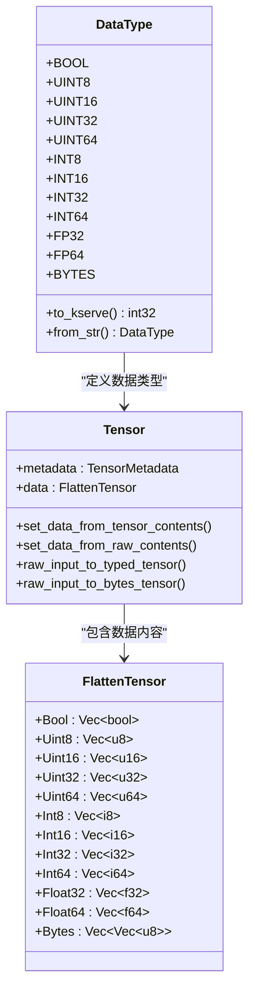
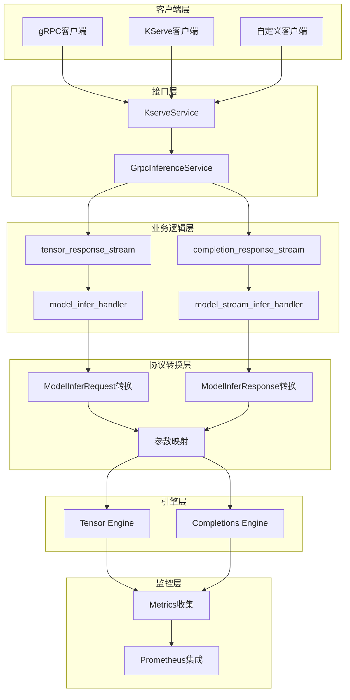
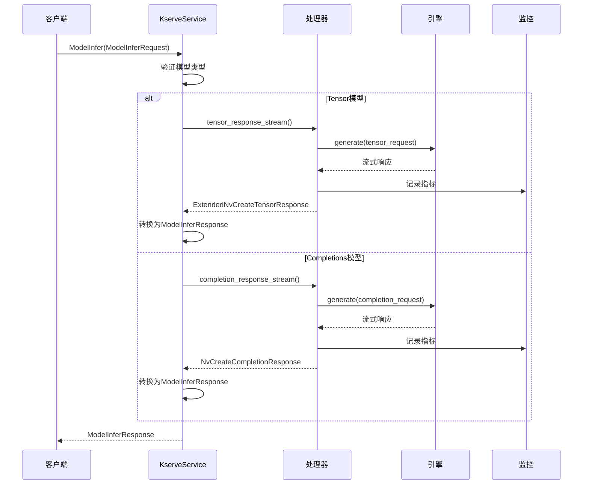
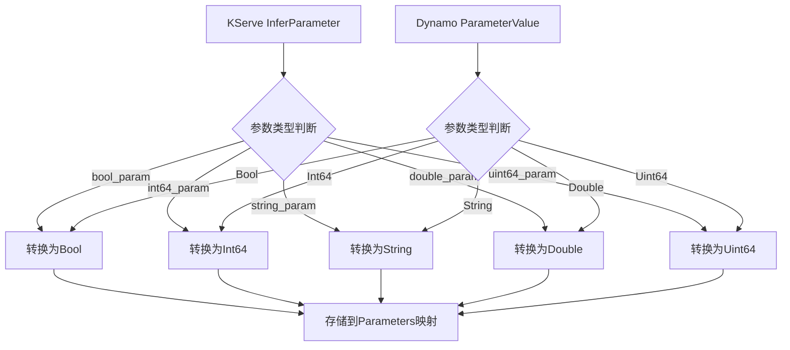
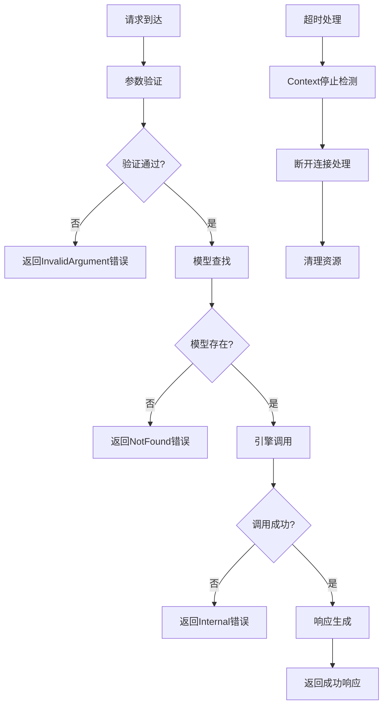
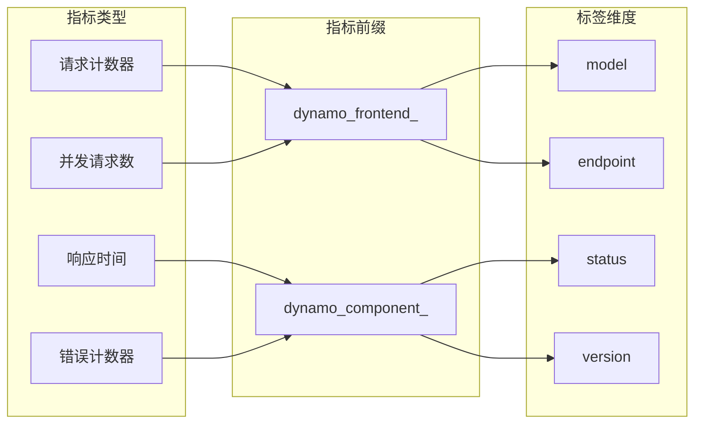
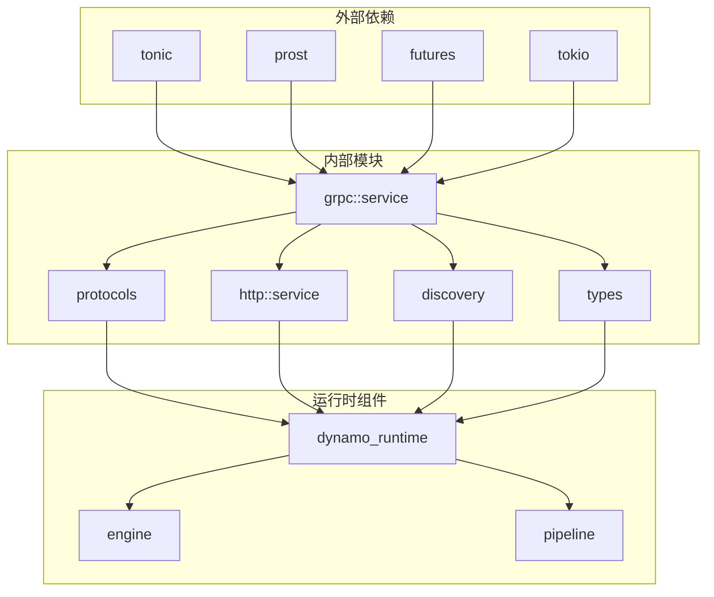
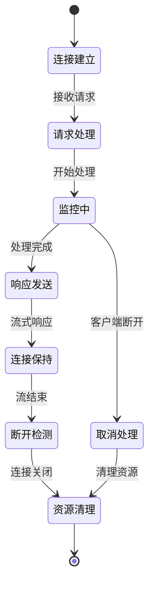

# KServe gRPC接口

<cite>
**本文档引用的文件**
- [kserve.proto](file://lib/llm/src/grpc/protos/kserve.proto)
- [kserve.rs](file://lib/llm/src/grpc/service/kserve.rs)
- [tensor.rs](file://lib/llm/src/grpc/service/tensor.rs)
- [openai.rs](file://lib/llm/src/grpc/service/openai.rs)
- [kserve.md](file://docs/frontends/kserve.md)
- [server.py](file://lib/bindings/python/examples/kserve_grpc_service/server.py)
- [metrics.md](file://docs/kubernetes/observability/metrics.md)
- [metrics.rs](file://lib/runtime/src/metrics.rs)
- [prometheus_names.rs](file://lib/runtime/src/metrics/prometheus_names.rs)
- [kserve_service.rs](file://tests/llm/tests/kserve_service.rs)
- [test_tensor_parameters.py](file://tests/frontend/grpc/test_tensor_parameters.py)
- [test_tensor_mocker_engine.py](file://tests/frontend/grpc/test_tensor_mocker_engine.py)
</cite>

## 目录
1. [简介](#简介)
2. [项目结构](#项目结构)
3. [核心组件](#核心组件)
4. [架构概览](#架构概览)
5. [详细组件分析](#详细组件分析)
6. [依赖关系分析](#依赖关系分析)
7. [性能考虑](#性能考虑)
8. [故障排除指南](#故障排除指南)
9. [结论](#结论)
10. [附录](#附录)

## 简介

Dynamo KServe gRPC接口是Dynamo AI推理平台的核心组件，实现了KServe v2 API标准协议，为机器学习模型推理提供了高性能、可扩展的gRPC服务接口。该接口支持Tensor服务、模型服务和批处理接口，与KServe生态系统完全兼容，能够无缝集成到现有的AI推理基础设施中。

本接口主要面向企业级AI推理平台，提供以下关键能力：
- 标准化的KServe v2 API兼容性
- 高性能的gRPC通信协议
- 支持流式和非流式推理
- 完整的监控和指标收集
- 灵活的模型注册和管理
- 企业级的错误处理和超时控制

## 项目结构

Dynamo KServe gRPC接口的代码组织遵循模块化设计原则，主要分为以下几个层次：



**图表来源**
- [kserve.proto](file://lib/llm/src/grpc/protos/kserve.proto#L17-L67)
- [kserve.rs](file://lib/llm/src/grpc/service/kserve.rs#L104-L174)

**章节来源**
- [kserve.proto](file://lib/llm/src/grpc/protos/kserve.proto#L1-L729)
- [kserve.rs](file://lib/llm/src/grpc/service/kserve.rs#L1-L733)

## 核心组件

### gRPC服务接口

Dynamo实现了完整的KServe v2 API标准，包括以下核心RPC端点：

| RPC端点 | 功能描述 | 请求消息 | 响应消息 |
|---------|----------|----------|----------|
| ServerLive | 检查服务器存活状态 | ServerLiveRequest | ServerLiveResponse |
| ServerReady | 检查服务器就绪状态 | ServerReadyRequest | ServerReadyResponse |
| ModelReady | 检查模型就绪状态 | ModelReadyRequest | ModelReadyResponse |
| ModelMetadata | 获取模型元数据信息 | ModelMetadataRequest | ModelMetadataResponse |
| ModelInfer | 执行推理请求 | ModelInferRequest | ModelInferResponse |
| ModelStreamInfer | 执行流式推理请求 | stream ModelInferRequest | stream ModelStreamInferResponse |
| ModelConfig | 获取模型配置信息 | ModelConfigRequest | ModelConfigResponse |

### 数据类型系统

接口支持多种数据类型，通过统一的类型转换机制实现KServe协议与Dynamo内部数据结构的映射：



**图表来源**
- [tensor.rs](file://lib/llm/src/grpc/service/tensor.rs#L717-L776)
- [tensor.rs](file://lib/llm/src/grpc/service/tensor.rs#L316-L531)

**章节来源**
- [kserve.proto](file://lib/llm/src/grpc/protos/kserve.proto#L249-L382)
- [tensor.rs](file://lib/llm/src/grpc/service/tensor.rs#L252-L314)

## 架构概览

Dynamo KServe gRPC接口采用分层架构设计，确保了良好的可维护性和扩展性：



**图表来源**
- [kserve.rs](file://lib/llm/src/grpc/service/kserve.rs#L236-L733)
- [tensor.rs](file://lib/llm/src/grpc/service/tensor.rs#L56-L140)
- [openai.rs](file://lib/llm/src/grpc/service/openai.rs#L43-L134)

## 详细组件分析

### KserveService核心实现

KserveService是整个gRPC接口的核心控制器，负责管理服务状态、路由请求到相应的处理器，并提供统一的错误处理机制。



**图表来源**
- [kserve.rs](file://lib/llm/src/grpc/service/kserve.rs#L238-L318)
- [tensor.rs](file://lib/llm/src/grpc/service/tensor.rs#L56-L140)

### 参数转换机制

Dynamo实现了完整的参数转换系统，支持KServe InferParameter与Dynamo ParameterValue之间的双向转换：



**图表来源**
- [tensor.rs](file://lib/llm/src/grpc/service/tensor.rs#L198-L249)
- [openai.rs](file://lib/llm/src/grpc/service/openai.rs#L191-L321)

**章节来源**
- [tensor.rs](file://lib/llm/src/grpc/service/tensor.rs#L197-L250)
- [openai.rs](file://lib/llm/src/grpc/service/openai.rs#L191-L321)

### 错误处理和超时控制

接口实现了完善的错误处理机制，包括参数验证、模型查找、引擎调用等各个环节的异常处理：



**图表来源**
- [tensor.rs](file://lib/llm/src/grpc/service/tensor.rs#L149-L181)
- [kserve.rs](file://lib/llm/src/grpc/service/kserve.rs#L247-L270)

**章节来源**
- [tensor.rs](file://lib/llm/src/grpc/service/tensor.rs#L149-L181)
- [kserve.rs](file://lib/llm/src/grpc/service/kserve.rs#L247-L270)

### 监控和指标收集

Dynamo集成了完整的监控体系，支持Prometheus指标收集和可视化：



**图表来源**
- [metrics.rs](file://lib/runtime/src/metrics.rs#L202-L235)
- [prometheus_names.rs](file://lib/runtime/src/metrics/prometheus_names.rs#L16-L50)

**章节来源**
- [metrics.rs](file://lib/runtime/src/metrics.rs#L198-L1015)
- [prometheus_names.rs](file://lib/runtime/src/metrics/prometheus_names.rs#L1-L50)

## 依赖关系分析

Dynamo KServe gRPC接口的依赖关系体现了清晰的分层架构：



**图表来源**
- [kserve.rs](file://lib/llm/src/grpc/service/kserve.rs#L28-L36)
- [tensor.rs](file://lib/llm/src/grpc/service/tensor.rs#L4-L34)

**章节来源**
- [kserve.rs](file://lib/llm/src/grpc/service/kserve.rs#L1-L733)
- [tensor.rs](file://lib/llm/src/grpc/service/tensor.rs#L1-L776)

## 性能考虑

### 序列化优化

Dynamo在数据序列化方面采用了多项优化措施：

1. **原始字节序列化**：对于数值类型数据，使用小端序的原始字节格式，避免重复的类型转换开销
2. **批量数据传输**：支持raw_input_contents和raw_output_contents字段，减少Protobuf解析开销
3. **内存对齐优化**：在数据转换过程中确保内存对齐，提高处理效率

### 连接管理

接口实现了智能的连接管理机制：



**图表来源**
- [tensor.rs](file://lib/llm/src/grpc/service/tensor.rs#L149-L181)
- [openai.rs](file://lib/llm/src/grpc/service/openai.rs#L143-L174)

### 缓存策略

Dynamo实现了多层次的缓存机制：

1. **模型配置缓存**：避免频繁的模型查询操作
2. **参数映射缓存**：重用已转换的参数映射
3. **连接监控缓存**：跟踪活跃连接状态

## 故障排除指南

### 常见错误类型

| 错误类型 | 错误码 | 触发条件 | 解决方案 |
|----------|--------|----------|----------|
| InvalidArgument | 3 | 参数验证失败 | 检查请求格式和数据类型 |
| NotFound | 5 | 模型未找到 | 确认模型已正确注册 |
| Internal | 13 | 内部处理错误 | 检查引擎状态和资源可用性 |
| DeadlineExceeded | 4 | 请求超时 | 调整超时设置或优化模型性能 |

### 调试技巧

1. **启用详细日志**：通过环境变量设置日志级别
2. **监控指标**：使用Prometheus收集关键性能指标
3. **连接状态检查**：监控连接池和并发连接数
4. **内存使用监控**：跟踪内存分配和垃圾回收

**章节来源**
- [kserve_service.rs](file://tests/llm/tests/kserve_service.rs#L1459-L1477)
- [test_tensor_parameters.py](file://tests/frontend/grpc/test_tensor_parameters.py#L117-L139)

## 结论

Dynamo KServe gRPC接口为企业级AI推理平台提供了强大而灵活的基础设施。通过标准化的KServe v2 API兼容性、高性能的gRPC实现、完善的监控集成和灵活的部署选项，该接口能够满足各种规模和复杂度的AI推理需求。

主要优势包括：
- **标准兼容**：完全符合KServe v2 API规范
- **性能卓越**：优化的序列化和连接管理机制
- **监控完善**：全面的指标收集和可视化支持
- **部署灵活**：支持多种部署模式和配置选项
- **易于集成**：提供Python绑定和丰富的示例代码

## 附录

### 部署配置示例

#### 基础部署配置

```yaml
# 基础gRPC服务配置
grpc_service:
  host: "0.0.0.0"
  port: 8787
  http_metrics_host: "0.0.0.0"
  http_metrics_port: 8788

# 模型注册示例
models:
  - name: "tensor_model"
    type: "TensorBased"
    inputs:
      - name: "input"
        datatype: "FP32"
        shape: [1, 1024]
    outputs:
      - name: "output"
        datatype: "FP32"
        shape: [1, 512]
```

#### 监控配置

```yaml
# Prometheus监控配置
prometheus:
  enabled: true
  endpoint: "http://prometheus:9090"
  scrape_interval: "15s"

# Grafana仪表板配置
grafana:
  dashboard:
    name: "Dynamo KServe Metrics"
    datasources:
      - prometheus
```

### 客户端连接配置

#### Python客户端示例

```python
import grpc
from dynamo.llm import KserveGrpcService

# 创建gRPC通道
channel = grpc.insecure_channel('localhost:8787')

# 创建客户端
stub = inference.GRPCInferenceServiceStub(channel)

# 发送推理请求
request = ModelInferRequest(
    model_name="tensor_model",
    inputs=[
        InferInputTensor(
            name="input",
            datatype="FP32",
            shape=[1, 1024],
            contents=InferTensorContents(
                fp32_contents=input_data.flatten().tolist()
            )
        )
    ]
)

response = stub.ModelInfer(request)
```

#### 超时和重试配置

```python
# gRPC超时设置
options = [
    ('grpc.keepalive_time_ms', 10000),
    ('grpc.keepalive_timeout_ms', 5000),
    ('grpc.http2.max_pings_without_data', 0),
    ('grpc.http2.min_ping_interval_without_data_ms', 10000)
]

channel = grpc.secure_channel('localhost:8787', options=options)
```

**章节来源**
- [server.py](file://lib/bindings/python/examples/kserve_grpc_service/server.py#L60-L95)
- [kserve.md](file://docs/frontends/kserve.md#L16-L100)