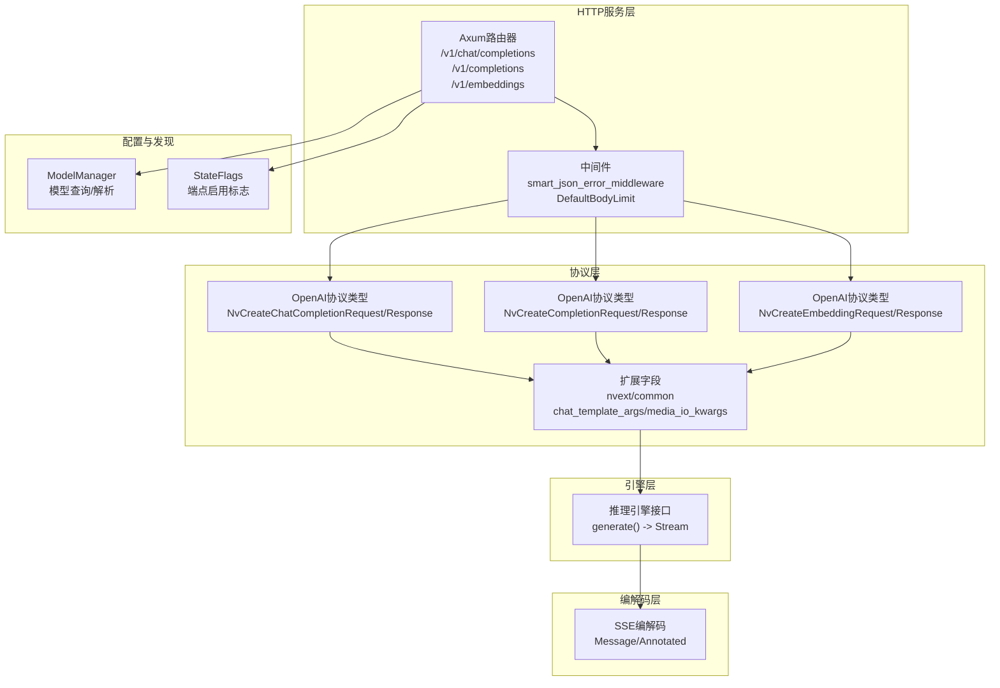
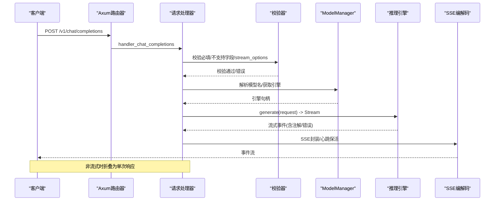
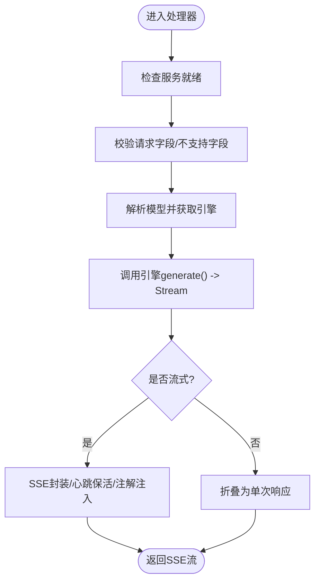
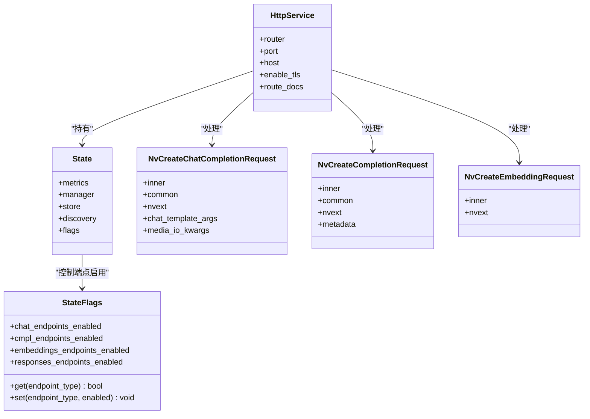

# OpenAI兼容API

<cite>
**本文档引用的文件**
- [openai.rs](file://lib/llm/src/http/service/openai.rs)
- [service_v2.rs](file://lib/llm/src/http/service/service_v2.rs)
- [endpoint_type.rs](file://lib/llm/src/endpoint_type.rs)
- [chat_completions.rs](file://lib/llm/src/protocols/openai/chat_completions.rs)
- [completions.rs](file://lib/llm/src/protocols/openai/completions.rs)
- [embeddings.rs](file://lib/llm/src/protocols/openai/embeddings.rs)
- [codec.rs](file://lib/llm/src/protocols/codec.rs)
- [openapi.json](file://docs/frontends/openapi.json)
- [README.md](file://README.md)
- [client.py](file://tests/utils/client.py)
</cite>

## 目录
1. [简介](#简介)
2. [项目结构](#项目结构)
3. [核心组件](#核心组件)
4. [架构总览](#架构总览)
5. [详细组件分析](#详细组件分析)
6. [依赖关系分析](#依赖关系分析)
7. [性能考虑](#性能考虑)
8. [故障排查指南](#故障排查指南)
9. [结论](#结论)
10. [附录：API参考与示例](#附录api参考与示例)

## 简介
本文件系统性梳理Dynamo的OpenAI兼容HTTP API实现，覆盖/v1/chat/completions、/v1/completions、/v1/embeddings等端点的路由注册、请求参数校验、响应结构、流式SSE处理、模型名称解析、提示模板与媒体参数处理、令牌化与分词器接入、错误处理与HTTP状态码映射、以及性能优化与最佳实践。同时提供基于仓库内OpenAPI规范与示例的完整API参考与客户端调用示例。

## 项目结构
Dynamo的OpenAI兼容API主要由以下层次构成：
- HTTP服务层：Axum路由器注册与中间件（含智能JSON错误转换、SSE保活、请求体大小限制）
- 协议层：OpenAI兼容的数据结构（聊天补全、补全、嵌入、响应），扩展字段（nvext、common、chat_template_args、media_io_kwargs）
- 引擎层：后端推理引擎（vLLM、TensorRT-LLM、SGLang）通过统一接口生成流式结果
- 协议编解码层：SSE事件消息的编码/解码与注解（annotations）传递
- 配置与发现：模型管理器、KV存储发现、运行时标志位控制端点启用状态

图表来源
- [openai.rs](file://lib/llm/src/http/service/openai.rs#L1470-L1517)
- [service_v2.rs](file://lib/llm/src/http/service/service_v2.rs#L497-L522)
- [endpoint_type.rs](file://lib/llm/src/endpoint_type.rs#L7-L37)

章节来源
- [openai.rs](file://lib/llm/src/http/service/openai.rs#L1470-L1517)
- [service_v2.rs](file://lib/llm/src/http/service/service_v2.rs#L497-L522)
- [endpoint_type.rs](file://lib/llm/src/endpoint_type.rs#L7-L37)

## 核心组件
- 路由与端点
  - /v1/chat/completions：聊天补全，支持流式与非流式
  - /v1/completions：传统补全，支持批量提示与流式
  - /v1/embeddings：嵌入向量生成
  - /v1/models：列出已注册模型
- 请求/响应协议
  - NvCreateChatCompletionRequest/Response：扩展OpenAI聊天补全
  - NvCreateCompletionRequest/Response：扩展OpenAI补全
  - NvCreateEmbeddingRequest/Response：扩展OpenAI嵌入
- 扩展字段
  - nvext：NVIDIA扩展（路由重写、注解、guided decoding等）
  - common：通用扩展（ignore_eos、min_tokens等）
  - chat_template_args：聊天模板渲染上下文参数
  - media_io_kwargs：运行时媒体解码参数（视频帧数等）
- 流式处理
  - SSE事件流，支持心跳保活
  - 注解（annotations）在流首部注入请求ID等元信息
- 错误处理
  - 智能JSON错误中间件：将422转换为400
  - 统一错误响应结构（message/type/code）

章节来源
- [openai.rs](file://lib/llm/src/http/service/openai.rs#L1470-L1517)
- [openai.rs](file://lib/llm/src/http/service/openai.rs#L220-L245)
- [openai.rs](file://lib/llm/src/http/service/openai.rs#L79-L206)
- [chat_completions.rs](file://lib/llm/src/protocols/openai/chat_completions.rs#L35-L64)
- [completions.rs](file://lib/llm/src/protocols/openai/completions.rs#L27-L45)
- [embeddings.rs](file://lib/llm/src/protocols/openai/embeddings.rs#L15-L22)

## 架构总览
下图展示了从HTTP请求到引擎生成、再到SSE流返回的关键路径，以及错误处理与指标采集流程。

图表来源
- [openai.rs](file://lib/llm/src/http/service/openai.rs#L856-L1033)
- [openai.rs](file://lib/llm/src/http/service/openai.rs#L1486-L1501)
- [codec.rs](file://lib/llm/src/protocols/codec.rs#L81-L120)

章节来源
- [openai.rs](file://lib/llm/src/http/service/openai.rs#L856-L1033)
- [openai.rs](file://lib/llm/src/http/service/openai.rs#L1486-L1501)
- [codec.rs](file://lib/llm/src/protocols/codec.rs#L81-L120)

## 详细组件分析

### 路由与端点注册
- /v1/chat/completions：注册POST路由，绑定handler_chat_completions；支持可选请求模板与SSE保活
- /v1/completions：注册POST路由，绑定handler_completions；支持批量提示与流式
- /v1/embeddings：注册POST路由，绑定embeddings；默认非流式
- /v1/models：GET列出模型清单

章节来源
- [openai.rs](file://lib/llm/src/http/service/openai.rs#L1470-L1517)
- [openai.rs](file://lib/llm/src/http/service/openai.rs#L1520-L1533)
- [service_v2.rs](file://lib/llm/src/http/service/service_v2.rs#L497-L522)

### 请求参数与数据模型
- 聊天补全（NvCreateChatCompletionRequest）
  - 基于OpenAI CreateChatCompletionRequest，扩展nvext、common、chat_template_args、media_io_kwargs
  - 支持工具调用（tools/tool_choice）、响应格式（response_format）、采样参数（temperature/top_p/frequency_penalty/presence_penalty/seed/n）
  - 不支持字段：function_call/functions（迁移至tool_choice/tools）
- 补全（NvCreateCompletionRequest）
  - 基于OpenAI CreateCompletionRequest，扩展nvext、common、metadata
  - 支持批量提示（StringArray/ArrayOfIntegerArray）与n重复生成
  - 支持guided decoding（json/regex/grammar/choice）
- 嵌入（NvCreateEmbeddingRequest）
  - 基于OpenAI CreateEmbeddingRequest，扩展nvext
  - 默认非流式，返回向量列表

章节来源
- [chat_completions.rs](file://lib/llm/src/protocols/openai/chat_completions.rs#L35-L64)
- [chat_completions.rs](file://lib/llm/src/protocols/openai/chat_completions.rs#L123-L164)
- [completions.rs](file://lib/llm/src/protocols/openai/completions.rs#L27-L45)
- [completions.rs](file://lib/llm/src/protocols/openai/completions.rs#L147-L179)
- [embeddings.rs](file://lib/llm/src/protocols/openai/embeddings.rs#L15-L22)

### 流式响应与SSE处理
- SSE事件流
  - 流式时以SSE事件发送，支持Keep-Alive保活
  - 注解（annotations）作为事件前缀注入，如请求ID
  - 后端错误通过事件“event: error”传递，前端需正确处理
- 非流式折叠
  - 将流式事件聚合为一次JSON响应
- 连接监控
  - 客户端断开检测，触发引擎取消

图表来源
- [openai.rs](file://lib/llm/src/http/service/openai.rs#L864-L1033)
- [openai.rs](file://lib/llm/src/http/service/openai.rs#L325-L475)
- [openai.rs](file://lib/llm/src/http/service/openai.rs#L639-L708)

章节来源
- [openai.rs](file://lib/llm/src/http/service/openai.rs#L864-L1033)
- [openai.rs](file://lib/llm/src/http/service/openai.rs#L325-L475)
- [openai.rs](file://lib/llm/src/http/service/openai.rs#L639-L708)

### 模型名称解析与请求模板
- 模型解析
  - 通过ModelManager根据请求中的model字段解析具体后端引擎
  - 未找到模型返回404错误
- 请求模板
  - 可选RequestTemplate用于填充默认参数（如model、temperature、max_completion_tokens）
  - 当请求中对应字段为空或默认值时生效
- 注解与追踪
  - 通过nvext.annotations传递注解，如请求ID
  - 分布式追踪上下文优先级高于请求头

章节来源
- [openai.rs](file://lib/llm/src/http/service/openai.rs#L890-L901)
- [openai.rs](file://lib/llm/src/http/service/openai.rs#L1177-L1216)
- [openai.rs](file://lib/llm/src/http/service/openai.rs#L247-L278)

### 提示模板处理与媒体参数
- 聊天模板参数
  - chat_template_args：传入模板渲染上下文键值对
  - 兼容别名“chat_template_kwargs”
- 媒体输入参数
  - media_io_kwargs：覆盖媒体解码默认行为（如视频帧数）
- 原始提示
  - nvext.use_raw_prompt为true时，直接使用原始提示字符串而非模板渲染

章节来源
- [chat_completions.rs](file://lib/llm/src/protocols/openai/chat_completions.rs#L46-L59)
- [completions.rs](file://lib/llm/src/protocols/openai/completions.rs#L120-L128)

### 令牌化与分词器接入
- 令牌化由后端引擎负责，HTTP层仅透传请求并接收流式事件
- SSE事件携带增量token，前端按事件拼接内容
- 使用注解（如请求ID）便于跨层关联

章节来源
- [openai.rs](file://lib/llm/src/http/service/openai.rs#L417-L437)
- [codec.rs](file://lib/llm/src/protocols/codec.rs#L81-L120)

### 错误处理机制
- JSON校验错误
  - 422统一转换为400，错误消息透传
- 业务错误
  - 模型不存在：404
  - 服务未就绪：503
  - 功能未实现：501（如不支持的字段）
  - 内部错误：500
- SSE错误事件
  - 后端错误通过“event: error”事件传递，包含错误消息与可选状态码

章节来源
- [openai.rs](file://lib/llm/src/http/service/openai.rs#L220-L245)
- [openai.rs](file://lib/llm/src/http/service/openai.rs#L95-L157)
- [openai.rs](file://lib/llm/src/http/service/openai.rs#L820-L854)

## 依赖关系分析
- 组件耦合
  - HTTP层依赖协议层（请求/响应结构）与编解码层（SSE）
  - 处理器依赖ModelManager解析模型与获取引擎
  - 引擎返回流式事件，经SSE编解码后返回客户端
- 端点启用控制
  - StateFlags按EndpointType控制各端点启用状态
- 环境变量与配置
  - 请求体大小限制可通过环境变量配置
  - SSE保活间隔可配置（当前返回None）

图表来源
- [service_v2.rs](file://lib/llm/src/http/service/service_v2.rs#L34-L144)
- [endpoint_type.rs](file://lib/llm/src/endpoint_type.rs#L7-L37)
- [chat_completions.rs](file://lib/llm/src/protocols/openai/chat_completions.rs#L35-L64)
- [completions.rs](file://lib/llm/src/protocols/openai/completions.rs#L27-L45)
- [embeddings.rs](file://lib/llm/src/protocols/openai/embeddings.rs#L15-L22)

章节来源
- [service_v2.rs](file://lib/llm/src/http/service/service_v2.rs#L34-L144)
- [endpoint_type.rs](file://lib/llm/src/endpoint_type.rs#L7-L37)

## 性能考虑
- 请求体大小限制
  - 默认45MB，可通过环境变量调整
- SSE保活
  - 可配置保活间隔，避免代理超时
- 并发与队列
  - HTTP队列计时与在途指标用于观测排队与处理延迟
- 批量提示（补全）
  - 支持多提示批量生成，合并流并重映射choice索引
- 指标采集
  - 每个token观察与统计，便于性能分析

章节来源
- [openai.rs](file://lib/llm/src/http/service/openai.rs#L66-L75)
- [openai.rs](file://lib/llm/src/http/service/openai.rs#L140-L143)
- [openai.rs](file://lib/llm/src/http/service/openai.rs#L477-L637)

## 故障排查指南
- 常见错误与解决
  - 400：请求JSON无效或字段校验失败（422被中间件转换为400）
  - 404：模型不存在
  - 400（校验）：stream_options仅允许在stream=true时使用
  - 400（校验）：messages不能为空
  - 501：使用了不支持的字段（如function_call/functions）
  - 503：服务未就绪
  - 500：内部错误（引擎异常、解析错误）
- SSE错误事件
  - 关注“event: error”的SSE事件，提取错误消息与状态码
- 断线与取消
  - 客户端断开会触发连接监控，取消引擎生成任务

章节来源
- [openai.rs](file://lib/llm/src/http/service/openai.rs#L220-L245)
- [openai.rs](file://lib/llm/src/http/service/openai.rs#L1035-L1137)
- [openai.rs](file://lib/llm/src/http/service/openai.rs#L820-L854)

## 结论
Dynamo的OpenAI兼容API在保持与OpenAI语义一致的同时，提供了丰富的扩展能力（nvext、common、chat_template_args、media_io_kwargs），并通过SSE事件流实现高效稳定的流式交互。其清晰的路由与协议分离、完善的错误处理与指标采集，使得在生产环境中具备良好的可观测性与可维护性。

## 附录：API参考与示例

### 端点一览与请求/响应结构
- /v1/chat/completions
  - 方法：POST
  - 请求体：NvCreateChatCompletionRequest（扩展OpenAI聊天补全）
  - 响应：NvCreateChatCompletionResponse（流式SSE或非流式JSON）
  - 特性：支持工具调用、响应格式、采样参数、不支持字段迁移提示
- /v1/completions
  - 方法：POST
  - 请求体：NvCreateCompletionRequest（扩展OpenAI补全）
  - 响应：NvCreateCompletionResponse（流式SSE或非流式JSON）
  - 特性：支持批量提示、n重复生成、guided decoding
- /v1/embeddings
  - 方法：POST
  - 请求体：NvCreateEmbeddingRequest（扩展OpenAI嵌入）
  - 响应：NvCreateEmbeddingResponse（非流式）
- /v1/models
  - 方法：GET
  - 响应：模型清单对象

章节来源
- [openapi.json](file://docs/frontends/openapi.json#L148-L200)
- [openai.rs](file://lib/llm/src/http/service/openai.rs#L1470-L1517)
- [openai.rs](file://lib/llm/src/http/service/openai.rs#L1520-L1533)

### 参数与默认值
- 采样参数（聊天/补全）
  - temperature、top_p、frequency_penalty、presence_penalty、seed、n、best_of（聊天不支持）
- 工具与响应格式（聊天）
  - tool_choice、tools、response_format（text/json_schema等）
- 扩展字段
  - nvext：路由重写、注解、guided decoding等
  - common：ignore_eos、min_tokens、guided_json/regex/grammar/choice
  - chat_template_args：模板渲染上下文
  - media_io_kwargs：媒体解码参数
- 不支持字段（迁移提示）
  - function_call/functions（迁移至tool_choice/tools）

章节来源
- [chat_completions.rs](file://lib/llm/src/protocols/openai/chat_completions.rs#L123-L164)
- [completions.rs](file://lib/llm/src/protocols/openai/completions.rs#L147-L200)
- [openai.rs](file://lib/llm/src/http/service/openai.rs#L1035-L1137)

### 错误响应格式
- 字段：message（错误描述）、type（HTTP原因短语）、code（HTTP状态码）
- 示例场景：400（校验失败）、404（模型不存在）、501（功能未实现）、500（内部错误）

章节来源
- [openai.rs](file://lib/llm/src/http/service/openai.rs#L79-L206)

### 客户端集成示例
- curl示例（聊天补全）
  - 参考：[README.md](file://README.md#L159-L165)
- Python requests示例
  - 参考：[client.py](file://tests/utils/client.py#L97-L117)
- OpenAPI规范
  - 参考：[openapi.json](file://docs/frontends/openapi.json#L148-L200)

章节来源
- [README.md](file://README.md#L159-L165)
- [client.py](file://tests/utils/client.py#L97-L117)
- [openapi.json](file://docs/frontends/openapi.json#L148-L200)