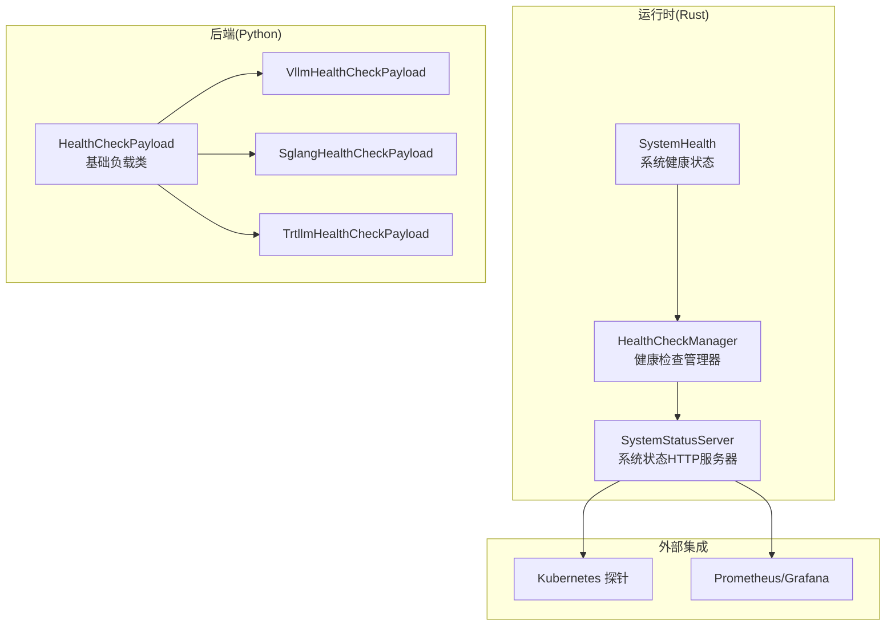
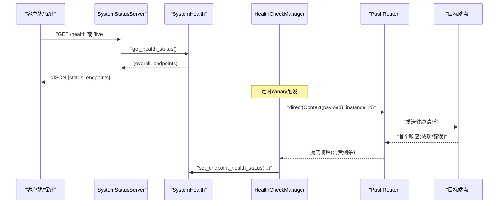
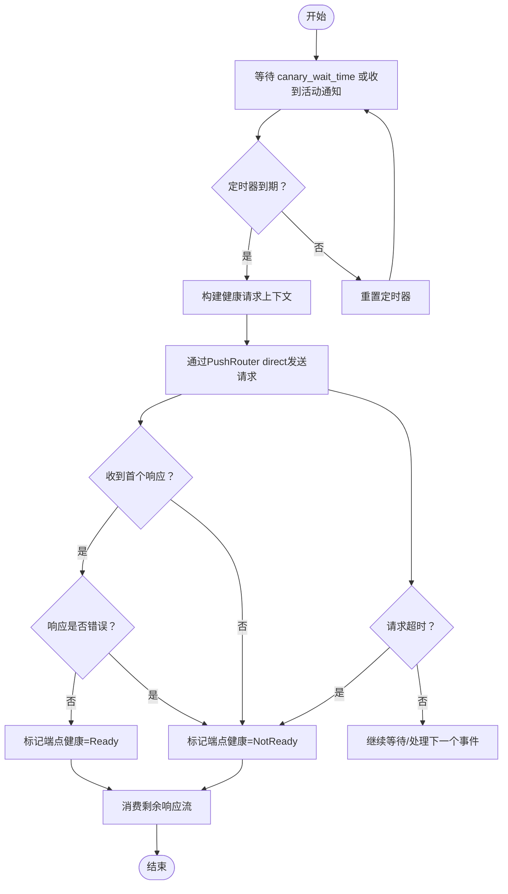
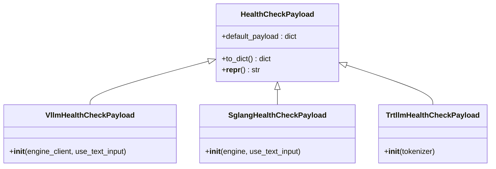
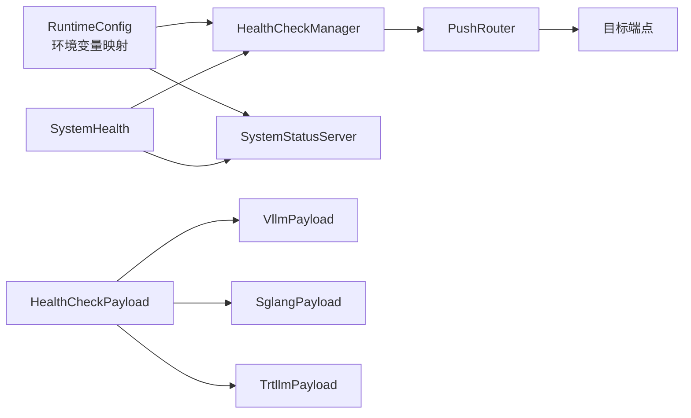

# 健康检查

<cite>
**本文引用的文件**
- [system_health.rs](file://lib/runtime/src/system_health.rs)
- [health_check.rs](file://lib/runtime/src/health_check.rs)
- [system_status_server.rs](file://lib/runtime/src/system_status_server.rs)
- [config.rs](file://lib/runtime/src/config.rs)
- [health_check.py](file://lib/bindings/python/src/dynamo/health_check.py)
- [sglang/health_check.py](file://components/src/dynamo/sglang/health_check.py)
- [trtllm/health_check.py](file://components/src/dynamo/trtllm/health_check.py)
- [vllm/health_check.py](file://components/src/dynamo/vllm/health_check.py)
- [test_vllm_health_check.py](file://tests/fault_tolerance/test_vllm_health_check.py)
- [create_deployment.md](file://docs/kubernetes/deployment/create_deployment.md)
- [dynamomodel-guide.md](file://docs/kubernetes/deployment/dynamomodel-guide.md)
</cite>

## 目录
1. [简介](#简介)
2. [项目结构](#项目结构)
3. [核心组件](#核心组件)
4. [架构总览](#架构总览)
5. [详细组件分析](#详细组件分析)
6. [依赖关系分析](#依赖关系分析)
7. [性能考量](#性能考量)
8. [故障排查指南](#故障排查指南)
9. [结论](#结论)
10. [附录](#附录)

## 简介
本文件系统化阐述Dynamo健康检查体系的设计与实现，覆盖以下关键主题：
- /healthz与/livyz端点的实现原理与返回语义
- 服务可用性检测、依赖组件状态监控与健康状态聚合
- 健康检查的触发条件（空闲探测）、检查间隔与超时策略
- 失败处理与降级策略
- 与Kubernetes就绪探针（readinessProbe）与存活探针（livenessProbe）的集成方式
- 健康检查配置项、自定义检查负载与故障诊断方法
- 实际监控集成示例与告警建议
- 分布式环境下健康检查的作用与重要性

## 项目结构
Dynamo健康检查由运行时（Rust）与后端绑定（Python）协同完成：
- 运行时层：负责系统健康状态管理、健康检查任务调度、HTTP端点暴露
- 后端层：为不同推理引擎（vLLM/SGLang/TRT-LLM）提供默认健康检查负载，并支持通过环境变量覆盖
- 测试与文档：包含端到端测试与Kubernetes部署指导

图示来源
- [system_health.rs](file://lib/runtime/src/system_health.rs#L40-L96)
- [health_check.rs](file://lib/runtime/src/health_check.rs#L46-L64)
- [system_status_server.rs](file://lib/runtime/src/system_status_server.rs#L159-L194)
- [health_check.py](file://lib/bindings/python/src/dynamo/health_check.py#L63-L105)
- [vllm/health_check.py](file://components/src/dynamo/vllm/health_check.py#L82-L102)
- [sglang/health_check.py](file://components/src/dynamo/sglang/health_check.py#L50-L86)
- [trtllm/health_check.py](file://components/src/dynamo/trtllm/health_check.py#L51-L92)

章节来源
- [system_health.rs](file://lib/runtime/src/system_health.rs#L40-L96)
- [health_check.rs](file://lib/runtime/src/health_check.rs#L46-L64)
- [system_status_server.rs](file://lib/runtime/src/system_status_server.rs#L159-L194)
- [health_check.py](file://lib/bindings/python/src/dynamo/health_check.py#L63-L105)

## 核心组件
- SystemHealth：维护系统整体健康状态与各端点健康映射，支持注册健康检查目标、获取健康状态、更新Uptime指标等
- HealthCheckManager：按端点启动独立健康检查任务，基于“空闲探测”（canary）周期性发送健康请求，处理响应与超时
- SystemStatusServer：注册/health与/livyz端点，根据SystemHealth聚合结果返回健康状态
- HealthCheckPayload（Python）：提供默认健康检查负载模板，支持从环境变量覆盖payload
- 后端特定负载：vLLM/SGLang/TRT-LLM分别提供针对自身接口的默认payload与参数

章节来源
- [system_health.rs](file://lib/runtime/src/system_health.rs#L98-L139)
- [health_check.rs](file://lib/runtime/src/health_check.rs#L100-L123)
- [system_status_server.rs](file://lib/runtime/src/system_status_server.rs#L260-L286)
- [health_check.py](file://lib/bindings/python/src/dynamo/health_check.py#L63-L105)
- [vllm/health_check.py](file://components/src/dynamo/vllm/health_check.py#L82-L102)
- [sglang/health_check.py](file://components/src/dynamo/sglang/health_check.py#L50-L86)
- [trtllm/health_check.py](file://components/src/dynamo/trtllm/health_check.py#L51-L92)

## 架构总览
Dynamo健康检查采用“主动探测 + 聚合上报”的模式：
- 系统启动时，SystemHealth初始化健康状态与端点映射
- HealthCheckManager为每个已注册端点创建独立任务，使用可调的“空闲等待时间”作为canary周期
- 每个canary周期内，HealthCheckManager通过PushRouter向目标实例发送健康请求，等待首个响应并据此更新端点健康状态
- SystemStatusServer在HTTP层暴露/health与/livyz端点，聚合SystemHealth状态并返回

图示来源
- [system_status_server.rs](file://lib/runtime/src/system_status_server.rs#L260-L286)
- [system_health.rs](file://lib/runtime/src/system_health.rs#L98-L139)
- [health_check.rs](file://lib/runtime/src/health_check.rs#L240-L380)

## 详细组件分析

### SystemHealth：健康状态聚合与端点管理
- 端点健康映射：以端点subject为键，记录Ready/NotReady状态
- 注册机制：register_health_check_target为端点建立实例与payload映射，创建端点专用通知器，初始状态置为NotReady
- 聚合规则：若配置了use_endpoint_health_status，则系统健康为这些端点的AND；否则若存在健康检查目标则用目标端点AND，否则回退到系统初始健康状态
- 指标：维护uptime Gauge并在/metrics中输出

章节来源
- [system_health.rs](file://lib/runtime/src/system_health.rs#L60-L96)
- [system_health.rs](file://lib/runtime/src/system_health.rs#L141-L194)
- [system_health.rs](file://lib/runtime/src/system_health.rs#L98-L139)
- [system_health.rs](file://lib/runtime/src/system_health.rs#L244-L267)

### HealthCheckManager：canary驱动的主动健康检查
- 配置：canary_wait_time（空闲等待时间）、request_timeout（单次请求超时）
- 任务模型：为每个端点spawn独立任务；同时spawn通道监听任务，动态接收新端点注册
- 触发条件：空闲等待时间到期或收到该端点活动通知（重置定时器）
- 执行流程：构造Context(payload)，通过PushRouter direct到指定实例，等待首个响应并消费剩余流，依据错误与否更新端点健康状态；超时则标记NotReady

图示来源
- [health_check.rs](file://lib/runtime/src/health_check.rs#L125-L187)
- [health_check.rs](file://lib/runtime/src/health_check.rs#L240-L380)

章节来源
- [health_check.rs](file://lib/runtime/src/health_check.rs#L21-L38)
- [health_check.rs](file://lib/runtime/src/health_check.rs#L100-L123)
- [health_check.rs](file://lib/runtime/src/health_check.rs#L189-L238)
- [health_check.rs](file://lib/runtime/src/health_check.rs#L240-L380)

### SystemStatusServer：/health 与 /live 端点
- 路由注册：/health 与 /live 绑定同一处理器
- 返回逻辑：根据SystemHealth.get_health_status()返回overall健康字符串与各端点状态；健康时返回200，否则503
- 附加信息：包含uptime与端点映射，便于监控面板展示

章节来源
- [system_status_server.rs](file://lib/runtime/src/system_status_server.rs#L159-L194)
- [system_status_server.rs](file://lib/runtime/src/system_status_server.rs#L260-L286)

### Python健康检查负载：可覆盖的payload模板
- HealthCheckPayload：子类需设置default_payload，to_dict优先使用环境变量覆盖，否则使用默认payload
- 环境变量：DYN_HEALTH_CHECK_PAYLOAD 支持JSON字符串或文件路径（以@开头），解析失败会记录警告并忽略
- 后端特定payload：
  - vLLM：支持文本prompt或token_ids，采样与停止条件默认值
  - SGLang：根据模型BOS token生成最小payload，支持文本或token输入
  - TRT-LLM：从tokenizer提取BOS token，构造stop_conditions与sampling_options

图示来源
- [health_check.py](file://lib/bindings/python/src/dynamo/health_check.py#L63-L105)
- [vllm/health_check.py](file://components/src/dynamo/vllm/health_check.py#L82-L102)
- [sglang/health_check.py](file://components/src/dynamo/sglang/health_check.py#L50-L86)
- [trtllm/health_check.py](file://components/src/dynamo/trtllm/health_check.py#L51-L92)

章节来源
- [health_check.py](file://lib/bindings/python/src/dynamo/health_check.py#L21-L61)
- [health_check.py](file://lib/bindings/python/src/dynamo/health_check.py#L88-L98)
- [vllm/health_check.py](file://components/src/dynamo/vllm/health_check.py#L52-L80)
- [sglang/health_check.py](file://components/src/dynamo/sglang/health_check.py#L17-L48)
- [trtllm/health_check.py](file://components/src/dynamo/trtllm/health_check.py#L17-L48)

### 配置与环境变量
- 运行时配置（RuntimeConfig）：
  - health_check_enabled：启用主动健康检查
  - canary_wait_time_secs：空闲等待时间（秒）
  - health_check_request_timeout_secs：单次请求超时（秒）
  - system_health_path/system_live_path：HTTP端点路径
  - system_port>=0启用系统状态服务器
- 环境变量映射：DYN_HEALTH_CHECK_*、DYN_CANARY_*、DYN_SYSTEM_*等

章节来源
- [config.rs](file://lib/runtime/src/config.rs#L163-L180)
- [config.rs](file://lib/runtime/src/config.rs#L273-L304)
- [config.rs](file://lib/runtime/src/config.rs#L235-L304)

### Kubernetes集成：就绪与存活探针
- /health：用于就绪探针（readinessProbe），当系统健康为ready时返回200，未就绪时503
- /live：用于存活探针（livenessProbe），行为与/health一致
- 文档示例：Dynamo Operator控制器对/healthz与/readyz的探针配置；示例部署中使用/health与/livetz作为探针路径
- 建议：将探针路径与系统配置保持一致，避免路径不匹配导致误判

章节来源
- [system_status_server.rs](file://lib/runtime/src/system_status_server.rs#L159-L194)
- [create_deployment.md](file://docs/kubernetes/deployment/create_deployment.md#L125-L200)
- [dynamomodel-guide.md](file://docs/kubernetes/deployment/dynamomodel-guide.md#L1-L626)

## 依赖关系分析
- SystemHealth依赖SystemStatusServer提供的端点路径与状态聚合
- HealthCheckManager依赖SystemHealth的端点映射与通知器，以及DistributedRuntime进行路由与实例发现
- SystemStatusServer依赖SystemHealth的uptime指标与健康状态
- 后端payload依赖对应引擎的tokenizer/token_ids以生成最小有效请求

图示来源
- [config.rs](file://lib/runtime/src/config.rs#L273-L304)
- [health_check.rs](file://lib/runtime/src/health_check.rs#L46-L64)
- [system_health.rs](file://lib/runtime/src/system_health.rs#L40-L96)
- [system_status_server.rs](file://lib/runtime/src/system_status_server.rs#L159-L194)
- [health_check.py](file://lib/bindings/python/src/dynamo/health_check.py#L63-L105)

## 性能考量
- canary周期与超时：过短周期会增加系统负载，过长周期会延迟故障感知；建议结合实例数量与网络RTT调整
- 单次请求超时：应覆盖典型冷启动与模型加载场景，避免误判
- 负载大小：默认payload仅生成1个token，尽量保持最小化以降低开销
- 并发任务：每端点独立任务，端点数较多时注意线程池与资源限制

## 故障排查指南
- 端点未注册：HealthCheckManager启动时会打印注册数量；若为0，检查端点是否正确注册到SystemHealth
- 路由发现超时：首次健康检查会等待watch流完成实例发现，超时可能表示etcd或服务发现异常
- 超时与错误：单次请求超时或响应错误均会导致端点健康变为NotReady；可通过日志定位具体错误
- 环境变量覆盖：确认DYN_HEALTH_CHECK_PAYLOAD格式正确且可被解析
- 端到端测试：参考vLLM健康检查测试，验证/health端点与进程生命周期

章节来源
- [health_check.rs](file://lib/runtime/src/health_check.rs#L100-L123)
- [health_check.rs](file://lib/runtime/src/health_check.rs#L270-L301)
- [health_check.rs](file://lib/runtime/src/health_check.rs#L368-L376)
- [health_check.py](file://lib/bindings/python/src/dynamo/health_check.py#L21-L61)
- [test_vllm_health_check.py](file://tests/fault_tolerance/test_vllm_health_check.py#L76-L92)

## 结论
Dynamo健康检查体系通过“空闲探测 + 主动请求 + 聚合上报”的设计，在保证低开销的同时提供了可靠的健康状态反馈。结合Kubernetes探针与监控系统，可实现自动扩缩容、滚动升级与故障隔离。建议在生产环境中合理配置canary周期与超时，并通过环境变量灵活定制健康检查payload。

## 附录

### 健康检查配置清单
- 启用主动健康检查：DYN_HEALTH_CHECK_ENABLED=true
- 空闲等待时间：DYN_CANARY_WAIT_TIME=秒
- 请求超时：DYN_HEALTH_CHECK_REQUEST_TIMEOUT=秒
- HTTP端点路径：DYN_SYSTEM_HEALTH_PATH=/health，DYN_SYSTEM_LIVE_PATH=/live
- 系统状态服务器端口：DYN_SYSTEM_PORT>=0

章节来源
- [config.rs](file://lib/runtime/src/config.rs#L163-L180)
- [config.rs](file://lib/runtime/src/config.rs#L273-L304)
- [config.rs](file://lib/runtime/src/config.rs#L235-L304)

### 自定义检查逻辑
- 使用环境变量覆盖payload：DYN_HEALTH_CHECK_PAYLOAD=JSON或@/path/to/payload.json
- 后端特定payload：根据引擎特性选择文本prompt或token_ids，并设置合理的采样与停止条件

章节来源
- [health_check.py](file://lib/bindings/python/src/dynamo/health_check.py#L21-L61)
- [vllm/health_check.py](file://components/src/dynamo/vllm/health_check.py#L52-L80)
- [sglang/health_check.py](file://components/src/dynamo/sglang/health_check.py#L17-L48)
- [trtllm/health_check.py](file://components/src/dynamo/trtllm/health_check.py#L17-L48)

### 监控与告警建议
- 指标：/metrics中dynamo_component_uptime_seconds可用于计算服务可用性
- 告警：当/health返回非200持续超过阈值（如3分钟）时触发；对特定端点NotReady比例设置阈值
- 可视化：Grafana仪表盘展示系统健康状态与端点健康分布

章节来源
- [system_health.rs](file://lib/runtime/src/system_health.rs#L244-L267)
- [system_status_server.rs](file://lib/runtime/src/system_status_server.rs#L288-L310)