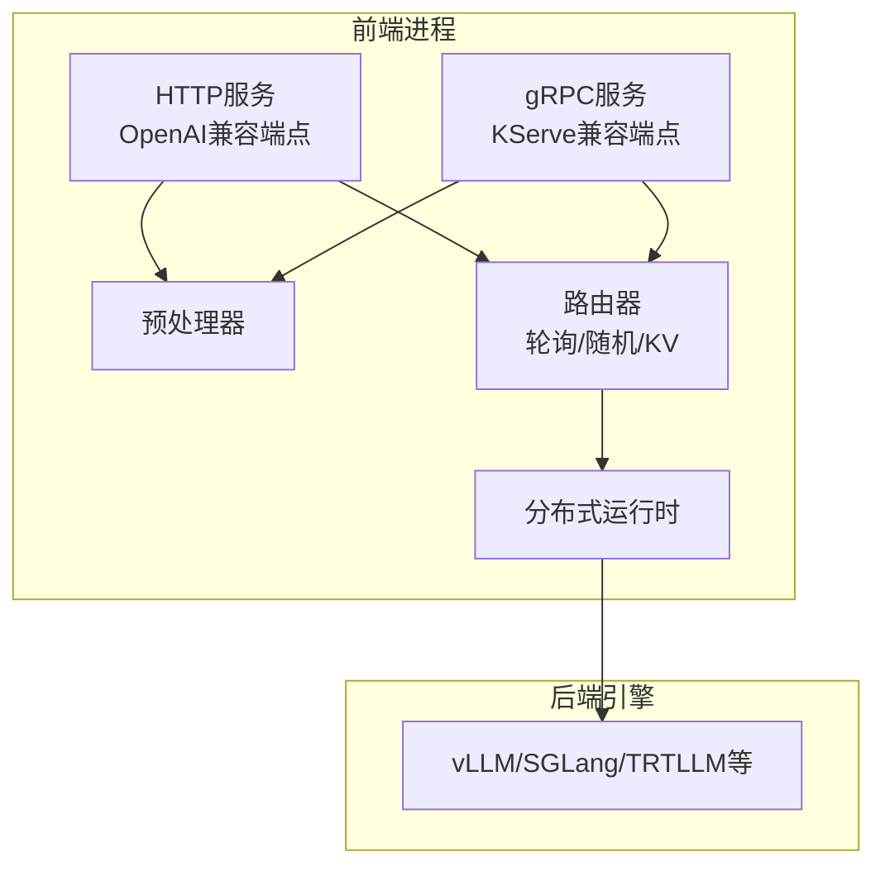
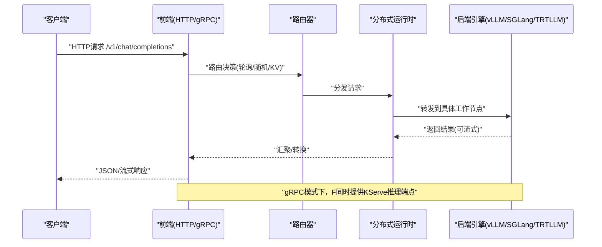
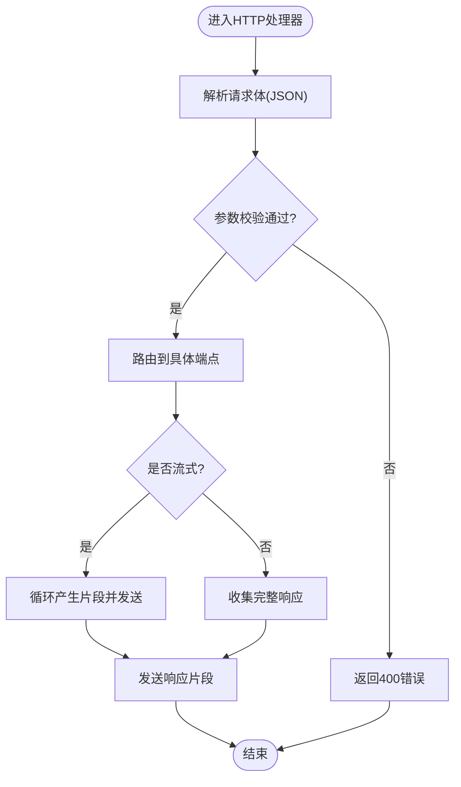
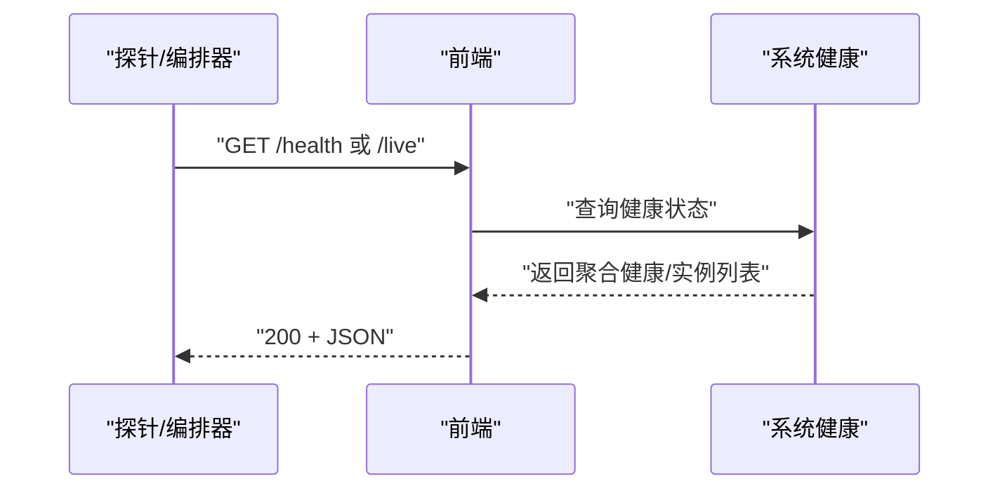
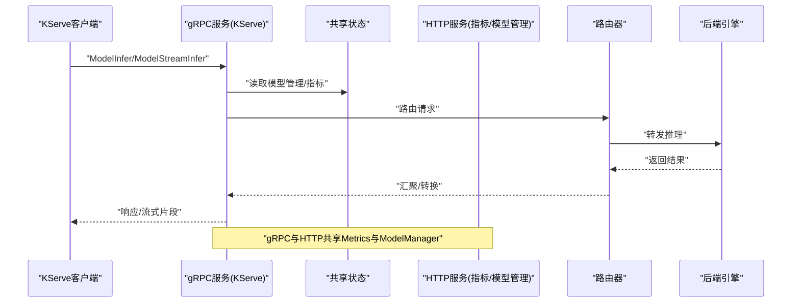
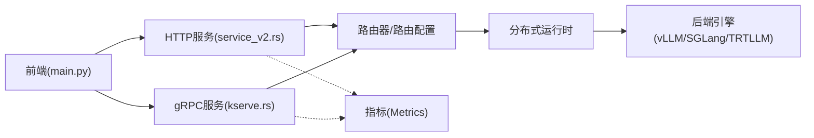

# 前端和API

<cite>
**本文引用的文件**
- [components/src/dynamo/frontend/main.py](file://components/src/dynamo/frontend/main.py)
- [components/src/dynamo/frontend/README.md](file://components/src/dynamo/frontend/README.md)
- [docs/frontends/openapi.json](file://docs/frontends/openapi.json)
- [docs/frontends/kserve.md](file://docs/frontends/kserve.md)
- [lib/llm/src/http/service/service_v2.rs](file://lib/llm/src/http/service/service_v2.rs)
- [lib/llm/src/http/service/openai.rs](file://lib/llm/src/http/service/openai.rs)
- [lib/llm/src/grpc/service/kserve.rs](file://lib/llm/src/grpc/service/kserve.rs)
- [lib/runtime/src/system_health.rs](file://lib/runtime/src/system_health.rs)
- [docs/observability/health-checks.md](file://docs/observability/health-checks.md)
- [fern/pages/observability/health-checks.md](file://fern/pages/observability/health-checks.md)
- [lib/llm/src/block_manager/metrics_kvbm.rs](file://lib/llm/src/block_manager/metrics_kvbm.rs)
- [deploy/operator/config/rbac/kustomization.yaml](file://deploy/operator/config/rbac/kustomization.yaml)
- [recipes/llama-3-70b/vllm/agg/gaie/k8s-manifests/rbac/cluster-role.yaml](file://recipes/llama-3-70b/vllm/agg/gaie/k8s-manifests/rbac/cluster-role.yaml)
</cite>

## 目录
1. [简介](#简介)
2. [项目结构](#项目结构)
3. [核心组件](#核心组件)
4. [架构总览](#架构总览)
5. [详细组件分析](#详细组件分析)
6. [依赖关系分析](#依赖关系分析)
7. [性能考量](#性能考量)
8. [故障排查指南](#故障排查指南)
9. [结论](#结论)
10. [附录：API参考与最佳实践](#附录api参考与最佳实践)

## 简介
本文件面向Dynamo前端服务与API接口，系统化阐述以下内容：
- OpenAI兼容HTTP API的设计理念与实现要点（端点、请求/响应格式、错误处理）
- 健康检查、存活探针、指标收集等运维端点
- 引擎控制与路由策略（含KV路由器）
- KServe gRPC接口支持与集成方式
- 完整API参考（端点、参数、响应格式）
- 客户端集成示例与最佳实践（流式响应、批量请求、并发控制）
- 安全与访问控制建议

## 项目结构
Dynamo前端以“单进程多能力”形态运行：内置OpenAI兼容HTTP服务器、预处理器、路由器，并通过分布式运行时连接后端引擎/工作节点。前端亦可作为KServe gRPC服务对外提供推理接口。

图表来源
- [components/src/dynamo/frontend/main.py](file://components/src/dynamo/frontend/main.py#L329-L469)
- [lib/llm/src/http/service/service_v2.rs](file://lib/llm/src/http/service/service_v2.rs#L497-L522)
- [lib/llm/src/grpc/service/kserve.rs](file://lib/llm/src/grpc/service/kserve.rs#L103-L174)

章节来源
- [components/src/dynamo/frontend/README.md](file://components/src/dynamo/frontend/README.md#L1-L10)
- [components/src/dynamo/frontend/main.py](file://components/src/dynamo/frontend/main.py#L1-L120)

## 核心组件
- 前端入口与配置解析：负责启动HTTP或gRPC服务、加载路由与KV缓存配置、选择模型发现与注册方式。
- HTTP服务与OpenAI兼容端点：提供聊天补全、文本补全、嵌入、响应生成、模型列表、健康/存活/指标等端点。
- gRPC服务与KServe兼容端点：提供ModelInfer/ModelStreamInfer/ModelMetadata/ModelConfig等端点，统一共享指标与模型管理。
- 路由器与KV缓存：支持轮询、随机、基于KV缓存复用的智能路由；可启用事件同步、快照阈值、主动块跟踪等高级特性。
- 健康检查与系统状态：提供/health与/live端点，支持按端点目标注册与聚合健康状态。
- 指标与可观测性：统一Prometheus指标前缀、KVBM相关指标、gRPC与HTTP共享Metrics对象。

章节来源
- [components/src/dynamo/frontend/main.py](file://components/src/dynamo/frontend/main.py#L88-L327)
- [lib/llm/src/http/service/service_v2.rs](file://lib/llm/src/http/service/service_v2.rs#L497-L522)
- [lib/llm/src/grpc/service/kserve.rs](file://lib/llm/src/grpc/service/kserve.rs#L103-L174)
- [lib/runtime/src/system_health.rs](file://lib/runtime/src/system_health.rs#L36-L221)

## 架构总览
下图展示前端在不同模式下的关键交互：HTTP模式与gRPC模式共享同一套模型管理与指标对象，但仅gRPC模式启用KServe推理端点。

图表来源
- [lib/llm/src/http/service/service_v2.rs](file://lib/llm/src/http/service/service_v2.rs#L497-L522)
- [lib/llm/src/grpc/service/kserve.rs](file://lib/llm/src/grpc/service/kserve.rs#L161-L173)

## 详细组件分析

### OpenAI兼容HTTP API
- 设计理念
  - 遵循OpenAI风格的请求/响应语义，便于现有生态迁移。
  - 支持流式与非流式两种模式，满足低延迟与批量场景。
  - 统一错误映射：将内部错误转换为标准HTTP状态码与错误体。
- 关键端点
  - /v1/chat/completions：聊天补全，支持消息数组、函数调用、工具调用、音频输出等扩展字段。
  - /v1/completions：文本补全，支持prompt与温度、最大token等参数。
  - /v1/embeddings：嵌入向量生成。
  - /v1/responses：通用响应生成。
  - /v1/models：列出当前可用模型。
  - /health：健康检查（就绪探针）。
  - /live：存活检查（存活探针）。
  - /metrics：Prometheus指标导出。
  - /openapi.json与/docs：OpenAPI规范与交互式文档。
- 请求/响应与参数
  - 所有端点均遵循OpenAI兼容语义，额外参数通过nvext或扩展字段承载。
  - 流式响应采用SSE或分块传输，客户端需正确处理数据帧。
- 错误处理
  - 4xx类错误：参数校验失败、不支持字段、模型未找到等。
  - 503类错误：服务过载或未就绪。
  - 内部错误统一映射为500并记录日志。

图表来源
- [lib/llm/src/http/service/openai.rs](file://lib/llm/src/http/service/openai.rs#L220-L245)

章节来源
- [docs/frontends/openapi.json](file://docs/frontends/openapi.json#L148-L429)
- [lib/llm/src/http/service/openai.rs](file://lib/llm/src/http/service/openai.rs#L94-L206)

### 健康检查与存活探针
- /health：用于就绪探针，返回服务整体健康状态；当存在已注册端点时，会包含实例与端点列表。
- /live：用于存活探针，只要进程在运行即返回“存活”。
- 系统健康状态由运行时维护，支持按端点目标注册与聚合。

图表来源
- [lib/runtime/src/system_health.rs](file://lib/runtime/src/system_health.rs#L60-L139)
- [docs/observability/health-checks.md](file://docs/observability/health-checks.md#L49-L100)
- [fern/pages/observability/health-checks.md](file://fern/pages/observability/health-checks.md#L52-L99)

章节来源
- [lib/runtime/src/system_health.rs](file://lib/runtime/src/system_health.rs#L36-L221)
- [docs/observability/health-checks.md](file://docs/observability/health-checks.md#L49-L100)
- [fern/pages/observability/health-checks.md](file://fern/pages/observability/health-checks.md#L52-L99)

### 指标收集端点与KVBM指标
- /metrics：导出Prometheus指标，包含请求总量、并发数、队列时延等。
- KVBM相关指标：命中率、读写失败次数等，用于评估跨主机/磁盘/对象存储的缓存效果。

章节来源
- [lib/llm/src/block_manager/metrics_kvbm.rs](file://lib/llm/src/block_manager/metrics_kvbm.rs#L119-L157)

### 引擎控制与路由策略
- 路由模式
  - 轮询(round-robin)：均衡分配。
  - 随机(random)：随机选择。
  - KV：基于KV缓存复用的智能路由，支持事件驱动与预测模式、快照阈值、主动块跟踪等。
- 关键参数
  - overlap_score_weight、router_temperature、use_kv_events、router_ttl、router_max_tree_size、router_prune_target_ratio、router_replica_sync、router_snapshot_threshold、router_reset_states、router_track_active_blocks、router_track_output_blocks、router_assume_kv_reuse、enforce_disagg、active_decode_blocks_threshold、active_prefill_tokens_threshold。
- 行为说明
  - 启用事件同步时，多个路由器实例通过事件平面保持状态一致。
  - 快照阈值用于大规模流式场景的内存控制。
  - 主动块跟踪与输出块跟踪提升负载均衡与资源利用率。

章节来源
- [components/src/dynamo/frontend/main.py](file://components/src/dynamo/frontend/main.py#L135-L243)

### KServe gRPC接口支持与集成
- 支持端点
  - ModelInfer：标准推理请求。
  - ModelStreamInfer：双向流式推理（序列式请求/响应）。
  - ModelMetadata：模型元数据。
  - ModelConfig：模型配置（含Triton兼容）。
- 运行模式
  - 通过命令行开关启用gRPC服务，同时共享HTTP服务的模型管理与指标对象，统一监控。
- 数据转换
  - OpenAI补全风格：将KServe输入映射为OpenAI补全请求字段，输出映射回choices与finish_reason。
  - Tensor风格：直接映射到NvCreateTensorRequest/NvCreateTensorResponse，适合已有KServe后端迁移。

图表来源
- [lib/llm/src/grpc/service/kserve.rs](file://lib/llm/src/grpc/service/kserve.rs#L103-L174)
- [docs/frontends/kserve.md](file://docs/frontends/kserve.md#L1-L100)

章节来源
- [docs/frontends/kserve.md](file://docs/frontends/kserve.md#L1-L100)
- [lib/llm/src/grpc/service/kserve.rs](file://lib/llm/src/grpc/service/kserve.rs#L116-L174)

## 依赖关系分析
- 前端进程依赖分布式运行时进行请求分发与事件传播。
- HTTP与gRPC服务共享同一套模型管理与指标对象，降低重复开销。
- 路由器与KV缓存模块通过运行时抽象解耦后端引擎类型。

图表来源
- [components/src/dynamo/frontend/main.py](file://components/src/dynamo/frontend/main.py#L371-L440)
- [lib/llm/src/http/service/service_v2.rs](file://lib/llm/src/http/service/service_v2.rs#L497-L522)
- [lib/llm/src/grpc/service/kserve.rs](file://lib/llm/src/grpc/service/kserve.rs#L180-L198)

章节来源
- [components/src/dynamo/frontend/main.py](file://components/src/dynamo/frontend/main.py#L329-L469)
- [lib/llm/src/http/service/service_v2.rs](file://lib/llm/src/http/service/service_v2.rs#L497-L522)
- [lib/llm/src/grpc/service/kserve.rs](file://lib/llm/src/grpc/service/kserve.rs#L180-L198)

## 性能考量
- 流式响应
  - 使用异步流式传输减少首字节延迟，注意背压与缓冲区大小。
  - 对于高并发流式场景，合理设置快照阈值与主动块跟踪，避免内存膨胀。
- 批量请求
  - 将多个小请求合并为批处理（若后端支持），提升吞吐并降低开销。
- 并发控制
  - 利用路由器的活跃块/令牌阈值检测，动态调整工作节点选择，避免过载。
  - 在gRPC模式下，利用流式接口实现双向通信，提高交互效率。
- 指标观测
  - 通过/health、/live与/metrics结合，建立完善的SLI/SLO与告警体系。

## 故障排查指南
- 健康检查异常
  - 若/health返回unhealthy且无端点，确认后端引擎已通过register_llm完成注册。
  - 若存在端点但状态异常，检查对应实例的健康目标与事件订阅。
- 错误码对照
  - 400：请求参数无效或包含不受支持字段。
  - 404：模型未找到。
  - 503：服务过载或未就绪。
  - 500：内部错误，查看日志定位问题。
- gRPC端点
  - 确认已启用KServe模式并正确注册后端模型类型与输入组合。
  - 对于Tensor风格，确保提供完整模型元数据或Triton兼容配置。

章节来源
- [lib/llm/src/http/service/openai.rs](file://lib/llm/src/http/service/openai.rs#L94-L206)
- [lib/runtime/src/system_health.rs](file://lib/runtime/src/system_health.rs#L116-L139)

## 结论
Dynamo前端以统一的HTTP与gRPC接口，提供OpenAI兼容能力与KServe推理能力，配合灵活的路由与可观测性，满足从本地开发到生产部署的多样化需求。通过合理的流式与并发策略、完善的健康与指标体系，可实现稳定高效的推理服务。

## 附录：API参考与最佳实践

### 端点与参数参考
- /v1/chat/completions
  - 方法：POST
  - 参数：模型名、消息数组、温度、最大token、是否流式、函数/工具调用、音频输出等扩展字段
  - 响应：choices、finish_reason、usage等
- /v1/completions
  - 方法：POST
  - 参数：模型名、prompt、温度、最大token、是否流式
  - 响应：choices、finish_reason
- /v1/embeddings
  - 方法：POST
  - 参数：模型名、输入文本
  - 响应：向量数组
- /v1/responses
  - 方法：POST
  - 参数：模型名、输入
  - 响应：生成内容
- /v1/models
  - 方法：GET
  - 响应：可用模型列表
- /health
  - 方法：GET
  - 响应：健康状态与端点实例列表
- /live
  - 方法：GET
  - 响应：存活状态
- /metrics
  - 方法：GET
  - 响应：Prometheus指标文本
- /openapi.json
  - 方法：GET
  - 响应：OpenAPI规范
- /docs
  - 方法：GET
  - 响应：交互式文档页面

章节来源
- [docs/frontends/openapi.json](file://docs/frontends/openapi.json#L148-L429)

### 客户端集成示例与最佳实践
- 流式响应处理
  - 使用SSE或分块传输接收流式片段，逐段解析并渲染。
  - 注意处理连接中断与重连逻辑。
- 批量请求优化
  - 将多个短请求合并为长上下文或批处理，减少握手成本。
  - 对于KV路由，尽量复用历史上下文以提升命中率。
- 并发控制
  - 设置合理的超时与重试策略，避免雪崩效应。
  - 利用/health与/metrics动态扩缩容与熔断。
- 安全与访问控制
  - 在边缘网关或反向代理层启用认证与速率限制。
  - 对/health与/metrics端点进行鉴权保护，避免敏感信息泄露。
  - 使用TLS加密传输，确保密钥与证书妥善管理。

### 安全与访问控制建议
- RBAC与鉴权
  - 在Kubernetes中通过RBAC保护/指标端点，必要时启用kube-rbac-proxy。
  - 为操作员与工作节点授予最小权限，避免过度授权。
- 网络隔离
  - 将前端与后端引擎置于不同命名空间或网络域，使用NetworkPolicy限制访问。
- 传输安全
  - 启用HTTPS/TLS，配置强密码套件与证书轮换。
- 日志与审计
  - 记录关键操作与异常，结合审计日志追踪责任链。

章节来源
- [deploy/operator/config/rbac/kustomization.yaml](file://deploy/operator/config/rbac/kustomization.yaml#L16-L43)
- [recipes/llama-3-70b/vllm/agg/gaie/k8s-manifests/rbac/cluster-role.yaml](file://recipes/llama-3-70b/vllm/agg/gaie/k8s-manifests/rbac/cluster-role.yaml#L35-L51)