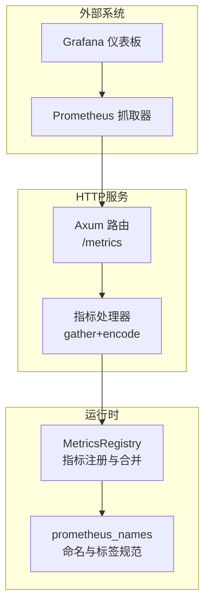
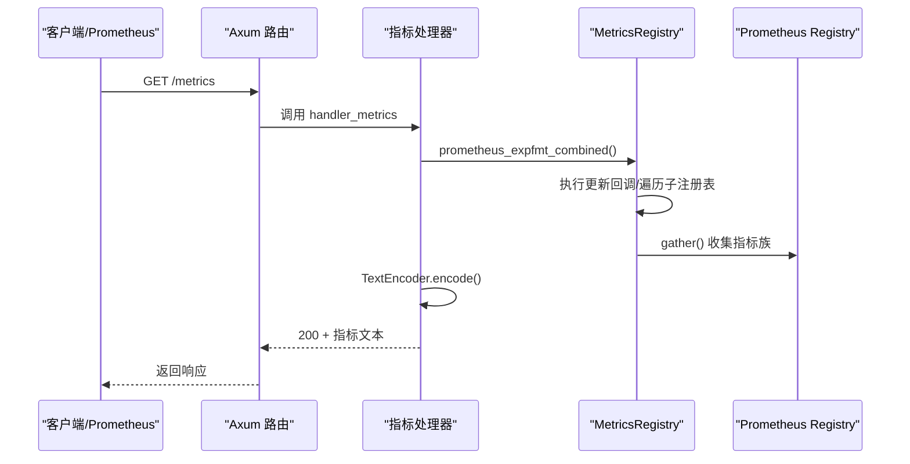
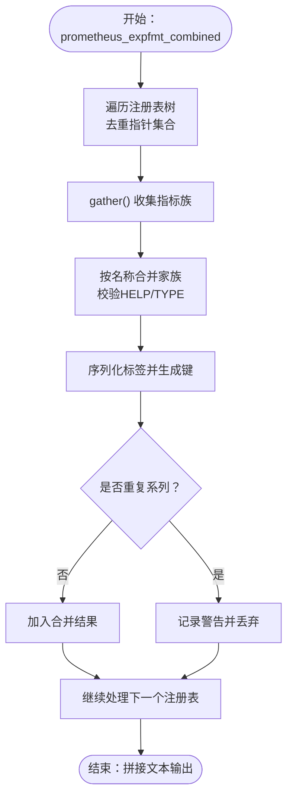

# 指标收集端点

<cite>
**本文引用的文件**
- [metrics.rs](file://lib/runtime/src/metrics.rs)
- [prometheus_names.rs](file://lib/runtime/src/metrics/prometheus_names.rs)
- [metrics.rs](file://lib/llm/src/http/service/metrics.rs)
- [metrics.md](file://docs/observability/metrics.md)
- [metrics.md](file://docs/kubernetes/observability/metrics.md)
- [prometheus.yml](file://deploy/observability/prometheus.yml)
- [dynamo.json](file://deploy/observability/grafana_dashboards/dynamo.json)
</cite>

## 目录
1. [简介](#简介)
2. [项目结构](#项目结构)
3. [核心组件](#核心组件)
4. [架构总览](#架构总览)
5. [详细组件分析](#详细组件分析)
6. [依赖关系分析](#依赖关系分析)
7. [性能考量](#性能考量)
8. [故障排查指南](#故障排查指南)
9. [结论](#结论)
10. [附录](#附录)

## 简介
本文件聚焦于Dynamo的指标收集端点“/metrics”，系统性说明其在Rust运行时与HTTP服务层的实现机制，涵盖指标格式、标签结构、数据聚合策略、指标类型语义、自定义指标扩展方法、Prometheus抓取配置、指标过滤与导出策略，并给出Grafana仪表板集成示例与关键指标解读指南。同时，结合运维实践，阐述指标在性能监控、容量规划与故障排查中的应用，以及指标数据的长期存储与历史分析方法。

## 项目结构
围绕“/metrics”端点的关键代码分布在以下模块：
- 运行时指标注册与合并：lib/runtime/src/metrics.rs、lib/runtime/src/metrics/prometheus_names.rs
- HTTP服务指标路由与输出：lib/llm/src/http/service/metrics.rs
- 文档与配置：docs/observability/metrics.md、docs/kubernetes/observability/metrics.md、deploy/observability/prometheus.yml、deploy/observability/grafana_dashboards/dynamo.json

图表来源
- [metrics.rs](file://lib/runtime/src/metrics.rs#L605-L638)
- [prometheus_names.rs](file://lib/runtime/src/metrics/prometheus_names.rs#L64-L83)
- [metrics.rs](file://lib/llm/src/http/service/metrics.rs#L1080-L1123)

章节来源
- [metrics.rs](file://lib/runtime/src/metrics.rs#L605-L638)
- [prometheus_names.rs](file://lib/runtime/src/metrics/prometheus_names.rs#L64-L83)
- [metrics.rs](file://lib/llm/src/http/service/metrics.rs#L1080-L1123)

## 核心组件
- 指标注册与合并（MetricsRegistry）
  - 提供统一的Prometheus Registry封装，支持子注册表递归合并，避免重复系列并允许同名但不同标签的系列共存。
  - 支持更新回调与文本导出回调，便于动态注入或附加指标。
- 指标名称与标签规范（prometheus_names）
  - 统一前缀（如dynamo_component、dynamo_frontend）、后缀约定（_total、_seconds等），并提供严格的名称/标签清洗函数。
  - 自动注入标签：dynamo_namespace、dynamo_component、dynamo_endpoint，确保跨层级可追踪。
- HTTP指标端点（/metrics）
  - 基于Axum路由，GET /metrics返回OpenMetrics兼容的文本格式，内部通过TextEncoder编码Prometheus指标族。

章节来源
- [metrics.rs](file://lib/runtime/src/metrics.rs#L605-L638)
- [prometheus_names.rs](file://lib/runtime/src/metrics/prometheus_names.rs#L16-L55)
- [metrics.rs](file://lib/llm/src/http/service/metrics.rs#L1080-L1123)

## 架构总览
下图展示从HTTP请求到指标输出的完整链路，以及与Prometheus/Grafana的交互：

图表来源
- [metrics.rs](file://lib/llm/src/http/service/metrics.rs#L1095-L1123)
- [metrics.rs](file://lib/runtime/src/metrics.rs#L724-L830)

章节来源
- [metrics.rs](file://lib/llm/src/http/service/metrics.rs#L1095-L1123)
- [metrics.rs](file://lib/runtime/src/metrics.rs#L724-L830)

## 详细组件分析

### 指标格式与标签结构
- 指标格式
  - 输出为Prometheus文本格式（OpenMetrics兼容），包含HELP与TYPE元信息，以及具体样本行。
  - 示例：计数器以“_total”结尾；直方图包含bucket、sum、count；仪表盘查询时可直接使用。
- 标签结构
  - 自动标签：dynamo_namespace、dynamo_component、dynamo_endpoint，用于标识来源层级。
  - 自动标签注入规则严格，禁止用户手动设置自动标签键，避免冲突。
  - 名称与标签清洗：仅允许字母数字下划线及特定字符，首字符必须为字母或下划线，避免保留前缀“__”。

章节来源
- [metrics.rs](file://lib/runtime/src/metrics.rs#L227-L275)
- [prometheus_names.rs](file://lib/runtime/src/metrics/prometheus_names.rs#L311-L394)

### 数据聚合与去重策略
- 合并策略
  - 递归遍历子注册表，按指标族名称合并，要求HELP与TYPE一致。
  - 对相同指标名与完全相同的标签组合进行去重，记录警告并丢弃后续重复样本。
- 回调机制
  - 更新回调：在gather之前执行，保证指标最新。
  - 文本导出回调：在主输出后追加，支持动态注入额外文本。

图表来源
- [metrics.rs](file://lib/runtime/src/metrics.rs#L724-L830)

章节来源
- [metrics.rs](file://lib/runtime/src/metrics.rs#L724-L830)

### 指标类型与用途
- 计数器（Counter/IntCounter）
  - 累计量，适用于请求数、字节数、错误数等单调递增指标。
  - 使用场景：dynamo_component_requests_total、dynamo_component_request_bytes_total。
- 直方图（Histogram）
  - 用于统计耗时、大小等分布，包含bucket、sum、count，适合计算分位数与百分位。
  - 使用场景：dynamo_component_request_duration_seconds、dynamo_frontend_request_duration_seconds。
- 比特计数器（IntGauge）
  - 当前值，适用于并发数、当前连接数等瞬时状态。
  - 使用场景：dynamo_component_inflight_requests、dynamo_frontend_inflight_requests。
- 计数向量（CounterVec/IntCounterVec）与比特计数向量（GaugeVec/IntGaugeVec）
  - 动态标签，用于按维度拆分统计（如模型、迁移类型等）。
  - 使用场景：dynamo_frontend_model_migration_total（含model、migration_type标签）。

章节来源
- [metrics.rs](file://lib/runtime/src/metrics.rs#L410-L531)
- [prometheus_names.rs](file://lib/runtime/src/metrics/prometheus_names.rs#L85-L182)

### 自定义指标的添加与命名规范
- 添加流程
  - 在目标层级（DistributedRuntime/namespace/component/endpoint）通过Metrics接口创建指标。
  - 指标名称会自动加上组件前缀并进行清洗；自动标签会自动注入。
  - 注册到本地层级注册表，合并输出时由父级统一暴露。
- 命名规范
  - 前缀：dynamo_component 或 dynamo_frontend
  - 后缀：_total（计数器）、_seconds/_ms/_hours（时间）、_bytes/_length（大小）、无后缀（瞬时值）
  - 避免使用模糊后缀（如_counter、_gauge、_time、_size）

章节来源
- [metrics.rs](file://lib/runtime/src/metrics.rs#L201-L376)
- [prometheus_names.rs](file://lib/runtime/src/metrics/prometheus_names.rs#L16-L55)

### Prometheus抓取配置与导出策略
- 抓取配置
  - 通过静态目标配置抓取前端（默认8000）与后端（默认8081）的/metrics端点。
  - 可根据环境变量DYN_HTTP_PORT与DYN_SYSTEM_PORT调整端口。
- 导出策略
  - 运行时统一输出dynamo_*前缀指标，并带自动标签。
  - 支持引擎侧指标透传（如vLLM、SGLang、TensorRT-LLM），由各自后端导出自有前缀指标。

章节来源
- [prometheus.yml](file://deploy/observability/prometheus.yml#L39-L49)
- [metrics.md](file://docs/observability/metrics.md#L16-L22)
- [metrics.md](file://docs/observability/metrics.md#L87-L88)

### Grafana仪表板集成示例
- 仪表板面板示例
  - 包含请求速率、首Token时间、令牌间延迟、请求时延、输入/输出长度、GPU利用率、节点CPU与容器内存等面板。
- 查询建议
  - 前端：dynamo_frontend_requests_total（1m采样率）、dynamo_frontend_time_to_first_token_seconds_bucket
  - 后端：dynamo_component_request_duration_seconds_bucket、dynamo_component_uptime_seconds
- 仪表板来源
  - deploy/observability/grafana_dashboards/dynamo.json

章节来源
- [metrics.md](file://docs/kubernetes/observability/metrics.md#L127-L174)
- [dynamo.json](file://deploy/observability/grafana_dashboards/dynamo.json#L30-L53)

### 关键指标解读指南
- 前端指标
  - inflight_requests：HTTP处理生命周期内的并发请求数（从进入HTTP处理到完成响应）。
  - queued_requests：HTTP队列等待（从进入HTTP处理到首个Token生成，包含prefill）。
  - request_duration_seconds：LLM请求处理时延分布，可用于P50/P95/P99评估。
  - time_to_first_token_seconds：首Token时延，衡量冷启动与预填充效率。
  - inter_token_latency_seconds：单令牌生成时延，反映解码吞吐与GPU利用率。
  - output_tokens_total：总生成令牌数，用于吞吐与成本估算。
- 后端指标
  - request_duration_seconds：工作负载处理时延分布。
  - inflight_requests：当前正在处理的请求数。
  - request_bytes_total/response_bytes_total：网络传输体积，辅助带宽与缓存命中分析。
  - uptime_seconds：运行时存活时长，用于SLA与可用性评估。

章节来源
- [metrics.md](file://docs/observability/metrics.md#L109-L157)

### 指标在性能监控、容量规划与故障排查中的应用
- 性能监控
  - 通过直方图与速率（rate/increase）分析尾延迟与吞吐波动，识别热点与瓶颈。
- 容量规划
  - 结合inflight_requests与队列长度，评估并发阈值与资源配额；利用输出令牌速率估算成本。
- 故障排查
  - 首Token时延异常升高可能指向KV缓存命中率下降或预填充阻塞；队列长时间增长可能指示上游限流或下游处理能力不足。

章节来源
- [metrics.md](file://docs/observability/metrics.md#L176-L218)

### 指标数据的长期存储与历史分析
- 长期存储
  - Prometheus作为TSDB，适合短期到中期分析；对超长期趋势，可将指标导出至时序数据库（如InfluxDB、VictoriaMetrics）或数据湖（如Parquet）。
- 历史分析
  - 利用降采样与记录规则（Recording Rules）构建派生指标，支撑周/月趋势分析与基线对比。
  - 将PromQL查询结果写入CSV/Parquet，配合BI工具进行交叉维度分析（模型、部署拓扑、集群节点）。

[本节为通用指导，不直接分析具体文件]

## 依赖关系分析
- 运行时指标层
  - MetricsRegistry依赖Prometheus Registry，负责注册、合并与回调管理。
  - prometheus_names提供统一命名与清洗逻辑，贯穿指标创建与输出。
- HTTP服务层
  - Axum路由将/metrics映射到指标处理器，后者委托运行时合并与编码。
- 外部系统
  - Prometheus按配置抓取目标，Grafana消费查询结果并渲染面板。

图表来源
- [metrics.rs](file://lib/runtime/src/metrics.rs#L605-L638)
- [prometheus_names.rs](file://lib/runtime/src/metrics/prometheus_names.rs#L64-L83)
- [metrics.rs](file://lib/llm/src/http/service/metrics.rs#L1080-L1123)

章节来源
- [metrics.rs](file://lib/runtime/src/metrics.rs#L605-L638)
- [prometheus_names.rs](file://lib/runtime/src/metrics/prometheus_names.rs#L64-L83)
- [metrics.rs](file://lib/llm/src/http/service/metrics.rs#L1080-L1123)

## 性能考量
- 指标开销
  - 直方图bucket数量与标签基数直接影响内存与CPU消耗；应按业务需求选择合理桶与标签维度。
- 编码与输出
  - TextEncoder编码与字符串拼接为O(n)，建议控制每周期输出指标总量与Series数量。
- 回调与合并
  - 合并过程涉及哈希与排序，尽量减少不必要的动态Series生成与频繁变更标签值。

[本节提供通用指导，不直接分析具体文件]

## 故障排查指南
- /metrics返回空或部分缺失
  - 检查目标端口与环境变量（DYN_HTTP_PORT/DYN_SYSTEM_PORT）是否正确。
  - 确认Prometheus抓取间隔与目标可达性。
- 标签冲突或重复Series
  - 合并时若HELP/TYPE不一致或Series重复，会记录警告并丢弃重复项；检查多源注册是否引入重复指标名。
- 自动标签未生效
  - 确保未手动设置dynamo_namespace/dynamo_component/dynamo_endpoint；确认层级构建正确。

章节来源
- [metrics.rs](file://lib/runtime/src/metrics.rs#L758-L766)
- [metrics.rs](file://lib/runtime/src/metrics.rs#L787-L795)

## 结论
Dynamo的“/metrics”端点通过运行时统一的指标注册与合并机制，结合严格的命名与标签规范，实现了高可读性、可聚合、可追溯的指标输出。配合Prometheus与Grafana，可覆盖性能监控、容量规划与故障排查的全链路需求。建议在生产中合理设计指标维度与桶分布，完善抓取配置与告警策略，并结合长期存储与历史分析，持续优化系统稳定性与资源利用率。

## 附录
- 快速验证
  - 启动前端与后端组件，分别访问http://host:8000/metrics与http://host:8081/metrics，确认dynamo_*前缀指标存在且包含自动标签。
- 相关文档
  - 运行时指标参考与开发者指南：见docs/observability/metrics.md与docs/kubernetes/observability/metrics.md

章节来源
- [metrics.md](file://docs/observability/metrics.md#L32-L59)
- [metrics.md](file://docs/kubernetes/observability/metrics.md#L66-L106)