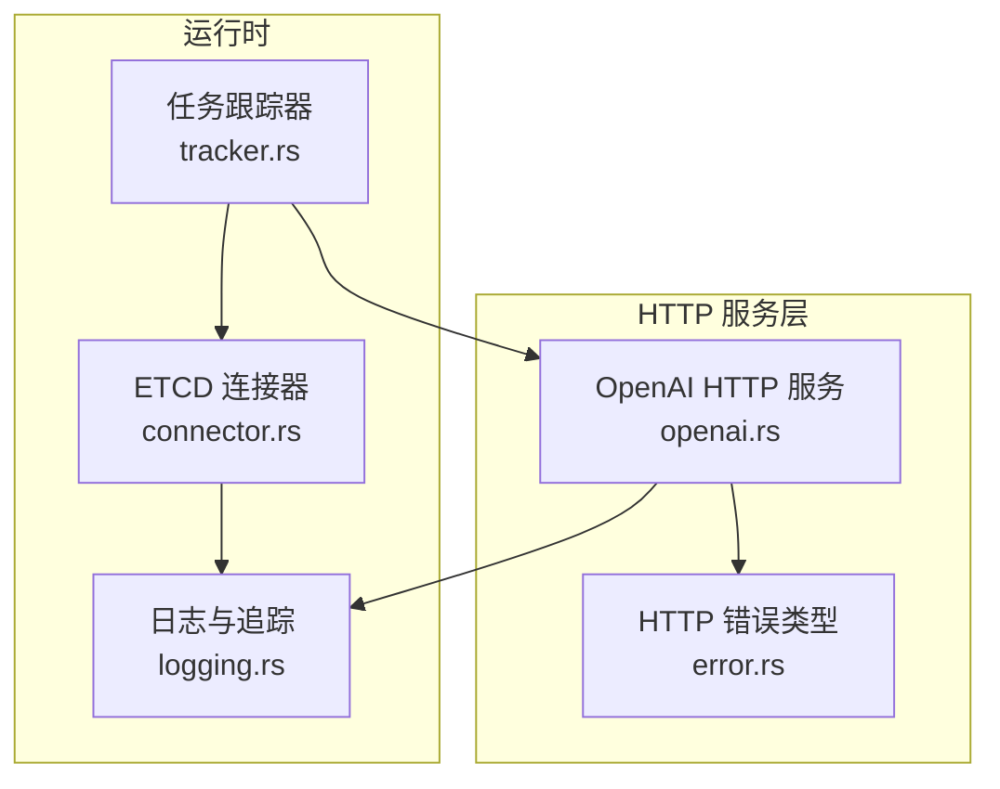
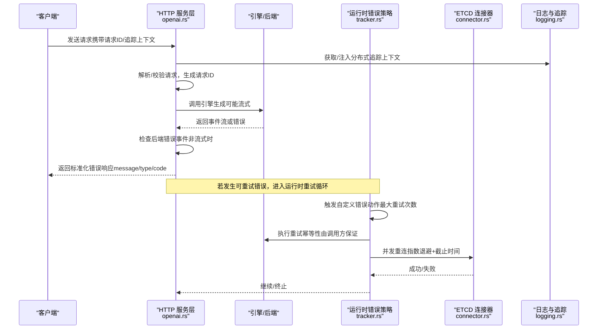
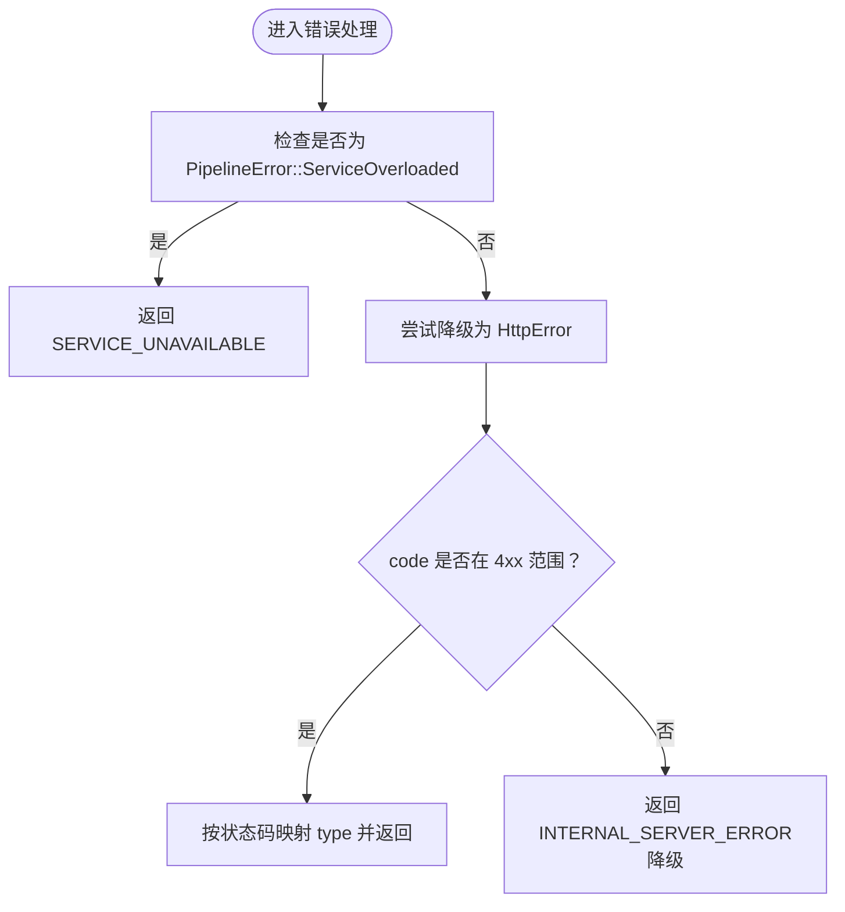
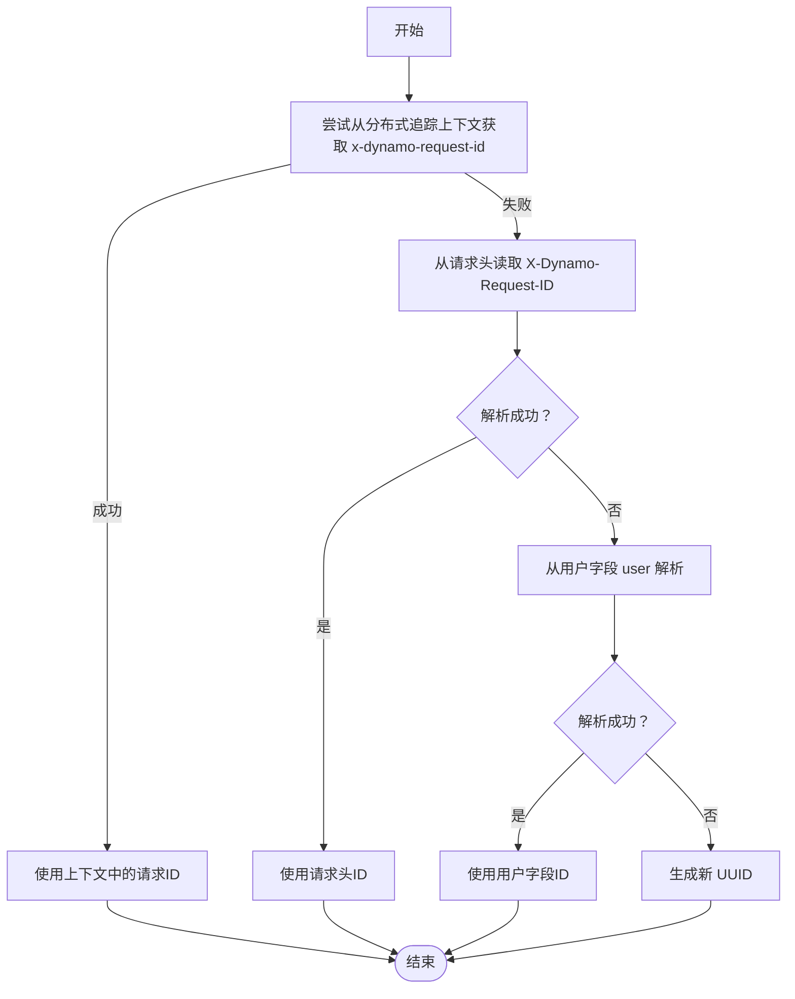
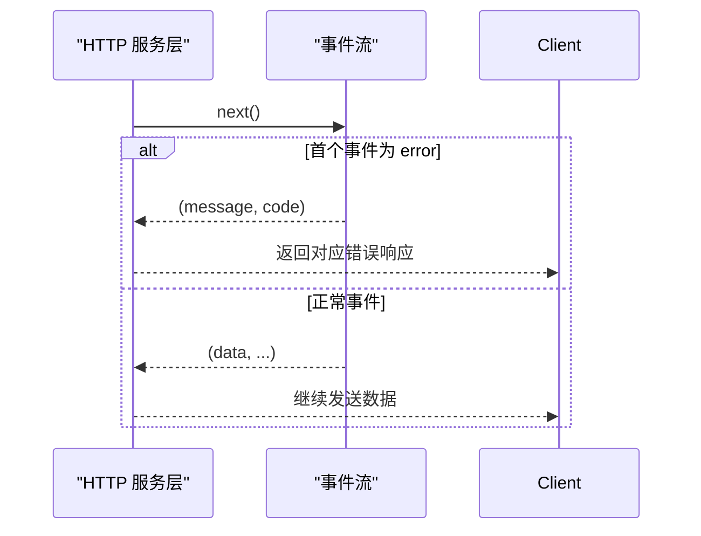
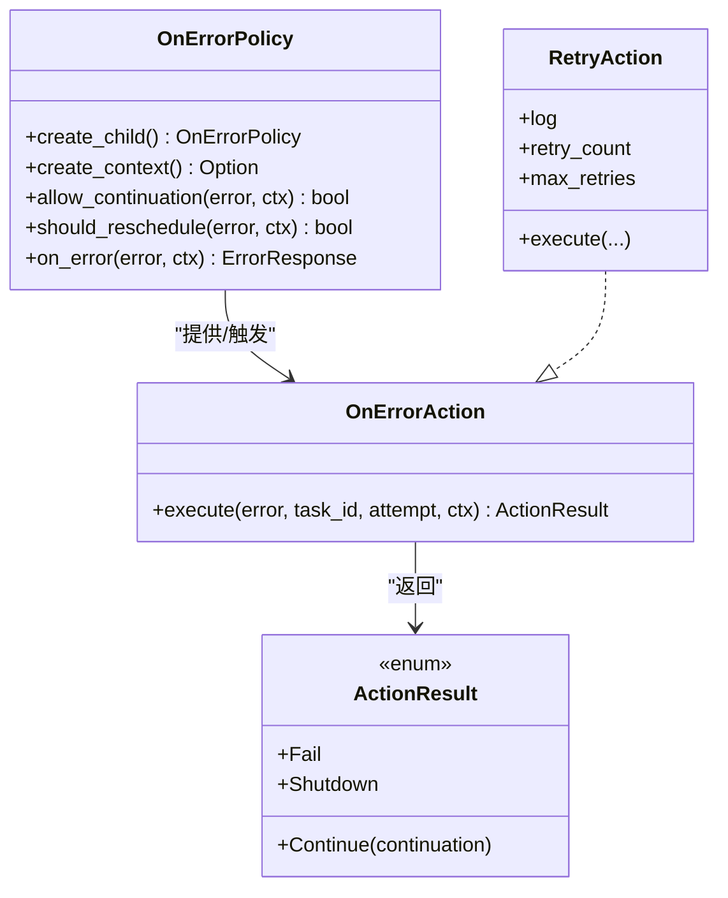
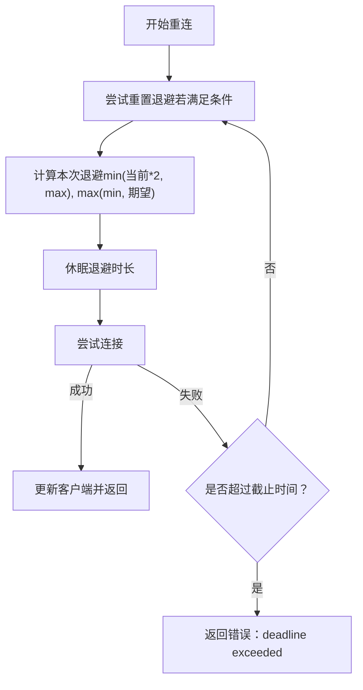
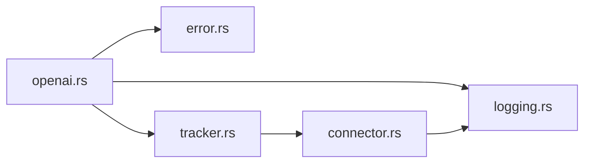

# 错误处理和重试

<cite>
**本文引用的文件**
- [openai.rs](file://lib/llm/src/http/service/openai.rs)
- [error.rs](file://lib/llm/src/http/service/error.rs)
- [tracker.rs](file://lib/runtime/src/utils/tasks/tracker.rs)
- [connector.rs](file://lib/runtime/src/transports/etcd/connector.rs)
- [logging.rs](file://lib/runtime/src/logging.rs)
</cite>

## 目录
1. [简介](#简介)
2. [项目结构](#项目结构)
3. [核心组件](#核心组件)
4. [架构总览](#架构总览)
5. [详细组件分析](#详细组件分析)
6. [依赖关系分析](#依赖关系分析)
7. [性能考量](#性能考量)
8. [故障排查指南](#故障排查指南)
9. [结论](#结论)

## 简介
本文件系统化梳理 Dynamo 在 HTTP 层与运行时层的错误处理与重试机制，覆盖以下关键主题：
- HTTP 错误响应的标准化格式（错误码、错误类型、错误消息）
- 错误类型分类与处理策略（模型不可用、请求超时、资源不足、验证失败、后端错误等）
- 客户端重试逻辑、退避策略与幂等性保障
- 错误日志记录、追踪 ID 生成与调试信息收集
- 分布式系统中的错误处理重要性与实现挑战

## 项目结构
围绕错误处理与重试的相关模块分布于以下位置：
- HTTP 服务层：统一的错误响应构造、错误类型映射、请求级追踪 ID 注入
- 运行时任务管理：可取消任务、错误策略、重试动作与回退控制
- 连接器重连：ETCD 连接器的指数退避与截止时间控制
- 日志与追踪：分布式追踪上下文提取、日志结构化与可观测性

图表来源
- [openai.rs](file://lib/llm/src/http/service/openai.rs#L79-L218)
- [error.rs](file://lib/llm/src/http/service/error.rs#L1-L50)
- [tracker.rs](file://lib/runtime/src/utils/tasks/tracker.rs#L1-L200)
- [connector.rs](file://lib/runtime/src/transports/etcd/connector.rs#L1-L168)
- [logging.rs](file://lib/runtime/src/logging.rs#L843-L970)

章节来源
- [openai.rs](file://lib/llm/src/http/service/openai.rs#L1-L245)
- [error.rs](file://lib/llm/src/http/service/error.rs#L1-L50)
- [tracker.rs](file://lib/runtime/src/utils/tasks/tracker.rs#L1-L200)
- [connector.rs](file://lib/runtime/src/transports/etcd/connector.rs#L1-L168)
- [logging.rs](file://lib/runtime/src/logging.rs#L843-L970)

## 核心组件
- HTTP 错误响应构造器：统一输出标准 JSON 结构，包含 message、type、code，并对 422 转换为 400 以兼容下游 OpenAI 兼容客户端
- 错误类型映射：将状态码映射为错误类型字符串，便于客户端识别错误类别
- 请求级追踪 ID：优先从分布式追踪上下文获取，其次从请求头或用户字段解析，最后生成新 UUID
- 运行时错误策略与重试：支持自定义错误动作（含最大重试次数）、连续重试动作、速率限制取消策略
- ETCD 连接器退避：指数退避、最小/最大退避、截止时间控制与并发重连互斥
- 日志与追踪：分布式追踪上下文注入与提取、结构化日志模式校验

章节来源
- [openai.rs](file://lib/llm/src/http/service/openai.rs#L79-L218)
- [openai.rs](file://lib/llm/src/http/service/openai.rs#L247-L278)
- [error.rs](file://lib/llm/src/http/service/error.rs#L1-L50)
- [tracker.rs](file://lib/runtime/src/utils/tasks/tracker.rs#L6210-L6336)
- [connector.rs](file://lib/runtime/src/transports/etcd/connector.rs#L112-L167)
- [logging.rs](file://lib/runtime/src/logging.rs#L843-L970)

## 架构总览
下图展示错误处理与重试在请求生命周期中的交互路径。

图表来源
- [openai.rs](file://lib/llm/src/http/service/openai.rs#L820-L854)
- [openai.rs](file://lib/llm/src/http/service/openai.rs#L963-L1032)
- [tracker.rs](file://lib/runtime/src/utils/tasks/tracker.rs#L6210-L6336)
- [connector.rs](file://lib/runtime/src/transports/etcd/connector.rs#L70-L99)
- [logging.rs](file://lib/runtime/src/logging.rs#L856-L868)

## 详细组件分析

### HTTP 错误响应标准化
- 标准结构
  - 字段：message（错误消息）、type（错误类型，来自状态码的规范原因）、code（数值状态码）
  - 422 统一转换为 400，确保下游兼容性
- 常见错误类型
  - 模型不可用：NOT_FOUND
  - 服务未就绪：SERVICE_UNAVAILABLE（内部服务过载会映射到此）
  - 内部错误：INTERNAL_SERVER_ERROR（通用兜底）
  - 未实现：NOT_IMPLEMENTED（用于尚未支持的功能）
  - 验证错误：BAD_REQUEST（由验证函数返回）
- 错误映射与降级
  - 从 anyhow::Error 中识别 PipelineError::ServiceOverloaded 映射为 SERVICE_UNAVAILABLE
  - 从 HttpError 提取 code/message，确保仅 4xx 错误对外暴露

图表来源
- [openai.rs](file://lib/llm/src/http/service/openai.rs#L159-L205)

章节来源
- [openai.rs](file://lib/llm/src/http/service/openai.rs#L79-L218)
- [openai.rs](file://lib/llm/src/http/service/openai.rs#L220-L245)

### 请求级追踪 ID 与分布式追踪
- 优先级
  - 从分布式追踪上下文提取 x-dynamo-request-id
  - 其次从请求头 X-Dynamo-Request-ID 或用户字段解析
  - 最后生成新的 UUID
- 日志与追踪
  - 提供 get_distributed_tracing_context 以在日志中注入 trace_id、span_id 等
  - 支持结构化日志模式校验，便于跨进程/容器一致采集

图表来源
- [openai.rs](file://lib/llm/src/http/service/openai.rs#L247-L278)
- [logging.rs](file://lib/runtime/src/logging.rs#L856-L868)

章节来源
- [openai.rs](file://lib/llm/src/http/service/openai.rs#L247-L278)
- [logging.rs](file://lib/runtime/src/logging.rs#L843-L970)

### 后端错误检测与 SSE 错误事件
- 流式场景：HTTP 200 发送后无法更改状态码，后端错误通过 SSE 事件“event: error”传递
- 非流式场景：在聚合前检查首个事件是否为错误，若是则立即返回对应状态码与错误体
- 该机制确保客户端能区分“连接已建立但后端报错”的两类情况

图表来源
- [openai.rs](file://lib/llm/src/http/service/openai.rs#L820-L854)
- [openai.rs](file://lib/llm/src/http/service/openai.rs#L963-L1032)

章节来源
- [openai.rs](file://lib/llm/src/http/service/openai.rs#L820-L854)
- [openai.rs](file://lib/llm/src/http/service/openai.rs#L963-L1032)

### 运行时错误策略与重试
- 可取消任务与重试动作
  - 自定义错误动作（OnErrorAction）可提供“继续执行”的延续（Continuation），并在达到最大重试次数后决定 Shutdown 或 Fail
  - 支持策略级控制（should_reschedule）决定是否重新获取执行资源
- 速率限制取消策略
  - 基于时间窗口内的失败率阈值触发取消，避免雪崩
- 重试循环与幂等性
  - 重试由错误动作驱动；幂等性需由上层调用保证（例如幂等键、去重队列）

图表来源
- [tracker.rs](file://lib/runtime/src/utils/tasks/tracker.rs#L6210-L6336)
- [tracker.rs](file://lib/runtime/src/utils/tasks/tracker.rs#L6338-L6366)

章节来源
- [tracker.rs](file://lib/runtime/src/utils/tasks/tracker.rs#L6210-L6336)
- [tracker.rs](file://lib/runtime/src/utils/tasks/tracker.rs#L6338-L6366)

### ETCD 连接器重连与退避
- 退避策略
  - 初始退避、最小/最大退避范围
  - 当前退避按 2 倍增长，上限受 max_backoff 限制
  - 若距离上次连接尝试超过当前退避，重置为 0（首次或长时间无连接）
- 截止时间控制
  - 每次尝试前计算剩余时间，避免超出 deadline
- 并发安全
  - 使用 Mutex 保证同一时刻仅一次重连操作

图表来源
- [connector.rs](file://lib/runtime/src/transports/etcd/connector.rs#L138-L167)
- [connector.rs](file://lib/runtime/src/transports/etcd/connector.rs#L70-L99)

章节来源
- [connector.rs](file://lib/runtime/src/transports/etcd/connector.rs#L112-L167)
- [connector.rs](file://lib/runtime/src/transports/etcd/connector.rs#L70-L99)

### 错误类型分类与处理策略
- 模型不可用（NOT_FOUND）
  - 场景：路由到不存在的模型
  - 处理：直接返回 NOT_FOUND，不进行重试
- 服务未就绪（SERVICE_UNAVAILABLE）
  - 场景：内部服务过载或健康检查未就绪
  - 处理：返回 503，建议客户端指数退避后重试
- 验证错误（BAD_REQUEST）
  - 场景：必填字段缺失、参数非法、流式选项使用不当
  - 处理：返回 400，不重试（客户端修正后重试）
- 未实现（NOT_IMPLEMENTED）
  - 场景：使用了计划中但未实现的特性
  - 处理：返回 501，建议等待版本升级
- 内部错误（INTERNAL_SERVER_ERROR）
  - 场景：引擎异常、序列化失败、未知错误
  - 处理：返回 500，建议指数退避重试，注意幂等性

章节来源
- [openai.rs](file://lib/llm/src/http/service/openai.rs#L94-L122)
- [openai.rs](file://lib/llm/src/http/service/openai.rs#L159-L205)
- [openai.rs](file://lib/llm/src/http/service/openai.rs#L1038-L1137)

## 依赖关系分析
- HTTP 服务层依赖
  - 错误类型定义（error.rs）
  - 分布式追踪上下文（logging.rs）
  - 引擎/后端返回的事件流（用于检测后端错误）
- 运行时层依赖
  - 任务跟踪器（tracker.rs）提供错误策略与重试动作
  - ETCD 连接器（connector.rs）提供重连与退避
- 日志与追踪
  - 通过 tracing-opentelemetry 注入 trace_id、span_id，支持结构化日志模式校验

图表来源
- [openai.rs](file://lib/llm/src/http/service/openai.rs#L32-L42)
- [error.rs](file://lib/llm/src/http/service/error.rs#L1-L50)
- [logging.rs](file://lib/runtime/src/logging.rs#L935-L970)
- [tracker.rs](file://lib/runtime/src/utils/tasks/tracker.rs#L1-L200)
- [connector.rs](file://lib/runtime/src/transports/etcd/connector.rs#L1-L168)

章节来源
- [openai.rs](file://lib/llm/src/http/service/openai.rs#L32-L42)
- [error.rs](file://lib/llm/src/http/service/error.rs#L1-L50)
- [logging.rs](file://lib/runtime/src/logging.rs#L935-L970)
- [tracker.rs](file://lib/runtime/src/utils/tasks/tracker.rs#L1-L200)
- [connector.rs](file://lib/runtime/src/transports/etcd/connector.rs#L1-L168)

## 性能考量
- 退避与抖动
  - 指数退避可平滑突发流量，避免雪崩
  - 建议在客户端引入随机抖动（例如 ±10%）进一步分散峰值
- 资源隔离
  - 使用速率限制与失败率阈值策略（RateCancelPolicy）保护上游
  - 对可取消任务采用分层重试，避免一次性大量重试
- 日志与追踪开销
  - 结构化日志与 OTel 导出会带来额外 CPU/IO 开销，建议在生产环境按需采样
- 流式错误处理
  - SSE 错误事件避免了状态码变更的代价，但需要客户端正确消费事件流

## 故障排查指南
- 常见错误与定位
  - 400 验证错误：检查必填字段与参数合法性
  - 404 模型不可用：确认模型名称与路由配置
  - 501 未实现：确认功能是否在当前版本支持
  - 503 服务未就绪：查看健康检查与资源占用
  - 500 内部错误：结合 trace_id 定位具体阶段
- 日志与追踪
  - 使用 get_distributed_tracing_context 确认 trace_id 一致性
  - 通过结构化日志模式校验（LOG_LINE_SCHEMA）快速定位异常
- 重试与幂等性
  - 确保重试请求具备幂等键或去重机制
  - 设置最大重试次数与总超时，避免无限重试
- ETCD 连接问题
  - 关注重连日志与退避时长，必要时调整初始/最大退避与截止时间

章节来源
- [openai.rs](file://lib/llm/src/http/service/openai.rs#L159-L205)
- [logging.rs](file://lib/runtime/src/logging.rs#L1361-L1516)
- [tracker.rs](file://lib/runtime/src/utils/tasks/tracker.rs#L6210-L6336)
- [connector.rs](file://lib/runtime/src/transports/etcd/connector.rs#L147-L167)

## 结论
Dynamo 的错误处理与重试体系通过“标准化 HTTP 错误响应 + 分布式追踪 + 运行时可插拔错误策略 + 指数退避重连”实现了高可用与可观测性。实践中应重点关注：
- 错误分类与客户端策略匹配（幂等性、最大重试、总超时）
- 速率限制与失败率阈值，防止级联故障
- 结构化日志与追踪上下文，提升定位效率
- 流式场景下的 SSE 错误事件处理与客户端兼容性