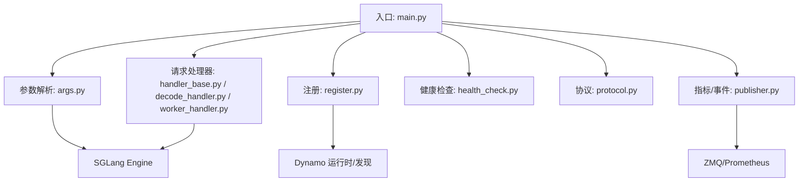
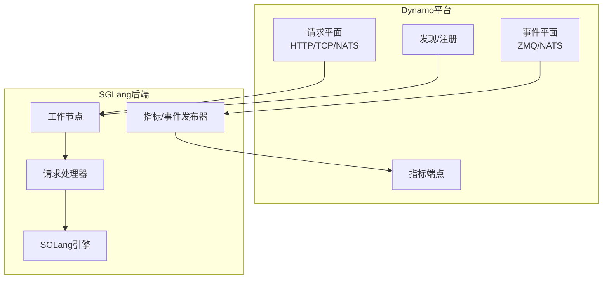
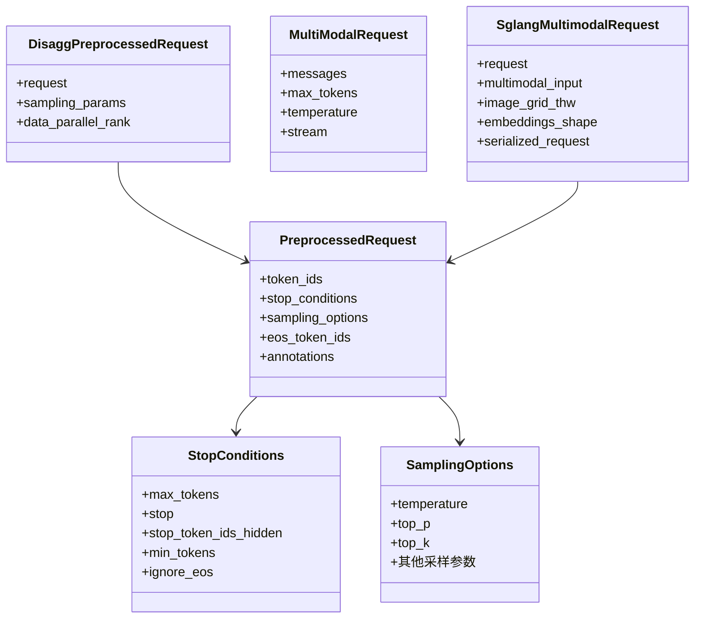
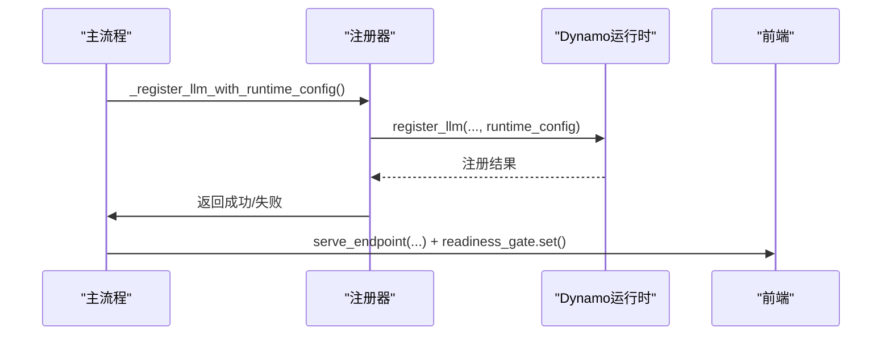
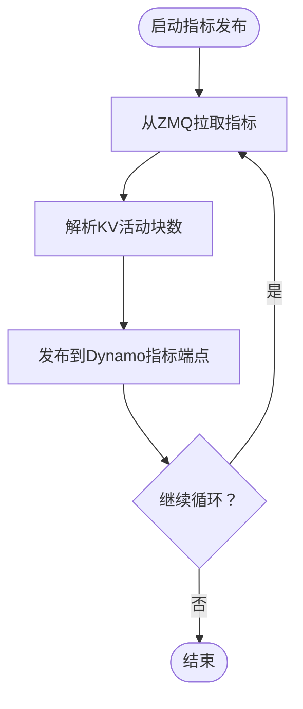
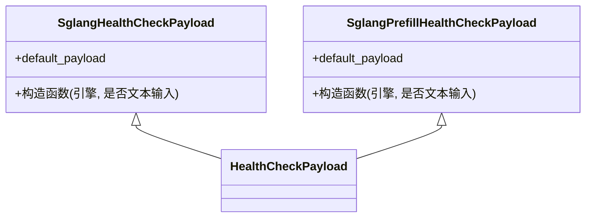
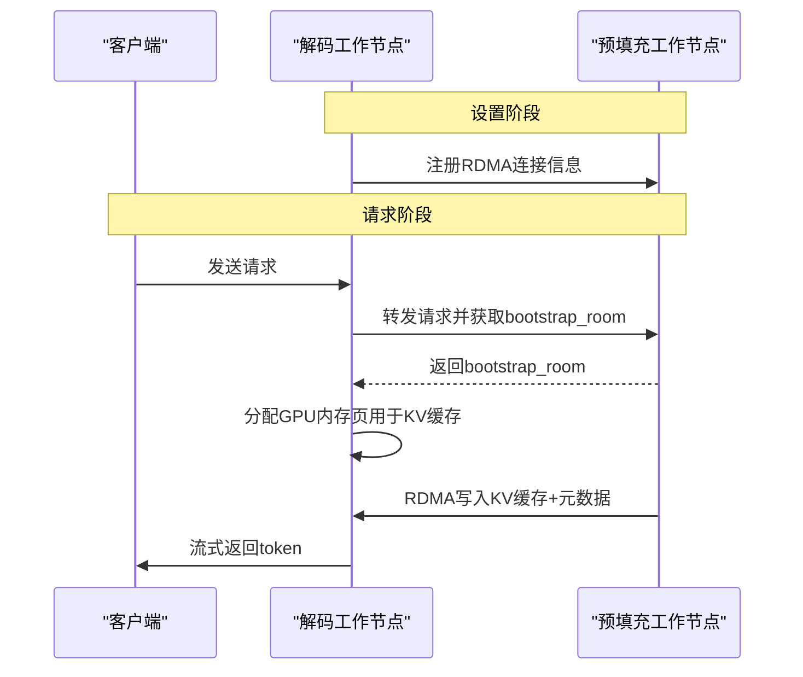
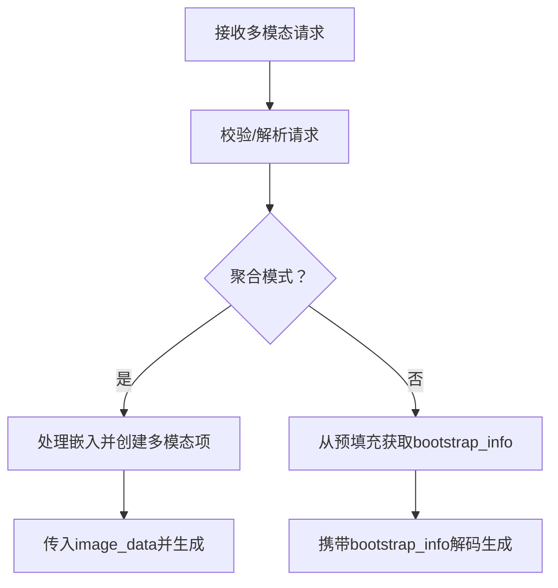
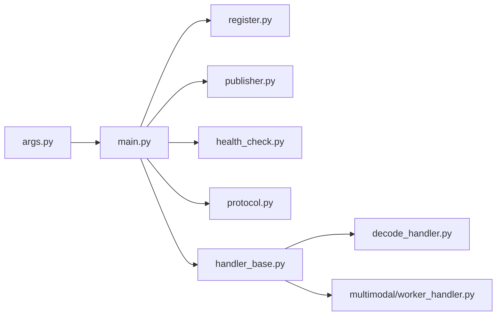

# SGLang后端

<cite>
**本文档引用的文件**
- [components/src/dynamo/sglang/main.py](file://components/src/dynamo/sglang/main.py)
- [components/src/dynamo/sglang/register.py](file://components/src/dynamo/sglang/register.py)
- [components/src/dynamo/sglang/publisher.py](file://components/src/dynamo/sglang/publisher.py)
- [components/src/dynamo/sglang/health_check.py](file://components/src/dynamo/sglang/health_check.py)
- [components/src/dynamo/sglang/protocol.py](file://components/src/dynamo/sglang/protocol.py)
- [components/src/dynamo/sglang/args.py](file://components/src/dynamo/sglang/args.py)
- [components/src/dynamo/sglang/request_handlers/handler_base.py](file://components/src/dynamo/sglang/request_handlers/handler_base.py)
- [components/src/dynamo/sglang/request_handlers/llm/decode_handler.py](file://components/src/dynamo/sglang/request_handlers/llm/decode_handler.py)
- [components/src/dynamo/sglang/request_handlers/multimodal/worker_handler.py](file://components/src/dynamo/sglang/request_handlers/multimodal/worker_handler.py)
- [docs/backends/sglang/README.md](file://docs/backends/sglang/README.md)
- [docs/backends/sglang/expert-distribution-eplb.md](file://docs/backends/sglang/expert-distribution-eplb.md)
- [docs/backends/sglang/sglang-disaggregation.md](file://docs/backends/sglang/sglang-disaggregation.md)
- [docs/backends/sglang/gpt-oss.md](file://docs/backends/sglang/gpt-oss.md)
</cite>

## 目录
1. [简介](#简介)
2. [项目结构](#项目结构)
3. [核心组件](#核心组件)
4. [架构总览](#架构总览)
5. [详细组件分析](#详细组件分析)
6. [依赖关系分析](#依赖关系分析)
7. [性能考量](#性能考量)
8. [故障排查指南](#故障排查指南)
9. [结论](#结论)
10. [附录](#附录)

## 简介
本文件系统性阐述SGLang后端在Dynamo平台中的架构与实现，覆盖协议处理、注册机制、发布订阅模式、健康检查、高吞吐服务特性（专家分布均衡、EPLB算法、HiCache优化）、多模态处理、GPT-OSS支持、分解聚合架构等关键能力，并提供性能基准测试方法、配置优化策略、监控指标与故障排查指南，帮助开发者充分发挥SGLang的高吞吐优势。

## 项目结构
SGLang后端位于components/src/dynamo/sglang目录，采用按职责分层的模块化组织：
- 入口与运行时：main.py负责参数解析、分布式运行时初始化、工作节点角色处理、端点注册与健康检查
- 注册与发现：register.py负责模型注册、运行时配置提取与发布
- 指标与事件：publisher.py负责ZMQ指标接收与发布、Prometheus注册
- 健康检查：health_check.py定义SGLang专用健康检查载荷
- 协议定义：protocol.py定义标准LLM协议类型与多模态协议
- 参数解析：args.py统一解析Dynamo与SGLang参数并生成配置对象
- 请求处理器：request_handlers目录下按功能划分（基础类、LLM解码、多模态）
- 文档：docs/backends/sglang目录提供特性说明、部署示例与技术细节

**图表来源**
- [components/src/dynamo/sglang/main.py](file://components/src/dynamo/sglang/main.py#L69-L123)
- [components/src/dynamo/sglang/args.py](file://components/src/dynamo/sglang/args.py#L324-L585)
- [components/src/dynamo/sglang/register.py](file://components/src/dynamo/sglang/register.py#L18-L68)
- [components/src/dynamo/sglang/publisher.py](file://components/src/dynamo/sglang/publisher.py#L170-L201)
- [components/src/dynamo/sglang/health_check.py](file://components/src/dynamo/sglang/health_check.py#L50-L121)
- [components/src/dynamo/sglang/protocol.py](file://components/src/dynamo/sglang/protocol.py#L14-L134)
- [components/src/dynamo/sglang/request_handlers/handler_base.py](file://components/src/dynamo/sglang/request_handlers/handler_base.py#L21-L60)

**章节来源**
- [components/src/dynamo/sglang/main.py](file://components/src/dynamo/sglang/main.py#L69-L123)
- [components/src/dynamo/sglang/args.py](file://components/src/dynamo/sglang/args.py#L324-L585)

## 核心组件
- 配置容器与参数解析：Config封装ServerArgs与DynamoArgs，统一解析CLI与配置文件，自动推断端点、解析工具/推理解析器、设置流输出等
- 分布式运行时集成：通过DistributedRuntime接入Dynamo的命名空间、组件与端点，支持HTTP/TCP/NATS请求平面与ZMQ/NATS事件平面
- 注册与就绪门：register_llm_with_readiness_gate在模型注册成功后通过事件信号通知前端可接受请求
- 指标与事件发布：DynamoSglangPublisher从SGLang引擎接收ZMQ指标并发布到Dynamo指标端点，同时可配置KV事件发布
- 健康检查：SglangHealthCheckPayload/SglangPrefillHealthCheckPayload提供默认健康检查载荷，自动提取BOS token
- 请求处理器：BaseWorkerHandler抽象基类提供取消监控、内存占用释放/恢复、profile控制、引导信息管理；DecodeWorkerHandler与MultimodalWorkerHandler分别处理解码与多模态请求

**章节来源**
- [components/src/dynamo/sglang/args.py](file://components/src/dynamo/sglang/args.py#L183-L214)
- [components/src/dynamo/sglang/register.py](file://components/src/dynamo/sglang/register.py#L224-L265)
- [components/src/dynamo/sglang/publisher.py](file://components/src/dynamo/sglang/publisher.py#L51-L134)
- [components/src/dynamo/sglang/health_check.py](file://components/src/dynamo/sglang/health_check.py#L50-L121)
- [components/src/dynamo/sglang/request_handlers/handler_base.py](file://components/src/dynamo/sglang/request_handlers/handler_base.py#L21-L60)

## 架构总览
SGLang后端在Dynamo中以“工作节点”形式运行，支持聚合与分解两种服务模式。聚合模式下，单个引擎同时承担prefill与decode；分解模式下，prefill与decode分离，通过RDMA进行KV缓存传输。Dynamo负责路由、发现、事件与指标，SGLang负责推理执行与内存管理。

**图表来源**
- [components/src/dynamo/sglang/main.py](file://components/src/dynamo/sglang/main.py#L91-L96)
- [components/src/dynamo/sglang/publisher.py](file://components/src/dynamo/sglang/publisher.py#L170-L201)
- [components/src/dynamo/sglang/register.py](file://components/src/dynamo/sglang/register.py#L18-L68)

## 详细组件分析

### 协议处理与数据模型
- 标准LLM协议：StopConditions、SamplingOptions、PreprocessedRequest、EmbeddingRequest等，统一输入/采样/停止条件
- 分解协议：DisaggPreprocessedRequest、DisaggSglangMultimodalRequest，承载采样参数与数据并行rank
- 多模态协议：TextContent/ImageContent/VideoContent、ChatMessage、MultiModalRequest、SglangMultimodalRequest，支持图像/视频URL与嵌入形状

**图表来源**
- [components/src/dynamo/sglang/protocol.py](file://components/src/dynamo/sglang/protocol.py#L19-L67)
- [components/src/dynamo/sglang/protocol.py](file://components/src/dynamo/sglang/protocol.py#L105-L134)

**章节来源**
- [components/src/dynamo/sglang/protocol.py](file://components/src/dynamo/sglang/protocol.py#L14-L134)

### 注册机制与就绪门
- 运行时配置提取：从SGLang引擎与参数中提取最大序列数、批tokens上限、总KV块数、分解端点等
- 模型注册：根据输入/输出类型完成注册，支持自定义Jinja模板与推理/工具解析器
- 就绪门：注册成功后设置事件，前端开始接受请求

**图表来源**
- [components/src/dynamo/sglang/register.py](file://components/src/dynamo/sglang/register.py#L18-L68)
- [components/src/dynamo/sglang/register.py](file://components/src/dynamo/sglang/register.py#L224-L265)

**章节来源**
- [components/src/dynamo/sglang/register.py](file://components/src/dynamo/sglang/register.py#L147-L222)

### 发布订阅模式（指标与KV事件）
- 指标发布：DynamoSglangPublisher通过ZMQ从SGLang引擎接收调度器指标，使用WorkerMetricsPublisher发布到Dynamo指标端点
- 事件发布：当启用KV事件时，基于配置创建ZmqKvEventPublisher，格式化ZMQ端点并发布KV事件
- Prometheus集成：延迟导入prometheus_client并在SGLang引擎设置共享内存目录后注册回调

**图表来源**
- [components/src/dynamo/sglang/publisher.py](file://components/src/dynamo/sglang/publisher.py#L90-L105)
- [components/src/dynamo/sglang/publisher.py](file://components/src/dynamo/sglang/publisher.py#L170-L201)

**章节来源**
- [components/src/dynamo/sglang/publisher.py](file://components/src/dynamo/sglang/publisher.py#L51-L134)

### 健康检查实现
- 解码健康检查：默认生成1 token，禁用EOS，温度0，提供token_ids或文本提示
- 预填充健康检查：包装请求结构，适用于分解模式的预填充阶段
- BOS token自动提取：优先从引擎tokenizer获取，否则回退为默认值

**图表来源**
- [components/src/dynamo/sglang/health_check.py](file://components/src/dynamo/sglang/health_check.py#L50-L86)
- [components/src/dynamo/sglang/health_check.py](file://components/src/dynamo/sglang/health_check.py#L88-L121)

**章节来源**
- [components/src/dynamo/sglang/health_check.py](file://components/src/dynamo/sglang/health_check.py#L20-L47)

### 高吞吐服务特性

#### 专家分布均衡（EPLB）
- 冗余专家：为热门专家创建副本，扩大可调度池
- 组受限路由：利用专家组结构减少跨节点流量
- 负载均衡策略：分层全局两种策略，动态重平衡
- 统计记录：per_token/per_pass/stat/stat_approx多种粒度，支持预设布局

**章节来源**
- [docs/backends/sglang/expert-distribution-eplb.md](file://docs/backends/sglang/expert-distribution-eplb.md#L1-L62)

#### 分解聚合架构（Prefill-Decode）
- 设置阶段：解码工作节点向预填充工作节点注册RDMA连接信息
- 请求阶段：客户端→解码；解码→预填充获取bootstrap_room；解码分配KV页；预填充执行前向；RDMA零拷贝传输KV；解码使用KV生成token并流式返回

**图表来源**
- [docs/backends/sglang/sglang-disaggregation.md](file://docs/backends/sglang/sglang-disaggregation.md#L37-L67)

**章节来源**
- [docs/backends/sglang/sglang-disaggregation.md](file://docs/backends/sglang/sglang-disaggregation.md#L1-L89)

### 多模态处理能力
- 多模态协议：支持文本、图像URL、视频URL消息内容
- 嵌入处理：通过NIXL Connector读取序列化的嵌入张量，构建预计算嵌入项
- 生成流程：聚合模式直接传入image_data；分解模式先从预填充获取bootstrap信息再解码

**图表来源**
- [components/src/dynamo/sglang/request_handlers/multimodal/worker_handler.py](file://components/src/dynamo/sglang/request_handlers/multimodal/worker_handler.py#L272-L325)
- [components/src/dynamo/sglang/request_handlers/multimodal/worker_handler.py](file://components/src/dynamo/sglang/request_handlers/multimodal/worker_handler.py#L408-L465)

**章节来源**
- [components/src/dynamo/sglang/request_handlers/multimodal/worker_handler.py](file://components/src/dynamo/sglang/request_handlers/multimodal/worker_handler.py#L227-L406)

### GPT-OSS支持
- 推理与工具调用：需正确设置推理解析器与工具调用解析器
- 分解部署：解码与预填充分别在不同设备上运行，使用NIXL作为传输后端

**章节来源**
- [docs/backends/sglang/gpt-oss.md](file://docs/backends/sglang/gpt-oss.md#L1-L49)

## 依赖关系分析
SGLang后端各模块间依赖清晰，遵循“配置→运行时→处理器→引擎”的链路，注册与发布模块独立于业务逻辑，便于扩展与维护。

**图表来源**
- [components/src/dynamo/sglang/main.py](file://components/src/dynamo/sglang/main.py#L19-L34)
- [components/src/dynamo/sglang/args.py](file://components/src/dynamo/sglang/args.py#L324-L585)

**章节来源**
- [components/src/dynamo/sglang/main.py](file://components/src/dynamo/sglang/main.py#L19-L34)

## 性能考量
- 流式输出：强制开启stream_output=true，确保SGLang发送离散片段，降低首token时间与带宽占用
- 预热策略：预填充工作节点在leader节点进行预热，避免首次TTFT尖峰
- EPLB：对MoE模型进行冗余专家与动态重平衡，提升GPU利用率
- 分解架构：预填充与解码分离，结合RDMA零拷贝传输，最大化资源利用
- 指标与事件：通过ZMQ/Prometheus实时观测KV活跃块与调度状态，辅助容量规划

**章节来源**
- [components/src/dynamo/sglang/args.py](file://components/src/dynamo/sglang/args.py#L529-L531)
- [components/src/dynamo/sglang/main.py](file://components/src/dynamo/sglang/main.py#L617-L650)
- [docs/backends/sglang/expert-distribution-eplb.md](file://docs/backends/sglang/expert-distribution-eplb.md#L32-L52)

## 故障排查指南
- 健康检查失败：检查BOS token提取与采样参数，确认预填充/解码工作节点均可用
- 注册失败：核对模型路径、服务名、端点类型与运行时配置，查看日志中的错误堆栈
- 取消请求：聚合模式下解码阶段支持取消；分解模式预填充阶段存在限制，注意客户端断连后的清理
- 指标缺失：确认ZMQ端点格式（含IPv6括号）与本地索引器开关，检查Prometheus注册时机
- 多模态错误：核对嵌入形状与token数量一致性，避免tokenization变化导致的对齐问题

**章节来源**
- [components/src/dynamo/sglang/health_check.py](file://components/src/dynamo/sglang/health_check.py#L20-L47)
- [components/src/dynamo/sglang/register.py](file://components/src/dynamo/sglang/register.py#L51-L67)
- [components/src/dynamo/sglang/request_handlers/handler_base.py](file://components/src/dynamo/sglang/request_handlers/handler_base.py#L290-L344)
- [components/src/dynamo/sglang/publisher.py](file://components/src/dynamo/sglang/publisher.py#L27-L49)
- [components/src/dynamo/sglang/request_handlers/multimodal/worker_handler.py](file://components/src/dynamo/sglang/request_handlers/multimodal/worker_handler.py#L360-L376)

## 结论
SGLang后端在Dynamo平台上实现了高性能、可扩展的推理服务，通过分解架构、EPLB、多模态与统一协议等能力，满足大规模推理场景需求。配合完善的注册、发布订阅与健康检查机制，开发者可以快速部署并优化服务性能。

## 附录

### 部署示例与最佳实践
- 单机聚合/分解部署：参考文档中的脚本与命令，结合Docker Compose启动基础设施
- Kubernetes/SLURM：使用示例脚本与YAML配置，按需调整资源与拓扑
- GPT-OSS：启用推理/工具解析器，分解部署并配置NIXL传输后端

**章节来源**
- [docs/backends/sglang/README.md](file://docs/backends/sglang/README.md#L162-L278)
- [docs/backends/sglang/gpt-oss.md](file://docs/backends/sglang/gpt-oss.md#L11-L49)

### 性能基准测试方法
- 使用仓库中的基准脚本与工具，结合不同模型规模与并发配置
- 关注TTFT、ITL、吞吐与KV缓存命中率等指标
- 在分解模式下评估RDMA传输延迟与CPU占用

**章节来源**
- [docs/backends/sglang/README.md](file://docs/backends/sglang/README.md#L22-L43)